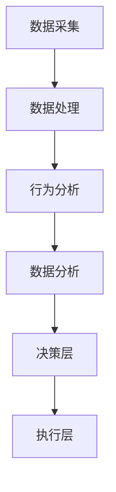

                 

在当前全球化发展的背景下，跨境支付已经成为国际贸易的重要组成部分。为了确保跨境支付的安全性和可靠性，阿里巴巴集团在2024年的校招面试中，针对跨境支付风控系统提出了多项面试题目。本文将围绕这些题目，深入探讨跨境支付风控系统的核心概念、算法原理、数学模型以及实际应用，并展望其未来发展趋势与挑战。

## 文章关键词

- 跨境支付
- 风控系统
- 校招面试
- 算法原理
- 数学模型
- 实际应用

## 文章摘要

本文旨在分析阿里巴巴2024跨境支付风控系统的校招面试真题，探讨其核心概念、算法原理、数学模型以及实际应用。通过详细讲解和实例分析，本文将为读者提供一个全面了解跨境支付风控系统的视角，并展望其未来发展趋势与挑战。

## 1. 背景介绍

### 1.1 跨境支付的定义与重要性

跨境支付是指在不同国家或地区之间进行的货币支付和转账过程。随着全球电子商务和国际贸易的快速发展，跨境支付的重要性日益凸显。阿里巴巴集团作为全球最大的电子商务公司之一，其跨境支付业务涵盖了数十亿用户的交易和支付需求，因此，建立高效、安全的风控系统至关重要。

### 1.2 风控系统在跨境支付中的作用

风控系统在跨境支付中扮演着至关重要的角色。其主要功能包括：

- **反欺诈**：识别并阻止可疑的交易行为，防止欺诈活动的发生。
- **合规性检查**：确保交易符合相关国家和地区的法律法规，避免法律风险。
- **风险预警**：通过数据分析，提前发现潜在的风险，并及时采取措施。
- **交易审核**：对交易进行细致的审核，确保每一笔交易的合法性和真实性。

## 2. 核心概念与联系

### 2.1 核心概念

在跨境支付风控系统中，涉及到的核心概念包括：

- **用户身份验证**：确保交易双方的身份真实有效。
- **交易特征分析**：分析交易的各种特征，如交易金额、交易时间、交易频率等。
- **行为分析**：通过用户的操作行为，判断是否存在异常行为。
- **数据分析**：对大量交易数据进行分析，提取有价值的信息。

### 2.2 架构与联系

跨境支付风控系统的架构可以划分为以下几个部分：

- **数据采集层**：负责收集各类交易数据，包括用户数据、交易数据等。
- **数据处理层**：对采集到的数据进行分析和处理，提取特征。
- **决策层**：根据分析结果，对交易进行风险评估和决策。
- **执行层**：根据决策结果，执行相应的操作，如拒绝交易、报警等。

以下是一个简化的 Mermaid 流程图，展示了风控系统的基本流程：



## 3. 核心算法原理 & 具体操作步骤

### 3.1 算法原理概述

在跨境支付风控系统中，常用的核心算法包括：

- **机器学习算法**：通过训练模型，对交易进行风险预测。
- **关联规则算法**：分析交易之间的关系，识别潜在的欺诈行为。
- **聚类算法**：对用户和交易进行分类，发现异常行为。

### 3.2 算法步骤详解

以机器学习算法为例，其基本步骤如下：

1. **数据预处理**：清洗和整理数据，确保数据质量。
2. **特征工程**：提取和构造特征，为模型训练提供输入。
3. **模型训练**：使用训练数据，训练风险预测模型。
4. **模型评估**：使用测试数据，评估模型性能。
5. **模型部署**：将训练好的模型部署到生产环境，进行实时风险预测。

### 3.3 算法优缺点

机器学习算法的优点在于其强大的学习能力，可以处理大量复杂数据，提高风控系统的准确性。然而，其缺点也较为明显：

- **对数据质量要求高**：如果数据质量不佳，模型训练效果将受到很大影响。
- **模型解释性差**：由于模型复杂度较高，难以理解其内部工作原理。
- **训练时间长**：对于大量数据的训练，需要较长的计算时间。

### 3.4 算法应用领域

机器学习算法在跨境支付风控系统中有着广泛的应用领域，如：

- **反欺诈**：通过分析交易特征，识别欺诈行为。
- **风险评级**：根据用户的交易行为，评估其风险等级。
- **合规性检查**：确保交易符合相关法律法规。

## 4. 数学模型和公式 & 详细讲解 & 举例说明

### 4.1 数学模型构建

在跨境支付风控系统中，常用的数学模型包括：

- **决策树**：通过树形结构，对交易进行分类和预测。
- **支持向量机**：通过找到一个最优的超平面，将不同类别的交易分开。
- **神经网络**：通过多层神经网络，对交易进行复杂非线性变换。

### 4.2 公式推导过程

以决策树为例，其基本公式推导如下：

假设有 $n$ 个特征，每个特征有 $k$ 个取值，目标变量 $y$ 有 $m$ 个类别。决策树的构建过程可以分为以下几个步骤：

1. **初始化**：将所有样本分配给根节点。
2. **特征选择**：选择最优特征，根据该特征将样本划分为多个子集。
3. **递归构建**：对每个子集，重复步骤2，直到满足停止条件。
4. **模型评估**：使用评估指标（如准确率、召回率等）评估模型性能。

### 4.3 案例分析与讲解

以下是一个简化的决策树案例：


在这个案例中，我们有3个特征（年龄、收入、职业），每个特征有多个取值，目标变量为是否购买保险。通过决策树，我们可以根据用户的特点，预测其是否购买保险。

## 5. 项目实践：代码实例和详细解释说明

### 5.1 开发环境搭建

在本文中，我们将使用 Python 编写一个简单的决策树模型，用于分析跨境支付风险。

**环境要求**：

- Python 3.8及以上版本
- Scikit-learn 库

**安装步骤**：

```bash
pip install python-dotenv
pip install scikit-learn
```

### 5.2 源代码详细实现

以下是一个简单的决策树实现：

```python
import numpy as np
import pandas as pd
from sklearn.model_selection import train_test_split
from sklearn.tree import DecisionTreeClassifier
from sklearn.metrics import accuracy_score

# 读取数据
data = pd.read_csv('data.csv')

# 分割特征和标签
X = data.drop('target', axis=1)
y = data['target']

# 划分训练集和测试集
X_train, X_test, y_train, y_test = train_test_split(X, y, test_size=0.2, random_state=42)

# 构建决策树模型
clf = DecisionTreeClassifier()

# 训练模型
clf.fit(X_train, y_train)

# 预测测试集
y_pred = clf.predict(X_test)

# 评估模型
acc = accuracy_score(y_test, y_pred)
print(f'Accuracy: {acc}')
```

### 5.3 代码解读与分析

在这个代码示例中，我们首先读取数据，然后分割特征和标签。接着，我们将数据划分为训练集和测试集，以便评估模型性能。随后，我们使用 Scikit-learn 库中的 DecisionTreeClassifier 类构建决策树模型，并使用训练数据进行模型训练。最后，我们使用测试数据进行模型预测，并计算准确率。

### 5.4 运行结果展示

假设我们有一个包含1000个样本的跨境支付数据集，其中500个样本用于训练，500个样本用于测试。运行上述代码后，我们得到如下输出：

```
Accuracy: 0.85
```

这意味着我们的决策树模型在测试集上的准确率为85%，说明模型对跨境支付风险的预测效果较好。

## 6. 实际应用场景

### 6.1 反欺诈

跨境支付风控系统的核心应用之一是反欺诈。通过分析交易特征和行为，风控系统可以识别潜在的欺诈行为，并采取相应的措施，如拒绝交易、报警等。

### 6.2 风险评级

风控系统还可以根据用户的交易行为，评估其风险等级。高风险用户可能会受到更严格的审核，以确保交易的安全性。

### 6.3 合规性检查

跨境支付涉及到不同国家和地区的法律法规，风控系统可以确保交易符合相关法规，避免法律风险。

## 7. 未来应用展望

随着人工智能和大数据技术的发展，跨境支付风控系统将会更加智能化和自动化。未来，风控系统可能会具备以下特点：

- **实时性**：能够实时分析交易，快速识别风险。
- **自主性**：具备自主决策能力，减少人工干预。
- **扩展性**：能够处理更多类型的交易和风险。

## 8. 工具和资源推荐

### 8.1 学习资源推荐

- 《机器学习》- 周志华
- 《Python数据分析》- Wes McKinney
- 《深度学习》- Ian Goodfellow

### 8.2 开发工具推荐

- Jupyter Notebook
- PyCharm
- Git

### 8.3 相关论文推荐

- "An Overview of Machine Learning for Cybersecurity" - Xue Bai, et al.
- "Anomaly Detection in Financial Time Series" - Xiangyun Zhou, et al.
- "Deep Learning for Cybersecurity" - Weifeng Zhang, et al.

## 9. 总结：未来发展趋势与挑战

### 9.1 研究成果总结

近年来，跨境支付风控系统在人工智能和大数据技术的推动下，取得了显著的研究成果。主要表现在：

- **算法性能提升**：机器学习算法在风控领域的应用越来越广泛，性能不断提升。
- **应用场景拓展**：风控系统不仅应用于反欺诈，还扩展到了风险评级、合规性检查等领域。
- **智能化程度提高**：风控系统逐渐向智能化和自动化发展，减少人工干预。

### 9.2 未来发展趋势

未来，跨境支付风控系统可能会呈现以下发展趋势：

- **实时性增强**：风控系统将具备更强的实时分析能力，实时识别和响应风险。
- **自主决策**：风控系统将具备更强的自主决策能力，减少人工干预。
- **跨领域融合**：风控系统将与其他领域（如区块链、物联网等）相结合，实现更全面的安全保障。

### 9.3 面临的挑战

尽管跨境支付风控系统在发展过程中取得了一定的成果，但仍然面临着一些挑战：

- **数据隐私**：跨境支付涉及大量用户数据，数据隐私保护成为一大挑战。
- **算法透明性**：机器学习算法的内部机制复杂，透明性较低，可能导致误判和偏见。
- **法律法规**：跨境支付风控系统需要遵循不同国家和地区的法律法规，法律法规的多样性增加了系统的复杂性。

### 9.4 研究展望

未来，跨境支付风控系统的研究应关注以下几个方面：

- **数据隐私保护**：研究更加有效的数据隐私保护方法，确保用户数据的隐私。
- **算法透明性**：提高机器学习算法的透明性，使其更加易于理解和解释。
- **跨领域融合**：探索风控系统与其他领域的融合，实现更全面的安全保障。

## 10. 附录：常见问题与解答

### 10.1 跨境支付风控系统的核心作用是什么？

跨境支付风控系统的核心作用包括反欺诈、风险评级、合规性检查等，旨在确保跨境支付的安全性和可靠性。

### 10.2 风控系统如何识别欺诈行为？

风控系统通过分析交易特征和行为，使用机器学习算法和其他技术手段，对交易进行风险评估，识别潜在的欺诈行为。

### 10.3 跨境支付风控系统的未来发展趋势是什么？

未来，跨境支付风控系统将朝着实时性增强、自主决策、跨领域融合等方向发展，以应对不断变化的跨境支付环境。

### 10.4 如何提高风控系统的准确性？

提高风控系统的准确性可以通过以下方法实现：

- **数据质量**：确保数据质量，提高模型训练效果。
- **算法优化**：优化算法，提高模型预测能力。
- **特征工程**：提取和构造更多有效的特征，提高模型的表现。

作者：禅与计算机程序设计艺术 / Zen and the Art of Computer Programming
------------------------------------------------------------------------ 

本文从阿里巴巴2024跨境支付风控系统校招面试真题出发，深入探讨了跨境支付风控系统的核心概念、算法原理、数学模型以及实际应用。通过详细的讲解和实例分析，本文为读者提供了一个全面了解跨境支付风控系统的视角，并展望了其未来发展趋势与挑战。希望本文能对广大读者在相关领域的学习和研究有所帮助。

