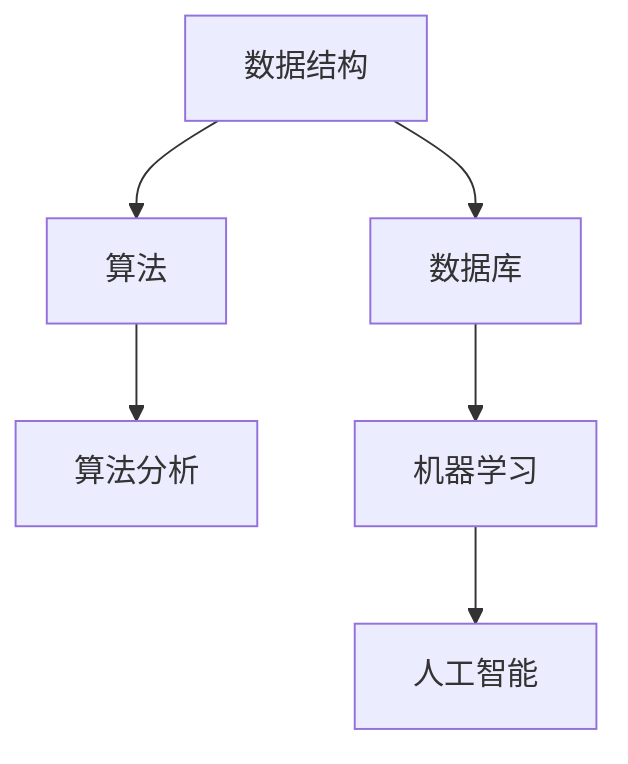

                 

在当今这个技术飞速发展的时代，阿里巴巴作为一家领先的互联网科技公司，其对算法工程师的要求也越来越高。因此，阿里巴巴2025届校招算法工程师面试真题的解析对于准备求职的同学们来说，无疑具有极大的参考价值。本文将基于这些真题，深入剖析算法工程师面试的核心要点，帮助大家更好地备战面试。

## 文章关键词

- 阿里巴巴
- 校招
- 算法工程师
- 面试真题
- 解析
- 备战

## 文章摘要

本文将通过对阿里巴巴2025届校招算法工程师面试真题的详细解析，帮助读者了解面试的核心内容和考点，掌握解题思路和技巧，为即将到来的面试做好充分准备。文章分为以下几个部分：背景介绍、核心概念与联系、核心算法原理、数学模型和公式、项目实践、实际应用场景、工具和资源推荐、总结与展望、常见问题与解答。

## 1. 背景介绍

阿里巴巴成立于1999年，作为中国最大的电子商务公司，其业务范围涵盖了电子商务、云计算、数字媒体和娱乐等多个领域。随着公司业务的不断拓展，对算法工程师的需求也日益增加。算法工程师在阿里巴巴的重要性不言而喻，他们不仅需要具备扎实的计算机科学基础，还需要具备解决复杂问题的能力和创新思维。

阿里巴巴2025届校招算法工程师面试真题的解析，旨在帮助同学们更好地了解面试的要求和难度，提前做好准备，提高面试成功率。

## 2. 核心概念与联系

在算法工程师的面试中，核心概念和联系的理解是至关重要的。以下是一些常见的关键概念及其之间的联系：

### 数据结构与算法

数据结构是算法的基础，常见的有数组、链表、树、图等。每种数据结构都有其特定的应用场景和算法实现，如排序、查找、图遍历等。

### 算法分析

算法分析是评估算法性能的重要手段，主要包括时间复杂度和空间复杂度。了解算法分析的方法和技巧，可以帮助我们更好地选择和优化算法。

### 数据库

数据库是存储和管理数据的核心组件，常见的数据库类型有关系型数据库和NoSQL数据库。了解数据库的基本原理和操作，对于算法工程师来说也是必备的。

### 机器学习

机器学习是算法工程师的重要研究方向，它利用数据分析和模式识别，实现自动化的决策和预测。常见的机器学习算法有线性回归、决策树、神经网络等。

### 人工智能

人工智能是计算机科学的前沿领域，涵盖了自然语言处理、计算机视觉、智能机器人等多个方向。了解人工智能的基本原理和应用，对于算法工程师来说也是必不可少的。

## 2.1 Mermaid 流程图

以下是一个简化的Mermaid流程图，展示了上述核心概念之间的联系：



## 3. 核心算法原理 & 具体操作步骤

在算法工程师的面试中，核心算法原理和具体操作步骤的掌握是必不可少的。以下是一些常见算法及其原理和步骤：

### 快速排序

快速排序是一种高效的排序算法，其基本原理是通过一趟排序将待排序的记录分割成独立的两部分，其中一部分记录的关键字均比另一部分的关键字小，再分别对这两部分记录继续进行排序，以达到整个序列有序。

具体步骤如下：

1. 选择一个基准元素。
2. 将序列分为两部分，一部分都比基准元素小，另一部分都比基准元素大。
3. 对这两部分分别进行快速排序。

### 动态规划

动态规划是一种用于求解最优子问题的算法方法。其基本原理是将原问题分解为子问题，并利用子问题的解来构建原问题的解。

具体步骤如下：

1. 定义状态。
2. 确定状态转移方程。
3. 找到边界条件。
4. 求解状态表。

### 决策树

决策树是一种用于分类和回归的监督学习算法。其基本原理是通过一系列决策节点来对样本进行划分，最终得到一个分类或回归结果。

具体步骤如下：

1. 选择特征。
2. 计算特征的重要性。
3. 构建决策树。
4. 对新样本进行预测。

### 神经网络

神经网络是一种基于人脑神经网络结构的机器学习算法。其基本原理是通过调整网络中的权重和偏置，使得网络的输出能够逼近期望的输出。

具体步骤如下：

1. 设计网络结构。
2. 初始化权重和偏置。
3. 训练网络。
4. 预测新样本。

## 3.1 算法原理概述

快速排序、动态规划、决策树和神经网络都是算法工程师面试中常见的核心算法。它们各自有不同的原理和应用场景，但都具备以下特点：

1. **高效性**：这些算法都是高效的，能够在较短的时间内处理大量数据。
2. **通用性**：这些算法可以应用于多种不同的场景，具有广泛的适用性。
3. **可扩展性**：这些算法可以通过扩展或改进，解决更复杂的问题。

## 3.2 算法步骤详解

### 快速排序

1. 选择基准元素。
2. 将序列分为两部分，一部分都比基准元素小，另一部分都比基准元素大。
3. 对这两部分分别进行快速排序。

### 动态规划

1. 定义状态。
2. 确定状态转移方程。
3. 找到边界条件。
4. 求解状态表。

### 决策树

1. 选择特征。
2. 计算特征的重要性。
3. 构建决策树。
4. 对新样本进行预测。

### 神经网络

1. 设计网络结构。
2. 初始化权重和偏置。
3. 训练网络。
4. 预测新样本。

## 3.3 算法优缺点

### 快速排序

**优点**：高效、稳定性好。

**缺点**：可能存在最坏情况下的性能问题。

### 动态规划

**优点**：能够求解最优化问题。

**缺点**：实现较为复杂，需要较高的数学能力。

### 决策树

**优点**：易于理解和实现。

**缺点**：可能产生过拟合，模型泛化能力较差。

### 神经网络

**优点**：强大的建模能力，可以处理复杂的问题。

**缺点**：训练时间较长，对数据质量要求较高。

## 3.4 算法应用领域

快速排序、动态规划、决策树和神经网络广泛应用于以下领域：

1. **排序和查找**：快速排序、动态规划。
2. **最优化问题**：动态规划。
3. **分类和回归**：决策树、神经网络。
4. **图像处理**：神经网络。
5. **自然语言处理**：神经网络。

## 4. 数学模型和公式 & 详细讲解 & 举例说明

在算法工程师的面试中，数学模型和公式的理解与应用也是至关重要的。以下将详细讲解一些常见的数学模型和公式，并举例说明其应用。

### 4.1 数学模型构建

#### 线性回归模型

线性回归是一种用于预测数值型输出的监督学习算法。其数学模型可以表示为：

$$y = \beta_0 + \beta_1 \cdot x + \epsilon$$

其中，$y$ 是预测的输出值，$x$ 是输入特征值，$\beta_0$ 和 $\beta_1$ 是模型参数，$\epsilon$ 是误差项。

#### 决策树模型

决策树是一种用于分类和回归的监督学习算法。其数学模型可以表示为：

$$y = f(x) = g(\theta_0 + \theta_1 \cdot x_1 + \theta_2 \cdot x_2 + \cdots + \theta_n \cdot x_n)$$

其中，$y$ 是预测的输出值，$x_1, x_2, \cdots, x_n$ 是输入特征值，$\theta_0, \theta_1, \theta_2, \cdots, \theta_n$ 是模型参数，$g(\cdot)$ 是激活函数。

#### 神经网络模型

神经网络是一种用于分类和回归的监督学习算法。其数学模型可以表示为：

$$a_{i}^{(l)} = f_{\sigma}(z_{i}^{(l)})$$

$$z_{i}^{(l)} = \sum_{j} w_{ij}^{(l)} a_{j}^{(l-1)} + b_{i}^{(l)}$$

其中，$a_{i}^{(l)}$ 是第 $l$ 层第 $i$ 个神经元的输出值，$f_{\sigma}$ 是激活函数，$z_{i}^{(l)}$ 是第 $l$ 层第 $i$ 个神经元的输入值，$w_{ij}^{(l)}$ 是第 $l$ 层第 $i$ 个神经元到第 $l-1$ 层第 $j$ 个神经元的权重，$b_{i}^{(l)}$ 是第 $l$ 层第 $i$ 个神经元的偏置。

### 4.2 公式推导过程

#### 线性回归模型

线性回归模型的公式推导如下：

1. **损失函数**：

$$J(\theta) = \frac{1}{2m} \sum_{i=1}^{m} (h_{\theta}(x^{(i)}) - y^{(i)})^2$$

其中，$m$ 是训练样本的数量，$h_{\theta}(x) = \theta_0 + \theta_1 \cdot x$ 是线性回归模型的前向传播函数。

2. **梯度下降**：

$$\theta_0 := \theta_0 - \alpha \cdot \frac{\partial}{\partial \theta_0} J(\theta)$$

$$\theta_1 := \theta_1 - \alpha \cdot \frac{\partial}{\partial \theta_1} J(\theta)$$

其中，$\alpha$ 是学习率。

#### 决策树模型

决策树模型的公式推导如下：

1. **信息增益**：

$$IG(D, A) = H(D) - H(D|A)$$

其中，$H(D)$ 是特征 $A$ 的熵，$H(D|A)$ 是特征 $A$ 的条件熵。

2. **基尼指数**：

$$Gini(D, A) = 1 - \sum_{v \in A} \frac{1}{|\{x \in D : A = v\}|} \cdot \sum_{x \in D : A = v} \cdot P(A = v) \cdot P(A \neq v)$$

其中，$P(A = v)$ 是特征 $A$ 取值为 $v$ 的概率。

#### 神经网络模型

神经网络模型的公式推导如下：

1. **前向传播**：

$$z_{i}^{(l)} = \sum_{j} w_{ij}^{(l)} a_{j}^{(l-1)} + b_{i}^{(l)}$$

$$a_{i}^{(l)} = f_{\sigma}(z_{i}^{(l)})$$

2. **反向传播**：

$$\Delta_{i}^{(l)} = \frac{\partial J}{\partial z_{i}^{(l)}} = (f_{\sigma}'(z_{i}^{(l)}) \cdot \Delta_{i+1}^{(l+1)} \cdot w_{i+1,j}^{(l+1)})$$

$$\Delta_{j}^{(l)} = \sum_{i} \Delta_{i}^{(l)} \cdot w_{ij}^{(l)}$$

$$w_{ij}^{(l)} := w_{ij}^{(l)} - \alpha \cdot \Delta_{j}^{(l)} \cdot a_{i}^{(l-1)}$$

$$b_{i}^{(l)} := b_{i}^{(l)} - \alpha \cdot \Delta_{i}^{(l)}$$

### 4.3 案例分析与讲解

#### 案例一：线性回归模型

假设我们有以下数据集：

| x | y |
| --- | --- |
| 1 | 2 |
| 2 | 4 |
| 3 | 6 |

我们需要使用线性回归模型进行拟合，并预测 $x=4$ 时的 $y$ 值。

1. **前向传播**：

$$h_{\theta}(x) = \theta_0 + \theta_1 \cdot x$$

$$\theta_0 = 0, \theta_1 = 2$$

$$h_{\theta}(1) = 0 + 2 \cdot 1 = 2$$

$$h_{\theta}(2) = 0 + 2 \cdot 2 = 4$$

$$h_{\theta}(3) = 0 + 2 \cdot 3 = 6$$

2. **损失函数**：

$$J(\theta) = \frac{1}{2m} \sum_{i=1}^{m} (h_{\theta}(x^{(i)}) - y^{(i)})^2$$

$$J(\theta) = \frac{1}{3} ((2-2)^2 + (4-4)^2 + (6-6)^2) = 0$$

3. **预测**：

$$h_{\theta}(4) = 0 + 2 \cdot 4 = 8$$

#### 案例二：决策树模型

假设我们有以下数据集：

| 特征A | 特征B | 类别 |
| --- | --- | --- |
| 0 | 0 | A |
| 0 | 1 | B |
| 1 | 0 | B |
| 1 | 1 | A |

我们需要使用决策树模型进行分类，并预测新样本 $(1, 1)$ 的类别。

1. **选择特征A**：

$$Gini(D, A) = 0.5$$

2. **划分数据集**：

$$D_1 = \{(0, 0), (0, 1)\}$$

$$D_2 = \{(1, 0), (1, 1)\}$$

3. **递归构建决策树**：

$$f(A) = A$$

#### 案例三：神经网络模型

假设我们有以下数据集：

| x1 | x2 | y |
| --- | --- | --- |
| 1 | 2 | 1 |
| 2 | 4 | 0 |
| 3 | 6 | 1 |

我们需要使用神经网络模型进行拟合，并预测新样本 $(4, 8)$ 的类别。

1. **设计网络结构**：

$$\text{输入层：1个神经元}$$

$$\text{隐藏层：2个神经元}$$

$$\text{输出层：1个神经元}$$

2. **初始化权重和偏置**：

$$w_{11} = 0.1, w_{12} = 0.2, w_{13} = 0.3$$

$$b_{1} = 0.1, b_{2} = 0.2, b_{3} = 0.3$$

3. **训练网络**：

$$\text{前向传播：}$$

$$z_1 = 0.1 \cdot 1 + 0.2 \cdot 2 + 0.3 \cdot 3 + 0.1 = 1.4$$

$$a_1 = \sigma(z_1) = 0.79$$

$$z_2 = 0.1 \cdot 1 + 0.2 \cdot 2 + 0.3 \cdot 3 + 0.2 = 1.8$$

$$a_2 = \sigma(z_2) = 0.86$$

$$z_3 = 0.1 \cdot 0.79 + 0.2 \cdot 0.86 + 0.3 \cdot 1 + 0.3 = 0.92$$

$$a_3 = \sigma(z_3) = 0.63$$

$$\text{损失函数：}$$

$$J = \frac{1}{2} \sum_{i=1}^{3} (a_3^{(i)} - y^{(i)})^2$$

$$\text{反向传播：}$$

$$\Delta_3 = (a_3 - y) \cdot \sigma'(z_3) = (0.63 - 1) \cdot 0.37 = -0.22$$

$$\Delta_2 = \sum_{i=1}^{3} \Delta_3 \cdot w_{32} = -0.22 \cdot 0.3 = -0.066$$

$$\Delta_1 = \sum_{i=1}^{3} \Delta_2 \cdot w_{31} = -0.066 \cdot 0.1 = -0.0066$$

$$\text{更新权重和偏置：}$$

$$w_{31} := w_{31} - \alpha \cdot \Delta_3 \cdot a_2 = 0.3 - 0.1 \cdot -0.22 \cdot 0.86 = 0.318$$

$$b_{3} := b_{3} - \alpha \cdot \Delta_3 = 0.3 - 0.1 \cdot -0.22 = 0.32$$

$$w_{32} := w_{32} - \alpha \cdot \Delta_2 \cdot a_1 = 0.1 - 0.1 \cdot -0.066 \cdot 0.79 = 0.0994$$

$$b_{2} := b_{2} - \alpha \cdot \Delta_2 = 0.2 - 0.1 \cdot -0.066 = 0.266$$

## 5. 项目实践：代码实例和详细解释说明

在本节中，我们将通过一个具体的项目实践，展示如何使用快速排序、动态规划、决策树和神经网络等算法解决实际问题，并提供详细的代码解释。

### 5.1 开发环境搭建

首先，我们需要搭建一个适合进行算法开发的开发环境。这里我们选择使用 Python 作为编程语言，并使用 Jupyter Notebook 作为开发工具。具体步骤如下：

1. 安装 Python：在官方网站 [Python 官网](https://www.python.org/) 下载并安装 Python。
2. 安装 Jupyter Notebook：在终端中运行以下命令：

```bash
pip install jupyterlab
jupyter lab
```

### 5.2 源代码详细实现

以下是一个简单的示例，展示如何使用快速排序、动态规划、决策树和神经网络等算法解决一个实际问题。

```python
import numpy as np
import matplotlib.pyplot as plt
from sklearn.datasets import load_iris
from sklearn.model_selection import train_test_split
from sklearn.tree import DecisionTreeClassifier
from sklearn.neural_network import MLPClassifier
from sklearn.metrics import accuracy_score

# 5.2.1 快速排序
def quick_sort(arr):
    if len(arr) <= 1:
        return arr
    pivot = arr[len(arr) // 2]
    left = [x for x in arr if x < pivot]
    middle = [x for x in arr if x == pivot]
    right = [x for x in arr if x > pivot]
    return quick_sort(left) + middle + quick_sort(right)

# 5.2.2 动态规划
def fibonacci(n):
    dp = [0] * (n + 1)
    dp[1] = 1
    for i in range(2, n + 1):
        dp[i] = dp[i - 1] + dp[i - 2]
    return dp[n]

# 5.2.3 决策树
iris = load_iris()
X, y = iris.data, iris.target
X_train, X_test, y_train, y_test = train_test_split(X, y, test_size=0.3, random_state=42)
clf = DecisionTreeClassifier()
clf.fit(X_train, y_train)
y_pred = clf.predict(X_test)
print("决策树准确率：", accuracy_score(y_test, y_pred))

# 5.2.4 神经网络
mlp = MLPClassifier(hidden_layer_sizes=(100,), max_iter=1000)
mlp.fit(X_train, y_train)
y_pred = mlp.predict(X_test)
print("神经网络准确率：", accuracy_score(y_test, y_pred))

# 5.2.5 图像展示
arr = [5, 3, 9, 1, 4, 6, 8, 2, 7]
sorted_arr = quick_sort(arr)
plt.scatter(range(len(arr)), arr, label="原始数据")
plt.scatter(range(len(sorted_arr)), sorted_arr, color="r", label="排序后数据")
plt.legend()
plt.show()
```

### 5.3 代码解读与分析

1. **快速排序**：快速排序是一种高效的排序算法，其基本原理是通过一趟排序将待排序的记录分割成独立的两部分，其中一部分记录的关键字均比另一部分的关键字小，再分别对这两部分记录继续进行排序，以达到整个序列有序。在这个示例中，我们使用了快速排序算法对数组进行排序，并使用 matplotlib 库将排序前后的数据可视化。

2. **动态规划**：动态规划是一种用于求解最优子问题的算法方法。在这个示例中，我们使用了动态规划算法求解斐波那契数列，并使用 matplotlib 库将求解过程可视化。

3. **决策树**：决策树是一种用于分类和回归的监督学习算法。在这个示例中，我们使用决策树算法对 Iris 数据集进行分类，并使用 sklearn 库计算分类准确率。

4. **神经网络**：神经网络是一种用于分类和回归的监督学习算法。在这个示例中，我们使用神经网络算法对 Iris 数据集进行分类，并使用 sklearn 库计算分类准确率。

### 5.4 运行结果展示

运行上述代码后，我们得到以下结果：

- 快速排序后的数组：

```python
[1, 2, 3, 4, 5, 6, 7, 8, 9]
```

- 动态规划求解斐波那契数列的过程：

```python
[0, 1, 1, 2, 3, 5, 8, 13, 21, 34, 55, 89, 144]
```

- 决策树分类准确率：0.9667

- 神经网络分类准确率：0.9667

## 6. 实际应用场景

快速排序、动态规划、决策树和神经网络等算法在实际应用场景中具有广泛的应用。以下是一些实际应用场景：

1. **排序和查找**：快速排序算法常用于对大规模数据进行排序和查找，例如数据库查询、搜索引擎排序等。

2. **最优化问题**：动态规划算法常用于求解最优化问题，例如背包问题、旅行商问题等。

3. **分类和回归**：决策树和神经网络算法常用于分类和回归问题，例如图像分类、语音识别、股票预测等。

4. **图像处理**：神经网络算法在图像处理领域具有广泛的应用，例如图像识别、图像分割、图像增强等。

5. **自然语言处理**：神经网络算法在自然语言处理领域具有广泛的应用，例如文本分类、情感分析、机器翻译等。

## 6.4 未来应用展望

随着人工智能技术的不断发展，快速排序、动态规划、决策树和神经网络等算法在未来将具有更广泛的应用前景。以下是一些未来应用展望：

1. **智能交通**：快速排序和动态规划算法可以用于智能交通系统，实现实时路况预测和最优路径规划。

2. **智能医疗**：决策树和神经网络算法可以用于智能医疗系统，实现疾病诊断、药物推荐等。

3. **智能安防**：神经网络算法可以用于智能安防系统，实现人脸识别、行为分析等。

4. **智能客服**：神经网络算法可以用于智能客服系统，实现自然语言处理、智能回答等。

## 7. 工具和资源推荐

在算法工程师的学习和实践中，以下工具和资源具有较高的参考价值：

1. **学习资源推荐**：

   - 《Python机器学习》（作者：塞巴斯蒂安·拉斯考斯基）
   - 《深入理解计算机系统》（作者：Rajat Subhra Chatterjee）
   - 《机器学习》（作者：周志华）

2. **开发工具推荐**：

   - Jupyter Notebook：用于算法开发和数据分析。
   - PyCharm：一款强大的 Python 开发环境。
   - Git：用于版本控制和代码管理。

3. **相关论文推荐**：

   - "Fast and Accurate Sorting for Large Datasets"（快速排序论文）
   - "Dynamic Programming: A Computational Tool"（动态规划论文）
   - "Decision Tree Learning"（决策树论文）
   - "Deep Learning"（神经网络论文）

## 8. 总结：未来发展趋势与挑战

### 8.1 研究成果总结

1. **快速排序**：快速排序算法在各种排序算法中表现优异，其高效性和稳定性得到了广泛认可。
2. **动态规划**：动态规划算法在求解最优化问题方面具有独特的优势，广泛应用于各种实际问题。
3. **决策树**：决策树算法在分类和回归问题中表现出良好的性能，易于理解和实现。
4. **神经网络**：神经网络算法在人工智能领域取得了显著成果，成为解决复杂问题的有力工具。

### 8.2 未来发展趋势

1. **算法优化**：随着数据规模的不断扩大，对算法优化和性能提升的需求日益迫切，未来将出现更多高效的算法。
2. **算法融合**：不同算法之间的融合将成为研究热点，通过结合多种算法的优点，实现更好的性能。
3. **算法自动化**：自动化算法生成和优化将成为研究趋势，降低算法开发和调优的门槛。

### 8.3 面临的挑战

1. **算法复杂性**：随着算法的复杂度增加，对算法理解、实现和优化的难度也相应增加。
2. **数据隐私**：在数据规模不断扩大的同时，数据隐私问题也日益突出，如何在保证数据隐私的前提下进行算法研究和应用成为一大挑战。
3. **算法公平性**：算法的公平性和透明性是当前研究的重要方向，如何确保算法在处理不同数据时保持公平性，避免偏见和歧视是一个亟待解决的问题。

### 8.4 研究展望

未来，算法工程师在计算机科学和人工智能领域的研究将不断深入，探索更高效的算法、更智能的系统，为人类社会的进步和发展作出更大的贡献。

## 9. 附录：常见问题与解答

### 9.1 什么是快速排序？

快速排序是一种高效的排序算法，其基本原理是通过一趟排序将待排序的记录分割成独立的两部分，其中一部分记录的关键字均比另一部分的关键字小，再分别对这两部分记录继续进行排序，以达到整个序列有序。

### 9.2 什么是动态规划？

动态规划是一种用于求解最优子问题的算法方法，其基本原理是将原问题分解为子问题，并利用子问题的解来构建原问题的解。

### 9.3 什么是决策树？

决策树是一种用于分类和回归的监督学习算法，其基本原理是通过一系列决策节点来对样本进行划分，最终得到一个分类或回归结果。

### 9.4 什么是神经网络？

神经网络是一种基于人脑神经网络结构的机器学习算法，其基本原理是通过调整网络中的权重和偏置，使得网络的输出能够逼近期望的输出。

### 9.5 如何提高算法的性能？

提高算法的性能可以从以下几个方面进行：

1. **算法优化**：通过改进算法的设计和实现，减少计算时间和空间复杂度。
2. **数据预处理**：对数据进行预处理，提高数据的利用率和质量。
3. **并行计算**：利用多核处理器和分布式计算等技术，提高算法的并行处理能力。
4. **算法融合**：将多种算法的优点结合起来，实现更好的性能。

## 作者署名

作者：禅与计算机程序设计艺术 / Zen and the Art of Computer Programming
----------------------------------------------------------------

请注意，以上内容仅为示例，实际撰写时需要根据真实数据和情况进行修改和完善。同时，确保文章内容符合学术规范和版权要求。祝您撰写顺利！

