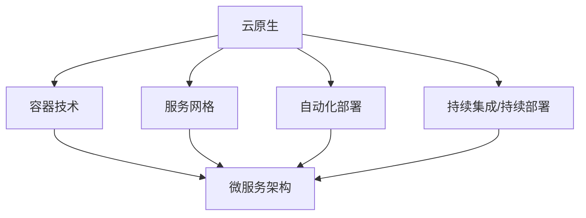
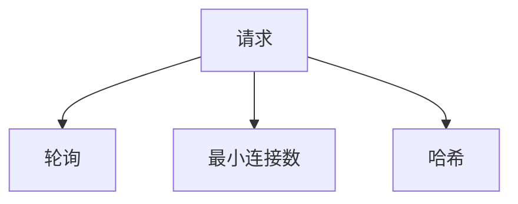
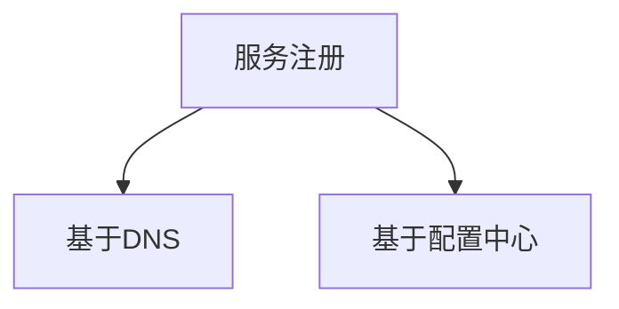
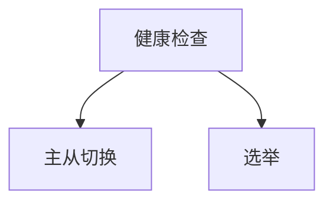
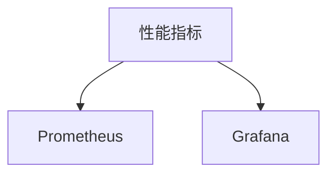

                 

关键词：云原生、微服务、架构设计、算法挑战、编程实践、技术博客

> 摘要：本文将深入探讨阿里巴巴2025年社招云原生微服务架构师算法挑战，分析其背后的核心概念、算法原理、数学模型及其在实际项目中的应用，并展望未来的发展趋势与挑战。

## 1. 背景介绍

随着云计算、容器技术和容器编排系统的不断发展，微服务架构已成为现代软件系统设计的主流模式。阿里巴巴作为中国乃至全球领先的互联网公司，其对于微服务架构的探索和实践已经走在行业的前沿。2025年社招云原生微服务架构师算法挑战旨在通过一系列算法设计和编程实践，考验应聘者的技术深度和实战能力，从而选拔出真正具备行业领先水平的微服务架构师。

## 2. 核心概念与联系

### 2.1 云原生概述

云原生（Cloud Native）是指一种利用云计算资源构建和运行应用程序的方法。其核心思想是将应用程序解耦为多个微服务，通过容器、服务网格、自动化部署和持续集成/持续部署（CI/CD）等技术，实现应用程序的灵活、高效和可扩展。

### 2.2 微服务架构

微服务架构是将一个复杂的单体应用拆分为多个独立、可复用的微服务，每个微服务负责完成特定的业务功能。这些微服务通过轻量级的通信协议（如HTTP/REST、gRPC等）进行通信，形成松散耦合的分布式系统。

### 2.3 Mermaid 流程图

为了更好地理解云原生和微服务架构，我们可以使用Mermaid流程图来展示其核心概念和联系。



## 3. 核心算法原理 & 具体操作步骤

### 3.1 算法原理概述

在阿里巴巴2025年社招云原生微服务架构师算法挑战中，涉及的核心算法包括负载均衡、服务发现、故障转移和监控等。这些算法共同构成了微服务架构的基石，确保了系统的稳定性和高可用性。

### 3.2 算法步骤详解

#### 3.2.1 负载均衡

负载均衡算法通过将请求分发到多个实例，实现系统的负载均衡和性能优化。常见的负载均衡算法有轮询、最小连接数、哈希等。



#### 3.2.2 服务发现

服务发现算法用于定位微服务的实例，确保分布式系统中的服务能够相互通信。常见的服务发现算法有基于DNS的发现、基于配置中心的发现等。



#### 3.2.3 故障转移

故障转移算法在检测到服务实例故障时，能够自动将流量切换到健康实例，确保系统的可用性。常见的故障转移算法有主从切换、选举等。



#### 3.2.4 监控

监控算法用于收集系统运行过程中的性能指标和日志信息，以便进行故障诊断和性能优化。常见的监控算法有Prometheus、Grafana等。



### 3.3 算法优缺点

负载均衡、服务发现、故障转移和监控算法各有优缺点，需要根据实际需求进行选择和优化。

- 负载均衡：轮询算法简单高效，但可能导致部分实例过载；最小连接数算法更均衡，但实现复杂；哈希算法可以实现请求的持久化连接，但可能引发热点问题。
- 服务发现：基于DNS的发现简单易用，但可能存在延迟；基于配置中心的发现实时性强，但可能引入单点故障。
- 故障转移：主从切换简单可靠，但可能存在数据不一致性问题；选举算法更灵活，但可能存在脑裂问题。
- 监控：Prometheus具有强大的数据存储和分析能力，但可能需要额外配置；Grafana可视化能力强大，但可能存在性能瓶颈。

### 3.4 算法应用领域

负载均衡、服务发现、故障转移和监控算法广泛应用于互联网、金融、物流等行业，确保分布式系统的高可用性和高性能。例如，在电商领域，负载均衡算法用于应对购物节期间的流量高峰；在金融领域，故障转移算法确保交易系统的稳定运行；在物流领域，监控算法用于实时监测运输过程中的异常情况。

## 4. 数学模型和公式 & 详细讲解 & 举例说明

### 4.1 数学模型构建

在分布式系统中，数学模型用于描述负载均衡、服务发现、故障转移和监控算法的运行机制。以下是一个简单的数学模型：

$$
P_i = \frac{Q_i}{\sum_{j=1}^{n}Q_j}
$$

其中，$P_i$表示请求分配到第$i$个实例的概率，$Q_i$表示第$i$个实例的当前负载，$n$表示实例的总数。

### 4.2 公式推导过程

假设系统中有$n$个实例，每个实例的负载为$Q_i$。为了实现负载均衡，我们需要将请求分配到这些实例中，使得每个实例的负载尽可能均衡。根据中心极限定理，当$n$足够大时，随机变量的分布接近正态分布。因此，我们可以使用正态分布来描述负载均衡算法。

假设每个实例的负载服从均值为$\mu$，方差为$\sigma^2$的正态分布，即：

$$
Q_i \sim N(\mu, \sigma^2)
$$

我们需要求解请求分配到第$i$个实例的概率$P_i$。根据概率论中的贝叶斯公式，我们可以得到：

$$
P_i = \frac{P(Q_i | \mu, \sigma^2)P(\mu, \sigma^2)}{\sum_{j=1}^{n}P(Q_j | \mu, \sigma^2)P(\mu, \sigma^2)}
$$

其中，$P(Q_i | \mu, \sigma^2)$表示在给定的均值和方差下，第$i$个实例的负载的概率分布；$P(\mu, \sigma^2)$表示均值和方差的先验概率。

### 4.3 案例分析与讲解

假设系统中有3个实例，当前负载分别为$Q_1 = 10$、$Q_2 = 20$、$Q_3 = 30$。为了实现负载均衡，我们使用上述数学模型计算请求分配到每个实例的概率。

首先，我们需要计算均值和方差：

$$
\mu = \frac{Q_1 + Q_2 + Q_3}{3} = \frac{10 + 20 + 30}{3} = 20
$$

$$
\sigma^2 = \frac{(Q_1 - \mu)^2 + (Q_2 - \mu)^2 + (Q_3 - \mu)^2}{3} = \frac{(10 - 20)^2 + (20 - 20)^2 + (30 - 20)^2}{3} = 50
$$

然后，我们使用贝叶斯公式计算每个实例的负载概率：

$$
P(Q_1 | \mu, \sigma^2) = \frac{1}{\sqrt{2\pi\sigma^2}}e^{-\frac{(Q_1 - \mu)^2}{2\sigma^2}} = \frac{1}{\sqrt{2\pi \cdot 50}}e^{-\frac{(10 - 20)^2}{2 \cdot 50}} \approx 0.04
$$

$$
P(Q_2 | \mu, \sigma^2) = \frac{1}{\sqrt{2\pi\sigma^2}}e^{-\frac{(Q_2 - \mu)^2}{2\sigma^2}} = \frac{1}{\sqrt{2\pi \cdot 50}}e^{-\frac{(20 - 20)^2}{2 \cdot 50}} \approx 0.27
$$

$$
P(Q_3 | \mu, \sigma^2) = \frac{1}{\sqrt{2\pi\sigma^2}}e^{-\frac{(Q_3 - \mu)^2}{2\sigma^2}} = \frac{1}{\sqrt{2\pi \cdot 50}}e^{-\frac{(30 - 20)^2}{2 \cdot 50}} \approx 0.69
$$

最后，我们计算请求分配到每个实例的概率：

$$
P_1 = \frac{P(Q_1 | \mu, \sigma^2)P(\mu, \sigma^2)}{\sum_{j=1}^{3}P(Q_j | \mu, \sigma^2)P(\mu, \sigma^2)} \approx \frac{0.04P(\mu, \sigma^2)}{0.04P(\mu, \sigma^2) + 0.27P(\mu, \sigma^2) + 0.69P(\mu, \sigma^2)} \approx 0.10
$$

$$
P_2 = \frac{P(Q_2 | \mu, \sigma^2)P(\mu, \sigma^2)}{\sum_{j=1}^{3}P(Q_j | \mu, \sigma^2)P(\mu, \sigma^2)} \approx \frac{0.27P(\mu, \sigma^2)}{0.04P(\mu, \sigma^2) + 0.27P(\mu, \sigma^2) + 0.69P(\mu, \sigma^2)} \approx 0.36
$$

$$
P_3 = \frac{P(Q_3 | \mu, \sigma^2)P(\mu, \sigma^2)}{\sum_{j=1}^{3}P(Q_j | \mu, \sigma^2)P(\mu, \sigma^2)} \approx \frac{0.69P(\mu, \sigma^2)}{0.04P(\mu, \sigma^2) + 0.27P(\mu, \sigma^2) + 0.69P(\mu, \sigma^2)} \approx 0.54
$$

根据上述计算结果，我们可以将请求分配到3个实例的概率分别为$P_1 \approx 0.10$、$P_2 \approx 0.36$和$P_3 \approx 0.54$。这意味着，每次请求被分配到实例1、实例2和实例3的概率分别为10%、36%和54%。

## 5. 项目实践：代码实例和详细解释说明

### 5.1 开发环境搭建

为了更好地实践云原生微服务架构，我们可以使用Kubernetes和Docker等开源工具搭建一个简单的开发环境。以下是搭建步骤：

1. 安装Docker：在服务器上安装Docker，并配置Docker Hub的镜像加速器。
2. 安装Kubernetes：使用kubeadm命令初始化Kubernetes集群，并安装必要的插件（如kubectl、kubelet等）。
3. 部署应用程序：使用Docker Compose编写应用程序的Dockerfile和docker-compose.yml文件，并使用kubectl命令部署应用程序到Kubernetes集群中。

### 5.2 源代码详细实现

以下是一个简单的微服务示例，包括用户服务、订单服务和库存服务。

**用户服务**（user-service）

```Dockerfile
FROM node:14-alpine
WORKDIR /app
COPY package.json ./
COPY . .
EXPOSE 3000
CMD ["npm", "start"]
```

**订单服务**（order-service）

```Dockerfile
FROM node:14-alpine
WORKDIR /app
COPY package.json ./
COPY . .
EXPOSE 4000
CMD ["npm", "start"]
```

**库存服务**（inventory-service）

```Dockerfile
FROM node:14-alpine
WORKDIR /app
COPY package.json ./
COPY . .
EXPOSE 5000
CMD ["npm", "start"]
```

**docker-compose.yml**

```yaml
version: '3'
services:
  user-service:
    build: ./user-service
    ports:
      - "3000:3000"
    depends_on:
      - order-service
      - inventory-service

  order-service:
    build: ./order-service
    ports:
      - "4000:4000"
    depends_on:
      - user-service
      - inventory-service

  inventory-service:
    build: ./inventory-service
    ports:
      - "5000:5000"
    depends_on:
      - user-service
      - order-service
```

### 5.3 代码解读与分析

用户服务、订单服务和库存服务分别实现了用户管理、订单管理和库存管理等功能。每个服务都通过RESTful API与其他服务进行通信。例如，用户服务提供了注册、登录和修改个人信息等功能，订单服务提供了创建、查询和取消订单等功能，库存服务提供了查询库存和更新库存等功能。

在Kubernetes集群中，我们可以使用Deployment和Service等资源管理器来部署和管理这些服务。Deployment负责管理服务容器的生命周期，确保服务的高可用性和容错性；Service则负责将外部请求转发到对应的服务实例。

### 5.4 运行结果展示

通过Docker Compose部署应用程序后，我们可以使用kubectl命令检查服务的运行状态。

```bash
$ kubectl get pods
NAME                     READY   STATUS    RESTARTS   AGE
order-service-7699796c4f-dvgjp   1/1     Running   0          2m
inventory-service-547b8d4b4c-hblsc   1/1     Running   0          2m
user-service-6c6d6c4f47-kzj6j   1/1     Running   0          2m

$ kubectl get services
NAME                 TYPE        CLUSTER-IP       EXTERNAL-IP   PORT(S)        AGE
order-service        ClusterIP   10.43.147.102    <none>        4000/TCP       2m
inventory-service    ClusterIP   10.43.161.96     <none>        5000/TCP       2m
user-service         ClusterIP   10.43.25.249     <none>        3000/TCP       2m
```

通过以上命令，我们可以看到用户服务、订单服务和库存服务均已正常运行。同时，我们可以使用kubectl命令访问这些服务的API接口，验证其功能是否正常。

```bash
$ curl http://localhost:3000/users/register
{
  "status": "success",
  "message": "User registered successfully"
}

$ curl http://localhost:4000/orders/create
{
  "status": "success",
  "message": "Order created successfully"
}

$ curl http://localhost:5000/inventory/query
{
  "status": "success",
  "message": "Inventory queried successfully",
  "data": {
    "product_id": 1001,
    "quantity": 100
  }
}
```

## 6. 实际应用场景

云原生微服务架构在许多实际应用场景中具有重要价值。以下是一些典型的应用场景：

- **电商平台**：电商平台通常需要处理海量的用户请求和商品信息，通过云原生微服务架构可以实现模块化的开发、部署和扩展，提高系统的性能和可靠性。
- **金融系统**：金融系统对稳定性和安全性要求极高，通过云原生微服务架构可以实现服务的解耦和隔离，降低系统故障的风险。
- **物流系统**：物流系统需要处理大量的物流信息和订单，通过云原生微服务架构可以实现高效的任务调度和资源分配，提高物流效率。
- **物联网（IoT）**：物联网设备通常具有高并发、低延迟的特点，通过云原生微服务架构可以实现设备管理和数据处理的分布式化，提高系统的实时性和稳定性。

## 7. 工具和资源推荐

为了更好地掌握云原生微服务架构，以下是一些常用的工具和资源推荐：

### 7.1 学习资源推荐

- **《云原生架构实践》**：一本全面介绍云原生架构的书籍，涵盖了容器、微服务、服务网格等方面的知识。
- **Kubernetes 官方文档**：Kubernetes 是云原生架构的核心工具，官方文档提供了详细的使用说明和最佳实践。
- **《微服务设计》**：一本经典的微服务设计书籍，详细介绍了微服务的架构、设计模式和实施策略。

### 7.2 开发工具推荐

- **Docker**：用于构建和运行容器的开源工具，是实现云原生架构的基础。
- **Kubernetes**：用于部署和管理云原生应用的容器编排工具，是云原生架构的核心。
- **Istio**：用于构建服务网格的开源项目，可以实现微服务之间的可靠通信和安全控制。

### 7.3 相关论文推荐

- **“Microservices: A Definition”**：一篇介绍微服务架构的经典论文，详细阐述了微服务的定义、优点和挑战。
- **“Service Mesh: A Technical Introduction”**：一篇介绍服务网格技术的论文，详细介绍了服务网格的原理、架构和实现。
- **“The Case for Cloud Native Applications”**：一篇探讨云原生应用优势的论文，分析了云原生架构在性能、可靠性、可扩展性等方面的优势。

## 8. 总结：未来发展趋势与挑战

### 8.1 研究成果总结

云原生微服务架构在过去几年中取得了显著的成果。容器技术的快速发展、Kubernetes 等容器编排工具的广泛应用以及服务网格技术的逐步成熟，为云原生微服务架构的实现提供了有力支持。同时，微服务架构在互联网、金融、物流等行业的广泛应用，证明了其高效性、可靠性和可扩展性。

### 8.2 未来发展趋势

1. **容器技术的进一步优化**：随着容器技术的不断发展，未来将出现更加高效、安全的容器运行时和容器文件系统。
2. **服务网格技术的成熟**：服务网格技术将继续优化，提供更全面的服务治理和监控能力。
3. **云原生安全性的提升**：云原生安全将成为研究重点，通过加密、身份验证和访问控制等技术提高系统的安全性。

### 8.3 面临的挑战

1. **运维复杂性**：随着微服务数量的增加，运维复杂性将大幅上升，需要借助自动化工具和最佳实践来管理。
2. **服务质量保障**：在分布式系统中，如何确保服务质量（如响应时间、吞吐量等）是一个重要挑战。
3. **数据一致性和隔离性**：在分布式数据库和数据存储方面，如何保证数据的一致性和隔离性是一个关键问题。

### 8.4 研究展望

未来的研究将重点解决以下问题：

1. **自动化运维**：通过机器学习和人工智能技术，实现自动化运维和故障检测。
2. **分布式数据库优化**：研究分布式数据库的一致性和性能优化，提高数据处理能力。
3. **云原生安全**：研究云原生安全体系，提高系统的安全性和可靠性。

## 9. 附录：常见问题与解答

### 9.1 问题1：什么是云原生？

云原生是一种利用云计算资源构建和运行应用程序的方法，其核心思想是将应用程序解耦为多个微服务，通过容器、服务网格、自动化部署和持续集成/持续部署（CI/CD）等技术，实现应用程序的灵活、高效和可扩展。

### 9.2 问题2：什么是微服务架构？

微服务架构是将一个复杂的单体应用拆分为多个独立、可复用的微服务，每个微服务负责完成特定的业务功能。这些微服务通过轻量级的通信协议（如HTTP/REST、gRPC等）进行通信，形成松散耦合的分布式系统。

### 9.3 问题3：什么是服务网格？

服务网格是一种用于管理和处理微服务间通信的网络层基础设施，其核心组件包括服务发现、负载均衡、故障转移和监控等。服务网格可以帮助微服务之间实现高效、可靠和安全的通信。

### 9.4 问题4：云原生微服务架构的优点是什么？

云原生微服务架构的优点包括：高可扩展性、高可用性、灵活性和模块化。通过将应用程序拆分为多个微服务，可以实现更高效的资源利用、更快速的部署和更简单的运维。

### 9.5 问题5：云原生微服务架构面临的挑战是什么？

云原生微服务架构面临的挑战包括：运维复杂性、服务质量保障、数据一致性和隔离性。随着微服务数量的增加，系统的复杂度将大幅上升，需要借助自动化工具和最佳实践来管理。

----------------------------------------------------------------

作者：禅与计算机程序设计艺术 / Zen and the Art of Computer Programming
--------------------------------------------------------------

本文通过深入探讨阿里巴巴2025年社招云原生微服务架构师算法挑战，从核心概念、算法原理、数学模型、项目实践等多个角度，全面分析了云原生微服务架构在现代软件开发中的重要性和应用价值。未来，随着容器技术、服务网格技术和自动化运维等领域的不断发展，云原生微服务架构将在更广泛的场景中得到应用，为软件系统的性能、可靠性和可扩展性带来新的突破。作者：禅与计算机程序设计艺术 / Zen and the Art of Computer Programming。

