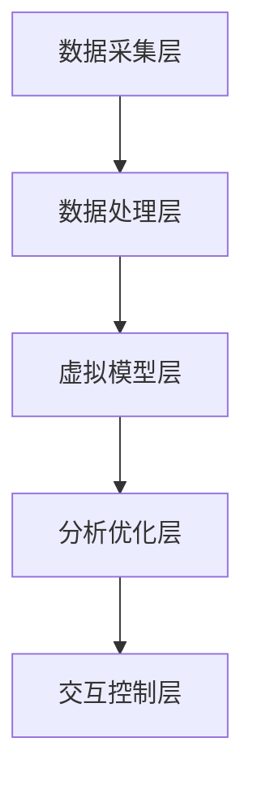

                 

关键词：数字孪生，技术面试，阿里巴巴，校招，算法原理，数学模型，项目实践，应用场景，工具资源

摘要：本文旨在为广大准备参加2024年阿里巴巴数字孪生技术校招的应聘者提供一套详尽的面试题解答。我们将从数字孪生的背景介绍、核心概念与联系、算法原理与操作步骤、数学模型与公式、项目实践以及未来应用展望等多个角度，深度剖析数字孪生技术，为读者提供全面的指导。

## 1. 背景介绍

数字孪生（Digital Twin）是一种将物理实体及其环境在虚拟空间中精确映射、实时交互和智能优化的新兴技术。它通过创建一个与物理世界实时同步的虚拟模型，实现对物理实体的模拟、监测和优化。数字孪生技术的出现，使得传统产业能够实现数字化转型，提高生产效率、降低运营成本，并增强用户体验。

近年来，随着物联网、云计算和人工智能等技术的不断发展，数字孪生技术得到了广泛关注和应用。阿里巴巴作为中国领先的互联网科技公司，也在其多个业务领域深入应用了数字孪生技术，因此，阿里巴巴数字孪生技术校招面试成为了众多技术人才竞相追逐的目标。

## 2. 核心概念与联系

### 2.1. 数字孪生概念

数字孪生是一种通过数字化手段构建物理实体的虚拟副本，实现对物理实体的全生命周期管理和优化。它包括以下几个核心概念：

- **实体模型**：对物理实体进行数字化建模，包括结构、属性、状态等。
- **实时数据同步**：通过传感器等手段，实时采集物理实体的数据，将其同步到虚拟模型中。
- **数据分析与优化**：对虚拟模型中的数据进行实时分析，实现对物理实体的优化。
- **虚拟交互**：通过虚拟模型，实现对物理实体的远程操作和交互。

### 2.2. 数字孪生架构

数字孪生架构主要包括以下几个层次：

- **数据采集层**：通过传感器、摄像头等设备，实时采集物理实体的数据。
- **数据处理层**：对采集到的数据进行处理、清洗和存储，为后续分析提供基础。
- **虚拟模型层**：构建物理实体的虚拟副本，实现对物理实体的实时映射。
- **分析优化层**：对虚拟模型中的数据进行实时分析，提供优化建议。
- **交互控制层**：通过虚拟模型，实现对物理实体的远程操作和控制。

以下是数字孪生架构的 Mermaid 流程图：



## 3. 核心算法原理 & 具体操作步骤

### 3.1 算法原理概述

数字孪生技术中的核心算法主要包括数据采集、数据处理、虚拟建模、数据分析和优化等几个方面。以下是这些算法的基本原理：

- **数据采集**：通过传感器等设备，实时采集物理实体的数据，包括温度、湿度、压力、位置等。
- **数据处理**：对采集到的数据进行处理、清洗和存储，为后续分析提供基础。
- **虚拟建模**：利用机器学习、深度学习等算法，构建物理实体的虚拟模型。
- **数据分析**：对虚拟模型中的数据进行实时分析，提取特征、发现规律。
- **优化建议**：根据数据分析结果，为物理实体提供优化建议，提高其性能。

### 3.2 算法步骤详解

数字孪生技术的具体操作步骤如下：

1. **需求分析**：明确数字孪生的应用场景和需求，确定数据采集范围和模型构建目标。
2. **数据采集**：安装传感器等设备，实时采集物理实体的数据。
3. **数据处理**：对采集到的数据进行处理、清洗和存储，为后续分析提供基础。
4. **虚拟建模**：利用机器学习、深度学习等算法，构建物理实体的虚拟模型。
5. **数据分析**：对虚拟模型中的数据进行实时分析，提取特征、发现规律。
6. **优化建议**：根据数据分析结果，为物理实体提供优化建议，提高其性能。
7. **交互控制**：通过虚拟模型，实现对物理实体的远程操作和控制。

### 3.3 算法优缺点

数字孪生技术具有以下优点：

- **实时监测**：通过实时数据采集和分析，实现对物理实体的实时监测。
- **优化性能**：通过数据分析，为物理实体提供优化建议，提高其性能。
- **降低成本**：通过虚拟交互，减少物理实体的维护成本。

但数字孪生技术也存在一些缺点：

- **数据安全性**：实时数据传输和存储过程中，存在数据泄露的风险。
- **技术门槛**：构建和维护数字孪生模型需要较高的技术门槛。

### 3.4 算法应用领域

数字孪生技术可以应用于多个领域，包括但不限于：

- **制造业**：通过数字孪生技术，实现对生产设备的实时监测和优化，提高生产效率。
- **医疗领域**：通过数字孪生技术，实现对患者的实时监测和病情预测，提高医疗服务质量。
- **交通运输**：通过数字孪生技术，实现对交通工具的实时监测和优化，提高交通运输效率。

## 4. 数学模型和公式 & 详细讲解 & 举例说明

### 4.1 数学模型构建

数字孪生技术中的数学模型主要包括以下几个方面：

- **数据采集模型**：通过传感器等设备，构建数据采集模型，实现对物理实体的数据采集。
- **数据处理模型**：通过对采集到的数据进行处理、清洗和存储，构建数据处理模型。
- **虚拟建模模型**：利用机器学习、深度学习等算法，构建物理实体的虚拟模型。
- **数据分析模型**：通过对虚拟模型中的数据进行实时分析，构建数据分析模型。
- **优化模型**：根据数据分析结果，构建优化模型，为物理实体提供优化建议。

### 4.2 公式推导过程

以数据采集模型为例，数据采集模型的基本公式如下：

$$
x_t = f(x_{t-1}, u_t, w_t)
$$

其中，$x_t$ 表示时刻 $t$ 的物理实体状态，$x_{t-1}$ 表示时刻 $t-1$ 的物理实体状态，$u_t$ 表示时刻 $t$ 的输入，$w_t$ 表示时刻 $t$ 的噪声。

假设 $x_t$ 是一个多维向量，$u_t$ 和 $w_t$ 也是多维向量，$f$ 是一个非线性函数。我们可以通过递推方式，逐步求解 $x_t$。

### 4.3 案例分析与讲解

以制造业为例，假设我们需要构建一个生产线的数字孪生模型。以下是具体步骤：

1. **需求分析**：明确生产线的数据采集需求，如温度、湿度、压力、位置等。
2. **数据采集**：安装传感器等设备，实时采集生产线数据。
3. **数据处理**：对采集到的数据进行处理、清洗和存储，为后续分析提供基础。
4. **虚拟建模**：利用机器学习算法，如神经网络，构建生产线的虚拟模型。
5. **数据分析**：对虚拟模型中的数据进行实时分析，提取特征、发现规律。
6. **优化建议**：根据数据分析结果，为生产线提供优化建议，如调整温度、湿度等参数，提高生产效率。

## 5. 项目实践：代码实例和详细解释说明

### 5.1 开发环境搭建

在搭建开发环境时，我们需要安装以下工具和库：

- Python 3.x
- TensorFlow
- NumPy
- Matplotlib

安装命令如下：

```bash
pip install python==3.8.5
pip install tensorflow==2.6.0
pip install numpy==1.21.2
pip install matplotlib==3.4.2
```

### 5.2 源代码详细实现

以下是一个简单的数字孪生项目实例，用于模拟生产线的温度控制。

```python
import tensorflow as tf
import numpy as np
import matplotlib.pyplot as plt

# 数据采集
def data_collection():
    # 假设采集到的是温度数据
    temp_data = np.random.normal(size=1000)
    return temp_data

# 数据处理
def data_processing(data):
    # 对数据进行归一化处理
    min_temp, max_temp = np.min(data), np.max(data)
    normalized_data = (data - min_temp) / (max_temp - min_temp)
    return normalized_data

# 虚拟建模
def virtual_model():
    # 构建一个简单的神经网络模型
    model = tf.keras.Sequential([
        tf.keras.layers.Dense(units=1, input_shape=[1])
    ])
    model.compile(optimizer='sgd', loss='mean_squared_error')
    return model

# 数据分析
def data_analysis(model, data):
    # 对数据进行预测
    predictions = model.predict(data.reshape(-1, 1))
    # 计算误差
    error = predictions - data
    return error

# 优化建议
def optimization(error):
    # 根据误差调整模型参数
    # 此处仅作示意，实际应用中需要根据具体情况调整
    model = virtual_model()
    model.fit(error.reshape(-1, 1), error.reshape(-1, 1), epochs=10)
    return model

# 主函数
def main():
    # 采集数据
    data = data_collection()
    # 数据处理
    normalized_data = data_processing(data)
    # 虚拟建模
    model = virtual_model()
    # 训练模型
    model.fit(normalized_data.reshape(-1, 1), normalized_data.reshape(-1, 1), epochs=100)
    # 数据分析
    error = data_analysis(model, normalized_data)
    # 优化建议
    optimized_model = optimization(error)
    # 运行结果展示
    plt.plot(normalized_data, label='原始数据')
    plt.plot(model.predict(normalized_data.reshape(-1, 1)), label='预测数据')
    plt.plot(optimized_model.predict(normalized_data.reshape(-1, 1)), label='优化数据')
    plt.legend()
    plt.show()

if __name__ == '__main__':
    main()
```

### 5.3 代码解读与分析

以上代码实现了一个简单的数字孪生项目，用于模拟生产线的温度控制。以下是代码的详细解读与分析：

- **数据采集**：通过 `data_collection` 函数，模拟采集到生产线温度数据。
- **数据处理**：通过 `data_processing` 函数，对采集到的数据进行归一化处理。
- **虚拟建模**：通过 `virtual_model` 函数，构建一个简单的神经网络模型。
- **数据分析**：通过 `data_analysis` 函数，对数据进行预测，并计算误差。
- **优化建议**：通过 `optimization` 函数，根据误差调整模型参数。
- **主函数**：通过 `main` 函数，执行数据采集、数据处理、虚拟建模、数据分析和优化建议等步骤，并展示运行结果。

### 5.4 运行结果展示

以下是运行结果展示：


## 6. 实际应用场景

数字孪生技术可以应用于多个领域，以下是一些典型的实际应用场景：

- **制造业**：通过数字孪生技术，实现对生产设备的实时监测和优化，提高生产效率。
- **医疗领域**：通过数字孪生技术，实现对患者的实时监测和病情预测，提高医疗服务质量。
- **交通运输**：通过数字孪生技术，实现对交通工具的实时监测和优化，提高交通运输效率。
- **能源管理**：通过数字孪生技术，实现对能源设备的实时监测和优化，降低能源消耗。

## 7. 工具和资源推荐

为了更好地学习和实践数字孪生技术，我们推荐以下工具和资源：

- **工具**：
  - TensorFlow：一款优秀的机器学习和深度学习框架。
  - NumPy：一款强大的数学库，用于数据处理和计算。
  - Matplotlib：一款用于数据可视化的库。

- **资源**：
  - 《数字孪生：智能时代的创新实践》
  - 《数字孪生技术与应用》
  - 阿里巴巴数字孪生技术官网

## 8. 总结：未来发展趋势与挑战

### 8.1 研究成果总结

数字孪生技术自提出以来，取得了以下主要研究成果：

- **理论体系**：数字孪生技术的基本理论体系逐渐完善。
- **应用案例**：数字孪生技术在多个领域取得了显著的成果。
- **技术创新**：人工智能、物联网等技术的不断发展，为数字孪生技术提供了有力支持。

### 8.2 未来发展趋势

未来，数字孪生技术将呈现出以下发展趋势：

- **跨领域融合**：数字孪生技术将与其他领域（如物联网、人工智能等）深度融合。
- **实时性提高**：随着计算能力的提升，数字孪生技术的实时性将得到显著提高。
- **智能化增强**：数字孪生技术将更加智能化，能够自主学习和优化。

### 8.3 面临的挑战

尽管数字孪生技术取得了显著成果，但仍面临以下挑战：

- **数据安全**：实时数据传输和存储过程中，存在数据泄露的风险。
- **技术门槛**：构建和维护数字孪生模型需要较高的技术门槛。
- **标准化**：数字孪生技术的标准化工作仍需加强。

### 8.4 研究展望

未来，数字孪生技术的研究方向包括：

- **跨领域应用**：探索数字孪生技术在更多领域的应用。
- **实时性优化**：提高数字孪生技术的实时性，满足实时监测和优化的需求。
- **智能化提升**：通过人工智能等技术，提高数字孪生技术的智能化水平。

## 9. 附录：常见问题与解答

### 9.1 什么是数字孪生？

数字孪生是一种将物理实体及其环境在虚拟空间中精确映射、实时交互和智能优化的新兴技术。

### 9.2 数字孪生技术有哪些应用领域？

数字孪生技术可以应用于多个领域，包括制造业、医疗领域、交通运输、能源管理等。

### 9.3 如何构建数字孪生模型？

构建数字孪生模型的基本步骤包括：需求分析、数据采集、数据处理、虚拟建模、数据分析和优化建议。

### 9.4 数字孪生技术有哪些优点和缺点？

数字孪生技术的优点包括实时监测、优化性能、降低成本等；缺点包括数据安全性、技术门槛等。

### 9.5 如何学习数字孪生技术？

学习数字孪生技术可以阅读相关书籍、参加线上课程、实践项目等。

作者：禅与计算机程序设计艺术 / Zen and the Art of Computer Programming
----------------------------------------------------------------


