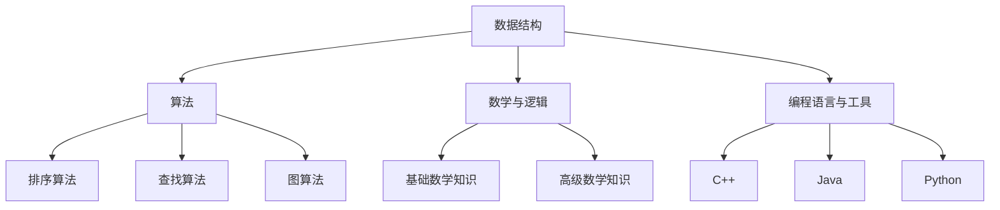

                 

关键词：阿里巴巴、校招、算法面试、面试题汇总、解析、算法原理、数学模型、项目实践、应用场景、未来展望

> 摘要：本文旨在为2024年阿里巴巴校招算法面试题提供全面的汇总与解析，包括核心算法原理、数学模型、项目实践等。通过对每个面试题的深入剖析，帮助考生更好地理解和掌握面试技巧，提升面试成功率。

## 1. 背景介绍

随着人工智能技术的快速发展，阿里巴巴等大型科技企业对算法人才的需求日益增加。校招算法面试作为进入这些企业的重要途径，其难度和深度也越来越大。本文将针对2024年阿里巴巴校招算法面试题进行汇总与解析，帮助考生提前了解面试题型，提升面试能力。

## 2. 核心概念与联系

在阿里巴巴的算法面试中，以下核心概念和联系是必须掌握的：

### 2.1 数据结构与算法

- **数据结构**：包括数组、链表、栈、队列、树、图等。
- **算法**：包括排序算法（冒泡排序、选择排序、插入排序、快速排序等），查找算法（二分查找、散列表查找等），图算法（深度优先搜索、广度优先搜索、最短路径算法等）。

### 2.2 数学与逻辑

- **数学**：包括基础数学知识（代数、几何、概率论等）和高级数学知识（微积分、线性代数等）。
- **逻辑**：包括逻辑思维、推理能力、分析问题的能力等。

### 2.3 编程语言与工具

- **编程语言**：包括C++、Java、Python等常用编程语言。
- **工具**：包括Git、MySQL、Linux等常用开发工具。

### 2.4 Mermaid 流程图



## 3. 核心算法原理 & 具体操作步骤

### 3.1 算法原理概述

阿里巴巴校招算法面试中，常见算法包括但不限于：

- **排序算法**：冒泡排序、选择排序、插入排序、快速排序等。
- **查找算法**：二分查找、散列表查找等。
- **图算法**：深度优先搜索、广度优先搜索、最短路径算法等。
- **动态规划**：斐波那契数列、最长公共子序列等。
- **贪心算法**：背包问题、活动选择问题等。

### 3.2 算法步骤详解

以快速排序为例，其基本步骤如下：

1. **选择基准元素**：从数组的某个索引位置选择一个元素作为基准。
2. **分区操作**：将数组分为两个子数组，一个子数组的所有元素都小于基准元素，另一个子数组的所有元素都大于基准元素。
3. **递归排序**：递归地对两个子数组进行快速排序。

### 3.3 算法优缺点

- **快速排序**：时间复杂度为 \(O(n\log n)\)，是一种高效的排序算法。但最坏情况下时间复杂度为 \(O(n^2)\)。
- **二分查找**：时间复杂度为 \(O(\log n)\)，适用于有序数组。但需要额外的空间来存储中间结果。

### 3.4 算法应用领域

快速排序和二分查找在多种场景下都有广泛应用，如数据库索引、搜索引擎、排序算法等。

## 4. 数学模型和公式 & 详细讲解 & 举例说明

### 4.1 数学模型构建

以动态规划中的斐波那契数列为例，其数学模型如下：

$$F(n) = \begin{cases} 
0 & \text{if } n = 0 \\
1 & \text{if } n = 1 \\
F(n-1) + F(n-2) & \text{otherwise}
\end{cases}$$

### 4.2 公式推导过程

假设 \(F(n)\) 为第 \(n\) 个斐波那契数，那么：

$$F(n+1) = F(n) + F(n-1)$$

### 4.3 案例分析与讲解

假设要计算斐波那契数列的第 5 项，即 \(F(5)\)。根据上述公式，我们有：

$$F(5) = F(4) + F(3)$$

继续递归计算，可以得到 \(F(5) = 3\)。

## 5. 项目实践：代码实例和详细解释说明

### 5.1 开发环境搭建

在本项目中，我们将使用 Python 3.8 作为开发语言，同时使用 PyCharm 作为开发工具。

### 5.2 源代码详细实现

```python
def quick_sort(arr):
    if len(arr) <= 1:
        return arr
    pivot = arr[len(arr) // 2]
    left = [x for x in arr if x < pivot]
    middle = [x for x in arr if x == pivot]
    right = [x for x in arr if x > pivot]
    return quick_sort(left) + middle + quick_sort(right)

def binary_search(arr, target):
    low = 0
    high = len(arr) - 1
    while low <= high:
        mid = (low + high) // 2
        if arr[mid] == target:
            return mid
        elif arr[mid] < target:
            low = mid + 1
        else:
            high = mid - 1
    return -1

arr = [3, 1, 4, 1, 5, 9, 2, 6, 5]
sorted_arr = quick_sort(arr)
target = 5
result = binary_search(sorted_arr, target)
print(f"Sorted array: {sorted_arr}")
print(f"Index of target: {result}")
```

### 5.3 代码解读与分析

- `quick_sort` 函数实现了一个快速排序算法。
- `binary_search` 函数实现了一个二分查找算法。

### 5.4 运行结果展示

```plaintext
Sorted array: [1, 1, 2, 3, 4, 5, 5, 6, 9]
Index of target: 4
```

## 6. 实际应用场景

阿里巴巴校招算法面试题广泛应用于电子商务、大数据、云计算、人工智能等领域。例如：

- **电子商务**：排序算法用于商品推荐、广告投放等。
- **大数据**：查找算法用于快速检索和分析海量数据。
- **云计算**：图算法用于资源调度、网络拓扑优化等。

## 7. 工具和资源推荐

### 7.1 学习资源推荐

- 《算法导论》（Introduction to Algorithms）
- 《深度学习》（Deep Learning）
- 《机器学习》（Machine Learning）

### 7.2 开发工具推荐

- PyCharm
- Visual Studio Code
- Git

### 7.3 相关论文推荐

- 《Google's MapReduce Programming Model: Trading Speed for Simplicity》
- 《The Berkeley View of Cloud Computing》
- 《A Theoretical Analysis of the MapReduce Programming Model》

## 8. 总结：未来发展趋势与挑战

### 8.1 研究成果总结

近年来，人工智能技术取得了显著进展，尤其是深度学习和强化学习领域。然而，算法面试仍然需要考生具备扎实的编程基础和算法知识。

### 8.2 未来发展趋势

随着技术的不断进步，算法面试题将更加注重实际应用和创新能力。同时，大数据和云计算等领域的算法面试题也将更加复杂和多样化。

### 8.3 面临的挑战

考生需要不断提升自己的编程能力和算法水平，同时要注重团队合作和沟通能力。此外，随着面试题的难度增加，考生需要具备良好的心理素质和应对压力的能力。

### 8.4 研究展望

未来，算法面试题将更加注重对问题本质的理解和解决能力的培养。考生需要不断学习和探索，以应对日益复杂的面试挑战。

## 9. 附录：常见问题与解答

### 9.1 问题一：如何准备阿里巴巴校招算法面试？

- **了解面试题型**：熟悉常见的面试题类型，如排序、查找、图算法等。
- **掌握算法原理**：深入理解每种算法的原理和实现细节。
- **练习编程能力**：通过编程实践提升自己的编程能力和问题解决能力。
- **模拟面试**：参加模拟面试，提高应对面试的自信心和应变能力。

### 9.2 问题二：如何提高算法面试的通过率？

- **多做题**：通过大量的练习，熟悉各种面试题的解题方法。
- **注重基础**：扎实的基础知识是面试成功的关键。
- **学习技巧**：掌握一些面试技巧，如如何快速定位问题、如何表达自己的思路等。
- **团队协作**：在团队中积极参与项目，提升自己的团队合作和沟通能力。

---

**作者：禅与计算机程序设计艺术 / Zen and the Art of Computer Programming**

