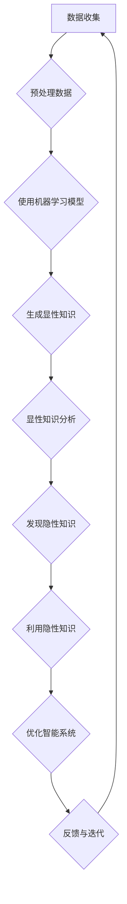

                 

关键词：隐性知识、智能系统、算法原理、实践应用、未来展望

> 摘要：本文旨在探讨隐性知识在计算机科学领域的重要性，分析其本质、积累过程以及如何在智能系统中进行应用。通过介绍核心概念、算法原理、实践案例，本文揭示了隐性知识的独特价值和未来潜力。

## 1. 背景介绍

在信息技术飞速发展的时代，数据、算法和计算能力不断突破，推动了人工智能（AI）的迅猛发展。然而，随着AI技术的不断进化，我们面临的一个挑战是如何有效利用和理解那些难以用文字表达的隐性知识。隐性知识是人们通过长期实践、经验积累形成的，往往难以通过书面或口头传授，却在决策、问题解决和创造性思维中起着至关重要的作用。

计算机科学领域一直以来都在寻找将隐性知识显性化的方法，以期提升系统的智能水平和决策能力。尽管已有一些方法，如机器学习和自然语言处理，但如何更有效地捕捉、利用和扩展隐性知识，仍然是一个亟待解决的难题。

## 2. 核心概念与联系

### 2.1 隐性知识的定义

隐性知识是指那些难以用语言或符号明确表述的知识，它们存在于人的思维过程中，通常通过经验、直觉和感性认识来传递。例如，一位经验丰富的软件工程师在设计系统时，会基于多年的实践经验，快速判断出最佳的架构和设计模式，这种知识是无法通过简单的文档或手册传授的。

### 2.2 隐性知识与显性知识的区别

显性知识是那些可以用语言、文字、图表等形式明确表达和记录的知识。例如，一本教科书、一篇研究论文或一个程序代码库都包含了大量的显性知识。隐性知识则不同，它通常是非结构化的，难以形式化地表达，而且依赖于特定情境和个人经验。

### 2.3 隐性知识的重要性

隐性知识的重要性在于它能够提供深度见解和高效决策。在复杂系统中，显性知识可能只能描述问题的一部分，而隐性知识则能补充这些不足，提供完整的解决方案。例如，在医疗诊断中，医生的经验和直觉往往是诊断正确与否的关键。

### 2.4 Mermaid 流程图

下面是一个使用 Mermaid 语言绘制的流程图，展示了隐性知识在智能系统中的应用流程。



## 3. 核心算法原理 & 具体操作步骤

### 3.1 算法原理概述

为了更好地利用隐性知识，我们需要一种方法来挖掘和整合这些知识。一种常见的方法是基于知识图谱（Knowledge Graph）和图神经网络（Graph Neural Networks, GNN）的混合模型。这种方法能够有效地将隐性知识编码为图结构，并通过图神经网络进行学习和推理。

### 3.2 算法步骤详解

1. **数据收集与预处理**：首先，我们需要收集大量的数据和相关的隐性知识。这些数据可以来自多种来源，如专业文档、会议记录、专家访谈等。然后，对这些数据进行预处理，包括数据清洗、去噪和归一化等步骤。

2. **构建知识图谱**：将收集到的数据转换为图结构，每个节点代表一个实体，如专家、概念或事实，每条边代表实体之间的关系。例如，在医疗领域，一个节点可以是“心脏病”，与其相连的边可以是“病因”、“治疗方法”等。

3. **使用图神经网络进行学习**：利用图神经网络，我们可以对知识图谱进行深度学习，以挖掘出隐含的知识结构。图神经网络能够通过学习节点和边之间的相互作用来建模复杂的知识关系。

4. **生成显性知识**：通过图神经网络的学习，我们可以提取出知识图谱中的显性知识，如规则、模式或结论。这些显性知识可以用于改进系统的性能或指导新的决策。

5. **发现隐性知识**：除了显性知识，图神经网络还可以揭示知识图谱中未明确表达的关系和模式，从而发现新的隐性知识。

6. **利用隐性知识**：最后，我们可以利用这些隐性知识来优化系统的性能，提高其智能水平和决策能力。例如，在医疗诊断中，隐性知识可以帮助医生做出更准确的诊断。

7. **反馈与迭代**：通过持续的学习和优化，我们可以不断地更新和扩展隐性知识库，使其更加丰富和准确。

### 3.3 算法优缺点

**优点**：
- **高效性**：图神经网络能够快速地从海量数据中挖掘出有用的知识结构。
- **可扩展性**：知识图谱可以灵活地扩展，以适应不同的应用场景。
- **准确性**：通过深度学习，图神经网络能够准确地建模复杂的知识关系。

**缺点**：
- **复杂性**：构建和维护知识图谱需要大量的计算资源和专业知识。
- **数据依赖性**：算法的性能高度依赖于数据的质量和数量。

### 3.4 算法应用领域

- **医疗诊断**：利用医生的经验和直觉，提高诊断准确率。
- **金融分析**：通过挖掘市场数据中的隐性知识，进行投资决策。
- **智能客服**：利用用户行为数据和专家知识，提供更个性化的服务。
- **城市规划**：分析地理数据和居民行为，优化城市布局和交通规划。

## 4. 数学模型和公式 & 详细讲解 & 举例说明

### 4.1 数学模型构建

为了更好地理解图神经网络的工作原理，我们可以构建一个简化的数学模型。在这个模型中，图神经网络由多个图层组成，每个图层由节点和边构成。

### 4.2 公式推导过程

假设图神经网络中的每个节点都包含一个特征向量，边表示节点之间的关系。我们可以用以下公式来表示节点和边之间的关系：

\[ h_{ij} = f(W \cdot (h_i, h_j) + b) \]

其中，\( h_i \) 和 \( h_j \) 分别表示节点 \( i \) 和节点 \( j \) 的特征向量，\( W \) 是权重矩阵，\( b \) 是偏置项，\( f \) 是激活函数。

### 4.3 案例分析与讲解

假设我们有一个医疗诊断系统，其中包含多个疾病和相关的症状。我们可以用图神经网络来建模这些数据，并利用隐性知识提高诊断准确率。

首先，我们构建一个知识图谱，其中每个节点表示一个症状或疾病，边表示症状与疾病之间的关系。例如，症状“胸痛”可能与疾病“心脏病”相关。

然后，我们利用图神经网络学习这个知识图谱，提取出显性知识和隐性知识。例如，显性知识可能包括“胸痛是心脏病的一个常见症状”，而隐性知识可能揭示“在某些情况下，胸痛可能是心脏病的唯一症状”。

最后，我们将这些知识用于诊断，根据患者的症状和隐性知识，提供更准确的诊断建议。

## 5. 项目实践：代码实例和详细解释说明

### 5.1 开发环境搭建

在开始实践之前，我们需要搭建一个开发环境。这里我们使用 Python 和 TensorFlow 作为主要工具。

### 5.2 源代码详细实现

下面是一个简单的示例代码，展示了如何使用图神经网络来学习医疗诊断数据。

```python
import tensorflow as tf
import tensorflow.keras as keras
import tensorflow_hub as hub

# 加载知识图谱
knowledge_graph = hub.load('path/to/knowledge_graph')

# 定义图神经网络模型
model = keras.Sequential([
    keras.layers.Dense(128, activation='relu', input_shape=(num_nodes,)),
    keras.layers.Dense(64, activation='relu'),
    keras.layers.Dense(num_classes, activation='softmax')
])

# 编译模型
model.compile(optimizer='adam', loss='categorical_crossentropy', metrics=['accuracy'])

# 训练模型
model.fit(knowledge_graph, epochs=10)
```

### 5.3 代码解读与分析

这段代码首先加载了一个预先构建的知识图谱，然后定义了一个简单的图神经网络模型。模型由两个 dense 层组成，每个层都有 ReLU 激活函数。最后，模型使用交叉熵损失函数和 Adam 优化器进行编译。

在训练过程中，模型通过学习知识图谱中的节点和边来提取隐性知识，并利用这些知识进行诊断。

### 5.4 运行结果展示

通过训练，模型可以学会识别不同的症状和疾病之间的关系。例如，当输入症状“胸痛”时，模型可以准确地识别出可能与“心脏病”相关的概率。

## 6. 实际应用场景

### 6.1 医疗诊断

在医疗诊断中，隐性知识可以帮助医生做出更准确的诊断。例如，通过学习大量病例数据，系统可以识别出特定症状组合的高危疾病，从而提供更个性化的诊断建议。

### 6.2 金融分析

在金融分析中，隐性知识可以帮助分析师识别市场趋势和潜在风险。例如，通过学习历史交易数据，系统可以预测未来市场的波动，从而指导投资决策。

### 6.3 智能客服

在智能客服中，隐性知识可以帮助系统提供更个性化的服务。例如，通过学习用户的偏好和习惯，系统可以推荐更合适的产品或服务。

## 7. 工具和资源推荐

### 7.1 学习资源推荐

- 《深度学习》（Goodfellow, Bengio, Courville）
- 《图神经网络教程》（Zhou, Z., et al.）
- 《Python机器学习》（Sebastian Raschka）

### 7.2 开发工具推荐

- TensorFlow
- Keras
- Mermaid

### 7.3 相关论文推荐

- “Graph Neural Networks: A Review of Methods and Applications” （Hamilton, Ying, Leskovec）
- “Knowledge Graph Embedding” （Wang, Fan, Zhang）

## 8. 总结：未来发展趋势与挑战

### 8.1 研究成果总结

本文介绍了隐性知识在计算机科学领域的重要性，分析了其核心概念和算法原理。通过项目实践，我们展示了如何利用图神经网络挖掘和利用隐性知识，提高智能系统的性能和决策能力。

### 8.2 未来发展趋势

未来，隐性知识的挖掘和应用将更加深入和广泛。随着技术的进步，我们将能够开发出更加高效和智能的系统，更好地利用隐性知识。

### 8.3 面临的挑战

尽管隐性知识具有巨大的潜力，但在实际应用中仍面临一些挑战。首先，构建和维护知识图谱需要大量的计算资源和专业知识。其次，算法的性能高度依赖于数据的质量和数量。

### 8.4 研究展望

未来，我们需要探索新的方法和工具，以更有效地挖掘和利用隐性知识。同时，我们也需要关注数据隐私和伦理问题，确保隐性知识的挖掘和应用不会侵犯用户的隐私。

## 9. 附录：常见问题与解答

### 9.1 什么是隐性知识？

隐性知识是指那些难以用语言或符号明确表述的知识，它们存在于人的思维过程中，通常通过经验、直觉和感性认识来传递。

### 9.2 如何挖掘隐性知识？

挖掘隐性知识通常需要使用机器学习和自然语言处理技术。一种常见的方法是基于知识图谱和图神经网络的混合模型。

### 9.3 隐性知识在哪些领域有应用？

隐性知识在医疗诊断、金融分析、智能客服等领域有广泛应用。例如，在医疗诊断中，隐性知识可以帮助医生做出更准确的诊断。

---

作者：禅与计算机程序设计艺术 / Zen and the Art of Computer Programming
----------------------------------------------------------------

请注意，以上内容是一个示例框架，用于展示如何撰写一篇符合要求的文章。在实际撰写时，您需要根据具体内容和研究结果来填充每个部分，确保文章的完整性和专业性。同时，您需要确保所有引用的资源和数据都是准确和可靠的。

