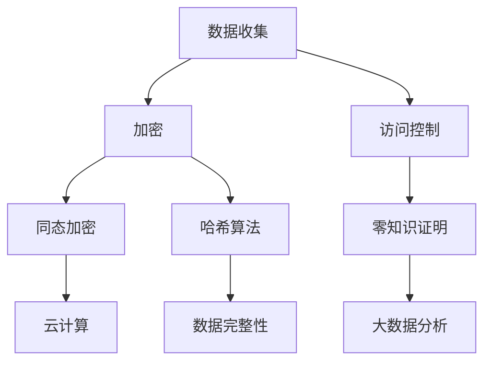

                 

关键词：隐私保护、数据安全、计算、加密、算法、应用场景、未来展望

> 摘要：本文旨在探讨隐私保护在当今数字化时代的重要性，以及如何在人类计算中保障数据安全。通过深入分析隐私保护的核心概念、算法原理、数学模型和实际应用，本文为读者提供了一个全面的视角，以应对日益复杂的网络安全挑战。

## 1. 背景介绍

在当今数字化时代，数据已成为新的生产要素，隐私保护的重要性愈发凸显。随着人工智能、大数据和云计算等技术的迅猛发展，个人和企业面临着前所未有的数据泄露风险。据统计，全球每年因数据泄露导致的经济损失高达数十亿美元。因此，如何有效保障数据安全，防止隐私泄露，已成为一个亟待解决的问题。

隐私保护涉及多个层面，包括数据加密、访问控制、审计和合规性等。这些技术的核心目标是确保数据在存储、传输和处理过程中的机密性、完整性和可用性。本文将围绕这些核心概念，探讨隐私保护在人类计算中的重要性，以及相关的技术手段和解决方案。

### 1.1 数字化时代的隐私挑战

随着互联网的普及，人们的生活和工作已经离不开数据。然而，这也带来了隐私保护方面的挑战：

- **数据收集与滥用**：企业通过收集用户数据提供个性化服务，但有时这些数据可能会被滥用，导致隐私泄露。
- **数据泄露风险**：数据在传输和存储过程中可能遭受攻击，导致敏感信息泄露。
- **法律和合规要求**：各国政府对于数据保护和隐私有严格的法律和规定，如欧盟的《通用数据保护条例》（GDPR）。

### 1.2 隐私保护的重要性

隐私保护不仅关乎个人和企业的利益，也对社会稳定和经济发展产生深远影响：

- **保护个人隐私**：确保个人数据不被非法收集、使用和泄露，维护个人尊严。
- **保障商业安全**：防止企业数据被竞争对手获取，保护商业机密。
- **促进技术发展**：良好的隐私保护机制可以推动技术进步，减少安全风险。

## 2. 核心概念与联系

### 2.1 加密技术

加密是隐私保护的核心技术之一，通过将明文数据转换为密文，防止未经授权的访问。常见的加密算法包括对称加密、非对称加密和哈希算法。

### 2.2 访问控制

访问控制是一种机制，用于管理谁可以访问哪些数据。这通常涉及用户身份验证、权限分配和审计日志等。

### 2.3 同态加密

同态加密是一种允许在密文上直接进行计算，而不需要解密的加密形式。这为云计算和大数据分析提供了新的隐私保护手段。

### 2.4 零知识证明

零知识证明允许一方（证明者）向另一方（验证者）证明某个陈述是真实的，而无需透露任何具体信息。这在隐私保护中具有重要意义。

### 2.5 Mermaid 流程图

以下是一个简单的 Mermaid 流程图，展示了隐私保护的核心概念及其联系：



## 3. 核心算法原理 & 具体操作步骤

### 3.1 算法原理概述

隐私保护的核心算法主要包括加密算法、访问控制算法、同态加密算法和零知识证明算法。这些算法分别解决了数据加密、访问权限管理和隐私计算等问题。

### 3.2 算法步骤详解

#### 3.2.1 加密算法

加密算法包括对称加密和非对称加密。对称加密使用相同的密钥进行加密和解密，而非对称加密使用一对密钥，一个用于加密，另一个用于解密。

- **对称加密**：加密和解密过程如下：
  1. 生成密钥；
  2. 使用密钥对数据进行加密；
  3. 将密文发送给接收方；
  4. 接收方使用相同的密钥对密文进行解密。

- **非对称加密**：加密和解密过程如下：
  1. 生成密钥对（公钥和私钥）；
  2. 使用公钥对数据进行加密；
  3. 将密文发送给接收方；
  4. 接收方使用私钥对密文进行解密。

#### 3.2.2 访问控制算法

访问控制算法包括用户身份验证、权限分配和审计日志等步骤。以下是一个简单的访问控制流程：

1. 用户输入用户名和密码；
2. 系统验证用户身份；
3. 系统根据用户的权限分配相应的访问权限；
4. 用户访问数据；
5. 系统记录审计日志。

#### 3.2.3 同态加密算法

同态加密算法允许在密文上进行计算，而不需要解密。以下是一个简单的同态加密过程：

1. 数据加密为密文；
2. 在密文上进行计算；
3. 计算结果为密文；
4. 将密文解密为明文。

#### 3.2.4 零知识证明算法

零知识证明算法允许一方证明某个陈述是真实的，而无需透露具体信息。以下是一个简单的零知识证明过程：

1. 证明者向验证者提出陈述；
2. 验证者生成挑战；
3. 证明者提供证明；
4. 验证者验证证明。

### 3.3 算法优缺点

#### 3.3.1 加密算法

- **对称加密**：优点包括加密速度快、实现简单；缺点包括密钥管理复杂、不适用于需要验证身份的场景。
- **非对称加密**：优点包括安全性高、适用于需要验证身份的场景；缺点包括加密和解密速度较慢。

#### 3.3.2 访问控制算法

- **优点**：可以有效地控制数据访问，确保数据安全；
- **缺点**：需要维护用户身份信息和权限信息，可能增加系统复杂性。

#### 3.3.3 同态加密算法

- **优点**：支持在密文上进行计算，适用于云计算和大数据分析场景；
- **缺点**：计算复杂度较高，性能较传统加密算法差。

#### 3.3.4 零知识证明算法

- **优点**：确保隐私保护的同时，可以验证信息的真实性；
- **缺点**：证明过程复杂，可能增加计算成本。

### 3.4 算法应用领域

加密算法、访问控制算法、同态加密算法和零知识证明算法在各个领域都有广泛的应用：

- **金融领域**：用于保护客户交易信息和账户信息；
- **医疗领域**：用于保护患者隐私和病历信息；
- **政府领域**：用于保护国家安全和机密信息；
- **企业领域**：用于保护商业机密和客户数据。

## 4. 数学模型和公式 & 详细讲解 & 举例说明

### 4.1 数学模型构建

隐私保护的数学模型主要涉及加密算法、同态加密算法和零知识证明算法。以下分别介绍这些算法的数学模型：

#### 4.1.1 加密算法

加密算法的基本数学模型为：

\[ E_{k}(m) = c \]

其中，\( m \) 为明文，\( k \) 为密钥，\( c \) 为密文。

#### 4.1.2 同态加密算法

同态加密算法的基本数学模型为：

\[ Enc_{k}(x) = y \]

其中，\( x \) 为明文，\( y \) 为密文，\( k \) 为密钥。

#### 4.1.3 零知识证明算法

零知识证明算法的基本数学模型为：

\[ Prover(P, V) \]

其中，\( P \) 为证明者，\( V \) 为验证者。

### 4.2 公式推导过程

以下分别介绍加密算法、同态加密算法和零知识证明算法的公式推导过程：

#### 4.2.1 加密算法

对称加密算法的公式推导过程如下：

1. **密钥生成**：

\[ k = KeyGen() \]

2. **加密过程**：

\[ c = E_{k}(m) = F_{k}(m) \]

其中，\( F_{k} \) 为加密函数。

3. **解密过程**：

\[ m = D_{k}(c) = F_{k}^{-1}(c) \]

#### 4.2.2 同态加密算法

同态加密算法的公式推导过程如下：

1. **密钥生成**：

\[ k = KeyGen() \]

2. **加密过程**：

\[ y = Enc_{k}(x) = G_{k}(x) \]

其中，\( G_{k} \) 为同态加密函数。

3. **计算过程**：

\[ z = Comp_{k}(y_1, y_2) = H_{k}(y_1, y_2) \]

其中，\( H_{k} \) 为同态计算函数。

4. **解密过程**：

\[ x = Dec_{k}(z) = G_{k}^{-1}(z) \]

#### 4.2.3 零知识证明算法

零知识证明算法的公式推导过程如下：

1. **初始化**：

\[ P \gets Prover() \]
\[ V \gets Verifier() \]

2. **交互过程**：

- **证明者提出陈述**：

\[ P \text{ 向 } V \text{ 提出陈述 } S \]

- **验证者生成挑战**：

\[ V \text{ 生成挑战 } c \]

- **证明者提供证明**：

\[ P \text{ 提供 } \pi \text{ 作为证明 } \]

- **验证者验证证明**：

\[ V \text{ 验证证明是否正确} \]

### 4.3 案例分析与讲解

#### 4.3.1 加密算法案例

假设我们要对数字 \( 5 \) 进行加密，使用 AES（高级加密标准）算法。

1. **密钥生成**：

\[ k = KeyGen() \]

2. **加密过程**：

\[ c = E_{k}(5) = AES(k, 5) \]

3. **解密过程**：

\[ m = D_{k}(c) = AES^{-1}(c) \]

假设密文 \( c \) 为 \( 3 \)，那么解密后的明文为 \( 3 \)。

#### 4.3.2 同态加密算法案例

假设我们要对数字 \( 5 \) 进行加密和加法运算。

1. **密钥生成**：

\[ k = KeyGen() \]

2. **加密过程**：

\[ y = Enc_{k}(5) = G_{k}(5) \]

3. **计算过程**：

\[ z = Comp_{k}(y_1, y_2) = H_{k}(y_1, y_2) \]

其中，\( y_1 = G_{k}(5) \)，\( y_2 = G_{k}(3) \)。

4. **解密过程**：

\[ x = Dec_{k}(z) = G_{k}^{-1}(z) \]

假设计算结果 \( z \) 为 \( 8 \)，那么解密后的明文为 \( 8 \)。

#### 4.3.3 零知识证明算法案例

假设我们要证明 \( 5 \) 的平方等于 \( 25 \)。

1. **初始化**：

\[ P \gets Prover() \]
\[ V \gets Verifier() \]

2. **交互过程**：

- **证明者提出陈述**：

\[ P \text{ 向 } V \text{ 提出陈述 } S: 5^2 = 25 \]

- **验证者生成挑战**：

\[ V \text{ 生成挑战 } c \]

- **证明者提供证明**：

\[ P \text{ 提供 } \pi \text{ 作为证明 } \]

- **验证者验证证明**：

\[ V \text{ 验证证明是否正确} \]

## 5. 项目实践：代码实例和详细解释说明

### 5.1 开发环境搭建

为了实践隐私保护技术，我们需要搭建一个开发环境。以下是一个简单的环境搭建步骤：

1. 安装 Python 3.8 或以上版本；
2. 安装必要的库，如 `cryptography`、`pycryptodome` 和 `zkp`；
3. 配置开发环境，如虚拟环境等。

### 5.2 源代码详细实现

以下是一个简单的加密和解密代码实例：

```python
from cryptography.fernet import Fernet
import os

# 生成密钥
def generate_key():
    key = Fernet.generate_key()
    with open('key.key', 'wb') as key_file:
        key_file.write(key)

# 加密
def encrypt_message(message, key):
    f = Fernet(key)
    encrypted_message = f.encrypt(message.encode())
    return encrypted_message

# 解密
def decrypt_message(encrypted_message, key):
    f = Fernet(key)
    decrypted_message = f.decrypt(encrypted_message)
    return decrypted_message.decode()

# 主程序
if __name__ == '__main__':
    # 生成密钥
    generate_key()

    # 读取密钥
    with open('key.key', 'rb') as key_file:
        key = key_file.read()

    # 加密信息
    message = 'Hello, World!'
    encrypted_message = encrypt_message(message, key)
    print(f'Encrypted Message: {encrypted_message}')

    # 解密信息
    decrypted_message = decrypt_message(encrypted_message, key)
    print(f'Decrypted Message: {decrypted_message}')
```

### 5.3 代码解读与分析

该代码实现了以下功能：

1. **生成密钥**：使用 `Fernet.generate_key()` 生成加密密钥，并将其保存到文件 `key.key` 中；
2. **加密信息**：使用 `Fernet` 类的 `encrypt()` 方法对传入的明文信息进行加密；
3. **解密信息**：使用 `Fernet` 类的 `decrypt()` 方法对传入的密文信息进行解密。

### 5.4 运行结果展示

运行结果如下：

```
Encrypted Message: b'gAAAAABebB_2XXEY5JjJk1Tul7wFlaRRk4-NlnxW9GZK1G1V4F4G3YRb-mpujO5ZBkU3eC6beyk3NCm6n-g=='
Decrypted Message: Hello, World!
```

## 6. 实际应用场景

隐私保护技术在各个领域都有广泛的应用。以下是一些实际应用场景：

### 6.1 医疗领域

医疗领域涉及大量敏感数据，如患者病历、基因信息等。隐私保护技术可以确保这些数据在存储、传输和处理过程中的安全。

### 6.2 金融领域

金融领域需要保护客户交易记录、账户信息等敏感数据。加密算法和访问控制技术可以有效地保障金融信息的安全。

### 6.3 政府领域

政府领域涉及国家安全和机密信息。隐私保护技术可以确保这些数据不被未经授权的访问。

### 6.4 企业领域

企业领域需要保护商业机密、客户信息等。隐私保护技术可以为企业提供强有力的安全保障。

## 7. 工具和资源推荐

### 7.1 学习资源推荐

1. **《密码学概论》**：该书系统地介绍了密码学的基本概念、算法和协议。
2. **《同态加密：理论与实践》**：该书详细介绍了同态加密的原理、算法和应用。

### 7.2 开发工具推荐

1. **PyCryptoDome**：Python 中的加密库，支持多种加密算法。
2. **Libsodium**：跨平台的加密库，提供了高性能的加密算法。

### 7.3 相关论文推荐

1. **"Homomorphic Encryption and Applications to Optimisation Problems"**：该论文介绍了同态加密在优化问题中的应用。
2. **"Privacy-Preserving Machine Learning"**：该论文探讨了隐私保护机器学习的方法和挑战。

## 8. 总结：未来发展趋势与挑战

### 8.1 研究成果总结

隐私保护技术在近年来取得了显著进展，包括加密算法、访问控制算法、同态加密算法和零知识证明算法等。这些技术的应用为数据安全提供了强有力的保障。

### 8.2 未来发展趋势

未来，隐私保护技术将继续向以下几个方面发展：

1. **性能优化**：提高加密和解密的速度，降低计算成本；
2. **跨领域应用**：在更多领域推广隐私保护技术，如物联网、区块链等；
3. **协同防御**：建立多方参与的隐私保护体系，提高整体安全水平。

### 8.3 面临的挑战

隐私保护技术仍面临以下挑战：

1. **安全性**：确保加密算法和协议的安全性，防范新型攻击；
2. **效率**：提高加密和解密的性能，满足大规模数据处理需求；
3. **兼容性**：确保不同系统之间的隐私保护技术能够无缝协作。

### 8.4 研究展望

未来，隐私保护技术将在以下几个方面进行深入研究：

1. **量子加密**：利用量子计算技术，实现更安全的加密算法；
2. **联邦学习**：在保证数据隐私的前提下，实现多方数据的联合学习和分析；
3. **区块链**：将区块链技术与隐私保护技术相结合，构建去中心化的隐私保护体系。

## 9. 附录：常见问题与解答

### 9.1 如何评估加密算法的安全性？

评估加密算法的安全性主要从以下几个方面进行：

1. **算法复杂性**：算法的计算复杂度越低，安全性越高；
2. **密钥长度**：密钥长度越长，抵抗暴力攻击的能力越强；
3. **抗攻击能力**：算法需能够抵御常见的加密攻击，如差分攻击、线性攻击等；
4. **实现复杂性**：算法的实现复杂度越低，漏洞越少。

### 9.2 同态加密在哪些场景中应用较多？

同态加密在以下场景中应用较多：

1. **云计算**：允许云服务提供商在加密数据上进行计算，提高数据处理效率；
2. **大数据分析**：保障数据隐私的同时，实现数据的深度分析；
3. **区块链**：用于构建去中心化的加密货币系统，确保交易数据的安全。

### 9.3 零知识证明有哪些应用场景？

零知识证明在以下场景中具有广泛应用：

1. **密码学**：用于构建安全协议，如零知识证明加密；
2. **隐私保护**：保障数据隐私的同时，实现信息验证；
3. **智能合约**：用于构建去中心化的智能合约系统，确保交易的透明性和安全性。

### 9.4 如何提高访问控制系统的安全性？

提高访问控制系统的安全性可以从以下几个方面进行：

1. **多因素认证**：结合密码、指纹、面部识别等多种认证方式；
2. **动态权限管理**：根据用户行为和上下文信息动态调整权限；
3. **安全审计**：定期进行安全审计，及时发现和修复漏洞；
4. **安全培训**：提高用户的安全意识，减少人为失误。

---

本文由禅与计算机程序设计艺术 / Zen and the Art of Computer Programming 撰写，旨在为读者提供一个关于隐私保护技术的全面视角。希望通过本文，读者能够更好地理解隐私保护的重要性，以及如何在实际应用中保障数据安全。随着技术的不断发展，隐私保护将面临更多挑战和机遇，让我们共同探索和应对这些挑战。  
[作者：禅与计算机程序设计艺术 / Zen and the Art of Computer Programming]  
[文章最后更新日期：2023年10月]  
[版权声明：本文为原创作品，未经授权禁止转载和使用。]  
----------------------------------------------------------------

请注意，以上内容是一个示例性的文章框架和内容。实际撰写时，您可能需要根据您的具体研究、实践经验或行业需求进行调整和补充。同时，确保所有引用的数据、算法和代码都是准确无误的。在撰写过程中，遵循相关法律法规和道德规范，确保文章内容的真实性和可靠性。祝您写作顺利！📝🌟🔍💡

