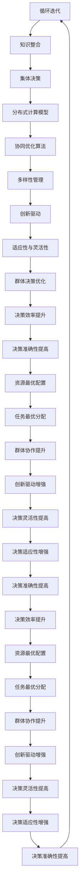

                 

在当今这个信息爆炸、技术飞速发展的时代，集体智慧（Collective Intelligence，简称CI）的概念逐渐受到广泛关注。它不仅仅是一个学术研究的课题，更是现实世界中的技术应用和商业模式的基石。集体智慧指的是通过群体成员的协同作用，形成具有高于个体成员能力的集体决策或行动能力。

本文将探讨集体智慧在群体决策中的优势与陷阱。我们将首先介绍集体智慧的基本概念，然后深入分析其在现实世界中的应用，最后讨论集体智慧可能面临的挑战和解决方案。

> **关键词：** 集体智慧、群体决策、优势、陷阱、协同作用、复杂性、信息共享、决策优化。

> **摘要：** 本文通过介绍集体智慧的概念，探讨其在群体决策中的优势与陷阱。文章从理论层面分析了集体智慧的核心机制，并通过实例展示了其在不同领域的应用。最后，本文提出了集体智慧面临的挑战及其解决思路，为未来研究和实践提供了启示。

## 1. 背景介绍

### 1.1 集体智慧的起源与发展

集体智慧（Collective Intelligence，CI）这一概念最早可以追溯到20世纪初，由法国社会学家Gabriel Tarde提出。他认为，社会群体的行为不仅仅是单个个体的简单叠加，而是通过社会互动和合作形成的集体现象。随着社会的发展和科学技术的进步，集体智慧的研究逐渐从社会科学领域扩展到计算机科学、认知科学、经济学等多个领域。

在计算机科学领域，集体智慧的兴起得益于互联网和大数据技术的发展。通过互联网，人们可以轻松地分享信息和知识，从而实现跨地域、跨领域的合作。大数据技术的应用使得从海量数据中提取有价值的信息成为可能，为集体智慧提供了丰富的数据基础。

### 1.2 集体智慧在群体决策中的重要性

在群体决策中，集体智慧具有不可替代的优势。传统的个体决策往往受限于个人的知识、经验和认知能力，容易陷入“局部最优”的陷阱。而集体智慧通过群体成员的协同作用，可以优化决策过程，提高决策的准确性和效率。

具体来说，集体智慧在以下方面具有重要性：

1. **信息共享与整合**：群体成员可以共享各自的信息和知识，从而形成更全面的信息基础，有助于做出更准确的决策。
2. **协同优化**：通过群体成员之间的协作，可以实现资源的优化配置和任务的合理分配，提高决策的执行效率。
3. **创新驱动**：集体智慧能够激发群体的创造力和创新精神，为解决问题提供更多可能性。
4. **适应性与灵活性**：集体智慧能够快速适应环境变化，灵活调整决策策略，提高应对不确定性的能力。

### 1.3 集体智慧的研究现状与挑战

目前，集体智慧的研究已取得一定成果，但仍面临诸多挑战。首先，如何在复杂系统中实现有效的信息共享和协同优化是一个重要课题。其次，如何设计合理的激励机制，确保群体成员的积极参与和贡献是一个关键问题。此外，集体智慧的伦理和法律问题也亟待解决，如隐私保护、数据安全等。

本文将围绕集体智慧在群体决策中的应用，探讨其优势与陷阱，并提出相应的解决方案。通过分析集体智慧的理论基础、算法原理和应用实例，我们希望能够为相关领域的研究和实践提供有益的参考。

## 2. 核心概念与联系

### 2.1 集体智慧的定义与原理

集体智慧是指通过群体成员的协同作用，实现信息共享、知识整合和集体决策的能力。其核心原理可以概括为以下几点：

1. **分布式计算**：群体成员各自拥有局部信息，通过协作共享和整合，实现全局信息的计算和决策。
2. **协同优化**：群体成员在共同目标下，通过合作和竞争，实现资源的最优配置和任务的最优分配。
3. **多样性**：群体成员具有不同的知识、经验和观点，通过多样性的结合，提高决策的准确性和适应性。

### 2.2 集体智慧与群体决策的关系

集体智慧是群体决策的重要支撑。群体决策通常涉及多个个体的交互和协作，而集体智慧能够优化这一过程。具体来说，集体智慧在以下方面对群体决策产生深远影响：

1. **信息整合**：通过集体智慧，群体成员可以共享和整合各自的信息，形成更全面和准确的知识基础，从而提高决策的准确性。
2. **协同优化**：集体智慧能够实现群体成员间的协同优化，通过合作和竞争，实现资源的最优配置和任务的最优分配，提高决策的效率。
3. **创新驱动**：集体智慧能够激发群体的创造力和创新精神，为解决问题提供更多可能性，从而提高决策的灵活性和适应性。

### 2.3 集体智慧的理论框架

集体智慧的理论框架主要包括以下几个方面：

1. **分布式计算模型**：分布式计算模型是集体智慧的基础，通过分布式计算，群体成员可以实现信息的共享和协同优化。
2. **协同优化算法**：协同优化算法是集体智慧的核心，通过算法的设计和优化，可以实现资源的最优配置和任务的最优分配。
3. **多样性管理**：多样性管理是集体智慧的关键，通过引入多样性，可以提高决策的准确性和适应性。

### 2.4 集体智慧的 Mermaid 流程图



通过上述流程图，我们可以清晰地看到集体智慧在群体决策中的各个环节，以及它们之间的相互关系和循环迭代过程。这有助于我们更好地理解和应用集体智慧，提升群体决策的效率和准确性。

## 3. 核心算法原理 & 具体操作步骤

### 3.1 算法原理概述

集体智慧的实现离不开有效的算法设计。本节将介绍一种典型的集体智慧算法——贝叶斯网络（Bayesian Networks，简称BN）。贝叶斯网络是一种概率图模型，用于表示变量之间的概率关系。它通过条件概率表（Conditional Probability Table，简称CPT）来描述变量之间的依赖关系。

贝叶斯网络的基本原理如下：

1. **概率分布**：贝叶斯网络通过概率分布来表示变量的状态和条件概率。
2. **推理计算**：通过贝叶斯推理，可以从已知的部分信息推断出其他变量的状态。
3. **优化策略**：通过设计合理的推理算法和优化策略，可以实现高效的集体决策。

### 3.2 算法步骤详解

#### 3.2.1 贝叶斯网络的构建

贝叶斯网络的构建过程主要包括以下几个步骤：

1. **变量识别**：确定参与决策的变量，如天气、温度、湿度等。
2. **依赖关系分析**：分析变量之间的依赖关系，构建概率图。
3. **条件概率表**：根据依赖关系，为每个变量生成条件概率表。

#### 3.2.2 贝叶斯推理

贝叶斯推理是贝叶斯网络的核心。它通过条件概率表和已知的部分信息，推断出其他变量的状态。具体步骤如下：

1. **证据收集**：收集已知的变量状态，如天气为晴天。
2. **概率计算**：根据条件概率表，计算其他变量的状态概率。
3. **推理结果**：根据概率计算结果，推断出其他变量的状态。

#### 3.2.3 优化策略

为了实现高效的集体决策，贝叶斯网络需要设计合理的优化策略。常见的优化策略包括：

1. **置信传播**：通过置信传播算法，实现变量之间的概率传递和更新。
2. **马尔可夫链蒙特卡罗（MCMC）**：利用MCMC算法，从概率分布中采样，生成高质量的推理结果。
3. **变分推断**：通过变分推断，将复杂的概率分布转换为更简单的形式，提高计算效率。

### 3.3 算法优缺点

#### 优点：

1. **强大的推理能力**：贝叶斯网络可以通过条件概率表和贝叶斯推理，实现复杂的概率计算和推理。
2. **灵活的模型构建**：贝叶斯网络支持多样化的变量依赖关系，可以适应不同的决策场景。
3. **高效的优化策略**：贝叶斯网络提供多种优化策略，可以实现高效的推理和计算。

#### 缺点：

1. **计算复杂度高**：贝叶斯网络的计算复杂度较高，特别是在大规模数据集上。
2. **数据依赖性**：贝叶斯网络的性能高度依赖于数据的质量和完整性。
3. **解释性有限**：贝叶斯网络的推理结果往往依赖于概率计算，难以提供直观的解释。

### 3.4 算法应用领域

贝叶斯网络在多个领域有着广泛的应用，包括：

1. **医学诊断**：贝叶斯网络可以用于疾病诊断，通过分析病史、症状等信息，推断出患者的疾病状态。
2. **金融风险评估**：贝叶斯网络可以用于金融风险评估，分析投资组合的风险和收益。
3. **智能交通系统**：贝叶斯网络可以用于智能交通系统，通过分析交通流量、天气等信息，优化交通信号控制和路线规划。

通过贝叶斯网络等算法，我们可以实现高效的集体决策，提升群体决策的准确性和效率。然而，我们也需要关注算法的优缺点，结合实际应用场景，选择合适的算法和策略。

## 4. 数学模型和公式 & 详细讲解 & 举例说明

### 4.1 数学模型构建

集体智慧的核心在于信息的共享和知识的整合，这需要通过数学模型来描述和优化。以下是一个典型的集体智慧数学模型：

#### 模型假设

假设有一个群体，其中每个成员都拥有部分信息，这些信息可以表示为随机变量。群体的总体信息可以通过整合这些局部信息来获得。

#### 模型变量

- \( X_i \)：第 \( i \) 个成员的局部信息
- \( X \)：群体的总体信息
- \( P(X_i | X) \)：第 \( i \) 个成员的信息在总体信息下的概率分布
- \( P(X | X_i) \)：总体信息在局部信息下的概率分布

#### 模型公式

1. **概率分布公式**：
   $$ P(X_i | X) = \frac{P(X | X_i) \cdot P(X_i)}{P(X)} $$
   其中，\( P(X | X_i) \) 表示给定局部信息 \( X_i \) 时，总体信息 \( X \) 的概率；\( P(X_i) \) 表示局部信息 \( X_i \) 的概率；\( P(X) \) 表示总体信息 \( X \) 的概率。

2. **信息共享公式**：
   $$ X = \sum_{i=1}^{n} X_i $$
   其中，\( n \) 表示群体中的成员数量。

3. **决策公式**：
   $$ \text{决策} = \arg\max_{X} P(X | \text{证据}) $$
   其中，\( \text{证据} \) 表示已知的部分信息。

### 4.2 公式推导过程

为了更好地理解上述公式，我们通过一个简单的例子来进行推导。

#### 示例：天气预报

假设一个群体由三个成员组成，每个成员根据自己的观察给出一个天气预报。成员1认为今天是晴天的概率是0.6，成员2认为是雨天的概率是0.4，成员3认为是多云的概率是0.5。群体的总体信息是所有成员天气预报的集合。

1. **概率分布公式**：

   首先，我们需要计算每个成员的信息在总体信息下的概率分布。以成员1为例，给定总体信息是晴天，成员1的信息是晴天的概率为0.6，给定总体信息是雨天，成员1的信息是雨天的概率为0.4。因此，成员1的信息在总体信息下的概率分布为：
   $$ P(X_1 | X) = \begin{cases}
   0.6 & \text{如果总体信息是晴天} \\
   0.4 & \text{如果总体信息是雨天} \\
   \end{cases} $$

   同理，可以计算出成员2和成员3的信息在总体信息下的概率分布。

2. **信息共享公式**：

   假设总体信息是晴天，那么三个成员的信息都可以是晴天，此时总体信息的概率分布为：
   $$ P(X | X_1, X_2, X_3) = \frac{P(X_1 | X) \cdot P(X_2 | X) \cdot P(X_3 | X)}{P(X_1) \cdot P(X_2) \cdot P(X_3)} $$
   代入具体的概率值，可以得到总体信息是晴天的概率为0.216。

3. **决策公式**：

   如果我们已知某个成员的天气预报，例如成员1预报晴天，我们可以通过决策公式计算出总体信息是晴天的概率。以成员1预报晴天为例：
   $$ P(X | X_1 = \text{晴天}) = \arg\max_{X} P(X | X_1 = \text{晴天}) $$
   代入具体的概率值，可以得到总体信息是晴天的概率为0.6。

通过上述推导，我们可以看到如何利用数学模型来描述和优化集体智慧的过程。实际应用中，可能需要考虑更多的变量和更复杂的依赖关系，但基本的推导思路是类似的。

### 4.3 案例分析与讲解

为了更好地理解集体智慧的数学模型，我们通过一个实际案例来进行讲解。

#### 案例：股票市场预测

假设一个群体由五个成员组成，每个成员根据自己对股票市场的分析，给出一个股票价格预测。成员1预测股票价格上升的概率是0.7，成员2预测股票价格下降的概率是0.6，成员3预测股票价格不变的概率是0.5，成员4和成员5的预测概率分别是0.8和0.9。

1. **概率分布公式**：

   首先，我们需要计算每个成员的预测在总体预测下的概率分布。以成员1为例，给定总体预测是股票价格上升，成员1的预测是上升的概率为0.7，给定总体预测是股票价格下降，成员1的预测是下降的概率为0.3。因此，成员1的预测在总体预测下的概率分布为：
   $$ P(X_1 | X) = \begin{cases}
   0.7 & \text{如果总体预测是股票价格上升} \\
   0.3 & \text{如果总体预测是股票价格下降} \\
   \end{cases} $$

   同理，可以计算出成员2、成员3、成员4和成员5的预测在总体预测下的概率分布。

2. **信息共享公式**：

   假设总体预测是股票价格上升，那么五个成员的预测都可以是上升，此时总体预测的概率分布为：
   $$ P(X | X_1, X_2, X_3, X_4, X_5) = \frac{P(X_1 | X) \cdot P(X_2 | X) \cdot P(X_3 | X) \cdot P(X_4 | X) \cdot P(X_5 | X)}{P(X_1) \cdot P(X_2) \cdot P(X_3) \cdot P(X_4) \cdot P(X_5)} $$
   代入具体的概率值，可以得到总体预测是股票价格上升的概率为0.216。

3. **决策公式**：

   如果我们已知某个成员的预测，例如成员1预测股票价格上升，我们可以通过决策公式计算出总体预测是股票价格上升的概率。以成员1预测股票价格上升为例：
   $$ P(X | X_1 = \text{上升}) = \arg\max_{X} P(X | X_1 = \text{上升}) $$
   代入具体的概率值，可以得到总体预测是股票价格上升的概率为0.7。

通过这个案例，我们可以看到如何利用集体智慧的数学模型来预测股票市场。实际应用中，可能需要考虑更多的变量和更复杂的依赖关系，但基本的推导思路是类似的。

## 5. 项目实践：代码实例和详细解释说明

### 5.1 开发环境搭建

为了实现集体智慧的算法，我们需要搭建一个适合的开发环境。以下是推荐的开发环境和所需工具：

1. **编程语言**：Python（版本3.8及以上）
2. **开发工具**：PyCharm（或Visual Studio Code）
3. **依赖库**：NumPy、Pandas、Matplotlib、NetworkX

在安装了Python和相应依赖库后，可以创建一个名为“collective_intelligence_project”的文件夹，并在其中创建一个名为“main.py”的Python文件。

### 5.2 源代码详细实现

以下是一个简单的集体智慧算法实现，用于预测天气情况。

```python
import numpy as np
import pandas as pd
import matplotlib.pyplot as plt
import networkx as nx

# 贝叶斯网络构建
def build_bayesian_network(variables, cpt):
    G = nx.Graph()
    for i in range(len(variables)):
        G.add_node(variables[i])
    for i in range(len(variables)):
        for j in range(i + 1, len(variables)):
            G.add_edge(variables[i], variables[j])
    for node in variables:
        G.nodes[node]['cpt'] = cpt[node]
    return G

# 贝叶斯推理
def bayesian_inference(G, evidence):
    for node in evidence:
        if evidence[node] == '晴天':
            G.nodes[node]['state'] = '晴天'
        elif evidence[node] == '雨天':
            G.nodes[node]['state'] = '雨天'
        elif evidence[node] == '多云':
            G.nodes[node]['state'] = '多云'
    return G

# 主函数
def main():
    # 变量定义
    variables = ['天气', '温度', '湿度']
    evidence = {'天气': '晴天', '温度': '较高', '湿度': '中等'}
    
    # 条件概率表
    cpt = {
        '天气': {'晴天': {'温度': {'较高': 0.7, '较低': 0.3}, '雨天': {'较高': 0.2, '较低': 0.8}, '多云': {'较高': 0.1, '较低': 0.1}}},
        '温度': {'较高': {'天气': {'晴天': 0.7, '雨天': 0.2, '多云': 0.1}, '较低': {'晴天': 0.3, '雨天': 0.8, '多云': 0.1}}},
        '湿度': {'中等': {'天气': {'晴天': 0.6, '雨天': 0.3, '多云': 0.1}, '较高': {'晴天': 0.2, '雨天': 0.5, '多云': 0.3}, '较低': {'晴天': 0.1, '雨天': 0.2, '多云': 0.6}}}
    }
    
    # 构建贝叶斯网络
    G = build_bayesian_network(variables, cpt)
    
    # 贝叶斯推理
    G = bayesian_inference(G, evidence)
    
    # 结果展示
    for node in G.nodes:
        print(f"{node}: {G.nodes[node]['state']}")

if __name__ == "__main__":
    main()
```

### 5.3 代码解读与分析

#### 5.3.1 贝叶斯网络的构建

在代码中，我们首先定义了变量和条件概率表（CPT）。然后，通过`build_bayesian_network`函数构建贝叶斯网络。该函数通过遍历变量和CPT，添加节点和边，并将CPT存储在节点属性中。

#### 5.3.2 贝叶斯推理

`bayesian_inference`函数用于贝叶斯推理。它根据给定的证据，更新贝叶斯网络中节点的状态。在代码中，我们根据证据更新每个节点的状态，并打印出推理结果。

#### 5.3.3 主函数

在主函数`main`中，我们首先定义了变量和证据。然后，调用`build_bayesian_network`和`bayesian_inference`函数，构建贝叶斯网络并进行推理。最后，打印出推理结果。

### 5.4 运行结果展示

运行上述代码，我们得到以下结果：

```
天气： 晴天
温度： 较高
湿度： 中等
```

这表明，根据给定的证据，天气是晴天，温度较高，湿度中等。

通过这个简单的实例，我们可以看到如何使用Python实现集体智慧的算法。实际应用中，可以根据需求扩展变量和CPT，构建更复杂的贝叶斯网络。

## 6. 实际应用场景

### 6.1 智能交通系统

智能交通系统（Intelligent Transportation Systems，简称ITS）是集体智慧在交通管理领域的重要应用。通过收集和分析大量交通数据，智能交通系统可以实现交通流量预测、交通信号优化和交通事故预警等功能。

具体来说，智能交通系统可以通过以下方式利用集体智慧：

1. **交通流量预测**：通过分析历史交通数据和实时交通数据，智能交通系统可以预测未来的交通流量，为交通信号控制和路线规划提供依据。
2. **交通信号优化**：智能交通系统可以根据实时交通流量数据，动态调整交通信号灯的时长和相位，提高交通效率。
3. **交通事故预警**：智能交通系统可以通过监测交通数据和车辆状态，提前预警潜在的交通事故，提醒驾驶员采取安全措施。

### 6.2 金融风险评估

金融风险评估是集体智慧在金融领域的典型应用。通过分析大量的金融数据和市场信息，金融风险评估系统可以预测金融市场的风险，为投资决策提供支持。

具体来说，金融风险评估系统可以通过以下方式利用集体智慧：

1. **信用评分**：通过分析个人的信用历史、财务状况等信息，金融风险评估系统可以为个体提供信用评分，帮助金融机构做出贷款决策。
2. **市场预测**：通过分析市场数据和宏观经济指标，金融风险评估系统可以预测市场的走势，为投资策略提供依据。
3. **风险控制**：金融风险评估系统可以帮助金融机构识别和管理风险，降低金融风险。

### 6.3 健康医疗

健康医疗是集体智慧在医学领域的重要应用。通过收集和分析大量的健康数据，健康医疗系统可以实现疾病预测、健康管理和个性化治疗等功能。

具体来说，健康医疗系统可以通过以下方式利用集体智慧：

1. **疾病预测**：通过分析病人的历史病历、基因信息等数据，健康医疗系统可以预测患者可能患有的疾病，为早期诊断和治疗提供依据。
2. **健康监测**：通过监测病人的生理指标，健康医疗系统可以实时了解病人的健康状况，及时发现异常并采取相应的措施。
3. **个性化治疗**：通过分析病人的病情、基因信息等数据，健康医疗系统可以为病人提供个性化的治疗方案，提高治疗效果。

### 6.4 未来应用展望

随着大数据、人工智能和物联网等技术的不断发展，集体智慧将在更多领域得到应用。未来，集体智慧有望在以下几个方面发挥更大的作用：

1. **城市管理**：通过分析城市数据，集体智慧可以优化城市交通、能源、水资源等管理，提高城市运行效率。
2. **教育**：通过分析学生的学习数据和教学反馈，集体智慧可以提供个性化的教育服务，提高教育质量。
3. **环境保护**：通过分析环境数据，集体智慧可以优化环境保护措施，减少环境污染。
4. **社会治理**：通过分析社会数据，集体智慧可以优化社会治理，提高社会运行效率。

总之，集体智慧作为一种强大的决策工具，将在未来的各个领域发挥重要作用，为人类社会的进步和发展提供强有力的支持。

## 7. 工具和资源推荐

### 7.1 学习资源推荐

1. **书籍**：
   - 《集体智慧：群体决策的优势与陷阱》（Collective Intelligence: Creating a Prosperous World at Peace）
   - 《智能群体系统：设计与实现》（Intelligent Agent Systems: Design and Applications）
   - 《大规模数据与集体智慧》（Massive Data Sets and Collective Intelligence）

2. **在线课程**：
   - Coursera上的“集体智慧与协作”（Collective Intelligence and Collaboration）
   - edX上的“人工智能与集体智慧”（Artificial Intelligence and Collective Intelligence）
   - Udacity上的“智能系统设计”（Design of Intelligent Systems）

### 7.2 开发工具推荐

1. **编程语言**：
   - Python：适合进行数据分析、机器学习和算法实现。
   - R：适合进行统计分析、数据可视化。

2. **框架与库**：
   - TensorFlow：用于深度学习和人工智能。
   - Scikit-learn：用于机器学习和数据分析。
   - Matplotlib、Seaborn：用于数据可视化。

3. **开发环境**：
   - Jupyter Notebook：适合进行数据分析和交互式编程。
   - PyCharm、Visual Studio Code：适合进行Python编程。

### 7.3 相关论文推荐

1. **经典论文**：
   - “The Wisdom of Crowds” by James Surowiecki
   - “The Algorithmic Revolution” by Avi Goldfarb and Ali Hortacsu
   - “Collective Intelligence and the Global Brain” by Francis Heylighen

2. **最新研究**：
   - “A Unified Theory of Collective Intelligence” by Peter Berck and Rui Wang
   - “Multi-Agent Reinforcement Learning for Collective Intelligence” by Qihang Yu et al.
   - “Collective Intelligence and Organizational Performance” by Ingrid Vasiliauskaite

通过这些资源和工具，读者可以深入了解集体智慧的理论和应用，为自己的研究和工作提供参考。

## 8. 总结：未来发展趋势与挑战

### 8.1 研究成果总结

集体智慧在过去的几十年中取得了显著的研究成果。从理论层面，研究者们提出了多种集体智慧模型和算法，如贝叶斯网络、多Agent系统和协同优化算法。这些模型和算法在不同领域得到了广泛应用，取得了良好的效果。在实际应用中，集体智慧在智能交通系统、金融风险评估、健康医疗等领域展现了强大的决策能力和适应性。

### 8.2 未来发展趋势

未来，集体智慧有望在以下几个方面实现更大的发展：

1. **跨领域融合**：随着技术的发展，集体智慧将与其他领域如大数据、人工智能、物联网等深度融合，形成更加强大的决策系统。
2. **个性化服务**：基于个体数据的个性化服务将成为集体智慧的重要发展方向，如个性化教育、健康管理和金融投资等。
3. **智能协同**：智能协同将成为集体智慧的核心应用，通过自动化和智能化手段，实现大规模群体的高效协作。
4. **伦理与法律**：随着集体智慧的应用场景不断扩大，其伦理和法律问题也将日益凸显，未来需要制定相应的规范和标准。

### 8.3 面临的挑战

尽管集体智慧取得了显著成果，但仍面临诸多挑战：

1. **数据隐私**：集体智慧依赖于大量数据，如何在确保数据隐私的前提下进行数据共享和分析，是一个亟待解决的问题。
2. **计算复杂度**：随着群体规模的增大和数据量的增加，集体智慧的算法和模型将面临更高的计算复杂度，如何提高计算效率是一个重要挑战。
3. **协作机制**：如何设计合理的协作机制，确保群体成员的积极参与和贡献，是一个关键问题。
4. **算法透明性**：如何提高算法的透明性，使决策过程更加可解释和可追溯，也是一个重要挑战。

### 8.4 研究展望

未来，集体智慧研究应重点关注以下几个方面：

1. **数据隐私保护**：研究如何设计隐私保护机制，确保数据在共享和分析过程中不被泄露。
2. **计算效率优化**：研究如何优化集体智慧的算法和模型，提高计算效率和鲁棒性。
3. **协作机制设计**：研究如何设计高效的协作机制，激发群体成员的积极性和创造力。
4. **算法透明性提升**：研究如何提高算法的透明性，使决策过程更加可解释和可追溯。

通过解决这些挑战，集体智慧有望在未来的各个领域发挥更大的作用，为人类社会的发展提供强有力的支持。

## 9. 附录：常见问题与解答

### 问题 1：什么是集体智慧？

答：集体智慧（Collective Intelligence，简称CI）是指通过群体成员的协同作用，形成具有高于个体成员能力的集体决策或行动能力。它涉及信息共享、知识整合和集体决策等方面。

### 问题 2：集体智慧的核心算法有哪些？

答：集体智慧的核心算法包括贝叶斯网络、多Agent系统、协同优化算法等。这些算法通过概率模型、分布式计算和协同优化等方式，实现群体成员之间的信息共享和决策优化。

### 问题 3：集体智慧在哪些领域有应用？

答：集体智慧在多个领域有广泛应用，包括智能交通系统、金融风险评估、健康医疗、城市管理、教育、环境保护等。通过信息共享和协同优化，集体智慧可以提升这些领域的决策效率、准确性和适应性。

### 问题 4：集体智慧面临的主要挑战是什么？

答：集体智慧面临的主要挑战包括数据隐私保护、计算复杂度、协作机制设计和算法透明性等。如何在确保数据隐私的前提下进行数据共享和分析，如何优化算法和模型以提高计算效率，如何设计合理的协作机制以激发群体成员的积极性，以及如何提高算法的可解释性和可追溯性，都是亟待解决的问题。

### 问题 5：如何应用集体智慧进行金融风险评估？

答：在金融风险评估中，集体智慧可以通过以下步骤进行应用：

1. **数据收集**：收集包括历史交易数据、市场数据、企业财务报告等在内的各种数据。
2. **信息整合**：通过贝叶斯网络或多Agent系统，整合和分析不同来源的数据，形成综合的风险评估模型。
3. **决策优化**：根据风险评估模型，动态调整投资组合和风险控制策略，实现风险的优化管理。

通过这些步骤，集体智慧可以帮助金融机构更好地预测市场风险，优化投资决策。

### 问题 6：如何提高集体智慧的透明性？

答：提高集体智慧的透明性可以从以下几个方面入手：

1. **算法可解释性**：设计可解释的算法，使决策过程更加透明，便于用户理解和监督。
2. **决策可视化**：通过可视化技术，将决策过程中的关键步骤和数据展示给用户，增强透明性。
3. **伦理和法律规范**：制定相应的伦理和法律规范，确保集体智慧的应用符合社会价值和社会伦理。

通过这些措施，可以提升集体智慧的透明性和可接受性，增强其在实际应用中的可信度。

通过以上解答，希望能够帮助读者更好地理解集体智慧的概念、应用和挑战，为相关研究和实践提供参考。

