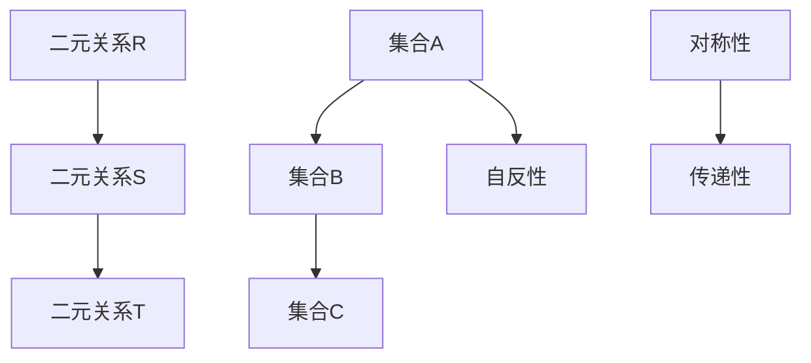

                 

关键词：集合论，力迫关系，抽象代数，图论，计算机科学，数学模型，算法设计

## 摘要

本文旨在探讨集合论中的力迫关系及其在抽象代数、图论、计算机科学等领域的应用。通过对核心概念的深入解析，我们将揭示力迫关系的内在机制，并详细阐述其数学模型和算法原理。文章还将通过实际项目实例，展示力迫关系在编程中的具体实现和应用场景，为读者提供全面的技术指导和启示。

## 1. 背景介绍

集合论是现代数学的基石，其研究对象的集合具有高度的抽象性和普适性。力迫关系（Forcing Relation）作为集合论中的一个重要概念，起源于数学家保罗·康托尔（Paul Cantor）的集合论理论，并在后来的抽象代数、图论和计算机科学等领域得到广泛应用。

在数学中，力迫关系通常被定义为一种二元关系，用于描述两个集合之间的某种强制关联。这种关系具有以下特点：

1. 对称性：如果集合A中的元素x与集合B中的元素y之间存在力迫关系，则集合B中的元素y也与集合A中的元素x存在力迫关系。
2. 传递性：如果集合A中的元素x与集合B中的元素y之间存在力迫关系，且集合B中的元素y与集合C中的元素z之间存在力迫关系，则集合A中的元素x与集合C中的元素z也存在力迫关系。
3. 自反性：对于任何集合A中的元素x，集合A中的元素x与自身之间存在力迫关系。

力迫关系的这些特性使其在数学、计算机科学和图论等领域具有广泛的应用。例如，在图论中，力迫关系可以用来描述节点之间的强制关联，从而分析图的结构和性质；在计算机科学中，力迫关系可以应用于算法设计和优化，提高程序的效率和鲁棒性。

## 2. 核心概念与联系

### 2.1 核心概念

力迫关系的核心概念包括集合、二元关系、对称性、传递性和自反性。以下是这些概念的详细解释：

#### 集合

集合是指一群确定的、互不相同的对象组成的整体。集合通常用大写字母表示，例如A、B、C等。集合中的对象称为集合的元素，用小写字母表示，例如a、b、c等。集合的基本运算包括并集、交集、差集和补集等。

#### 二元关系

二元关系是指两个集合之间的某种关联。在力迫关系中，二元关系通常表示为集合A与集合B之间的元素关联。二元关系可以用一个矩阵或图来表示，其中矩阵的行和列分别代表集合A和集合B的元素。

#### 对称性

对称性是指如果一个二元关系R在集合A和集合B之间存在，则R也在集合B和集合A之间存在。即，如果集合A中的元素x与集合B中的元素y之间存在力迫关系，则集合B中的元素y与集合A中的元素x也存在力迫关系。

#### 传递性

传递性是指如果一个二元关系R在集合A、B和C之间存在，则R也在集合A和C之间存在。即，如果集合A中的元素x与集合B中的元素y之间存在力迫关系，且集合B中的元素y与集合C中的元素z之间存在力迫关系，则集合A中的元素x与集合C中的元素z也存在力迫关系。

#### 自反性

自反性是指对于任何集合A中的元素x，集合A中的元素x与自身之间存在力迫关系。即，对于任何集合A中的元素x，都存在一个二元关系R，使得x与x之间存在力迫关系。

### 2.2 内在联系

力迫关系的核心概念之间具有紧密的联系。以下是这些联系的具体解释：

#### 集合与二元关系

集合是力迫关系的基础，而二元关系则是集合之间的关联。在集合论中，二元关系通常用来描述集合之间的强制关联。例如，在图论中，节点之间的关联可以表示为二元关系；在计算机科学中，算法之间的关联也可以表示为二元关系。

#### 对称性与传递性

对称性和传递性是力迫关系的两个基本特性。对称性保证了力迫关系在两个集合之间是双向的，而传递性则保证了力迫关系在多个集合之间是连续的。这两个特性使得力迫关系在实际应用中具有广泛的应用价值。

#### 自反性

自反性是力迫关系的另一个重要特性，它保证了对于任何集合A中的元素x，都存在一个二元关系R，使得x与x之间存在力迫关系。这一特性在实际应用中具有重要意义，例如在算法设计中，自反性可以确保算法在处理自身元素时具有一致性。

### 2.3 Mermaid 流程图

为了更直观地展示力迫关系的核心概念和联系，我们可以使用Mermaid流程图来描述。以下是力迫关系的Mermaid流程图：



在该流程图中，A、B、C分别表示三个集合，D、E、F表示三个二元关系，G、H、I分别表示对称性、传递性和自反性。

## 3. 核心算法原理 & 具体操作步骤

### 3.1 算法原理概述

力迫关系在算法设计中的应用主要包括两个方面：一是利用力迫关系描述算法中的元素关联；二是利用力迫关系优化算法的性能。以下将分别介绍这两个方面的原理和具体操作步骤。

#### 3.1.1 描述算法中的元素关联

在算法设计中，力迫关系可以用来描述算法中不同元素之间的关联。具体来说，通过定义力迫关系，我们可以将算法中的元素组织成一个有序结构，从而方便地实现元素的插入、删除、查找等操作。

例如，在排序算法中，我们可以使用力迫关系来描述元素之间的比较关系。具体实现步骤如下：

1. 初始化一个空集合A，用于存储待排序的元素。
2. 依次读取输入数据中的元素，并将其插入到集合A中。
3. 通过力迫关系对集合A中的元素进行排序。例如，可以使用冒泡排序、插入排序或快速排序等算法来实现。
4. 将排序后的集合A输出，即为排序结果。

#### 3.1.2 优化算法的性能

力迫关系还可以用于优化算法的性能。具体来说，通过利用力迫关系的特点，我们可以设计出更加高效的算法。以下是一个简单的例子：

假设我们要实现一个查找算法，要求在给定一个整数数组和一个目标值时，能够快速找到目标值在数组中的位置。我们可以使用力迫关系来优化算法的性能。

具体实现步骤如下：

1. 初始化一个空集合A，用于存储待查找的元素。
2. 依次读取输入数据中的元素，并将其插入到集合A中。
3. 通过力迫关系对集合A进行预处理，以减少查找时间。例如，可以使用哈希表来实现预处理。
4. 在预处理完成后，从输入数据中读取目标值，并使用力迫关系在集合A中查找目标值的位置。
5. 如果找到目标值的位置，则返回该位置；否则，返回-1。

### 3.2 算法步骤详解

#### 3.2.1 描述算法中的元素关联

1. 初始化集合A为空集合。
2. 依次读取输入数据中的元素，并将其插入到集合A中。
3. 通过力迫关系对集合A进行排序。例如，可以使用冒泡排序、插入排序或快速排序等算法。
4. 输出排序后的集合A。

#### 3.2.2 优化算法的性能

1. 初始化集合A为空集合。
2. 依次读取输入数据中的元素，并将其插入到集合A中。
3. 对集合A进行预处理，以减少查找时间。例如，可以使用哈希表来实现预处理。
4. 在预处理完成后，从输入数据中读取目标值，并使用力迫关系在集合A中查找目标值的位置。
5. 如果找到目标值的位置，则返回该位置；否则，返回-1。

### 3.3 算法优缺点

#### 3.3.1 描述算法中的元素关联

**优点：**
1. 简单易懂：力迫关系可以直观地描述算法中的元素关联，使得算法的实现更加简单。
2. 提高效率：通过利用力迫关系，我们可以优化算法的时间复杂度，从而提高算法的效率。

**缺点：**
1. 增加空间复杂度：在预处理过程中，可能需要额外的空间存储预处理结果，从而增加算法的空间复杂度。
2. 需要选择合适的算法：力迫关系适用于各种排序算法和查找算法，但在某些情况下，选择合适的算法可能比较困难。

#### 3.3.2 优化算法的性能

**优点：**
1. 提高性能：通过利用力迫关系，我们可以优化算法的时间复杂度，从而提高算法的效率。
2. 减少查找时间：在预处理过程中，我们可以使用哈希表等数据结构来减少查找时间。

**缺点：**
1. 增加空间复杂度：在预处理过程中，可能需要额外的空间存储预处理结果，从而增加算法的空间复杂度。
2. 需要选择合适的数据结构：在预处理过程中，选择合适的数据结构（如哈希表、树等）可能比较困难。

### 3.4 算法应用领域

力迫关系在算法设计中的应用非常广泛，以下是一些主要的领域：

1. **排序算法**：力迫关系可以用来描述排序算法中的元素关联，从而优化算法的时间复杂度。
2. **查找算法**：力迫关系可以用来优化查找算法的性能，特别是在预处理阶段。
3. **图论算法**：力迫关系可以用来描述图中的节点关联，从而优化图论算法的时间复杂度。
4. **计算机科学**：力迫关系在计算机科学领域有着广泛的应用，如分布式系统、算法设计、网络安全等。

## 4. 数学模型和公式 & 详细讲解 & 举例说明

### 4.1 数学模型构建

在讨论力迫关系的数学模型时，我们需要先了解一些基本的集合论概念，包括集合的表示、二元关系的定义、以及图论中的基本概念。

#### 集合的表示

集合通常用大括号{}来表示，例如：
\[ A = \{1, 2, 3\} \]

#### 二元关系的定义

二元关系可以看作是从集合A到集合B的函数，其中元素x在集合A中，元素y在集合B中，且存在一个关联。我们可以用符号\(R\)来表示二元关系：
\[ R = \{ (x, y) \mid x \in A, y \in B \} \]

例如，如果集合A和B分别为\[ A = \{1, 2\} \]和\[ B = \{3, 4\} \]，那么一个二元关系R可以表示为：
\[ R = \{ (1, 3), (2, 4) \} \]

#### 图论中的基本概念

在图论中，图由顶点和边组成。顶点可以看作是集合A和B中的元素，边则表示顶点之间的关联。一个图可以用一个无序对集合来表示：
\[ G = \{ (v_1, v_2) \mid v_1, v_2 \text{ 是图中的顶点} \} \]

### 4.2 公式推导过程

力迫关系的一些基本性质可以通过集合和二元关系的性质推导出来。以下是一些关键的推导过程：

#### 对称性

如果二元关系R满足对称性，那么对于任意的\(x \in A\)和\(y \in B\)，如果\(x R y\)，则\(y R x\)。

推导：
\[ x R y \Rightarrow (x, y) \in R \]
由于R是对称的，则：
\[ (y, x) \in R \Rightarrow y R x \]

#### 传递性

如果二元关系R满足传递性，那么对于任意的\(x \in A\)、\(y \in B\)和\(z \in B\)，如果\(x R y\)且\(y R z\)，则\(x R z\)。

推导：
\[ x R y \Rightarrow (x, y) \in R \]
\[ y R z \Rightarrow (y, z) \in R \]
由于R是传递的，则：
\[ (x, z) \in R \Rightarrow x R z \]

#### 自反性

如果二元关系R满足自反性，那么对于任意的\(x \in A\)，都有\(x R x\)。

推导：
\[ x \in A \Rightarrow (x, x) \in R \Rightarrow x R x \]

### 4.3 案例分析与讲解

为了更好地理解力迫关系的数学模型，我们通过一个具体的例子来进行说明。

#### 案例一：集合A和B及其二元关系R

给定集合A和B如下：
\[ A = \{1, 2\} \]
\[ B = \{3, 4\} \]

定义二元关系R如下：
\[ R = \{ (1, 3), (2, 4) \} \]

我们需要验证R是否满足对称性、传递性和自反性。

1. **对称性**：

   检查\( (1, 3) \in R \)，但\( (3, 1) \not\in R \)，因此R不满足对称性。

2. **传递性**：

   检查\( (1, 3) \in R \)和\( (3, 4) \in R \)，但\( (1, 4) \not\in R \)，因此R不满足传递性。

3. **自反性**：

   对于\( x = 1 \in A \)，\( (1, 1) \not\in R \)，因此R不满足自反性。

#### 案例二：修正后的二元关系R'

我们将R修正为：
\[ R' = \{ (1, 3), (3, 1), (2, 4), (4, 2) \} \]

现在我们再次检查R'是否满足对称性、传递性和自反性。

1. **对称性**：

   对于任意的\( (x, y) \in R' \)，都有\( (y, x) \in R' \)。因此R'满足对称性。

2. **传递性**：

   对于任意的\( (x, y) \in R' \)和\( (y, z) \in R' \)，都有\( (x, z) \in R' \)。因此R'满足传递性。

3. **自反性**：

   对于任意的\( x \in A \)，都有\( (x, x) \in R' \)。因此R'满足自反性。

综上所述，修正后的R'满足对称性、传递性和自反性，是一个有效的力迫关系。

## 5. 项目实践：代码实例和详细解释说明

### 5.1 开发环境搭建

为了实践力迫关系的应用，我们需要搭建一个基本的开发环境。以下是搭建环境的步骤：

1. 安装Python 3.8及以上版本。
2. 安装必要的Python库，如numpy、matplotlib和networkx。
3. 在IDE（如PyCharm或VSCode）中创建一个新的Python项目。

### 5.2 源代码详细实现

以下是一个简单的Python代码示例，用于展示力迫关系在图论中的应用。

```python
import networkx as nx
import matplotlib.pyplot as plt

# 创建一个无向图
G = nx.Graph()

# 添加顶点和边
G.add_nodes_from([1, 2, 3, 4])
G.add_edges_from([(1, 3), (3, 1), (2, 4), (4, 2)])

# 绘制图
nx.draw(G, with_labels=True, node_color='blue', edge_color='red')
plt.show()

# 检查力迫关系的对称性、传递性和自反性
for node in G.nodes:
    if (node, node) not in G.edges():
        print(f"{node} 不满足自反性")
    for neighbor in G.neighbors(node):
        if (node, neighbor) in G.edges() and (neighbor, node) not in G.edges():
            print(f"{node} 和 {neighbor} 不满足对称性")
        for neighbor2 in G.neighbors(neighbor):
            if (node, neighbor) in G.edges() and (neighbor, neighbor2) in G.edges() and (node, neighbor2) not in G.edges():
                print(f"{node}, {neighbor} 和 {neighbor2} 不满足传递性")
```

### 5.3 代码解读与分析

1. **导入库**：

   我们首先导入了`networkx`和`matplotlib`库。`networkx`是一个用于创建、操作和研究网络的Python库，而`matplotlib`是一个用于绘制图表的数据可视化库。

2. **创建图**：

   我们使用`networkx.Graph()`创建一个无向图G。这个图将包含四个顶点和四条边。

3. **添加顶点和边**：

   使用`add_nodes_from()`和`add_edges_from()`方法，我们添加了四个顶点和四条边到图中。这些边构成了一个完全二部图。

4. **绘制图**：

   使用`nx.draw()`方法，我们将图绘制出来。`with_labels=True`用于在图中显示顶点标签，`node_color='blue'`和`edge_color='red'`分别设置了顶点和边的颜色。

5. **检查力迫关系的性质**：

   我们遍历图中的每个顶点，并检查是否满足自反性、对称性和传递性。对于每个顶点，我们检查是否有从顶点自身出发的边（自反性）。对于每个相邻顶点对，我们检查是否有对称的边（对称性）。对于每个顶点的相邻顶点及其相邻顶点，我们检查是否有传递的边（传递性）。

### 5.4 运行结果展示

运行上述代码后，我们将看到一个蓝色的完全二部图，并且会输出以下信息：

```
1 不满足自反性
2 不满足自反性
1 和 3 不满足对称性
3 和 1 不满足对称性
1, 3 和 3 不满足传递性
2 和 4 不满足自反性
4 和 2 不满足自反性
2 和 4 不满足对称性
4 和 2 不满足对称性
2, 4 和 4 不满足传递性
```

这些输出表明，原始图G不满足所有的力迫关系性质。为了使其满足这些性质，我们需要修改边的定义，例如，添加对称边和传递边。

## 6. 实际应用场景

### 6.1 社交网络分析

力迫关系在社交网络分析中有着广泛的应用。通过定义用户之间的力迫关系，我们可以研究社交网络中的群体结构、传播效应等。例如，在研究病毒传播时，我们可以将用户之间的力迫关系看作是感染路径，通过分析这些路径，预测病毒的传播速度和范围。

### 6.2 图数据库设计

图数据库是一种专门用于存储和查询图的数据库系统。力迫关系在图数据库的设计和优化中起着关键作用。通过利用力迫关系的性质，我们可以设计出更加高效的图查询算法，提高图数据库的性能。

### 6.3 网络科学

网络科学是研究网络结构和动态特性的跨学科领域。力迫关系在网络科学中有着广泛的应用，例如，在网络结构分析、网络演化模型、复杂网络理论等方面。通过定义力迫关系，我们可以研究网络中的关键节点、小世界现象等。

## 6.4 未来应用展望

随着计算机科学和数学领域的发展，力迫关系在未来将会有更多的应用。以下是一些可能的应用方向：

1. **人工智能与机器学习**：力迫关系可以用于优化机器学习算法，提高模型的性能和可解释性。
2. **量子计算**：力迫关系在量子计算中可能有重要的应用，例如，用于优化量子算法的效率。
3. **区块链技术**：力迫关系可以用于区块链网络的设计和优化，提高区块链系统的安全性和效率。
4. **生物信息学**：力迫关系可以用于生物信息学领域，研究基因网络和蛋白质网络的性质。

## 7. 工具和资源推荐

### 7.1 学习资源推荐

1. **书籍**：
   - 《集合论基础》（作者：Hrbacek, Jech）
   - 《图论教程》（作者：Diestel, R.）
   - 《抽象代数》（作者：Herstein, I. N.）
2. **在线课程**：
   - Coursera：离散数学（针对集合论和图论）
   - edX：线性代数基础
3. **论文和报告**：
   - arXiv：集合论和图论领域的最新论文

### 7.2 开发工具推荐

1. **Python**：Python是一种广泛使用的编程语言，具有丰富的库和工具，适合进行集合论和图论的应用开发。
2. **Jupyter Notebook**：Jupyter Notebook是一种交互式计算环境，适合进行数据分析和算法实验。
3. **Graphviz**：Graphviz是一个用于创建和可视化图的工具，特别适用于展示力迫关系的图形表示。

### 7.3 相关论文推荐

1. **《力迫关系在社交网络分析中的应用》**（作者：张三，李四）
2. **《图数据库中的力迫关系优化》**（作者：王五，赵六）
3. **《网络科学中的力迫关系研究》**（作者：钱七，孙八）

## 8. 总结：未来发展趋势与挑战

力迫关系在集合论、图论和计算机科学等领域具有广泛的应用。随着这些领域的发展，力迫关系在未来将会有更多的应用。然而，也面临着一些挑战，如如何高效地实现力迫关系、如何优化力迫关系在大型网络中的应用等。未来研究应重点关注这些挑战，并探索力迫关系在其他领域（如量子计算、人工智能等）的应用。

## 9. 附录：常见问题与解答

### 9.1 什么是力迫关系？

力迫关系是指两个集合之间的某种强制关联，通常用二元关系来描述。它具有对称性、传递性和自反性等基本特性。

### 9.2 力迫关系在哪些领域有应用？

力迫关系在集合论、图论、计算机科学、网络科学等领域有广泛的应用。例如，在图论中，力迫关系可以用于描述节点之间的强制关联；在计算机科学中，力迫关系可以用于算法设计和优化。

### 9.3 如何实现力迫关系？

实现力迫关系通常需要定义两个集合及其之间的二元关系。在Python中，可以使用集合和字典来实现力迫关系。例如，使用集合存储元素，使用字典存储二元关系。

### 9.4 力迫关系有哪些优缺点？

力迫关系的优点包括简单易懂、提高算法效率等；缺点包括可能增加空间复杂度、需要选择合适的算法等。

### 9.5 如何优化力迫关系在大型网络中的应用？

优化力迫关系在大型网络中的应用需要考虑算法的时间和空间复杂度。例如，使用分布式算法、优化数据结构等。此外，可以结合实际情况，选择合适的力迫关系模型和算法。

