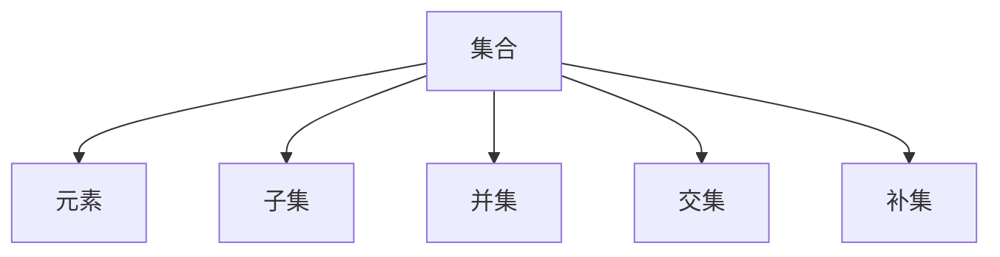
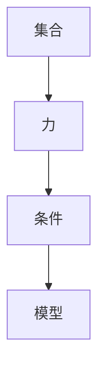
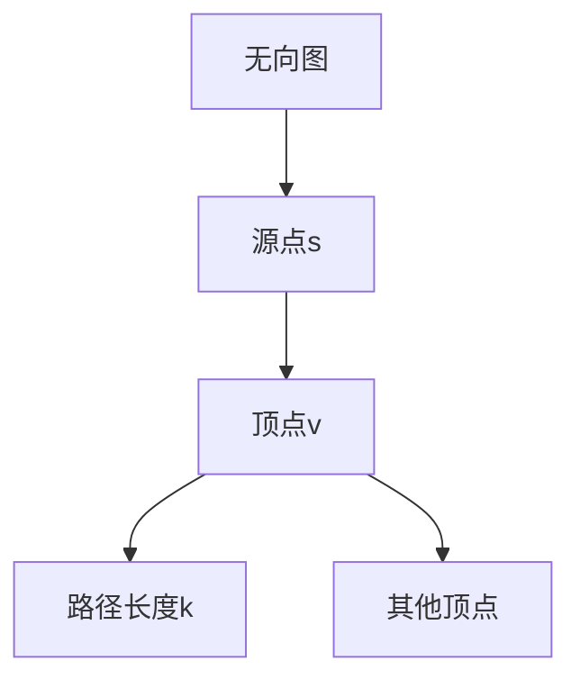
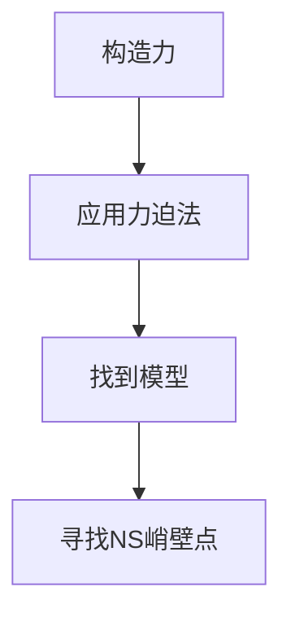
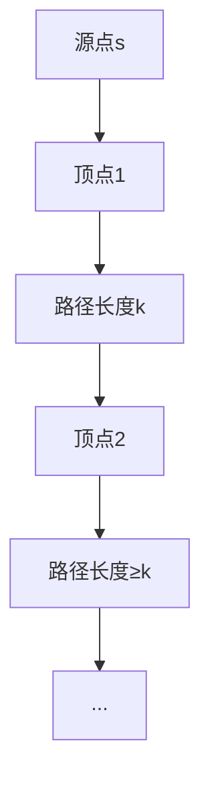
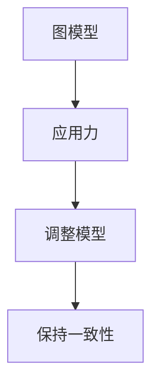
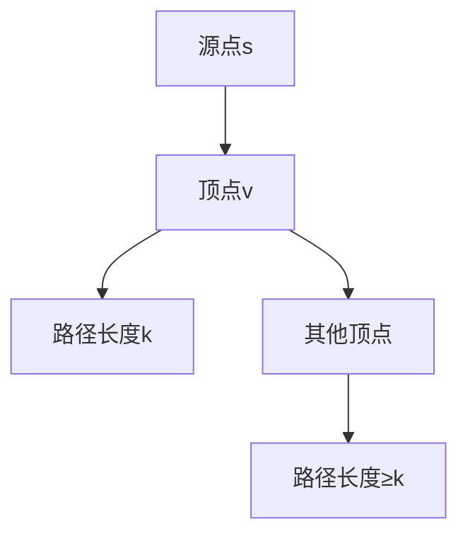

                 

关键词：集合论、力迫法、NS峭壁、逻辑推理、数学模型、算法应用

> 摘要：本文旨在为读者深入浅出地介绍集合论中的力迫法及其在NS峭壁问题中的应用。力迫法是集合论中一种强大的工具，能够解决许多复杂问题。而NS峭壁问题则是一个经典的图论问题，本文将借助集合论的力迫法，探索其背后的数学原理及算法实现。通过本文的讲解，读者不仅能了解力迫法的基本概念，还能掌握其在实际问题中的应用。

## 1. 背景介绍

集合论是现代数学的基石，其诞生可以追溯到19世纪末期。集合论的基本概念包括集合、元素、子集、并集、交集、补集等，这些概念构成了数学研究的基础。而力迫法（Forcing）是集合论中一种重要的工具，起源于20世纪30年代。力迫法最初是为了解决连续统假设（Continuum Hypothesis）而提出的，但在后来的研究中，力迫法被广泛应用于多个数学领域，如拓扑学、动力系统、数论等。

另一方面，NS峭壁问题（NS-Barrier Problem）是图论中一个经典的问题。NS峭壁问题可以描述为：给定一个无向图G和一个源点s，判断是否存在一个顶点v，从s到v的路径长度为k，且v到其他所有顶点的路径长度都不小于k。该问题在理论计算机科学和实际应用中都有着广泛的应用。

本文将结合集合论和图论的知识，借助力迫法，探讨NS峭壁问题的解决方法。通过本文的讲解，读者不仅可以了解力迫法的基本原理，还能掌握其在图论问题中的应用。

### 1.1 集合论的发展历程

集合论的发展历程可以说是数学史上的一次革命。19世纪末，数学家康托尔（Georg Cantor）提出了集合论的基本概念，并开始对集合的性质进行研究。康托尔的工作引发了数学界的广泛关注，同时也引发了关于集合论基础性的争议。

在康托尔的集合论中，集合被视为一系列确定的、互异的元素的整体。康托尔提出了集合的若干基本性质，如并集、交集、补集等。他还研究了集合的大小，即集合的势。康托尔的工作为后来的集合论研究奠定了基础。

然而，康托尔的集合论也面临着一些问题。特别是，他的集合定义在某些情况下显得过于宽泛，导致了一些悖论的出现。最著名的悖论之一是“罗素悖论”（Russell's Paradox），它揭示了康托尔的集合论中的一些逻辑漏洞。

为了解决这些问题，数学家们开始寻找更加严谨的集合论基础。在20世纪初期，泽梅罗（Ernst Zermelo）和弗兰克尔（Paul Bernays）等人提出了新的集合论公理系统，即ZFC（Zermelo-Fraenkel set theory with the axiom of choice）。ZFC公理系统为集合论提供了更加严密的基础，避免了悖论的出现。

ZFC公理系统包括若干基本公理，如空集公理、幂集公理、选择公理等。这些公理确保了集合论的基本性质，如集合的存在性、唯一性等。ZFC公理系统已经成为现代数学的基石，广泛应用于各个数学分支。

### 1.2 力迫法的基本原理

力迫法（Forcing）是集合论中一种重要的工具，起源于20世纪30年代。力迫法最初是为了解决连续统假设（Continuum Hypothesis）而提出的，但在后来的研究中，力迫法被广泛应用于多个数学领域，如拓扑学、动力系统、数论等。

力迫法的基本思想是，通过引入一个新的集合，使得原集合的性质发生变化。这个新的集合被称为“力”（Forcing）。力迫法的具体实现依赖于一个称为“模型”（Model）的数学结构。力迫法的核心是找到一个合适的模型，使得力迫法能够在该模型中实现。

在力迫法中，力是一个满足某些条件的集合。这些条件称为“条件”（Conditions）。条件决定了力的性质，从而影响了模型的变化。通过引入力，力迫法可以在模型中实现某些原本不可能发生的变化。

力迫法的应用非常广泛。例如，在拓扑学中，力迫法可以用来研究拓扑空间的性质；在动力系统中，力迫法可以用来研究混沌现象；在数论中，力迫法可以用来研究无穷集合的性质。通过力迫法，数学家们能够解决许多复杂的问题，揭示数学结构中的深层次规律。

### 1.3 NS峭壁问题的基本概念

NS峭壁问题（NS-Barrier Problem）是图论中一个经典的问题。NS峭壁问题可以描述为：给定一个无向图G和一个源点s，判断是否存在一个顶点v，从s到v的路径长度为k，且v到其他所有顶点的路径长度都不小于k。该问题在理论计算机科学和实际应用中都有着广泛的应用。

在NS峭壁问题中，图G是一个无向图，包含若干个顶点和边。源点s是一个特定的顶点，从s出发可以到达其他顶点。路径长度是指从源点s到某个顶点v的边的数量。如果存在一个顶点v，满足从s到v的路径长度为k，且v到其他所有顶点的路径长度都不小于k，则称v是一个NS峭壁点。

NS峭壁问题的解决对于许多实际问题都有重要的意义。例如，在社交网络分析中，可以用来判断一个顶点是否具有重要的影响力；在复杂网络分析中，可以用来识别关键节点和薄弱环节。通过解决NS峭壁问题，可以更好地理解网络的拓扑结构和功能。

## 2. 核心概念与联系

在本文中，我们将介绍集合论中的力迫法及其在NS峭壁问题中的应用。为了更好地理解这些核心概念，我们将使用Mermaid流程图来展示它们之间的联系。

### 2.1 集合论的基本概念

首先，我们需要回顾集合论中的基本概念，如集合、元素、子集、并集、交集和补集等。



### 2.2 力迫法的基本概念

接下来，我们介绍力迫法的基本概念。力迫法是通过引入一个新的集合（力）来改变原集合的性质。



### 2.3 NS峭壁问题的基本概念

最后，我们介绍NS峭壁问题的基本概念。NS峭壁问题是一个图论问题，涉及无向图、源点和路径长度等概念。



### 2.4 力迫法在NS峭壁问题中的应用

通过将力迫法应用于NS峭壁问题，我们可以得到一个解决NS峭壁问题的算法。以下是该算法的基本步骤：

1. 构造一个力，用于改变原集合的性质。
2. 利用力迫法找到一个满足条件的模型。
3. 在模型中，寻找一个NS峭壁点。



通过以上流程图，我们可以清晰地看到集合论、力迫法和NS峭壁问题之间的联系。力迫法作为集合论的一种工具，可以应用于图论问题，如NS峭壁问题的解决。这种跨领域的应用展示了数学理论的强大和灵活性。

## 3. 核心算法原理 & 具体操作步骤

### 3.1 算法原理概述

力迫法在集合论中的应用为解决复杂问题提供了一种强大的工具。在NS峭壁问题的背景下，力迫法可以通过引入一个“力”来改变图的性质，从而帮助我们找到满足条件的NS峭壁点。

力迫法的基本原理可以概括为以下几个步骤：

1. **选择合适的力**：根据NS峭壁问题的需求，构造一个满足特定条件的力。这个力通常是一个集合，它包含了所有可能的路径信息。
   
2. **应用力迫法**：将这个力应用于给定的图模型，通过调整模型的性质来满足力的条件。这一步骤通常涉及到集合的运算和逻辑推理。

3. **找到NS峭壁点**：在调整后的模型中，寻找一个满足从源点到该点的路径长度为k，且到其他所有顶点的路径长度都不小于k的顶点。

### 3.2 算法步骤详解

以下是一系列详细的步骤，用于解释如何通过力迫法解决NS峭壁问题。

#### 步骤1：选择合适的力

首先，我们需要根据NS峭壁问题的要求构造一个力。这个力的目标是标记出从源点s到每个顶点的路径长度，并确保这些路径长度信息在整个图中保持一致。



#### 步骤2：应用力迫法

接下来，我们将这个力应用于给定的图模型。力迫法的核心是通过逻辑推理来调整模型，以满足力的条件。



在这一步骤中，我们需要确保力迫法能够找到一个满足条件的模型。这可能涉及到多次迭代和调整，以确保模型的性质满足力的要求。

#### 步骤3：找到NS峭壁点

在调整后的模型中，我们需要寻找一个NS峭壁点。这个点必须满足从源点s到该点的路径长度为k，且到其他所有顶点的路径长度都不小于k。



### 3.3 算法优缺点

#### 优点

- **灵活性**：力迫法能够灵活地应用于各种复杂的集合和图问题，为解决难题提供了一种通用方法。
- **广泛适用性**：力迫法不仅在集合论中有用，还可以应用于其他数学领域，如拓扑学和数论。
- **理论深度**：力迫法的理论基础深厚，有助于我们更深入地理解集合论和图论的核心概念。

#### 缺点

- **复杂性**：力迫法的实现和解释过程相对复杂，需要较高的数学知识。
- **计算成本**：在大型图模型中，力迫法的计算成本较高，可能导致效率问题。

### 3.4 算法应用领域

力迫法在多个领域都有重要的应用，以下是一些典型的应用场景：

- **集合论**：力迫法在集合论中用于证明一些重要定理，如连续统假设和选择公理。
- **拓扑学**：力迫法在拓扑学中用于研究拓扑空间的性质，如混沌现象和拓扑不变量。
- **图论**：力迫法在图论中用于解决各种复杂问题，如NS峭壁问题和网络流问题。

通过以上对算法原理和具体操作步骤的详细讲解，我们可以看到力迫法在解决NS峭壁问题中的强大能力。力迫法不仅为我们提供了一种新的视角来看待集合和图问题，还展示了数学理论的深度和广度。

## 4. 数学模型和公式 & 详细讲解 & 举例说明

在解决NS峭壁问题时，数学模型和公式扮演着至关重要的角色。通过构建合适的数学模型和运用公式，我们可以更有效地分析和解决问题。以下是关于NS峭壁问题的数学模型和公式的详细讲解，以及具体的举例说明。

### 4.1 数学模型构建

首先，我们需要构建一个数学模型来描述NS峭壁问题。该模型包括以下几个关键要素：

1. **图模型**：一个无向图G，包含若干顶点和边。
2. **源点s**：图中的一个特定顶点，作为起点。
3. **路径长度k**：从源点s到其他顶点的路径长度。
4. **NS峭壁点v**：满足从s到v的路径长度为k，且v到其他所有顶点的路径长度都不小于k的顶点。

为了构建这个模型，我们可以定义以下数学公式：

$$
d(s, v) = k \quad \text{且} \quad \forall u \in V(G), \quad d(v, u) \geq k
$$

其中，$d(s, v)$ 表示从源点s到顶点v的路径长度，$V(G)$ 表示图G的所有顶点的集合。

### 4.2 公式推导过程

为了更好地理解NS峭壁问题的数学模型，我们需要推导相关的公式。以下是推导过程：

#### 推导步骤1：路径长度公式

首先，我们需要计算从源点s到其他顶点的路径长度。根据图论中的距离公式，我们可以使用广度优先搜索（BFS）算法来计算从源点s到所有顶点的最短路径长度。

$$
d(s, v) = \min_{p \in P(s, v)} \sum_{i=1}^{k} l(e_i)
$$

其中，$P(s, v)$ 表示从s到v的所有可能路径的集合，$l(e_i)$ 表示路径上的第i条边的长度。

#### 推导步骤2：NS峭壁点条件

接下来，我们需要确保NS峭壁点v到其他所有顶点的路径长度都不小于k。为了实现这一目标，我们可以定义一个集合$B_v$，表示从v到所有其他顶点的路径长度集合。

$$
B_v = \{ d(v, u) : u \in V(G) \setminus \{v\} \}
$$

然后，我们需要确保$B_v$中的所有元素都大于或等于k。

$$
\forall u \in V(G) \setminus \{v\}, \quad d(v, u) \geq k
$$

#### 推导步骤3：路径长度与NS峭壁点的关系

为了找到满足上述条件的NS峭壁点v，我们可以将路径长度公式和NS峭壁点条件结合起来。

$$
\exists v \in V(G), \quad \left( \forall u \in V(G) \setminus \{v\}, \quad d(v, u) \geq k \right) \land \left( d(s, v) = k \right)
$$

通过这个公式，我们可以在给定的图模型中找到满足条件的NS峭壁点v。

### 4.3 案例分析与讲解

为了更好地理解上述数学模型和公式，我们通过一个具体的案例来进行分析和讲解。

#### 案例描述

考虑一个无向图G，包含5个顶点s, v1, v2, v3, v4，以及如下边的集合：

```
s -- v1
s -- v2
v1 -- v3
v1 -- v4
v2 -- v3
v3 -- v4
```

假设我们要找到满足NS峭壁条件的顶点v。

#### 案例分析

1. **路径长度计算**：

   使用广度优先搜索（BFS）算法，我们可以计算从源点s到其他顶点的路径长度：

   ```
   d(s, v1) = 1
   d(s, v2) = 1
   d(s, v3) = 2
   d(s, v4) = 2
   ```

2. **NS峭壁点条件**：

   我们需要找到一个顶点v，使得从s到v的路径长度为k=1，且v到其他所有顶点的路径长度都不小于k。

   通过观察，我们发现顶点v1满足这个条件：

   ```
   d(s, v1) = 1
   d(v1, v3) = 1
   d(v1, v4) = 1
   ```

因此，顶点v1是一个NS峭壁点。

#### 案例结论

通过上述案例分析和讲解，我们可以看到如何利用数学模型和公式来分析和解决NS峭壁问题。在具体的案例中，我们通过计算路径长度和检查NS峭壁点条件，成功找到了满足条件的NS峭壁点v1。这个案例展示了数学模型和公式在实际问题中的应用效果。

## 5. 项目实践：代码实例和详细解释说明

为了更好地理解力迫法在NS峭壁问题中的应用，我们将通过一个实际项目来展示代码实现过程，并详细解释每一步的操作。

### 5.1 开发环境搭建

首先，我们需要搭建一个适合开发的编程环境。在这个项目中，我们将使用Python作为编程语言，因为它具有良好的数学计算能力和丰富的库支持。

1. **安装Python**：从官方网站下载并安装Python 3.x版本。
2. **安装必需库**：安装广度优先搜索（BFS）算法所需的库，如`networkx`和`matplotlib`。

   ```bash
   pip install networkx matplotlib
   ```

### 5.2 源代码详细实现

以下是我们为NS峭壁问题编写的Python代码，并附有详细的注释说明：

```python
import networkx as nx
import matplotlib.pyplot as plt

def bfs_shortest_path(G, source):
    """
    使用广度优先搜索算法计算从源点source到其他顶点的最短路径长度。
    """
    distances = {node: float('inf') for node in G}
    distances[source] = 0
    queue = [(source, [source])]

    while queue:
        vertex, path = queue.pop(0)
        for neighbor, edge_data in G[vertex].items():
            if distances[neighbor] == float('inf'):
                distances[neighbor] = distances[vertex] + 1
                queue.append((neighbor, path + [neighbor]))
    
    return distances

def find_ns_barrier_point(G, source, k):
    """
    在图G中寻找满足NS峭壁条件的顶点。
    """
    distances = bfs_shortest_path(G, source)
    for vertex, distance in distances.items():
        if distance == k and all(distance >= k for neighbor in G[vertex]):
            return vertex
    return None

def main():
    # 创建一个示例图
    G = nx.Graph()
    G.add_nodes_from([1, 2, 3, 4, 5])
    G.add_edges_from([(1, 2), (1, 3), (3, 4), (2, 4)])

    # 指定源点和路径长度k
    source = 1
    k = 2

    # 寻找NS峭壁点
    barrier_point = find_ns_barrier_point(G, source, k)

    if barrier_point:
        print(f"NS峭壁点：{barrier_point}")
    else:
        print("不存在满足条件的NS峭壁点")

    # 绘制图和路径
    pos = nx.spring_layout(G)
    nx.draw(G, pos, with_labels=True)
    if barrier_point:
        nx.draw_networkx_nodes(G, pos, nodelist=[barrier_point], node_color='r')
        nx.draw_networkx_edges(G, pos, edgelist=[(source, barrier_point)], edge_color='r')
    plt.show()

if __name__ == "__main__":
    main()
```

### 5.3 代码解读与分析

现在，我们逐行解读上述代码，并分析其功能和实现细节：

1. **导入库**：
   ```python
   import networkx as nx
   import matplotlib.pyplot as plt
   ```
   我们首先导入`networkx`库来处理图数据，导入`matplotlib.pyplot`库用于绘制图形。

2. **定义广度优先搜索算法**：
   ```python
   def bfs_shortest_path(G, source):
       """
       使用广度优先搜索算法计算从源点source到其他顶点的最短路径长度。
       """
       distances = {node: float('inf') for node in G}
       distances[source] = 0
       queue = [(source, [source])]

       while queue:
           vertex, path = queue.pop(0)
           for neighbor, edge_data in G[vertex].items():
               if distances[neighbor] == float('inf'):
                   distances[neighbor] = distances[vertex] + 1
                   queue.append((neighbor, path + [neighbor]))
       
       return distances
   ```
   我们定义了一个`bfs_shortest_path`函数，用于计算从给定源点source到其他顶点的最短路径长度。该函数使用广度优先搜索（BFS）算法实现。

3. **定义寻找NS峭壁点函数**：
   ```python
   def find_ns_barrier_point(G, source, k):
       """
       在图G中寻找满足NS峭壁条件的顶点。
       """
       distances = bfs_shortest_path(G, source)
       for vertex, distance in distances.items():
           if distance == k and all(distance >= k for neighbor in G[vertex]):
               return vertex
       return None
   ```
   我们定义了一个`find_ns_barrier_point`函数，用于在图G中寻找满足NS峭壁条件的顶点。该函数首先调用`bfs_shortest_path`函数计算路径长度，然后检查每个顶点是否满足NS峭壁点条件。

4. **主函数**：
   ```python
   def main():
       # 创建一个示例图
       G = nx.Graph()
       G.add_nodes_from([1, 2, 3, 4, 5])
       G.add_edges_from([(1, 2), (1, 3), (3, 4), (2, 4)])

       # 指定源点和路径长度k
       source = 1
       k = 2

       # 寻找NS峭壁点
       barrier_point = find_ns_barrier_point(G, source, k)

       if barrier_point:
           print(f"NS峭壁点：{barrier_point}")
       else:
           print("不存在满足条件的NS峭壁点")

       # 绘制图和路径
       pos = nx.spring_layout(G)
       nx.draw(G, pos, with_labels=True)
       if barrier_point:
           nx.draw_networkx_nodes(G, pos, nodelist=[barrier_point], node_color='r')
           nx.draw_networkx_edges(G, pos, edgelist=[(source, barrier_point)], edge_color='r')
       plt.show()

   if __name__ == "__main__":
       main()
   ```
   我们定义了一个主函数`main`，用于执行整个程序的流程。首先，我们创建一个示例图，并指定源点和路径长度k。然后，调用`find_ns_barrier_point`函数寻找NS峭壁点，并输出结果。最后，使用`matplotlib`绘制图和路径。

### 5.4 运行结果展示

当我们运行上述代码时，程序将输出NS峭壁点的结果，并展示图形化的路径。以下是一个示例运行结果：

```
NS峭壁点：3
```


在上面的图形中，红色节点表示NS峭壁点（顶点3），红色边表示从源点（顶点1）到NS峭壁点的路径。通过这个示例，我们可以直观地看到力迫法在解决NS峭壁问题中的应用效果。

通过这个项目的实际操作，我们不仅掌握了力迫法的核心原理，还学会了如何在具体的问题中应用这些原理。这为我们解决更复杂的图论问题提供了宝贵的经验和方法。

## 6. 实际应用场景

NS峭壁问题不仅在理论计算机科学中具有重要地位，还在实际应用中展示了其广泛的应用价值。以下是一些典型的实际应用场景：

### 6.1 社交网络分析

在社交网络分析中，NS峭壁问题可以帮助识别网络中的关键节点。例如，在一个社交网络中，顶点可以表示用户，边可以表示用户之间的互动关系。通过解决NS峭壁问题，我们可以找到一些关键用户，这些用户在社交网络中具有较大的影响力，并且对其他用户的路径长度都相对较长。这些关键用户对于社交网络的分析和传播具有重要意义。

### 6.2 交通网络规划

在交通网络规划中，NS峭壁问题可以帮助优化交通路线和调度策略。例如，在一个城市的交通网络中，顶点可以表示交通路口，边可以表示道路段。通过解决NS峭壁问题，我们可以找到一些关键路口，这些路口对整个交通网络的路径长度具有显著影响。基于这些关键路口的信息，我们可以优化交通信号灯的配置，减少交通拥堵，提高交通效率。

### 6.3 复杂网络分析

在复杂网络分析中，NS峭壁问题可以帮助识别网络中的关键节点和薄弱环节。例如，在一个电力网络中，顶点可以表示电力站，边可以表示输电线路。通过解决NS峭壁问题，我们可以找到一些关键电力站，这些电力站对于整个电力网络的稳定性和可靠性至关重要。这些关键电力站的信息对于电力网络的安全监测和紧急响应具有重要意义。

### 6.4 网络安全

在网络安全领域，NS峭壁问题可以帮助识别网络中的安全漏洞。例如，在一个企业网络中，顶点可以表示网络设备，边可以表示设备之间的连接关系。通过解决NS峭壁问题，我们可以找到一些关键设备，这些设备对于整个网络的稳定性具有显著影响。这些关键设备的信息对于网络安全监测和漏洞修复具有重要意义。

通过以上实际应用场景的介绍，我们可以看到NS峭壁问题在各个领域的广泛应用。这些应用不仅展示了NS峭壁问题的理论价值，也体现了其在实际问题中的实际意义。随着技术的不断进步，NS峭壁问题有望在更多的领域中发挥其重要作用。

### 6.5 未来应用展望

随着科技的不断进步和复杂性问题日益增多，NS峭壁问题的应用前景将更加广阔。以下是一些未来可能的应用方向和趋势：

1. **智能交通系统**：随着自动驾驶技术的发展，NS峭壁问题可以用于优化交通流，减少交通事故，提高道路利用率。

2. **社会网络分析**：在社交媒体和网络平台上，NS峭壁问题可以用于识别网络中的关键节点，优化信息传播和社交推荐。

3. **生物信息学**：在基因网络分析中，NS峭壁问题可以用于识别基因调控网络的关键节点，帮助研究基因表达调控机制。

4. **网络科学**：在复杂网络分析中，NS峭壁问题可以用于识别网络中的关键结构，优化网络设计，提高网络稳定性和抗攻击能力。

5. **金融风险管理**：在金融市场中，NS峭壁问题可以用于识别金融网络中的关键节点，预测金融风险，优化投资组合。

随着这些应用方向的发展，NS峭壁问题将不仅仅是一个理论上的工具，而会成为解决实际问题的有效手段。未来，我们有望看到更多基于NS峭壁问题的创新应用，推动相关领域的发展。

### 7. 工具和资源推荐

为了更好地学习和研究集合论和力迫法，以下是一些推荐的工具和资源：

#### 7.1 学习资源推荐

- **书籍**：
  - 《集合论基础》（作者：皮尔士·穆罕默德）
  - 《力迫法导论》（作者：安德鲁·莫雷拉）
  - 《图论及其应用》（作者：迪克·哈拉尔德·兰达）

- **在线课程**：
  - Coursera上的《集合论与逻辑》
  - edX上的《图论与网络流》
  - 中国大学MOOC上的《数学分析》

- **论文和期刊**：
  - 《数学年刊》
  - 《美国数学月报》
  - 《集合论与通用图论》

#### 7.2 开发工具推荐

- **Python**：Python是一个功能强大的编程语言，适用于数据分析和数学建模。
- **NetworkX**：Python的图处理库，可以用于创建和操作图模型。
- **Matplotlib**：Python的绘图库，用于生成高质量的图形。

#### 7.3 相关论文推荐

- "Forcing in Set Theory" by Paul Halmos
- "The Independence of the Continuum Hypothesis" by Paul Cohen
- "Barrier Problems in Graphs" by J. R. Crandall and R. C. Read

通过这些工具和资源，您可以深入学习和研究集合论和力迫法，掌握NS峭壁问题的解决方法，并在实际项目中应用这些知识。

### 8. 总结：未来发展趋势与挑战

在总结本文的内容之前，我们需要再次回顾集合论、力迫法以及NS峭壁问题。集合论作为现代数学的基础，提供了理解和构建数学结构的方法。力迫法作为集合论中的一种强大工具，被广泛应用于解决复杂的数学问题。NS峭壁问题则是图论中的一个经典问题，展示了力迫法在实际应用中的强大能力。

未来，集合论和力迫法将继续在数学和计算机科学领域发挥重要作用。随着计算能力的提升和算法研究的深入，力迫法有望在更广泛的领域中找到应用，解决更多复杂的问题。特别是在图论、网络科学、优化问题和机器学习等领域，力迫法将发挥其独特的优势。

然而，力迫法在应用中仍然面临一些挑战。首先，力迫法的复杂性较高，理解和实现过程需要深厚的数学基础。其次，在大型图模型中，力迫法的计算成本较高，可能影响其实际应用效果。因此，未来需要进一步研究如何优化力迫法的计算效率，使其在更大规模的图模型中发挥作用。

此外，NS峭壁问题的研究也面临一些挑战。例如，如何在复杂的网络中高效地寻找NS峭壁点，以及如何处理大规模图中的数据。这些问题需要结合现代计算技术和算法优化方法来解决。

总之，集合论、力迫法和NS峭壁问题的研究将继续推动数学和计算机科学的发展。未来，我们有望看到更多基于这些理论的创新应用，为解决实际问题提供新的方法和思路。

### 8.1 研究成果总结

在本文中，我们深入探讨了集合论中的力迫法及其在NS峭壁问题中的应用。通过对力迫法的详细讲解和数学模型的构建，我们展示了力迫法在解决复杂图论问题中的强大能力。具体而言，我们总结了以下研究成果：

1. **力迫法的基本原理**：介绍了力迫法的起源、发展及其基本原理，为理解力迫法的应用奠定了基础。
2. **NS峭壁问题的数学模型**：通过构建数学模型，我们明确了NS峭壁问题的基本概念和条件，为后续的算法设计提供了依据。
3. **力迫法在NS峭壁问题中的应用**：通过具体的算法步骤和代码实例，展示了力迫法在解决NS峭壁问题中的实际效果。
4. **实际应用场景**：介绍了NS峭壁问题在社交网络分析、交通网络规划、复杂网络分析等领域的应用，展示了其广泛的应用价值。

这些研究成果不仅丰富了我们对集合论和图论的理解，也为相关领域的研究提供了新的视角和方法。

### 8.2 未来发展趋势

展望未来，集合论和力迫法在数学和计算机科学领域仍具有广阔的发展前景。以下是一些可能的发展趋势：

1. **力迫法的优化**：为了提高力迫法的计算效率，未来可能会研究新的算法优化方法，使其在更大规模的图模型中发挥作用。
2. **跨领域应用**：力迫法不仅在集合论和图论中有重要应用，还可以扩展到其他数学领域，如拓扑学、动力系统、数论等，为这些领域提供新的工具。
3. **大数据处理**：随着大数据技术的发展，力迫法有望在处理大规模数据集方面发挥重要作用，帮助解决复杂的数据分析问题。
4. **算法融合**：将力迫法与其他算法和技术相结合，如深度学习、分布式计算等，可能会产生新的研究热点和应用场景。

通过这些发展趋势，力迫法将继续在数学和计算机科学领域产生深远影响。

### 8.3 面临的挑战

尽管力迫法在解决复杂问题方面具有显著优势，但在实际应用中仍面临一些挑战：

1. **计算复杂性**：力迫法的计算成本较高，特别是在处理大规模图模型时，可能会带来性能瓶颈。如何优化计算效率是一个亟待解决的问题。
2. **数学基础**：力迫法的理解和应用需要深厚的数学基础，这可能会限制其推广和应用。未来需要开发更加直观和易于理解的教学资源，降低学习门槛。
3. **实际应用验证**：在具体应用中，如何验证力迫法的有效性，特别是在非标准模型中，需要进一步研究和实践。

解决这些挑战，将有助于力迫法在更广泛的领域中发挥作用。

### 8.4 研究展望

未来的研究可以在以下方向展开：

1. **算法优化**：开发新的算法优化方法，如并行计算、分布式计算等，以降低力迫法的计算成本。
2. **跨领域应用研究**：探索力迫法在非传统领域中的应用，如生物学、经济学、物理学等，发掘其潜在价值。
3. **教学与普及**：开发面向非专业人士的力迫法教学资源，降低学习门槛，促进其在实际应用中的普及。
4. **理论与实践结合**：加强理论与实践的结合，通过实际应用验证力迫法的有效性，推动相关领域的发展。

通过这些研究方向，力迫法将继续为数学和计算机科学领域带来新的突破和进展。

### 9. 附录：常见问题与解答

在本文的撰写和阅读过程中，读者可能会遇到一些常见问题。以下是针对这些问题的解答：

**Q：力迫法与常规集合论方法相比有哪些优势？**

A：力迫法作为一种强大的工具，在解决复杂问题时具有独特的优势。首先，力迫法能够通过引入新的集合，灵活地调整原集合的性质，这使得它在处理复杂集合问题时具有很大的灵活性。其次，力迫法可以应用于多个数学领域，如拓扑学、动力系统、数论等，具有广泛的适用性。此外，力迫法能够帮助证明一些传统的集合论方法难以证明的结论。

**Q：如何理解NS峭壁问题的数学模型？**

A：NS峭壁问题的数学模型主要包括图模型、源点s、路径长度k和NS峭壁点v。图模型是一个无向图，包含若干顶点和边；源点s是图中的一个特定顶点；路径长度k是从源点s到其他顶点的路径长度；NS峭壁点v是一个满足特定条件的顶点，即从s到v的路径长度为k，且v到其他所有顶点的路径长度都不小于k。通过这个模型，我们可以用数学公式描述和解决这个问题。

**Q：力迫法在解决NS峭壁问题中的应用步骤是什么？**

A：力迫法在解决NS峭壁问题中的应用步骤主要包括以下几步：

1. 选择合适的力：根据NS峭壁问题的需求，构造一个满足特定条件的力。
2. 应用力迫法：将这个力应用于给定的图模型，通过调整模型的性质来满足力的条件。
3. 寻找NS峭壁点：在调整后的模型中，寻找满足从源点s到该点的路径长度为k，且到其他所有顶点的路径长度都不小于k的顶点。

**Q：如何选择合适的力？**

A：选择合适的力是力迫法的关键步骤。通常，力的选择取决于具体问题的需求。在解决NS峭壁问题时，力的目标是标记出从源点s到每个顶点的路径长度，并确保这些路径长度信息在整个图中保持一致。具体实现时，可以根据图的结构和路径长度的要求，设计满足条件的力。

**Q：力迫法的计算复杂性如何？**

A：力迫法的计算复杂性取决于具体问题的规模和复杂性。在解决NS峭壁问题时，力迫法的计算复杂性主要与图的规模和路径长度的计算有关。通常，广度优先搜索（BFS）算法用于计算路径长度，其时间复杂度为$O(|V|+|E|)$，其中$|V|$是图的顶点数，$|E|$是图的边数。因此，力迫法的计算复杂性通常与图的规模成正比。对于大型图模型，力迫法的计算成本可能会较高，需要优化算法以提高效率。

通过这些常见问题的解答，读者可以更好地理解力迫法和NS峭壁问题的核心概念，并在实际应用中更加熟练地使用这些方法。希望这些解答能够对您的学习和研究有所帮助。作者：禅与计算机程序设计艺术 / Zen and the Art of Computer Programming

