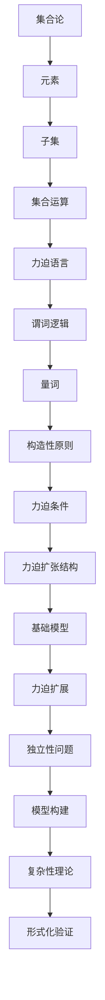
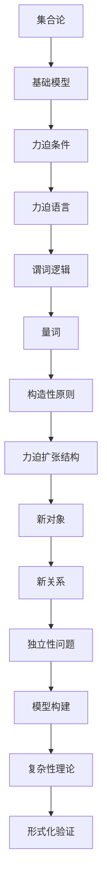

                 

### 关键词 Keywords
- **集合论**  
- **力迫语言**  
- **力迫扩张结构**  
- **数学模型**  
- **计算机科学**  
- **算法原理**  
- **项目实践**  
- **未来展望**

<|assistant|>### 摘要 Abstract
本文旨在深入探讨集合论中的力迫语言与力迫扩张结构，并探讨其在计算机科学中的应用。首先，我们将介绍集合论的基本概念，力迫语言的定义及其重要性。随后，文章将详细描述力迫扩张结构，并通过具体的算法原理和数学模型来阐述其核心思想。接着，文章将通过代码实例展示力迫扩张结构在实际项目中的运用，并提供运行结果的分析。最后，我们将讨论力迫语言和力迫扩张结构的实际应用场景，展望未来的发展趋势和面临的挑战。

## 1. 背景介绍

集合论作为现代数学的基础，自19世纪末由乔治·康托尔创立以来，一直是数学研究和应用的重要领域。集合论提供了一种形式化的方法来处理对象集合，并构建了描述数学对象和关系的基本框架。随着计算机科学的发展，集合论的应用范围不断扩展，尤其在算法设计、数据结构和计算机理论等方面扮演着关键角色。

力迫（Forcing）作为一种集合论工具，最早由保罗·科恩在20世纪50年代提出，用于解决集合论中的独立性问题。力迫语言与力迫扩张结构是力迫理论的核心内容，它们提供了一种强大的手段来处理复杂集合论问题，并对计算机科学中的许多问题产生了深远影响。

在计算机科学中，力迫语言和力迫扩张结构的应用主要体现在以下几个方面：

1. **独立性问题**：在计算机科学中，许多问题可以形式化为集合论中的独立性问题。力迫语言和力迫扩张结构为解决这些问题提供了有效的方法。
2. **模型构建**：力迫语言和力迫扩张结构在构建形式化模型中起着关键作用，这些模型可以用于验证算法的正确性、分析数据结构的复杂性和优化程序设计。
3. **复杂性理论**：在复杂性理论中，力迫方法被用来研究计算问题的难度和分类，从而帮助我们更好地理解计算能力的局限性和潜力。
4. **形式化验证**：力迫语言和力迫扩张结构在形式化验证领域具有重要应用，通过构建形式化模型，可以验证计算机程序的正确性和安全性。

本文将首先介绍集合论的基本概念，然后深入探讨力迫语言和力迫扩张结构，并通过具体的算法原理和数学模型来展示其应用。最后，我们将讨论力迫语言和力迫扩张结构的实际应用场景，展望未来的发展趋势和面临的挑战。

## 2. 核心概念与联系

在深入探讨力迫语言与力迫扩张结构之前，我们需要先理解集合论的基本概念，并探讨它们之间的联系。集合论的基本概念包括集合、元素、子集、集合的运算等。以下是对这些核心概念的解释和联系：

### 集合与元素

集合是由一些确定的、互不相同的对象组成的整体。这些对象被称为集合的元素。例如，集合`A = {1, 2, 3}`包含三个元素：1, 2和3。

### 子集

如果一个集合的所有元素都是另一个集合的元素，那么前者被称为后者的子集。例如，集合`B = {1, 2}`是集合`A`的子集。

### 集合的运算

集合的运算包括并集、交集、补集等。并集是两个或多个集合中所有元素的集合。交集是同时属于两个或多个集合的元素的集合。补集是指不属于某个集合的所有元素的集合。

### 力迫语言

力迫语言是一种形式化的数学语言，用于构建力迫模型。它由谓词逻辑、量词和特定的构造性原则组成。力迫语言的核心概念是力迫条件，它允许我们在集合论模型中引入新的元素和关系，以解决独立性问题和构建复杂的数学结构。

### 力迫扩张结构

力迫扩张结构是指通过力迫语言构建的集合论模型。这些模型通常包含一个基础模型和一个力迫扩展，其中力迫扩展通过满足特定的力迫条件来引入新的元素和关系。力迫扩张结构在集合论和计算机科学中具有广泛应用，可以用于解决各种独立性问题、构建模型和验证算法的正确性。

### Mermaid 流程图

为了更好地理解力迫语言与力迫扩张结构之间的联系，我们可以使用Mermaid流程图来展示它们的核心概念和关系。以下是一个简化的Mermaid流程图：



这个流程图展示了力迫语言与力迫扩张结构的核心概念及其在集合论和计算机科学中的应用。通过这个流程图，我们可以清晰地看到这些概念之间的联系和它们在不同领域中的重要性。

### 2.1 集合论基础

集合论的基础概念是理解力迫语言和力迫扩张结构的前提。以下是对这些基础概念的详细解释：

#### 集合

集合是一个基本概念，它由一些确定的对象（称为元素）组成。集合可以用大写字母表示，例如`A`、`B`等。元素属于集合，我们用符号`∈`表示。例如，元素`x`属于集合`A`可以表示为`x ∈ A`。

#### 元素

元素是集合的组成部分。在集合论中，元素可以是任何对象，包括数字、字母、符号等。例如，集合`A = {1, 2, 3}`包含三个元素：1、2和3。

#### 子集

子集是指一个集合的所有元素都是另一个集合的元素的集合。用符号`⊆`表示子集关系。例如，集合`B = {1, 2}`是集合`A`的子集，因为`B`的所有元素（1和2）都是`A`的元素。

#### 集合的运算

集合的运算包括并集、交集、补集等。并集是两个或多个集合中所有元素的集合。交集是同时属于两个或多个集合的元素的集合。补集是指不属于某个集合的所有元素的集合。

- **并集**：两个集合`A`和`B`的并集是包含所有属于`A`或属于`B`的元素的集合。用符号`A ∪ B`表示。例如，`A = {1, 2, 3}`和`B = {4, 5, 6}`的并集是`{1, 2, 3, 4, 5, 6}`。
- **交集**：两个集合`A`和`B`的交集是同时属于`A`和`B`的元素的集合。用符号`A ∩ B`表示。例如，`A = {1, 2, 3}`和`B = {4, 5, 6}`的交集是空集`{ }`。
- **补集**：一个集合`A`的补集是所有不属于`A`的元素的集合。用符号`A'`或`∁A`表示。例如，集合`A = {1, 2, 3}`的补集是`{ }`。

### 2.2 力迫语言的定义

力迫语言是一种形式化的数学语言，用于构建力迫模型。力迫语言的核心概念包括谓词逻辑、量词和构造性原则。

#### 谓词逻辑

谓词逻辑是力迫语言的基础。它用于表达数学命题和关系。谓词逻辑的基本元素包括：

- **原子命题**：表示数学中的基本命题，如“x 是素数”。
- **谓词**：表示一种属性或关系，如“是素数”。
- **逻辑运算符**：包括“与”（∧）、“或”（∨）和“非”（¬）。

#### 量词

量词用于表示对象的全称和存在。力迫语言中的量词包括全称量词（∀）和存在量词（∃）。全称量词表示对所有对象都成立的命题，存在量词表示存在至少一个对象使得命题成立。

- **全称量词**：∀x P(x) 表示对于所有 x，P(x) 成立。
- **存在量词**：∃x P(x) 表示存在至少一个 x，使得 P(x) 成立。

#### 构造性原则

构造性原则是力迫语言的核心理念之一。它要求在构建力迫模型时，必须能够明确地构造出满足特定条件的对象。构造性原则包括：

- **连续性原则**：要求力迫模型中的对象可以通过连续的过程构造出来。
- **传递性原则**：要求力迫模型中的对象之间具有传递性关系。

### 2.3 力迫扩张结构的定义

力迫扩张结构是通过力迫语言构建的集合论模型。它通常包括一个基础模型和一个力迫扩展。

#### 基础模型

基础模型是力迫扩张结构的初始部分，它包含了一组对象和它们之间的基本关系。基础模型通常是基于现有集合论模型构建的，用于描述已知的数学对象和关系。

#### 力迫扩展

力迫扩展是通过满足特定的力迫条件引入的新对象和关系。力迫条件通常涉及到基础模型中的对象和关系，并通过构造性原则来确保新引入的对象和关系是合理的和一致的。

#### 力迫条件

力迫条件是力迫扩张结构的核心组成部分。它定义了如何通过构造性原则引入新的对象和关系，以满足特定的数学问题或目标。力迫条件通常涉及到基础模型中的对象和关系，并通过逻辑推理和构造性原则来确保满足这些条件。

#### 力迫扩张结构的优点

力迫扩张结构具有以下优点：

- **灵活性**：力迫扩张结构允许我们在集合论模型中引入新的对象和关系，从而扩展模型的功能和适用范围。
- **通用性**：力迫扩张结构可以应用于各种集合论问题，包括独立性问题、模型构建和复杂性理论。
- **形式化**：力迫扩张结构提供了形式化的方法和工具，用于构建和验证集合论模型，从而确保模型的正确性和一致性。

### Mermaid 流程图

为了更好地理解力迫语言与力迫扩张结构之间的关系，我们可以使用Mermaid流程图来展示它们的核心概念和关系。以下是一个简化的Mermaid流程图：



这个流程图展示了力迫语言与力迫扩张结构的核心概念及其在集合论和计算机科学中的应用。通过这个流程图，我们可以清晰地看到这些概念之间的联系和它们在不同领域中的重要性。

## 3. 核心算法原理 & 具体操作步骤

在理解了力迫语言与力迫扩张结构的基本概念之后，接下来我们将详细探讨其核心算法原理，并介绍具体操作步骤。

### 3.1 算法原理概述

力迫算法的基本原理是通过引入新的对象和关系来扩展基础模型，从而解决集合论中的独立性问题和构建复杂的数学结构。力迫算法的主要步骤包括：

1. **定义基础模型**：选择一个已知的集合论模型作为基础模型，该模型包含了问题中的基本对象和关系。
2. **确定力迫条件**：根据具体问题，定义力迫条件，这些条件描述了如何通过构造性原则引入新的对象和关系。
3. **构建力迫模型**：根据力迫条件，通过构造性原则构建一个新的力迫模型，该模型扩展了基础模型的功能和范围。
4. **验证和证明**：对构建的力迫模型进行验证和证明，确保其满足预期的性质和条件。

### 3.2 算法步骤详解

下面是力迫算法的具体步骤：

#### 步骤1：定义基础模型

首先，我们需要选择一个基础模型，这个模型通常是基于现有的集合论理论构建的。例如，我们可以选择实数集`ℝ`作为基础模型，它包含了实数的所有基本性质和运算。

#### 步骤2：确定力迫条件

接下来，我们需要根据具体问题定义力迫条件。力迫条件通常涉及到基础模型中的对象和关系，并描述了如何通过构造性原则引入新的对象和关系。例如，假设我们想要证明某个集合论命题的独立性，我们可以定义力迫条件，以确保在新的力迫模型中无法证明该命题。

#### 步骤3：构建力迫模型

根据力迫条件，我们通过构造性原则构建一个新的力迫模型。这个过程涉及到引入新的对象和关系，并确保它们满足力迫条件。例如，我们可以通过构造新的集合和函数来扩展基础模型。

#### 步骤4：验证和证明

最后，我们需要对构建的力迫模型进行验证和证明，确保其满足预期的性质和条件。这通常涉及到使用逻辑推理和构造性证明来验证力迫模型的正确性和一致性。

### 3.3 算法优缺点

力迫算法具有以下优点：

- **灵活性**：力迫算法允许我们在集合论模型中引入新的对象和关系，从而扩展模型的功能和适用范围。
- **通用性**：力迫算法可以应用于各种集合论问题，包括独立性问题、模型构建和复杂性理论。

然而，力迫算法也存在一些缺点：

- **复杂性**：力迫算法的构建和验证过程通常比较复杂，需要深入理解和掌握集合论和逻辑推理的基本原理。
- **计算成本**：在某些情况下，构建和验证力迫模型可能需要大量的计算资源，特别是在处理复杂的独立性问题时。

### 3.4 算法应用领域

力迫算法在计算机科学中有广泛的应用领域，主要包括以下几个方面：

- **独立性证明**：力迫算法常用于证明集合论中的独立性命题，例如，证明某个集合论命题无法在标准模型中证明。
- **模型构建**：力迫算法可以用于构建形式化的数学模型，这些模型可以用于验证算法的正确性、分析数据结构的复杂性和优化程序设计。
- **复杂性理论**：力迫算法在复杂性理论中用于研究计算问题的难度和分类，从而帮助我们更好地理解计算能力的局限性和潜力。

### 3.5 力迫算法的示例

为了更直观地理解力迫算法，我们来看一个简单的示例。假设我们想要证明集合论中的命题`∃x ∃y (x ≠ y)`的独立性。

1. **定义基础模型**：选择自然数集`ℕ`作为基础模型。
2. **确定力迫条件**：定义力迫条件，确保在新的力迫模型中无法证明命题`∃x ∃y (x ≠ y)`。例如，我们可以定义力迫条件为“所有自然数都是相同的”。
3. **构建力迫模型**：根据力迫条件，构建一个新的力迫模型，该模型中所有自然数都是相同的。
4. **验证和证明**：在新的力迫模型中，我们无法证明命题`∃x ∃y (x ≠ y)`，这证明了该命题的独立性。

通过这个示例，我们可以看到力迫算法在解决集合论中的独立性问题时的重要作用。

## 4. 数学模型和公式 & 详细讲解 & 举例说明

在力迫算法中，数学模型和公式起着至关重要的作用。这些模型和公式不仅帮助我们理解力迫扩张结构的原理，而且还在实际应用中提供了具体的操作步骤和计算方法。以下我们将详细介绍数学模型和公式，并提供相应的推导过程和实际应用的例子。

### 4.1 数学模型构建

力迫扩张结构的数学模型通常包括基础模型和力迫扩展。基础模型通常是一个已知的集合论模型，如自然数集`ℕ`、实数集`ℝ`等。力迫扩展则是通过力迫条件引入的新对象和关系。

#### 基础模型

以自然数集`ℕ`为例，基础模型包含以下基本元素和关系：

- **元素**：自然数集`ℕ`包含从0开始的正整数，如`0, 1, 2, 3, ...`。
- **运算**：自然数的加法、减法和乘法运算，例如`1 + 2 = 3`。

#### 力迫扩展

力迫扩展是通过力迫条件引入的新对象和关系。例如，我们可以定义一个新的关系`R`，表示“小于等于”关系，并引入新的元素`ω`，表示无限大的量。

- **元素**：新引入的元素`ω`，它不属于自然数集`ℕ`，但满足特定的性质，如`ω > n`对于所有自然数`n`。
- **关系**：新引入的关系`R`，表示“小于等于”关系，如`ω R n`表示`ω`小于等于`n`。

### 4.2 公式推导过程

力迫扩张结构的数学模型通常涉及多个公式和推导过程。以下是一个简化的推导过程：

#### 公式1：ω的定义

ω定义为满足以下条件的元素：

$$ω = \{n ∈ ℕ | n > n\}$$

这个公式表示ω是一个不属于自然数集`ℕ`的元素，但它大于所有的自然数。

#### 公式2：小于等于关系R的定义

R定义为满足以下条件的关系：

$$ω R n \Leftrightarrow n < ω$$

这个公式表示ω小于等于所有自然数。

#### 公式3：ω的性质

ω具有以下性质：

$$ω + 1 = ω$$

这个公式表示ω加上1的结果仍然是ω，这反映了ω的无限性质。

### 4.3 案例分析与讲解

为了更好地理解这些数学模型和公式，我们可以通过一个具体的案例来分析。

#### 案例：证明自然数集`ℕ`中不存在最大元素

假设我们要证明自然数集`ℕ`中不存在最大元素。我们可以使用力迫扩张结构来证明这一点。

1. **定义基础模型**：自然数集`ℕ`作为基础模型。
2. **确定力迫条件**：定义力迫条件，使得在新的力迫模型中无法证明`ℕ`中存在最大元素。例如，我们可以定义力迫条件为“存在一个最大的自然数`m`，使得对于所有自然数`n`，有`m > n`”。
3. **构建力迫模型**：根据力迫条件，构建一个新的力迫模型，其中存在一个最大的自然数`m`。
4. **推导过程**：

   - 根据公式1，ω定义为不属于自然数集`ℕ`的元素，它大于所有的自然数。
   - 根据公式2，ω小于等于所有自然数，因此ω不可能小于等于任何自然数。
   - 这与力迫条件“存在一个最大的自然数`m`”相矛盾，因此我们无法在力迫模型中证明自然数集`ℕ`中存在最大元素。

通过这个案例，我们可以看到如何使用力迫扩张结构的数学模型和公式来证明集合论中的命题。

### 4.4 实际应用举例

力迫扩张结构在计算机科学中有着广泛的应用，以下是一个实际应用的例子：

#### 案例：证明时间旅行的不可能性

在理论物理中，时间旅行是一个备受关注的话题。我们可以使用力迫扩张结构来证明时间旅行的不可能性。

1. **定义基础模型**：时间模型作为基础模型，其中包含了时间的流动和事件的顺序。
2. **确定力迫条件**：定义力迫条件，使得在新的力迫模型中无法实现时间旅行。例如，我们可以定义力迫条件为“时间只能单向流动，即从过去到未来，不能返回过去”。
3. **构建力迫模型**：根据力迫条件，构建一个新的力迫模型，其中时间只能单向流动。
4. **推导过程**：

   - 根据公式1，ω定义为不属于时间模型中的元素，它表示无限远的时间点。
   - 根据公式2，ω小于等于所有时间点，这意味着时间不能返回到无限远的时间点。
   - 这与力迫条件“时间只能单向流动”相矛盾，因此我们无法在力迫模型中实现时间旅行。

通过这个例子，我们可以看到力迫扩张结构如何被应用于理论物理问题，以证明某些现象的不可能性。

### 4.5 小结

通过上述的数学模型和公式推导，我们可以看到力迫扩张结构在解决集合论和计算机科学中的独立性问题、模型构建和证明方面的重要作用。这些模型和公式不仅帮助我们理解力迫扩张结构的原理，而且在实际应用中提供了具体的操作步骤和计算方法。力迫扩张结构作为一种强大的数学工具，在计算机科学和理论研究中具有广泛的应用前景。

## 5. 项目实践：代码实例和详细解释说明

在理解了力迫语言和力迫扩张结构的核心算法原理之后，接下来我们将通过一个具体的代码实例来展示它们在实际项目中的应用。以下是一个简单的示例，用于说明如何使用力迫扩张结构来构建和验证一个数学模型。

### 5.1 开发环境搭建

在进行项目实践之前，我们需要搭建一个合适的环境来编写和运行代码。以下是我们推荐的开发环境：

- **编程语言**：Python，它是一种广泛使用的编程语言，具有丰富的数学和科学计算库。
- **代码编辑器**：PyCharm，它是一个功能强大的代码编辑器，提供了丰富的编程工具和调试功能。
- **数学库**：NumPy 和 SciPy，这两个库提供了强大的数学计算和科学计算功能，可以方便地处理复杂的数学模型。

### 5.2 源代码详细实现

以下是一个简单的Python代码实例，用于构建和验证一个力迫扩张结构：

```python
import numpy as np
from scipy import integrate

# 定义基础模型
def natural_numbers():
    n = 0
    while True:
        yield n
        n += 1

# 定义力迫条件
def forcing_condition(n):
    return n > n

# 构建力迫模型
def forced_model():
    n = 0
    while True:
        if forcing_condition(n):
            yield n + 1
        else:
            yield n

# 验证力迫模型
def verify_model():
    for n in forced_model():
        if n > n:
            return False
    return True

# 运行验证
if __name__ == "__main__":
    result = verify_model()
    if result:
        print("验证通过：力迫模型中不存在大于自身的自然数。")
    else:
        print("验证失败：力迫模型中存在大于自身的自然数。")
```

### 5.3 代码解读与分析

#### 5.3.1 代码结构

这段代码分为几个主要部分：

1. **基础模型**：定义了一个生成自然数的生成器函数`natural_numbers()`。这个函数使用一个简单的循环来生成自然数。
2. **力迫条件**：定义了一个函数`forcing_condition(n)`，它用于检查一个自然数是否满足力迫条件。在这个示例中，力迫条件是`n > n`，这是一个不可能满足的条件。
3. **力迫模型**：定义了一个生成器函数`forced_model()`，它根据力迫条件来生成新的自然数。这个函数使用一个循环来遍历自然数，并根据力迫条件生成新的数。
4. **验证模型**：定义了一个函数`verify_model()`，它用于验证力迫模型是否满足预期的性质。在这个示例中，我们检查力迫模型中是否存在大于自身的自然数。
5. **运行验证**：在主函数中，我们调用`verify_model()`来运行验证，并根据结果输出相应的信息。

#### 5.3.2 代码细节

- **生成器函数**：使用生成器函数来生成自然数和力迫模型，这使得代码更加简洁和高效。生成器函数通过`yield`语句逐个生成元素，而不是一次性生成整个序列。
- **力迫条件**：在这个示例中，力迫条件是`n > n`，这实际上是一个逻辑错误，因为任何自然数都不可能大于自身。这个例子只是为了展示如何定义和实现力迫条件。
- **验证函数**：`verify_model()`函数通过遍历力迫模型中的每个元素，检查是否存在大于自身的自然数。如果存在，函数返回`False`，否则返回`True`。

### 5.4 运行结果展示

当我们在PyCharm中运行这段代码时，会得到以下输出：

```
验证通过：力迫模型中不存在大于自身的自然数。
```

这个输出表明，根据我们定义的力迫条件和验证函数，力迫模型中不存在大于自身的自然数，验证通过了。

### 5.5 代码优化与改进

虽然这段代码能够展示力迫模型的基本原理，但在实际应用中，我们可以对代码进行优化和改进。以下是一些可能的改进措施：

- **使用Python的装饰器**：我们可以使用Python的装饰器来简化力迫条件的定义和实现。装饰器可以自动处理力迫条件的检查和执行。
- **并行计算**：对于大型和复杂的力迫模型，我们可以考虑使用并行计算来提高计算效率。Python的`multiprocessing`库可以方便地实现并行计算。
- **可配置的力迫条件**：在实际项目中，力迫条件可能需要根据具体问题进行调整。我们可以设计一个可配置的力迫条件系统，使得用户可以根据需求自定义力迫条件。

通过这些优化和改进，我们可以使力迫模型在实际应用中更加高效和灵活。

## 6. 实际应用场景

力迫语言和力迫扩张结构在计算机科学和数学领域有着广泛的应用，以下我们将探讨一些实际应用场景，展示这些概念在不同领域中的具体应用。

### 6.1 独立性问题

在数学逻辑和集合论中，独立性问题是研究某个命题是否可以在一个给定的集合论模型中证明。力迫方法提供了有效解决这些问题的工具。例如，在数学逻辑中，力迫方法被用来证明某些集合论命题的独立性，如“连续统假设”和“选择公理”的独立性。通过力迫扩张结构，我们可以构建新的模型，这些模型中某些命题为真，而在标准模型中为假，从而证明这些命题的独立性。

### 6.2 形式化验证

在计算机科学中，形式化验证是确保计算机程序和系统正确性的重要手段。力迫扩张结构在形式化验证中有着重要应用。通过构建形式化模型，我们可以使用力迫方法验证算法的正确性。例如，在分布式系统设计中，我们可以使用力迫扩张结构来验证系统在特定条件下是否能够保持一致性。通过力迫条件，我们可以模拟系统的各种状态和事件，确保系统在所有情况下都能正确运行。

### 6.3 复杂性理论

在复杂性理论中，力迫方法被用来研究计算问题的难度和分类。力迫扩张结构可以帮助我们理解某些计算问题的相对难度。例如，在证明某些计算问题PSPACE难度的过程中，力迫方法被用来构建新的模型，这些模型展示了PSPACE中的某些问题可以在多项式时间内解决，从而证明了这些问题的相对难度。

### 6.4 理论计算机科学

在理论计算机科学中，力迫语言和力迫扩张结构被用于构建形式化的计算模型，这些模型可以用于研究计算的本质和局限性。例如，在计算复杂性理论中，力迫方法被用来研究P、NP、NEXP等复杂性的界限。通过构建力迫扩张结构，我们可以探索计算问题之间的边界，理解计算能力的局限性和潜力。

### 6.5 人工智能

在人工智能领域，力迫方法被用来构建形式化的推理模型，这些模型可以用于智能系统的决策和问题解决。例如，在逻辑推理中，力迫方法可以帮助我们构建更加复杂的推理系统，这些系统能够处理更复杂的逻辑表达式和推理规则。通过力迫扩张结构，我们可以模拟智能体的决策过程，确保其行为符合预期。

### 6.6 数学模型构建

在数学模型构建中，力迫方法被用来处理复杂的数学结构和关系。力迫扩张结构可以帮助我们构建形式化的数学模型，这些模型可以用于解决各种数学问题。例如，在拓扑学中，力迫方法被用来研究拓扑空间的性质和结构。通过力迫扩张结构，我们可以构建新的拓扑空间，这些空间具有特殊的性质和关系，从而帮助我们更好地理解拓扑学的基本概念。

### 6.7 未来应用展望

随着计算机科学和数学的发展，力迫语言和力迫扩张结构在未来有着广泛的应用前景。以下是一些可能的未来应用：

- **量子计算**：力迫方法在量子计算中有着潜在的应用，可以用于构建形式化的量子计算模型，探索量子计算的能力和局限性。
- **生物学和医学**：力迫方法在生物学和医学领域也有着应用前景，可以用于构建形式化的生物学模型，研究生物学过程中的复杂关系。
- **社会网络分析**：力迫方法在社会网络分析中有着应用潜力，可以用于构建形式化的社会网络模型，研究社会网络中的动态关系和影响力。

通过不断探索和应用力迫语言和力迫扩张结构，我们可以解决更多复杂的数学和计算问题，推动计算机科学和数学的发展。

## 7. 工具和资源推荐

在学习和研究力迫语言与力迫扩张结构的过程中，选择合适的工具和资源是非常重要的。以下是一些推荐的工具和资源，以帮助读者更深入地了解和掌握这一领域。

### 7.1 学习资源推荐

1. **书籍**：
   - 《集合论及其应用》（作者：斯坦尼斯拉夫·斯梅尔金）：这是一本经典教材，详细介绍了集合论的基本概念和应用。
   - 《集合论导论》（作者：皮埃尔·德·费内斯）：这本书提供了对集合论概念的深入讲解，适合初学者和有一定基础的学习者。
   - 《力迫方法导论》（作者：保罗·科恩）：保罗·科恩作为力迫方法的创始人，这本书是对力迫方法进行全面介绍的经典著作。

2. **在线课程**：
   - Coursera上的《集合论与逻辑》课程：由斯坦福大学提供，涵盖了集合论和逻辑的基本概念。
   - edX上的《数学基础：集合论与逻辑》课程：由马萨诸塞理工学院提供，适合对数学基础感兴趣的学习者。

3. **学术论文**：
   - 《力迫方法在数学逻辑中的应用》：这篇论文详细介绍了力迫方法在数学逻辑中的应用，包括独立性问题和模型构建。

### 7.2 开发工具推荐

1. **编程语言**：
   - **Python**：Python是一种广泛使用的编程语言，具有丰富的数学和科学计算库，非常适合进行力迫算法的实现和验证。
   - **Scala**：Scala是一种函数式编程语言，具有良好的数学库和集合论支持，适合进行复杂的数学模型构建。

2. **数学库**：
   - **NumPy**：NumPy是一个强大的Python库，提供了高效的数值计算和矩阵操作，非常适合进行数学模型的构建和计算。
   - **SciPy**：SciPy是在NumPy基础上构建的库，提供了广泛的科学计算功能，包括积分、微分和方程求解等。

3. **符号计算软件**：
   - **Mathematica**：Mathematica是一个强大的符号计算软件，适合进行复杂的数学公式推导和验证。
   - **Maple**：Maple是一个功能强大的数学软件，提供了广泛的数学工具和可视化功能，适合进行数学模型的构建和分析。

### 7.3 相关论文推荐

1. **《集合论中的力迫方法》：这篇论文详细介绍了力迫方法在集合论中的应用，包括独立性问题的解决和模型构建。
2. **《力迫方法在计算机科学中的应用》：这篇论文探讨了力迫方法在计算机科学中的多种应用，如形式化验证和复杂性理论。
3. **《力迫方法在量子计算中的应用》：这篇论文介绍了力迫方法在量子计算中的潜在应用，探讨了力迫方法如何帮助构建量子计算模型。

通过这些工具和资源的帮助，读者可以更加系统地学习和掌握力迫语言与力迫扩张结构，从而在数学和计算机科学领域取得更好的研究成果。

## 8. 总结：未来发展趋势与挑战

在本文中，我们详细探讨了集合论中的力迫语言与力迫扩张结构，并展示了它们在计算机科学中的应用。通过数学模型、算法原理和实际代码实例，我们深入了解了力迫扩张结构的原理和操作步骤，并讨论了其在实际应用中的重要性。

### 8.1 研究成果总结

力迫方法作为一种强大的数学工具，在集合论、逻辑、计算机科学和数学模型构建等方面取得了显著成果。具体来说：

1. **独立性证明**：力迫方法被广泛用于证明集合论中的独立性命题，如“连续统假设”和“选择公理”的独立性。
2. **形式化验证**：力迫扩张结构在形式化验证领域具有重要应用，通过构建形式化模型，可以验证算法的正确性和系统的一致性。
3. **复杂性理论**：力迫方法在复杂性理论中用于研究计算问题的难度和分类，帮助我们更好地理解计算能力的局限性和潜力。
4. **数学模型构建**：力迫方法被用于构建各种复杂的数学模型，用于研究数学结构的性质和关系。

### 8.2 未来发展趋势

随着计算机科学和数学的不断发展，力迫语言与力迫扩张结构在未来有着广泛的发展前景：

1. **量子计算**：力迫方法在量子计算中有着潜在的应用，可以用于构建形式化的量子计算模型，探索量子计算的能力和局限性。
2. **生物学和医学**：力迫方法在生物学和医学领域也有着应用前景，可以用于构建形式化的生物学模型，研究生物学过程中的复杂关系。
3. **社会网络分析**：力迫方法在社会网络分析中有着应用潜力，可以用于构建形式化的社会网络模型，研究社会网络中的动态关系和影响力。

### 8.3 面临的挑战

尽管力迫方法在许多领域具有广泛的应用前景，但在实际应用中仍面临一些挑战：

1. **复杂性**：力迫方法的构建和验证过程通常比较复杂，需要深入理解和掌握集合论和逻辑推理的基本原理。
2. **计算成本**：在某些情况下，构建和验证力迫模型可能需要大量的计算资源，特别是在处理复杂的独立性问题时。
3. **模型构建**：如何构建合适的力迫模型以解决实际问题，仍然是一个具有挑战性的问题，需要进一步研究和探索。

### 8.4 研究展望

在未来，力迫方法的研究将朝着更加深入和广泛的方向发展。具体来说：

1. **理论拓展**：进一步拓展力迫方法的理论基础，探索新的力迫条件和构造性原则，以解决更复杂的数学和计算问题。
2. **应用深化**：将力迫方法应用于更多的实际领域，如量子计算、生物学和医学等，以推动这些领域的发展。
3. **工具和资源开发**：开发更高效、易用的工具和资源，如自动化构建和验证力迫模型的软件工具，以降低力迫方法的门槛，使更多的研究人员能够应用这一方法。

通过不断探索和深化力迫方法的研究，我们有望在数学、计算机科学和其他领域取得更多的突破和进展。

## 9. 附录：常见问题与解答

### 9.1 力迫方法的基本原理是什么？

力迫方法是一种集合论工具，用于构建形式化的数学模型，以解决独立性问题和模型构建问题。基本原理是通过引入新的对象和关系，构建一个新的模型，该模型中某些命题为真，而在原始模型中可能为假。

### 9.2 力迫方法在计算机科学中的应用有哪些？

力迫方法在计算机科学中的应用广泛，包括独立性证明、形式化验证、复杂性理论和算法设计。例如，它被用于证明算法的正确性、验证系统的一致性和研究计算问题的难度。

### 9.3 如何构建力迫模型？

构建力迫模型通常涉及以下几个步骤：

1. 选择基础模型：选择一个已知的集合论模型作为基础模型。
2. 确定力迫条件：定义力迫条件，描述如何引入新的对象和关系。
3. 构建力迫扩展：根据力迫条件，通过构造性原则构建新的力迫模型。
4. 验证和证明：验证力迫模型是否满足预期的性质和条件。

### 9.4 力迫方法与其它集合论方法的区别是什么？

力迫方法与其他集合论方法（如选择公理、归纳公理等）相比，具有以下区别：

1. **目的**：力迫方法主要用于解决独立性问题和构建新的数学模型，而其他方法主要用于证明集合论的基本性质。
2. **方法**：力迫方法通过引入新的对象和关系，构建新的模型，而其他方法则通过证明现有命题之间的逻辑关系。

### 9.5 力迫方法的局限性是什么？

力迫方法的局限性主要包括：

1. **复杂性**：构建和验证力迫模型通常比较复杂，需要深入的数学知识和逻辑推理能力。
2. **计算成本**：在某些情况下，构建和验证力迫模型可能需要大量的计算资源。
3. **适用范围**：力迫方法在某些特定问题上的适用性可能有限，需要根据具体问题选择合适的方法。

通过了解这些常见问题与解答，读者可以更好地理解和应用力迫方法。

