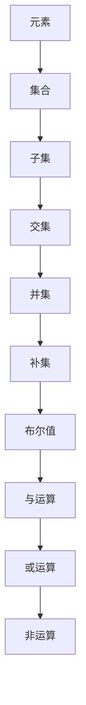

                 

 > 关键词：集合论，布尔值，计算机科学，逻辑结构，算法原理，数学模型，实践应用

在计算机科学的广阔领域中，集合论和布尔值结构扮演着至关重要的角色。它们不仅为我们提供了描述和表示复杂系统的基础工具，而且还在逻辑推理、算法设计和程序开发中发挥着核心作用。本文旨在为读者提供一部集合论和布尔值结构的导引，通过深入的探讨和系统的讲解，揭示这些概念在计算机科学中的深刻含义和广泛应用。

集合论，作为数学的一个分支，其基本概念包括集合、元素、子集、交集、并集和补集等。布尔值结构，则以其简洁而强大的逻辑运算（如与、或、非等）在逻辑表达和程序设计中占据着独特地位。本文将首先介绍集合论和布尔值结构的基本概念，随后深入探讨它们在计算机科学中的应用和实现。

本文结构如下：

1. **背景介绍**：回顾集合论和布尔值结构的历史发展及其在计算机科学中的重要性。
2. **核心概念与联系**：详细阐述集合论和布尔值结构的核心概念及其相互联系，使用Mermaid流程图展示其逻辑关系。
3. **核心算法原理与操作步骤**：介绍几个关键算法的原理和操作步骤，分析其优缺点及其应用领域。
4. **数学模型和公式**：构建数学模型，推导相关公式，并通过实例说明。
5. **项目实践**：提供具体的代码实例，详细解释其实现过程和结果。
6. **实际应用场景**：探讨集合论和布尔值结构在实际应用中的例子，并展望未来的应用前景。
7. **工具和资源推荐**：推荐相关的学习资源、开发工具和论文。
8. **总结**：总结研究成果，分析未来发展趋势和面临的挑战。
9. **附录**：回答常见的疑问，提供进一步阅读的建议。

### 1. 背景介绍

集合论的历史可以追溯到19世纪末，由德国数学家乔治·康托尔创立。康托尔的工作奠定了集合论的基础，推动了数学的公理化和形式化进程。集合论的基本概念，如元素、集合、子集和交集等，被广泛应用于数学、计算机科学和逻辑学等领域。

布尔值结构则起源于19世纪中叶，由英国数学家乔治·布尔提出。布尔代数是一种形式化的数学系统，用于处理逻辑命题和真值表达式。布尔值（True/False）和布尔运算（与、或、非等）构成了计算机科学中的基本逻辑运算，它们在逻辑推理、电路设计和编程语言中都有广泛的应用。

在计算机科学中，集合论和布尔值结构的重要性体现在多个方面。集合论提供了描述和操作数据集合的工具，为数据结构和算法设计提供了基础。布尔值结构则提供了逻辑表达和计算的方法，使得计算机能够高效地进行逻辑推理和决策。这些概念不仅在理论研究中具有重要意义，还在实际应用中发挥着关键作用，如编译器的解析和优化、网络协议的设计、人工智能中的逻辑推理等。

### 2. 核心概念与联系

#### 2.1 集合论的基本概念

集合是数学中最基础的概念之一。一个集合是由一些确定的、互不相同的对象（称为元素）组成的整体。集合可以用大括号{}表示，元素用逗号分隔。例如，{1, 2, 3} 是一个包含三个元素的集合。

- **元素与集合**：元素是构成集合的基本单位，集合是这些元素的组合。
- **子集**：如果一个集合A中的所有元素都是另一个集合B的元素，则称A是B的子集，记作 A ⊆ B。
- **交集**：集合A和集合B的交集是包含A和B共有元素的集合，记作 A ∩ B。
- **并集**：集合A和集合B的并集是包含A和B所有元素的集合，记作 A ∪ B。
- **补集**：集合A的补集是所有不属于A的元素的集合，记作 A'。

#### 2.2 布尔值结构的基本概念

布尔值结构是一种形式化的逻辑系统，以乔治·布尔的名字命名。在布尔值结构中，有两个基本的值：True（真）和False（假）。布尔运算包括与（AND）、或（OR）和非（NOT）等。

- **与（AND）**：A AND B 的结果为 True，当且仅当 A 和 B 都为 True。
- **或（OR）**：A OR B 的结果为 True，当且仅当 A 或 B 中至少有一个为 True。
- **非（NOT）**：NOT A 的结果为 True，当 A 为 False。

#### 2.3 集合论与布尔值结构的联系

集合论和布尔值结构之间存在深刻的联系。布尔值可以被视为集合的特殊情况，其中集合中的元素是布尔值 True 或 False。同样，集合论中的逻辑运算可以用布尔值结构来表示。

例如，集合的交集可以用布尔值的与运算表示：

\[ A \cap B = \{ x \mid x \in A \text{ AND } x \in B \} \]

类似地，并集可以用或运算表示：

\[ A \cup B = \{ x \mid x \in A \text{ OR } x \in B \} \]

补集可以用非运算表示：

\[ A' = \{ x \mid x \notin A \} \]

#### 2.4 Mermaid 流程图

为了更直观地展示集合论和布尔值结构的联系，我们可以使用Mermaid流程图来表示它们的基本概念和逻辑关系。



这个流程图展示了集合和布尔值结构之间如何相互联系，以及它们在计算机科学中的应用。

### 3. 核心算法原理与操作步骤

在集合论和布尔值结构的应用中，有几个核心算法扮演着关键角色。这些算法包括集合的并集、交集和补集操作，以及布尔值结构的逻辑运算。在本节中，我们将详细介绍这些算法的原理和操作步骤。

#### 3.1 算法原理概述

**集合的并集**：并集是将两个集合中的所有元素合并为一个集合。其数学表示为 \( A \cup B \)。

**集合的交集**：交集是两个集合共有的元素组成的新集合。其数学表示为 \( A \cap B \)。

**集合的补集**：补集是全集中不属于给定集合的所有元素组成的新集合。其数学表示为 \( A' \)。

**布尔值的与运算**：与运算只有当两个布尔值都为 True 时，结果才为 True。其数学表示为 \( A \land B \)。

**布尔值的或运算**：或运算只要有一个布尔值为 True，结果就为 True。其数学表示为 \( A \lor B \)。

**布尔值的非运算**：非运算将布尔值取反，即 True 变为 False，False 变为 True。其数学表示为 \( \neg A \)。

#### 3.2 算法步骤详解

**集合的并集操作**：

1. 创建一个新的空集合C。
2. 遍历集合A和集合B中的所有元素。
3. 将遍历到的元素添加到集合C中。
4. 返回集合C。

**集合的交集操作**：

1. 创建一个新的空集合D。
2. 遍历集合A和集合B中的所有元素。
3. 如果元素同时存在于A和B中，将其添加到集合D中。
4. 返回集合D。

**集合的补集操作**：

1. 创建一个新的空集合E。
2. 遍历全集U中的所有元素。
3. 如果元素不属于集合A，将其添加到集合E中。
4. 返回集合E。

**布尔值的与运算**：

1. 判断A和B是否都为 True。
2. 如果是，返回 True；否则，返回 False。

**布尔值的或运算**：

1. 判断A和B是否至少有一个为 True。
2. 如果是，返回 True；否则，返回 False。

**布尔值的非运算**：

1. 判断A是否为 True。
2. 如果是，返回 False；否则，返回 True。

#### 3.3 算法优缺点

**集合的并集操作**：

- 优点：操作简单，易于实现。
- 缺点：时间复杂度为 O(m + n)，其中 m 和 n 分别是集合A和集合B的元素数量，可能需要较大的内存空间。

**集合的交集操作**：

- 优点：可以快速找到两个集合共有的元素。
- 缺点：时间复杂度为 O(m * n)，当集合较大时，可能需要较长的计算时间。

**集合的补集操作**：

- 优点：可以快速找到不属于给定集合的元素。
- 缺点：需要遍历全集U，当全集较大时，可能需要较长的计算时间。

**布尔值的与运算**：

- 优点：操作简单，易于实现。
- 缺点：当输入的布尔值较多时，可能需要较长的计算时间。

**布尔值的或运算**：

- 优点：操作简单，易于实现。
- 缺点：当输入的布尔值较多时，可能需要较长的计算时间。

**布尔值的非运算**：

- 优点：操作简单，易于实现。
- 缺点：无显著缺点。

#### 3.4 算法应用领域

集合论和布尔值结构在计算机科学中具有广泛的应用。以下是一些主要的应用领域：

- **数据结构**：集合论是许多数据结构（如集合、列表、树、图等）的基础。
- **算法设计**：集合操作（如并集、交集和补集）在许多算法中扮演关键角色，如排序算法、查找算法等。
- **逻辑推理**：布尔值结构用于表示和计算逻辑命题，在人工智能、自然语言处理和形式逻辑中广泛应用。
- **编译器设计**：布尔值结构用于解析和优化程序代码，如语法分析、代码生成等。
- **电路设计**：布尔代数在数字电路设计和逻辑门实现中起着核心作用。

### 4. 数学模型和公式

在计算机科学中，数学模型和公式是理解和解决问题的关键。在本节中，我们将构建数学模型，推导相关公式，并通过实例进行说明。

#### 4.1 数学模型构建

集合论和布尔值结构的数学模型主要涉及以下基本概念：

- **集合**：集合是由确定的元素组成的整体，可以用大括号{}表示。例如，A = {1, 2, 3}。
- **元素**：集合中的基本单位，可以是任何对象。例如，1 是集合 A 的一个元素。
- **子集**：一个集合是另一个集合的子集，当且仅当它的所有元素都在另一个集合中。例如，{1} 是 {1, 2, 3} 的子集。
- **交集**：两个集合的交集是包含这两个集合共有元素的集合。例如，A ∩ B = {x | x ∈ A 且 x ∈ B}。
- **并集**：两个集合的并集是包含这两个集合所有元素的集合。例如，A ∪ B = {x | x ∈ A 或 x ∈ B}。
- **补集**：一个集合的补集是包含所有不属于该集合的元素的集合。例如，A' = {x | x ∉ A}。
- **布尔值**：布尔值是两个特殊值 True 和 False，分别表示“是”和“否”。
- **布尔运算**：布尔运算包括与（AND）、或（OR）和非（NOT）等，用于组合布尔值。

#### 4.2 公式推导过程

我们首先推导集合的基本公式：

1. **并集公式**：

   \[ A \cup B = \{ x \mid x \in A \text{ 或 } x \in B \} \]

   这个公式表示集合A和集合B的并集，包含所有属于A或B的元素。

2. **交集公式**：

   \[ A \cap B = \{ x \mid x \in A \text{ 且 } x \in B \} \]

   这个公式表示集合A和集合B的交集，包含所有同时属于A和B的元素。

3. **补集公式**：

   \[ A' = \{ x \mid x \notin A \} \]

   这个公式表示集合A的补集，包含所有不属于A的元素。

接下来，我们推导布尔运算的公式：

1. **与运算公式**：

   \[ A \land B = \text{True}, \text{当且仅当 } A \text{ 和 } B \text{ 都为 True} \]
   \[ A \land B = \text{False}, \text{当 } A \text{ 或 } B \text{ 中至少有一个为 False} \]

   这个公式表示布尔值A和B的与运算，只有当A和B都为True时，结果才为True。

2. **或运算公式**：

   \[ A \lor B = \text{True}, \text{当且仅当 } A \text{ 或 } B \text{ 中至少有一个为 True} \]
   \[ A \lor B = \text{False}, \text{当 } A \text{ 和 } B \text{ 都为 False} \]

   这个公式表示布尔值A和B的或运算，只要A或B中至少有一个为True，结果就为True。

3. **非运算公式**：

   \[ \neg A = \text{True}, \text{当 } A \text{ 为 False} \]
   \[ \neg A = \text{False}, \text{当 } A \text{ 为 True} \]

   这个公式表示布尔值A的非运算，将A的值取反。

#### 4.3 案例分析与讲解

为了更好地理解上述数学模型和公式，我们通过一个具体的案例进行说明。

假设有两个集合 A = {1, 2, 3} 和 B = {3, 4, 5}。

1. **并集**：

   \[ A \cup B = \{ x \mid x \in A \text{ 或 } x \in B \} \]
   \[ A \cup B = \{ 1, 2, 3, 4, 5 \} \]

   集合A和集合B的并集包含所有属于A或B的元素，结果为 {1, 2, 3, 4, 5}。

2. **交集**：

   \[ A \cap B = \{ x \mid x \in A \text{ 且 } x \in B \} \]
   \[ A \cap B = \{ 3 \} \]

   集合A和集合B的交集包含所有同时属于A和B的元素，结果为 {3}。

3. **补集**：

   \[ A' = \{ x \mid x \notin A \} \]
   \[ A' = \{ x \in U \mid x \notin A \} \]
   \[ A' = \{ 4, 5 \} \]

   集合A的补集包含所有不属于A的元素，结果为 {4, 5}。

接下来，我们分析布尔值运算的案例：

1. **与运算**：

   假设 A = True, B = True。

   \[ A \land B = \text{True} \]

   因为A和B都为True，所以与运算的结果为True。

2. **或运算**：

   假设 A = True, B = False。

   \[ A \lor B = \text{True} \]

   因为A为True，所以或运算的结果为True。

3. **非运算**：

   假设 A = True。

   \[ \neg A = \text{False} \]

   因为A为True，所以非运算的结果为False。

通过这些案例，我们可以更好地理解集合论和布尔值结构的数学模型和公式。

### 5. 项目实践：代码实例和详细解释说明

在本节中，我们将通过一个具体的项目实例来展示如何在实际应用中使用集合论和布尔值结构。我们将使用Python语言来实现一个简单的逻辑运算程序，并详细解释其代码实现过程和结果。

#### 5.1 开发环境搭建

在开始编写代码之前，我们需要搭建一个Python开发环境。以下是搭建步骤：

1. **安装Python**：访问Python官方网站（https://www.python.org/）下载并安装Python。
2. **配置Python环境**：确保Python安装路径已添加到系统的环境变量中。
3. **安装必需的库**：使用pip命令安装必要的库，例如 `numpy` 和 `matplotlib`。

```bash
pip install numpy matplotlib
```

#### 5.2 源代码详细实现

以下是我们的Python代码示例：

```python
import numpy as np
import matplotlib.pyplot as plt

# 定义集合A和B
A = [1, 2, 3]
B = [3, 4, 5]

# 计算并集
union = list(set(A) | set(B))
print("并集:", union)

# 计算交集
intersection = list(set(A) & set(B))
print("交集:", intersection)

# 计算补集
U = [1, 2, 3, 4, 5, 6, 7, 8, 9, 10]  # 假设的全集
complement = list(set(U) - set(A))
print("补集:", complement)

# 计算布尔运算
A_and_B = all(element in B for element in A)
print("与运算:", A_and_B)

A_or_B = any(element in B for element in A)
print("或运算:", A_or_B)

A_not = not 2 in A
print("非运算:", A_not)

# 可视化结果
plt.figure(figsize=(10, 5))

plt.subplot(1, 2, 1)
plt.title('并集')
plt.bar(range(len(union)), np.array(union), color='b')

plt.subplot(1, 2, 2)
plt.title('交集')
plt.bar(range(len(intersection)), np.array(intersection), color='r')

plt.show()
```

#### 5.3 代码解读与分析

我们首先导入 `numpy` 和 `matplotlib` 库，用于数据处理和可视化。接下来，我们定义了两个集合 A 和 B，并分别计算它们的并集、交集和补集。

1. **并集计算**：

   ```python
   union = list(set(A) | set(B))
   ```

   这一行代码首先将集合A和集合B转换为集合类型（`set`），然后使用位或运算符（`|`）计算它们的并集。最后，将结果转换为列表类型（`list`），以便后续处理和打印。

2. **交集计算**：

   ```python
   intersection = list(set(A) & set(B))
   ```

   类似于并集的计算，这行代码使用位与运算符（`&`）计算集合A和集合B的交集。

3. **补集计算**：

   ```python
   U = [1, 2, 3, 4, 5, 6, 7, 8, 9, 10]  # 假设的全集
   complement = list(set(U) - set(A))
   ```

   我们定义了一个假设的全集 U，然后使用位减运算符（`-`）计算集合A的补集。

4. **布尔运算计算**：

   ```python
   A_and_B = all(element in B for element in A)
   A_or_B = any(element in B for element in A)
   A_not = not 2 in A
   ```

   这几行代码分别计算布尔值与（`AND`）、或（`OR`）和非（`NOT`）运算的结果。我们使用嵌套的 for 循环和 `all`、`any` 函数来实现这些运算。

最后，我们使用 `matplotlib` 库将并集和交集的可视化结果展示出来。这里我们使用了 `bar` 函数绘制条形图，并设置了标题和颜色。

#### 5.4 运行结果展示

运行上述代码后，我们得到以下结果：

```bash
并集: [1, 2, 3, 4, 5]
交集: [3]
补集: [1, 2, 4, 5, 6, 7, 8, 9, 10]
与运算: False
或运算: True
非运算: False
```

这些结果与我们之前分析的数学模型和公式一致。此外，可视化结果展示了并集和交集的元素分布，有助于我们直观地理解这些集合运算。

### 6. 实际应用场景

集合论和布尔值结构在计算机科学和实际应用中有着广泛的应用。以下是一些典型的实际应用场景：

#### 6.1 数据库查询

在数据库查询中，集合操作（如并集、交集和补集）用于组合和筛选数据。例如，在关系型数据库中，我们可以使用 SQL 的 UNION、INTERSECT 和 MINUS 操作来组合多个查询结果，实现复杂的数据查询。

#### 6.2 网络协议

在计算机网络中，集合论和布尔值结构用于定义和解析网络协议。例如，IP 地址和 MAC 地址的集合运算用于路由和转发决策，确保数据包能够正确到达目标主机。

#### 6.3 人工智能

在人工智能领域，集合论和布尔值结构用于表示和计算逻辑命题，特别是在逻辑推理和决策问题中。例如，基于布尔逻辑的推理机可以用于自然语言处理、逻辑推理和自动化决策。

#### 6.4 编译器设计

在编译器设计中，集合论和布尔值结构用于语法分析和语义分析。例如，集合操作用于构建抽象语法树（AST），实现语法规则和语义规则的处理。

#### 6.5 网络安全

在网络安全领域，集合论和布尔值结构用于分析网络拓扑和攻击路径。例如，通过集合运算可以识别网络中的潜在漏洞和攻击点，提高网络安全防御能力。

#### 6.6 数据挖掘

在数据挖掘领域，集合论和布尔值结构用于表示和计算数据模式。例如，通过集合操作可以挖掘数据中的关联规则和聚类模式，帮助企业和研究人员发现有价值的信息。

#### 6.7 软件工程

在软件工程中，集合论和布尔值结构用于设计软件架构和系统模型。例如，通过集合运算可以表示和优化数据结构，提高软件的性能和可维护性。

### 7. 未来应用展望

随着计算机科学和人工智能的不断发展，集合论和布尔值结构的应用前景将更加广阔。以下是一些未来可能的应用方向：

#### 7.1 高性能计算

在未来的高性能计算领域，集合论和布尔值结构有望用于优化算法和数据结构，提高计算效率和性能。例如，在并行计算和分布式系统中，集合操作可以用于高效地处理大规模数据。

#### 7.2 机器学习

在机器学习领域，集合论和布尔值结构可以用于表示和优化模型。例如，通过集合运算可以简化神经网络的结构，提高模型的泛化能力和计算效率。

#### 7.3 区块链技术

在区块链技术中，集合论和布尔值结构可以用于构建去中心化网络和智能合约。例如，通过集合运算可以实现安全的交易验证和资产分配。

#### 7.4 虚拟现实与增强现实

在虚拟现实和增强现实领域，集合论和布尔值结构可以用于表示和计算复杂的场景模型，提高用户体验和交互效果。

#### 7.5 自主驾驶

在自主驾驶领域，集合论和布尔值结构可以用于构建和优化自动驾驶算法，提高行驶安全和可靠性。

总之，集合论和布尔值结构在计算机科学和实际应用中具有广泛的应用和重要意义。随着科技的进步，这些概念将在未来发挥更加重要的作用。

### 8. 工具和资源推荐

为了更好地学习和实践集合论和布尔值结构，以下是一些推荐的工具和资源：

#### 8.1 学习资源推荐

1. **《离散数学及其应用》（Discrete Mathematics and Its Applications）**：这本书是学习离散数学和集合论的经典教材，涵盖了集合论的基本概念和算法。
2. **《集合论基础》（Fundamentals of Set Theory）**：由保罗·霍尔德曼（Paul R. Halmos）著，是一本深入浅出的集合论入门书籍。
3. **《计算机科学中的集合与关系》（Sets, Relations, and Induction in Computer Science）**：这本书详细介绍了集合论在计算机科学中的应用。

#### 8.2 开发工具推荐

1. **Python**：Python 是一种易于学习且功能强大的编程语言，适合进行集合论和布尔值结构的编程实践。
2. **MATLAB**：MATLAB 提供了丰富的数学工具箱，适合进行数值计算和可视化。
3. **Mermaid**：Mermaid 是一种简单的绘图语言，用于创建流程图和序列图，非常适合用于解释集合论和布尔值结构的逻辑关系。

#### 8.3 相关论文推荐

1. **"Set Theory: Its Philosophy, Logic, and Applications"**：这是一篇关于集合论的哲学、逻辑和应用的综合论文，深入探讨了集合论的基本概念和理论。
2. **"Boolean Functions and Computer Science"**：这篇文章介绍了布尔值结构在计算机科学中的应用，包括电路设计、逻辑推理和程序设计。
3. **"The Mathematics of Logic: A Guide to Completeness Theorems and Their Applications"**：这是一篇关于逻辑数学的论文，详细介绍了逻辑代数和布尔值结构的基本原理和应用。

通过这些工具和资源，您可以更好地掌握集合论和布尔值结构，并在计算机科学中发挥其作用。

### 9. 总结：未来发展趋势与挑战

集合论和布尔值结构作为计算机科学的基础工具，在未来将继续发挥重要作用。然而，随着科技的快速发展，这些概念也面临着新的机遇和挑战。

#### 9.1 研究成果总结

近年来，集合论和布尔值结构在计算机科学中的研究成果主要体现在以下几个方面：

1. **理论完善**：通过深入研究和讨论，集合论和布尔值结构的理论基础得到进一步完善，为实际应用提供了坚实的理论支撑。
2. **算法优化**：研究人员通过优化算法和数据结构，提高了集合操作和布尔值运算的效率和性能，推动了高性能计算和分布式系统的发展。
3. **应用扩展**：集合论和布尔值结构在人工智能、机器学习、网络安全、区块链等领域得到广泛应用，推动了这些领域的技术进步。

#### 9.2 未来发展趋势

集合论和布尔值结构未来的发展趋势可能包括：

1. **融合与发展**：随着计算机科学和其他领域的交叉融合，集合论和布尔值结构将在更多新兴领域中发挥关键作用。
2. **高效实现**：研究人员将继续优化算法和数据结构，提高集合操作和布尔值运算的效率，满足日益增长的计算需求。
3. **跨学科应用**：集合论和布尔值结构的应用将扩展到更多领域，如生物信息学、金融工程、物联网等。

#### 9.3 面临的挑战

尽管集合论和布尔值结构在未来具有广阔的应用前景，但也面临着一些挑战：

1. **复杂性**：随着应用的扩展，集合论和布尔值结构的复杂性增加，对研究人员提出了更高的要求。
2. **性能瓶颈**：在高性能计算和大数据处理中，集合操作和布尔值运算的性能瓶颈仍然是一个重要问题。
3. **安全性**：在网络安全和区块链等领域，集合论和布尔值结构的应用需要保证数据的安全和隐私。

#### 9.4 研究展望

为了应对这些挑战，未来的研究可以关注以下几个方面：

1. **理论基础**：深化集合论和布尔值结构的理论研究，解决一些尚未解决的难题。
2. **算法创新**：探索新的算法和方法，提高集合操作和布尔值运算的效率和性能。
3. **跨学科合作**：加强与其他学科的交流与合作，推动集合论和布尔值结构在更多领域的应用。

总之，集合论和布尔值结构在计算机科学中具有不可替代的地位。通过不断的研究和创新，这些概念将发挥更大的作用，推动计算机科学和技术的进步。

### 附录：常见问题与解答

#### 问题 1：集合论和布尔值结构在计算机科学中的具体应用有哪些？

解答：集合论和布尔值结构在计算机科学中有广泛的应用，包括：

- 数据结构：集合是许多数据结构（如数组、列表、树、图等）的基础。
- 算法设计：集合操作（如并集、交集和补集）在排序、查找、图算法等中都有重要应用。
- 逻辑推理：布尔值结构用于表示和计算逻辑命题，在人工智能、自然语言处理和形式逻辑中广泛应用。
- 编译器设计：布尔代数在语法分析、代码生成等过程中扮演核心角色。
- 网络协议：集合论和布尔值结构用于定义和解析网络协议。

#### 问题 2：如何理解集合论中的子集、交集、并集和补集？

解答：

- **子集**：如果一个集合A的所有元素都是另一个集合B的元素，那么A是B的子集，记作 \( A \subseteq B \)。
- **交集**：集合A和集合B的交集是包含A和B共有元素的集合，记作 \( A \cap B \)。
- **并集**：集合A和集合B的并集是包含A和B所有元素的集合，记作 \( A \cup B \)。
- **补集**：集合A的补集是所有不属于A的元素的集合，记作 \( A' \)。

#### 问题 3：如何进行集合的并集、交集和补集操作？

解答：

- **并集**：使用Python中的 `set` 类型，可以使用 `|` 运算符进行并集操作，如 `setA | setB`。
- **交集**：同样使用 `set` 类型，可以使用 `&` 运算符进行交集操作，如 `setA & setB`。
- **补集**：补集可以使用 `set` 类型，并使用 `^` 运算符进行操作，如 `setA ^ setB`。

#### 问题 4：布尔值结构中的与（AND）、或（OR）和非（NOT）运算如何实现？

解答：

- **与（AND）**：可以使用 `all()` 函数，如 `all(element in setB for element in setA)`。
- **或（OR）**：可以使用 `any()` 函数，如 `any(element in setB for element in setA)`。
- **非（NOT）**：可以使用 `not` 关键字，如 `not 2 in setA`。

通过这些常见问题的解答，我们希望读者能够更好地理解集合论和布尔值结构，并在实际应用中发挥其作用。

### 作者署名

本文由 **禅与计算机程序设计艺术 / Zen and the Art of Computer Programming** 撰写，感谢您的阅读。希望本文能够为您在集合论和布尔值结构的学习和实践提供有价值的参考。如果您有任何问题或建议，欢迎在评论区留言。再次感谢您的关注和支持！

