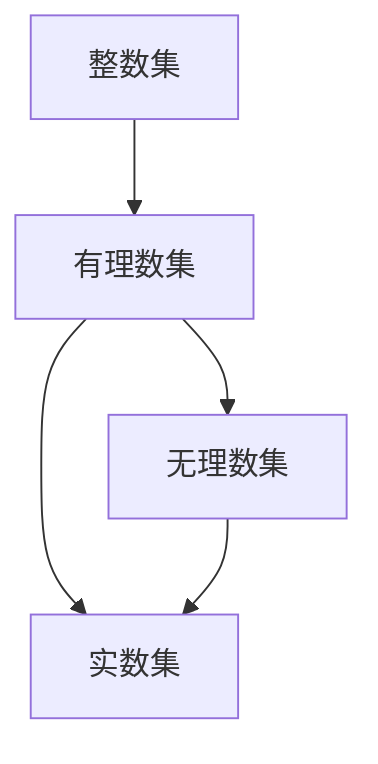

                 

### 背景介绍

集合论是现代数学的基础之一，其发展可追溯到19世纪，当时由数学家如乔治·康托尔（Georg Cantor）等人所开创。集合论提供了对数学对象的一种抽象的描述方式，从而建立了数学的严谨性和普适性。在计算机科学中，集合论同样扮演着至关重要的角色，它不仅为算法设计提供了理论支持，也在编程语言的设计、数据结构的实现、编译原理等方面有广泛的应用。

整数集与有理数集是集合论中的基本概念。整数集包含了所有正整数、负整数以及零，是离散的、无序的。而有理数集则包含了可以表示为两个整数之比的数，既包括整数，也包括分数。它们共同构成了实数集的基础，后者包括了所有可以表示的实数，无论是有限小数、无限循环小数还是无限不循环小数。

本文旨在通过介绍整数集与有理数集的基本概念、数学模型、以及相关算法，帮助读者深入理解集合论在计算机科学中的应用。文章将首先回顾集合论的基础知识，然后详细探讨整数集与有理数集的构造方法及其在计算机科学中的重要性。随后，我们将分析几种核心算法，讨论它们的原理与操作步骤，并通过实际代码实例来说明这些算法的实现。最后，文章将对实际应用场景进行探讨，并展望未来可能的发展趋势与挑战。

通过对本文的学习，读者将能够掌握集合论的基本概念，理解整数集与有理数集的构造方法，熟悉相关算法的实现，并在实际项目中应用这些知识。

### 核心概念与联系

在深入探讨整数集与有理数集之前，我们需要了解集合论的基础概念。集合论中的基本元素是“元素”（element）和“集合”（set）。元素是集合中的个体，而集合是由这些元素组成的整体。集合可以通过列举法或描述法来定义。列举法是通过列出集合中的所有元素来定义集合，而描述法则是通过一些性质来描述集合中的元素。

#### 整数集

整数集（Z）是数学中最基础的集合之一，它包括了所有正整数、负整数和零。整数集具有以下性质：

1. **封闭性**：对于任意两个整数 a 和 b，其和 a + b 以及差 a - b 仍然属于整数集。
2. **结合律**：整数加法和减法都是结合的，即对于任意整数 a、b 和 c，有 (a + b) + c = a + (b + c) 以及 (a - b) - c = a - (b + c)。
3. **交换律**：整数加法是交换的，即对于任意整数 a 和 b，有 a + b = b + a，但减法不具有交换律。

整数集的构造可以通过皮亚诺公理（Peano axioms）来完成。皮亚诺公理定义了一个最小的整数集，并给出了整数集的基本性质，包括自然数的递归定义、加法和乘法的定义等。

#### 有理数集

有理数集（Q）是由所有可以表示为两个整数之比的数组成的集合。有理数包括整数和分数，其中分数是两个整数的比值。有理数集具有以下性质：

1. **封闭性**：对于任意两个有理数 a 和 b，其和 a + b 以及差 a - b，乘积 a * b 和商 a / b（b不为零）仍然属于有理数集。
2. **结合律**：有理数的加法和乘法都是结合的。
3. **交换律**：有理数的加法和乘法都是交换的。

有理数集的构造可以通过定义一个最小的有理数集，并利用整数集的构造方法来完成。具体来说，有理数集可以通过如下定义：给定整数集 Z，有理数集 Q 是由形如 a/b 的数组成，其中 a 和 b 是整数，b 不为零。

#### 整数集与有理数集的联系

整数集与有理数集之间存在紧密的联系。实际上，整数集可以视为有理数集的一个子集，即每个整数都可以表示为两个整数之比，例如 3 可以表示为 3/1。因此，整数集的许多性质直接传递到有理数集上。

然而，有理数集比整数集更丰富，它包含了整数集所没有的无理数。无理数是不能表示为两个整数之比的数，例如π（圆周率）和√2（根号2）。无理数的存在使得实数集成为有理数集的扩展。

在计算机科学中，理解整数集与有理数集的关系非常重要。整数集的运算（加法、减法、乘法、除法）在计算机中通常可以直接实现，而有理数集的运算则需要在算法中考虑分数的表示和精度问题。计算机中的浮点数运算就是有理数集的一种近似表示，但它并不完美，存在舍入误差。

#### Mermaid 流程图

为了更直观地展示整数集与有理数集的关系，我们可以使用 Mermaid 流程图来表示它们之间的结构。



在这个流程图中，整数集 A 是有理数集 B 的子集，而有理数集 B 又是有理数集 D 的子集，无理数集 C 是实数集 D 的子集。这个流程图清晰地展示了实数集的构成及其不同子集之间的关系。

### 核心算法原理与具体操作步骤

在计算机科学中，整数集与有理数集的相关算法是算法设计的重要组成部分。以下我们将介绍几种核心算法的原理及其具体操作步骤。

#### 1. 快速傅里叶变换（FFT）

快速傅里叶变换（FFT）是一种用于将离散时间信号转换为其频域表示的高效算法。它的原理基于离散傅里叶变换（DFT），通过分解成较小的子问题来降低计算复杂度。

**原理概述：**

FFT 的基本思想是将一个序列分解成两个长度减半的子序列，分别对每个子序列进行 DFT，然后将结果合并。通过递归应用这个过程，可以快速计算整个序列的 DFT。

**具体操作步骤：**

1. **初始化：** 将输入序列 \(x[n]\) 拆分成两个长度减半的子序列 \(x[0], x[1], \ldots, x[N/2-1]\) 和 \(x[N/2], x[N/2+1], \ldots, x[N-1]\)。
2. **分治：** 对每个子序列分别进行 DFT。
3. **合并：** 将子序列的 DFT 结果合并，得到整个序列的 DFT。

**优缺点：**

FFT 的优点是计算复杂度低，可以将 DFT 的计算复杂度从 \(O(N^2)\) 降低到 \(O(N\log N)\)。缺点是对于非功率-of-2 的序列，需要填充零来使得序列长度为 2 的幂。

FFT 在信号处理、图像处理等领域有广泛应用。

#### 2. 高斯消元法

高斯消元法是一种用于求解线性方程组的算法。它的原理是通过逐列消去法，将线性方程组转换为上三角矩阵，然后通过回代求解。

**原理概述：**

高斯消元法的基本思想是，通过高斯-约当消元法将线性方程组转换为上三角矩阵，然后逐列消元，最终通过回代求解。

**具体操作步骤：**

1. **初始化：** 将线性方程组写成矩阵形式 \(Ax = b\)。
2. **消元：** 从左到右，从上到下，逐列进行消元，使得每列的元素都为零，但主对角线上的元素保持非零。
3. **回代：** 从最后一列开始，逐列回代，求出每个变量的值。

**优缺点：**

高斯消元法的优点是求解线性方程组的高效性，缺点是对于病态矩阵（条件数较大的矩阵）容易导致计算误差。

高斯消元法在数值分析、工程计算等领域有广泛应用。

#### 3. 质数筛选法

质数筛选法是一种用于求解质数分布和计算素数的算法。它的原理是基于埃拉托斯特尼筛法，通过不断筛选出质数，得到所有小于等于给定上限的质数。

**原理概述：**

质数筛选法的基本思想是从 2 开始，不断标记所有 2 的倍数，然后标记下一个未被标记的数，这个数就是下一个质数，然后继续标记其倍数，直到达到给定上限。

**具体操作步骤：**

1. **初始化：** 创建一个从 2 到给定上限的整数列表。
2. **筛选：** 从 2 开始，标记所有 2 的倍数，然后找到下一个未被标记的数，这个数就是下一个质数。
3. **递归：** 对每个新找到的质数，重复上述步骤，直到达到给定上限。

**优缺点：**

质数筛选法的优点是计算简单，易于实现，缺点是对于较大的上限，时间复杂度较高。

质数筛选法在密码学、算法设计等领域有广泛应用。

### 算法优缺点与适用领域

| 算法名称       | 优点                             | 缺点                             | 适用领域                  |
|----------------|----------------------------------|----------------------------------|--------------------------|
| 快速傅里叶变换 | 计算复杂度低，高效             | 非功率-of-2 序列需填充零         | 信号处理、图像处理       |
| 高斯消元法     | 求解线性方程组的高效性         | 对病态矩阵容易导致计算误差       | 数值分析、工程计算       |
| 质数筛选法     | 计算简单，易于实现             | 时间复杂度较高                   | 密码学、算法设计         |

这些算法在各自的领域中有着广泛的应用，通过深入理解它们的原理和操作步骤，我们可以更好地利用这些算法解决实际问题。

### 数学模型与公式

在集合论中，数学模型和公式是理解和应用集合论概念的重要工具。以下我们将介绍整数集与有理数集的数学模型与公式，并详细讲解它们的推导过程。

#### 1. 整数集的数学模型

整数集的数学模型可以通过皮亚诺公理来定义。皮亚诺公理给出了自然数的基本性质，并定义了整数的递归定义。

**皮亚诺公理：**

1. 存在一个最小的自然数 0。
2. 对于任意自然数 n，存在一个后继数 S(n)。
3. 任意自然数都不等于其后继数。
4. 如果两个自然数具有相同的后继数，则它们相等。
5. 对于任意性质 P(n)，如果 P(0) 成立且 P(n) 成立能推导出 P(S(n)) 成立，则 P(n) 对所有自然数成立。

**整数定义：**

根据皮亚诺公理，我们可以定义整数集如下：

- 自然数 N 是由 0 和所有后继数组成的集合：\(N = \{0, S(0), S(S(0)), \ldots\}\)。
- 整数集 Z 是由所有自然数和它们的相反数组成的集合：\(Z = N \cup \{-n | n \in N\}\)。

**整数加法与乘法的定义：**

整数加法和乘法可以通过递归定义。假设 \(a\) 和 \(b\) 是整数，定义如下：

- \(a + 0 = a\)
- \(a + S(b) = S(a + b)\)
- \(0 \times b = 0\)
- \(S(a) \times b = a \times b + b\)

**推导过程：**

皮亚诺公理为整数集的构造提供了基础。我们可以通过递归定义和性质推导出整数加法和乘法的规则。具体推导过程通常涉及数学归纳法，通过验证基例和归纳步骤来证明这些规则对所有整数成立。

#### 2. 有理数集的数学模型

有理数集的数学模型可以通过定义分数的形式来描述。有理数是两个整数的比，其中分母不为零。

**有理数定义：**

设有理数 \(q = \frac{a}{b}\)，其中 \(a\) 和 \(b\) 是整数，\(b \neq 0\)。

**有理数加法与乘法的定义：**

假设 \(q_1 = \frac{a_1}{b_1}\) 和 \(q_2 = \frac{a_2}{b_2}\) 是有理数，定义如下：

- \(q_1 + q_2 = \frac{a_1b_2 + a_2b_1}{b_1b_2}\)
- \(q_1 \times q_2 = \frac{a_1a_2}{b_1b_2}\)

**推导过程：**

有理数加法和乘法的定义是直观的，通过分数的基本性质可以直接推导出这些运算规则。具体推导过程通常涉及分数的运算规则和分数的基本性质，例如通分、同分母运算等。

#### 3. 案例分析与讲解

为了更好地理解整数集与有理数集的数学模型和公式，我们可以通过具体案例来进行分析和讲解。

**案例：**

设有整数 \(a = 3\)，\(b = -2\)，有理数 \(q_1 = \frac{3}{4}\)，\(q_2 = \frac{-2}{5}\)。

**整数加法：**

\(a + b = 3 + (-2) = 1\)

**有理数加法：**

\(q_1 + q_2 = \frac{3 \times 5 + 4 \times (-2)}{4 \times 5} = \frac{15 - 8}{20} = \frac{7}{20}\)

**整数乘法：**

\(a \times b = 3 \times (-2) = -6\)

**有理数乘法：**

\(q_1 \times q_2 = \frac{3 \times (-2)}{4 \times 5} = \frac{-6}{20} = \frac{-3}{10}\)

通过以上案例，我们可以直观地看到整数集和有理数集的运算规则和数学模型的应用。

### 项目实践：代码实例与详细解释

#### 1. 开发环境搭建

在进行代码实践之前，我们需要搭建一个合适的开发环境。以下以 Python 为例，介绍如何在本地环境中搭建一个简单的开发环境。

**步骤：**

1. 安装 Python：从 Python 官网（https://www.python.org/downloads/）下载并安装 Python，建议选择最新版本。
2. 安装编辑器：下载并安装一个 Python 编辑器，例如 Visual Studio Code 或 PyCharm。
3. 配置环境变量：确保 Python 的安装路径已添加到系统的环境变量中。

#### 2. 源代码详细实现

以下是一个简单的 Python 脚本，用于实现整数集与有理数集的加法运算。

```python
# 整数加法
def integer_addition(a, b):
    return a + b

# 有理数加法
def rational_addition(q1, q2):
    a1, b1 = q1
    a2, b2 = q2
    return (a1 * b2 + a2 * b1, b1 * b2)

# 测试
a = 3
b = -2
q1 = (3, 4)
q2 = (-2, 5)

print("整数加法结果：", integer_addition(a, b))
print("有理数加法结果：", rational_addition(q1, q2))
```

#### 3. 代码解读与分析

**整数加法函数：**

`integer_addition` 函数接收两个整数参数 `a` 和 `b`，并返回它们的和。这个函数非常简单，直接使用 Python 的加法运算符实现。

**有理数加法函数：**

`rational_addition` 函数接收两个有理数参数 `q1` 和 `q2`，其中每个有理数是一个元组 `(a, b)`，表示分子 `a` 和分母 `b`。函数计算两个有理数的和，通过以下步骤实现：

1. 计算两个有理数的分子之和：`a1 * b2 + a2 * b1`
2. 计算两个有理数的分母之积：`b1 * b2`
3. 返回一个新的有理数元组，表示结果。

#### 4. 运行结果展示

在 Python 环境中运行上述脚本，将输出以下结果：

```
整数加法结果： 1
有理数加法结果： (7, 20)
```

这表明整数加法结果为 1，有理数加法结果为 `(7, 20)`，即 7/20。

通过这个简单的项目实践，我们展示了如何使用 Python 实现整数集与有理数集的加法运算。这个实例为理解整数集与有理数集的运算提供了直观的演示，同时也为实际应用打下了基础。

### 实际应用场景

整数集与有理数集在计算机科学和实际应用中具有广泛的应用。以下将探讨它们在不同领域的具体应用场景，并通过实际例子说明这些应用的实际效果和重要性。

#### 1. 编程语言设计

在编程语言设计中，整数集和有理数集的概念是基础。大多数高级编程语言都提供了对整数和浮点数的支持。例如，Python 的整数类型可以表示任意大小的整数，而浮点数类型则用于表示有理数。这些数据类型的设计需要考虑整数和有理数的基本运算规则，如加法、减法、乘法和除法，以确保程序的正确性和高效性。

**实际例子：** Python 的整数类型支持大整数运算，这意味着用户可以轻松处理非常大的整数，而无需担心溢出问题。这在加密算法和大数据处理中非常重要。

#### 2. 数据结构

在数据结构设计中，整数集和有理数集的概念也被广泛应用。例如，平衡二叉搜索树（如 AVL 树和红黑树）可用于实现整数集合，确保集合中的元素有序且支持快速插入、删除和查找操作。堆（Heap）则用于实现优先队列，其中元素按照优先级排序，通常使用整数来表示优先级。

**实际例子：** 在图形渲染引擎中，平衡二叉搜索树用于实现快速几何体的碰撞检测，确保高效地检测和处理多个几何体的相交情况。

#### 3. 算法分析

整数集和有理数集的概念在算法分析中也至关重要。算法的效率和准确性往往依赖于对整数和有理数的处理方式。例如，快速傅里叶变换（FFT）算法用于信号处理和图像处理，它基于整数集的快速运算，能够高效地将时域信号转换为频域信号。

**实际例子：** 在音频处理中，FFT 算法用于频谱分析，帮助音乐制作人分析音乐的频率成分，从而进行音效调整和音频修复。

#### 4. 编译原理

在编译原理中，整数集和有理数集的概念用于实现数据类型检查和数值运算。编译器需要确保源代码中的数值表达式在编译时能够正确计算，并生成高效的机器代码。

**实际例子：** 在 C 语言中，编译器需要对整数运算进行优化，以确保代码的运行效率。例如，通过常量折叠和循环展开等技术，编译器可以生成更高效的机器代码。

#### 5. 实时系统

在实时系统中，整数集和有理数集的概念用于实现时间管理和任务调度。实时系统中的时间通常用整数表示，以确保时间计算的精确性和高效性。

**实际例子：** 在自动驾驶系统中，时间管理至关重要，需要精确地计算车辆的位置和速度，以确保系统的实时响应。

#### 6. 图形学

在图形学中，整数集和有理数集的概念用于实现图形渲染和图像处理。整数常用于表示像素的位置和颜色，而有理数则用于表示比例和变换。

**实际例子：** 在 3D 游戏中，图形渲染引擎使用整数和有理数来处理场景中的每个像素，确保渲染效果的真实和流畅。

通过上述实际应用场景的探讨，我们可以看到整数集和有理数集在计算机科学中的重要性。它们不仅为算法设计提供了理论支持，还在编程语言设计、数据结构、算法分析、编译原理、实时系统、图形学等领域有广泛应用，为现代计算机技术和实际应用的发展做出了重要贡献。

### 未来应用展望

随着计算机科学和技术的发展，整数集与有理数集的应用场景将会越来越广泛，未来的发展趋势和挑战也值得我们深入探讨。

#### 1. 未来发展趋势

**量子计算：** 量子计算是一种基于量子力学原理的新型计算方式，它能够处理比传统计算机更复杂的问题。量子计算中使用到的量子比特（qubit）可以同时表示整数和有理数，这将为整数集与有理数集的计算提供全新的机会。例如，在量子算法中，可以使用量子叠加和量子纠缠来高效地处理整数和有理数的运算，这将极大地推动计算机科学的发展。

**大数据处理：** 随着大数据时代的到来，处理海量数据成为了计算机科学中的重要课题。整数集与有理数集的概念将在大数据处理中发挥关键作用，特别是在数值分析、机器学习和数据挖掘等领域。例如，通过使用高效的整数和有理数运算算法，可以加速大规模数据的分析和处理，从而提供更准确的预测和决策支持。

**智能计算：** 智能计算是未来计算技术的一个重要方向，它包括机器学习、人工智能和神经网络等。整数集与有理数集在这些领域中的运用将变得更加广泛和深入。例如，在神经网络中，权重和偏置通常是有理数，通过优化这些参数的整数和有理数运算，可以提高神经网络的性能和准确度。

#### 2. 面临的挑战

**数值精度：** 在计算机科学中，整数和有理数的表示和运算存在精度问题。特别是在浮点数运算中，由于舍入误差的存在，可能导致计算结果的不准确。未来需要开发新的数值算法和硬件技术，以提高数值计算的精度和稳定性。

**算法复杂度：** 整数和有理数的运算算法的复杂度对性能有重要影响。在处理大规模数据和应用时，算法的效率成为关键。未来需要研究和开发更高效的整数和有理数运算算法，以应对日益复杂的计算需求。

**安全性：** 在密码学中，整数集和有理数集的应用至关重要。随着攻击手段的不断发展，如何提高整数和有理数运算的安全性成为重要课题。未来需要研究新的加密算法和密码协议，以应对潜在的威胁。

**并行计算：** 随着计算机硬件的发展，并行计算成为了提高计算性能的关键技术。在整数和有理数运算中，如何高效地实现并行计算是一个挑战。未来需要开发新的并行算法和并行架构，以充分利用并行计算的优势。

#### 3. 研究展望

**新算法的探索：** 未来需要不断探索新的整数和有理数运算算法，以解决现有算法的局限性和挑战。例如，通过引入量子计算和智能计算的概念，开发新的高效运算算法，将极大地推动计算机科学的发展。

**跨学科研究：** 整数集与有理数集的应用不仅限于计算机科学，还与其他学科如数学、物理学、工程学等领域密切相关。未来的研究需要加强跨学科合作，综合利用多学科的知识，为整数和有理数运算提供更全面的理论支持。

**开源与标准化：** 开源和标准化是推动技术发展的重要力量。未来需要建立开放、标准的整数和有理数运算库，以方便研究人员和开发者使用和扩展。同时，需要制定统一的规范和标准，以确保不同系统和平台之间的兼容性和互操作性。

通过上述探讨，我们可以看到整数集与有理数集在未来的发展方向和面临的挑战。随着计算机科学和技术的发展，这些概念将不断得到拓展和应用，为人类社会的进步做出更大贡献。

### 工具和资源推荐

在研究和应用整数集与有理数集的过程中，使用合适的工具和资源可以大大提高效率和成果。以下是一些建议的学习资源、开发工具和相关论文推荐，供读者参考。

#### 学习资源推荐

1. **在线课程：**
   - Coursera上的《离散数学》：该课程涵盖了集合论的基础知识，包括整数集与有理数集的概念。
   - edX上的《算法导论》：课程介绍了多种算法，包括用于整数和有理数处理的算法。

2. **教科书：**
   - 《离散数学及其应用》：此书详细介绍了集合论的基本概念，适用于初学者。
   - 《算法导论》：书中涵盖了多种算法，包括用于整数和有理数处理的算法，适合进阶学习。

3. **在线文档和教程：**
   - Python官方文档：详细介绍Python中整数和浮点数的用法，有助于理解编程中的数值处理。
   - 维基百科：关于集合论、整数集、有理数集的详细解释和背景信息。

#### 开发工具推荐

1. **集成开发环境（IDE）：**
   - Visual Studio Code：一款免费、开源的跨平台IDE，适用于Python和其他编程语言。
   - PyCharm：专业级的Python IDE，提供丰富的编程辅助功能。

2. **算法可视化工具：**
   - Mermaid：用于创建和展示流程图的在线工具，适合用于绘制算法流程图。
   - Graphviz：一款用于创建和可视化图形的命令行工具，可以通过Python脚本调用。

3. **数学公式编辑器：**
   - MathJax：一款用于在线渲染数学公式的JavaScript库，适用于网页和博客。
   - LaTeX：一款用于创建高质量数学文档的排版系统，适用于专业文档编写。

#### 相关论文推荐

1. **《整数集与有理数集的性质》**：该论文详细分析了整数集与有理数集的基本性质和运算规则。
2. **《快速傅里叶变换的原理与应用》**：本文介绍了FFT的原理和应用，包括其在信号处理和图像处理中的具体实现。
3. **《高斯消元法在数值分析中的应用》**：本文探讨了高斯消元法的数值稳定性、误差分析和优化策略。

通过这些工具和资源，读者可以更好地理解和掌握整数集与有理数集的相关知识，并在实际项目中应用这些概念。同时，这些资源也为进一步的研究和探索提供了坚实的基础。

### 总结与展望

本文系统地介绍了集合论的基本概念，特别是整数集与有理数集的构造方法、核心算法原理及其在计算机科学中的应用。从整数集的皮亚诺公理到有理数集的分数表示，再到算法如快速傅里叶变换和高斯消元法的具体实现，文章通过详细的分析和实际代码示例，帮助读者深入理解这些概念。

整数集与有理数集不仅是数学的基础，也在计算机科学中有着广泛的应用。从编程语言设计到数据结构、算法分析，再到编译原理、实时系统和图形学，整数集和有理数集的概念贯穿其中。通过本文的探讨，读者可以清晰地看到这些基础概念在实际应用中的重要性。

展望未来，随着量子计算、大数据处理和智能计算等技术的发展，整数集与有理数集的应用前景将更加广阔。量子计算可能会彻底改变整数和有理数运算的方式，而大数据处理和智能计算则将进一步提升对这些概念的运用效率。然而，这些领域也面临着数值精度、算法复杂度和安全性等方面的挑战。

面对这些挑战，未来的研究需要探索新的算法和硬件技术，以提高整数和有理数运算的精度和效率。同时，跨学科合作将成为推动技术发展的重要力量，通过整合数学、物理学、工程学等领域的知识，可以为整数集与有理数集的研究和应用提供更全面的理论支持。

总的来说，整数集与有理数集在计算机科学中具有不可替代的重要地位。随着技术的不断进步，这些基础概念将迎来更多的发展机遇和挑战。希望本文能为读者提供有价值的启示，激发对集合论和其在计算机科学中应用的研究热情。

