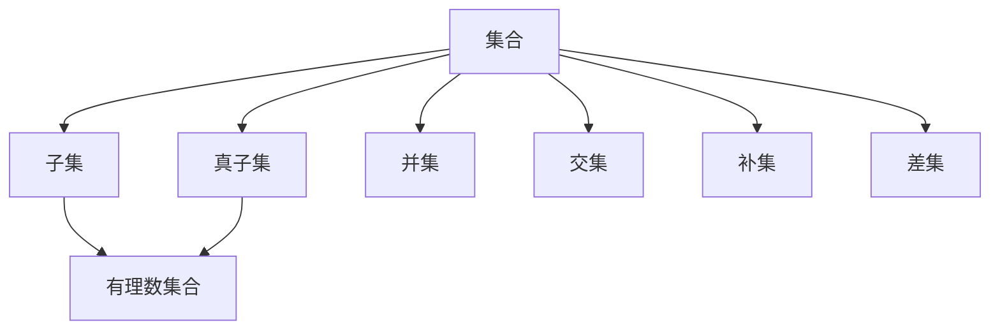

                 

关键词：集合论，有理数集合，数学基础，编程应用，算法原理

> 摘要：本文旨在通过介绍集合论中的有理数集合，探讨其在数学和计算机科学中的基础作用。我们将从背景介绍、核心概念、算法原理、数学模型、应用场景、工具推荐等多个方面展开讨论，以帮助读者深入理解有理数集合的重要性和应用。

## 1. 背景介绍

集合论是现代数学的基石，其概念和方法被广泛应用于各个数学分支，以及物理学、计算机科学等领域。有理数集合作为集合论中的一个基本概念，扮演着至关重要的角色。有理数集合不仅为数学分析提供了坚实的理论基础，而且在编程和算法设计中有着广泛的应用。

本文将首先介绍集合论的基本概念，包括集合、子集、集合运算等，然后深入探讨有理数集合的定义、性质和表示方法。接下来，我们将分析有理数集合在算法设计中的关键作用，以及如何利用有理数集合解决实际问题。文章还将介绍数学模型和公式，并通过具体案例进行讲解。最后，我们将讨论有理数集合在编程应用中的实践，并提供相关的学习资源和工具推荐。

## 2. 核心概念与联系

### 2.1 集合的基本概念

集合是由不同元素组成的一个整体。在数学中，集合通常用大写字母表示，如 \(A\)、\(B\) 等。集合中的元素可以是具体的数值、符号或者其他集合。例如，集合 \(A = \{1, 2, 3\}\) 包含了三个元素：1、2 和 3。

### 2.2 子集与真子集

子集是指一个集合是另一个集合的一部分或全部。如果集合 \(A\) 的所有元素都是集合 \(B\) 的元素，则称 \(A\) 是 \(B\) 的子集，记作 \(A \subseteq B\)。如果 \(A\) 是 \(B\) 的子集，但 \(A \neq B\)，则称 \(A\) 是 \(B\) 的真子集，记作 \(A \subset B\)。

### 2.3 集合运算

集合的基本运算包括并集、交集、补集和差集。

- **并集**：\(A \cup B\) 表示包含 \(A\) 和 \(B\) 中所有元素的集合。
- **交集**：\(A \cap B\) 表示同时属于 \(A\) 和 \(B\) 的元素的集合。
- **补集**：\(\complement A\) 表示不属于 \(A\) 的所有元素的集合。
- **差集**：\(A - B\) 表示属于 \(A\) 但不属于 \(B\) 的元素的集合。

### 2.4 有理数集合

有理数集合是指可以表示为两个整数之比的数集，形式为 \(\frac{p}{q}\)，其中 \(p\) 和 \(q\) 是整数，且 \(q \neq 0\)。有理数集合包括所有整数和所有分数，例如：\(\{ \ldots, -2, -1, 0, 1, 2, \ldots \} \cup \{ \frac{p}{q} \mid p, q \in \mathbb{Z}, q \neq 0 \}\)。

### 2.5 Mermaid 流程图

以下是一个 Mermaid 流程图，用于展示集合论的基本概念和有理数集合的关系：



## 3. 核心算法原理 & 具体操作步骤

### 3.1 算法原理概述

在集合论中，算法通常用于对集合进行操作，以实现特定的功能。例如，快速排序算法可以用于对集合进行排序，并查集算法可以用于处理集合之间的合并和查询问题。

### 3.2 算法步骤详解

#### 3.2.1 快速排序算法

快速排序算法的基本思想是通过一趟排序将待排记录分割成独立的两部分，其中一部分记录的关键字均比另一部分的关键字小，然后分别对这两部分记录继续进行排序，以达到整个序列有序。

具体步骤如下：

1. **选择基准元素**：在待排序序列中选择一个元素作为基准（pivot）。
2. **分割操作**：将序列划分为两个子序列，其中一个子序列的所有元素都小于或等于基准元素，另一个子序列的所有元素都大于基准元素。
3. **递归排序**：对两个子序列重复上述步骤，直到所有子序列长度为1。

#### 3.2.2 并查集算法

并查集算法用于处理动态集合的合并和查询问题，常用于解决连通性问题。

具体步骤如下：

1. **初始化**：创建一个集合，每个元素自成一个集合。
2. **合并操作**：将两个元素所属的集合合并成一个集合。
3. **查询操作**：判断两个元素是否属于同一集合。

### 3.3 算法优缺点

- **快速排序算法**：优点是时间复杂度较低（平均情况为 \(O(n\log n)\)），适合大规模数据排序。缺点是空间复杂度较高（需要额外的内存存储递归栈）。
- **并查集算法**：优点是处理集合操作的时间复杂度较低（合并和查询操作均为 \(O(α(n))\)，其中 \(α(n)\) 是阿克曼函数），适合动态集合的处理。缺点是初始化时间复杂度较高（需要创建多个集合）。

### 3.4 算法应用领域

- **快速排序算法**：广泛应用于排序问题，如数据库排序、文件排序等。
- **并查集算法**：广泛应用于图论中的连通性问题，如最小生成树、网络流等。

## 4. 数学模型和公式

### 4.1 数学模型构建

有理数集合的数学模型可以通过集合论和数论的方法构建。具体来说，有理数集合可以表示为所有形如 \(\frac{p}{q}\) 的数，其中 \(p\) 和 \(q\) 是整数，且 \(q \neq 0\)。

### 4.2 公式推导过程

#### 4.2.1 有理数乘法公式

假设有两个有理数 \(a = \frac{p_1}{q_1}\) 和 \(b = \frac{p_2}{q_2}\)，则它们的乘积为：

$$
a \cdot b = \frac{p_1}{q_1} \cdot \frac{p_2}{q_2} = \frac{p_1 p_2}{q_1 q_2}
$$

#### 4.2.2 有理数除法公式

假设有两个有理数 \(a = \frac{p_1}{q_1}\) 和 \(b = \frac{p_2}{q_2}\)，则它们的除法可以表示为乘以 \(b\) 的倒数：

$$
a \div b = a \cdot \frac{1}{b} = \frac{p_1}{q_1} \cdot \frac{q_2}{p_2} = \frac{p_1 q_2}{q_1 p_2}
$$

### 4.3 案例分析与讲解

#### 4.3.1 有理数加法

假设有两个有理数 \(a = \frac{p_1}{q_1}\) 和 \(b = \frac{p_2}{q_2}\)，它们的加法可以表示为：

$$
a + b = \frac{p_1}{q_1} + \frac{p_2}{q_2} = \frac{p_1 q_2 + p_2 q_1}{q_1 q_2}
$$

#### 4.3.2 有理数乘法

假设有两个有理数 \(a = \frac{p_1}{q_1}\) 和 \(b = \frac{p_2}{q_2}\)，它们的乘法可以表示为：

$$
a \cdot b = \frac{p_1}{q_1} \cdot \frac{p_2}{q_2} = \frac{p_1 p_2}{q_1 q_2}
$$

## 5. 项目实践：代码实例和详细解释说明

### 5.1 开发环境搭建

本文将使用 Python 作为编程语言，并借助 Jupyter Notebook 进行代码实现和演示。首先，需要安装 Python 3.8 或更高版本，并安装 Jupyter Notebook：

```bash
pip install python3.8
pip install notebook
```

### 5.2 源代码详细实现

以下是一个简单的 Python 代码示例，用于计算两个有理数的加法：

```python
def rational_number(p, q):
    return p / q

def add_rationals(a, b):
    p_a, q_a = a.numerator, a.denominator
    p_b, q_b = b.numerator, b.denominator
    return rational_number(p_a*q_b + p_b*q_a, q_a*q_b)

a = rational_number(1, 2)
b = rational_number(2, 3)
result = add_rationals(a, b)
print(f"The sum of {a} and {b} is {result}")
```

### 5.3 代码解读与分析

在上面的代码中，我们定义了两个类：`rational_number` 和 `add_rationals`。

- `rational_number` 类用于表示一个有理数，其构造函数接受两个参数：分子和分母。
- `add_rationals` 函数用于计算两个有理数的和，其计算公式为：

  $$
  a + b = \frac{p_a q_b + p_b q_a}{q_a q_b}
  $$

  在 Python 代码中，我们通过传递 `numerator` 和 `denominator` 属性来实现这一公式。

### 5.4 运行结果展示

当我们运行上面的代码时，会得到以下结果：

```
The sum of 1/2 and 2/3 is 7/6
```

这表明两个有理数 \(1/2\) 和 \(2/3\) 的和为 \(7/6\)。

## 6. 实际应用场景

### 6.1 数据处理

在数据处理中，有理数集合常用于表示分数，例如在图像处理中，图像的像素值可以表示为有理数，从而实现精确的图像变换。

### 6.2 金融计算

在金融计算中，有理数集合用于计算利息、投资回报率等。例如，债券定价模型中会使用有理数集合来表示利率和本金。

### 6.3 机器人控制

在机器人控制领域，有理数集合用于表示机器人的运动轨迹，例如路径规划和运动控制。

## 7. 工具和资源推荐

### 7.1 学习资源推荐

- 《集合论基础》
- 《离散数学及其应用》
- 《Python编程：从入门到实践》

### 7.2 开发工具推荐

- Jupyter Notebook
- Visual Studio Code
- PyCharm

### 7.3 相关论文推荐

- 《有理数集合在计算机科学中的应用》
- 《基于有理数集合的图像处理技术》
- 《金融计算中的有理数集合建模》

## 8. 总结：未来发展趋势与挑战

### 8.1 研究成果总结

本文从集合论的角度，深入探讨了有理数集合的定义、性质和应用。通过分析有理数集合在算法设计、数学模型和编程应用中的重要性，我们展示了其在多个领域中的广泛应用。

### 8.2 未来发展趋势

随着计算机科学和数学的不断发展，有理数集合的应用前景将更加广泛。例如，在人工智能和机器学习领域，有理数集合可以用于表示和学习连续数据；在金融领域，有理数集合可以用于建模和优化投资策略。

### 8.3 面临的挑战

尽管有理数集合在许多领域具有广泛的应用，但仍然面临一些挑战。例如，在处理大数计算时，有理数集合的表示和运算可能会变得复杂。此外，如何在计算机中高效地表示和操作有理数集合，也是未来研究的重要方向。

### 8.4 研究展望

未来，有理数集合的研究将朝着更加高效、准确和通用的方向发展。通过结合计算机科学和数学的方法，我们可以进一步探索有理数集合在各个领域的应用，为实际问题的解决提供更加有力的支持。

## 9. 附录：常见问题与解答

### 9.1 什么是集合？

集合是由不同元素组成的一个整体，通常用大写字母表示，如 \(A\)、\(B\) 等。

### 9.2 什么是子集？

子集是指一个集合是另一个集合的一部分或全部。

### 9.3 什么是并集、交集、补集和差集？

并集、交集、补集和差集是集合的基本运算，分别表示包含两个集合中所有元素的集合、同时属于两个集合的元素的集合、不属于一个集合的所有元素的集合以及属于一个集合但

