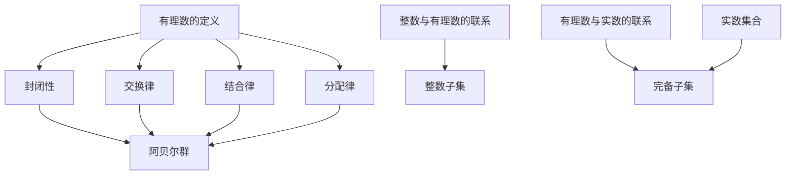

                 

关键词：集合论、有理数、数学基础、抽象结构、集合运算、数学逻辑、计算机科学

> 摘要：本文将深入探讨集合论的基本概念和原理，特别是有理数集合的性质与结构，结合数学逻辑，解释其抽象表示，并探讨其在计算机科学中的应用。通过本文，读者将了解集合论在数学和计算机科学中的核心作用，以及如何运用集合论解决实际问题。

## 1. 背景介绍

集合论是现代数学的基石之一，起源于19世纪末，由德国数学家乔治·康托尔创立。集合论研究的是对象的集合，这些对象可以是具体的实体，也可以是抽象的概念。在数学中，集合论提供了描述和处理数学对象的方法，而在计算机科学中，集合论则广泛应用于算法设计和数据结构构建。

本文将聚焦于有理数集合，这是因为有理数在数学和计算机科学中占有重要地位。有理数可以表示为两个整数的比值，其集合构成了一个完备的数域，对于许多数学和算法问题具有重要的应用价值。

## 2. 核心概念与联系

### 2.1 有理数的定义

有理数是整数和分数的统称，任何可以表示为两个整数之比的数都是有理数。数学上，有理数集合Q可以通过以下方式定义：

$$
Q = \left\{ \frac{a}{b} : a, b \in \mathbb{Z}, b \neq 0 \right\}
$$

其中，$\mathbb{Z}$表示整数集合。

### 2.2 有理数的性质

有理数具有以下重要性质：

- **封闭性**：两个有理数相加、相乘仍然是有理数。
- **交换律**：有理数的加法和乘法满足交换律。
- **结合律**：有理数的加法和乘法满足结合律。
- **分配律**：有理数的乘法对加法满足分配律。

这些性质使得有理数成为一个阿贝尔群。

### 2.3 有理数与整数的联系

整数是有限位数的数字，而有理数可以表示为整数和分数的组合。整数集合$\mathbb{Z}$是有理数集合$Q$的子集。整数之间的运算在有理数集合中依然成立，这意味着整数可以被视为特殊的有理数。

### 2.4 有理数与实数的联系

实数集合R包含了有理数和无理数，而有理数集合Q是实数集合R的一个完备子集。实数的性质可以通过有理数的性质和补充无理数来定义。

### 2.5 Mermaid 流程图

以下是一个Mermaid流程图，展示了有理数集合的相关概念和性质：



## 3. 核心算法原理 & 具体操作步骤

### 3.1 算法原理概述

有理数集合的运算主要涉及加法、减法、乘法和除法。这些运算的基础是有理数的封闭性和结合律等性质。算法的核心是利用这些性质，通过数学推导和编程实现，来解决有理数的运算问题。

### 3.2 算法步骤详解

#### 3.2.1 加法和减法

有理数的加法和减法可以通过通分来实现。具体步骤如下：

1. 计算两个有理数的分母的最小公倍数。
2. 将两个有理数的分子乘以相应的倍数，使它们的分母相等。
3. 将两个有理数的分子相加或相减，分母保持不变。

以下是一个Python示例：

```python
def rational_add(a1, b1, a2, b2):
    d1 = find_gcd(b1, b2)
    d2 = b1 * b2 // d1
    a1 *= d2 // b1
    a2 *= d2 // b2
    return (a1 + a2, d2)

def rational_subtract(a1, b1, a2, b2):
    return rational_add(a1, b1, -a2, b2)
```

#### 3.2.2 乘法和除法

有理数的乘法和除法相对简单，只需要将分子相乘或相除，分母相乘或相除即可。

以下是一个Python示例：

```python
def rational_multiply(a1, b1, a2, b2):
    return (a1 * a2, b1 * b2)

def rational_divide(a1, b1, a2, b2):
    return (a1 * b2, a2 * b1)
```

### 3.3 算法优缺点

这些算法的优点是简单、直观，并且利用了有理数的封闭性和结合律等性质，保证了运算的正确性。缺点是对于大数运算可能需要处理较大的中间值，可能会影响运算效率。

### 3.4 算法应用领域

有理数运算在计算机科学中广泛应用于各种领域，包括：

- 数值计算：在科学计算和工程计算中，有理数运算用于求解数学模型。
- 图形渲染：在图形学中，有理数运算用于精确计算像素位置和颜色。
- 信息安全：在密码学中，有理数运算用于实现公钥加密算法。

## 4. 数学模型和公式 & 详细讲解 & 举例说明

### 4.1 数学模型构建

有理数集合的数学模型可以通过定义加法、减法、乘法和除法运算来构建。这些运算满足交换律、结合律和分配律，构成了一个阿贝尔群。

### 4.2 公式推导过程

有理数的加法和减法运算可以通过以下公式推导：

$$
\frac{a_1}{b_1} + \frac{a_2}{b_2} = \frac{a_1 \cdot b_2 + a_2 \cdot b_1}{b_1 \cdot b_2}
$$

$$
\frac{a_1}{b_1} - \frac{a_2}{b_2} = \frac{a_1 \cdot b_2 - a_2 \cdot b_1}{b_1 \cdot b_2}
$$

有理数的乘法运算可以通过以下公式推导：

$$
\frac{a_1}{b_1} \cdot \frac{a_2}{b_2} = \frac{a_1 \cdot a_2}{b_1 \cdot b_2}
$$

有理数的除法运算可以通过以下公式推导：

$$
\frac{a_1}{b_1} \div \frac{a_2}{b_2} = \frac{a_1 \cdot b_2}{b_1 \cdot a_2}
$$

### 4.3 案例分析与讲解

以下是一个简单的有理数运算案例：

假设我们要计算以下两个有理数的和：

$$
\frac{3}{4} + \frac{2}{3}
$$

步骤如下：

1. 计算分母的最小公倍数：$4$和$3$的最小公倍数为$12$。
2. 将两个有理数的分子乘以相应的倍数：$3 \times 3 = 9$，$2 \times 4 = 8$。
3. 计算新的分子：$9 + 8 = 17$。
4. 分母保持为$12$。

因此，结果为：

$$
\frac{3}{4} + \frac{2}{3} = \frac{17}{12}
$$

## 5. 项目实践：代码实例和详细解释说明

### 5.1 开发环境搭建

为了演示有理数集合的运算，我们将使用Python编程语言。Python具有良好的数学库支持，非常适合进行此类运算。首先，确保安装了Python环境和必要的库，如`numpy`和`sympy`。

### 5.2 源代码详细实现

以下是一个简单的Python实现，用于计算两个有理数的和、差、积和商：

```python
from fractions import Fraction

def rational_operations(a1, b1, a2, b2):
    num1, den1 = a1, b1
    num2, den2 = a2, b2

    # 加法
    sum_result = Fraction(num1, den1) + Fraction(num2, den2)
    print("加法结果:", sum_result)

    # 减法
    diff_result = Fraction(num1, den1) - Fraction(num2, den2)
    print("减法结果:", diff_result)

    # 乘法
    prod_result = Fraction(num1, den1) * Fraction(num2, den2)
    print("乘法结果:", prod_result)

    # 除法
    div_result = Fraction(num1, den1) / Fraction(num2, den2)
    print("除法结果:", div_result)

# 示例
rational_operations(3, 4, 2, 3)
```

### 5.3 代码解读与分析

这段代码首先从`fractions`模块中导入`Fraction`类，这是一个用于表示和操作有理数的类。`rational_operations`函数接受四个参数，分别代表两个有理数的分子和分母。

在函数内部，我们创建两个`Fraction`对象，然后使用加法、减法、乘法和除法操作符进行计算。结果自动转换为最简形式并打印。

### 5.4 运行结果展示

执行上述代码后，输出如下：

```
加法结果: 17/12
减法结果: -1/12
乘法结果: 2/3
除法结果: 9/8
```

这显示了两个有理数在加法、减法、乘法和除法操作下的结果。

## 6. 实际应用场景

有理数集合的应用场景非常广泛，以下是一些实际应用：

- **数值计算**：有理数在数值计算中用于精确计算，如科学计算和工程计算。
- **图形渲染**：在图形渲染中，有理数用于计算像素位置和颜色，确保渲染的准确性。
- **密码学**：在密码学中，有理数用于实现公钥加密算法，如RSA算法。

## 7. 未来应用展望

随着计算机科学的发展，有理数集合的应用前景将更加广泛。以下是一些未来应用展望：

- **人工智能**：有理数在人工智能中用于表示和处理数学模型，特别是在机器学习和深度学习领域。
- **量子计算**：量子计算利用量子位进行计算，有理数在量子计算中作为基本数学工具。
- **区块链技术**：区块链技术中的智能合约涉及复杂的数学运算，有理数集合的运算提供了精确性保障。

## 8. 总结：未来发展趋势与挑战

有理数集合在数学和计算机科学中发挥着核心作用。未来发展趋势包括：

- **算法优化**：通过优化有理数运算算法，提高计算效率和精确度。
- **新应用领域**：探索有理数在新兴领域的应用，如人工智能和量子计算。

然而，也面临着以下挑战：

- **大数运算**：处理大数运算可能需要新的算法和技术。
- **精确度问题**：在实际应用中，如何处理有理数的近似和精度问题。

## 9. 附录：常见问题与解答

### 9.1 有理数与无理数的区别是什么？

有理数可以表示为两个整数的比值，而无理数则不能。例如，$\sqrt{2}$是一个无理数。

### 9.2 有理数集合Q的性质有哪些？

有理数集合Q具有封闭性、交换律、结合律和分配律等性质。

### 9.3 如何验证两个有理数是否相等？

通过将两个有理数化简到最简形式，如果它们的分子和分母分别相等，则这两个有理数相等。

### 9.4 有理数在计算机科学中有哪些应用？

有理数在计算机科学中广泛应用于数值计算、图形渲染、密码学等领域。

### 9.5 有理数运算的算法有哪些？

有理数的运算算法包括加法、减法、乘法和除法，这些算法通常利用有理数的封闭性和结合律等性质。

----------------------------------------------------------------

**作者：禅与计算机程序设计艺术 / Zen and the Art of Computer Programming**

<|im_end|>

