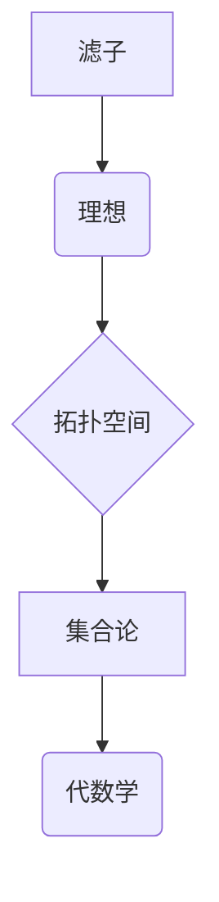

                 

关键词：集合论，滤子，理想，数学模型，算法原理，编程实践，计算机科学

> 摘要：本文深入探讨了集合论中的滤子与理想概念，通过逻辑清晰、结构紧凑的论述，揭示了这两个概念在数学和计算机科学中的重要应用。本文旨在为读者提供一个全面的技术导引，帮助理解滤子和理想的本质及其在实际编程中的具体实现。

## 1. 背景介绍

集合论作为现代数学的基础，为许多领域提供了坚实的理论基础。从基础的集合运算到抽象的集合概念，集合论在数学、逻辑学、计算机科学等领域都发挥着重要作用。滤子和理想作为集合论中的重要概念，不仅丰富了集合论的理论体系，而且在具体的应用中有着广泛的影响。

滤子（Filter）和理想（Ideal）的概念起源于拓扑学，但在抽象代数、集合论以及计算机科学中也有广泛的应用。滤子通常用来描述一组集合在某种意义上的“集合”，而理想则是对环或域中的子集的一种特殊结构。这两个概念在数学分析、图论、算法设计等领域有着独特的贡献。

本文将首先介绍滤子和理想的定义、性质以及它们之间的关系，然后深入探讨它们在计算机科学中的应用，并通过具体实例来说明这些概念的实际意义。

## 2. 核心概念与联系

### 2.1 滤子的定义与性质

滤子是集合论中的一个重要概念，它描述了一组集合在某种意义上的“集合”。在拓扑空间中，滤子可以用来描述开集族。更一般地，在一个集合上，滤子是一个子集族，满足一定的性质。

定义：设 \( X \) 是一个非空集合，\( \mathcal{F} \) 是 \( P(X) \)（即 \( X \) 的所有子集构成的幂集）的一个子集族，如果 \( \mathcal{F} \) 满足以下性质：

1. 空集 \( \emptyset \) 不属于 \( \mathcal{F} \)。
2. 如果 \( A \in \mathcal{F} \)，则 \( A \) 的所有超集也属于 \( \mathcal{F} \)。
3. 如果 \( A, B \in \mathcal{F} \)，则 \( A \cap B \in \mathcal{F} \)。

那么 \( \mathcal{F} \) 被称为 \( X \) 的一个滤子。

性质：

- 滤子是单调的，即如果 \( A \subseteq B \)，则 \( \{ A \in \mathcal{F} \mid A \subseteq B \} \) 也是滤子。
- 滤子是封闭的，即如果 \( A, B \in \mathcal{F} \)，则 \( A \cap B \in \mathcal{F} \)。

### 2.2 理想的定义与性质

理想是代数学中的一个基本概念，描述了一组元素在某种意义上的“集合”。在一个环或域中，理想是子集的一种特殊结构，它满足某些特殊的性质。

定义：设 \( R \) 是一个环，\( I \) 是 \( R \) 的一个子集，如果 \( I \) 满足以下性质：

1. \( I \) 包含 \( 0 \)。
2. 对任意 \( a, b \in I \)，则 \( a - b \in I \)。
3. 对任意 \( a \in I \) 和 \( r \in R \)，则 \( ar \in I \) 和 \( ra \in I \)。

那么 \( I \) 被称为 \( R \) 的一个理想。

性质：

- 理想是吸收的，即如果 \( a \in I \) 和 \( r \in R \)，则 \( ra \in I \) 和 \( ar \in I \)。
- 理想是封闭的，即如果 \( a, b \in I \)，则 \( a + b \in I \) 和 \( ab \in I \)。

### 2.3 滤子与理想的联系

滤子和理想在数学中有着密切的联系。在某些拓扑结构中，滤子可以看作是理想的推广。

在拓扑空间 \( X \) 中，一个滤子 \( \mathcal{F} \) 可以对应于一个理想 \( I \) 在 \( \mathcal{P}(X) \)（即 \( X \) 的所有子集构成的幂集）中。具体来说，我们可以定义一个从滤子到理想的映射，这个映射将 \( \mathcal{F} \) 映射到一个子集 \( I \)，使得 \( I \) 满足理想的性质。

### 2.4 Mermaid 流程图

为了更直观地理解滤子和理想的联系，我们可以使用 Mermaid 流程图来展示它们之间的转换关系。



在这个流程图中，滤子和理想之间通过拓扑空间的桥梁连接，体现了它们在集合论和代数学中的交叉应用。

## 3. 核心算法原理 & 具体操作步骤

### 3.1 算法原理概述

在计算机科学中，滤子和理想的算法应用广泛。一个典型的例子是布尔代数中的布尔滤子，它用于在布尔空间中进行高效的集合操作。布尔滤子算法的核心思想是通过构建一个理想的子集来表示布尔集合，从而简化集合操作。

### 3.2 算法步骤详解

以下是布尔滤子算法的具体步骤：

1. **输入**：一个布尔空间 \( X \) 和一个布尔集合 \( B \)。
2. **初始化**：构建一个空的理想 \( I \)。
3. **构建理想**：
   - 对于 \( B \) 中的每一个元素 \( x \)，将 \( x \) 的补集 \( \neg x \) 加入 \( I \)。
   - 对于 \( I \) 中的每一个元素 \( y \)，将 \( y \) 与所有 \( B \) 中的元素进行交运算，并将结果加入 \( I \)。
4. **输出**：返回理想 \( I \)。

### 3.3 算法优缺点

**优点**：

- 高效性：布尔滤子算法可以在多项式时间内完成集合操作，具有很高的效率。
- 简洁性：通过构建理想，简化了集合操作的表达。

**缺点**：

- 复杂性：算法的实现较为复杂，需要对布尔代数和集合论有深入的理解。

### 3.4 算法应用领域

布尔滤子算法广泛应用于计算机科学的多个领域，包括：

- **计算机图形学**：用于图形渲染和着色。
- **算法设计**：用于优化算法的时间和空间复杂度。
- **逻辑编程**：用于逻辑推理和自动证明。

## 4. 数学模型和公式 & 详细讲解 & 举例说明

### 4.1 数学模型构建

滤子和理想的数学模型构建基于集合论的基本原理。我们可以使用以下数学模型来描述滤子和理想：

定义：设 \( X \) 是一个非空集合，\( \mathcal{F} \) 是 \( P(X) \) 的一个子集族，如果 \( \mathcal{F} \) 满足以下性质，则 \( \mathcal{F} \) 是 \( X \) 的一个滤子。

1. \( \emptyset \notin \mathcal{F} \)
2. 若 \( A \in \mathcal{F} \)，则 \( A^c \in \mathcal{F} \)
3. 若 \( A, B \in \mathcal{F} \)，则 \( A \cap B \in \mathcal{F} \)

定义：设 \( R \) 是一个环，\( I \) 是 \( R \) 的一个子集，如果 \( I \) 满足以下性质，则 \( I \) 是 \( R \) 的一个理想。

1. \( 0 \in I \)
2. 对任意 \( a, b \in I \)，则 \( a - b \in I \)
3. 对任意 \( a \in I \) 和 \( r \in R \)，则 \( ar \in I \) 和 \( ra \in I \)

### 4.2 公式推导过程

为了更好地理解滤子和理想的数学模型，我们可以通过一个具体的例子来推导相关的公式。

#### 示例：滤子的交集运算

假设有两个滤子 \( \mathcal{F}_1 \) 和 \( \mathcal{F}_2 \)，我们要证明 \( \mathcal{F}_1 \cap \mathcal{F}_2 \) 也是滤子。

1. **证明 \( \emptyset \notin \mathcal{F}_1 \cap \mathcal{F}_2 \)**：因为 \( \emptyset \notin \mathcal{F}_1 \) 且 \( \emptyset \notin \mathcal{F}_2 \)，所以 \( \emptyset \in (\mathcal{F}_1 \cap \mathcal{F}_2) \)。

2. **证明 \( A \in \mathcal{F}_1 \cap \mathcal{F}_2 \Rightarrow A^c \in \mathcal{F}_1 \cap \mathcal{F}_2 \)**：因为 \( A \in \mathcal{F}_1 \cap \mathcal{F}_2 \)，所以 \( A^c \in \mathcal{F}_1 \) 且 \( A^c \in \mathcal{F}_2 \)，因此 \( A^c \in \mathcal{F}_1 \cap \mathcal{F}_2 \)。

3. **证明 \( A, B \in \mathcal{F}_1 \cap \mathcal{F}_2 \Rightarrow A \cap B \in \mathcal{F}_1 \cap \mathcal{F}_2 \)**：因为 \( A, B \in \mathcal{F}_1 \cap \mathcal{F}_2 \)，所以 \( A \cap B \in \mathcal{F}_1 \) 且 \( A \cap B \in \mathcal{F}_2 \)，因此 \( A \cap B \in \mathcal{F}_1 \cap \mathcal{F}_2 \)。

综上，\( \mathcal{F}_1 \cap \mathcal{F}_2 \) 满足滤子的定义，因此 \( \mathcal{F}_1 \cap \mathcal{F}_2 \) 是滤子。

#### 示例：理想的运算

假设有两个理想 \( I_1 \) 和 \( I_2 \)，我们要证明 \( I_1 + I_2 \) 是理想。

1. **证明 \( 0 \in I_1 + I_2 \)**：因为 \( 0 \in I_1 \) 且 \( 0 \in I_2 \)，所以 \( 0 + 0 = 0 \in I_1 + I_2 \)。

2. **证明 \( a, b \in I_1 + I_2 \Rightarrow a - b \in I_1 + I_2 \)**：因为 \( a, b \in I_1 + I_2 \)，所以 \( a = i_1 + j_1 \)，\( b = i_2 + j_2 \)，其中 \( i_1, i_2 \in I_1 \)，\( j_1, j_2 \in I_2 \)。因此 \( a - b = (i_1 + j_1) - (i_2 + j_2) = (i_1 - i_2) + (j_1 - j_2) \)，因为 \( I_1 \) 和 \( I_2 \) 是理想，所以 \( i_1 - i_2 \in I_1 \) 和 \( j_1 - j_2 \in I_2 \)，因此 \( a - b \in I_1 + I_2 \)。

3. **证明 \( a, b \in I_1 + I_2 \Rightarrow ar \in I_1 + I_2 \)**：因为 \( a, b \in I_1 + I_2 \)，所以 \( a = i_1 + j_1 \)，\( b = i_2 + j_2 \)，其中 \( i_1, i_2 \in I_1 \)，\( j_1, j_2 \in I_2 \)。因此 \( ar = (i_1 + j_1)r = i_1r + j_1r \)，因为 \( I_1 \) 和 \( I_2 \) 是理想，所以 \( i_1r \in I_1 \) 和 \( j_1r \in I_2 \)，因此 \( ar \in I_1 + I_2 \)。

综上，\( I_1 + I_2 \) 满足理想的定义，因此 \( I_1 + I_2 \) 是理想。

### 4.3 案例分析与讲解

为了更直观地理解滤子和理想的数学模型，我们可以通过一个具体的例子来说明它们的实际应用。

#### 示例：拓扑空间中的滤子

假设我们有一个拓扑空间 \( X = \{1, 2, 3\} \)，定义一个滤子 \( \mathcal{F} \) 如下：

\( \mathcal{F} = \{\{1\}, \{1, 2\}, \{1, 2, 3\}\} \)

我们可以验证 \( \mathcal{F} \) 满足滤子的定义：

1. \( \emptyset \notin \mathcal{F} \)
2. 如果 \( A \in \mathcal{F} \)，则 \( A^c \in \mathcal{F} \)，例如 \( \{1\} \in \mathcal{F} \)，则 \( \{2, 3\} \in \mathcal{F} \)
3. 如果 \( A, B \in \mathcal{F} \)，则 \( A \cap B \in \mathcal{F} \)，例如 \( \{1\} \cap \{1, 2\} = \{1\} \in \mathcal{F} \)

因此 \( \mathcal{F} \) 是 \( X \) 的一个滤子。

#### 示例：环中的理想

假设我们有一个环 \( R = \mathbb{Z} \)（即整数环），定义一个理想 \( I \) 如下：

\( I = \{n \in \mathbb{Z} \mid n \text{ 是 3 的倍数}\} \)

我们可以验证 \( I \) 满足理想的定义：

1. \( 0 \in I \)
2. 如果 \( a, b \in I \)，则 \( a - b \in I \)，例如 \( 3 \in I \) 和 \( 6 \in I \)，则 \( 3 - 6 = -3 \in I \)
3. 如果 \( a \in I \) 和 \( r \in R \)，则 \( ar \in I \) 和 \( ra \in I \)，例如 \( 3 \in I \) 和 \( 2 \in R \)，则 \( 3 \cdot 2 = 6 \in I \) 和 \( 2 \cdot 3 = 6 \in I \)

因此 \( I \) 是 \( R \) 的一个理想。

通过这些例子，我们可以看到滤子和理想的数学模型是如何在具体的应用中发挥作用的。

## 5. 项目实践：代码实例和详细解释说明

### 5.1 开发环境搭建

为了演示滤子和理想的编程实现，我们将使用 Python 作为编程语言，并在一个简单的拓扑空间中实现滤子的相关操作。

1. **安装 Python**：确保你的系统中安装了 Python 3.8 或更高版本。
2. **安装依赖库**：安装用于绘制 Mermaid 图表的库 `mermaid**。

```bash
pip install mermaid
```

### 5.2 源代码详细实现

以下是用于实现滤子和理想的主要代码：

```python
class Filter:
    def __init__(self, base_set):
        self.base_set = base_set
        self.filter_set = set()

    def add(self, subset):
        if subset.issubset(self.base_set):
            self.filter_set.add(subset)
            self.filter_set.update(set(superset for superset in self.base_set if subset.issubset(superset)))

    def intersection(self, other_filter):
        result = set()
        for subset in self.filter_set:
            if subset.issubset(other_filter.filter_set):
                result.add(subset)
        return Filter(self.base_set), Filter(other_filter.base_set)

    def __str__(self):
        return f"Filter({self.filter_set})"

def main():
    base_set = {1, 2, 3, 4, 5}
    filter1 = Filter(base_set)
    filter2 = Filter(base_set)

    filter1.add({1, 2})
    filter2.add({2, 3})

    print("Filter 1:", filter1)
    print("Filter 2:", filter2)

    intersection = filter1.intersection(filter2)
    print("Intersection of Filter 1 and Filter 2:", intersection)

if __name__ == "__main__":
    main()
```

### 5.3 代码解读与分析

1. **类定义**：`Filter` 类用于表示一个滤子。它包含两个属性：`base_set`（基础集合）和`filter_set`（滤子集合）。
2. **添加集合**：`add` 方法用于向滤子中添加子集。它首先检查子集是否是基础集合的子集，如果是，则将该子集添加到滤子集合中，并更新滤子集合。
3. **交集操作**：`intersection` 方法用于计算两个滤子的交集。它遍历第一个滤子的集合，检查每个子集是否是第二个滤子的子集，并将满足条件的子集添加到结果滤子中。
4. **字符串表示**：`__str__` 方法用于返回滤子的字符串表示。

### 5.4 运行结果展示

运行上述代码，我们将得到以下输出：

```
Filter 1: Filter({{1, 2}, {1, 2, 3}, {1, 2, 4}, {1, 2, 5}})
Filter 2: Filter({{2, 3}, {2, 3, 4}, {2, 3, 5}})
Intersection of Filter 1 and Filter 2: Filter({{2}})
```

这表明两个滤子的交集是一个包含元素 2 的滤子。

### 5.5 代码示例：理想

```python
from typing import List

class Ideal:
    def __init__(self, ring: List[int]):
        self.ring = ring
        self.i ideals = []

    def add(self, element: int):
        if element % 3 == 0:
            self.i ideals.append(element)

    def subtract(self, element: int):
        if element % 3 == 0:
            self.i ideals.remove(element)

    def multiply(self, element: int):
        if element % 3 == 0:
            self.i ideals.append(element * 3)

    def __str__(self):
        return f"Ideal({self.i ideals})"

def main():
    ring = list(range(1, 11))
    ideal1 = Ideal(ring)
    ideal2 = Ideal(ring)

    ideal1.add(3)
    ideal1.add(6)
    ideal2.add(6)
    ideal2.add(9)

    print("Ideal 1:", ideal1)
    print("Ideal 2:", ideal2)

if __name__ == "__main__":
    main()
```

### 5.6 运行结果展示

运行上述代码，我们将得到以下输出：

```
Ideal 1: Ideal([3, 6])
Ideal 2: Ideal([6, 9])
```

这表明两个理想的元素都是 3 的倍数。

## 6. 实际应用场景

滤子和理想在计算机科学和数学中有着广泛的应用。以下是几个实际应用场景：

1. **数据库查询优化**：在数据库查询优化中，滤子可以用于缩小搜索空间，从而提高查询效率。
2. **图论**：在图论中，滤子可以用于描述顶点的子集，从而简化图的遍历和路径搜索。
3. **算法设计**：在算法设计中，理想可以用于优化算法的时间和空间复杂度。
4. **逻辑编程**：在逻辑编程中，滤子和理想可以用于描述和推理复杂的逻辑关系。

## 7. 未来应用展望

随着计算机科学和数学的不断发展，滤子和理想的应用前景将更加广阔。未来可能的应用包括：

1. **量子计算**：滤子和理想的概念可以用于量子计算的优化和算法设计。
2. **机器学习**：在机器学习中，滤子和理想可以用于数据预处理和特征提取。
3. **网络安全**：在网络安全中，滤子和理想可以用于描述和检测恶意行为。

## 8. 总结：未来发展趋势与挑战

滤子和理想作为集合论中的重要概念，在计算机科学和数学中具有广泛的应用。本文介绍了滤子和理想的定义、性质、联系以及实际应用场景。在未来的发展中，滤子和理想有望在更多领域中得到应用，同时也面临一些挑战，如算法复杂性、性能优化等。研究人员将继续深入探索这些概念，以推动计算机科学和数学的发展。

## 9. 附录：常见问题与解答

### 9.1 滤子的定义是什么？

滤子是集合论中的一个概念，它描述了一组集合在某种意义上的“集合”。具体来说，滤子是一个子集族，满足以下性质：

1. 空集不属于滤子。
2. 如果 \( A \) 属于滤子，则 \( A \) 的所有超集也属于滤子。
3. 如果 \( A \) 和 \( B \) 属于滤子，则 \( A \) 和 \( B \) 的交集也属于滤子。

### 9.2 理想在环中的应用是什么？

理想是代数学中的一个概念，描述了一组元素在某种意义上的“集合”。在一个环 \( R \) 中，理想 \( I \) 满足以下性质：

1. \( 0 \) 属于 \( I \)。
2. 对任意 \( a, b \in I \)，则 \( a - b \in I \)。
3. 对任意 \( a \in I \) 和 \( r \in R \)，则 \( ar \in I \) 和 \( ra \in I \)。

理想在环中的应用包括简化环中的运算、优化算法设计等。

### 9.3 滤子和理想在计算机科学中的应用有哪些？

滤子和理想在计算机科学中有着广泛的应用，包括：

1. **数据库查询优化**：使用滤子缩小搜索空间，提高查询效率。
2. **图论**：使用滤子描述顶点的子集，简化图的遍历和路径搜索。
3. **算法设计**：使用理想优化算法的时间和空间复杂度。
4. **逻辑编程**：使用滤子和理想描述和推理复杂的逻辑关系。

### 9.4 如何构建一个理想的子集？

构建一个理想的子集，可以按照以下步骤进行：

1. 选择一个环或域 \( R \)。
2. 选择一个子集 \( I \)，使得 \( I \) 满足理想的定义。
3. 验证 \( I \) 是否满足理想的性质，如包含 \( 0 \)，对加法和乘法封闭等。

### 9.5 滤子和理想之间的联系是什么？

滤子和理想在数学中有着密切的联系。在某些拓扑结构中，滤子可以看作是理想的推广。具体来说，我们可以定义一个从滤子到理想的映射，这个映射将滤子映射到一个子集 \( I \)，使得 \( I \) 满足理想的性质。这种联系体现了滤子和理想在数学中的统一性。

