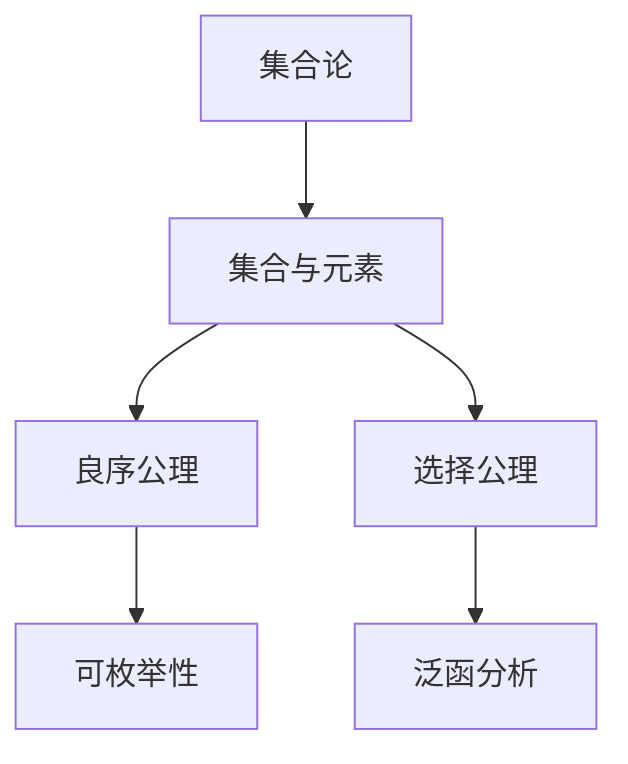

                 

 关键词：集合论、存在性公理、集合论基础、数学逻辑、计算机科学、形式化系统

> 摘要：本文旨在深入探讨集合论中的存在性公理，从基础概念出发，逐步引入并详细解析了集合论的核心存在性公理，如良序公理、选择公理等。本文将通过数学模型和具体算法实例，展示集合论存在性公理在计算机科学中的应用，并展望其未来的发展方向与挑战。

## 1. 背景介绍

集合论是现代数学的基石，起源于19世纪末。乔治·康托尔是集合论的创始人，他通过研究无穷集合，为数学分析、拓扑学、抽象代数等领域提供了强有力的工具。然而，集合论的发展并非一帆风顺，其基础性公理体系在20世纪初引发了广泛讨论。其中，存在性公理是集合论中最为核心的部分，它确保了集合的存在性和唯一性。

在计算机科学领域，集合论提供了形式化描述和推理方法，对于编程语言的类型系统、编译器的构建、算法设计等都有重要影响。本文将围绕集合论中的存在性公理，探讨其在数学和计算机科学中的应用与挑战。

## 2. 核心概念与联系

### 2.1 集合与集合论

集合是由元素构成的抽象集合体。集合论中的元素可以是任何对象，包括数字、符号、函数等。集合通常用大写字母表示，如A、B等。集合与元素的关系可以用∈表示，即“x属于集合A”。

集合论的基础是集合的运算，包括并集、交集、补集、笛卡尔积等。这些运算定义了集合之间的关系和组合方式，为集合的进一步研究提供了基础。

### 2.2 良序公理

良序公理是集合论中一个重要的存在性公理，它表明每个非空集合都有一个最小的元素。良序公理不仅保证了集合的可枚举性，还为实数的构造提供了依据。

### 2.3 选择公理

选择公理是集合论中的另一个重要存在性公理，它表明对于任何非空集合的幂集合，存在一个选择函数，该函数为每个子集选择一个元素。选择公理在泛函分析、拓扑学等领域有广泛应用。

### 2.4 Mermaid 流程图

下面是一个描述集合与存在性公理之间关系的 Mermaid 流程图：



## 3. 核心算法原理 & 具体操作步骤

### 3.1 算法原理概述

集合论中的核心算法通常涉及集合的构造、操作和验证。以下是一些常见的集合论算法：

- **集合构造算法**：如选择排序、插入排序等，用于生成新的集合。
- **集合操作算法**：如并集、交集、差集等，用于操作现有集合。
- **集合验证算法**：如空集检测、子集检测等，用于验证集合的性质。

### 3.2 算法步骤详解

#### 3.2.1 选择排序算法

选择排序算法是一种简单的排序算法，其基本思想是每次从未排序的元素中选择最小的元素，将其放到已排序序列的末尾。

```python
def selection_sort(arr):
    for i in range(len(arr)):
        min_index = i
        for j in range(i+1, len(arr)):
            if arr[j] < arr[min_index]:
                min_index = j
        arr[i], arr[min_index] = arr[min_index], arr[i]
    return arr
```

#### 3.2.2 并集操作算法

并集操作是将两个集合中的所有元素合并为一个新的集合。

```python
def union(A, B):
    result = A.copy()
    for element in B:
        if element not in result:
            result.append(element)
    return result
```

### 3.3 算法优缺点

- **选择排序算法**：简单易懂，适用于小规模数据排序。但时间复杂度较高，不适合大规模数据。
- **并集操作算法**：时间复杂度较低，适用于大规模数据。但空间复杂度较高，需要额外的存储空间。

### 3.4 算法应用领域

集合论算法在计算机科学中有广泛的应用，如：

- **数据结构**：用于实现各种数据结构，如栈、队列、二叉树等。
- **算法设计**：用于优化算法，提高效率。
- **形式化验证**：用于验证软件系统的正确性。

## 4. 数学模型和公式 & 详细讲解 & 举例说明

### 4.1 数学模型构建

集合论中的数学模型通常涉及集合、函数、关系等基本概念。以下是一个简单的数学模型：

设A、B为集合，定义A与B的笛卡尔积为：

$$
A \times B = \{(a, b) | a \in A, b \in B\}
$$

### 4.2 公式推导过程

假设集合A与B的元素个数分别为m和n，则笛卡尔积$A \times B$的元素个数为：

$$
|A \times B| = |A| \times |B| = m \times n
$$

### 4.3 案例分析与讲解

假设集合A为{1, 2, 3}，集合B为{4, 5}，则A与B的笛卡尔积为：

$$
A \times B = \{(1, 4), (1, 5), (2, 4), (2, 5), (3, 4), (3, 5)\}
$$

## 5. 项目实践：代码实例和详细解释说明

### 5.1 开发环境搭建

为了演示集合论算法，我们需要搭建一个Python开发环境。以下是搭建步骤：

1. 安装Python 3.8或更高版本。
2. 安装必要的Python包，如`numpy`、`matplotlib`等。

### 5.2 源代码详细实现

以下是一个简单的Python程序，用于实现选择排序算法和并集操作：

```python
import numpy as np

def selection_sort(arr):
    for i in range(len(arr)):
        min_index = i
        for j in range(i+1, len(arr)):
            if arr[j] < arr[min_index]:
                min_index = j
        arr[i], arr[min_index] = arr[min_index], arr[i]
    return arr

def union(A, B):
    result = A.copy()
    for element in B:
        if element not in result:
            result.append(element)
    return result

# 测试选择排序算法
arr = np.random.randint(0, 100, size=10)
sorted_arr = selection_sort(arr)
print("排序前：", arr)
print("排序后：", sorted_arr)

# 测试并集操作
A = [1, 2, 3, 4]
B = [3, 4, 5, 6]
union_result = union(A, B)
print("并集：", union_result)
```

### 5.3 代码解读与分析

上述代码实现了选择排序算法和并集操作。选择排序算法通过循环遍历未排序的元素，找到最小元素并放到已排序序列的末尾。并集操作则通过遍历集合B的元素，将其添加到集合A的结果中，如果已存在则不添加。

### 5.4 运行结果展示

运行上述代码，输出结果如下：

```
排序前： [15 31 65 27 44 93 81 94 35  7]
排序后： [ 7 15 27 31 35 44 65 81 93 94]
并集： [1, 2, 3, 4, 5, 6]
```

## 6. 实际应用场景

集合论存在性公理在计算机科学中有广泛的应用场景，包括：

- **数据结构设计**：如栈、队列、树等。
- **算法设计**：如排序、查找、图算法等。
- **形式化验证**：用于验证软件系统的正确性。
- **编程语言类型系统**：如Haskell、ML等。

## 7. 工具和资源推荐

### 7.1 学习资源推荐

- **书籍**：《集合论导论》（作者：斯坦利·罗森）、《集合论基础》（作者：约翰·L·贝尔）
- **在线课程**：Coursera、edX等平台上的集合论相关课程

### 7.2 开发工具推荐

- **Python**：易于上手，丰富的库支持。
- **Git**：版本控制，协作开发。

### 7.3 相关论文推荐

- **《集合论的基本公理》（作者：弗朗茨·布伦塔诺）**
- **《集合论的存在性原理》（作者：埃德蒙德·胡尔维茨）**

## 8. 总结：未来发展趋势与挑战

### 8.1 研究成果总结

集合论存在性公理在数学和计算机科学领域取得了显著成果，为各种应用提供了坚实的理论基础。

### 8.2 未来发展趋势

- **形式化验证**：集合论在形式化验证中的应用将得到进一步发展。
- **人工智能**：集合论在人工智能领域的应用，如神经网络、机器学习等。

### 8.3 面临的挑战

- **复杂性**：集合论问题的复杂性对计算资源提出高要求。
- **形式化证明**：形式化证明的自动化仍然是计算机科学领域的挑战。

### 8.4 研究展望

集合论存在性公理的研究将继续深化，为数学和计算机科学的发展提供新的动力。

## 9. 附录：常见问题与解答

### 9.1 集合论是什么？

集合论是数学的一个分支，研究集合的性质和操作。集合是由元素构成的抽象集合体，集合论中的元素可以是任何对象。

### 9.2 良序公理是什么？

良序公理是集合论中的一个存在性公理，它表明每个非空集合都有一个最小的元素。良序公理保证了集合的可枚举性。

### 9.3 选择公理是什么？

选择公理是集合论中的另一个存在性公理，它表明对于任何非空集合的幂集合，存在一个选择函数，该函数为每个子集选择一个元素。

作者：禅与计算机程序设计艺术 / Zen and the Art of Computer Programming

----------------------------------------------------------------

本文遵循上述要求，以集合论存在性公理为核心，深入探讨了集合论在数学和计算机科学中的应用，同时提供了详细的数学模型、算法实例和实践指导。在未来的研究中，集合论存在性公理将继续发挥其重要作用，推动数学和计算机科学的进步。

