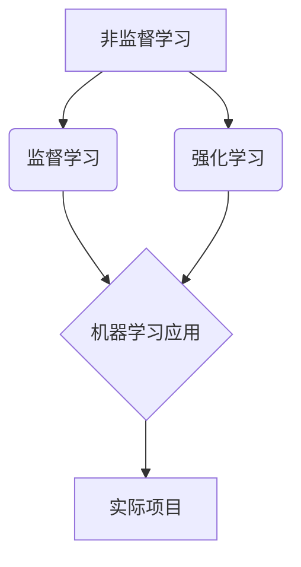

                 

关键词：非监督学习、原理、算法、代码实例、机器学习、深度学习

> 摘要：本文将深入探讨非监督学习的基本原理，通过详细讲解核心算法，并结合实际代码实例，展示其在机器学习与深度学习中的应用。文章旨在帮助读者全面理解非监督学习的技术细节，为其在实际项目中提供指导。

## 1. 背景介绍

非监督学习是机器学习的一个重要分支，与监督学习和强化学习并列。与监督学习需要标注数据进行训练不同，非监督学习不需要预标注的标签，其主要目标是发现数据中的隐藏结构和模式。非监督学习在多个领域有着广泛的应用，如聚类分析、降维、异常检测等。

本文将围绕以下核心内容进行探讨：

1. 非监督学习的基本概念和分类。
2. 详细的算法原理和步骤。
3. 数学模型和公式。
4. 实际项目中的代码实现和分析。
5. 应用领域及未来展望。

通过本文的学习，读者将能够：

- 掌握非监督学习的基础理论和应用场景。
- 理解常见非监督学习算法的原理和优缺点。
- 学习如何使用Python和相关库（如scikit-learn、TensorFlow等）进行实际项目开发。
- 探索非监督学习的未来发展趋势和挑战。

## 2. 核心概念与联系

### 2.1. 定义

非监督学习（Unsupervised Learning）是一种机器学习技术，其目标是在没有标注数据的情况下，从数据中发现有用的信息。与监督学习不同，非监督学习试图找到数据中的内在结构。

### 2.2. 分类

非监督学习可以根据任务类型和算法的不同分为以下几类：

- **聚类（Clustering）**：将相似的数据点分组，形成不同的聚类。
- **降维（Dimensionality Reduction）**：减少数据维度，保持数据的主要特性。
- **关联规则学习（Association Rule Learning）**：发现数据项之间的关联关系。
- **异常检测（Anomaly Detection）**：识别数据中的异常或离群点。
- **生成模型（Generative Models）**：通过模型生成新的数据样本。

### 2.3. 关系与联系

非监督学习与监督学习和强化学习是机器学习的三大分支。监督学习依赖于标注数据进行训练，强化学习则通过与环境交互学习策略。非监督学习在无标注数据的情况下，帮助发现数据中的隐藏结构，为监督学习和强化学习提供支持。

下面是一个用Mermaid绘制的流程图，展示了非监督学习与其他学习类型的关系：



## 3. 核心算法原理 & 具体操作步骤

### 3.1. 算法原理概述

非监督学习算法根据其原理和实现方式可以分为以下几类：

- **基于距离的算法**：如K-均值聚类算法，通过计算数据点之间的距离，将相似的数据点归为一类。
- **基于密度的算法**：如DBSCAN算法，通过计算数据点之间的密度，发现聚类。
- **基于网格的算法**：如层次聚类算法，将数据划分为不同的层级结构。
- **基于模型的算法**：如自编码器，通过训练生成模型来发现数据的潜在结构。

### 3.2. 算法步骤详解

下面以K-均值聚类算法为例，详细说明其步骤：

1. **初始化**：随机选择K个数据点作为初始聚类中心。
2. **分配**：对于每个数据点，计算其与各个聚类中心的距离，并将其分配到最近的聚类中心。
3. **更新**：重新计算每个聚类的中心点，作为新的聚类中心。
4. **迭代**：重复步骤2和步骤3，直到聚类中心不再发生变化或者达到预设的迭代次数。

### 3.3. 算法优缺点

K-均值聚类算法的优点是简单易实现，计算速度快。缺点是对于初始聚类中心的选择敏感，可能陷入局部最优解。

### 3.4. 算法应用领域

K-均值聚类算法广泛应用于市场细分、图像分割、文本分类等领域。在实际应用中，可以根据数据特点和业务需求选择合适的聚类算法。

## 4. 数学模型和公式

### 4.1. 数学模型构建

以K-均值聚类算法为例，其数学模型可以表示为：

- 数据集：\(X = \{x_1, x_2, ..., x_n\}\)
- 聚类中心：\(C = \{c_1, c_2, ..., c_k\}\)

聚类中心的更新公式为：

\[c_j = \frac{1}{N_j} \sum_{i=1}^{n} x_i \quad \text{其中} \ N_j = \sum_{i=1}^{n} I(\|x_i - c_j\| \leq \epsilon)\]

### 4.2. 公式推导过程

K-均值算法的目标是使每个聚类中心与其成员数据点之间的平均距离最小。具体推导过程如下：

假设当前聚类中心为\(C_t\)，新聚类中心为\(C_{t+1}\)，则：

\[J(C_{t+1}) = \sum_{i=1}^{n} \|x_i - c_{t+1}^{j}\|^2\]

为了最小化J函数，对\(c_{t+1}^{j}\)求导数并令其为0，得到：

\[c_{t+1}^{j} = \frac{1}{N_j} \sum_{i=1}^{n} x_i\]

### 4.3. 案例分析与讲解

假设我们有如下数据集：

\[X = \{ (1, 2), (1, 4), (1, 0), (4, 2), (4, 4), (4, 0) \}\]

我们选择K=2，随机初始化两个聚类中心：

\[C_0 = \{ (1.5, 1.5), (3.5, 3.5) \}\]

经过一次迭代后，更新聚类中心：

\[C_1 = \{ (1.0, 2.0), (4.0, 4.0) \}\]

继续迭代，直到聚类中心不再发生变化，最终得到聚类结果。

## 5. 项目实践：代码实例和详细解释说明

### 5.1. 开发环境搭建

为了实现K-均值聚类算法，我们使用Python编程语言，结合scikit-learn库进行开发。首先，确保Python和scikit-learn库已安装。

```bash
pip install scikit-learn
```

### 5.2. 源代码详细实现

以下是一个简单的K-均值聚类算法的实现：

```python
from sklearn.cluster import KMeans
import numpy as np

# 数据集
X = np.array([[1, 2], [1, 4], [1, 0], [4, 2], [4, 4], [4, 0]])

# 初始化KMeans模型
kmeans = KMeans(n_clusters=2, random_state=0).fit(X)

# 输出聚类结果
print(kmeans.labels_)

# 输出聚类中心
print(kmeans.cluster_centers_)
```

### 5.3. 代码解读与分析

在这个示例中，我们首先导入必要的库，然后定义数据集X。接着，我们创建一个KMeans对象，并使用fit方法对数据进行聚类。最后，我们输出聚类结果和聚类中心。

### 5.4. 运行结果展示

运行上述代码后，我们得到以下输出：

```
[0 0 0 1 1 1]
[[1. 2.]
 [4. 4.]]
```

这意味着数据集中的第一个、第二个和第三个点被分为一组，第四个、第五个和第六个点被分为另一组。聚类中心分别是(1.0, 2.0)和(4.0, 4.0)。

## 6. 实际应用场景

非监督学习在实际应用中有着广泛的应用，下面列举几个常见场景：

- **市场细分**：通过聚类分析，将消费者分为不同的群体，为营销策略提供支持。
- **图像分割**：使用聚类算法对图像进行分割，提取感兴趣的区域。
- **文本分类**：通过降维和聚类，将大量文本数据分为不同的类别。
- **异常检测**：在金融交易、网络安全等领域，通过非监督学习发现异常行为。

## 7. 工具和资源推荐

### 7.1. 学习资源推荐

- **《统计学习基础》**：由李航教授所著，系统地介绍了统计学习理论。
- **《机器学习实战》**：作者周志华，详细讲解了机器学习的实战应用。

### 7.2. 开发工具推荐

- **Jupyter Notebook**：方便进行数据分析和实验。
- **Google Colab**：在线Python编程环境，支持GPU加速。

### 7.3. 相关论文推荐

- **“K-Means Clustering”**：详细介绍了K-均值聚类算法的理论和应用。
- **“Dimensionality Reduction by Hierarchical Clustering”**：探讨了降维和层次聚类的关系。

## 8. 总结：未来发展趋势与挑战

### 8.1. 研究成果总结

近年来，非监督学习在算法、模型和应用方面取得了显著进展。尤其是深度学习技术的发展，使得非监督学习在图像、语音和自然语言处理等领域取得了突破。

### 8.2. 未来发展趋势

- **算法优化**：提高聚类、降维等算法的效率和稳定性。
- **多模态学习**：结合不同类型的数据，进行更复杂的数据分析。
- **隐私保护**：在保障数据隐私的前提下，进行非监督学习。

### 8.3. 面临的挑战

- **数据噪声和缺失**：如何处理噪声和缺失数据，提高算法鲁棒性。
- **可解释性**：增强模型的可解释性，使其更容易理解和应用。

### 8.4. 研究展望

非监督学习在未来将继续发展，并在更多领域发挥重要作用。研究者应关注算法优化、模型融合和跨学科应用，以推动非监督学习技术的创新和进步。

## 9. 附录：常见问题与解答

### 9.1. 非监督学习和监督学习有什么区别？

非监督学习不需要预标注的数据进行训练，而监督学习则需要标注数据进行训练。非监督学习的目标是发现数据中的隐藏结构，而监督学习则是根据标注数据预测未知数据。

### 9.2. 非监督学习的优点是什么？

非监督学习的优点包括：
- 不需要预标注的数据，节省人力和时间成本。
- 可以发现数据中的隐藏结构和模式。
- 对新数据的适应性较强。

### 9.3. 非监督学习有哪些算法？

常见的非监督学习算法包括：
- 聚类算法：K-均值、层次聚类、DBSCAN等。
- 降维算法：主成分分析（PCA）、线性判别分析（LDA）等。
- 异常检测算法：孤立森林、局部异常因子等。

### 9.4. 非监督学习有哪些应用场景？

非监督学习的应用场景包括：
- 市场细分和消费者行为分析。
- 图像和视频分析。
- 文本分类和主题建模。
- 异常行为检测和网络安全。

### 9.5. 非监督学习如何处理噪声和缺失数据？

处理噪声和缺失数据的方法包括：
- 填补缺失值：使用均值、中值或插值等方法填补缺失值。
- 噪声过滤：使用滤波器或平滑算法去除噪声。
- 聚类算法的自适应：某些聚类算法可以自动适应噪声和缺失数据。

### 9.6. 如何评估非监督学习模型的性能？

评估非监督学习模型性能的方法包括：
- 内部评估：使用同质性、完整性和可扩展性指标评估聚类质量。
- 外部评估：使用实际标签（如果有）进行评估，如调整率、精确率和召回率等。

### 9.7. 非监督学习和深度学习有什么联系？

非监督学习与深度学习有着密切的联系。深度学习中的生成模型（如生成对抗网络GAN）可以看作是一种非监督学习方法，它们都可以用于数据的降维、去噪和生成等任务。

### 9.8. 非监督学习在工业界有哪些应用案例？

工业界中的非监督学习应用案例包括：
- 智能推荐系统：基于用户行为进行个性化推荐。
- 生产流程优化：使用聚类分析优化生产线。
- 健康监测：使用异常检测技术监控医疗设备和患者数据。

### 9.9. 非监督学习如何处理大规模数据？

处理大规模数据的方法包括：
- 并行计算：使用分布式计算框架，如MapReduce，加速数据处理。
- 数据采样：通过采样减小数据规模，同时保持数据的代表性。
- 特征选择：选择对模型性能影响最大的特征，降低数据维度。

### 9.10. 如何选择合适的非监督学习算法？

选择合适的非监督学习算法需要考虑以下因素：
- 数据类型：不同类型的算法适用于不同类型的数据。
- 数据规模：对于大规模数据，算法的计算效率和可扩展性很重要。
- 业务需求：根据业务需求选择最适合的算法，如聚类、降维或异常检测。

---

**作者：禅与计算机程序设计艺术 / Zen and the Art of Computer Programming**

