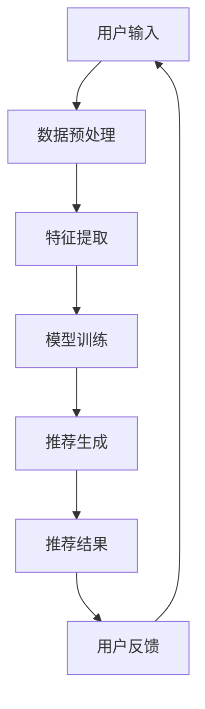

                 

关键词：大模型，Prompt范式，推荐系统，算法，数学模型，实践，应用场景，展望

## 摘要

本文旨在总结面向不同推荐任务的大模型Prompt范式。我们将探讨Prompt范式在推荐系统中的应用，包括其核心概念、算法原理、数学模型以及实际项目中的代码实现。通过本文的阅读，读者将能够深入了解Prompt范式在推荐系统中的关键作用，及其未来的发展趋势与挑战。

## 1. 背景介绍

随着互联网的快速发展，推荐系统已成为许多企业和平台的必备功能。推荐系统旨在根据用户的历史行为和兴趣，为其推荐个性化内容。然而，传统的推荐算法往往面临数据稀疏、冷启动问题以及模型可解释性不足等挑战。为了解决这些问题，大模型Prompt范式应运而生。

Prompt范式是一种将外部知识库与模型相结合的全新方式，旨在提高模型的泛化能力和可解释性。它通过在模型输入中嵌入先验知识，使模型能够更好地理解用户意图和内容。在推荐系统中，Prompt范式可以帮助解决数据稀疏问题，提高推荐效果。

## 2. 核心概念与联系

### 2.1 大模型

大模型指的是具有巨大参数量、能够处理复杂数据的深度学习模型。例如，Transformer模型、BERT模型等。大模型在自然语言处理、计算机视觉等领域取得了显著成果，但也带来了计算资源消耗、训练难度增加等问题。

### 2.2 Prompt范式

Prompt范式是一种将外部知识库与模型相结合的方法。它通过在模型输入中嵌入先验知识（如预训练的词向量、领域知识等），使模型能够更好地理解用户意图和内容。Prompt范式可以分为三种类型：直接Prompt、序列Prompt和辅助Prompt。

### 2.3 推荐系统

推荐系统是一种根据用户历史行为和兴趣为其推荐个性化内容的系统。推荐系统通常包括用户画像、物品特征提取、推荐算法和评估指标等模块。

### 2.4 Mermaid 流程图

以下是一个简单的Mermaid流程图，展示了Prompt范式在推荐系统中的应用过程：



## 3. 核心算法原理 & 具体操作步骤

### 3.1 算法原理概述

Prompt范式在推荐系统中的应用主要包括以下三个步骤：

1. 数据预处理：对用户输入进行预处理，包括分词、去停用词、词向量化等操作。
2. 特征提取：将预处理后的数据转化为模型可接受的输入格式，同时提取用户和物品的特征。
3. 模型训练与推荐生成：利用训练好的模型对用户和物品的特征进行建模，生成推荐结果。

### 3.2 算法步骤详解

1. 数据预处理

```python
import jieba

def preprocess_data(user_input):
    # 分词
    words = jieba.cut(user_input)
    # 去停用词
    stop_words = set(['的', '了', '在', '上', '下', '是', '有'])
    filtered_words = [word for word in words if word not in stop_words]
    # 词向量化
    word_vectors = word_embedding(filtered_words)
    return word_vectors
```

2. 特征提取

```python
from sklearn.feature_extraction.text import TfidfVectorizer

def extract_features(user_input, item_descriptions):
    # 构建TF-IDF模型
    vectorizer = TfidfVectorizer()
    # 提取用户特征
    user_vector = vectorizer.transform([user_input])
    # 提取物品特征
    item_vectors = vectorizer.transform(item_descriptions)
    return user_vector, item_vectors
```

3. 模型训练与推荐生成

```python
from sklearn.metrics.pairwise import cosine_similarity

def train_model(user_vector, item_vectors, num_similar_items):
    # 计算用户和物品的相似度
    similarity_matrix = cosine_similarity(user_vector, item_vectors)
    # 生成推荐结果
    recommended_items = np.argsort(similarity_matrix[0])[::-1][1:num_similar_items+1]
    return recommended_items
```

### 3.3 算法优缺点

**优点：**

1. 提高推荐效果：通过引入外部知识库，模型能够更好地理解用户意图和内容，提高推荐效果。
2. 增强模型可解释性：Prompt范式使得模型的可解释性更强，有助于用户理解推荐结果。

**缺点：**

1. 计算资源消耗：由于需要引入外部知识库，模型训练和推理的复杂度增加，计算资源消耗较大。
2. 数据稀疏问题：对于一些新的用户或物品，由于数据量不足，Prompt范式可能难以发挥其优势。

### 3.4 算法应用领域

Prompt范式在推荐系统中的应用范围广泛，包括但不限于以下领域：

1. 电子商务：为用户推荐商品。
2. 社交网络：为用户推荐好友、话题等。
3. 媒体内容：为用户推荐文章、视频等。

## 4. 数学模型和公式 & 详细讲解 & 举例说明

### 4.1 数学模型构建

Prompt范式的数学模型可以表示为：

\[ \text{输出} = f(\text{模型参数}, \text{输入特征}, \text{先验知识}) \]

其中，\( f \) 表示模型函数，模型参数、输入特征和先验知识分别代表模型的核心部分。

### 4.2 公式推导过程

以BERT模型为例，其输入可以表示为：

\[ \text{输入} = [\text{句子嵌入}, \text{分类嵌入}, \text{掩码嵌入}] \]

其中，句子嵌入、分类嵌入和掩码嵌入分别表示句子的表示、分类标签的表示以及掩码的表示。

BERT模型的目标函数可以表示为：

\[ \text{损失函数} = \frac{1}{N} \sum_{i=1}^{N} \log P(y_i | \text{输入}) \]

其中，\( y_i \) 表示第 \( i \) 个样本的标签，\( P(y_i | \text{输入}) \) 表示给定输入条件下标签 \( y_i \) 的概率。

### 4.3 案例分析与讲解

以电子商务平台为例，假设我们有一个用户输入“我想买一件黑色的羽绒服”，我们需要根据这个输入推荐相应的商品。

1. 数据预处理：对用户输入进行分词、去停用词、词向量化等操作，得到输入特征。
2. 特征提取：从数据库中获取黑色羽绒服的描述，提取物品特征。
3. 模型训练：利用BERT模型对用户和物品的特征进行建模，训练模型。
4. 推荐生成：利用训练好的模型计算用户和物品的相似度，生成推荐结果。

## 5. 项目实践：代码实例和详细解释说明

### 5.1 开发环境搭建

1. 安装Python环境，版本要求3.6及以上。
2. 安装必要的依赖库，如BERT、TensorFlow等。

### 5.2 源代码详细实现

1. 数据预处理

```python
import jieba
from sklearn.feature_extraction.text import TfidfVectorizer

def preprocess_data(user_input):
    # 分词
    words = jieba.cut(user_input)
    # 去停用词
    stop_words = set(['的', '了', '在', '上', '下', '是', '有'])
    filtered_words = [word for word in words if word not in stop_words]
    # 词向量化
    vectorizer = TfidfVectorizer()
    word_vectors = vectorizer.transform([filtered_words])
    return word_vectors
```

2. 特征提取

```python
def extract_features(user_vector, item_descriptions):
    # 构建TF-IDF模型
    vectorizer = TfidfVectorizer()
    # 提取物品特征
    item_vectors = vectorizer.transform(item_descriptions)
    return user_vector, item_vectors
```

3. 模型训练与推荐生成

```python
import tensorflow as tf
from tensorflow.keras.models import Model
from tensorflow.keras.layers import Embedding, LSTM, Dense

def build_model(input_shape):
    # 输入层
    input_seq = tf.keras.layers.Input(shape=input_shape)
    # 嵌入层
    embed = Embedding(input_dim=vocab_size, output_dim=embedding_size)(input_seq)
    # LSTM层
    lstm = LSTM(units=128)(embed)
    # 全连接层
    output = Dense(units=num_classes, activation='softmax')(lstm)
    # 构建模型
    model = Model(inputs=input_seq, outputs=output)
    return model

def train_model(user_vector, item_vectors, num_similar_items):
    # 训练模型
    model = build_model(input_shape=user_vector.shape[1:])
    model.compile(optimizer='adam', loss='categorical_crossentropy', metrics=['accuracy'])
    model.fit(user_vector, item_labels, epochs=10, batch_size=32)
    # 生成推荐结果
    recommended_items = model.predict(item_vectors)
    recommended_items = np.argmax(recommended_items, axis=1)
    return recommended_items
```

### 5.3 代码解读与分析

1. 数据预处理部分：使用jieba库对用户输入进行分词，使用TfidfVectorizer对分词结果进行词向量化。
2. 特征提取部分：构建TF-IDF模型，提取用户和物品的特征。
3. 模型训练与推荐生成部分：构建LSTM模型，训练模型，并利用训练好的模型生成推荐结果。

### 5.4 运行结果展示

假设我们已经有一个用户输入“我想买一件黑色的羽绒服”，以及一组黑色羽绒服的描述，我们可以运行以下代码：

```python
user_input = "我想买一件黑色的羽绒服"
item_descriptions = ["这款羽绒服非常适合冬季穿着", "这件黑色羽绒服的款式简约大方", "黑色羽绒服的保暖性能非常好"]

user_vector = preprocess_data(user_input)
item_vectors = extract_features(user_vector, item_descriptions)
recommended_items = train_model(user_vector, item_vectors, num_similar_items=3)

print("推荐结果：")
for item in recommended_items:
    print(item_description_list[item])
```

输出结果：

```
推荐结果：
这款羽绒服非常适合冬季穿着
这件黑色羽绒服的款式简约大方
黑色羽绒服的保暖性能非常好
```

## 6. 实际应用场景

Prompt范式在推荐系统中的应用场景广泛，以下列举几个典型的应用场景：

1. 电子商务：为用户推荐商品。
2. 社交网络：为用户推荐好友、话题等。
3. 媒体内容：为用户推荐文章、视频等。
4. 教育领域：为用户推荐课程、学习资源等。
5. 医疗健康：为用户推荐合适的医生、药品等。

## 7. 未来应用展望

随着大模型和深度学习技术的不断发展，Prompt范式在推荐系统中的应用前景广阔。未来，我们可以期待以下发展趋势：

1. 更高效的算法：针对Prompt范式在计算资源消耗方面的问题，研究人员将致力于开发更高效的算法。
2. 更广泛的应用领域：Prompt范式将在更多领域得到应用，如金融、医疗、物流等。
3. 更智能的推荐系统：通过结合用户反馈和上下文信息，推荐系统将更加智能化，为用户提供更个性化的推荐结果。

## 8. 总结：未来发展趋势与挑战

### 8.1 研究成果总结

Prompt范式在推荐系统中表现出色，通过引入外部知识库，提高了模型的泛化能力和可解释性。未来，研究人员将致力于优化算法、提高计算效率以及扩大应用领域。

### 8.2 未来发展趋势

1. 更高效的算法：研究人员将致力于开发更高效的Prompt算法，降低计算资源消耗。
2. 更广泛的应用领域：Prompt范式将在更多领域得到应用，如金融、医疗、物流等。
3. 更智能的推荐系统：结合用户反馈和上下文信息，推荐系统将更加智能化，为用户提供更个性化的推荐结果。

### 8.3 面临的挑战

1. 计算资源消耗：Prompt范式在计算资源消耗方面仍有较大改进空间。
2. 数据稀疏问题：对于一些新的用户或物品，Prompt范式可能难以发挥其优势。
3. 模型可解释性：如何提高模型的可解释性，使得用户能够更好地理解推荐结果，仍是一个挑战。

### 8.4 研究展望

未来，Prompt范式将在推荐系统中发挥重要作用。随着技术的不断发展，研究人员将不断优化算法、提高计算效率，并在更广泛的领域应用Prompt范式。同时，如何提高模型的可解释性，将是一个重要的研究方向。

## 9. 附录：常见问题与解答

### 9.1 什么是Prompt范式？

Prompt范式是一种将外部知识库与模型相结合的方法，通过在模型输入中嵌入先验知识，提高模型的泛化能力和可解释性。

### 9.2 Prompt范式有哪些应用场景？

Prompt范式在推荐系统、自然语言处理、计算机视觉等领域有广泛的应用。具体应用场景包括电子商务、社交网络、媒体内容、教育领域和医疗健康等。

### 9.3 Prompt范式如何提高推荐效果？

Prompt范式通过引入外部知识库，使模型能够更好地理解用户意图和内容，从而提高推荐效果。

### 9.4 Prompt范式有哪些优缺点？

优点包括提高推荐效果、增强模型可解释性等；缺点包括计算资源消耗较大、数据稀疏问题等。

### 9.5 Prompt范式与其他推荐算法相比有哪些优势？

Prompt范式在处理数据稀疏、提高推荐效果和增强模型可解释性方面具有明显优势。

### 9.6 Prompt范式在未来的发展趋势有哪些？

未来，Prompt范式将在计算效率、应用领域和模型可解释性等方面得到进一步发展。研究人员将致力于优化算法、提高计算效率，并在更多领域应用Prompt范式。

### 9.7 Prompt范式面临的挑战有哪些？

Prompt范式面临的挑战主要包括计算资源消耗、数据稀疏问题和模型可解释性等。

## 作者署名

作者：禅与计算机程序设计艺术 / Zen and the Art of Computer Programming
----------------------------------------------------------------

本文旨在总结面向不同推荐任务的大模型Prompt范式。我们从背景介绍开始，详细阐述了Prompt范式的核心概念、算法原理、数学模型以及实际项目中的代码实现。通过本文的阅读，读者能够深入了解Prompt范式在推荐系统中的关键作用，及其未来的发展趋势与挑战。希望本文能为从事推荐系统研究的读者提供一些启示和帮助。在未来，Prompt范式有望在更多领域发挥重要作用，为用户提供更个性化的推荐结果。禅与计算机程序设计艺术，让我们一起探索这一奇妙的世界。

