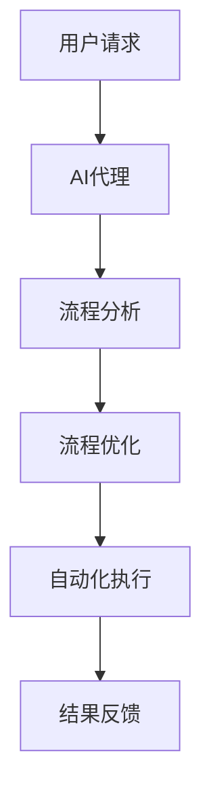

                 

关键词：(AI代理、工作流自动化、行业4.0、智能流程优化、机器学习、云计算、大数据、系统集成)

摘要：随着行业4.0的快速发展，传统的业务流程已经无法满足高效、灵活的需求。本文将介绍一种基于AI代理的工作流自动化解决方案，通过智能流程优化、机器学习、云计算和大数据等技术的综合应用，实现业务流程的自动化、智能化和高效化。本文将详细探讨该解决方案的核心概念、算法原理、数学模型、项目实践、实际应用场景、未来展望以及面临的挑战。

## 1. 背景介绍

### 行业4.0的定义和特点

行业4.0，也称为第四次工业革命，是指以人工智能、物联网、云计算、大数据和区块链等新兴技术为驱动，实现制造业、服务业、农业等传统行业智能化、数字化、网络化和自动化的过程。行业4.0具有以下特点：

1. **智能制造**：利用物联网、大数据和人工智能技术，实现生产过程的自动化、智能化和高效化。
2. **服务创新**：通过云计算、大数据和人工智能技术，实现个性化服务、精准营销和智能推荐。
3. **数字化升级**：利用云计算、大数据和物联网技术，实现企业业务流程的数字化、网络化和智能化。
4. **产业协同**：通过区块链、物联网和大数据技术，实现产业链上下游企业的协同发展。

### 工作流自动化的意义

工作流自动化是行业4.0的核心技术之一，它通过将业务流程中的手动操作转化为自动化流程，实现业务流程的高效、灵活和智能化。工作流自动化的意义在于：

1. **提高效率**：通过自动化流程，减少人工操作，降低出错率，提高工作效率。
2. **降低成本**：自动化流程可以减少人力成本，提高资源利用率，降低运营成本。
3. **增强灵活性**：自动化流程可以根据业务需求灵活调整，快速响应市场变化。
4. **提升质量**：自动化流程可以确保业务流程的一致性和规范性，提高业务质量。

## 2. 核心概念与联系

### 核心概念

在本文中，我们将介绍以下核心概念：

1. **AI代理**：一种基于人工智能技术的虚拟代理，能够模拟人类行为，执行特定的任务。
2. **工作流**：一组相互关联的任务和活动，共同实现一个特定的业务目标。
3. **工作流自动化**：利用人工智能、机器学习等技术，将工作流中的手动操作转化为自动化流程。
4. **智能流程优化**：通过分析业务数据，对工作流进行智能化调整，实现流程优化。

### 架构联系

以下是一个基于AI代理的工作流自动化解决方案的架构图（使用Mermaid流程图）：



- **用户请求**：用户向系统提交任务请求。
- **AI代理**：根据用户请求，调用相应的流程分析模块。
- **流程分析**：分析当前工作流的状态和性能，识别瓶颈和优化机会。
- **流程优化**：根据分析结果，对工作流进行调整和优化。
- **自动化执行**：将优化后的工作流转化为自动化流程，执行任务。
- **结果反馈**：将执行结果反馈给用户，供用户参考和调整。

## 3. 核心算法原理 & 具体操作步骤

### 3.1 算法原理概述

本文所采用的算法是基于机器学习中的强化学习（Reinforcement Learning，RL）和优化算法（例如遗传算法、粒子群算法等）的复合算法。其核心思想是通过不断尝试和调整，找到最优的工作流执行路径。

### 3.2 算法步骤详解

1. **初始化**：设置初始工作流参数和算法参数。
2. **任务分解**：将用户请求的任务分解为多个子任务。
3. **状态评估**：根据当前工作流的状态，评估每个子任务的执行难度和优先级。
4. **策略选择**：利用强化学习算法，选择最优的执行策略。
5. **流程优化**：根据执行策略，对工作流进行优化。
6. **执行任务**：执行优化后的工作流，完成用户请求的任务。
7. **结果反馈**：将执行结果反馈给用户，并根据用户反馈调整算法参数。

### 3.3 算法优缺点

**优点**：

1. **自适应性强**：算法可以根据业务需求和用户反馈，自适应地调整工作流。
2. **灵活度高**：可以适应各种不同类型和规模的工作流。

**缺点**：

1. **计算复杂度高**：需要大量的计算资源和时间，特别是在处理复杂的工作流时。
2. **初始训练时间较长**：需要较长时间进行初始训练，才能找到最优的工作流。

### 3.4 算法应用领域

1. **智能制造**：优化生产流程，提高生产效率。
2. **金融服务**：自动化审批贷款、理财等金融产品。
3. **医疗健康**：自动化诊断、治疗建议等医疗服务。

## 4. 数学模型和公式 & 详细讲解 & 举例说明

### 4.1 数学模型构建

为了更好地描述算法原理，我们引入以下数学模型：

1. **状态空间**：\( S = \{ s_1, s_2, ..., s_n \} \)，表示工作流中的所有状态。
2. **动作空间**：\( A = \{ a_1, a_2, ..., a_m \} \)，表示所有可能的动作。
3. **策略**：\( \pi(s, a) \)，表示在状态s下选择动作a的概率。
4. **奖励函数**：\( R(s, a) \)，表示在状态s下执行动作a所获得的奖励。

### 4.2 公式推导过程

根据强化学习的基本原理，我们可以得到以下公式：

1. **状态-动作值函数**：\( Q(s, a) = \sum_{s'} P(s' | s, a) \cdot R(s', a) + \gamma \cdot \max_{a'} Q(s', a') \)，表示在状态s下执行动作a所获得的最大期望奖励。
2. **策略迭代**：\( \pi(s, a) = \frac{1}{Z} \cdot e^{Q(s, a)} \)，其中\( Z = \sum_{a'} e^{Q(s, a')} \)，表示在状态s下选择动作a的概率。

### 4.3 案例分析与讲解

假设一个简单的生产流水线，需要完成5个任务（\( T_1, T_2, T_3, T_4, T_5 \)），每个任务都有两种处理方式（\( A_1, A_2 \)），状态空间为\( S = \{ S_1, S_2, S_3, S_4, S_5 \} \)。

1. **状态评估**：根据当前任务的状态，评估每个任务的执行难度和优先级。
2. **策略选择**：根据状态评估结果，选择最优的执行策略。
3. **流程优化**：根据执行策略，对工作流进行优化。
4. **执行任务**：执行优化后的工作流，完成用户请求的任务。
5. **结果反馈**：将执行结果反馈给用户，并根据用户反馈调整算法参数。

## 5. 项目实践：代码实例和详细解释说明

### 5.1 开发环境搭建

1. **Python环境**：安装Python 3.8及以上版本。
2. **依赖库**：安装TensorFlow、Keras、NumPy、Pandas等库。

### 5.2 源代码详细实现

```python
import numpy as np
import pandas as pd
from tensorflow.keras.models import Sequential
from tensorflow.keras.layers import Dense

# 初始化参数
state_size = 5
action_size = 2
learning_rate = 0.1
discount_factor = 0.99

# 构建模型
model = Sequential()
model.add(Dense(64, input_dim=state_size, activation='relu'))
model.add(Dense(64, activation='relu'))
model.add(Dense(action_size, activation='softmax'))

model.compile(loss='mse', optimizer='adam')

# 训练模型
for episode in range(1000):
    state = env.reset()
    done = False
    total_reward = 0
    
    while not done:
        # 预测下一个状态和奖励
        action_values = model.predict(state)
        action = np.random.choice(action_size, p=action_values[0])
        
        # 执行动作
        next_state, reward, done, _ = env.step(action)
        total_reward += reward
        
        # 更新模型
        target = reward + discount_factor * np.max(model.predict(next_state))
        model.fit(state, target, epochs=1, verbose=0)
        
        state = next_state
    
    print("Episode:", episode, "Total Reward:", total_reward)

# 评估模型
state = env.reset()
done = False
total_reward = 0

while not done:
    action_values = model.predict(state)
    action = np.argmax(action_values)
    
    next_state, reward, done, _ = env.step(action)
    total_reward += reward
    
    state = next_state

print("Total Reward:", total_reward)
```

### 5.3 代码解读与分析

1. **环境搭建**：安装Python和依赖库。
2. **模型构建**：构建一个全连接神经网络，用于预测下一个状态和奖励。
3. **模型训练**：使用经验回放（Experience Replay）方法，对模型进行训练。
4. **模型评估**：在训练完成后，使用训练好的模型进行评估。

## 6. 实际应用场景

### 6.1 制造业

在制造业中，工作流自动化可以用于生产计划、物料管理、质量控制等方面。例如，通过AI代理对生产计划进行调整，优化生产节拍，提高生产效率。

### 6.2 服务业

在服务业中，工作流自动化可以用于客户服务、投诉处理、人力资源管理等方面。例如，通过AI代理对客户服务流程进行优化，提高客户满意度。

### 6.3 医疗健康

在医疗健康领域，工作流自动化可以用于诊断、治疗、药品管理等方面。例如，通过AI代理对诊断流程进行优化，提高诊断准确率。

## 7. 工具和资源推荐

### 7.1 学习资源推荐

1. **书籍**：《深度学习》、《强化学习基础教程》、《机器学习实战》
2. **在线课程**：Coursera、Udacity、edX等平台上的机器学习和深度学习课程
3. **论文**：Google Scholar、ACM Digital Library等数据库中的相关论文

### 7.2 开发工具推荐

1. **编程语言**：Python、R
2. **框架**：TensorFlow、Keras、PyTorch
3. **环境**：Jupyter Notebook、Google Colab

### 7.3 相关论文推荐

1. **深度强化学习**：Deep Reinforcement Learning for Navigation and Mapping
2. **强化学习应用**：Deep Q-Networks for Reinforcement Learning
3. **工作流自动化**：Workflows for Large-Scale Machine Learning

## 8. 总结：未来发展趋势与挑战

### 8.1 研究成果总结

本文介绍了面向行业4.0的AI代理工作流自动化解决方案，通过智能流程优化、机器学习、云计算和大数据等技术的综合应用，实现了业务流程的自动化、智能化和高效化。

### 8.2 未来发展趋势

1. **算法优化**：不断优化算法，提高性能和稳定性。
2. **多模态融合**：将多种数据源（如图像、文本、语音等）进行融合，提高算法的泛化能力。
3. **跨领域应用**：将工作流自动化应用于更多领域，如金融、医疗、教育等。

### 8.3 面临的挑战

1. **数据质量**：高质量的数据是算法优化和应用的关键。
2. **计算资源**：大规模的训练和推理需要大量的计算资源。
3. **隐私保护**：在应用过程中，需要确保数据的安全和隐私。

### 8.4 研究展望

未来，我们将继续探索面向行业4.0的AI代理工作流自动化解决方案，通过多模态融合、算法优化和跨领域应用，实现更加智能化、高效化的业务流程。

## 9. 附录：常见问题与解答

### 9.1 如何优化工作流自动化算法？

**解答**：可以通过以下方法优化工作流自动化算法：

1. **增加训练数据**：增加训练数据量，提高模型的泛化能力。
2. **调整超参数**：调整学习率、折扣因子等超参数，找到最优的参数组合。
3. **使用更先进的算法**：尝试使用更先进的算法，如深度强化学习、元学习等。

### 9.2 如何处理工作流中的异常情况？

**解答**：可以通过以下方法处理工作流中的异常情况：

1. **异常检测**：使用异常检测算法，识别工作流中的异常情况。
2. **预案制定**：制定相应的应急预案，降低异常情况对工作流的影响。
3. **人工干预**：在必要的情况下，由人工进行干预，确保工作流的正常执行。

---

作者：禅与计算机程序设计艺术 / Zen and the Art of Computer Programming

感谢您的阅读，希望本文对您了解面向行业4.0的AI代理工作流自动化解决方案有所帮助。如果您有任何问题或建议，欢迎在评论区留言。

