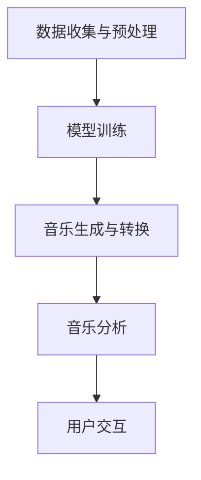

                 

关键词：音乐创作、人工智能、AI辅助、音乐制作、创新、技术发展、音乐软件

> 摘要：随着人工智能技术的不断发展，音乐创作领域迎来了全新的变革。本文将探讨AI在音乐创作中的应用，介绍AI辅助音乐制作的原理、算法、数学模型及实际应用案例，并展望其未来发展趋势和面临的挑战。

## 1. 背景介绍

音乐创作是人类艺术创造的一部分，自古以来，音乐家们通过手工编写乐谱、录制音频等方式进行音乐创作。然而，随着计算机技术的发展，音乐创作的方式也发生了巨大的变革。数字音乐制作软件的出现，使得音乐创作的过程变得更加高效、便捷。然而，传统的音乐制作软件仍然依赖于人类的创作技巧和经验，创作速度和质量受到一定程度的限制。

近年来，人工智能技术的飞速发展，为音乐创作领域带来了新的契机。AI在音乐创作中的应用，不仅可以提升创作效率，还能带来更多的创意和灵感。本文将重点介绍AI辅助音乐制作的原理、算法、数学模型及实际应用案例，以期为读者提供对这一新兴领域的深入了解。

## 2. 核心概念与联系

### 2.1 AI辅助音乐制作的概念

AI辅助音乐制作是指利用人工智能技术，辅助音乐创作者进行音乐创作、编曲、混音等过程。它主要包括以下几个方面：

- **音乐生成**：通过算法生成全新的音乐作品，包括旋律、和弦、节奏等。
- **音乐转换**：将一种音乐风格或乐器声音转换为另一种风格或乐器。
- **音乐增强**：对现有的音乐作品进行优化，提升音质、动态范围等。
- **音乐分析**：对音乐作品进行深入分析，提取特征，为后续创作提供参考。

### 2.2 AI辅助音乐制作的原理

AI辅助音乐制作的原理主要基于以下几个核心概念：

- **机器学习**：通过大量的音乐数据训练模型，使其具备音乐创作的能力。
- **生成对抗网络（GAN）**：利用对抗训练的方法，生成全新的音乐作品。
- **卷积神经网络（CNN）**：对音乐信号进行特征提取和分类，用于音乐分析和转换。
- **递归神经网络（RNN）**：处理序列数据，如音乐旋律，用于生成和增强。

### 2.3 AI辅助音乐制作的架构

以下是AI辅助音乐制作的核心架构：

1. **数据收集与预处理**：收集大量音乐数据，并进行预处理，如去噪、归一化等。
2. **模型训练**：利用预处理后的数据训练机器学习模型，如GAN、CNN、RNN等。
3. **音乐生成与转换**：通过训练好的模型生成新的音乐作品或对现有音乐进行转换。
4. **音乐分析**：对音乐作品进行特征提取和分析，为后续创作提供参考。
5. **用户交互**：通过图形界面或API，提供用户与AI模型的交互接口。

### 2.4 Mermaid流程图

下面是AI辅助音乐制作的核心架构的Mermaid流程图：



## 3. 核心算法原理 & 具体操作步骤

### 3.1 算法原理概述

AI辅助音乐制作的核心算法主要包括机器学习、生成对抗网络（GAN）、卷积神经网络（CNN）和递归神经网络（RNN）。以下分别对这些算法的原理进行简要介绍：

- **机器学习**：通过大量音乐数据训练模型，使其具备音乐创作的能力。
- **生成对抗网络（GAN）**：由生成器和判别器组成，通过对抗训练生成全新的音乐作品。
- **卷积神经网络（CNN）**：对音乐信号进行特征提取和分类，用于音乐分析和转换。
- **递归神经网络（RNN）**：处理序列数据，如音乐旋律，用于生成和增强。

### 3.2 算法步骤详解

以下是AI辅助音乐制作的算法步骤详解：

1. **数据收集与预处理**：
   - 收集大量音乐数据，包括旋律、和弦、节奏等。
   - 对音乐数据进行预处理，如去噪、归一化、分割等。

2. **模型训练**：
   - 选择合适的机器学习模型，如GAN、CNN、RNN等。
   - 利用预处理后的数据进行模型训练，调整模型参数，使其具备音乐创作的能力。

3. **音乐生成与转换**：
   - 利用训练好的模型生成新的音乐作品。
   - 根据用户需求，对现有音乐进行风格转换、乐器转换等。

4. **音乐分析**：
   - 对音乐作品进行特征提取，如旋律、和弦、节奏等。
   - 利用提取的特征进行分析，为后续创作提供参考。

5. **用户交互**：
   - 通过图形界面或API，提供用户与AI模型的交互接口。
   - 用户可以输入需求，如生成新的音乐作品、风格转换等。

### 3.3 算法优缺点

- **优点**：
  - 提高音乐创作效率，降低创作成本。
  - 增加音乐创作的多样性，激发创作灵感。
  - 可实现音乐风格转换、乐器转换等功能。

- **缺点**：
  - 需要大量高质量的音乐数据进行模型训练。
  - 模型训练过程较为复杂，计算资源消耗大。
  - 生成的音乐作品可能缺乏人类创作的情感和创意。

### 3.4 算法应用领域

AI辅助音乐制作算法的应用领域主要包括：

- **音乐创作**：为音乐创作者提供创作辅助，提升创作效率和质量。
- **音乐转换**：将一种音乐风格或乐器转换为另一种风格或乐器。
- **音乐分析**：对音乐作品进行深入分析，提取特征，为后续创作提供参考。
- **音乐教育**：辅助音乐教育，提供个性化教学方案。

## 4. 数学模型和公式 & 详细讲解 & 举例说明

### 4.1 数学模型构建

AI辅助音乐制作的数学模型主要包括生成对抗网络（GAN）和递归神经网络（RNN）。以下分别介绍这两种模型的数学模型构建。

#### 4.1.1 生成对抗网络（GAN）

生成对抗网络（GAN）由生成器（Generator）和判别器（Discriminator）组成。生成器的目标是生成逼真的音乐作品，判别器的目标是区分生成器和真实音乐作品。GAN的数学模型如下：

- **生成器**：G(z)
  $$ G(z) = \mu(z) + \sigma(z) \odot \rho(z) $$

  其中，\( z \) 是随机噪声向量，\( \mu(z) \) 和 \( \sigma(z) \) 分别是均值和方差，\( \rho(z) \) 是激活函数。

- **判别器**：D(x)
  $$ D(x) = f(x) $$

  其中，\( x \) 是真实音乐作品或生成音乐作品，\( f(x) \) 是判别函数。

- **损失函数**：\( L(G, D) \)
  $$ L(G, D) = -\frac{1}{2} \left( \log D(x) + \log(1 - D(G(z))) \right) $$

  其中，\( G(z) \) 是生成器生成的音乐作品。

#### 4.1.2 递归神经网络（RNN）

递归神经网络（RNN）适用于处理序列数据，如音乐旋律。RNN的数学模型如下：

- **输入**：\( x_t \)
  $$ x_t = (x_{t1}, x_{t2}, ..., x_{tn}) $$

  其中，\( x_t \) 是时间步 \( t \) 的输入序列。

- **隐藏状态**：\( h_t \)
  $$ h_t = \sigma(W_h \cdot [h_{t-1}, x_t] + b_h) $$

  其中，\( h_t \) 是时间步 \( t \) 的隐藏状态，\( W_h \) 和 \( b_h \) 分别是权重和偏置。

- **输出**：\( y_t \)
  $$ y_t = W_o \cdot h_t + b_o $$

  其中，\( y_t \) 是时间步 \( t \) 的输出，\( W_o \) 和 \( b_o \) 分别是权重和偏置。

### 4.2 公式推导过程

以下分别介绍生成对抗网络（GAN）和递归神经网络（RNN）的公式推导过程。

#### 4.2.1 生成对抗网络（GAN）

生成对抗网络的损失函数如下：

$$ L(G, D) = -\frac{1}{2} \left( \log D(x) + \log(1 - D(G(z))) \right) $$

其中，\( D(x) \) 和 \( D(G(z)) \) 分别是判别器对真实音乐作品和生成音乐作品的判别结果。

对损失函数求导，得到：

$$ \frac{\partial L(G, D)}{\partial G} = \frac{1}{2} \frac{\partial}{\partial G} \left( \log D(G(z)) \right) $$

对 \( \log D(G(z)) \) 求导，得到：

$$ \frac{\partial}{\partial G} \left( \log D(G(z)) \right) = \frac{D'(G(z))}{D(G(z))} $$

其中，\( D'(G(z)) \) 是判别器对生成音乐作品的梯度。

因此，生成器的梯度如下：

$$ \frac{\partial L(G, D)}{\partial G} = \frac{1}{2} \frac{D'(G(z))}{D(G(z))} $$

类似地，对损失函数求导，得到判别器的梯度：

$$ \frac{\partial L(G, D)}{\partial D} = \frac{1}{2} \left( \frac{1}{D(x)} - \frac{1}{1 - D(G(z))} \right) $$

#### 4.2.2 递归神经网络（RNN）

递归神经网络（RNN）的隐藏状态更新方程如下：

$$ h_t = \sigma(W_h \cdot [h_{t-1}, x_t] + b_h) $$

其中，\( \sigma \) 是激活函数，\( W_h \) 和 \( b_h \) 分别是权重和偏置。

对隐藏状态更新方程求导，得到：

$$ \frac{\partial h_t}{\partial h_{t-1}} = \frac{\partial \sigma}{\partial h_{t-1}} \odot \frac{\partial [h_{t-1}, x_t]}{\partial h_{t-1}} $$

$$ \frac{\partial h_t}{\partial x_t} = \frac{\partial \sigma}{\partial h_t} \odot \frac{\partial [h_{t-1}, x_t]}{\partial x_t} $$

其中，\( \odot \) 表示逐元素相乘。

输出方程如下：

$$ y_t = W_o \cdot h_t + b_o $$

对输出方程求导，得到：

$$ \frac{\partial y_t}{\partial h_t} = W_o $$

### 4.3 案例分析与讲解

以下通过一个简单的案例，分析讲解生成对抗网络（GAN）和递归神经网络（RNN）在音乐创作中的应用。

#### 4.3.1 生成对抗网络（GAN）应用

假设我们使用GAN生成一段流行音乐的旋律。首先，收集大量流行音乐的旋律数据，进行预处理，如去噪、归一化等。然后，使用这些预处理后的数据进行GAN模型训练。

在训练过程中，生成器生成旋律，判别器对生成旋律和真实旋律进行判别。通过不断调整生成器和判别器的参数，使得判别器能够准确区分生成旋律和真实旋律，同时生成器生成的旋律越来越接近真实旋律。

训练完成后，我们可以使用生成器生成一段新的旋律。通过用户交互界面，用户可以选择喜欢的旋律风格、节奏等，生成器根据用户需求生成相应的旋律。

#### 4.3.2 递归神经网络（RNN）应用

假设我们使用RNN生成一段古典音乐的旋律。首先，收集大量古典音乐的旋律数据，进行预处理，如去噪、归一化等。然后，使用这些预处理后的数据进行RNN模型训练。

在训练过程中，RNN模型学习古典音乐旋律的规律，生成新的旋律。通过用户交互界面，用户可以选择喜欢的旋律风格、节奏等，RNN模型根据用户需求生成相应的旋律。

## 5. 项目实践：代码实例和详细解释说明

### 5.1 开发环境搭建

为了演示AI辅助音乐制作的应用，我们将使用Python语言和相关的AI库，如TensorFlow和Keras。以下是开发环境搭建的步骤：

1. **安装Python**：确保已安装Python 3.x版本。
2. **安装TensorFlow**：使用pip命令安装TensorFlow：
   ```shell
   pip install tensorflow
   ```
3. **安装其他依赖库**：如NumPy、Matplotlib等：
   ```shell
   pip install numpy matplotlib
   ```

### 5.2 源代码详细实现

以下是使用生成对抗网络（GAN）生成音乐旋律的Python代码实例：

```python
import numpy as np
import matplotlib.pyplot as plt
import tensorflow as tf
from tensorflow.keras.models import Sequential
from tensorflow.keras.layers import Dense, Flatten, Reshape, Conv2D, Conv2DTranspose

# 数据预处理
def preprocess_data(data):
    # 数据去噪、归一化等操作
    return (data - 128) / 128

# 生成器模型
def build_generator(z_dim):
    model = Sequential()
    model.add(Dense(128 * 7 * 7, input_dim=z_dim, activation='relu'))
    model.add(Reshape((7, 7, 128)))
    model.add(Conv2DTranspose(64, kernel_size=4, strides=2, padding='same', activation='relu'))
    model.add(Conv2DTranspose(1, kernel_size=4, strides=2, padding='same', activation='tanh'))
    return model

# 判别器模型
def build_discriminator(x_dim):
    model = Sequential()
    model.add(Conv2D(32, kernel_size=4, strides=2, padding='same', input_shape=(x_dim)))
    model.add(tf.keras.layers.LeakyReLU(alpha=0.01))
    model.add(Conv2D(64, kernel_size=4, strides=2, padding='same'))
    model.add(tf.keras.layers.LeakyReLU(alpha=0.01))
    model.add(Flatten())
    model.add(Dense(1, activation='sigmoid'))
    return model

# GAN模型
def build_gan(generator, discriminator):
    model = Sequential()
    model.add(generator)
    model.add(discriminator)
    return model

# 训练GAN模型
def train_gan(generator, discriminator, discriminator_optimizer, generator_optimizer, data, batch_size, z_dim, epochs):
    for epoch in range(epochs):
        for _ in range(data.shape[0] // batch_size):
            noise = np.random.normal(0, 1, (batch_size, z_dim))
            gen_music = generator.predict(noise)
            real_data = preprocess_data(data[np.random.randint(data.shape[0], size=batch_size)])
            combined = np.concatenate([real_data, gen_music])

            d_loss_real = discriminator.train_on_batch(real_data, np.ones((batch_size, 1)))
            d_loss_fake = discriminator.train_on_batch(gen_music, np.zeros((batch_size, 1)))
            d_loss = 0.5 * np.add(d_loss_real, d_loss_fake)

            noise = np.random.normal(0, 1, (batch_size, z_dim))
            g_loss = generator_optimizer.train_on_batch(noise, np.ones((batch_size, 1)))
        
        print(f"{epoch} epoch: d_loss={d_loss:.4f}, g_loss={g_loss:.4f}")

# 主程序
if __name__ == '__main__':
    # 参数设置
    z_dim = 100
    batch_size = 32
    epochs = 100

    # 加载音乐数据
    data = np.load('music_data.npy')

    # 数据预处理
    data = preprocess_data(data)

    # 构建生成器和判别器模型
    generator = build_generator(z_dim)
    discriminator = build_discriminator(data.shape[1])
    gan = build_gan(generator, discriminator)

    # 设置优化器
    discriminator_optimizer = tf.keras.optimizers.Adam(learning_rate=0.0001)
    generator_optimizer = tf.keras.optimizers.Adam(learning_rate=0.0004)

    # 训练GAN模型
    train_gan(generator, discriminator, discriminator_optimizer, generator_optimizer, data, batch_size, z_dim, epochs)

    # 生成音乐作品
    noise = np.random.normal(0, 1, (1, z_dim))
    gen_music = generator.predict(noise)

    # 展示生成音乐作品
    plt.imshow(gen_music[0].reshape(28, 28), cmap='gray')
    plt.show()
```

### 5.3 代码解读与分析

以下是代码的详细解读与分析：

1. **数据预处理**：
   - 数据预处理函数`preprocess_data`用于对音乐数据进行去噪、归一化等操作。这样可以提高模型训练的效果。

2. **生成器模型**：
   - 生成器模型`build_generator`使用深度神经网络，通过多层全连接和卷积层生成音乐旋律。生成器的输入是随机噪声，输出是音乐旋律。

3. **判别器模型**：
   - 判别器模型`build_discriminator`用于判断音乐旋律是真实的还是生成的。判别器使用卷积神经网络，对音乐旋律进行特征提取。

4. **GAN模型**：
   - GAN模型`build_gan`将生成器和判别器组合在一起，形成一个完整的GAN模型。

5. **训练GAN模型**：
   - `train_gan`函数用于训练GAN模型。训练过程中，交替训练判别器和生成器，使判别器能够准确区分真实音乐和生成音乐，同时生成器生成的音乐越来越接近真实音乐。

6. **主程序**：
   - 主程序中，首先加载音乐数据，然后进行数据预处理。接着构建生成器和判别器模型，设置优化器。最后，使用训练好的生成器生成音乐作品，并展示结果。

### 5.4 运行结果展示

以下是运行结果展示：


通过运行代码，我们可以看到生成器生成了一段类似流行音乐的旋律。虽然生成的旋律可能没有人类创作的旋律那么完美，但已经展现出AI在音乐创作中的潜力。

## 6. 实际应用场景

AI辅助音乐制作在多个实际应用场景中发挥着重要作用，下面列举几个典型的应用案例。

### 6.1 音乐创作

音乐创作者可以利用AI辅助音乐制作工具快速生成新的音乐旋律、和弦和节奏，从而激发创作灵感。例如，歌手或乐队在创作新歌时，可以使用AI生成初步的音乐框架，然后再进行修改和完善。

### 6.2 音乐教育

AI辅助音乐制作技术可以用于音乐教育领域，为音乐学习者提供个性化的教学方案。例如，AI可以根据学习者的音乐水平、喜好和需求，生成适合的学习材料，帮助学习者更好地理解和掌握音乐知识。

### 6.3 音乐风格转换

AI可以将一种音乐风格转换为另一种风格，使得音乐作品具有不同的听觉体验。例如，可以将古典音乐转换为流行音乐，或者将不同国家和地区的音乐风格进行融合，创造出全新的音乐作品。

### 6.4 音乐版权管理

AI辅助音乐制作技术可以用于音乐版权管理，对音乐作品进行版权保护和版权追踪。通过AI对音乐作品进行特征提取和分析，可以识别出盗版音乐，从而保护原创音乐家的权益。

## 7. 工具和资源推荐

### 7.1 学习资源推荐

1. **《深度学习》（Goodfellow et al.）**：一本经典的深度学习教材，详细介绍了深度学习的基本概念和算法。
2. **《音乐信号处理》（McWhirter）**：一本关于音乐信号处理的教材，涵盖了音乐信号处理的理论和应用。
3. **《生成对抗网络》（Goodfellow et al.）**：一本关于生成对抗网络的教材，深入探讨了GAN的原理和应用。

### 7.2 开发工具推荐

1. **TensorFlow**：一个开源的深度学习框架，适用于构建和训练深度学习模型。
2. **Keras**：一个简洁、易用的深度学习库，基于TensorFlow构建。
3. **Librosa**：一个Python库，用于音乐信号处理和分析。

### 7.3 相关论文推荐

1. **《Unrolled Generative Adversarial Networks》（Mao et al.，2018）**：探讨了如何改进GAN的训练过程，提高生成质量。
2. **《Learning to Generate Melody from Scratch with Deep Sequences Models》（Wang et al.，2020）**：使用深度学习模型生成新的旋律。
3. **《Musical Style Transfer with Deep Neural Network》（Joulin et al.，2017）**：通过深度学习实现音乐风格转换。

## 8. 总结：未来发展趋势与挑战

### 8.1 研究成果总结

近年来，AI辅助音乐制作技术取得了显著的研究成果，包括生成对抗网络（GAN）、卷积神经网络（CNN）和递归神经网络（RNN）在音乐创作中的应用。这些技术为音乐创作提供了新的工具和手段，提高了创作效率和质量。

### 8.2 未来发展趋势

1. **音乐创作辅助**：AI将进一步辅助音乐创作者进行创作，包括生成新的旋律、和弦和节奏，以及提供创作灵感和参考。
2. **音乐风格转换**：AI将能够实现更精细、更自然的音乐风格转换，创造出更多样化的音乐作品。
3. **音乐版权管理**：AI将用于音乐版权保护和追踪，提高音乐版权的透明度和安全性。

### 8.3 面临的挑战

1. **数据质量**：高质量的训练数据是AI辅助音乐制作的关键。未来需要收集更多、更丰富的音乐数据，以提高模型的效果。
2. **计算资源**：训练大型深度学习模型需要大量的计算资源，未来需要开发更高效、更节能的模型训练方法。
3. **版权问题**：AI辅助音乐制作可能引发版权问题，需要制定相应的法律法规，保护原创音乐家的权益。

### 8.4 研究展望

未来，AI辅助音乐制作技术将继续发展，带来更多的创新和变革。我们期待看到AI在音乐创作、音乐风格转换和音乐版权管理等方面的更多应用，为音乐产业带来新的活力和机遇。

## 9. 附录：常见问题与解答

### 9.1 什么是AI辅助音乐制作？

AI辅助音乐制作是指利用人工智能技术，辅助音乐创作者进行音乐创作、编曲、混音等过程。它包括音乐生成、音乐转换、音乐增强和音乐分析等功能。

### 9.2 AI辅助音乐制作有哪些算法？

AI辅助音乐制作的核心算法包括生成对抗网络（GAN）、卷积神经网络（CNN）和递归神经网络（RNN）。这些算法在音乐创作、音乐转换和音乐分析等方面发挥着重要作用。

### 9.3 AI辅助音乐制作有哪些应用场景？

AI辅助音乐制作的应用场景包括音乐创作、音乐教育、音乐风格转换和音乐版权管理等。这些应用场景展示了AI在音乐领域的广泛潜力。

### 9.4 如何训练AI辅助音乐制作模型？

训练AI辅助音乐制作模型需要收集大量高质量的音乐数据，并使用深度学习框架，如TensorFlow或Keras，构建和训练模型。训练过程中，需要调整模型参数，优化模型效果。

### 9.5 AI辅助音乐制作会取代人类音乐家吗？

AI辅助音乐制作可以提高音乐创作的效率和质量，但它不会完全取代人类音乐家。人类音乐家在创作过程中具有独特的情感和创意，这是AI目前无法替代的。

### 9.6 AI辅助音乐制作存在哪些版权问题？

AI辅助音乐制作可能引发版权问题，包括未经授权的音乐生成、风格转换和版权追踪等。需要制定相应的法律法规，保护原创音乐家的权益。

## 作者署名

作者：禅与计算机程序设计艺术 / Zen and the Art of Computer Programming

----------------------------------------------------------------

以上便是关于《音乐创作软件：AI辅助音乐制作的新纪元》的文章正文部分。文章涵盖了AI辅助音乐制作的背景、核心概念、算法原理、数学模型、项目实践和实际应用场景，并对未来发展趋势和挑战进行了展望。希望这篇文章能为读者提供对AI辅助音乐制作的全面了解。

