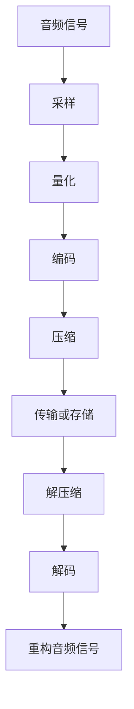

                 

关键词：音频编解码、MP3、Opus、音频压缩、音频格式、音频质量、编解码算法、音频处理

> 摘要：本文将深入探讨音频编解码技术，从早期的MP3格式到现代的Opus格式，解析各自的原理、优缺点和应用领域。文章还将讨论数学模型和公式，以及如何在实际项目中实现这些算法，并提供相关的工具和资源推荐。

## 1. 背景介绍

随着互联网和移动设备的普及，音频内容消费达到了前所未有的水平。为了满足用户对高质量音频的需求，同时也为了减轻网络带宽的压力，音频编解码技术得到了迅速发展。音频编解码技术旨在通过压缩音频数据，在不显著损失音频质量的前提下，降低数据的存储和传输成本。

早期的音频编解码技术，如MP3，曾在互联网普及的早期阶段发挥了重要作用。然而，随着人们对音频质量的追求和对传输带宽的高要求，新的编解码技术，如Opus，逐渐崭露头角。本文将详细探讨这两种技术的原理、优缺点和应用，并展望音频编解码技术的未来发展趋势。

## 2. 核心概念与联系

在讨论音频编解码技术之前，我们需要了解一些核心概念和它们之间的联系。

### 2.1 音频采样和量化

音频采样是音频编解码的基础。音频采样是指每隔固定时间间隔，将模拟音频信号转换成数字信号。量化是指将采样得到的无限精度数字信号转换为有限精度的数字表示。

### 2.2 音频压缩

音频压缩技术旨在减少音频数据的大小，同时尽量保持原始音频的质量。压缩技术可以分为两类：有损压缩和无损压缩。有损压缩会牺牲一些音频质量以换取更高的压缩率，而无损压缩则完全保留音频的所有细节。

### 2.3 编码与解码

编码是指将音频信号转换为压缩格式的过程，解码则是相反的过程，即从压缩格式还原音频信号。

下面是一个使用Mermaid绘制的音频编解码流程图：

## 3. 核心算法原理 & 具体操作步骤

### 3.1 算法原理概述

音频编解码技术主要依赖于以下几种算法原理：

- **采样和量化**：将模拟信号转换为数字信号。
- **变换编码**：将时域信号转换为频域信号，以减少冗余信息。
- **量化**：将连续的频域信号转换为离散的数字表示。
- **熵编码**：使用如Huffman编码等算法压缩数据。

### 3.2 算法步骤详解

#### MP3编解码步骤

1. **音频采样和量化**：将音频信号转换为数字信号。
2. **变换编码**：使用MPEG-1 Layer III编码器将时域信号转换为频域信号。
3. **量化**：对频域信号进行量化处理。
4. **熵编码**：使用Huffman编码对量化后的信号进行压缩。
5. **同步头和帧头添加**：在压缩数据中添加同步头和帧头，以便解码时正确读取数据。
6. **数据流传输或存储**：将压缩后的数据流传输或存储。
7. **解压缩**：在解码过程中，首先去除同步头和帧头，然后进行解压缩。
8. **反量化**：将压缩后的数字信号反量化为频域信号。
9. **反变换编码**：将频域信号反变换回时域信号。
10. **重构音频信号**：将数字信号重构为模拟信号。

#### Opus编解码步骤

1. **音频采样和量化**：与MP3类似，首先将音频信号转换为数字信号。
2. **音频处理**：根据音频内容的复杂度和带宽要求，Opus会动态选择不同的编码工具，如子带处理、噪声抑制等。
3. **变换编码**：使用MDCT（Modified Discrete Cosine Transform）将时域信号转换为频域信号。
4. **量化**：对频域信号进行量化处理。
5. **熵编码**：使用高效的前缀编码，如Hu

