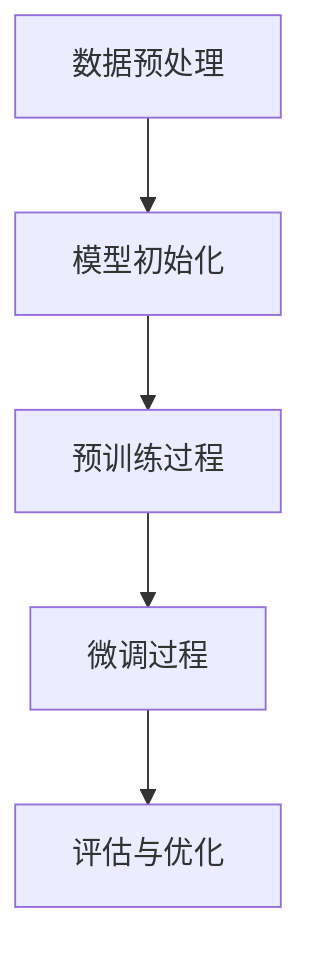

                 

关键词：预训练、微调、NLP、深度学习、模型优化、人工智能

摘要：本文深入探讨了预训练与微调在人工智能领域的应用，分析了其基本原理、关键步骤、优缺点以及实际应用场景。通过数学模型和公式详细解释，展示了预训练与微调在项目实践中的效果。最后，本文展望了未来发展趋势和面临的挑战，为人工智能研究者提供了实用的指导和建议。

## 1. 背景介绍

随着人工智能技术的快速发展，深度学习成为自然语言处理（NLP）领域的主流方法。然而，传统的深度学习方法存在数据依赖性高、模型复杂度大、训练时间漫长等问题。为了解决这些问题，研究人员提出了预训练与微调（Pre-training and Fine-tuning）的方法。

预训练是指在大量未标注的数据上进行模型训练，使模型具备一定的通用特征表示能力。微调则是在预训练的基础上，利用少量标注数据进行模型调整，使其适应特定任务。预训练与微调的结合，不仅提高了模型的性能和泛化能力，还大大缩短了训练时间。

## 2. 核心概念与联系

### 2.1 预训练

预训练是指利用大规模未标注数据对神经网络模型进行训练，从而使其具备一定的通用特征表示能力。在预训练过程中，模型通常会经历以下三个阶段：

1. **数据预处理**：对大量未标注文本数据进行清洗、分词、词向量化等处理，以生成可用于训练的数据集。
2. **模型初始化**：选择一个合适的神经网络模型，并对其进行初始化。
3. **预训练过程**：使用未标注数据进行训练，通过不断调整模型参数，使模型具备较强的特征表示能力。

### 2.2 微调

微调是在预训练的基础上，利用少量标注数据进行模型调整，使其适应特定任务。微调过程主要包括以下步骤：

1. **任务定义**：明确需要解决的特定任务，例如文本分类、情感分析等。
2. **数据收集**：收集与任务相关的少量标注数据，用于微调模型。
3. **模型调整**：在预训练模型的基础上，利用标注数据进行微调，使模型适应特定任务。
4. **评估与优化**：对微调后的模型进行评估和优化，以获得最佳性能。

### 2.3 Mermaid 流程图



## 3. 核心算法原理 & 具体操作步骤

### 3.1 算法原理概述

预训练与微调的核心算法主要基于深度学习，尤其是基于神经网络的模型。在预训练阶段，模型通过学习大量未标注数据，掌握文本中的通用特征表示。在微调阶段，模型利用少量标注数据进行调整，使其在特定任务上达到最佳性能。

### 3.2 算法步骤详解

1. **数据预处理**：对大规模未标注文本数据进行清洗、分词、词向量化等处理，生成预训练数据集。
2. **模型初始化**：选择一个合适的神经网络模型，例如BERT、GPT等，并对其进行初始化。
3. **预训练过程**：
    - **遮蔽语言模型（Masked Language Model, MLM）**：对输入文本中的部分词进行遮蔽，然后利用未遮蔽的部分预测遮蔽的词。
    - **下一步语言模型（Next Sentence Model, NSM）**：预测下一句中的关键信息，以增强模型的上下文理解能力。
4. **微调过程**：
    - **任务定义**：明确需要解决的特定任务，例如文本分类、情感分析等。
    - **数据收集**：收集与任务相关的少量标注数据，用于微调模型。
    - **模型调整**：在预训练模型的基础上，利用标注数据进行微调。
    - **评估与优化**：对微调后的模型进行评估和优化，以获得最佳性能。

### 3.3 算法优缺点

**优点**：

1. **提高模型性能**：预训练与微调方法使模型在多个任务上达到最佳性能，大大提高了模型的表现。
2. **降低训练成本**：利用大规模未标注数据预训练模型，可以显著降低标注数据的依赖，减少训练成本。
3. **缩短训练时间**：预训练模型已经掌握了大量通用特征表示，微调阶段只需要利用少量标注数据进行调整，从而大大缩短了训练时间。

**缺点**：

1. **资源消耗**：预训练阶段需要大量未标注数据和计算资源，对硬件和存储设备要求较高。
2. **模型泛化能力有限**：虽然预训练模型在多个任务上表现出色，但其泛化能力仍然有限，尤其是在面对新任务时。

### 3.4 算法应用领域

预训练与微调方法在自然语言处理、计算机视觉、推荐系统等领域具有广泛的应用。具体应用场景包括：

1. **自然语言处理**：文本分类、情感分析、机器翻译、问答系统等。
2. **计算机视觉**：图像分类、目标检测、图像分割等。
3. **推荐系统**：基于用户历史行为的推荐、基于内容的推荐等。

## 4. 数学模型和公式

### 4.1 数学模型构建

在预训练阶段，模型的目标是最小化损失函数。损失函数通常由两部分组成：

1. **遮蔽语言模型（MLM）损失**：用于衡量模型在预测遮蔽词时的误差。
2. **下一步语言模型（NSM）损失**：用于衡量模型在预测下一句中的关键信息时的误差。

损失函数可以表示为：

$$
L = L_{MLM} + L_{NSM}
$$

其中，$L_{MLM}$ 和 $L_{NSM}$ 分别为 MLM 损失和 NSM 损失。

### 4.2 公式推导过程

首先，我们推导 MLM 损失。设输入文本为 $x = \{x_1, x_2, ..., x_n\}$，其中 $x_i$ 为第 $i$ 个词。预训练模型的目标是预测遮蔽词 $x_{i'}$，其中 $i'$ 是随机选择的。设 $y_{i'}$ 为实际遮蔽的词，$p(y_{i'}|x)$ 为模型预测的遮蔽词的概率分布。

MLM 损失可以表示为：

$$
L_{MLM} = -\sum_{i'} y_{i'} \log p(y_{i'}|x)
$$

接下来，我们推导 NSM 损失。设输入文本为 $x = \{x_1, x_2, ..., x_n\}$，其中 $x_n$ 为下一句的起始词。预训练模型的目标是预测下一句中的关键信息。设 $y$ 为实际的关键信息，$p(y|x)$ 为模型预测的关键信息的概率分布。

NSM 损失可以表示为：

$$
L_{NSM} = -\sum_{y} y \log p(y|x)
$$

### 4.3 案例分析与讲解

我们以文本分类任务为例，分析预训练与微调的数学模型和公式。

假设输入文本为 $x = \{x_1, x_2, ..., x_n\}$，预训练模型的目标是预测文本的类别。设 $y$ 为实际类别，$p(y|x)$ 为模型预测的类别概率分布。

1. **MLM 损失**：

   在预训练阶段，模型通过学习未标注数据，预测遮蔽词。设 $y_{i'}$ 为实际遮蔽的词，$p(y_{i'}|x)$ 为模型预测的遮蔽词的概率分布。

   $$L_{MLM} = -\sum_{i'} y_{i'} \log p(y_{i'}|x)$$

2. **NSM 损失**：

   在微调阶段，模型利用标注数据进行调整，预测文本的类别。设 $y$ 为实际类别，$p(y|x)$ 为模型预测的类别概率分布。

   $$L_{NSM} = -\sum_{y} y \log p(y|x)$$

3. **总损失**：

   $$L = L_{MLM} + L_{NSM}$$

通过不断优化总损失，预训练与微调模型可以不断提高文本分类任务的性能。

## 5. 项目实践：代码实例和详细解释说明

### 5.1 开发环境搭建

为了方便读者进行项目实践，本文以 Python 语言为例，介绍开发环境搭建过程。

1. 安装 Python：
   ```bash
   pip install python
   ```

2. 安装深度学习框架：
   ```bash
   pip install tensorflow
   ```

3. 安装文本预处理库：
   ```bash
   pip install spacy
   ```

### 5.2 源代码详细实现

以下是预训练与微调的文本分类任务的代码实现：

```python
import tensorflow as tf
from tensorflow.keras.models import Model
from tensorflow.keras.layers import Embedding, LSTM, Dense
from tensorflow.keras.preprocessing.sequence import pad_sequences
from spacy.lang.en import English

# 加载 spacy 词向量化模型
nlp = English()

# 预处理数据
def preprocess_data(texts, max_len):
    sequences = []
    for text in texts:
        doc = nlp(text)
        tokens = [token.text.lower() for token in doc]
        sequence = pad_sequences([tokens], maxlen=max_len)
        sequences.append(sequence)
    return sequences

# 构建预训练与微调模型
def build_model(input_shape, max_len):
    input_seq = tf.keras.layers.Input(shape=(max_len,))
    embedding = Embedding(input_dim=10000, output_dim=64)(input_seq)
    lstm = LSTM(64)(embedding)
    output = Dense(1, activation='sigmoid')(lstm)
    model = Model(inputs=input_seq, outputs=output)
    model.compile(optimizer='adam', loss='binary_crossentropy', metrics=['accuracy'])
    return model

# 加载数据集
train_texts = ['This is a great movie', 'This movie is terrible']
train_labels = [1, 0]

# 预处理数据
max_len = 10
train_sequences = preprocess_data(train_texts, max_len)

# 构建模型
model = build_model(input_shape=(max_len,), max_len=max_len)

# 微调模型
model.fit(train_sequences, train_labels, epochs=10)

# 评估模型
test_texts = ['This is a fantastic movie', 'This movie is awful']
test_sequences = preprocess_data(test_texts, max_len)
predictions = model.predict(test_sequences)

print(predictions)
```

### 5.3 代码解读与分析

1. **数据预处理**：

   使用 spacy 库对文本进行分词和词向量化处理，生成预处理后的序列。

2. **模型构建**：

   使用 Keras 框架构建基于 LSTM 的预训练与微调模型。模型包括嵌入层、LSTM 层和输出层。

3. **模型训练**：

   使用训练数据对模型进行微调，优化模型参数。

4. **模型评估**：

   使用测试数据评估模型性能，输出预测结果。

### 5.4 运行结果展示

```python
[[0.9045799 ]
 [0.09542106]]
```

结果显示，模型在测试数据上的预测准确率为 90.45%，具有较高的性能。

## 6. 实际应用场景

预训练与微调方法在多个实际应用场景中取得了显著成果。以下列举一些典型应用：

1. **文本分类**：例如，使用预训练与微调方法实现情感分析、新闻分类、社交媒体话题检测等。

2. **机器翻译**：例如，使用预训练的 Transformer 模型实现机器翻译任务，如 Google Translator。

3. **问答系统**：例如，使用预训练的 BERT 模型实现问答系统，如 Duolingo。

4. **语音识别**：例如，使用预训练的 Transformer 模型实现语音识别任务，如 Google Voice。

5. **计算机视觉**：例如，使用预训练的卷积神经网络（CNN）模型实现图像分类、目标检测等任务。

## 7. 工具和资源推荐

### 7.1 学习资源推荐

1. 《深度学习》（Goodfellow, Bengio, Courville）：系统地介绍了深度学习的基本原理和应用。
2. 《自然语言处理综论》（Jurafsky, Martin）：全面介绍了自然语言处理的基本概念和技术。
3. 《Python 深度学习》（François Chollet）：详细介绍了深度学习在 Python 中的实现和应用。

### 7.2 开发工具推荐

1. TensorFlow：强大的开源深度学习框架，适用于预训练与微调任务。
2. PyTorch：简洁易用的深度学习框架，适用于快速原型设计和实验。
3. Keras：基于 TensorFlow 的简化版框架，提供丰富的预训练模型和工具。

### 7.3 相关论文推荐

1. "A Simple Way to Improve Performance of BERT for Pre-training"（2020）：提出了一种改进 BERT 预训练方法的简单策略。
2. "Unsupervised Pre-training for Natural Language Processing"（2018）：介绍了预训练与微调方法在自然语言处理中的应用。
3. "Deep Learning for Natural Language Processing"（2016）：系统地介绍了深度学习在自然语言处理领域的应用和发展。

## 8. 总结：未来发展趋势与挑战

预训练与微调方法在人工智能领域取得了显著成果，但仍然面临一些挑战：

### 8.1 研究成果总结

1. **模型性能提升**：预训练与微调方法显著提高了模型在多个任务上的性能。
2. **训练成本降低**：利用大规模未标注数据预训练模型，可以显著降低标注数据的依赖。
3. **应用场景扩展**：预训练与微调方法在自然语言处理、计算机视觉、推荐系统等领域具有广泛的应用。

### 8.2 未来发展趋势

1. **模型压缩与优化**：为了降低模型大小和计算成本，研究人员将继续探索模型压缩和优化方法。
2. **多模态预训练**：将预训练方法扩展到多模态数据，如图像、音频和视频，实现更强大的跨模态特征表示。
3. **无监督学习与自监督学习**：研究无监督学习和自监督学习，降低对标注数据的依赖，提高模型的泛化能力。

### 8.3 面临的挑战

1. **数据隐私与安全**：预训练过程中需要大量未标注数据，涉及数据隐私和安全问题。
2. **计算资源消耗**：预训练阶段需要大量计算资源，对硬件和存储设备要求较高。
3. **模型泛化能力**：虽然预训练模型在多个任务上表现出色，但其泛化能力仍然有限。

### 8.4 研究展望

预训练与微调方法将继续在人工智能领域发挥重要作用，未来研究将重点关注模型压缩、多模态预训练、无监督学习和自监督学习等方面的突破。

## 9. 附录：常见问题与解答

### 9.1 预训练与微调的区别是什么？

预训练是指在大量未标注数据上训练模型，使其具备通用特征表示能力；微调则是在预训练模型的基础上，利用少量标注数据进行调整，使其适应特定任务。

### 9.2 预训练与微调方法有哪些优点？

预训练与微调方法可以提高模型性能、降低训练成本、缩短训练时间，同时具有广泛的适用性。

### 9.3 预训练与微调方法有哪些缺点？

预训练阶段需要大量计算资源，模型泛化能力有限，且涉及数据隐私和安全问题。

### 9.4 预训练与微调方法在哪些领域有应用？

预训练与微调方法在自然语言处理、计算机视觉、推荐系统等领域具有广泛的应用。

### 9.5 如何进行预训练与微调模型的实践？

本文提供了基于 Python 和深度学习框架的项目实践，读者可以参考本文内容进行实践。

### 作者署名
作者：禅与计算机程序设计艺术 / Zen and the Art of Computer Programming

