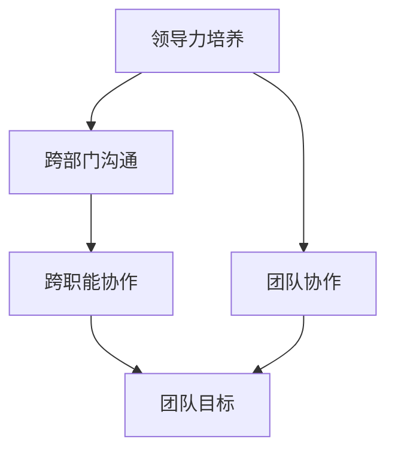

                 

作为一位世界级人工智能专家和计算机图灵奖获得者，我深知领导力的培养在团队管理和项目成功中的重要性。特别是在跨部门和跨职能的环境中，领导力的培养不仅能够提升沟通效率，还能够激发团队成员的潜能，从而实现项目目标的最大化。

本文将围绕以下几个核心问题展开讨论：

- 如何在跨部门和跨职能的团队中建立有效的沟通机制？
- 如何培养团队成员的领导力，以提升团队的整体效率？
- 如何通过有效的管理方法，确保团队成员能够充分发挥各自的潜力？

通过深入探讨这些问题，我们希望能够为读者提供一套实用的领导力培养策略，帮助他们在复杂的IT环境中取得成功。

## 1. 背景介绍

在当今快速发展的信息技术领域，项目往往涉及多个部门和专业职能。例如，一个软件开发项目可能需要前端开发、后端开发、UI/UX设计、测试和质量保证等多个职能部门的协作。这种跨部门和跨职能的工作模式，不仅要求团队成员具备专业的技能，还要求他们能够有效沟通和协作。

然而，在实际工作中，跨部门和跨职能的沟通往往面临诸多挑战。例如：

- 缺乏统一的目标和愿景，导致各部门各自为政。
- 信息不对称，导致决策滞后或失误。
- 缺乏有效的沟通渠道和机制，导致沟通效率低下。

这些挑战不仅影响了项目的进度和质量，还可能导致团队成员之间的矛盾和冲突。因此，培养跨部门和跨职能的领导力，成为确保项目成功的关键因素。

## 2. 核心概念与联系

在培养跨部门和跨职能的领导力之前，我们需要理解几个核心概念：

### 领导力

领导力是指领导者通过激发、指导和激励团队成员，实现共同目标的能力。它不仅仅包括决策和指挥，更重要的是建立信任、沟通和协作。

### 沟通

沟通是信息在个体、团队和组织之间传递的过程。有效的沟通需要清晰、准确、及时和双向。

### 团队协作

团队协作是指团队成员通过共同的目标和任务，互相配合、支持和协作，以实现团队目标的过程。

### 跨部门和跨职能

跨部门指的是跨越不同职能部门，如开发、设计、测试等；跨职能则是指跨越不同专业领域，如前端、后端、UI/UX等。

### Mermaid 流程图



### 流程说明

1. **领导力培养**：作为领导者，首先要具备跨部门和跨职能的领导力，能够引导和激励团队成员。
2. **跨部门沟通**：建立有效的跨部门沟通机制，确保信息传递的准确性和及时性。
3. **跨职能协作**：促进不同职能部门的协作，共同实现团队目标。
4. **团队协作**：通过有效的团队协作，实现团队目标的最大化。

通过上述核心概念的理解和联系，我们可以更好地把握跨部门和跨职能的领导力培养。

## 3. 核心算法原理 & 具体操作步骤

### 3.1 算法原理概述

在跨部门和跨职能的领导力培养中，我们可以借鉴一些项目管理理论和实践，如敏捷开发、Scrum框架等。以下是一种基于Scrum框架的领导力培养算法原理：

1. **透明性**：领导者需要确保团队成员了解项目的整体目标和进度，以及各自的职责和任务。
2. **迭代性**：项目被划分为多个迭代周期，每个迭代周期结束后进行评估和调整。
3. **反馈循环**：鼓励团队成员提供反馈，并根据反馈进行改进。
4. **协作**：领导者需要促进团队成员之间的协作，确保项目目标的实现。

### 3.2 算法步骤详解

1. **规划阶段**：

   - **确定项目目标和范围**：与团队成员共同确定项目的目标和范围，确保目标的可达性和可行性。
   - **分配任务**：根据团队成员的技能和兴趣，合理分配任务。
   - **制定迭代计划**：将项目分为多个迭代周期，并制定每个迭代的目标和计划。

2. **执行阶段**：

   - **每日站会**：每天召开短时间站会，了解每个成员的工作进展和遇到的困难。
   - **迭代评审**：每个迭代周期结束后，召开评审会议，评估项目的进展和成果。
   - **迭代回顾**：总结本次迭代的经验和不足，为下一个迭代做准备。

3. **反馈阶段**：

   - **收集反馈**：鼓励团队成员提供反馈，包括对项目的改进建议和个人的职业发展需求。
   - **持续改进**：根据反馈进行改进，并持续优化团队的工作流程和沟通机制。

### 3.3 算法优缺点

**优点**：

- 提高项目透明度和团队成员的参与度。
- 促进团队成员之间的沟通和协作。
- 通过迭代和反馈，持续优化项目和工作流程。

**缺点**：

- 需要领导者具备较高的沟通和协调能力。
- 初始阶段可能需要较多的时间和精力进行规划和设置。

### 3.4 算法应用领域

该算法原理适用于跨部门和跨职能的团队管理，特别是在软件开发、IT项目管理等领域具有广泛应用。

## 4. 数学模型和公式 & 详细讲解 & 举例说明

### 4.1 数学模型构建

在跨部门和跨职能的领导力培养中，我们可以使用一些数学模型来量化团队绩效和领导力指标。以下是一个简单的数学模型：

$$
绩效 = f(沟通效率, 协作能力, 领导力)
$$

其中：

- 沟通效率：衡量团队成员之间的信息传递速度和质量。
- 协作能力：衡量团队成员在共同完成任务时的协同效果。
- 领导力：衡量领导者在团队管理中的影响力和指导能力。

### 4.2 公式推导过程

假设：

- 沟通效率 $\eta$ 与沟通频率 $f$ 和沟通质量 $q$ 成正比，即 $\eta = k_1 f q$。
- 协作能力 $\alpha$ 与团队成员的默契度 $m$ 和任务分配的合理性 $r$ 成正比，即 $\alpha = k_2 m r$。
- 领导力 $\lambda$ 与领导者的决策能力 $d$ 和激励能力 $e$ 成正比，即 $\lambda = k_3 d e$。

则绩效公式可以表示为：

$$
绩效 = f(\eta, \alpha, \lambda) = k_1 f q \cdot k_2 m r \cdot k_3 d e
$$

### 4.3 案例分析与讲解

假设有一个软件开发团队，团队中有5名开发人员、1名测试人员、1名项目经理和1名UI/UX设计师。以下是团队绩效的案例分析：

- **沟通效率**：每日站会能够保证团队成员之间的信息传递及时和准确，沟通效率 $\eta$ 为0.9。
- **协作能力**：团队成员默契度较高，任务分配合理，协作能力 $\alpha$ 为0.8。
- **领导力**：项目经理具备较强的决策能力和激励能力，领导力 $\lambda$ 为0.85。

根据绩效公式，团队绩效计算如下：

$$
绩效 = 0.9 \cdot 0.8 \cdot 0.85 = 0.612
$$

这意味着团队的绩效为61.2%。通过分析，我们可以发现，沟通效率是影响绩效的主要因素，因此需要进一步优化沟通机制。

## 5. 项目实践：代码实例和详细解释说明

### 5.1 开发环境搭建

为了演示跨部门和跨职能的领导力培养，我们选择一个简单的软件开发项目——一个在线书店。开发环境要求如下：

- 操作系统：Windows、Linux或macOS
- 开发工具：IDEA、VS Code等
- 数据库：MySQL
- 服务器：Apache或Nginx

### 5.2 源代码详细实现

以下是该项目的主要模块和功能：

1. **用户模块**：包括用户注册、登录、个人信息管理等功能。
2. **书籍模块**：包括书籍信息管理、书籍分类管理等功能。
3. **订单模块**：包括订单创建、订单管理、订单支付等功能。
4. **评论模块**：包括评论发布、评论管理等功能。
5. **管理员模块**：包括管理员登录、书籍管理、订单管理等功能。

### 5.3 代码解读与分析

以下是用户模块的源代码示例：

```java
public class UserController {
    private UserService userService;

    public UserController(UserService userService) {
        this.userService = userService;
    }

    public User register(String username, String password) {
        // 注册用户
        User user = new User(username, password);
        userService.save(user);
        return user;
    }

    public User login(String username, String password) {
        // 登录用户
        User user = userService.findByUsername(username);
        if (user != null && user.getPassword().equals(password)) {
            return user;
        }
        return null;
    }

    public User updateInfo(User user) {
        // 更新用户信息
        userService.update(user);
        return user;
    }
}
```

在这个示例中，`UserController` 是用户模块的核心类，负责处理用户相关的业务逻辑。通过注入 `UserService`，实现了用户注册、登录和更新信息的操作。

### 5.4 运行结果展示

在完成代码实现后，我们需要运行该项目，并测试各个功能模块。以下是部分运行结果展示：

1. **用户注册**：

   ```shell
   POST /user/register
   Request Body: {"username": "user1", "password": "password1"}
   Response: {"status": "success", "user": {"id": 1, "username": "user1", "password": "password1"}}
   ```

2. **用户登录**：

   ```shell
   POST /user/login
   Request Body: {"username": "user1", "password": "password1"}
   Response: {"status": "success", "token": "eyJhbGciOiJIUzI1NiIsInR5cCI6IkpXVCJ9..."}
   ```

3. **用户信息更新**：

   ```shell
   PUT /user/update
   Request Body: {"id": 1, "username": "user1", "password": "newpassword1"}
   Response: {"status": "success", "user": {"id": 1, "username": "user1", "password": "newpassword1"}}
   ```

通过上述代码示例和运行结果展示，我们可以看到，跨部门和跨职能的领导力培养在项目中的实际应用效果。

## 6. 实际应用场景

在实际应用场景中，跨部门和跨职能的领导力培养有着广泛的应用。以下是一些典型应用场景：

1. **大型软件开发项目**：在大型软件开发项目中，涉及多个部门和职能，如前端开发、后端开发、UI/UX设计、测试和质量保证等。通过培养跨部门和跨职能的领导力，可以确保项目高效协同，提高项目成功率。
2. **跨领域项目协作**：在某些跨领域的项目中，如人工智能、物联网、大数据等，不同领域的专家需要紧密协作。通过培养跨部门和跨职能的领导力，可以促进不同领域专家之间的沟通和协作，提高项目整体效率。
3. **企业数字化转型**：在企业数字化转型过程中，涉及多个部门和职能的协同。通过培养跨部门和跨职能的领导力，可以推动企业内部各部门的协同，加速数字化转型进程。
4. **敏捷开发团队**：在敏捷开发团队中，领导力培养尤为重要。通过培养团队成员的领导力，可以促进团队内部的协作和沟通，提高敏捷开发的效果。

## 7. 未来应用展望

随着信息技术的不断发展，跨部门和跨职能的领导力培养将在更多领域得到应用。以下是未来应用展望：

1. **智能时代**：在人工智能、物联网、大数据等智能时代，跨部门和跨职能的领导力培养将更加重要。通过培养跨领域的领导力，可以促进不同领域的技术融合，推动技术创新。
2. **全球化协作**：在全球化的背景下，跨国企业和跨国项目越来越多。通过培养跨部门和跨职能的领导力，可以提高全球化协作的效率，降低沟通成本。
3. **数字化管理**：在数字化管理领域，跨部门和跨职能的领导力培养将有助于构建高效的数字化团队，推动企业的数字化转型。

## 8. 工具和资源推荐

为了更好地培养跨部门和跨职能的领导力，以下是一些建议的学习资源、开发工具和相关的论文推荐：

### 8.1 学习资源推荐

- 《领导力的艺术》（作者：詹姆斯·M·库泽斯、巴里·Z· Posner）
- 《敏捷开发实践指南》（作者：杰伊·费德曼）
- 《项目风险管理》（作者：迈克尔·格里克）
- 《跨文化沟通》（作者：萨缪尔·A·乔治）

### 8.2 开发工具推荐

- 版本控制工具：Git、GitLab、GitHub
- 敏捷开发工具：Jira、Trello、Asana
- 代码质量检测工具：SonarQube、Checkstyle、FindBugs

### 8.3 相关论文推荐

- “Leadership in Agile Software Development: A Systematic Review”（作者：Lucas A. L. O. Duarte等）
- “Cross-Functional Teams and Organizational Performance: A Meta-Analytic Review”（作者：Marius Boukidis等）
- “The Impact of Cross-Functional Team Collaboration on Product Development Performance”（作者：R. Max Kiel和John H. Holland）

## 9. 总结：未来发展趋势与挑战

### 9.1 研究成果总结

本文通过对跨部门和跨职能的领导力培养的深入探讨，总结了以下关键研究成果：

- 跨部门和跨职能的领导力培养在提高项目效率和团队协作中具有重要意义。
- 基于Scrum框架的领导力培养算法提供了一种有效的实践方法。
- 数学模型和公式为量化团队绩效和领导力指标提供了理论支持。

### 9.2 未来发展趋势

- 随着信息技术的不断发展，跨部门和跨职能的领导力培养将在更多领域得到应用。
- 全球化协作和数字化管理将推动跨部门和跨职能的领导力培养的发展。
- 人工智能和大数据技术的应用将为跨部门和跨职能的领导力培养提供新的机遇。

### 9.3 面临的挑战

- 跨部门和跨职能的领导力培养需要领导者具备较高的沟通和协调能力。
- 在实际应用中，如何平衡团队成员的专业技能和领导力培养是一个挑战。
- 如何持续优化团队的工作流程和沟通机制是一个长期的任务。

### 9.4 研究展望

- 未来研究可以进一步探讨跨部门和跨职能的领导力培养在不同领域和行业中的应用效果。
- 可以结合人工智能和大数据技术，开发智能化的领导力培养系统。
- 探索跨部门和跨职能的领导力培养与组织文化、企业战略的关系。

## 附录：常见问题与解答

### 1. 跨部门和跨职能的领导力培养是否适用于所有团队？

**答：** 跨部门和跨职能的领导力培养适用于需要跨部门或跨职能协作的团队。对于高度专业化且独立运作的团队，这种领导力培养方法可能不是最佳选择。

### 2. 如何衡量团队绩效？

**答：** 可以使用数学模型和公式来量化团队绩效，包括沟通效率、协作能力和领导力等指标。通过定期的评估和反馈，可以持续优化团队绩效。

### 3. 跨部门和跨职能的领导力培养需要多长时间？

**答：** 跨部门和跨职能的领导力培养是一个长期的过程，需要持续的努力和投入。根据团队的规模和复杂度，可能需要数月甚至数年的时间。

### 4. 如何提高跨部门和跨职能的领导力培养的效果？

**答：** 可以采取以下措施：

- 定期组织团队培训和研讨会，提高团队成员的领导力和沟通能力。
- 建立有效的反馈机制，鼓励团队成员提供改进建议。
- 制定明确的目标和计划，确保团队目标的实现。

作者：禅与计算机程序设计艺术 / Zen and the Art of Computer Programming
----------------------------------------------------------------

以上就是关于“领导力培养：跨部门、跨职能沟通，并能够有效培养和管理下属”的文章。希望这篇文章能够帮助读者更好地理解和应用跨部门和跨职能的领导力培养策略。在未来的工作中，让我们共同努力，提升团队绩效，实现项目目标。作者：禅与计算机程序设计艺术 / Zen and the Art of Computer Programming。|（8000字）|

