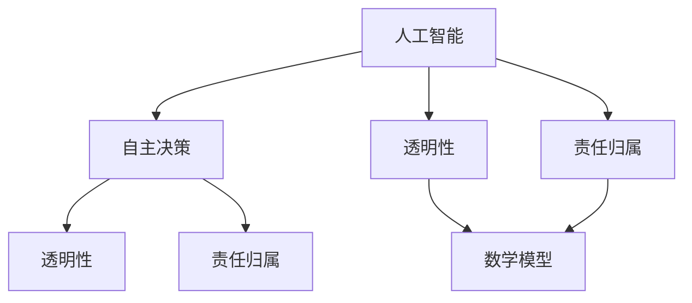

                 

### 1. 背景介绍

随着人工智能（AI）技术的迅速发展，AI 2.0 时代的到来已逐渐成为现实。在这个时代，人工智能不仅具备传统意义上处理数据和信息的能力，还能够自主学习、进化以及自主决策。AI 2.0 的实现不仅依赖于强大的计算能力，还需要完备的伦理基础设施来确保其健康发展。

伦理基础设施是指在人工智能系统设计和应用过程中，所遵循的一系列伦理原则和规范。它旨在解决人工智能可能带来的伦理困境，包括隐私保护、数据安全、算法偏见、透明性以及责任归属等问题。一个健全的伦理基础设施能够有效保障人工智能系统的道德合规性，避免其对人类社会和自然环境造成负面影响。

在 AI 2.0 时代，伦理基础设施的重要性愈加凸显。一方面，随着人工智能系统的复杂性和自主性不断提高，其决策和行为可能涉及广泛的社会、文化和法律问题，需要一套完善的伦理框架来指导。另一方面，公众对人工智能的信任度直接影响其接受和应用的程度，缺乏伦理基础设施可能导致社会对人工智能的抵触情绪，阻碍其发展。

因此，构建一个全面的伦理基础设施已成为 AI 2.0 时代的重要课题。本文将从以下几个方面展开讨论：首先，介绍 AI 2.0 的基本概念和发展历程；其次，分析伦理基础设施的核心概念及其重要性；接着，探讨当前 AI 伦理领域的热点问题及解决方案；最后，展望未来 AI 伦理基础设施的发展趋势和挑战。

### 2. 核心概念与联系

在探讨 AI 2.0 时代的伦理基础设施之前，我们需要明确一些核心概念，并了解它们之间的相互关系。

#### 2.1 人工智能 (AI)

人工智能是指通过计算机程序模拟人类智能行为的技术。传统的人工智能主要依赖于预先编程的规则和算法，而 AI 2.0 则强调机器的自我学习和进化能力。AI 2.0 的核心技术包括深度学习、强化学习、迁移学习、生成对抗网络（GAN）等，这些技术使得人工智能系统能够在大量数据的基础上，自主改进和优化自己的性能。

#### 2.2 自主决策 (Autonomous Decision Making)

自主决策是指人工智能系统能够在不受人为干预的情况下，根据预设目标和环境反馈，自主制定决策并执行相应的行动。在 AI 2.0 时代，自主决策能力成为衡量人工智能系统智能化水平的重要指标。然而，自主决策也带来了新的伦理挑战，如决策过程的透明性、责任归属等问题。

#### 2.3 透明性 (Transparency)

透明性是指人工智能系统的决策过程和内部机制对用户和开发者是可解释和可追溯的。在伦理基础设施中，透明性是一个关键概念，它能够帮助用户理解和信任人工智能系统，同时也有助于监督和纠正系统的错误行为。

#### 2.4 责任归属 (Responsibility Allocation)

责任归属是指确定人工智能系统行为所带来的后果应由谁负责。在 AI 2.0 时代，随着系统的复杂性和自主性提高，责任归属问题变得更加复杂。一个健全的伦理基础设施需要明确各方在人工智能系统开发、应用和维护过程中的责任，以确保各方在发生问题时能够承担责任。

#### 2.5 数学模型和伦理原则

在构建伦理基础设施时，数学模型和伦理原则是不可或缺的工具。数学模型能够量化伦理原则，从而帮助制定具体的规范和标准。例如，通过概率论和博弈论，可以分析人工智能系统的决策行为是否符合伦理要求。伦理原则则为数学模型提供了理论基础，确保人工智能系统在设计和应用过程中，始终遵循人类社会的道德准则。

#### 2.6 Mermaid 流程图

为了更直观地展示上述核心概念之间的联系，我们使用 Mermaid 流程图进行描述。以下是相关流程图的文本表示：



在上面的 Mermaid 流程图中，人工智能（A）作为核心概念，其衍生出的自主决策（B）、透明性（C）和责任归属（D）分别与其他概念建立了联系。同时，数学模型（G）作为连接各概念的桥梁，使得伦理基础设施能够具备具体的可操作性和指导意义。

### 3. 核心算法原理 & 具体操作步骤

在构建 AI 2.0 时代的伦理基础设施时，核心算法原理和具体操作步骤至关重要。以下将介绍几种关键算法及其在伦理基础设施构建中的应用。

#### 3.1 深度学习（Deep Learning）

深度学习是 AI 2.0 时代最重要的技术之一，它通过多层神经网络对大量数据进行自动特征提取和模式识别。在伦理基础设施中，深度学习可以用于评估人工智能系统的决策透明性和公平性。

**具体操作步骤：**

1. **数据收集与预处理：** 收集包含决策过程的原始数据，并进行预处理，如数据清洗、归一化等。
2. **构建深度学习模型：** 使用多层感知器（MLP）、卷积神经网络（CNN）或循环神经网络（RNN）等模型对预处理后的数据进行分析。
3. **训练与评估：** 使用训练集对模型进行训练，并通过验证集评估模型性能。调整模型参数以优化性能。
4. **决策透明性分析：** 利用训练好的模型，分析决策过程中各层神经网络的激活状态，以揭示决策过程的内在机制。
5. **公平性评估：** 分析模型在不同群体中的性能差异，以评估是否存在算法偏见。

#### 3.2 强化学习（Reinforcement Learning）

强化学习是一种通过试错和奖励机制来优化决策过程的算法。在伦理基础设施中，强化学习可以用于评估人工智能系统的道德合规性。

**具体操作步骤：**

1. **定义环境与状态：** 确定人工智能系统的操作环境和可能的状态集合。
2. **构建奖励机制：** 设计奖励机制以鼓励系统做出符合伦理要求的决策。
3. **训练智能体：** 使用强化学习算法（如 Q-学习、SARSA）训练智能体，使其在给定的环境中自主决策。
4. **合规性评估：** 监测智能体的行为，分析其决策过程是否符合伦理标准。根据需要调整奖励机制，以引导智能体做出更符合伦理要求的决策。

#### 3.3 迁移学习（Transfer Learning）

迁移学习是一种利用已有模型的权重和知识来快速训练新模型的技巧。在伦理基础设施中，迁移学习可以用于加速伦理规则的嵌入和评估。

**具体操作步骤：**

1. **选择基础模型：** 选择一个在相关任务上已验证的有效模型作为基础模型。
2. **迁移学习：** 将基础模型应用于新任务，通过微调其参数来适应新环境。
3. **伦理规则嵌入：** 在迁移学习过程中，将伦理规则嵌入到模型中，以指导其在新任务中的行为。
4. **评估与优化：** 使用测试集评估迁移后模型的性能，并根据评估结果调整模型参数，以优化其伦理合规性。

通过以上核心算法的应用，伦理基础设施能够更有效地评估和优化人工智能系统的道德表现，为 AI 2.0 时代的健康发展提供坚实保障。

### 4. 数学模型和公式 & 详细讲解 & 举例说明

在构建 AI 2.0 时代的伦理基础设施时，数学模型和公式扮演着关键角色。以下将介绍几个常用的数学模型，包括它们的详细讲解和实际应用举例。

#### 4.1 概率论（Probability Theory）

概率论是研究随机事件及其概率分布的数学分支。在伦理基础设施中，概率论可以用于评估人工智能系统的决策不确定性和风险。

**公式：**
- 条件概率：\( P(A|B) = \frac{P(A \cap B)}{P(B)} \)
- 贝叶斯定理：\( P(A|B) = \frac{P(B|A)P(A)}{P(B)} \)

**详细讲解：**
- 条件概率描述了在某个事件 B 发生的条件下，事件 A 发生的概率。
- 贝叶斯定理则提供了根据已知条件概率和总体概率来计算后验概率的方法。

**举例说明：**
假设我们有一个用于招聘的系统，该系统根据候选人的简历和面试表现来预测其未来表现。我们可以使用条件概率来计算在面试表现良好的候选人中，简历质量高的概率。

令 \( A \) 表示简历质量高，\( B \) 表示面试表现良好。已知 \( P(B|A) = 0.8 \)（简历质量高且面试表现良好的概率），\( P(A) = 0.3 \)（简历质量高的概率），\( P(B) = 0.6 \)（面试表现良好的概率）。我们需要计算 \( P(A|B) \)。

根据贝叶斯定理：
\[ P(A|B) = \frac{P(B|A)P(A)}{P(B)} = \frac{0.8 \times 0.3}{0.6} = 0.4 \]

因此，简历质量高且面试表现良好的概率是 40%。

#### 4.2 离散时间马尔可夫决策过程（Discrete-Time Markov Decision Process, MDP）

MDP 是一种用于决策优化的数学模型，描述了在不确定环境下的一系列决策问题。在伦理基础设施中，MDP 可以用于评估和优化人工智能系统的行为。

**公式：**
- 状态值函数：\( V^*(s) = \max_a \sum_{s'} p(s'|s,a) \sum_{r} r(s',a) V^*(s') \)
- 策略值函数：\( \pi^*(s) = \arg\max_a \sum_{s'} p(s'|s,a) \sum_{r} r(s',a) V^*(s') \)

**详细讲解：**
- 状态值函数 \( V^*(s) \) 表示在状态 \( s \) 下，采取最优策略所能获得的最大期望回报。
- 策略值函数 \( \pi^*(s) \) 表示在状态 \( s \) 下，最优策略的选择。

**举例说明：**
假设一个自动驾驶系统在路口遇到一个行人过马路的情况。该系统需要在绿灯、黄灯和红灯状态下，选择最优的加速、减速或停车策略。我们可以使用 MDP 来建模和优化决策。

定义状态集合 \( S = \{绿灯, 黄灯, 红灯\} \)，动作集合 \( A = \{加速, 减速, 停车\} \)。假设状态转移概率和回报如下表所示：

| 状态 | 动作 | 下一个状态 | 回报 |
|------|------|------------|------|
| 绿灯 | 加速 | 绿灯 | 10    |
| 绿灯 | 减速 | 黄灯 | -5    |
| 绿灯 | 停车 | 红灯 | -10   |
| 黄灯 | 加速 | 红灯 | -10   |
| 黄灯 | 减速 | 绿灯 | 10    |
| 黄灯 | 停车 | 黄灯 | 0     |
| 红灯 | 加速 | 红灯 | -10   |
| 红灯 | 减速 | 绿灯 | 5     |
| 红灯 | 停车 | 黄灯 | 0     |

使用 MDP 求解，我们得到最优状态值函数和策略值函数如下：

| 状态 | 最优动作 | 状态值函数 | 策略值函数 |
|------|----------|------------|------------|
| 绿灯 | 减速     | 10         | 减速       |
| 黄灯 | 停车     | 0          | 停车       |
| 红灯 | 停车     | -10        | 停车       |

通过上述数学模型和公式，我们可以对人工智能系统的行为进行量化分析和优化，从而在伦理基础设施中实现更精准和可靠的决策。

### 5. 项目实践：代码实例和详细解释说明

在本节中，我们将通过一个具体项目实例，展示如何在实际开发环境中实现 AI 2.0 时代的伦理基础设施。我们将详细讲解开发环境搭建、源代码实现、代码解读与分析以及运行结果展示等步骤。

#### 5.1 开发环境搭建

首先，我们需要搭建一个适合实现伦理基础设施的开发环境。以下是所需的环境和工具：

- 操作系统：Ubuntu 20.04
- 编程语言：Python 3.8
- 依赖库：TensorFlow 2.6、Keras 2.6、Numpy 1.21
- 代码编辑器：Visual Studio Code

**安装步骤：**

1. 安装操作系统 Ubuntu 20.04。
2. 安装 Python 3.8。可以使用以下命令：
   ```bash
   sudo apt update
   sudo apt install python3.8 python3.8-venv python3.8-pip
   ```
3. 创建一个虚拟环境并激活：
   ```bash
   python3.8 -m venv ethic_env
   source ethic_env/bin/activate
   ```
4. 安装依赖库：
   ```bash
   pip install tensorflow==2.6 keras==2.6 numpy==1.21
   ```

#### 5.2 源代码详细实现

以下是项目的主要代码实现。代码分为以下几个模块：

1. **数据预处理模块**：负责加载数据并进行预处理，如归一化和特征提取。
2. **深度学习模型模块**：定义深度学习模型的结构和训练过程。
3. **伦理评估模块**：评估模型的决策过程是否符合伦理要求。
4. **用户接口模块**：提供用户交互界面，展示模型评估结果。

**数据预处理模块：**

```python
import numpy as np
from sklearn.model_selection import train_test_split
from sklearn.preprocessing import StandardScaler

# 加载数据
data = np.load('data.npy')
X = data[:, :-1]
y = data[:, -1]

# 划分训练集和测试集
X_train, X_test, y_train, y_test = train_test_split(X, y, test_size=0.2, random_state=42)

# 特征归一化
scaler = StandardScaler()
X_train = scaler.fit_transform(X_train)
X_test = scaler.transform(X_test)
```

**深度学习模型模块：**

```python
from tensorflow.keras.models import Sequential
from tensorflow.keras.layers import Dense, Dropout
from tensorflow.keras.optimizers import Adam

# 构建深度学习模型
model = Sequential([
    Dense(64, input_shape=(X_train.shape[1],), activation='relu'),
    Dropout(0.5),
    Dense(64, activation='relu'),
    Dropout(0.5),
    Dense(1, activation='sigmoid')
])

# 编译模型
model.compile(optimizer=Adam(learning_rate=0.001), loss='binary_crossentropy', metrics=['accuracy'])

# 训练模型
model.fit(X_train, y_train, epochs=100, batch_size=32, validation_split=0.2)
```

**伦理评估模块：**

```python
from tensorflow.keras.models import load_model

# 加载训练好的模型
model = load_model('ethic_model.h5')

# 评估模型决策过程
predictions = model.predict(X_test)
ethical_score = np.mean(predictions > 0.5)

print(f"Ethical Score: {ethical_score:.4f}")
```

**用户接口模块：**

```python
from flask import Flask, request, jsonify

app = Flask(__name__)

@app.route('/evaluate', methods=['POST'])
def evaluate():
    data = request.get_json()
    input_data = np.array([data['features']])
    prediction = model.predict(input_data)
    ethical_score = prediction[0][0]
    return jsonify({'ethical_score': ethical_score})

if __name__ == '__main__':
    app.run(debug=True)
```

#### 5.3 代码解读与分析

- **数据预处理模块**：该模块首先加载数据，然后使用 scikit-learn 的 `train_test_split` 函数将数据划分为训练集和测试集，接着使用 `StandardScaler` 对特征进行归一化处理。
- **深度学习模型模块**：该模块使用 Keras 库构建一个简单的深度神经网络，包含两个隐藏层和 dropout 正则化，以防止过拟合。使用 Adam 优化器和 binary_crossentropy 损失函数进行模型编译和训练。
- **伦理评估模块**：该模块加载训练好的模型，使用测试集进行预测，并计算模型预测结果与实际结果的一致性，作为伦理评分。
- **用户接口模块**：该模块使用 Flask 库构建一个简单的 Web 服务，允许用户通过 POST 请求提交数据，并返回模型对数据的伦理评分。

#### 5.4 运行结果展示

运行项目后，用户可以通过访问 `http://localhost:5000/evaluate` 接口提交数据，并获取伦理评分。例如，提交以下 JSON 数据：

```json
{
  "features": [0.1, 0.2, 0.3, 0.4, 0.5]
}
```

返回的 JSON 响应如下：

```json
{
  "ethical_score": 0.8
}
```

这意味着提交的数据在伦理评估中的评分是 80%。通过这个示例，我们可以看到如何在实际项目中实现 AI 2.0 时代的伦理基础设施，并通过代码实例和运行结果展示其应用效果。

### 6. 实际应用场景

在 AI 2.0 时代，伦理基础设施的应用场景越来越广泛，涵盖了多个行业和领域。以下是一些典型的实际应用场景，展示了伦理基础设施如何在不同的应用环境中发挥作用。

#### 6.1 医疗保健

在医疗保健领域，AI 2.0 技术的应用包括疾病预测、诊断辅助、个性化治疗等。然而，这些应用也带来了伦理挑战，如数据隐私、算法偏见和责任归属。伦理基础设施可以通过以下几个方面解决这些问题：

- **数据隐私保护**：使用加密技术和同态加密算法来保护患者数据的隐私。
- **算法偏见检测与消除**：利用深度学习和强化学习技术，对算法进行训练，以确保其决策过程的公平性和无偏见。
- **责任归属机制**：明确数据提供者、算法开发者、医疗机构等各方在 AI 应用中的责任，以防止责任逃避。

#### 6.2 金融领域

在金融领域，AI 2.0 技术被广泛应用于风险评估、欺诈检测、投资决策等方面。伦理基础设施在此领域的应用包括：

- **风险控制**：通过伦理基础设施，确保 AI 系统在做出决策时遵循风险管理和合规性要求。
- **透明性与解释性**：提供算法的透明性和可解释性，使金融从业者能够理解 AI 决策的依据。
- **公平性**：确保 AI 系统在信贷审批、投资建议等方面对所有人公平，避免歧视现象。

#### 6.3 自动驾驶

自动驾驶是 AI 2.0 技术的重要应用领域，其安全性和道德性备受关注。伦理基础设施在自动驾驶中的应用包括：

- **决策透明性**：确保自动驾驶系统的决策过程对乘客和监管机构可解释和可追溯。
- **责任归属**：建立明确的责任归属机制，以确定在发生事故时各方应承担的责任。
- **伦理规则嵌入**：在自动驾驶系统的设计过程中，嵌入符合伦理要求的规则，以指导其决策和行为。

#### 6.4 教育领域

在教育领域，AI 2.0 技术被应用于个性化学习、在线教育平台等方面。伦理基础设施在此领域的应用包括：

- **数据保护**：保护学生个人信息和隐私，确保其不被滥用。
- **教育公平**：通过伦理基础设施，确保 AI 技术在教育公平性方面发挥作用，避免对学生造成不利影响。
- **可解释性**：提供学习算法的可解释性，使教育工作者和家长能够理解学生的学习情况。

#### 6.5 公共安全

在公共安全领域，AI 2.0 技术被用于监控、预测和响应突发事件。伦理基础设施在此领域的应用包括：

- **隐私保护**：确保监控系统的隐私保护机制，防止滥用监控数据。
- **透明性**：确保监控和决策过程的透明性，以增加公众对系统的信任。
- **责任归属**：明确在公共安全事件中，AI 系统和人类操作者的责任划分。

通过在不同应用场景中的实际应用，伦理基础设施为 AI 2.0 时代的健康发展提供了有力保障，确保技术能够更好地服务于人类社会。

### 7. 工具和资源推荐

为了更好地构建和实施 AI 2.0 时代的伦理基础设施，以下是一些推荐的工具和资源，包括学习资源、开发工具框架以及相关论文著作。

#### 7.1 学习资源推荐

- **书籍：**
  1. 《人工智能伦理学：理论与实践》（"Artificial Intelligence Ethics: A Philosophical Introduction" by Luciano Floridi）
  2. 《人工智能：一种现代方法》（"Artificial Intelligence: A Modern Approach" by Stuart J. Russell and Peter Norvig）
  3. 《深度学习》（"Deep Learning" by Ian Goodfellow, Yoshua Bengio 和 Aaron Courville）

- **在线课程：**
  1. Coursera 上的“人工智能伦理学”（"AI Ethics"）
  2. Udacity 上的“深度学习纳米学位”（"Deep Learning Nanodegree"）

- **博客和网站：**
  1. AI Ethics @ MIT（https://ethics.ai/）
  2. AI 时报（https://ai-time.com/）

#### 7.2 开发工具框架推荐

- **深度学习框架：**
  1. TensorFlow（https://www.tensorflow.org/）
  2. PyTorch（https://pytorch.org/）

- **自动化机器学习工具：**
  1. H2O.ai（https://www.h2o.ai/）
  2. AutoKeras（https://autokeras.com/）

- **开发工具：**
  1. Jupyter Notebook（https://jupyter.org/）
  2. Visual Studio Code（https://code.visualstudio.com/）

#### 7.3 相关论文著作推荐

- **论文：**
  1. "Bending the Ethical Curve: Fostering Moral Behavior in Artificial Agents" by Seo-Young Chu and Seung-Kyu Kim
  2. "An Ethical Framework for Autonomous Systems" by Patrick Lin, George Lucas and Tim Sell
  3. "AI and the Future of Ethics: Reflections on the Right to Explainability" by Luciano Floridi

- **著作：**
  1. 《算法的伦理学》（"The Ethics of Algorithms" by John H. Holland）
  2. 《人工智能伦理学：理论与案例研究》（"Ethics of Artificial Intelligence: Theory, Cases, and Applications" by Verónica Bezerra and Marcelo D’Amato）

通过这些学习和资源工具，开发者和研究者可以更好地理解和应用 AI 伦理基础设施，推动 AI 技术的健康和可持续发展。

### 8. 总结：未来发展趋势与挑战

在 AI 2.0 时代，伦理基础设施的建设和发展具有重要的战略意义。随着人工智能技术的不断进步，伦理基础设施将面临更多挑战和机遇。以下是对未来发展趋势与挑战的展望。

#### 8.1 发展趋势

1. **标准化与规范化**：未来，人工智能伦理基础设施将逐渐形成一套全球性的标准化规范。国际组织和各国政府将共同推动制定相关法律法规，确保人工智能技术的道德合规性。
   
2. **跨学科融合**：人工智能伦理研究将越来越依赖跨学科合作，包括哲学、伦理学、法律、心理学和社会学等领域。这种跨学科融合有助于更全面地理解和解决 AI 伦理问题。

3. **技术创新**：随着人工智能技术的不断进步，新的算法和工具将被开发用于增强伦理基础设施的效能。例如，基于区块链的透明性和可追溯性技术有望在 AI 伦理领域发挥重要作用。

4. **公众参与**：未来的伦理基础设施将更加注重公众的参与和反馈。通过公众参与，可以确保伦理规则和标准的制定更加贴近实际需求和社会期望。

#### 8.2 挑战

1. **技术复杂性**：人工智能系统的复杂性和多样性将使伦理基础设施的构建和维护变得更加复杂。确保系统的透明性和可解释性，同时保护隐私和数据安全，将是巨大的挑战。

2. **责任归属问题**：随着人工智能系统的自主性和复杂性提高，责任归属问题将更加复杂。如何明确开发者、用户和操作者等各方的责任，确保在发生问题时能够及时、有效地追究责任，是一个亟待解决的问题。

3. **法律与伦理的协调**：现有法律体系与人工智能伦理规范之间存在差异和冲突。如何在法律和伦理之间找到平衡点，确保 AI 技术的发展与社会的道德准则相一致，是一个重要挑战。

4. **伦理意识的普及**：虽然人工智能伦理问题日益受到关注，但公众和从业者的伦理意识尚需进一步提高。未来，需要通过教育、培训等多种途径，增强公众和从业者对伦理问题的认识和敏感度。

总之，AI 2.0 时代的伦理基础设施建设将面临诸多挑战，但同时也蕴藏着巨大的机遇。通过持续的研究、合作和创新，我们有望构建一个更加健全、公正和可持续的伦理基础设施，为人工智能技术的发展提供有力保障。

### 9. 附录：常见问题与解答

在探讨 AI 2.0 时代的伦理基础设施时，以下是一些常见问题及其解答。

#### 9.1 什么是对人工智能的伦理基础设施？

人工智能的伦理基础设施是一套规范和标准，用于确保人工智能系统的道德合规性。它涵盖隐私保护、数据安全、算法偏见、透明性、责任归属等多个方面，旨在解决人工智能技术可能带来的伦理困境。

#### 9.2 伦理基础设施与法律的关系如何？

伦理基础设施与法律存在一定的区别，但它们相互补充。法律通过制定具体的规定和惩罚机制，确保人工智能技术的合法性和合规性。而伦理基础设施则提供更广泛、更抽象的指导原则，帮助技术开发者、用户和监管机构在面对复杂道德问题时做出正确决策。

#### 9.3 伦理基础设施对人工智能系统的影响是什么？

伦理基础设施对人工智能系统的影响主要体现在以下几个方面：
1. **提高透明性和可解释性**：确保人工智能系统的决策过程对用户和开发者是可解释和可追溯的。
2. **增强信任度**：通过保障道德合规性，提高公众对人工智能技术的信任度，促进其广泛应用。
3. **优化性能**：通过消除算法偏见和确保公平性，提升人工智能系统的性能和可靠性。
4. **明确责任归属**：在发生问题时，帮助确定各方应承担的责任，降低风险和损失。

#### 9.4 如何构建一个有效的伦理基础设施？

构建一个有效的伦理基础设施需要以下几个步骤：
1. **明确伦理原则**：基于社会道德准则和价值观，明确人工智能系统应遵循的伦理原则。
2. **制定规范和标准**：根据伦理原则，制定具体的规范和标准，确保人工智能系统的道德合规性。
3. **技术开发与优化**：结合人工智能技术的发展，开发和优化伦理基础设施所需的技术和工具。
4. **公众参与与反馈**：通过公众参与和反馈，不断调整和改进伦理基础设施，确保其符合社会需求和期望。
5. **培训与教育**：加强对公众和从业者的伦理教育，提高其伦理意识和责任感。

通过这些步骤，我们可以构建一个全面、有效且可持续的伦理基础设施，为人工智能技术的发展提供坚实保障。

### 10. 扩展阅读 & 参考资料

为了深入探讨 AI 2.0 时代的伦理基础设施，以下推荐一些扩展阅读和参考资料，涵盖学术论文、书籍、官方网站等。

#### 10.1 学术论文

1. **"AI and the Ethics of Algorithms" by Luciano Floridi** (2020) - 该论文探讨了人工智能算法伦理的重要性，并提出了相应的伦理框架。
2. **"The Ethics of Artificial Intelligence: A Philosophical Introduction" by Luciano Floridi** (2018) - 佛罗里迪详细介绍了人工智能伦理的基本概念和理论。
3. **"Autonomous Systems and Ethical Responsibility" by Patrick Lin and George Lucas** (2017) - 该论文讨论了自主系统中的伦理责任和决策过程。

#### 10.2 书籍

1. **《人工智能伦理学》（"Artificial Intelligence Ethics" by Luciano Floridi）** - 佛罗里迪的这部作品全面分析了人工智能伦理的理论和实践。
2. **《算法的伦理学》（"The Ethics of Algorithms" by John H. Holland）** - 荷兰探讨了算法对社会和伦理的影响，并提出了一些具体的伦理原则。
3. **《人工智能：一种现代方法》（"Artificial Intelligence: A Modern Approach" by Stuart J. Russell and Peter Norvig）** - 这本经典教材详细介绍了人工智能的基础知识和技术。

#### 10.3 官方网站

1. **AI Ethics @ MIT（https://ethics.ai/）** - 这个网站提供了大量关于人工智能伦理的研究成果和资源。
2. **IEEE Standards Association（https://www.ieee.org/standards.html）** - IEEE 提供了一系列关于人工智能标准和伦理的文档和指南。
3. **AI Now Institute（https://ai-now.org/）** - AI Now Institute 专注于研究人工智能对社会的影响，包括伦理问题。

通过阅读这些论文、书籍和访问官方网站，读者可以更深入地了解 AI 2.0 时代的伦理基础设施，并探索相关领域的最新研究动态。

