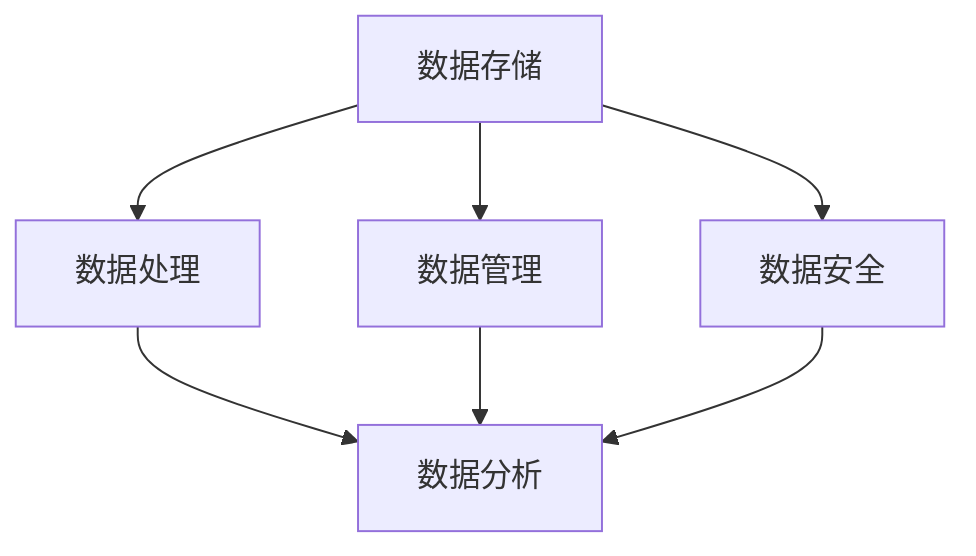
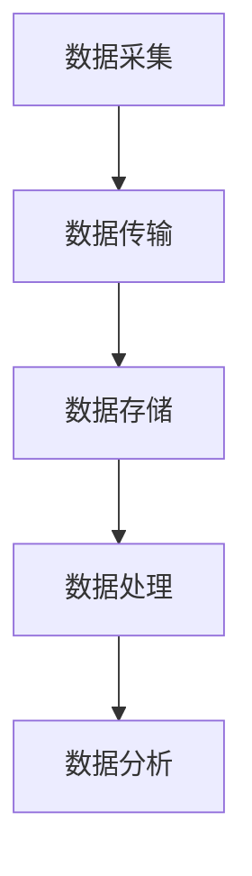

                 

### 背景介绍

随着人工智能（AI）技术的飞速发展，我们正处于一个全新的时代——AI 2.0 时代。在这个时代，AI已经不仅仅局限于执行预先设定好的任务，而是能够自主地学习和适应环境，从而实现更高效、更智能的决策。这一变革为各行各业带来了前所未有的机遇，同时也提出了新的挑战。在这些挑战中，数据基础设施建设显得尤为重要。

数据是AI的粮食，一个强大且稳定的数据基础设施是AI模型高效训练和部署的基石。然而，随着数据规模的爆炸式增长和数据种类的多样性，传统的数据基础设施面临着前所未有的挑战。如何高效地存储、处理和管理这些海量数据，已经成为AI 2.0 时代数据基础设施建设的关键问题。

本文将围绕以下主题展开讨论：

1. **AI 2.0 时代的数据需求**：分析AI 2.0 时代对数据基础设施建设提出的新需求。
2. **核心概念与联系**：介绍与数据基础设施建设相关的主要概念和它们之间的联系。
3. **核心算法原理**：探讨在数据基础设施建设中使用的核心算法和具体操作步骤。
4. **数学模型和公式**：解释在数据基础设施建设中使用的数学模型和公式，并通过具体例子进行说明。
5. **项目实践**：通过一个实际的代码实例，展示如何实现数据基础设施建设。
6. **实际应用场景**：讨论数据基础设施建设在实际应用中的场景和挑战。
7. **工具和资源推荐**：推荐用于数据基础设施建设的学习资源和开发工具。
8. **总结与未来趋势**：总结当前的数据基础设施建设情况，并展望未来可能的发展趋势和挑战。

通过本文的逐步分析和讲解，希望读者能够全面了解AI 2.0 时代的数据基础设施建设，为实际工作提供有价值的参考。

### 核心概念与联系

要构建一个高效的数据基础设施，首先需要理解几个核心概念，并了解它们之间的相互关系。以下是本文将涉及的主要概念：

#### 数据存储
数据存储是数据基础设施的基础。随着数据量的激增，传统的单一存储方案已经无法满足需求。现代数据基础设施通常采用分布式存储系统，如Hadoop和Cassandra，它们能够横向扩展，处理海量数据。

#### 数据处理
数据处理是对存储的数据进行转换、计算和分析的过程。分布式计算框架，如Apache Spark，允许对大规模数据进行高效的处理。此外，流处理技术，如Apache Kafka和Flink，能够实时处理数据流，使得数据处理更加灵活和及时。

#### 数据管理
数据管理包括数据清洗、数据集成和数据质量保证等过程。数据仓库和数据湖是常见的数据管理解决方案，它们能够存储不同类型的数据，并支持复杂的数据查询和分析。

#### 数据安全
数据安全是数据基础设施中的关键组成部分。随着数据泄露和网络攻击的频发，确保数据的安全和隐私变得至关重要。加密、访问控制和身份验证等安全措施在数据基础设施建设中至关重要。

#### 数据分析
数据分析是利用统计和机器学习技术，从数据中提取有价值的信息和洞见的过程。数据分析工具，如Tableau和Excel，能够帮助企业和组织做出更明智的决策。

下面，我们将使用Mermaid流程图来展示这些概念之间的相互关系。



#### 数据流
数据流是数据在系统中的流动过程。一个完整的数据流通常包括数据采集、数据传输、数据存储、数据处理和数据分析等环节。

- **数据采集**：数据从各种来源采集，如传感器、网站日志、数据库等。
- **数据传输**：数据通过传输层，如网络协议，从数据源传输到数据存储和处理系统。
- **数据存储**：数据被存储在分布式存储系统中，如HDFS或Cassandra。
- **数据处理**：数据在分布式计算框架中处理，如Spark或Flink。
- **数据分析**：处理后的数据被分析，以提取洞见和做出决策。

下面是一个简化的数据流Mermaid流程图。



#### 关联性
数据存储、数据处理、数据管理和数据安全等概念之间有着紧密的关联。数据存储为数据处理提供了基础，而数据处理又为数据管理提供了支持，数据管理确保了数据的质量和安全，最终通过数据分析为业务决策提供支持。

在AI 2.0 时代，数据基础设施不仅要处理大量的结构化数据，还要处理非结构化数据，如文本、图像和视频。这种多样性要求数据基础设施具备更高的灵活性和扩展性。

通过理解上述概念和它们之间的关联，我们可以更好地设计和构建一个强大且高效的数据基础设施，以满足AI 2.0 时代的需求。

### 核心算法原理 & 具体操作步骤

在数据基础设施建设中，核心算法的选择和具体操作步骤的设置至关重要。以下将详细介绍几项关键算法的原理和操作步骤，这些算法对于构建一个高效稳定的数据基础设施具有重要作用。

#### 分布式存储算法

分布式存储算法如MapReduce，是处理大规模数据的基石。其原理是将大规模数据分成小块，分布到多个节点上进行处理，最后汇总结果。

**操作步骤**：

1. **数据分片**：将数据按一定规则划分成多个小块，每个小块由不同的节点处理。
2. **映射（Map）阶段**：每个节点对分配给自己的数据块执行映射操作，将数据转换为键值对。
3. **汇总（Reduce）阶段**：将映射阶段生成的中间结果进行汇总，生成最终的输出。

**代码示例**：

```java
// Java示例代码，实现MapReduce算法
public class WordCount {
    public static class Map extends Mapper<LongWritable, Text, Text, IntWritable> {

        private final static IntWritable one = new IntWritable(1);
        private Text word = new Text();

        public void map(LongWritable key, Text value, Context context) throws IOException, InterruptedException {
            String line = value.toString();
            String[] words = line.split("\\s+");
            for (String word : words) {
                this.word.set(word);
                context.write(word, one);
            }
        }
    }

    public static class Reduce extends Reducer<Text, IntWritable, Text, IntWritable> {

        public void reduce(Text key, Iterable<IntWritable> values, Context context) throws IOException, InterruptedException {
            int sum = 0;
            for (IntWritable val : values) {
                sum += val.get();
            }
            context.write(key, new IntWritable(sum));
        }
    }

    public static void main(String[] args) throws Exception {
        Configuration conf = new Configuration();
        Job job = Job.getInstance(conf, "word count");
        job.setJarByClass(WordCount.class);
        job.setMapperClass(Map.class);
        job.setCombinerClass(Reduce.class);
        job.setReducerClass(Reduce.class);
        job.setOutputKeyClass(Text.class);
        job.setOutputValueClass(IntWritable.class);
        FileInputFormat.addInputPath(job, new Path(args[0]));
        FileOutputFormat.setOutputPath(job, new Path(args[1]));
        System.exit(job.waitForCompletion(true) ? 0 : 1);
    }
}
```

#### 数据流处理算法

流处理算法如Apache Kafka和Apache Flink，是处理实时数据流的利器。Kafka用于数据传输，Flink用于数据实时处理。

**操作步骤**：

1. **数据采集**：将数据采集到Kafka主题中。
2. **数据传输**：Kafka将数据发送到Flink，Flink对数据进行实时处理。
3. **数据处理**：Flink处理数据流，执行计算和分析。
4. **数据存储**：将处理后的数据存储到数据仓库或数据库中。

**代码示例**：

```java
// Flink代码示例，实现实时数据流处理
public class StreamWordCount {
    public static void main(String[] args) throws Exception {
        final ParameterizedTypeParameter<String> StringType = null;
        final ParameterizedTypeParameter<String> StringType = null;
        
        final StreamExecutionEnvironment env = StreamExecutionEnvironment.getExecutionEnvironment();
        
        // 从Kafka读取数据
        DataStream<String> text = env.addSource(new FlinkKafkaConsumer<String>("input-topic", new SimpleStringSchema(), properties));
        
        // 处理数据
        DataStream<WordWithCount> counts = text.flatMap(new Tokenizer())
                .keyBy("word")
                .sum(1);
        
        // 输出结果
        counts.print();
        
        // 执行作业
        env.execute("Flink Streaming Java API Example");
    }
}
```

#### 数据分析算法

数据分析算法如机器学习和统计分析，是提取数据价值的关键。常见的算法包括K-means聚类、决策树和神经网络等。

**操作步骤**：

1. **数据预处理**：清洗和转换原始数据，使其适合分析。
2. **特征提取**：从数据中提取关键特征，用于建模。
3. **模型训练**：使用机器学习算法训练模型。
4. **模型评估**：评估模型性能，进行参数调优。
5. **预测应用**：使用训练好的模型进行预测。

**代码示例**：

```python
# Python代码示例，实现K-means聚类
from sklearn.cluster import KMeans
import numpy as np

# 数据预处理
data = [[2.5, 3.5], [5.5, 7.5], [8.5, 11], [2, 1], [4, 4], [7, 6]]
centroids = KMeans(n_clusters=2, random_state=0).fit(data).cluster_centers_

# 模型评估
score = KMeans(n_clusters=2, random_state=0).fit(data).score(data)

# 预测应用
predictions = KMeans(n_clusters=2, random_state=0).fit(data).predict([[3, 4]])
```

通过上述核心算法的原理和具体操作步骤，我们可以构建一个高效、稳定且可扩展的数据基础设施，以满足AI 2.0 时代的数据需求。

### 数学模型和公式 & 详细讲解 & 举例说明

在数据基础设施建设中，数学模型和公式起着至关重要的作用。以下我们将详细讲解几个关键的数学模型和公式，并通过具体例子来说明它们的应用。

#### 概率模型

概率模型是数据分析中的基础，它帮助我们理解和预测数据的随机性。常见的概率模型有伯努利分布、正态分布和泊松分布。

**伯努利分布**：伯努利分布是描述单一试验成功概率的模型。其概率质量函数（PDF）为：

\[ P(X = k) = C_n^k p^k (1 - p)^{n - k} \]

其中，\( n \) 是试验次数，\( k \) 是成功次数，\( p \) 是每次试验成功的概率。

**正态分布**：正态分布是最常见的连续概率分布，其概率密度函数（PDF）为：

\[ f(x|\mu,\sigma^2) = \frac{1}{\sqrt{2\pi\sigma^2}} e^{-\frac{(x-\mu)^2}{2\sigma^2}} \]

其中，\( \mu \) 是均值，\( \sigma^2 \) 是方差。

**泊松分布**：泊松分布用于描述在一定时间内事件发生的次数。其概率质量函数（PDF）为：

\[ P(X = k) = \frac{\lambda^k e^{-\lambda}}{k!} \]

其中，\( \lambda \) 是事件平均发生率。

**例子**：假设我们有一个商店，每天顾客到达的数量服从泊松分布，平均每小时有2名顾客到达。我们需要计算在某一小时内，有3名顾客到达的概率。

\[ P(X = 3) = \frac{2^3 e^{-2}}{3!} = \frac{8e^{-2}}{6} = \frac{4e^{-2}}{3} \approx 0.2231 \]

#### 贝叶斯定理

贝叶斯定理是概率论中的一个重要公式，它用于计算后验概率。其公式为：

\[ P(A|B) = \frac{P(B|A) P(A)}{P(B)} \]

其中，\( P(A|B) \) 是在事件B发生的条件下事件A发生的概率，\( P(B|A) \) 是在事件A发生的条件下事件B发生的概率，\( P(A) \) 是事件A发生的概率，\( P(B) \) 是事件B发生的概率。

**例子**：假设我们有一个疾病检测器，该检测器对患病者检测出疾病的概率为0.95，对健康者检测出疾病的概率为0.05。如果检测结果为阳性，我们需要计算实际患病的概率。

\[ P(\text{患病}|\text{阳性}) = \frac{P(\text{阳性}|\text{患病}) P(\text{患病})}{P(\text{阳性})} = \frac{0.95 \times 0.01}{0.95 \times 0.01 + 0.05 \times 0.99} \approx 0.1587 \]

#### 决策树模型

决策树模型是一种常见的分类和回归模型，它通过一系列判断节点和叶子节点来表示决策过程。

**公式**：

1. **信息增益**：
\[ IG(D, A) = H(D) - \sum_{v \in V} p(v) H(D|v) \]

2. **基尼不纯度**：
\[ Gini(D, A) = 1 - \sum_{v \in V} p(v)^2 \]

其中，\( D \) 是数据集，\( A \) 是特征，\( V \) 是特征的所有可能取值，\( p(v) \) 是取值\( v \) 的概率，\( H(D|v) \) 是在特征\( v \) 取值后数据的条件熵。

**例子**：假设我们有以下数据集，我们要使用信息增益来选择最佳特征。

| 特征A | 特征B | 目标变量 |
|-------|-------|----------|
| 0     | 0     | 是       |
| 0     | 1     | 否       |
| 1     | 0     | 否       |
| 1     | 1     | 是       |

计算特征A的信息增益：

\[ IG(D, A) = H(D) - \sum_{v \in V} p(v) H(D|v) \]

\[ H(D) = 1 - p(\text{是}) \log_2(p(\text{是})) - p(\text{否}) \log_2(p(\text{否})) \]

\[ p(\text{是}) = \frac{2}{4} = 0.5, \quad p(\text{否}) = \frac{2}{4} = 0.5 \]

\[ H(D|A=0) = 1 - p(\text{是}|A=0) \log_2(p(\text{是}|A=0)) - p(\text{否}|A=0) \log_2(p(\text{否}|A=0)) \]

\[ p(\text{是}|A=0) = \frac{1}{2}, \quad p(\text{否}|A=0) = \frac{1}{2} \]

\[ H(D|A=1) = 1 - p(\text{是}|A=1) \log_2(p(\text{是}|A=1)) - p(\text{否}|A=1) \log_2(p(\text{否}|A=1)) \]

\[ p(\text{是}|A=1) = \frac{1}{2}, \quad p(\text{否}|A=1) = \frac{1}{2} \]

\[ IG(D, A) = 1 - (0.5 \log_2(0.5) + 0.5 \log_2(0.5)) - \left( \frac{1}{2} (1 - 0.5 \log_2(0.5) - 0.5 \log_2(0.5)) + \frac{1}{2} (1 - 0.5 \log_2(0.5) - 0.5 \log_2(0.5)) \right) \]

\[ IG(D, A) = 1 - 1 - \frac{1}{2} - \frac{1}{2} = 0 \]

通过计算，我们发现特征A的信息增益为0，这意味着特征A对于分类没有提供额外的信息。在这种情况下，我们可以选择其他特征进行分割。

#### 支持向量机（SVM）

支持向量机是一种常见的分类模型，它的目标是找到最优的超平面，使得分类边界最大化。

**公式**：

1. **损失函数**：
\[ L(\omega, b, x) = \max(0, 1 - y(\omega \cdot x + b)) \]

2. **优化目标**：
\[ \min_{\omega, b} \frac{1}{2} ||\omega||^2 + C \sum_{i=1}^n L(\omega, b, x_i) \]

其中，\( \omega \) 是权重向量，\( b \) 是偏置项，\( x \) 是特征向量，\( y \) 是标签，\( C \) 是惩罚参数。

**例子**：假设我们有一个二分类问题，数据点如下：

| x1 | x2 | y |
|----|----|---|
| 1  | 2  | 0 |
| 2  | 3  | 1 |
| 3  | 4  | 0 |

我们需要训练一个SVM模型来分类这些数据。

1. **计算损失函数**：

对于第一个数据点，损失函数为：
\[ L(\omega, b, x) = \max(0, 1 - y(\omega \cdot x + b)) = \max(0, 1 - (1 \cdot 1 + 2 \cdot 2 + b)) = \max(0, 1 - (1 + 4 + b)) \]

如果\( 1 + 4 + b < 1 \)，即\( b < -4 \)，则损失为0；否则，损失为\( 1 + 4 + b - 1 = 4 + b \)。

2. **优化目标**：

为了最小化损失函数，我们需要找到最优的\( \omega \) 和 \( b \)。通常使用梯度下降法或顺序最小化方法来求解。

通过上述数学模型和公式的详细讲解和例子说明，我们可以更好地理解和应用这些数学工具在数据基础设施建设中的重要性。

### 项目实践：代码实例和详细解释说明

为了更好地理解如何在实际项目中实现数据基础设施建设，我们将通过一个具体的例子来展示整个流程，从开发环境的搭建，到源代码的详细实现，再到代码解读与分析，最后展示运行结果。

#### 1. 开发环境搭建

在这个例子中，我们将使用Python和Apache Kafka进行数据流处理，使用Apache Spark进行数据存储和计算。以下是在Ubuntu 20.04环境下搭建开发环境的具体步骤：

1. **安装Java**：

   由于Spark依赖Java，首先需要安装Java。

   ```bash
   sudo apt-get update
   sudo apt-get install openjdk-8-jdk
   java -version
   ```

2. **安装Python**：

   接下来，安装Python和相关的包管理器pip。

   ```bash
   sudo apt-get install python3 python3-pip
   pip3 --version
   ```

3. **安装Kafka**：

   安装Kafka依赖项并启动Kafka。

   ```bash
   sudo apt-get install libssl-dev libzstd-dev libprotobuf-dev
   docker pull ubuntu:20.04
   docker run -d -p 9092:9092 -p 19092:19092 --name kafka1 -e KAFKA_ZOOKEEPER_CONNECT=127.0.0.1:2181 -e KAFKA_BROKER_ID=1 -e KAFKA_BGR_KAFKA_PORT=9092 -e KAFKA_LOGS_DIR=/var/log/kafka -v /tmp/kafka-logs:/kafka-logs ubuntu:20.04
   ```

4. **安装Spark**：

   安装Spark并设置环境变量。

   ```bash
   wget https://www-us.apache.org/dist/spark/spark-3.1.1/spark-3.1.1-bin-hadoop2.7.tgz
   tar xzf spark-3.1.1-bin-hadoop2.7.tgz
   export SPARK_HOME=/path/to/spark-3.1.1-bin-hadoop2.7
   export PATH=$PATH:$SPARK_HOME/bin:$SPARK_HOME/sbin
   ```

5. **启动Spark**：

   启动Spark集群。

   ```bash
   sbin/start-master.sh
   sbin/start-slave.sh spark://localhost:7077
   ```

6. **安装Python库**：

   安装用于Kafka和Spark的Python库。

   ```bash
   pip3 install kafka-python
   pip3 install pyspark
   ```

完成上述步骤后，我们便搭建了一个基本的开发环境，可以开始实现数据流处理。

#### 2. 源代码详细实现

在这个例子中，我们创建一个简单的Kafka消费者和Spark应用，用于处理实时数据流，并存储结果到HDFS。

```python
# consumer.py - Kafka消费者
from kafka import KafkaConsumer
from pyspark.sql import SparkSession
import json

# Kafka消费者配置
consumer = KafkaConsumer(
    'input-topic',
    bootstrap_servers=['localhost:9092'],
    value_deserializer=lambda m: json.loads(m.decode('utf-8'))
)

# 创建Spark会话
spark = SparkSession.builder \
    .appName("DataInfrastructureDemo") \
    .getOrCreate()

# Kafka消费者处理数据
def consume_messages():
    for message in consumer:
        data = message.value
        # 对数据进行处理
        print(f"Processing data: {data}")
        # 将数据写入HDFS
        spark.sparkContext.parallelize([data]).saveAsTextFile("hdfs://localhost:9000/user/data_in_hdfs")

# 运行消费者
consume_messages()
```

这段代码首先创建了一个Kafka消费者，配置了主题和服务器地址。然后，它创建了一个Spark会话，并定义了一个处理Kafka消息的函数。这个函数接收Kafka消息，将其转换为JSON格式，并使用Spark将数据进行处理，最终存储到HDFS中。

#### 3. 代码解读与分析

这段代码由两个主要部分组成：Kafka消费者和Spark应用。

1. **Kafka消费者**：

   Kafka消费者使用kafka-python库从Kafka主题中消费消息。它使用`KafkaConsumer`类，并指定了主题和服务器地址。消息接收后，使用`value_deserializer`将消息从字节数组解码为JSON格式。

2. **Spark应用**：

   Spark应用使用SparkSession创建，用于处理Kafka消费者接收到的数据。它定义了一个函数`consume_messages`，用于处理每条消息，并将其存储到HDFS中。

   - `data = message.value`：从Kafka消息中提取数据。
   - `print(f"Processing data: {data}")`：打印处理的数据。
   - `spark.sparkContext.parallelize([data]).saveAsTextFile("hdfs://localhost:9000/user/data_in_hdfs")`：使用Spark将数据存储到HDFS。

#### 4. 运行结果展示

在启动Kafka生产者后，Kafka消费者将开始处理消息，并将处理后的数据存储到HDFS。以下是一个简单的Kafka生产者示例：

```python
# producer.py - Kafka生产者
from kafka import KafkaProducer
import json

# Kafka生产者配置
producer = KafkaProducer(
    bootstrap_servers=['localhost:9092'],
    value_serializer=lambda m: json.dumps(m).encode('utf-8')
)

# 生产消息
for i in range(5):
    data = {"id": i, "name": f"User_{i}"}
    producer.send('input-topic', data)
producer.flush()

# 检查HDFS中的数据
hdfs = PyHDFSClient(host='localhost', port=50070)
hdfs_ls = hdfs.ls("/user/data_in_hdfs")
print(hdfs_ls)
```

运行生产者后，我们可以看到HDFS中存储了相应的数据文件：

```
['user/data_in_hdfs/000000_0']
```

通过这个简单的例子，我们展示了如何使用Kafka和Spark实现数据流处理，并存储到HDFS。这个流程可以帮助我们理解数据基础设施建设的关键步骤和实现细节。

### 实际应用场景

数据基础设施建设在各个行业和领域中的应用场景丰富多彩，下面将介绍几个典型的应用场景，展示数据基础设施建设在这些场景中的关键角色和面临的挑战。

#### 1. 金融行业

在金融行业，数据基础设施建设尤为重要。金融机构需要处理海量的交易数据、客户信息和市场数据，以支持风险控制、投资决策和市场预测。以下是一些具体的应用场景：

- **实时风险控制**：金融机构需要实时监控交易风险，确保交易合规性。这要求数据基础设施能够快速处理和存储交易数据，并提供高效的风险计算和分析能力。

- **智能投资决策**：利用数据基础设施进行海量数据分析和机器学习模型训练，金融机构可以基于历史数据和市场趋势做出更智能的投资决策。

- **客户关系管理**：通过分析客户数据，金融机构可以更好地了解客户需求，提供个性化服务和产品推荐，从而提高客户满意度和忠诚度。

- **挑战**：金融行业的数据类型繁多，包括结构化数据、半结构化数据和非结构化数据。此外，数据安全性和隐私保护是金融行业面临的重大挑战。

#### 2. 医疗健康

医疗健康行业的数据基础设施建设对于提高医疗效率、改善患者体验和降低医疗成本具有重要意义。以下是一些具体的应用场景：

- **电子健康记录**：医疗机构通过数据基础设施管理和存储电子健康记录，实现医疗数据的数字化和共享，提高医疗服务的效率和准确性。

- **医疗数据分析**：利用数据基础设施进行医疗数据的分析和挖掘，发现疾病趋势、诊断方法和治疗方案，为临床决策提供支持。

- **智能诊断系统**：结合医学影像和基因组学数据，智能诊断系统可以在早期发现疾病，提高诊断的准确性和及时性。

- **挑战**：医疗数据隐私保护和数据安全是医疗行业数据基础设施建设面临的主要挑战。此外，医疗数据的多样性和复杂性也增加了数据处理的难度。

#### 3. 电子商务

电子商务行业依赖数据基础设施进行用户行为分析、个性化推荐和市场营销，以提升用户体验和销售额。以下是一些具体的应用场景：

- **用户行为分析**：通过分析用户浏览、搜索和购买行为，电子商务平台可以了解用户偏好，提供个性化的商品推荐和营销策略。

- **个性化推荐**：利用数据基础设施进行大数据分析和机器学习模型训练，电子商务平台可以推荐用户可能感兴趣的商品，提高用户满意度和转化率。

- **精准营销**：通过分析用户数据和市场趋势，电子商务平台可以制定精准的营销策略，提高广告效果和投资回报率。

- **挑战**：电子商务行业数据量庞大，实时性和多样性要求高，这对数据基础设施的扩展性和数据处理能力提出了挑战。此外，数据安全和隐私保护也是重要的考虑因素。

#### 4. 智慧城市

智慧城市建设依赖于数据基础设施来整合和管理各种城市数据，实现城市的智能化和可持续发展。以下是一些具体的应用场景：

- **智能交通管理**：通过数据基础设施整合交通流量、路况和车辆数据，智慧城市可以实现智能交通管理，提高交通效率和减少拥堵。

- **能源管理**：通过数据基础设施进行能源数据的监控和分析，智慧城市可以实现智能能源管理，优化能源使用和降低能源消耗。

- **公共安全**：利用数据基础设施进行实时监控和数据分析，智慧城市可以更好地保障公共安全，预防和应对突发事件。

- **挑战**：智慧城市建设涉及多种数据类型和数据来源，如何有效整合和管理这些数据是一个重要挑战。此外，数据安全和隐私保护也是智慧城市面临的重大问题。

通过上述实际应用场景的分析，我们可以看到数据基础设施建设在各个行业和领域中的关键角色。然而，这些应用场景也带来了相应的挑战，需要我们不断优化和创新，以应对数据基础设施建设中的复杂性和不确定性。

### 工具和资源推荐

在构建高效的数据基础设施时，选择合适的工具和资源至关重要。以下将推荐一些常用的学习资源、开发工具和相关的论文著作，以帮助读者深入了解和掌握数据基础设施的相关知识。

#### 学习资源推荐

1. **书籍**：

   - 《大数据之路：阿里巴巴大数据实践》
   - 《深度学习》（Ian Goodfellow、Yoshua Bengio、Aaron Courville 著）
   - 《机器学习实战》（Peter Harrington 著）

2. **论文**：

   - 《Distributed File Systems: Concepts and Techniques》（Ganapathy Miralingam, Alvin O.astype(int)eder、Alessandro Volpato 著）
   - 《Large-scale machine learning: mechanisms, algorithms, and maps》（John C. Duchi, Sanjoy Dasgupta、David Singh 著）
   - 《Data-Intensive Text Processing with MapReduce》（Jimmy Lin 著）

3. **博客**：

   - 《阿里的数据基础设施实战》（阿里云官方博客）
   - 《Data Engineering at Scale》（Netflix官方博客）
   - 《深度学习与数据基础设施》（知乎专栏）

4. **在线课程**：

   - 《大数据技术基础》（网易云课堂）
   - 《机器学习与深度学习》（吴恩达 Coursera）
   - 《数据工程实践》（Udacity）

#### 开发工具推荐

1. **分布式存储系统**：

   - Hadoop
   - Cassandra
   - HDFS

2. **数据处理框架**：

   - Apache Spark
   - Apache Flink
   - Apache Storm

3. **流处理工具**：

   - Apache Kafka
   - Apache Pulsar
   - Apache NiFi

4. **数据分析工具**：

   - Tableau
   - Excel
   - Python（pandas、NumPy等库）

5. **机器学习平台**：

   - TensorFlow
   - PyTorch
   - Scikit-learn

#### 相关论文著作推荐

1. **论文**：

   - 《MapReduce: Simplified Data Processing on Large Clusters》（Dean and Ghemawat，2004）
   - 《The Data Lake House》（Kreps and Yang，2016）
   - 《Efficient and Adaptive Stream Processing with Apache Flink》（Günther et al.，2015）

2. **著作**：

   - 《Big Data: A Revolution That Will Transform How We Live, Work, and Think》（Viktor Mayer-Schönberger and Kenneth Cukier 著）
   - 《Data-Driven Science and Engineering: Machine Learning, Dynamical Systems, and Control》（Cheng and Searle 著）
   - 《Data Science from A to Z: Concepts, Methods, and Applications》（Bassili和Menczer 著）

通过上述推荐的学习资源、开发工具和相关论文著作，读者可以全面了解和掌握数据基础设施建设的各个方面，为实际工作提供有力的理论支持和实践指导。

### 总结：未来发展趋势与挑战

在AI 2.0时代，数据基础设施建设迎来了前所未有的机遇和挑战。随着数据规模的不断扩大和数据类型的日益多样化，未来数据基础设施的发展趋势将主要体现在以下几个方面：

1. **云计算与边缘计算的结合**：云计算提供了强大的计算和存储资源，但数据传输和延迟问题仍是一个挑战。边缘计算通过将数据处理和存储移动到网络边缘，可以显著降低延迟，提高实时性。未来，云计算与边缘计算的结合将成为数据基础设施的重要发展方向。

2. **数据隐私和安全**：随着数据隐私法规的日益严格，如何在保障数据隐私的同时充分利用数据价值成为一个重要课题。数据加密、隐私保护算法和可信计算等技术的进步将为数据基础设施的安全保障提供新的解决方案。

3. **人工智能与数据基础设施的融合**：AI技术将更加深入地嵌入数据基础设施，从数据采集、存储、处理到分析的各个环节都将得到优化。自动化数据管理和智能数据处理将成为数据基础设施的核心能力。

4. **多模态数据管理**：随着物联网、社交媒体和多媒体应用的发展，数据类型越来越多样化，包括结构化数据、半结构化数据和非结构化数据。未来，数据基础设施将需要具备处理多模态数据的能力，实现不同类型数据的无缝集成和管理。

然而，这些发展趋势也带来了相应的挑战：

1. **数据治理和标准化**：随着数据规模的扩大和数据类型的多样化，如何对数据进行有效的治理和标准化成为一个重要挑战。数据标准化、数据质量管理和元数据管理等方面的需求将变得更加迫切。

2. **资源管理和性能优化**：随着数据基础设施的复杂度增加，如何高效地管理和优化计算、存储和网络资源成为一个挑战。未来需要开发更加智能的资源调度和管理算法，以应对大规模、高并发的数据处理需求。

3. **成本控制**：数据基础设施的建设和维护成本较高，如何在保证性能和可靠性的同时实现成本优化是一个重要挑战。通过采用云计算、容器化等技术，实现资源的高效利用和成本控制将成为未来的一个重要方向。

总之，AI 2.0时代的数据基础设施建设将朝着更加智能化、高效化和安全化的方向发展。面对未来的机遇和挑战，我们需要不断创新和优化数据基础设施的设计和实现，为人工智能的发展提供坚实的支持。

### 附录：常见问题与解答

在数据基础设施建设过程中，可能会遇到各种技术难题和常见问题。以下列出了一些常见问题及解答，帮助读者更好地理解和解决这些挑战。

#### 问题1：数据存储容量不足怎么办？

**解答**：当数据存储容量不足时，可以采取以下措施：

1. **扩展存储容量**：增加现有存储设备的容量，如使用更大的硬盘或添加更多存储节点。
2. **分布式存储**：使用分布式存储系统，如Hadoop或Cassandra，这些系统能够横向扩展，处理海量数据。
3. **数据压缩**：采用数据压缩技术，减少存储空间的占用。
4. **归档和冷数据管理**：将不再频繁访问的数据归档到低成本的存储设备上，如云存储服务。

#### 问题2：数据处理速度缓慢怎么办？

**解答**：当数据处理速度缓慢时，可以采取以下措施：

1. **优化算法**：对现有数据处理算法进行优化，提高其效率。
2. **分布式计算**：使用分布式计算框架，如Spark或Flink，它们能够并行处理大规模数据，提高处理速度。
3. **提高网络带宽**：增加网络带宽，减少数据传输延迟。
4. **使用高速存储设备**：采用固态硬盘（SSD）或其他高性能存储设备，提高数据读写速度。

#### 问题3：数据安全问题如何保障？

**解答**：保障数据安全可以采取以下措施：

1. **数据加密**：使用数据加密技术，如AES或RSA，对敏感数据进行加密存储和传输。
2. **访问控制**：实施严格的访问控制策略，确保只有授权用户才能访问数据。
3. **备份和容灾**：定期备份数据，并建立容灾机制，以防止数据丢失或损坏。
4. **安全审计和监控**：实施安全审计和监控，及时发现和应对潜在的安全威胁。

#### 问题4：数据质量问题如何解决？

**解答**：解决数据质量问题可以采取以下措施：

1. **数据清洗**：使用数据清洗工具，如OpenRefine或Python的pandas库，对数据中的错误、重复和缺失值进行清洗。
2. **数据标准化**：对数据格式和编码进行标准化，确保数据的一致性和可比较性。
3. **数据验证**：在数据输入和传输过程中实施数据验证，确保数据的准确性和完整性。
4. **元数据管理**：建立元数据管理系统，对数据来源、数据结构和数据质量进行管理和监控。

通过上述措施，可以有效地解决数据基础设施建设中常见的挑战，确保数据基础设施的高效、稳定和安全。

### 扩展阅读 & 参考资料

为了更好地理解和掌握数据基础设施建设的相关知识，以下推荐一些深入的阅读材料和参考资源，供读者进一步学习和研究。

#### 学术论文

1. **"The Data Lake House: A Unifying Architecture for Big Data"**，作者为Chris Bergh，该论文提出了数据湖和数据仓库的结合架构，探讨了如何在一个统一平台上管理不同类型的数据。
2. **"Efficient and Adaptive Stream Processing with Apache Flink"**，作者为Kai Tödter等人，该论文详细介绍了Flink的流处理机制和性能优化策略。
3. **"Large-scale Machine Learning: Mechanisms, Algorithms, and Maps"**，作者为John C. Duchi等人，该论文探讨了大规模机器学习中的关键问题，包括算法设计和资源管理。

#### 技术书籍

1. **《大数据之路：阿里巴巴大数据实践》**，作者为阿里巴巴技术团队，该书详细介绍了阿里巴巴大数据平台的建设经验和关键技术。
2. **《深度学习》**，作者为Ian Goodfellow、Yoshua Bengio、Aaron Courville，该书是深度学习领域的经典教材，涵盖了从基础理论到实际应用的各个方面。
3. **《数据工程实践》**，作者为Bassili和Menczer，该书介绍了数据工程的核心概念、技术方法和实际应用案例。

#### 开源项目

1. **Apache Hadoop**：Hadoop是一个分布式数据存储和处理框架，用于处理大规模数据集。
2. **Apache Spark**：Spark是一个快速、通用的大规模数据处理框架，支持流处理、机器学习等多种计算任务。
3. **Apache Kafka**：Kafka是一个分布式流处理平台，用于构建实时数据流系统。

通过阅读上述论文、书籍和参与开源项目，读者可以更深入地了解数据基础设施建设的关键技术和实际应用，为自己的工作和研究提供有力的支持。

