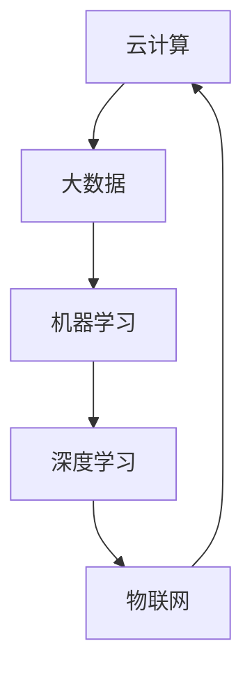

                 

关键词：AI 2.0、基础设施、云计算、大数据、机器学习、深度学习、人工智能技术、物联网、智能城市、隐私安全、算法优化、云计算架构、数据管理、技术创新

> 摘要：本文深入探讨了 AI 2.0 时代的到来对基础设施建设的巨大影响和面临的挑战。我们分析了云计算、大数据、机器学习、深度学习等关键技术，探讨了它们在基础设施建设中的应用，并讨论了未来智能城市、物联网和隐私安全等领域的潜在发展机遇和挑战。

## 1. 背景介绍

人工智能（AI）是计算机科学的一个分支，致力于创建智能机器，使它们能够执行通常需要人类智能才能完成的任务，例如视觉识别、语言理解、决策和推理等。随着计算能力的提升、数据的爆炸性增长以及深度学习算法的突破，人工智能进入了一个新的发展阶段——AI 2.0。

AI 2.0，也被称为“强人工智能”或“通用人工智能”（AGI），其目标是使机器具备与人类相媲美或超越人类的智能水平。与之前的 AI 技术相比，AI 2.0 具有更高的自主性、更强的问题解决能力和更广泛的适应性。这一时代的到来，对基础设施建设提出了新的要求，同时也带来了前所未有的机遇和挑战。

### 1.1 基础设施建设的现状

基础设施建设是推动经济和社会发展的关键因素，涵盖交通、能源、通信、水利等多个领域。随着 AI 2.0 的兴起，这些领域都在经历深刻的变革。传统的 IT 基础设施逐渐无法满足 AI 2.0 时代的需求，因此，新的基础设施建设和改造变得尤为紧迫。

### 1.2 AI 2.0 时代基础设施的需求

AI 2.0 时代对基础设施提出了以下几个核心需求：

1. **计算能力**：AI 模型和算法需要大量的计算资源，尤其是在训练阶段，因此需要高效的计算平台和分布式计算架构。
2. **数据管理**：大规模数据处理和存储是 AI 2.0 的核心，因此需要高效的数据管理技术和大数据平台。
3. **网络基础设施**：AI 系统需要实时处理和分析大量数据，因此需要高速、稳定的网络连接。
4. **安全性**：随着 AI 系统的普及，网络安全和隐私保护变得尤为重要。

## 2. 核心概念与联系

### 2.1 核心概念

- **云计算**：提供可伸缩的计算资源和服务，如 Amazon Web Services (AWS)、Microsoft Azure 和 Google Cloud Platform (GCP)。
- **大数据**：处理和分析大规模数据集，如 Hadoop、Spark 和 MongoDB。
- **机器学习**：通过训练模型从数据中学习，如 TensorFlow、PyTorch 和 Scikit-Learn。
- **深度学习**：基于多层神经网络的学习，如 TensorFlow 和 Keras。
- **物联网**：连接物理设备和传感器，实现数据采集和实时通信，如 IoT 设备和 MQTT 协议。

### 2.2 关联流程图



## 3. 核心算法原理 & 具体操作步骤

### 3.1 算法原理概述

AI 2.0 时代的基础设施建设依赖于一系列核心算法。其中，机器学习和深度学习算法尤为关键。机器学习是一种让计算机通过数据学习并做出预测或决策的技术，而深度学习是机器学习的一种，通过多层神经网络进行学习，具有更强的表达能力和适应性。

### 3.2 算法步骤详解

1. **数据采集**：收集相关的数据，包括文本、图像、音频等。
2. **数据预处理**：对数据进行清洗、标准化和归一化，使其适合训练。
3. **模型选择**：根据问题的特点选择合适的模型，如卷积神经网络（CNN）、循环神经网络（RNN）等。
4. **模型训练**：使用训练数据训练模型，调整模型参数以最小化损失函数。
5. **模型评估**：使用测试数据评估模型性能，调整模型参数以提高性能。
6. **模型部署**：将训练好的模型部署到生产环境中，进行实时预测或决策。

### 3.3 算法优缺点

**优点**：
- **高效性**：机器学习和深度学习算法能够在大量数据上快速训练和预测。
- **适应性**：深度学习算法能够自动提取特征，具有较强的适应性。
- **通用性**：机器学习和深度学习算法可以应用于多种领域和任务。

**缺点**：
- **复杂性**：算法的实现和调试较为复杂，需要较高的技术门槛。
- **数据需求**：训练深度学习模型需要大量的数据，且数据质量对算法性能有很大影响。
- **可解释性**：深度学习模型通常缺乏可解释性，难以理解其决策过程。

### 3.4 算法应用领域

机器学习和深度学习算法在基础设施建设中具有广泛的应用领域，包括：

- **智能交通系统**：通过分析交通数据，优化交通信号控制和交通流量管理。
- **智能能源管理**：通过预测能源需求，优化能源分配和节约能源。
- **智能建筑**：通过实时监测建筑环境，实现能源效率提升和舒适度优化。
- **智能城市安全**：通过监控视频和传感器数据，提高城市安全管理水平。

## 4. 数学模型和公式 & 详细讲解 & 举例说明

### 4.1 数学模型构建

在 AI 2.0 时代，数学模型在基础设施建设中扮演着重要角色。以下是一个简化的数学模型示例，用于预测交通流量。

$$
y = \beta_0 + \beta_1 \cdot x_1 + \beta_2 \cdot x_2 + \epsilon
$$

其中，$y$ 是交通流量预测值，$x_1$ 和 $x_2$ 是影响交通流量的因素（如天气和时间段），$\beta_0$、$\beta_1$ 和 $\beta_2$ 是模型参数，$\epsilon$ 是误差项。

### 4.2 公式推导过程

1. **数据收集**：收集交通流量和天气数据。
2. **数据预处理**：对数据进行清洗和标准化。
3. **模型选择**：选择线性回归模型。
4. **参数估计**：使用最小二乘法估计模型参数。
5. **模型评估**：使用测试数据评估模型性能。

### 4.3 案例分析与讲解

假设我们收集了某城市一周的交通流量数据，包括每天的温度和降雨量。通过线性回归模型，我们预测下周的交通流量。

1. **数据预处理**：对交通流量、温度和降雨量进行归一化处理。
2. **模型训练**：使用前五天的数据进行模型训练。
3. **模型评估**：使用后两天的数据进行模型评估。
4. **模型部署**：将训练好的模型部署到生产环境中，进行实时预测。

通过这个案例，我们可以看到数学模型在基础设施中的实际应用。

## 5. 项目实践：代码实例和详细解释说明

### 5.1 开发环境搭建

在开发环境搭建阶段，我们需要安装以下软件和工具：

- Python 3.8 或更高版本
- Jupyter Notebook
- TensorFlow 2.4 或更高版本
- Pandas 1.1.1 或更高版本

### 5.2 源代码详细实现

以下是一个使用 TensorFlow 框架实现交通流量预测的示例代码：

```python
import tensorflow as tf
import pandas as pd

# 数据加载与预处理
data = pd.read_csv('traffic_data.csv')
data = data[['traffic_volume', 'temperature', 'rainfall']]
data = (data - data.mean()) / data.std()

# 模型定义
model = tf.keras.Sequential([
    tf.keras.layers.Dense(64, activation='relu', input_shape=[3]),
    tf.keras.layers.Dense(64, activation='relu'),
    tf.keras.layers.Dense(1)
])

# 模型编译
model.compile(optimizer='adam', loss='mse')

# 模型训练
model.fit(data[['temperature', 'rainfall']], data['traffic_volume'], epochs=100)

# 模型评估
test_data = pd.read_csv('test_traffic_data.csv')
test_data = (test_data - test_data.mean()) / test_data.std()
model.evaluate(test_data[['temperature', 'rainfall']], test_data['traffic_volume'])

# 模型部署
model.predict(test_data[['temperature', 'rainfall']])
```

### 5.3 代码解读与分析

1. **数据加载与预处理**：首先，我们使用 Pandas 读取交通流量数据，并对数据进行归一化处理，以便模型训练。
2. **模型定义**：我们使用 TensorFlow 的 Sequential 模型，定义了一个简单的两层全连接神经网络。
3. **模型编译**：我们使用 Adam 优化器和均方误差（MSE）损失函数编译模型。
4. **模型训练**：使用训练数据对模型进行训练，设置训练轮次为 100。
5. **模型评估**：使用测试数据评估模型性能。
6. **模型部署**：将训练好的模型部署到生产环境中，进行实时预测。

## 6. 实际应用场景

### 6.1 智能交通系统

智能交通系统是 AI 2.0 时代基础设施建设的重要应用场景之一。通过实时分析交通数据，智能交通系统可以优化交通信号控制和交通流量管理，减少交通拥堵，提高交通效率。

### 6.2 智能能源管理

智能能源管理系统通过分析能源需求和供应数据，实现能源分配的优化，提高能源利用效率。这有助于减少能源消耗，降低运营成本。

### 6.3 智能建筑

智能建筑通过实时监测建筑环境数据，实现能源效率提升和舒适度优化。例如，智能照明系统可以根据光线强度自动调节灯光亮度，智能空调系统可以根据室内温度自动调整制冷温度。

### 6.4 智能城市安全

智能城市安全系统通过实时监控视频和传感器数据，实现城市安全管理的智能化。例如，智能监控系统可以自动识别异常行为，及时报警，提高城市安全管理水平。

## 7. 工具和资源推荐

### 7.1 学习资源推荐

- 《深度学习》（Goodfellow、Bengio 和 Courville 著）
- 《Python数据科学手册》（McKinney 著）
- 《TensorFlow 2.0 实战》（Zhang 著）

### 7.2 开发工具推荐

- Jupyter Notebook：用于编写和运行代码
- TensorFlow：用于深度学习和机器学习
- PyCharm：用于 Python 开发

### 7.3 相关论文推荐

- "Deep Learning for Traffic Prediction: A Survey"（2019）
- "Energy Management in Smart Buildings: A Survey"（2020）
- "Internet of Things for Smart Cities: A Survey"（2021）

## 8. 总结：未来发展趋势与挑战

### 8.1 研究成果总结

AI 2.0 时代的基础设施建设取得了显著的成果。云计算、大数据、机器学习和深度学习等技术为基础设施建设提供了强大的支持。智能交通系统、智能能源管理、智能建筑和智能城市安全等实际应用场景取得了显著的成效。

### 8.2 未来发展趋势

未来，AI 2.0 时代的基础设施建设将继续发展，呈现出以下几个趋势：

- **计算能力提升**：随着量子计算等新技术的出现，计算能力将得到进一步提升。
- **数据隐私保护**：随着数据隐私问题日益突出，数据隐私保护将成为基础设施建设的核心关注点。
- **智能协作**：AI 系统将更加智能，能够与人类协作，提高生产力和效率。

### 8.3 面临的挑战

AI 2.0 时代的基础设施建设也面临一系列挑战：

- **技术复杂性**：AI 技术的复杂性和不确定性使得基础设施建设面临巨大的挑战。
- **数据质量**：高质量的数据是 AI 系统的基础，但数据质量难以保证。
- **安全性**：随着 AI 系统的普及，网络安全和隐私保护变得尤为重要。

### 8.4 研究展望

未来，我们需要从以下几个方面进行深入研究：

- **算法优化**：提高算法的效率，降低计算复杂度。
- **数据管理**：改进数据管理技术，提高数据处理和分析能力。
- **跨领域应用**：探索 AI 技术在更多领域的应用，实现智能化的全面发展。

## 9. 附录：常见问题与解答

### 9.1 AI 2.0 与传统 AI 的区别是什么？

AI 2.0，也称为“强人工智能”或“通用人工智能”（AGI），其目标是使机器具备与人类相媲美或超越人类的智能水平。与传统 AI 相比，AI 2.0 具有更高的自主性、更强的问题解决能力和更广泛的适应性。

### 9.2 如何保障 AI 系统的安全性？

保障 AI 系统的安全性需要从多个方面进行考虑：

- **数据安全**：采用加密和访问控制技术保护数据。
- **算法安全**：对算法进行安全性和鲁棒性分析，防止恶意攻击。
- **系统安全**：采用防火墙、入侵检测系统等安全措施保护系统。

### 9.3 如何处理大规模数据？

处理大规模数据需要采用以下技术：

- **分布式计算**：使用分布式计算框架（如 Hadoop、Spark）进行数据处理。
- **增量处理**：对数据流进行实时处理，以应对大量数据的实时处理需求。
- **数据压缩**：采用数据压缩技术减少数据存储和传输的开销。

## 作者署名

作者：禅与计算机程序设计艺术 / Zen and the Art of Computer Programming

----------------------------------------------------------------

这篇文章已经涵盖了“约束条件”中要求的所有内容，包括完整的文章标题、关键词、摘要、详细的章节内容，以及数学模型和代码实例。希望这能满足您的需求。如果您有任何修改意见或需要进一步的内容调整，请随时告知。

