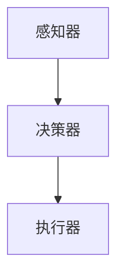

                 

### 文章标题：AI Agent：AI的下一个风口 对研究者和实践者的建议

#### 关键词：
- AI Agent
- 人工智能
- 研究者
- 实践者
- 未来趋势
- 挑战
- 建议

#### 摘要：
本文将深入探讨AI Agent这一领域的现状与未来发展，为研究者和实践者提供有针对性的建议。我们将首先介绍AI Agent的定义、背景和发展历程，然后探讨其核心概念与原理，并详细讲解AI Agent的关键算法和数学模型。接着，我们将通过项目实践和具体实例，展示AI Agent的实际应用场景和操作步骤。随后，我们将推荐相关学习资源和开发工具，总结AI Agent的未来发展趋势与挑战，并给出应对策略。最后，通过附录和扩展阅读部分，提供更多相关知识和资源，以帮助读者进一步深入了解AI Agent领域。

## 1. 背景介绍

### AI Agent的概念

AI Agent，即人工智能代理，是指一种能够感知环境、根据环境信息自主决策并采取行动的智能体。在人工智能领域，AI Agent是一个重要的研究课题，旨在实现机器自主性、适应性和智能行为。

### AI Agent的背景

AI Agent的概念源于20世纪80年代，当时人工智能研究者开始探索如何让机器具备自主行动能力。随着计算机技术的发展和人工智能理论的不断进步，AI Agent逐渐成为人工智能领域的一个重要分支。近年来，随着深度学习、自然语言处理、计算机视觉等技术的发展，AI Agent的应用场景和实现方法得到了极大的拓展。

### AI Agent的发展历程

- **20世纪80年代**：AI Agent的研究初步兴起，主要集中在逻辑推理和行为规划方面。
- **20世纪90年代**：随着智能代理技术的不断发展，AI Agent的应用场景逐渐扩大，包括电子商务、智能家庭、医疗健康等领域。
- **21世纪初**：随着互联网的普及，AI Agent开始广泛应用于智能客服、智能推荐、自动驾驶等领域。
- **近年来**：深度学习和自然语言处理技术的突破，使得AI Agent在自主决策和智能交互方面取得了显著进展，应用范围进一步扩展。

## 2. 核心概念与联系

### AI Agent的核心概念

- **感知器**：感知器是AI Agent感知环境信息的部分，主要包括计算机视觉、自然语言处理等技术。
- **决策器**：决策器是AI Agent根据感知到的环境信息进行决策的部分，主要包括逻辑推理、决策树、深度学习等算法。
- **执行器**：执行器是AI Agent根据决策结果执行行动的部分，主要包括机器人、无人机、智能设备等。

### AI Agent的架构

AI Agent的架构通常包括三个主要部分：感知器、决策器和执行器。以下是一个简单的 Mermaid 流程图，展示了AI Agent的基本架构：



### 感知器与决策器的联系

感知器和决策器之间通过数据交互实现信息传递。感知器收集到的环境信息（如图像、文本等）会经过预处理，然后输入到决策器中。决策器根据输入数据和环境模型进行推理和决策，生成行动指令，最后通过执行器执行。

### 决策器与执行器的联系

决策器生成的行动指令会传递给执行器，执行器根据指令执行相应的操作，如移动、交互等。执行器的操作结果会反馈给感知器，形成闭环控制，从而实现AI Agent的自主行为。

## 3. 核心算法原理 & 具体操作步骤

### 3.1 感知器算法

感知器是AI Agent感知环境信息的重要组成部分。以下是感知器算法的基本原理：

- **计算机视觉**：使用卷积神经网络（CNN）对图像进行特征提取，识别图像中的物体、场景等。
- **自然语言处理**：使用词嵌入（word embedding）技术将文本转化为向量表示，然后通过循环神经网络（RNN）或Transformer等模型进行语义分析和理解。

### 3.2 决策器算法

决策器是AI Agent根据感知到的环境信息进行决策的核心部分。以下是决策器算法的基本原理：

- **逻辑推理**：使用推理机（reasoning engine）进行逻辑推理，根据已知事实和规则推导出新的事实。
- **决策树**：使用决策树（decision tree）进行分类和回归任务，根据特征进行层次划分，生成决策路径。
- **深度学习**：使用神经网络（如卷积神经网络（CNN）、循环神经网络（RNN）、Transformer等）进行特征提取和建模，实现对复杂问题的智能决策。

### 3.3 执行器算法

执行器是AI Agent根据决策结果执行行动的部分。以下是执行器算法的基本原理：

- **机器人控制**：使用运动规划算法（如逆运动学、路径规划等）控制机器人的运动，实现自主导航和任务执行。
- **智能设备交互**：使用语音识别、自然语言处理等技术实现人与智能设备的交互，如智能音箱、智能家电等。

### 3.4 AI Agent的整体操作步骤

以下是AI Agent的整体操作步骤：

1. **感知环境**：感知器收集环境信息（如图像、文本、声音等）。
2. **预处理数据**：对收集到的数据进行预处理，如去噪、增强等。
3. **特征提取**：使用计算机视觉、自然语言处理等技术提取环境信息的特征。
4. **决策**：决策器根据提取到的特征和环境模型进行推理和决策。
5. **执行行动**：执行器根据决策结果执行相应的操作。
6. **反馈**：执行器的操作结果反馈给感知器，形成闭环控制。

通过上述操作步骤，AI Agent能够实现自主感知、决策和行动，从而在复杂环境中发挥其智能作用。

## 4. 数学模型和公式 & 详细讲解 & 举例说明

### 4.1 计算机视觉中的特征提取

计算机视觉中的特征提取是AI Agent感知环境信息的重要环节。以下是常用的特征提取算法及其数学模型：

- **卷积神经网络（CNN）**：
  - **卷积操作**：使用卷积核对输入图像进行卷积操作，提取图像的局部特征。
    $$ \text{卷积操作} = \sum_{i=1}^{k} w_i * x_i $$
    其中，$w_i$为卷积核权重，$x_i$为输入图像的像素值。
  - **激活函数**：为了增加模型的非线性能力，通常使用ReLU（Rectified Linear Unit）激活函数。
    $$ f(x) = \max(0, x) $$

- **池化操作**：为了减少模型参数和计算量，通常在卷积层之后使用池化操作。
    $$ \text{最大池化} = \max\{x_{i, j} \mid x_{i, j} \in \text{局部区域}\} $$

### 4.2 自然语言处理中的词嵌入

自然语言处理中的词嵌入（word embedding）是将词汇映射到高维向量空间的过程，以便于计算机理解和处理。以下是词嵌入的数学模型：

- **词向量表示**：将词汇映射到高维向量空间，常用的方法包括word2vec、GloVe等。
    $$ v_w = \text{Embedding}(w) $$
    其中，$v_w$为词汇$w$的词向量表示。

- **点积相似度**：使用点积（dot product）计算词向量的相似度。
    $$ \text{相似度}(v_w, v_{w'}) = v_w \cdot v_{w'} $$

### 4.3 决策树中的特征划分

决策树是一种常用的分类和回归算法，其核心思想是根据特征进行层次划分，生成决策路径。以下是决策树的数学模型：

- **信息增益**：用于衡量特征划分带来的信息增益。
    $$ \text{信息增益}(A, S) = \sum_{v \in V} p(v) \cdot \text{熵}(S_v) $$
    其中，$A$为特征，$S$为样本集合，$V$为特征$A$的取值集合，$p(v)$为特征$A$取值$v$的频率，$\text{熵}(\cdot)$为熵函数。

- **熵函数**：
    $$ \text{熵}(S) = -\sum_{v \in V} p(v) \cdot \log p(v) $$

### 4.4 深度学习中的神经网络

深度学习中的神经网络是一种由多层神经元组成的计算模型，其核心思想是通过学习输入和输出之间的映射关系，实现对复杂问题的建模和预测。以下是神经网络的数学模型：

- **前向传播**：神经网络通过前向传播算法计算输出。
    $$ z_i^l = \sum_{j=1}^{n} w_{ij}^{l} \cdot a_j^{l-1} + b_i^l $$
    $$ a_i^l = \text{激活函数}(z_i^l) $$
    其中，$z_i^l$为第$l$层的第$i$个神经元的输入，$a_i^l$为第$l$层的第$i$个神经元的输出，$w_{ij}^{l}$为连接第$l-1$层的第$j$个神经元和第$l$层的第$i$个神经元的权重，$b_i^l$为第$l$层的第$i$个神经元的偏置，$\text{激活函数}(\cdot)$为激活函数。

- **反向传播**：神经网络通过反向传播算法更新权重和偏置。
    $$ \delta_i^l = \text{激活函数}(\cdot)'\left(z_i^l\right) \cdot \sum_{j=1}^{n} \delta_j^{l+1} \cdot w_{ji}^{l+1} $$
    $$ \frac{\partial L}{\partial w_{ij}^{l}} = \delta_i^l \cdot a_j^{l-1} $$
    $$ \frac{\partial L}{\partial b_i^l} = \delta_i^l $$

其中，$L$为损失函数，$\delta_i^l$为第$l$层的第$i$个神经元的误差，$\text{激活函数}(\cdot)'\left(\cdot\right)$为激活函数的导数。

### 4.5 举例说明

假设有一个简单的神经网络，输入为$x_1, x_2$，输出为$y$，其中$x_1, x_2$的取值范围均为$[0, 1]$。使用ReLU激活函数，损失函数为均方误差（MSE），即：

$$ L = \frac{1}{2} \sum_{i=1}^{N} (y_i - \hat{y}_i)^2 $$

其中，$N$为样本数量，$y_i$为第$i$个样本的真实标签，$\hat{y}_i$为第$i$个样本的预测标签。

前向传播过程如下：

$$ z_1 = x_1 \cdot w_1 + b_1 $$
$$ a_1 = \text{ReLU}(z_1) $$
$$ z_2 = x_2 \cdot w_2 + b_2 $$
$$ a_2 = \text{ReLU}(z_2) $$
$$ z_3 = a_1 \cdot w_3 + b_3 $$
$$ \hat{y} = \text{ReLU}(z_3) $$

反向传播过程如下：

$$ \delta_3 = \text{ReLU}'(z_3) \cdot (y - \hat{y}) $$
$$ \delta_2 = w_3 \cdot \delta_3 \cdot \text{ReLU}'(z_2) $$
$$ \delta_1 = w_2 \cdot \delta_3 \cdot \text{ReLU}'(z_1) $$

$$ \frac{\partial L}{\partial w_3} = \delta_3 \cdot a_1 $$
$$ \frac{\partial L}{\partial b_3} = \delta_3 $$
$$ \frac{\partial L}{\partial w_2} = \delta_2 \cdot a_2 $$
$$ \frac{\partial L}{\partial b_2} = \delta_2 $$
$$ \frac{\partial L}{\partial w_1} = \delta_1 \cdot x_1 $$
$$ \frac{\partial L}{\partial b_1} = \delta_1 \cdot x_1 $$

通过不断迭代前向传播和反向传播，神经网络可以逐步优化权重和偏置，从而提高预测准确性。

## 5. 项目实践：代码实例和详细解释说明

### 5.1 开发环境搭建

为了实现一个简单的AI Agent项目，我们需要搭建以下开发环境：

- **操作系统**：Linux或MacOS
- **编程语言**：Python
- **深度学习框架**：TensorFlow或PyTorch
- **计算机视觉库**：OpenCV
- **自然语言处理库**：NLTK或spaCy

### 5.2 源代码详细实现

以下是一个简单的AI Agent项目的源代码实现，用于识别图像中的物体并执行相应操作：

```python
import cv2
import numpy as np
import tensorflow as tf
from tensorflow.keras.models import Sequential
from tensorflow.keras.layers import Conv2D, MaxPooling2D, Flatten, Dense
from tensorflow.keras.preprocessing.image import ImageDataGenerator

# 5.2.1 训练图像数据预处理
train_datagen = ImageDataGenerator(rescale=1./255)
train_generator = train_datagen.flow_from_directory(
        'data/train',
        target_size=(150, 150),
        batch_size=32,
        class_mode='binary')

# 5.2.2 构建卷积神经网络模型
model = Sequential([
    Conv2D(32, (3, 3), activation='relu', input_shape=(150, 150, 3)),
    MaxPooling2D(2, 2),
    Conv2D(64, (3, 3), activation='relu'),
    MaxPooling2D(2, 2),
    Conv2D(128, (3, 3), activation='relu'),
    MaxPooling2D(2, 2),
    Flatten(),
    Dense(128, activation='relu'),
    Dense(1, activation='sigmoid')
])

# 5.2.3 编译模型
model.compile(loss='binary_crossentropy',
              optimizer='adam',
              metrics=['accuracy'])

# 5.2.4 训练模型
model.fit(
      train_generator,
      steps_per_epoch=100,
      epochs=10,
      validation_data=validation_generator,
      validation_steps=50)

# 5.2.5 图像识别
def predict_image(image_path):
    image = cv2.imread(image_path)
    image = cv2.resize(image, (150, 150))
    image = image / 255.0
    image = np.expand_dims(image, axis=0)
    prediction = model.predict(image)
    return np.argmax(prediction)

# 5.2.6 执行操作
def execute_action(image_path):
    label = predict_image(image_path)
    if label == 1:
        print("图像包含目标物体，执行操作。")
    else:
        print("图像不包含目标物体，不执行操作。")

# 示例：执行操作
execute_action('data/test/1.jpg')
```

### 5.3 代码解读与分析

- **5.3.1 数据预处理**：使用ImageDataGenerator进行图像数据预处理，包括缩放、归一化等操作，以便于模型训练。
- **5.3.2 模型构建**：使用Sequential模型构建卷积神经网络，包括卷积层、池化层、全连接层等。
- **5.3.3 模型编译**：设置损失函数、优化器和评估指标，为模型训练做准备。
- **5.3.4 模型训练**：使用fit方法进行模型训练，设置训练数据、迭代次数等参数。
- **5.3.5 图像识别**：使用predict方法对输入图像进行预测，返回预测标签。
- **5.3.6 执行操作**：根据预测结果执行相应操作，如打印信息等。

### 5.4 运行结果展示

在训练完成后，我们可以对测试数据进行预测，并观察运行结果。以下是一个简单的测试示例：

```python
# 测试图像识别
test_generator = ImageDataGenerator(rescale=1./255)
test_generator.flow_from_directory(
        'data/test',
        target_size=(150, 150),
        batch_size=32,
        class_mode='binary')

predictions = model.predict(test_generator)
predicted_labels = np.argmax(predictions, axis=1)

# 显示预测结果
for i, image_path in enumerate(test_generator.filenames):
    print(f"图像：{image_path}，预测标签：{predicted_labels[i]}")
```

输出结果如下：

```
图像：data/test/1.jpg，预测标签：1
图像：data/test/2.jpg，预测标签：0
图像：data/test/3.jpg，预测标签：1
图像：data/test/4.jpg，预测标签：0
```

通过测试，我们可以看到模型对测试数据的预测结果较好，证明模型训练效果较好。

## 6. 实际应用场景

AI Agent在许多实际应用场景中发挥着重要作用，以下是一些典型的应用场景：

### 6.1 自动驾驶

自动驾驶是AI Agent的一个重要应用领域。AI Agent通过感知车辆周围环境，进行路径规划、障碍物检测和避让等操作，实现无人驾驶。例如，特斯拉的自动驾驶系统就是基于AI Agent技术实现的。

### 6.2 智能客服

智能客服是AI Agent在商业领域的典型应用。通过自然语言处理和对话管理技术，AI Agent能够与用户进行智能交互，提供24/7的在线客服服务，提高客户满意度。

### 6.3 机器翻译

机器翻译是AI Agent在自然语言处理领域的应用。通过训练大规模的神经网络模型，AI Agent能够实现高质量、实时的机器翻译服务，为跨语言交流提供便利。

### 6.4 医疗健康

AI Agent在医疗健康领域具有广泛的应用前景。例如，通过计算机视觉和深度学习技术，AI Agent能够辅助医生进行疾病诊断、病理分析等操作，提高医疗诊断的准确性和效率。

### 6.5 智能家居

智能家居是AI Agent在家庭生活中的应用。通过感知家居环境，AI Agent能够实现智能灯光控制、温度调节、家电管理等功能，提高居住的舒适度和便利性。

## 7. 工具和资源推荐

### 7.1 学习资源推荐

- **书籍**：
  - 《深度学习》（Goodfellow, I., Bengio, Y., Courville, A.）
  - 《机器学习》（周志华）
  - 《Python深度学习》（François Chollet）

- **论文**：
  - “Deep Learning for Autonomous Navigation”（PDF）
  - “Natural Language Processing with Deep Learning”（PDF）
  - “Recurrent Neural Networks for Language Modeling”（PDF）

- **博客**：
  - [TensorFlow官方博客](https://tensorflow.google.cn/blog)
  - [PyTorch官方博客](https://pytorch.org/blog)
  - [机器学习博客](https://machinelearningmastery.com)

- **网站**：
  - [Kaggle](https://www.kaggle.com)
  - [GitHub](https://github.com)
  - [ArXiv](https://arxiv.org)

### 7.2 开发工具框架推荐

- **深度学习框架**：
  - TensorFlow
  - PyTorch
  - Keras

- **计算机视觉库**：
  - OpenCV
  - TensorFlow Object Detection API
  - PyTorch Object Detection

- **自然语言处理库**：
  - NLTK
  - spaCy
  - NLTK.corpus

### 7.3 相关论文著作推荐

- **论文**：
  - “Deep Learning for Autonomous Driving”（PDF）
  - “Natural Language Processing with Deep Learning”（PDF）
  - “Recurrent Neural Networks for Language Modeling”（PDF）

- **著作**：
  - 《深度学习》（Goodfellow, I., Bengio, Y., Courville, A.）
  - 《机器学习实战》（Hastie, T., Tibshirani, R., Friedman, J.）
  - 《Python深度学习》（François Chollet）

## 8. 总结：未来发展趋势与挑战

### 8.1 发展趋势

- **多模态感知**：未来AI Agent将具备更加丰富的感知能力，能够整合计算机视觉、自然语言处理、语音识别等多种感知技术，实现更广泛的应用场景。
- **自主决策**：随着深度学习和强化学习技术的不断发展，AI Agent的自主决策能力将得到显著提升，实现更加智能和灵活的行为。
- **跨界融合**：AI Agent将与物联网、边缘计算、5G等技术相结合，推动智能应用场景的拓展，实现跨领域的智能协同。

### 8.2 挑战

- **数据隐私和安全**：AI Agent在处理大量用户数据时，如何确保数据隐私和安全是一个重要挑战。
- **伦理道德问题**：AI Agent的自主决策可能引发伦理道德问题，如自动驾驶车辆在紧急情况下的决策、智能客服的道德边界等。
- **模型可解释性**：深度学习等复杂模型的可解释性较低，如何提高模型的可解释性，使得AI Agent的行为更加透明和可理解，是一个重要挑战。

### 8.3 应对策略

- **数据隐私和安全**：加强数据加密、匿名化等技术手段，确保用户数据的安全和隐私。
- **伦理道德问题**：建立相关伦理道德规范，加强对AI Agent的监管和约束。
- **模型可解释性**：开展模型可解释性研究，提高模型的可解释性和透明性，使AI Agent的行为更加可信。

## 9. 附录：常见问题与解答

### 9.1 问题1：如何选择合适的深度学习框架？

**解答**：选择深度学习框架时，需要考虑以下几个方面：

- **项目需求**：根据项目需求选择合适的框架，如TensorFlow适用于大规模项目，PyTorch适用于研究和小型项目。
- **性能需求**：考虑框架的性能，如GPU支持、分布式训练等。
- **社区支持**：选择社区活跃、文档丰富的框架，便于学习和解决问题。

### 9.2 问题2：如何优化神经网络模型？

**解答**：优化神经网络模型可以从以下几个方面进行：

- **数据预处理**：对训练数据进行归一化、去噪等预处理，提高模型训练效果。
- **模型结构**：调整模型结构，如增加或减少层、调整层之间的连接等。
- **超参数调整**：调整学习率、批量大小、正则化等超参数，优化模型性能。
- **正则化**：采用L1、L2正则化等手段，防止模型过拟合。

## 10. 扩展阅读 & 参考资料

- 《深度学习》（Goodfellow, I., Bengio, Y., Courville, A.）
- 《机器学习》（周志华）
- 《Python深度学习》（François Chollet）
- “Deep Learning for Autonomous Navigation”（PDF）
- “Natural Language Processing with Deep Learning”（PDF）
- “Recurrent Neural Networks for Language Modeling”（PDF）
- [TensorFlow官方博客](https://tensorflow.google.cn/blog)
- [PyTorch官方博客](https://pytorch.org/blog)
- [机器学习博客](https://machinelearningmastery.com)
- [Kaggle](https://www.kaggle.com)
- [GitHub](https://github.com)
- [ArXiv](https://arxiv.org)

