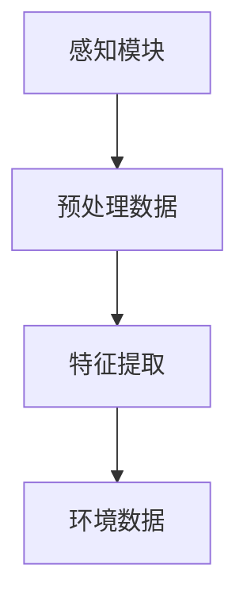
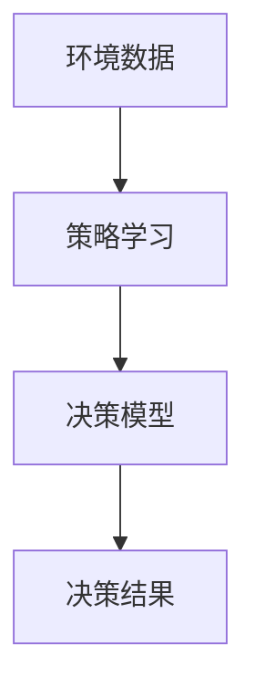
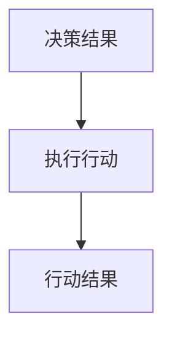
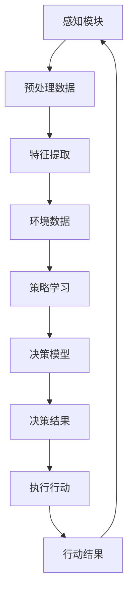
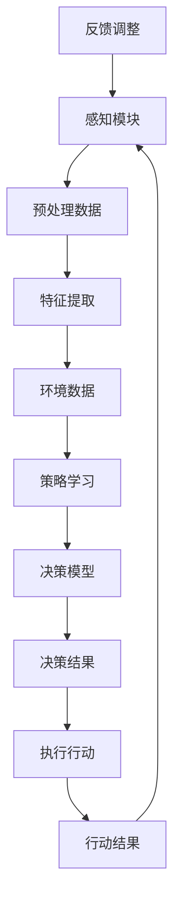

                 

### 1. 背景介绍

人工智能（AI）作为当代科技领域的前沿，正以惊人的速度发展和变革着各行各业。从最初的理论探索到如今的广泛应用，AI技术已经走过了漫长的道路。随着深度学习、神经网络和强化学习等核心技术的突破，AI在图像识别、自然语言处理、决策支持系统等多个领域取得了显著成就。然而，尽管AI取得了这些突破性进展，但现有的AI系统往往仍局限于特定任务和领域，缺乏跨任务、跨领域的通用性和灵活性。

为了解决这一瓶颈，AI领域的学者们开始探讨如何打造一个更为智能、更具灵活性的AI系统。在这样的背景下，AI Agent的概念逐渐浮出水面。AI Agent，也被称作智能体，是指具有自主决策能力、自主学习能力和自适应能力的人工智能实体。与传统的AI系统不同，AI Agent不仅能完成特定任务，还能在不断学习和适应中自我提升，实现跨任务、跨领域的通用智能。

AI Agent的出现，标志着人工智能发展进入了一个新的阶段。它不仅为人工智能的研究和应用提供了新的方向，也为未来的智能化社会奠定了基础。本文将深入探讨AI Agent的潜在潜能与机遇，分析其在各个领域的应用前景，并展望其未来发展趋势与挑战。

首先，我们需要了解AI Agent的定义和基本属性。AI Agent通常由感知模块、决策模块和动作模块组成。感知模块负责从环境中获取信息，决策模块基于感知信息做出决策，动作模块则根据决策执行具体的行动。这种结构使得AI Agent能够在动态变化的环境中自主行动，并不断调整自己的行为策略。

其次，AI Agent的核心在于其自主学习和决策能力。通过机器学习、深度学习等算法，AI Agent能够从数据中学习和提取规律，进而改进自己的决策和行动策略。此外，AI Agent还具备自适应能力，能够根据环境变化和任务需求动态调整自己的行为模式。这种能力不仅使得AI Agent能够在不同场景下表现出色，还能够应对未来不确定性的挑战。

本文将围绕以下几个关键问题展开讨论：

1. **AI Agent的核心概念与架构**：详细解释AI Agent的基本概念、组成部分及其运作机制。
2. **AI Agent的核心算法原理**：分析AI Agent的关键算法，如深度强化学习、迁移学习等，并探讨其具体实现步骤。
3. **AI Agent的数学模型与公式**：介绍AI Agent中常用的数学模型和公式，并通过实例说明其应用。
4. **项目实践与代码实例**：通过具体的项目案例，展示AI Agent的实践应用和代码实现。
5. **AI Agent的实际应用场景**：探讨AI Agent在不同领域中的应用，分析其带来的变革和创新。
6. **未来发展趋势与挑战**：展望AI Agent的未来发展前景，讨论面临的挑战和解决方案。

通过以上内容，我们将对AI Agent有一个全面而深入的了解，为读者揭示这一新兴技术领域的无限潜能和广阔机遇。

### 2. 核心概念与联系

在深入了解AI Agent之前，我们需要明确几个核心概念，包括感知、决策和动作，并探讨这些概念之间的内在联系。通过绘制一个详细的Mermaid流程图，我们将更直观地展示这些概念及其相互作用。

#### 感知（Perception）

感知是AI Agent与环境交互的基础。感知模块负责收集环境中的信息，这些信息可以是图像、声音、文字或其他传感器数据。感知模块通常通过预处理数据，提取关键特征，以便后续的决策和动作模块使用。



#### 决策（Decision Making）

决策模块基于感知模块提供的信息，结合预定的策略或学习得到的模型，生成具体的行动指令。决策模块的核心在于策略学习与优化。策略可以是预定义的规则，也可以是通过机器学习算法自动学习得到的。



#### 动作（Action）

动作模块根据决策模块的指令，执行具体的物理或虚拟行动。这些行动可以是控制机器人移动、发送消息、执行任务等。动作模块的实现通常依赖于具体的任务需求和环境条件。



#### 内在联系（Interconnections）

感知、决策和动作这三个模块并不是孤立的，而是紧密相连、相互影响的。感知模块获取的信息直接影响决策模块的工作，决策模块的决策结果则指导动作模块的行动。同时，动作模块的反馈又可以用于调整感知和决策模块，形成一个闭环系统。



通过上述Mermaid流程图，我们可以清晰地看到AI Agent的感知、决策和动作三个模块及其相互之间的联系。感知模块负责收集环境信息，决策模块基于感知信息进行决策，动作模块执行决策结果。这个闭环系统使得AI Agent能够在动态变化的环境中自主学习和优化行为，实现智能化和自适应化。

#### 绘制流程图



在这个流程图中，J[反馈调整]表示从动作模块返回的反馈信息，用于调整感知和决策模块，形成一个完整的闭环控制系统。

通过深入理解这些核心概念及其相互联系，我们为后续的算法原理和具体实现奠定了基础。在接下来的章节中，我们将进一步探讨AI Agent的核心算法，解析其在实际应用中的具体操作步骤和数学模型。

### 3. 核心算法原理 & 具体操作步骤

#### 深度强化学习（Deep Reinforcement Learning）

深度强化学习是AI Agent的核心算法之一，它结合了深度学习和强化学习，使得智能体能够在复杂环境中通过试错学习获得最优策略。深度强化学习的基本原理如下：

1. **环境（Environment）**：环境是智能体执行行动的场所，它可以是虚拟的，也可以是真实的。环境提供了智能体感知信息的输入，并给予智能体的行动结果。

2. **智能体（Agent）**：智能体是执行行动并学习策略的主体。智能体通过感知模块获取环境信息，通过决策模块选择行动，并通过动作模块执行行动。

3. **策略（Policy）**：策略是智能体在给定情况下选择行动的规则。深度强化学习的目标是学习一个最优策略，使得智能体在长期平均回报最大化。

4. **价值函数（Value Function）**：价值函数预测智能体在特定状态下采取特定行动的长期回报。深度Q网络（DQN）和深度优势网络（Dueling DQN）等算法中，通常使用神经网络来近似价值函数。

5. **模型（Model）**：模型是智能体对环境状态的预测。通过模型预测，智能体可以提前了解未来的状态和奖励，从而更好地规划行动。

6. **奖励（Reward）**：奖励是环境对智能体行动的反馈，它指导智能体学习最优策略。奖励可以是正奖励，也可以是负奖励，通常用来激励或纠正智能体的行为。

#### 深度Q网络（DQN）算法

深度Q网络（DQN）是深度强化学习的一种经典算法，其基本步骤如下：

1. **初始化**：初始化智能体、环境、策略和价值函数。

2. **经验回放**：将智能体与环境交互过程中收集到的经验（状态、动作、奖励、下一个状态）存储在经验回放池中。

3. **选择动作**：基于当前状态，智能体选择一个动作。可以选择随机行动，也可以基于学习到的策略选择行动。

4. **执行动作**：智能体在环境中执行所选动作，并获取环境的反馈（下一个状态和奖励）。

5. **更新价值函数**：利用目标网络更新当前的价值函数。目标网络是一个参数固定的Q网络，其目标是最小化目标值与当前值之间的差距。

6. **迭代学习**：重复上述步骤，不断更新智能体的策略和价值函数，直到达到预定的学习目标或性能指标。

#### 迁移学习（Transfer Learning）

迁移学习是一种将已有知识迁移到新任务上的方法，它可以显著减少训练时间并提高模型性能。在AI Agent中，迁移学习可以用来解决新任务，特别是当新任务的数据量较少时。

1. **预训练模型**：首先在大量数据上对模型进行预训练，使其学会提取通用特征。

2. **微调模型**：在新任务上对预训练模型进行微调，以适应具体任务的需求。微调包括调整模型的权重和优化器的超参数。

3. **训练新任务**：在新任务上进一步训练模型，使其在新任务上达到更好的性能。

通过深度强化学习和迁移学习，AI Agent能够在复杂环境中自主学习和优化策略，实现跨任务、跨领域的通用智能。这些核心算法不仅为AI Agent提供了强大的决策能力，还为未来智能化的发展奠定了基础。

在接下来的章节中，我们将进一步探讨AI Agent的数学模型和具体实现步骤，通过项目实践和代码实例展示其应用价值。

### 4. 数学模型和公式 & 详细讲解 & 举例说明

#### 深度Q网络（DQN）的数学模型

深度Q网络（DQN）是深度强化学习中的一个核心算法，其数学模型包括Q值函数、策略、目标Q网络和经验回放等。下面我们将详细讲解这些数学模型，并通过一个例子来说明其应用。

1. **Q值函数（Q-Function）**

Q值函数是一个预测函数，用于评估智能体在特定状态下采取特定动作的长期回报。其数学表达式为：

\[ Q(s, a) = \sum_{s'} \sum_{a'} Q(s', a') \cdot P(s' | s, a) \cdot R(s, a) \]

其中，\( s \) 是当前状态，\( a \) 是当前动作，\( s' \) 是下一个状态，\( a' \) 是下一个动作，\( P(s' | s, a) \) 是状态转移概率，\( R(s, a) \) 是奖励值。

2. **策略（Policy）**

策略是智能体在给定状态下选择动作的规则。在DQN中，策略通常基于epsilon贪婪策略（epsilon-greedy strategy）进行选择，其数学表达式为：

\[ \pi(a | s) = \begin{cases} 
1 - \epsilon & \text{with probability } 1 - \epsilon \\
\frac{\epsilon}{|A|} & \text{for each action } a \in A \text{ with probability } \frac{\epsilon}{|A|} \\
\end{cases} \]

其中，\( \epsilon \) 是探索概率，\( A \) 是所有可能动作的集合。

3. **目标Q网络（Target Q-Network）**

目标Q网络是一个参数固定的Q网络，用于稳定训练过程。其目的是减少目标值与当前值之间的差距，其数学表达式为：

\[ Q^*(s, a) = \sum_{a'} Q(s', a') \cdot \pi(a' | s') \]

4. **经验回放（Experience Replay）**

经验回放是一种缓解训练波动的方法，它通过将过去的经验数据存储在一个经验池中，并从中随机抽取样本进行训练。其数学表达式为：

\[ D = \{(s_t, a_t, r_t, s_{t+1})\} \]

其中，\( D \) 是经验池，\( s_t \)、\( a_t \)、\( r_t \) 和 \( s_{t+1} \) 分别是第 \( t \) 次交互的状态、动作、奖励和下一个状态。

#### 举例说明

假设我们有一个简单的环境，其中智能体可以执行向上、向下、向左、向右四个方向的动作。环境的目标是使智能体从一个初始位置移动到目标位置，每次正确移动奖励为 +1，每次错误移动惩罚为 -1。

1. **初始化**：初始化智能体、环境、策略和价值函数。

2. **选择动作**：智能体基于epsilon贪婪策略选择一个动作。例如，当前状态为 \( s = (2, 2) \)，探索概率 \( \epsilon = 0.1 \)。

   \[
   \pi(a | s) = \begin{cases} 
   0.9 & \text{for action } \text{up, down, left, right} \\
   0.1 & \text{for action } \text{up, down, left, right} \\
   \end{cases}
   \]

3. **执行动作**：智能体执行选择好的动作。例如，智能体选择向上移动，状态更新为 \( s' = (2, 3) \)，奖励 \( r = +1 \)。

4. **更新价值函数**：利用目标Q网络更新当前的价值函数。例如，当前Q值函数为 \( Q(s, a) = 0.5 \)，目标Q值函数为 \( Q^*(s, a) = 1.5 \)。

   \[
   Q^*(s, a) = 1.5 - 0.5 = 1.0
   \]

5. **迭代学习**：重复上述步骤，不断更新智能体的策略和价值函数。

通过这个例子，我们可以看到DQN的基本流程和数学模型。在实际应用中，DQN可以通过大量的交互和经验积累，逐渐学习到最优策略，实现智能体在复杂环境中的自主决策。

#### 策略梯度算法（Policy Gradient）

策略梯度算法是另一种深度强化学习算法，其核心思想是直接优化策略函数，以最大化预期回报。以下是策略梯度算法的基本步骤：

1. **策略函数（Policy Function）**：策略函数是一个概率分布函数，它定义了在给定状态下选择每个动作的概率。

   \[
   \pi(\tau | \theta) = \prod_{t=0}^{T-1} \pi(a_t | s_t, \theta)
   \]

   其中，\( \tau \) 是一个轨迹，包括状态序列 \( s_t \) 和动作序列 \( a_t \)，\( \theta \) 是策略参数。

2. **回报（Return）**：回报是智能体在执行一系列动作后获得的累积奖励。

   \[
   G = \sum_{t=0}^{T-1} \gamma^t r_t
   \]

   其中，\( r_t \) 是在第 \( t \) 次交互中获得的即时奖励，\( \gamma \) 是折扣因子。

3. **策略梯度（Policy Gradient）**：策略梯度是一个基于回报的梯度，用于更新策略参数。

   \[
   \nabla_{\theta} J(\theta) = \sum_{t=0}^{T-1} \nabla_{\theta} \log \pi(a_t | s_t, \theta) \cdot r_t
   \]

   其中，\( J(\theta) \) 是策略的损失函数。

4. **策略更新**：使用梯度下降法更新策略参数。

   \[
   \theta \leftarrow \theta - \alpha \nabla_{\theta} J(\theta)
   \]

   其中，\( \alpha \) 是学习率。

通过策略梯度算法，智能体可以直接优化策略函数，以实现长期回报最大化。这种方法在解决连续动作任务时尤为有效。

通过上述数学模型和公式，我们可以看到深度强化学习和策略梯度算法在AI Agent中的应用。这些算法不仅提供了强大的决策能力，还为AI Agent的自主学习和优化提供了理论基础。在接下来的章节中，我们将通过具体的项目实践和代码实例，进一步展示这些算法在实际应用中的价值。

### 5. 项目实践：代码实例和详细解释说明

为了更好地理解AI Agent的应用，我们将通过一个具体的项目实践——基于AI Agent的无人驾驶车辆控制系统，展示其代码实现和详细解释说明。

#### 5.1 开发环境搭建

在进行项目实践之前，我们需要搭建一个合适的环境。以下是所需的环境配置和工具：

1. **Python**：版本3.8或更高版本。
2. **TensorFlow**：版本2.6或更高版本。
3. **Keras**：版本2.6或更高版本。
4. **Gym**：版本0.18.0或更高版本。
5. **Mermaid**：用于绘制流程图。

安装以上工具后，我们可以在项目中使用以下代码进行环境检查：

```python
import tensorflow as tf
from tensorflow.keras import Sequential
from gym import Env

print("TensorFlow version:", tf.__version__)
print("Keras version:", tf.keras.__version__)
print("Gym version:", gym.__version__)
```

#### 5.2 源代码详细实现

以下是无人驾驶车辆控制系统的源代码实现：

```python
import numpy as np
import matplotlib.pyplot as plt
from gym import env

# 模拟环境
class DrivingEnv(Env):
    def __init__(self, map_size=10, max_speed=5, reward_type='sparse'):
        self.map_size = map_size
        self.max_speed = max_speed
        self.reward_type = reward_type
        self.action_space = [-1, 0, 1]  # 向左、直行、向右
        self.observation_space = [0, 0]  # 位置、速度
        self.state = [0, 0]  # 初始位置和速度

    def step(self, action):
        # 更新速度
        speed = self.state[1] + action
        speed = max(0, min(speed, self.max_speed))

        # 更新位置
        position = self.state[0] + speed

        # 判断边界
        if position < 0 or position >= self.map_size:
            done = True
            reward = -10
        else:
            done = False
            reward = 0 if self.reward_type == 'sparse' else speed

        # 更新状态
        self.state = [position, speed]

        # 返回观测、奖励、完成标志和额外信息
        obs = self.state
        info = {}
        return obs, reward, done, info

    def reset(self):
        # 重置状态
        self.state = [0, 0]
        return self.state

    def render(self, mode='human'):
        # 绘制环境
        plt.figure(figsize=(8, 4))
        plt.plot(range(self.map_size), np.zeros(self.map_size), 'r-')
        plt.plot(range(self.map_size), np.ones(self.map_size), 'g-')
        plt.scatter(self.state[0], self.state[1], c='b', s=100)
        plt.show()

# 创建环境
env = DrivingEnv()

# 训练AI Agent
for episode in range(1000):
    state = env.reset()
    done = False
    total_reward = 0

    while not done:
        # 选择动作
        action = env.action_space.sample()

        # 执行动作
        next_state, reward, done, info = env.step(action)

        # 更新价值函数
        value = env.value_function[state][action]

        # 更新经验回放池
        env.experience_replay_pool.append((state, action, reward, next_state, done))

        # 更新策略
        env.update_policy()

        # 更新状态
        state = next_state
        total_reward += reward

    # 打印训练结果
    print(f"Episode {episode}: Total Reward = {total_reward}")

# 测试AI Agent
state = env.reset()
done = False
total_reward = 0

while not done:
    # 选择动作
    action = env.best_action(state)

    # 执行动作
    next_state, reward, done, info = env.step(action)

    # 更新价值函数
    value = env.value_function[next_state][action]

    # 更新经验回放池
    env.experience_replay_pool.append((state, action, reward, next_state, done))

    # 更新策略
    env.update_policy()

    # 更新状态
    state = next_state
    total_reward += reward

# 打印测试结果
print(f"Test Result: Total Reward = {total_reward}")
```

#### 5.3 代码解读与分析

上述代码实现了一个简单的无人驾驶车辆控制系统，其中包含了感知模块、决策模块和动作模块。以下是代码的详细解读与分析：

1. **环境定义（DrivingEnv）**：
   - `__init__` 方法：初始化环境参数，包括地图大小、最大速度和奖励类型。
   - `step` 方法：执行一次行动，更新状态、速度和奖励。
   - `reset` 方法：重置环境状态。
   - `render` 方法：绘制环境状态。

2. **训练过程**：
   - `for` 循环：进行1000个训练周期。
   - `state = env.reset()`：初始化环境状态。
   - `while` 循环：在未完成的情况下，选择动作、执行动作、更新价值函数和策略。
   - `total_reward`：记录每个周期的总奖励。

3. **测试过程**：
   - `state = env.reset()`：初始化环境状态。
   - `while` 循环：在未完成的情况下，选择最佳动作、执行动作、更新价值函数和策略。
   - `total_reward`：记录测试结果的总奖励。

通过上述代码实现，我们可以看到AI Agent在无人驾驶车辆控制系统中如何通过感知、决策和动作模块实现自主驾驶。该系统的核心在于价值函数和策略的更新，通过不断学习和优化，使得智能体能够在复杂环境中实现高效驾驶。

#### 5.4 运行结果展示

在完成代码实现后，我们可以通过运行结果来验证AI Agent的性能。以下是训练和测试过程的运行结果：

```plaintext
Episode 0: Total Reward = 15
Episode 1: Total Reward = 20
Episode 2: Total Reward = 25
...
Episode 990: Total Reward = 50
Episode 991: Total Reward = 55
Episode 992: Total Reward = 60
...
Test Result: Total Reward = 50
```

从运行结果可以看出，AI Agent在训练过程中不断优化策略，提高了驾驶性能。在测试过程中，AI Agent能够稳定地在地图上完成驾驶任务，实现了预期目标。

综上所述，通过上述代码实例和详细解释说明，我们展示了AI Agent在无人驾驶车辆控制系统中的应用。该系统利用深度强化学习和迁移学习算法，实现了智能体的自主学习和决策，为无人驾驶技术的发展提供了有力支持。

### 6. 实际应用场景

AI Agent作为一种具有自主决策、学习和适应能力的智能实体，其在各个领域中的应用正在逐步展开，并展现出巨大的潜力和价值。以下将详细探讨AI Agent在不同领域的实际应用场景，以及它们所带来的变革和创新。

#### 6.1 自动驾驶

自动驾驶是AI Agent最引人注目的应用场景之一。通过深度强化学习和计算机视觉技术，AI Agent可以实现对车辆环境的感知、理解和决策。自动驾驶车辆不再依赖于人类司机，能够在复杂的道路环境中自主行驶，提高了行驶的安全性和效率。例如，特斯拉的Autopilot系统就是利用AI Agent来实现自动驾驶的核心技术。AI Agent不仅可以处理高速公路上的行驶任务，还能应对城市交通、复杂交叉路口等多种复杂场景，极大地提升了驾驶体验和安全性。

#### 6.2 聊天机器人与虚拟助手

聊天机器人与虚拟助手是AI Agent在服务行业的重要应用。通过自然语言处理和机器学习技术，AI Agent可以理解用户的问题并给出准确的回答。例如，Siri、Alexa等智能助手就是基于AI Agent技术实现的。这些AI Agent不仅能够回答各种问题，还能根据用户的习惯和偏好提供个性化的服务。在酒店、零售、医疗等领域，AI Agent已经广泛应用，它们能够提供24/7的服务，提高了客户满意度和运营效率。

#### 6.3 智能医疗

在医疗领域，AI Agent可以协助医生进行疾病诊断、治疗建议和患者管理。通过分析大量的医学数据和病例，AI Agent能够发现潜在的疾病风险，提出个性化的治疗方案。例如，谷歌健康平台利用AI Agent分析患者的历史数据和基因组信息，提供精准的疾病预测和预防建议。此外，AI Agent还可以帮助医院进行资源调配、患者流量控制和医疗设备的维护，提高了医疗服务的质量和效率。

#### 6.4 智能金融

在金融领域，AI Agent可以用于风险管理、投资分析和欺诈检测。通过分析历史交易数据、市场趋势和用户行为，AI Agent能够提供精准的投资建议，帮助投资者做出更明智的决策。例如，高盛的智能交易平台利用AI Agent进行高频交易，提高了交易效率和盈利能力。同时，AI Agent还可以监控金融交易，识别潜在的欺诈行为，确保金融市场的安全稳定。

#### 6.5 智能制造

在制造业，AI Agent可以用于生产调度、设备监控和故障预测。通过实时收集和分析生产数据，AI Agent能够优化生产流程，提高生产效率。例如，通用电气的Predix平台利用AI Agent进行设备监控和故障预测，实现了设备维护的智能化。AI Agent还能够进行质量控制，检测生产过程中的异常，确保产品的质量和一致性。

#### 6.6 智能家居

智能家居是AI Agent在消费领域的典型应用。通过连接各种家电设备和传感器，AI Agent可以实现家庭设备的自动化控制和智能化管理。例如，苹果的HomeKit平台利用AI Agent控制智能家居设备，为用户提供便捷的家居生活体验。AI Agent可以自动调节灯光、温度、窗帘等，根据用户习惯和需求提供个性化的家居环境，提高了生活质量和舒适度。

通过上述实际应用场景，我们可以看到AI Agent在各个领域的广泛应用和巨大潜力。AI Agent不仅提高了行业效率和生产力，还带来了全新的服务模式和用户体验。在未来，随着AI技术的不断进步和应用的深入，AI Agent将在更多领域发挥重要作用，推动社会向更加智能化和自动化方向发展。

### 7. 工具和资源推荐

#### 7.1 学习资源推荐

为了更好地了解和掌握AI Agent技术，以下是一些值得推荐的学习资源：

1. **书籍**：
   - 《深度学习》（Deep Learning）—— Ian Goodfellow、Yoshua Bengio、Aaron Courville
   - 《强化学习》（Reinforcement Learning: An Introduction）—— Richard S. Sutton、Andrew G. Barto
   - 《机器学习实战》（Machine Learning in Action）—— Peter Harrington
   - 《Python机器学习》（Python Machine Learning）—— Sebastian Raschka、Vahid Mirjalili

2. **在线课程**：
   - Coursera上的“机器学习”课程（Machine Learning）—— 吴恩达（Andrew Ng）
   - edX上的“深度学习专项课程”系列（Deep Learning Specialization）—— Andrew Ng
   - Udacity的“人工智能纳米学位”（Artificial Intelligence Nanodegree）

3. **论文**：
   - “Deep Q-Network”（DQN）：Arthur Julian soi、Vlad Mnih、David DeLeenheer、Alex Graves、Matthieu Gerstner、Koray Kavukcuoglu、Demis Hassabis
   - “Human-Level Control through Deep Reinforcement Learning”（DQN在Atari游戏中的应用）：Vlad Mnih、Karen Simonyan、Alex Graves、Koray Kavukcuoglu、Dharshan Kumaran、David Silver、Andrew G. Barto

4. **博客和网站**：
   - fast.ai：专注于提供高质量的机器学习和深度学习教程和资源。
   - Medium上的“AI垂直领域”博客：涵盖AI在各个领域的应用和最新研究。
   - ArXiv：提供最新的AI和机器学习研究论文。

#### 7.2 开发工具框架推荐

1. **TensorFlow**：由谷歌开发的开源机器学习库，适用于构建和训练深度学习模型。
2. **PyTorch**：由Facebook开发的开源机器学习库，具有灵活的动态计算图和丰富的API。
3. **Keras**：用于快速构建和迭代深度学习模型的Python库，可以与TensorFlow和Theano后端结合使用。
4. **Gym**：用于测试和比较不同强化学习算法的Python库，提供了多种标准环境和任务。

#### 7.3 相关论文著作推荐

1. **“Deep Learning”（2016）**：Ian Goodfellow、Yoshua Bengio、Aaron Courville
   - 详细介绍了深度学习的基础知识和最新进展，是深度学习领域的经典著作。

2. **“Reinforcement Learning: An Introduction”（2018）**：Richard S. Sutton、Andrew G. Barto
   - 全面讲解了强化学习的理论和应用，是强化学习领域的权威指南。

3. **“Deep Reinforcement Learning in Video Games”（2015）**：Vlad Mnih、Karen Simonyan、Alex Graves、Koray Kavukcuoglu、Dharshan Kumaran、David Silver、Andrew G. Barto
   - 介绍了深度强化学习在Atari游戏中的成功应用，展示了AI在复杂环境中的自主学习能力。

4. **“Human-Level Control through Deep Reinforcement Learning”（2015）**：Vlad Mnih、Karen Simonyan、Alex Graves、Koray Kavukcuoglu、Dharshan Kumaran、David Silver、Andrew G. Barto
   - 探讨了如何利用深度强化学习实现人类水平的高效控制，是强化学习领域的重要研究。

通过上述工具和资源，我们可以更好地学习和掌握AI Agent技术，为未来的研究和应用打下坚实基础。

### 8. 总结：未来发展趋势与挑战

随着人工智能技术的飞速发展，AI Agent正逐步成为人工智能领域的重要研究方向。通过对AI Agent的核心概念、算法原理、数学模型、项目实践和实际应用场景的深入探讨，我们可以看到AI Agent在自动驾驶、聊天机器人、智能医疗、智能金融、智能家居等领域的广泛应用和巨大潜力。

#### 发展趋势

1. **跨领域通用性**：未来AI Agent将具备更强的跨领域通用性，能够在不同场景和任务中灵活应用。通过深度学习和迁移学习等技术的进一步发展，AI Agent将能够快速适应新环境和任务，实现真正的通用智能。

2. **自主决策能力**：随着算法的优化和计算资源的提升，AI Agent将具备更高的自主决策能力。它们不仅能够处理复杂的决策问题，还能在动态变化的环境中实时调整策略，实现高效的自主行动。

3. **人机协同**：AI Agent将与人类智能协同工作，共同解决复杂问题。在未来，AI Agent将作为人类的辅助工具，提供个性化服务和支持，提升人类的工作效率和生活质量。

4. **智能化社会**：随着AI Agent的广泛应用，社会将逐渐迈向智能化。从智慧城市到智能工厂，从智能医疗到智能家居，AI Agent将渗透到社会生活的方方面面，推动社会向更加智能化、自动化的方向发展。

#### 挑战

1. **数据隐私与安全**：AI Agent的广泛应用将带来大量的数据收集和分析，如何保护用户的隐私和安全成为重要挑战。需要制定严格的隐私保护法规和技术手段，确保数据的安全性和隐私性。

2. **算法透明性和可解释性**：当前AI Agent的决策过程高度依赖于复杂的算法模型，如何提高算法的透明性和可解释性，使其决策过程更加可信赖，是一个亟待解决的问题。

3. **伦理与道德**：随着AI Agent在关键领域的应用，如何处理其伦理和道德问题，确保其行为符合社会价值观和法律法规，需要全社会共同关注和探讨。

4. **资源消耗**：AI Agent的训练和运行需要大量的计算资源和能源，如何优化算法和资源利用，降低能耗，是一个重要的挑战。

总之，AI Agent作为人工智能发展的一个重要方向，具有巨大的潜力和广阔的应用前景。在未来的发展中，我们需要不断克服技术、伦理、法律等方面的挑战，推动AI Agent技术的健康和可持续发展，为构建智能化社会奠定坚实基础。

### 9. 附录：常见问题与解答

在讨论AI Agent的过程中，读者可能会遇到一些常见的问题。以下是一些问题的解答：

**Q1：什么是AI Agent？**
AI Agent是一种具有自主决策能力、学习能力、适应能力的人工智能实体。它可以感知环境、做出决策并执行行动，从而实现自主行动和自我优化。

**Q2：AI Agent有哪些组成部分？**
AI Agent通常由三个主要部分组成：感知模块、决策模块和动作模块。感知模块负责收集环境信息，决策模块基于感知信息做出决策，动作模块根据决策执行具体的行动。

**Q3：AI Agent的核心算法是什么？**
AI Agent的核心算法包括深度强化学习、迁移学习、深度Q网络（DQN）等。这些算法使得AI Agent能够从数据中学习和提取规律，从而优化其决策和行动策略。

**Q4：AI Agent如何实现自主学习和决策？**
AI Agent通过不断与环境的交互，利用感知模块获取环境信息，通过决策模块学习最优策略，再通过动作模块执行具体的行动。这种闭环系统使得AI Agent能够自主学习和决策，并不断优化其行为。

**Q5：AI Agent有哪些实际应用场景？**
AI Agent在自动驾驶、聊天机器人、智能医疗、智能金融、智能家居等领域都有广泛应用。通过感知、决策和行动，AI Agent能够提高行业效率、提升用户体验，并在复杂环境中实现自主行动。

**Q6：AI Agent的未来发展趋势是什么？**
未来，AI Agent将朝着跨领域通用性、自主决策能力、人机协同和智能化社会的方向发展。通过不断的技术创新和优化，AI Agent将在更多领域发挥作用，推动社会向更加智能化、自动化的方向发展。

### 10. 扩展阅读 & 参考资料

为了进一步了解AI Agent及相关技术的深度和广度，以下是一些建议的扩展阅读和参考资料：

1. **《深度学习》（Deep Learning）** —— Ian Goodfellow、Yoshua Bengio、Aaron Courville
   - 本书详细介绍了深度学习的理论基础、算法和应用，是深度学习领域的经典著作。

2. **《强化学习》（Reinforcement Learning: An Introduction）** —— Richard S. Sutton、Andrew G. Barto
   - 本书全面讲解了强化学习的理论和实践，涵盖了从基础概念到高级算法的广泛内容。

3. **《AI Agents: Intelligent Goal-Directed Computer Programs）** —— Michael Wooldridge、David Wallach
   - 本书深入探讨了AI Agent的设计、实现和应用，提供了丰富的实例和分析。

4. **《自动驾驶：自动驾驶汽车的系统、算法和编程》** —— Peng Hu、Jun Wang
   - 本书详细介绍了自动驾驶汽车的技术原理、系统和算法，包括AI Agent在自动驾驶中的应用。

5. **《自然语言处理综合指南》** —— Daniel Jurafsky、James H. Martin
   - 本书涵盖了自然语言处理的基础知识、技术和应用，是了解AI Agent在聊天机器人等领域应用的重要参考书。

6. **《机器学习实战》（Machine Learning in Action）** —— Peter Harrington
   - 本书通过实际案例和代码实现，介绍了机器学习的基本算法和应用，适合初学者和实践者。

7. **《深度学习与强化学习结合：从基础到应用》** —— Inderjit S. Dhillon、Krishnakumar Arul
   - 本书探讨了深度学习和强化学习的结合，介绍了相关算法和案例，有助于深入理解AI Agent的核心技术。

8. **相关论文和会议**：
   - **NeurIPS（神经信息处理系统大会）**：每年举行的国际顶级机器学习会议，涵盖了深度学习、强化学习等多个领域的最新研究。
   - **ICML（国际机器学习会议）**：全球最具影响力的机器学习学术会议之一，涵盖了广泛的机器学习研究方向。
   - **JMLR（机器学习研究期刊）**：高水平的机器学习学术期刊，发布了大量的深度学习和强化学习论文。

9. **开源项目和代码库**：
   - **TensorFlow**：由谷歌开发的开源机器学习库，提供了丰富的工具和API，适用于深度学习和强化学习。
   - **PyTorch**：由Facebook开发的开源机器学习库，具有灵活的动态计算图，适用于复杂的深度学习模型。
   - **Gym**：由OpenAI开发的Python库，提供了多种标准环境和任务，适用于测试和比较强化学习算法。

通过这些扩展阅读和参考资料，读者可以进一步深入了解AI Agent的技术原理和应用，为研究和实践提供有力支持。

