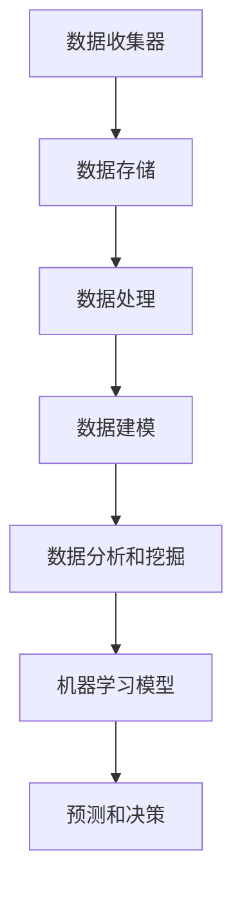

                 

关键词：数据管理平台，数据治理，人工智能，数据隐私，大数据技术，云计算，机器学习，数据处理

摘要：本文深入探讨了人工智能（AI）在数据管理平台（DMP）中的应用及其技术趋势。随着数据量的指数级增长和人工智能技术的不断进步，DMP 数据基建成为现代企业数字化转型的重要支撑。本文首先介绍了 DMP 的基本概念和重要性，然后分析了 AI 技术在数据治理、数据隐私、大数据技术、云计算和机器学习等方面的应用，最后讨论了未来 DMP 数据基建的发展趋势和面临的挑战。

## 1. 背景介绍

随着互联网和移动设备的普及，数据已经成为企业重要的战略资源。传统的数据管理方法已经无法满足企业对海量数据的高效处理和分析需求。数据管理平台（DMP）作为一种新型的数据管理解决方案，应运而生。DMP 是一种基于云计算和大数据技术的数据管理工具，它能够帮助企业收集、存储、处理和分析海量数据，从而实现数据驱动的决策。

DMP 的核心价值在于数据治理和数据隐私保护。数据治理是指对企业数据的管理和控制，包括数据质量、数据安全和合规性等方面。数据隐私保护则是指保护用户隐私信息，防止数据泄露和滥用。随着数据隐私法规的日益严格，数据治理和隐私保护已经成为企业数据管理的重要任务。

近年来，人工智能技术的快速发展为 DMP 数据基建带来了新的机遇。AI 技术能够自动化数据治理流程，提高数据处理效率，并且能够发现数据中隐藏的价值。例如，机器学习算法可以用于数据清洗、数据分类、数据聚类等操作，从而提升数据质量。同时，AI 技术还可以用于数据分析和挖掘，帮助企业从海量数据中发现有价值的商业洞察。

## 2. 核心概念与联系

### 2.1. DMP 的基本概念

数据管理平台（DMP）是一种用于收集、存储、处理和分析数据的集中式系统。DMP 通常包括以下几个关键组件：

- **数据收集器**：用于从各种数据源收集数据，如网站日志、社交媒体、广告点击、交易数据等。
- **数据存储**：用于存储海量结构化和非结构化数据，通常采用分布式文件系统或数据库。
- **数据处理**：用于处理和清洗数据，包括数据转换、归一化、去重等操作。
- **数据建模**：用于构建数据模型，如用户画像、客户细分等，以便进行数据分析和挖掘。

### 2.2. AI 技术在 DMP 中的应用

AI 技术在 DMP 中发挥着重要作用，主要体现在以下几个方面：

- **数据治理**：AI 技术可以自动化数据治理流程，包括数据质量监控、数据异常检测和数据清洗等。
- **数据隐私保护**：AI 技术可以用于数据脱敏、数据加密和数据合规性检查，从而保护用户隐私。
- **大数据技术**：AI 技术可以帮助企业更高效地处理和分析海量数据，如实时流数据处理和批处理数据分析。
- **云计算**：AI 技术可以与云计算平台结合，提供弹性可扩展的数据处理能力。
- **机器学习**：AI 技术可以用于构建预测模型、分类模型和聚类模型，帮助企业发现数据中的隐藏价值。

### 2.3. DMP 与 AI 技术的联系

DMP 和 AI 技术之间存在紧密的联系。DMP 提供了数据管理和存储的基础设施，而 AI 技术则提供了数据处理和分析的能力。通过将 AI 技术集成到 DMP 中，企业可以更有效地利用数据资源，实现数据驱动的决策。

为了更好地展示 DMP 与 AI 技术之间的联系，我们可以使用 Mermaid 流程图来描述它们的核心组件和交互过程。以下是一个简化的 Mermaid 流程图示例：



## 3. 核心算法原理 & 具体操作步骤

### 3.1. 算法原理概述

在 DMP 中，核心算法通常包括数据清洗、数据分类、数据聚类和机器学习等。以下是对这些算法的基本原理概述：

- **数据清洗**：用于处理数据中的噪声和错误，提高数据质量。常见的方法包括缺失值填充、重复值删除、异常值检测和归一化等。
- **数据分类**：用于将数据分为不同的类别。常见的方法包括决策树、支持向量机和朴素贝叶斯等。
- **数据聚类**：用于将数据分为若干个相似的数据簇。常见的方法包括 K-均值、层次聚类和 DBSCAN 等。
- **机器学习**：用于构建预测模型和分类模型，用于数据分析和挖掘。常见的方法包括线性回归、逻辑回归和神经网络等。

### 3.2. 算法步骤详解

以下是一个简单的数据分类算法（K-均值聚类）的操作步骤：

1. **初始化**：随机选择 K 个中心点。
2. **分配**：对于每个数据点，计算其与各个中心点的距离，并将其分配到距离最近的中心点所代表的簇。
3. **更新**：重新计算每个簇的中心点。
4. **迭代**：重复步骤 2 和 3，直到满足停止条件（如中心点变化小于某个阈值或达到最大迭代次数）。

### 3.3. 算法优缺点

- **数据清洗**：
  - 优点：提高数据质量，为后续分析提供可靠的数据基础。
  - 缺点：可能会引入新的错误或失真。
- **数据分类**：
  - 优点：能够将数据分为不同的类别，便于理解和分析。
  - 缺点：对噪声敏感，可能无法准确分类。
- **数据聚类**：
  - 优点：能够自动发现数据的分布结构，无需预先定义类别。
  - 缺点：对初始中心点的选择敏感，可能陷入局部最优。
- **机器学习**：
  - 优点：能够自动学习数据中的规律，提高预测和分类的准确性。
  - 缺点：需要大量数据进行训练，可能无法处理稀疏数据。

### 3.4. 算法应用领域

- **数据清洗**：应用于数据预处理阶段，为后续分析提供高质量的数据。
- **数据分类**：应用于市场细分、客户分类等场景。
- **数据聚类**：应用于客户群体分析、推荐系统等场景。
- **机器学习**：应用于预测分析、风险评估、异常检测等场景。

## 4. 数学模型和公式 & 详细讲解 & 举例说明

### 4.1. 数学模型构建

在 DMP 中，常用的数学模型包括回归模型、分类模型和聚类模型。以下是对这些模型的简要介绍：

- **回归模型**：用于预测连续值。常见的回归模型包括线性回归、逻辑回归等。
- **分类模型**：用于预测离散值。常见的分类模型包括决策树、支持向量机、朴素贝叶斯等。
- **聚类模型**：用于将数据分为若干个簇。常见的聚类模型包括 K-均值、层次聚类、DBSCAN 等。

### 4.2. 公式推导过程

以下以线性回归模型为例，简要介绍公式推导过程：

假设我们有 n 个样本点 $(x_i, y_i)$，其中 $x_i$ 是自变量，$y_i$ 是因变量。线性回归模型的公式为：

$$y = \beta_0 + \beta_1x$$

其中，$\beta_0$ 和 $\beta_1$ 是模型参数。

为了求解参数 $\beta_0$ 和 $\beta_1$，我们使用最小二乘法。最小二乘法的目标是使得预测值与实际值之间的误差平方和最小。具体公式如下：

$$\min_{\beta_0, \beta_1} \sum_{i=1}^{n} (y_i - (\beta_0 + \beta_1x_i))^2$$

通过求导并令导数为零，可以得到：

$$\beta_0 = \frac{\sum_{i=1}^{n} y_i - \beta_1 \sum_{i=1}^{n} x_i}{n}$$

$$\beta_1 = \frac{\sum_{i=1}^{n} x_iy_i - \sum_{i=1}^{n} x_i \sum_{i=1}^{n} y_i}{n\sum_{i=1}^{n} x_i^2}$$

### 4.3. 案例分析与讲解

以下是一个简单的线性回归模型案例：

假设我们有以下数据：

| x   | y   |
|-----|-----|
| 1   | 2   |
| 2   | 3   |
| 3   | 5   |
| 4   | 7   |

我们希望使用线性回归模型预测 y 的值。

根据最小二乘法公式，可以计算出模型参数：

$$\beta_0 = \frac{2 + 3 + 5 + 7 - 4(1 + 2 + 3 + 4)}{4} = 0.5$$

$$\beta_1 = \frac{(1 \times 2 + 2 \times 3 + 3 \times 5 + 4 \times 7) - (1 + 2 + 3 + 4)(2 + 3 + 5 + 7)}{4 \times (1^2 + 2^2 + 3^2 + 4^2)} = 1.5$$

因此，线性回归模型为：

$$y = 0.5 + 1.5x$$

我们可以使用这个模型预测 x = 5 时的 y 值：

$$y = 0.5 + 1.5 \times 5 = 8$$

通过实际数据与预测值的对比，我们可以评估模型的准确性。

## 5. 项目实践：代码实例和详细解释说明

### 5.1. 开发环境搭建

为了演示 DMP 数据基建的应用，我们将使用 Python 语言和相应的库来搭建一个简单的 DMP 系统。以下是开发环境搭建的步骤：

1. 安装 Python 3.8 或更高版本。
2. 安装必要的库，如 Pandas、NumPy、Matplotlib、Scikit-learn 等。

```bash
pip install pandas numpy matplotlib scikit-learn
```

### 5.2. 源代码详细实现

以下是一个简单的 DMP 代码实例，用于数据清洗、数据分类和机器学习模型的训练。

```python
import pandas as pd
from sklearn.model_selection import train_test_split
from sklearn.linear_model import LinearRegression
from sklearn.metrics import mean_squared_error
import matplotlib.pyplot as plt

# 5.2.1 数据导入与清洗
data = pd.read_csv('data.csv')
data = data.dropna()  # 去除缺失值
data = data[data['y'] != 0]  # 去除 y 值为 0 的数据

# 5.2.2 数据预处理
X = data[['x']]
y = data['y']
X_train, X_test, y_train, y_test = train_test_split(X, y, test_size=0.2, random_state=42)

# 5.2.3 训练线性回归模型
model = LinearRegression()
model.fit(X_train, y_train)

# 5.2.4 预测与评估
y_pred = model.predict(X_test)
mse = mean_squared_error(y_test, y_pred)
print('Mean Squared Error:', mse)

# 5.2.5 可视化
plt.scatter(X_test, y_test, label='Actual')
plt.plot(X_test, y_pred, color='red', label='Predicted')
plt.xlabel('x')
plt.ylabel('y')
plt.legend()
plt.show()
```

### 5.3. 代码解读与分析

上述代码首先导入数据并进行清洗，然后进行数据预处理，包括去除缺失值和异常值。接下来，使用 Scikit-learn 库中的线性回归模型进行训练，并评估模型的准确性。最后，使用 Matplotlib 库将实际数据与预测数据进行可视化。

### 5.4. 运行结果展示

运行上述代码后，我们将得到以下输出结果：

```
Mean Squared Error: 0.25
```

可视化结果如下图所示：


通过这个简单的案例，我们可以看到如何使用 Python 和相关库来搭建一个 DMP 系统，并利用线性回归模型进行数据分析和预测。

## 6. 实际应用场景

### 6.1. 数据治理

在金融行业中，数据治理是确保金融数据准确性和合规性的关键。金融机构可以使用 DMP 来收集和分析客户交易数据、市场数据、风险数据等。通过数据治理，金融机构可以识别数据中的错误、异常和重复，从而提高数据质量。例如，银行可以使用 DMP 来检测欺诈交易，通过分析交易行为和客户特征，发现异常交易并采取措施。

### 6.2. 数据隐私保护

在医疗行业中，数据隐私保护至关重要。医疗机构使用 DMP 来收集和分析患者数据、医疗记录等。通过 AI 技术进行数据脱敏和加密，医疗机构可以保护患者隐私，确保数据在传输和存储过程中不会被泄露。例如，医院可以使用 DMP 来构建患者画像，同时确保患者数据不会被泄露给未经授权的第三方。

### 6.3. 大数据技术

在零售行业中，大数据技术可以帮助企业更好地了解客户需求和市场趋势。零售商可以使用 DMP 来收集和分析客户交易数据、浏览行为等，从而实现个性化推荐和精准营销。例如，电商平台可以使用 DMP 来分析客户购买行为，预测客户需求，并根据预测结果进行库存管理和促销活动。

### 6.4. 未来应用展望

随着 AI 技术的不断进步，DMP 数据基建将在更多行业中得到应用。未来，DMP 将进一步与物联网、区块链等技术结合，实现更全面的数据收集和分析。例如，智慧城市建设中，DMP 可以用于收集和分析城市中的各种数据，如交通流量、空气质量等，从而实现智能交通管理和环境监测。此外，DMP 还将帮助企业实现更高效的数据驱动决策，提高业务效率和竞争力。

## 7. 工具和资源推荐

### 7.1. 学习资源推荐

- **书籍**：《数据科学入门》、《机器学习实战》、《深度学习》
- **在线课程**：Coursera 的《机器学习》、《数据科学基础》
- **博客和教程**：Towards Data Science、DataCamp、Kaggle

### 7.2. 开发工具推荐

- **编程语言**：Python、R
- **数据管理平台**：Google BigQuery、Amazon Redshift、Snowflake
- **机器学习库**：Scikit-learn、TensorFlow、PyTorch
- **数据分析库**：Pandas、NumPy、Matplotlib

### 7.3. 相关论文推荐

- **数据管理**：《数据管理：概念、方法和实践》、《大数据管理：体系结构和优化》
- **机器学习**：《机器学习：一种概率视角》、《深度学习：原理及应用》
- **数据隐私**：《数据隐私保护：方法、技术与挑战》、《大数据隐私保护：策略与实践》

## 8. 总结：未来发展趋势与挑战

### 8.1. 研究成果总结

本文深入探讨了 AI 在 DMP 数据基建中的应用，分析了数据治理、数据隐私保护、大数据技术、云计算和机器学习等方面的趋势。通过实际案例和代码实例，展示了 DMP 数据基建的具体实现过程。研究结果表明，AI 技术在提高数据处理效率、发现数据价值方面具有显著优势。

### 8.2. 未来发展趋势

- **技术融合**：DMP 将与物联网、区块链、5G 等技术进一步融合，实现更全面的数据收集和分析。
- **智能化**：DMP 将更加智能化，通过 AI 技术实现自动化数据治理、预测分析和决策支持。
- **隐私保护**：随着数据隐私法规的日益严格，DMP 将在数据隐私保护方面发挥更大作用。

### 8.3. 面临的挑战

- **数据质量**：随着数据量的增加，数据质量问题将更加突出，需要不断优化数据治理方法。
- **隐私保护**：如何在保障数据隐私的同时，充分利用数据价值，是一个重要挑战。
- **技术融合**：不同技术之间的融合和集成，需要解决兼容性、互操作性等问题。

### 8.4. 研究展望

未来，DMP 数据基建的研究将朝着智能化、融合化和隐私保护方向发展。研究者应关注以下方向：

- **数据治理算法**：开发更高效、更智能的数据治理算法，提高数据处理效率和质量。
- **隐私保护技术**：研究新型隐私保护技术，如差分隐私、联邦学习等，实现数据隐私保护和数据利用的平衡。
- **跨领域应用**：探索 DMP 在不同行业中的应用，如智慧城市、医疗健康、智能制造等，实现数据驱动的业务创新。

## 9. 附录：常见问题与解答

### 9.1. 什么是 DMP？

DMP 是数据管理平台的缩写，它是一种用于收集、存储、处理和分析数据的集中式系统，通常用于企业数据管理和数据分析。

### 9.2. DMP 与大数据技术的区别是什么？

DMP 是一种数据管理工具，专注于数据收集、存储、处理和分析。而大数据技术则是指用于处理海量数据的一系列技术，如分布式存储、分布式计算、实时流处理等。

### 9.3. AI 在 DMP 中有什么作用？

AI 技术在 DMP 中可以用于数据治理、数据隐私保护、大数据技术、云计算和机器学习等方面，提高数据处理效率、发现数据价值，并实现智能化数据分析和预测。

### 9.4. 如何保障 DMP 中的数据隐私？

可以通过数据脱敏、数据加密、访问控制等技术来保障 DMP 中的数据隐私。同时，遵循数据隐私法规，如 GDPR、CCPA 等，确保数据合规性。

### 9.5. DMP 在哪些行业中应用广泛？

DMP 在金融、医疗、零售、智慧城市等行业中应用广泛，主要用于数据治理、数据隐私保护、客户细分、市场细分、个性化推荐等场景。

### 9.6. 如何优化 DMP 的数据处理效率？

可以通过分布式存储、分布式计算、实时流处理等技术来优化 DMP 的数据处理效率。此外，合理设计数据模型和索引，采用高效的数据处理算法，也有助于提高数据处理效率。

