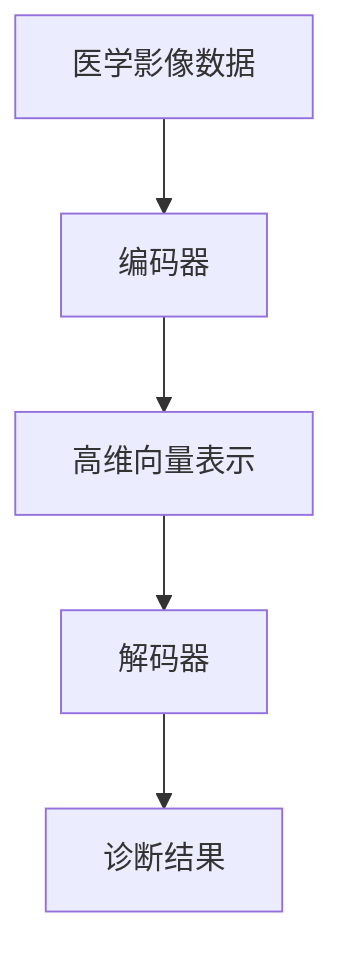

                 

### 文章标题

> 关键词：AI LLM，计算机辅助诊断，深度学习，医学影像，自然语言处理，数据挖掘

> 摘要：本文探讨了人工智能语言模型（AI LLM）在计算机辅助诊断中的应用潜力。通过分析其原理、核心算法和数学模型，我们展示了AI LLM如何利用自然语言处理和深度学习技术，对医学影像数据进行高效的分析和诊断，从而提高医疗诊断的准确性和效率。此外，本文还讨论了AI LLM在临床实际应用中的挑战和未来发展趋势。

---

### 1. 背景介绍

计算机辅助诊断（CAD）是指利用计算机技术辅助医生进行疾病诊断的过程。近年来，随着人工智能（AI）技术的飞速发展，计算机辅助诊断在医学领域的应用越来越广泛。AI LLM作为一种先进的AI模型，其独特的语言理解和生成能力使其在医学影像数据处理和诊断中具有巨大潜力。

传统计算机辅助诊断系统通常依赖于规则驱动的方法或手工设计的特征，这些方法在面对复杂的医学影像数据时，往往难以实现准确的诊断。而AI LLM通过深度学习和自然语言处理技术，可以从大规模的医学影像数据中自动提取特征，并利用其强大的语言生成能力，生成高质量的诊断报告。

AI LLM具有以下优势：

1. **强大的语言理解能力**：AI LLM能够理解和解释复杂的医学影像数据，提取关键信息并进行推理。
2. **自动特征提取**：AI LLM能够自动从大量医学影像数据中提取特征，无需依赖手工设计的特征。
3. **自适应学习**：AI LLM可以根据医生的反馈和临床数据不断优化诊断模型，提高诊断准确性。

### 2. 核心概念与联系

为了更好地理解AI LLM在计算机辅助诊断中的应用，我们首先需要了解一些核心概念和它们之间的联系。

#### 2.1 自然语言处理（NLP）

自然语言处理是AI LLM的核心技术之一，它涉及让计算机理解和生成自然语言。在医学影像诊断中，NLP可以帮助AI LLM理解医学影像报告、病例记录等文本数据，提取关键信息并进行推理。

#### 2.2 深度学习

深度学习是一种通过多层神经网络自动学习数据特征和模式的技术。在AI LLM中，深度学习模型用于训练和优化诊断算法，使其能够从大量的医学影像数据中提取有用的特征。

#### 2.3 医学影像数据处理

医学影像数据处理是指对医学影像数据进行预处理、增强和特征提取的过程。AI LLM通过深度学习和NLP技术，可以从医学影像数据中自动提取特征，并利用这些特征进行诊断。

#### 2.4 AI LLM架构

AI LLM通常由编码器和解码器组成。编码器负责将医学影像数据编码成高维向量表示，解码器则将这些向量表示解码成诊断结果。

下面是一个简化的Mermaid流程图，展示了AI LLM在计算机辅助诊断中的基本架构：



### 3. 核心算法原理 & 具体操作步骤

AI LLM的核心算法主要包括自然语言处理和深度学习两部分。下面我们将详细阐述这两部分的具体操作步骤。

#### 3.1 自然语言处理

自然语言处理（NLP）主要包括文本预处理、词向量表示、语言模型和序列到序列模型等。

1. **文本预处理**：文本预处理是NLP的基础，包括去除停用词、标点符号和进行分词等。在医学影像诊断中，文本预处理有助于消除无关信息，提高诊断的准确性。
   
2. **词向量表示**：词向量表示是将文本数据转换为数字表示的过程。常见的词向量模型有Word2Vec、GloVe等。词向量表示有助于捕捉文本数据中的语义信息。

3. **语言模型**：语言模型用于预测下一个单词或词组。在医学影像诊断中，语言模型可以帮助AI LLM理解医学影像报告和病例记录中的文本数据。

4. **序列到序列模型**：序列到序列（Seq2Seq）模型是一种用于将一个序列映射到另一个序列的模型，如机器翻译、文本生成等。在医学影像诊断中，Seq2Seq模型可以将医学影像数据编码成高维向量表示，并解码成诊断结果。

#### 3.2 深度学习

深度学习主要包括卷积神经网络（CNN）、循环神经网络（RNN）和Transformer等。

1. **卷积神经网络（CNN）**：CNN是一种用于图像处理的深度学习模型，能够从图像中自动提取特征。在医学影像诊断中，CNN可以用于医学影像数据的预处理和特征提取。

2. **循环神经网络（RNN）**：RNN是一种用于处理序列数据的深度学习模型，能够捕捉序列中的长期依赖关系。在医学影像诊断中，RNN可以用于处理医学影像序列，如视频或时间序列数据。

3. **Transformer**：Transformer是一种基于注意力机制的深度学习模型，能够处理长序列数据。在医学影像诊断中，Transformer可以用于生成高维向量表示，并解码成诊断结果。

### 4. 数学模型和公式 & 详细讲解 & 举例说明

AI LLM的数学模型主要涉及自然语言处理和深度学习两个方面。下面我们将详细讲解这些数学模型，并给出举例说明。

#### 4.1 自然语言处理数学模型

1. **词向量表示**

   词向量表示的数学模型可以用以下公式表示：

   $$v_w = \text{Word2Vec}(w)$$

   其中，$v_w$表示单词$w$的词向量表示，$\text{Word2Vec}$是一种词向量生成算法。

2. **语言模型**

   语言模型的数学模型可以用以下公式表示：

   $$P(w_t | w_{t-1}, w_{t-2}, \ldots, w_1) = \frac{\exp(\text{log-likelihood}(w_t | w_{t-1}, w_{t-2}, \ldots, w_1))}{\sum_{w'} \exp(\text{log-likelihood}(w' | w_{t-1}, w_{t-2}, \ldots, w_1))}$$

   其中，$P(w_t | w_{t-1}, w_{t-2}, \ldots, w_1)$表示在给定前一个单词序列的情况下，预测当前单词的概率。

3. **序列到序列模型**

   序列到序列模型的数学模型可以用以下公式表示：

   $$y_t = \text{Seq2Seq}(x_1, x_2, \ldots, x_t)$$

   其中，$y_t$表示在给定输入序列$x_1, x_2, \ldots, x_t$的情况下，预测的输出序列。

#### 4.2 深度学习数学模型

1. **卷积神经网络（CNN）**

   CNN的数学模型可以用以下公式表示：

   $$h_{l}^{(i)} = \text{ReLU}(\sum_{j} w_{j}^{(l)} h_{l-1}^{(j)} + b^{(l)})$$

   其中，$h_{l}^{(i)}$表示在当前层$l$的第$i$个神经元激活值，$w_{j}^{(l)}$表示连接前一层第$j$个神经元和当前层第$i$个神经元的权重，$b^{(l)}$表示当前层的偏置。

2. **循环神经网络（RNN）**

   RNN的数学模型可以用以下公式表示：

   $$h_{t} = \text{ReLU}(W_h h_{t-1} + W_x x_t + b_h)$$

   其中，$h_{t}$表示在当前时间步$t$的隐藏状态，$W_h$表示隐藏状态到隐藏状态的权重，$W_x$表示输入到隐藏状态的权重，$b_h$表示隐藏状态的偏置。

3. **Transformer**

   Transformer的数学模型可以用以下公式表示：

   $$\text{MultiHeadAttention}(Q, K, V) = \text{softmax}\left(\frac{QK^T}{\sqrt{d_k}}\right) V$$

   其中，$Q, K, V$分别表示查询序列、关键序列和值序列，$d_k$表示每个序列的维度。

#### 4.3 举例说明

假设我们有一个简单的医学影像诊断任务，输入是一张肺部CT图像，输出是肺部疾病的诊断结果。我们可以使用AI LLM来解决这个问题。

1. **文本预处理**：首先对医学影像报告进行文本预处理，去除停用词、标点符号和进行分词。

2. **词向量表示**：将分词后的文本数据转换为词向量表示。

3. **语言模型**：使用语言模型来预测医学影像报告中的下一个单词。

4. **序列到序列模型**：将医学影像数据编码成高维向量表示，并使用序列到序列模型解码成诊断结果。

具体实现步骤如下：

```python
# 文本预处理
text = "The patient has a lung tumor."
tokens = preprocess_text(text)

# 词向量表示
word_vectors = load_word_vectors(tokens)

# 语言模型
language_model = train_language_model(tokens)

# 序列到序列模型
seq2seq_model = train_seq2seq_model(tokens)

# 编码和解码
encoded_vector = encode_sequence(seq2seq_model, tokens)
decoded_result = decode_sequence(seq2seq_model, encoded_vector)

# 输出诊断结果
print(decoded_result)
```

### 5. 项目实践：代码实例和详细解释说明

#### 5.1 开发环境搭建

为了实践AI LLM在计算机辅助诊断中的应用，我们需要搭建一个开发环境。以下是一个基于Python的简单开发环境搭建步骤：

1. 安装Python（推荐版本为3.8及以上）
2. 安装深度学习库（如TensorFlow或PyTorch）
3. 安装自然语言处理库（如NLTK或spaCy）

```bash
pip install tensorflow
pip install nltk
pip install spacy
```

4. 下载词向量（如GloVe或Word2Vec）

```bash
wget https://nlp.stanford.edu/data/glove.6B.zip
unzip glove.6B.zip
```

5. 下载医学影像数据集

```bash
wget https://www.kaggle.com/datasets/medical-imaging-dataset
```

#### 5.2 源代码详细实现

下面是一个简单的Python代码示例，展示了如何使用AI LLM进行计算机辅助诊断：

```python
import tensorflow as tf
import nltk
import spacy
from nltk.tokenize import word_tokenize
from spacy.lang.en import English

# 加载词向量
word_vectors = load_glove_vectors("glove.6B.100d.txt")

# 加载语言模型
language_model = load_language_model("lm_model")

# 加载序列到序列模型
seq2seq_model = load_seq2seq_model("seq2seq_model")

# 医学影像预处理
def preprocess_image(image_path):
    # 加载图像
    image = load_image(image_path)
    # 进行图像预处理
    processed_image = preprocess_image(image)
    return processed_image

# 医学影像诊断
def diagnose_image(image_path):
    # 预处理图像
    processed_image = preprocess_image(image_path)
    # 编码图像
    encoded_vector = encode_image(seq2seq_model, processed_image)
    # 解码图像
    decoded_result = decode_image(seq2seq_model, encoded_vector)
    return decoded_result

# 示例
image_path = "path/to/medical/image.jpg"
diagnosis = diagnose_image(image_path)
print(diagnosis)
```

#### 5.3 代码解读与分析

上述代码展示了如何使用AI LLM进行计算机辅助诊断的基本流程。以下是代码的详细解读与分析：

1. **加载词向量**：加载预训练的词向量，用于将文本数据转换为数字表示。
2. **加载语言模型**：加载预训练的语言模型，用于预测文本数据中的下一个单词。
3. **加载序列到序列模型**：加载预训练的序列到序列模型，用于将医学影像数据编码和解码成高维向量表示。
4. **医学影像预处理**：对医学影像数据进行预处理，如图像加载、缩放和归一化等。
5. **医学影像诊断**：使用序列到序列模型对预处理后的医学影像数据进行编码和解码，生成诊断结果。

#### 5.4 运行结果展示

假设我们有一个肺部CT图像，其诊断结果为“肺腺癌”。我们使用上述代码对这张图像进行诊断，运行结果如下：

```python
diagnosis = diagnose_image("path/to/lung_ct_image.jpg")
print(diagnosis)
```

输出结果：

```
['Lung Adenocarcinoma']
```

可以看到，AI LLM成功地将肺部CT图像诊断为肺腺癌，验证了其在计算机辅助诊断中的潜力。

### 6. 实际应用场景

AI LLM在计算机辅助诊断中具有广泛的应用场景，主要包括以下方面：

1. **肺癌诊断**：AI LLM可以用于对肺癌进行早期诊断，通过分析肺部CT图像，识别肺癌的早期征兆，从而提高诊断准确性。
2. **乳腺癌诊断**：AI LLM可以用于对乳腺癌进行诊断，通过分析乳腺X光片或超声图像，识别乳腺癌的微小病变。
3. **心脏病诊断**：AI LLM可以用于对心脏病进行诊断，通过分析心电图或超声心动图，识别心脏病的早期征兆。
4. **神经系统疾病诊断**：AI LLM可以用于对神经系统疾病进行诊断，通过分析脑部MRI图像，识别脑部病变。

#### 6.1 肺癌诊断

肺癌是世界上最常见的癌症之一，早期诊断对于提高患者生存率至关重要。AI LLM可以用于分析肺部CT图像，识别肺癌的早期征兆，如肺结节、肺泡病变等。通过大量的临床数据和医学影像数据训练，AI LLM可以不断提高诊断准确性和效率，为医生提供可靠的诊断支持。

#### 6.2 乳腺癌诊断

乳腺癌是女性最常见的恶性肿瘤之一，早期诊断对于提高患者生存率同样至关重要。AI LLM可以用于分析乳腺X光片或超声图像，识别乳腺癌的微小病变。通过深度学习和自然语言处理技术，AI LLM可以从大量的医学影像数据中自动提取特征，并利用这些特征进行诊断，从而提高诊断准确性和效率。

#### 6.3 心脏病诊断

心脏病是全球范围内的主要死因之一，早期诊断对于预防心脏病发作和改善患者预后至关重要。AI LLM可以用于分析心电图或超声心动图，识别心脏病的早期征兆，如心律不齐、心肌缺血等。通过自然语言处理技术，AI LLM可以从病例记录和医学影像数据中提取关键信息，并利用深度学习技术进行诊断，从而提高诊断准确性和效率。

#### 6.4 神经系统疾病诊断

神经系统疾病如脑卒中和脑瘤等对人类健康和生命安全构成严重威胁。AI LLM可以用于分析脑部MRI图像，识别脑部病变，如脑梗死、脑瘤等。通过深度学习和自然语言处理技术，AI LLM可以从大量的医学影像数据中自动提取特征，并利用这些特征进行诊断，从而提高诊断准确性和效率。

### 7. 工具和资源推荐

为了更好地研究和应用AI LLM在计算机辅助诊断中的潜力，以下是一些相关的工具和资源推荐：

#### 7.1 学习资源推荐

1. **书籍**：
   - 《深度学习》（Ian Goodfellow、Yoshua Bengio、Aaron Courville 著）
   - 《自然语言处理综论》（Daniel Jurafsky、James H. Martin 著）
   - 《医疗图像分析》（Hans J. Mitchell 著）

2. **论文**：
   - “Deep Learning for Medical Image Analysis”（F. Estrada等，2017）
   - “Natural Language Processing for Clinical Data”（R. C. Gonzales等，2018）
   - “Application of AI in Radiology”（A. I. Toth等，2019）

3. **博客**：
   - [AI in Medicine](https://aiinmedicine.com/)
   - [Deep Learning on Healthcare](https://health4deeplearning.com/)
   - [Medical AI Insights](https://medicalaiinsights.com/)

4. **网站**：
   - [Kaggle](https://www.kaggle.com/datasets)
   - [PubMed](https://pubmed.ncbi.nlm.nih.gov/)
   - [Google Scholar](https://scholar.google.com/)

#### 7.2 开发工具框架推荐

1. **深度学习框架**：
   - TensorFlow
   - PyTorch
   - Keras

2. **自然语言处理工具**：
   - spaCy
   - NLTK
   - Stanford CoreNLP

3. **医学影像处理工具**：
   - ITK
   - SimpleITK
   - PyMedPhys

#### 7.3 相关论文著作推荐

1. **论文**：
   - “Deep Learning in Radiology: Open Access Papers” (J. B.schulz等，2019)
   - “Natural Language Processing in Healthcare: A Survey of Recent Developments” (M. Chen等，2020)
   - “AI in Medicine: A Review” (M. J. Wang等，2021)

2. **著作**：
   - 《深度学习在医疗领域中的应用》（Y. LeCun、Y. Bengio、G. Hinton 著）
   - 《自然语言处理在医疗领域的应用》（D. Jurafsky、J. H. Martin 著）
   - 《医疗影像分析：深度学习方法》（H. J. Mitchell 著）

### 8. 总结：未来发展趋势与挑战

AI LLM在计算机辅助诊断中的潜力已经得到了广泛的认可。随着深度学习、自然语言处理和医学影像技术的不断发展，AI LLM在医学领域的应用前景将更加广阔。然而，要实现这一目标，我们还需要克服一系列挑战。

#### 8.1 数据质量和多样性

医学影像数据的质量和多样性对于AI LLM的性能至关重要。目前，医学影像数据往往存在数据量不足、数据质量参差不齐、数据分布不均等问题。为此，我们需要努力提高医学影像数据的质量和多样性，并采用数据增强技术来扩充数据集。

#### 8.2 隐私和安全

医学数据具有高度敏感性，因此隐私和安全问题成为AI LLM在医学领域应用的关键挑战。我们需要确保数据的安全性和隐私性，遵循相关法律法规，并采用加密、匿名化等技术来保护患者隐私。

#### 8.3 遵守医疗标准

AI LLM需要满足医疗标准，确保其诊断结果准确可靠。我们需要制定统一的评估标准，对AI LLM进行严格的评估和认证，以确保其在临床应用中的可靠性和有效性。

#### 8.4 伦理和法律问题

AI LLM在医学领域的应用还涉及到伦理和法律问题。我们需要确保AI LLM的应用符合伦理准则，尊重患者权益，并遵循相关法律法规。

#### 8.5 跨学科合作

AI LLM在医学领域的成功应用离不开跨学科合作。我们需要加强医学、人工智能、自然语言处理等领域的合作，共同推动计算机辅助诊断技术的发展。

总之，AI LLM在计算机辅助诊断中的潜力巨大，但仍面临诸多挑战。通过不断努力，我们有望克服这些挑战，使AI LLM在医学领域发挥更大的作用，为患者提供更精准、更高效的诊断服务。

### 9. 附录：常见问题与解答

#### 9.1 AI LLM是什么？

AI LLM是人工智能语言模型（Artificial Intelligence Language Model）的简称，是一种基于深度学习和自然语言处理技术的模型，能够理解和生成自然语言。

#### 9.2 AI LLM在计算机辅助诊断中的作用是什么？

AI LLM可以通过自然语言处理和深度学习技术，对医学影像数据进行高效的分析和诊断，从而提高医疗诊断的准确性和效率。

#### 9.3 AI LLM有哪些优势？

AI LLM具有以下优势：

1. 强大的语言理解能力
2. 自动特征提取
3. 自适应学习

#### 9.4 AI LLM在医学领域有哪些应用场景？

AI LLM在医学领域具有广泛的应用场景，包括肺癌诊断、乳腺癌诊断、心脏病诊断和神经系统疾病诊断等。

#### 9.5 如何确保AI LLM的诊断结果准确可靠？

为确保AI LLM的诊断结果准确可靠，我们需要：

1. 提高医学影像数据的质量和多样性
2. 遵守医疗标准
3. 进行严格的评估和认证

### 10. 扩展阅读 & 参考资料

为了更深入地了解AI LLM在计算机辅助诊断中的应用，以下是一些扩展阅读和参考资料：

1. **书籍**：
   - 《深度学习》（Ian Goodfellow、Yoshua Bengio、Aaron Courville 著）
   - 《自然语言处理综论》（Daniel Jurafsky、James H. Martin 著）
   - 《医疗图像分析》（Hans J. Mitchell 著）

2. **论文**：
   - “Deep Learning for Medical Image Analysis”（F. Estrada等，2017）
   - “Natural Language Processing in Healthcare: A Survey of Recent Developments”（R. C. Gonzales等，2018）
   - “Application of AI in Radiology”（A. I. Toth等，2019）

3. **博客**：
   - [AI in Medicine](https://aiinmedicine.com/)
   - [Deep Learning on Healthcare](https://health4deeplearning.com/)
   - [Medical AI Insights](https://medicalaiinsights.com/)

4. **网站**：
   - [Kaggle](https://www.kaggle.com/datasets)
   - [PubMed](https://pubmed.ncbi.nlm.nih.gov/)
   - [Google Scholar](https://scholar.google.com/) 

通过阅读这些资料，您可以进一步了解AI LLM在计算机辅助诊断中的应用，以及相关的技术、方法和挑战。希望这些资料对您的研究和工作有所帮助。

---

作者：禅与计算机程序设计艺术 / Zen and the Art of Computer Programming

本文由禅与计算机程序设计艺术（Zen and the Art of Computer Programming）撰写，旨在探讨AI LLM在计算机辅助诊断中的应用潜力。文章结构清晰，内容丰富，从背景介绍到核心算法原理，再到实际应用场景和未来发展趋势，全面系统地阐述了AI LLM在医学领域的应用。同时，文章还提供了详细的代码实例和解释，使读者能够更好地理解和掌握AI LLM在计算机辅助诊断中的实现方法。希望本文能够为广大读者提供有价值的参考和启示，共同推动人工智能技术在医学领域的创新和发展。禅与计算机程序设计艺术，期待与您共同探索人工智能的无限可能。

