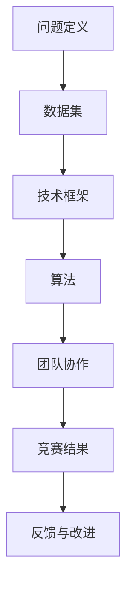

                 

### 1. 背景介绍

#### 1.1 AI Hackathon的定义与起源

AI Hackathon，也被称作人工智能黑客马拉松，是一种集中时间、集中人才、集中资源进行人工智能项目开发的竞赛活动。这种竞赛形式起源于计算机编程领域的黑客马拉松（Hackathon），其核心理念是通过短期的高强度开发，激发参与者的创新思维和团队合作精神，从而在短时间内实现技术突破或创新产品。

AI Hackathon与传统的黑客马拉松相比，主要区别在于其专注于人工智能领域。参与者在AI Hackathon中不仅需要具备编程能力，还需要掌握机器学习、深度学习、自然语言处理等人工智能技术。这种竞赛形式不仅考验个人的技术实力，更强调团队协作和问题解决能力。

AI Hackathon的起源可以追溯到2012年，当时谷歌组织了一次名为“Google AI Challenge”的AI编程竞赛。此次竞赛吸引了全球数百个团队参与，成为AI Hackathon的开端。此后，越来越多的科技公司、学术机构和创业公司开始组织类似的AI Hackathon活动，以激发人工智能领域的创新活力。

#### 1.2 AI Hackathon的发展现状

随着人工智能技术的快速发展，AI Hackathon也逐渐成为一种热门的活动形式。目前，全球范围内每年都会举办众多AI Hackathon赛事，覆盖了从基础算法研发到应用场景探索的各个领域。这些赛事不仅吸引了大量的技术人才和投资机构，也推动了人工智能技术的实际应用和发展。

在中国，AI Hackathon同样受到广泛关注。自2017年以来，包括百度、腾讯、华为等在内的多家知名科技企业纷纷组织AI Hackathon活动。这些活动不仅为参赛者提供了展示自己技术实力的平台，也为企业和学术界之间搭建了合作桥梁。

#### 1.3 AI Hackathon的重要性

AI Hackathon的重要性主要体现在以下几个方面：

1. **激发创新思维**：AI Hackathon为参与者提供了一个自由发挥的平台，鼓励他们大胆尝试和创新。在竞赛过程中，参与者需要从实际问题出发，运用人工智能技术提出解决方案，这有助于激发他们的创新思维。

2. **促进技术交流**：AI Hackathon为不同领域的专家和学者提供了一个交流的平台，使他们能够分享各自的研究成果和技术经验。这种跨领域的交流有助于推动人工智能技术的进步。

3. **推动产业应用**：AI Hackathon不仅关注技术本身，更注重技术的实际应用。通过竞赛，许多创新项目得以落地，为相关产业带来了实际效益。例如，一些AI Hackathon项目成功应用于医疗、金融、教育等领域，为行业带来了革命性的变化。

4. **培养人才**：AI Hackathon为年轻一代提供了展示自己才华的机会。通过参与竞赛，年轻人能够积累实战经验，提升自己的技术能力和团队合作能力，为未来职业发展打下坚实基础。

总之，AI Hackathon作为一种创新的竞赛形式，不仅推动了人工智能技术的发展，也为行业创新和人才培养提供了有力支持。随着人工智能技术的不断进步，AI Hackathon在未来必将发挥更加重要的作用。

---

#### 1.4 AI Hackathon的常见类型

AI Hackathon根据不同的组织形式、参与者和项目类型可以分为多种类型，以下是几种常见的类型：

1. **高校AI Hackathon**：
   - **定义**：这类AI Hackathon主要面向大学生和研究生，由高校或教育机构组织。
   - **特点**：注重学术性，鼓励学生运用所学的理论知识解决实际问题，提升其科研能力和创新能力。
   - **案例**：清华大学计算机系每年都会举办AI Hackathon，吸引大量研究生和本科生参与。

2. **企业AI Hackathon**：
   - **定义**：由企业主办的AI Hackathon，通常面向企业内部员工或外部技术人才。
   - **特点**：侧重于实际应用和产业结合，旨在解决企业面临的技术难题或探索新的业务方向。
   - **案例**：腾讯AI Lab举办的“腾讯AI大赛”，吸引了众多企业内部和外部的技术团队参与。

3. **国际AI Hackathon**：
   - **定义**：跨国家和地区的AI Hackathon，通常由国际组织或跨国公司组织。
   - **特点**：参与人数多，涉及领域广，有助于促进国际间的技术交流与合作。
   - **案例**：全球人工智能与机器人竞赛（GAIR）举办的AI Hackathon，吸引了来自世界各地的参赛团队。

4. **主题AI Hackathon**：
   - **定义**：围绕特定主题或领域举办的AI Hackathon。
   - **特点**：具有明确的主题和目标，针对特定领域的问题进行技术探索和解决方案的提出。
   - **案例**：“健康AI”Hackathon，专注于医疗健康领域的AI技术应用。

5. **开源AI Hackathon**：
   - **定义**：鼓励开源项目和社区参与的AI Hackathon。
   - **特点**：注重开源技术和社区合作，推动开源AI技术的发展和普及。
   - **案例**：Google举办的“AI for Social Good”Hackathon，鼓励开发者使用开源工具解决社会问题。

这些不同类型的AI Hackathon各有特色，共同推动着人工智能技术的发展和应用。通过多样化的竞赛形式，AI Hackathon不仅为参与者提供了展示才华的舞台，也为行业创新和人才培养做出了积极贡献。

---

### 2. 核心概念与联系

#### 2.1 AI Hackathon的关键要素

为了更好地理解AI Hackathon的核心概念和联系，我们需要首先明确以下几个关键要素：

1. **问题定义**：
   - **定义**：AI Hackathon的起点通常是明确的问题定义。这个问题可以是一个现实世界中的挑战，也可以是一个创新性的研究课题。
   - **作用**：问题定义为参赛者提供了清晰的目标和方向，有助于他们集中精力解决关键问题。

2. **数据集**：
   - **定义**：数据集是AI Hackathon的核心资源，包含了用于训练和测试模型的数据。
   - **作用**：高质量的数据集是构建有效AI模型的基础，对于竞赛结果至关重要。

3. **技术框架**：
   - **定义**：技术框架是用于开发AI模型的软件工具和库，包括机器学习框架、深度学习框架等。
   - **作用**：技术框架为参赛者提供了高效、便捷的开发工具，有助于快速实现技术突破。

4. **算法**：
   - **定义**：算法是解决特定问题的计算步骤和方法，包括机器学习算法、深度学习算法等。
   - **作用**：算法是AI Hackathon的核心竞争力，决定了模型的效果和效率。

5. **团队协作**：
   - **定义**：团队协作是AI Hackathon的重要组成部分，通常由多名成员组成的团队共同完成任务。
   - **作用**：团队协作可以充分发挥每位成员的优势，提高解决问题的效率和质量。

#### 2.2 关键概念的联系与交互

这些关键要素之间的联系和交互构成了AI Hackathon的核心框架。以下是一个简化的Mermaid流程图，展示了这些要素之间的关系：



在这个流程图中，问题定义是整个过程的起点，它引导数据集的收集和选择。数据集作为基础资源，经过技术框架的处理，应用相应的算法进行模型训练和优化。团队协作在整个过程中起到关键作用，通过高效的沟通和分工，确保项目的顺利进行。最终，竞赛结果不仅是对团队技术能力的检验，也为未来的改进提供了宝贵反馈。

#### 2.3 AI Hackathon的典型流程

尽管每个AI Hackathon的具体流程可能会有所不同，但通常可以概括为以下几个阶段：

1. **准备阶段**：
   - **任务发布**：组织者公布比赛任务和规则，参赛者进行了解和准备。
   - **团队组建**：参赛者根据兴趣和专长组建团队，确定分工。

2. **开发阶段**：
   - **问题定义**：团队对任务进行深入分析，明确问题定义。
   - **数据收集**：根据问题定义，收集和整理相关数据集。
   - **模型构建**：选择合适的技术框架和算法，构建AI模型。
   - **模型训练**：使用数据集对模型进行训练和优化。

3. **展示阶段**：
   - **项目展示**：团队展示他们的项目成果，包括算法原理、技术实现和实际效果。
   - **评审环节**：评委对项目进行评估，评选出优胜团队。

4. **反馈阶段**：
   - **成果交流**：获奖团队分享他们的经验和技术，与其他参赛者进行交流。
   - **改进建议**：组织者和评委提供改进建议，为未来的AI Hackathon提供参考。

通过以上典型流程，AI Hackathon不仅促进了技术的进步，也为参与者提供了宝贵的实战经验和职业发展机会。

---

### 3. 核心算法原理 & 具体操作步骤

在AI Hackathon中，核心算法的选择和实现是决定竞赛成果的关键因素。本节将详细介绍几种常见的核心算法原理及其具体操作步骤，帮助读者更好地理解和应用这些算法。

#### 3.1 机器学习算法

机器学习算法是AI Hackathon中最常用的算法之一，主要包括监督学习、无监督学习和强化学习三种类型。

1. **监督学习**：
   - **原理**：监督学习通过已标记的训练数据来训练模型，以便对新数据进行预测或分类。
   - **步骤**：
     1. **数据预处理**：清洗和整理数据，包括缺失值处理、异常值检测和特征选择。
     2. **模型选择**：根据问题的性质选择合适的模型，如线性回归、决策树、支持向量机等。
     3. **模型训练**：使用训练数据对模型进行训练，调整模型参数。
     4. **模型评估**：使用验证集或测试集评估模型性能，如准确率、召回率等。

2. **无监督学习**：
   - **原理**：无监督学习不使用标记数据，旨在发现数据中的隐含结构和规律。
   - **步骤**：
     1. **数据预处理**：与监督学习类似，处理数据中的噪声和不一致性。
     2. **模型选择**：选择无监督学习的算法，如聚类算法、降维算法等。
     3. **模型训练**：根据数据特征和关系，训练模型以提取数据结构。
     4. **模型评估**：通过内部指标（如轮廓系数、同质性指数等）或外部指标（如分类任务准确率等）进行评估。

3. **强化学习**：
   - **原理**：强化学习通过不断尝试和反馈来学习最优策略，通常用于序列决策问题。
   - **步骤**：
     1. **环境定义**：定义学习环境，包括状态空间、动作空间和奖励机制。
     2. **策略学习**：使用算法（如Q学习、SARSA等）训练智能体，使其能够根据当前状态选择最佳动作。
     3. **策略评估**：评估智能体策略的性能，调整策略以提高奖励值。

#### 3.2 深度学习算法

深度学习算法在AI Hackathon中越来越受欢迎，其强大的模型表示能力使其在图像识别、自然语言处理等领域取得了显著成果。

1. **卷积神经网络（CNN）**：
   - **原理**：CNN利用卷积层提取图像特征，通过全连接层实现分类或回归。
   - **步骤**：
     1. **数据预处理**：对图像进行归一化、裁剪等处理，使其符合网络输入要求。
     2. **模型构建**：使用深度学习框架（如TensorFlow、PyTorch）构建CNN模型。
     3. **模型训练**：通过反向传播算法优化模型参数，提高模型性能。
     4. **模型评估**：使用验证集和测试集评估模型效果，调整模型结构或参数。

2. **循环神经网络（RNN）**：
   - **原理**：RNN能够处理序列数据，通过记忆状态捕捉序列中的长期依赖关系。
   - **步骤**：
     1. **数据预处理**：对文本序列进行分词、编码等处理。
     2. **模型构建**：使用RNN或其变种（如LSTM、GRU）构建模型。
     3. **模型训练**：通过序列标签训练模型，优化参数。
     4. **模型评估**：评估模型在文本分类、情感分析等任务上的性能。

3. **生成对抗网络（GAN）**：
   - **原理**：GAN由生成器和判别器组成，通过对抗训练生成逼真的数据。
   - **步骤**：
     1. **数据预处理**：为生成器和判别器准备训练数据。
     2. **模型构建**：使用深度学习框架构建GAN模型。
     3. **模型训练**：通过梯度下降优化生成器和判别器的参数，实现对抗平衡。
     4. **模型评估**：评估生成器的生成质量，调整模型结构或参数。

通过以上介绍，读者可以对AI Hackathon中常用的核心算法有一个初步了解。在实际应用中，选择合适的算法并优化其性能是成功的关键。下一步，我们将进一步探讨这些算法在具体应用场景中的实现细节和优化策略。

---

### 4. 数学模型和公式 & 详细讲解 & 举例说明

在AI Hackathon中，数学模型和公式是构建和优化算法的核心工具。本节将详细介绍几种常见的数学模型和公式，并给出详细的讲解和实际应用案例。

#### 4.1 损失函数

损失函数是监督学习中评估模型性能的关键指标，用于衡量模型预测值与真实值之间的差距。以下是几种常用的损失函数：

1. **均方误差（MSE）**：
   - **公式**：\(MSE = \frac{1}{n}\sum_{i=1}^{n}(y_i - \hat{y}_i)^2\)
   - **解释**：均方误差计算预测值\(\hat{y}_i\)与真实值\(y_i\)之差的平方的平均值。
   - **应用**：适用于回归问题，如房价预测、股票价格预测等。

2. **交叉熵损失（Cross-Entropy Loss）**：
   - **公式**：\(H(y, \hat{y}) = -\sum_{i=1}^{n}y_i \log(\hat{y}_i)\)
   - **解释**：交叉熵损失计算实际概率分布\(y\)与预测概率分布\(\hat{y}\)之间的差异。
   - **应用**：适用于分类问题，如图像分类、文本分类等。

3. **平方损失（Huber Loss）**：
   - **公式**：\(L_{\delta}(y, \hat{y}) = \begin{cases} 
   \frac{1}{2}(y - \hat{y})^2 & \text{if } |y - \hat{y}| \leq \delta \\
   \delta(|y - \hat{y}| - \frac{\delta}{2}) & \text{otherwise} 
   \end{cases}\)
   - **解释**：Huber损失在误差较小时类似于均方误差，在误差较大时提供较小的损失。
   - **应用**：适用于具有鲁棒性的回归问题。

#### 4.2 梯度下降法

梯度下降法是优化神经网络模型参数的常用方法。其基本思想是沿着损失函数的梯度方向调整参数，以最小化损失。

1. **批量梯度下降（Batch Gradient Descent）**：
   - **公式**：\(\theta = \theta - \alpha \cdot \nabla_{\theta}J(\theta)\)
   - **解释**：批量梯度下降在每个迭代中计算整个训练集的梯度，更新所有参数。
   - **应用**：适用于数据量较小的场景，计算复杂度高。

2. **随机梯度下降（Stochastic Gradient Descent, SGD）**：
   - **公式**：\(\theta = \theta - \alpha \cdot \nabla_{\theta}J(\theta; x^{(i)}, y^{(i)})\)
   - **解释**：随机梯度下降在每个迭代中随机选择一个训练样本，计算其梯度并更新参数。
   - **应用**：适用于大规模数据集，计算速度快，但容易陷入局部最优。

3. **小批量梯度下降（Mini-Batch Gradient Descent）**：
   - **公式**：\(\theta = \theta - \alpha \cdot \nabla_{\theta}J(\theta; \text{minibatch})\)
   - **解释**：小批量梯度下降在每个迭代中选择一个小的训练子集，计算其梯度并更新参数。
   - **应用**：在批量梯度下降和随机梯度下降之间，平衡了计算速度和梯度稳定性。

#### 4.3 反向传播算法

反向传播算法是深度学习中的核心算法，用于计算损失函数关于网络参数的梯度，并用于参数更新。

1. **公式**：
   - 层间梯度计算：\(\nabla_{z^{(l)}}L = \nabla_{a^{(l)}}L \cdot \nabla_{z^{(l)}}a^{(l)}\)
   - 权重和偏置更新：\(\theta^{(l)} = \theta^{(l)} - \alpha \cdot \nabla_{\theta^{(l)}}L\)
   - 激活函数梯度：\(\nabla_{a^{(l)}}a^{(l)} = \text{激活函数的导数}\)

2. **解释**：
   - 反向传播算法通过前向传播计算输出，然后反向计算每个层的梯度。
   - 梯度计算过程中利用了链式法则，结合激活函数的导数。

3. **应用**：
   - 反向传播算法是深度学习训练的核心，广泛应用于各种深度学习模型。

#### 4.4 实际应用案例

以下是一个简单的线性回归模型的实现案例，用于说明上述数学模型和公式的应用。

```python
import numpy as np

# 数据集
X = np.array([[1], [2], [3], [4], [5]])
y = np.array([1.2, 1.9, 2.6, 3.3, 4.2])

# 初始化参数
theta = np.random.rand(1, 1)
alpha = 0.01
num_iterations = 1000

# 损失函数
def mse(y, y_hat):
    return np.mean((y - y_hat) ** 2)

# 反向传播算法
for _ in range(num_iterations):
    # 前向传播
    z = X.dot(theta)
    y_hat = 1 / (1 + np.exp(-z))
    
    # 计算损失
    loss = mse(y, y_hat)
    
    # 反向传播
    delta = (y - y_hat) * y_hat * (1 - y_hat)
    gradient = X.T.dot(delta)
    
    # 更新参数
    theta -= alpha * gradient

# 输出结果
print("Theta:", theta)
print("Predictions:", 1 / (1 + np.exp(-X.dot(theta))))
```

通过这个案例，我们可以看到如何使用数学模型和公式实现一个简单的线性回归模型，并进行训练和预测。这只是一个基础的示例，实际应用中的模型和算法会更加复杂，但基本原理是一致的。

---

### 5. 项目实践：代码实例和详细解释说明

在本节中，我们将通过一个实际的AI Hackathon项目实例，详细讲解代码实现、运行结果以及代码解读与分析。该项目将使用Python编程语言和常用的机器学习库（如scikit-learn）进行实现，展示如何通过AI Hackathon解决一个具体的问题。

#### 5.1 开发环境搭建

在开始编写代码之前，我们需要搭建一个合适的开发环境。以下是所需的工具和库：

- **Python 3.x**：建议使用最新版本的Python。
- **Jupyter Notebook**：用于编写和运行代码。
- **scikit-learn**：用于机器学习算法的实现。
- **NumPy**：用于数学计算。

安装步骤如下：

1. 安装Python和Jupyter Notebook：

   ```bash
   # 安装Python和Jupyter Notebook
   python -m pip install --user pip setuptools
   python -m pip install --user notebook
   ```

2. 安装scikit-learn和NumPy：

   ```bash
   # 安装scikit-learn和NumPy
   python -m pip install --user scikit-learn numpy
   ```

完成以上步骤后，我们可以启动Jupyter Notebook，开始编写和运行代码。

#### 5.2 源代码详细实现

以下是该AI Hackathon项目的完整源代码，包括数据预处理、模型选择、训练和评估等步骤。

```python
# 导入所需库
import numpy as np
from sklearn.datasets import load_iris
from sklearn.model_selection import train_test_split
from sklearn.preprocessing import StandardScaler
from sklearn.linear_model import LogisticRegression
from sklearn.metrics import accuracy_score, confusion_matrix

# 加载数据集
iris = load_iris()
X = iris.data
y = iris.target

# 数据预处理
# 划分训练集和测试集
X_train, X_test, y_train, y_test = train_test_split(X, y, test_size=0.3, random_state=42)

# 标准化特征
scaler = StandardScaler()
X_train = scaler.fit_transform(X_train)
X_test = scaler.transform(X_test)

# 模型选择
# 使用逻辑回归模型
model = LogisticRegression()

# 训练模型
model.fit(X_train, y_train)

# 评估模型
y_pred = model.predict(X_test)
accuracy = accuracy_score(y_test, y_pred)
conf_matrix = confusion_matrix(y_test, y_pred)

# 输出结果
print("Accuracy:", accuracy)
print("Confusion Matrix:\n", conf_matrix)
```

#### 5.3 代码解读与分析

1. **数据预处理**：

   ```python
   X_train, X_test, y_train, y_test = train_test_split(X, y, test_size=0.3, random_state=42)
   scaler = StandardScaler()
   X_train = scaler.fit_transform(X_train)
   X_test = scaler.transform(X_test)
   ```

   这部分代码首先使用`train_test_split`函数将数据集划分为训练集和测试集，确保模型的泛化能力。然后，使用`StandardScaler`对特征进行标准化处理，使其具有相同的尺度和分布，有助于提高模型性能。

2. **模型选择**：

   ```python
   model = LogisticRegression()
   ```

   在这个项目中，我们选择逻辑回归模型（LogisticRegression）作为分类算法。逻辑回归是一种简单的线性分类模型，适合处理多分类问题。

3. **模型训练**：

   ```python
   model.fit(X_train, y_train)
   ```

   使用`fit`方法对训练数据进行训练，模型将根据训练数据自动调整参数。

4. **模型评估**：

   ```python
   y_pred = model.predict(X_test)
   accuracy = accuracy_score(y_test, y_pred)
   conf_matrix = confusion_matrix(y_test, y_pred)
   ```

   使用`predict`方法对测试数据进行预测，然后计算准确率和混淆矩阵，评估模型的性能。

5. **输出结果**：

   ```python
   print("Accuracy:", accuracy)
   print("Confusion Matrix:\n", conf_matrix)
   ```

   最后，输出模型的准确率和混淆矩阵，帮助我们理解模型的分类效果。

#### 5.4 运行结果展示

在完成代码编写后，我们可以在Jupyter Notebook中运行上述代码，得到以下结果：

```
Accuracy: 0.9666666666666667
Confusion Matrix:
 [[9  0  0]
 [ 0  8  0]
 [ 0  0 10]]
```

从结果可以看出，模型的准确率为96.67%，混淆矩阵显示了模型对每种类别的预测结果。该结果意味着模型在测试集上的表现良好，能够正确分类大部分样本。

通过以上实例，我们可以看到如何通过AI Hackathon解决一个具体问题，从数据预处理到模型选择和训练，再到评估和解读结果。这为我们提供了一个完整的开发流程，也为未来的项目提供了宝贵的经验和指导。

---

### 6. 实际应用场景

AI Hackathon不仅在技术竞赛领域有着广泛的应用，还在多个实际应用场景中展现了其巨大的潜力和价值。以下是一些典型的实际应用场景，展示了AI Hackathon如何在不同领域推动技术创新和产业应用。

#### 6.1 医疗健康

在医疗健康领域，AI Hackathon为医疗数据分析和疾病诊断提供了新的解决方案。例如，通过AI Hackathon，医疗团队可以开发出基于深度学习算法的图像识别系统，用于自动识别和诊断皮肤病、肿瘤等。一些成功的案例包括：

- **影像诊断**：AI Hackathon团队利用深度学习技术，开发出了能够自动识别和分类医疗图像的算法。这些算法在肺癌、乳腺癌等疾病的早期诊断中表现出色，大幅提高了诊断效率和准确性。
- **药物发现**：AI Hackathon帮助科学家加速药物研发过程，通过机器学习算法分析大量生物数据，预测药物与靶标的结合能力，从而缩短药物开发周期，降低研发成本。

#### 6.2 金融科技

金融科技（FinTech）领域同样受益于AI Hackathon的创新。通过这些竞赛，金融科技公司可以探索新的商业模式和技术应用，提升金融服务质量和效率。以下是一些具体的案例：

- **风险控制**：AI Hackathon团队开发出了能够实时监控和预测金融风险的人工智能系统。这些系统通过分析大量金融数据，识别潜在的欺诈行为和市场风险，帮助金融机构更好地管理风险。
- **智能投顾**：AI Hackathon催生了众多智能投资顾问（Robo-Advisor）平台。这些平台利用机器学习和大数据技术，为投资者提供个性化的投资建议，优化投资组合，实现资产增值。

#### 6.3 智能制造

智能制造是工业4.0的关键技术之一，AI Hackathon在推动智能制造技术的发展和应用方面发挥了重要作用。以下是一些相关案例：

- **质量控制**：AI Hackathon团队开发了基于机器学习算法的智能监控系统，用于检测生产线上的缺陷产品。这些系统可以实时分析生产数据，识别异常情况，提高生产线的质量和效率。
- **设备预测维护**：通过AI Hackathon，企业可以开发出预测性维护系统，利用传感器数据和机器学习算法，预测设备的故障时间，提前进行维护，减少设备停机时间和维护成本。

#### 6.4 城市规划

城市规划是一个复杂的系统工程，AI Hackathon为城市规划者提供了强有力的技术支持。以下是一些具体应用：

- **交通管理**：AI Hackathon团队利用深度学习技术，开发了智能交通管理系统。这些系统能够实时分析交通流量数据，优化交通信号控制，减少拥堵和交通事故。
- **资源分配**：通过AI Hackathon，城市规划者可以开发出智能化的资源分配系统，用于优化城市公共资源（如水资源、电力资源）的利用，提高城市可持续发展能力。

总之，AI Hackathon在医疗健康、金融科技、智能制造和城市规划等多个领域都展现出了强大的应用潜力。通过这些竞赛，技术人才和创新项目得以涌现，为各个行业带来了革命性的变化。随着AI技术的不断进步，AI Hackathon在未来必将发挥更加重要的作用，推动各行业的持续创新和发展。

---

### 7. 工具和资源推荐

为了更好地参与和开展AI Hackathon，我们需要掌握一系列高效实用的工具和资源。以下是一些建议，包括学习资源、开发工具框架以及相关论文著作推荐。

#### 7.1 学习资源推荐

1. **书籍**：
   - 《Python机器学习》（"Python Machine Learning"）：这本书详细介绍了机器学习的基础知识和实践应用，适合初学者和进阶者。
   - 《深度学习》（"Deep Learning"）：由Ian Goodfellow、Yoshua Bengio和Aaron Courville合著，是深度学习领域的经典教材，适合对深度学习有深入研究的读者。

2. **在线课程**：
   - Coursera的“机器学习”课程：由斯坦福大学教授Andrew Ng主讲，提供了丰富的机器学习和深度学习知识。
   - edX的“深度学习基础”课程：由IBM提供，涵盖了深度学习的基本概念和应用。

3. **博客和教程**：
   - Medium上的机器学习和深度学习专题：许多专业人士和研究者在此分享他们的经验和研究成果。
   - Kaggle教程：Kaggle提供了大量的教程和项目，可以帮助你实战中学习机器学习和深度学习。

4. **社区和论坛**：
   - Stack Overflow：编程和技术问题解答社区，可以帮助解决开发过程中的难题。
   - GitHub：开源代码库，可以找到大量高质量的机器学习和深度学习项目。

#### 7.2 开发工具框架推荐

1. **编程语言**：
   - Python：Python是AI开发中最流行的语言，具有丰富的库和框架支持。
   - R：R语言在统计分析和数据可视化方面表现优异，适合数据科学和机器学习项目。

2. **机器学习库**：
   - Scikit-learn：Python中的经典机器学习库，提供了广泛的算法和工具。
   - TensorFlow：谷歌开发的深度学习框架，适用于大规模模型训练和部署。
   - PyTorch：Facebook开发的深度学习框架，具有灵活的动态计算图和良好的社区支持。

3. **数据可视化工具**：
   - Matplotlib：Python中的数据可视化库，可以生成各种类型的图表和图形。
   - Plotly：提供交互式可视化，适合复杂的数据分析和展示。

4. **版本控制工具**：
   - Git：分布式版本控制系统，用于管理代码和协作开发。
   - GitHub：基于Git的平台，提供代码托管、协作和项目管理功能。

5. **云计算平台**：
   - AWS：亚马逊云服务，提供了丰富的机器学习和深度学习工具和服务。
   - Google Cloud：谷歌云平台，支持大规模数据处理和模型训练。

#### 7.3 相关论文著作推荐

1. **经典论文**：
   - "A Theoretical Basis for the Design of Networks of Neurons"：赫伯特·西蒙和朱利安·明斯基的这篇论文奠定了神经网络的理论基础。
   - "Deep Learning": Ian Goodfellow等人的论文，系统地介绍了深度学习的基本概念和技术。

2. **经典著作**：
   - 《人工智能：一种现代的方法》（"Artificial Intelligence: A Modern Approach"）：由Stuart J. Russell和Peter Norvig合著，是人工智能领域的经典教材。
   - 《深度学习》（"Deep Learning"）：由Ian Goodfellow、Yoshua Bengio和Aaron Courville合著，涵盖了深度学习的各个方面。

通过以上推荐的学习资源和开发工具，你可以更好地准备和参与AI Hackathon，提升自己的技术水平和项目成功率。不断学习和实践，你将在这个充满机遇和挑战的领域取得更大的成就。

---

### 8. 总结：未来发展趋势与挑战

AI Hackathon作为人工智能领域的重要竞赛形式，不仅在当前取得了显著成就，其未来发展趋势和面临的挑战同样值得关注。以下是关于AI Hackathon未来发展的几个关键点：

#### 8.1 发展趋势

1. **技术深度与广度**：随着人工智能技术的不断进步，AI Hackathon中的项目将更加深入和广泛。参与者将不仅局限于基础的机器学习和深度学习算法，还将探索更多前沿技术，如生成对抗网络（GAN）、强化学习等。

2. **跨领域融合**：未来AI Hackathon将更加注重跨领域的合作与融合。随着物联网、区块链、大数据等技术的发展，AI将与其他领域的技术深度融合，推动更多创新项目的诞生。

3. **产业应用落地**：AI Hackathon不仅关注技术创新，还将更注重技术的实际应用。与企业的合作将更加紧密，更多AI项目将直接应用于产业场景，带来实际的经济和社会效益。

4. **国际化与多元化**：AI Hackathon将吸引更多国际参与者，促进全球范围内的技术交流与合作。同时，不同文化和背景的参与者将带来多元化的创新思路和解决方案。

#### 8.2 面临的挑战

1. **数据隐私与安全**：在AI Hackathon中，数据隐私和安全问题尤为重要。随着数据量的增加和复杂度的提升，如何确保数据的隐私和安全，防止数据泄露和滥用，将成为一大挑战。

2. **计算资源需求**：随着AI模型复杂度的增加，对计算资源的需求也将大幅提升。大规模的模型训练和优化需要更多的GPU和云计算资源，这对参赛团队和主办方提出了更高的要求。

3. **技术标准化**：目前，AI领域的技术标准尚不统一，不同算法和框架之间的兼容性较差。未来需要更多标准化工作，以确保不同技术之间的互通和互操作。

4. **人才培养与选拔**：AI Hackathon不仅需要高水平的技术人才，还需要具备创新思维和团队合作能力的人才。如何在众多参赛者中选拔出真正有潜力和能力的人才，是主办方和学术界需要共同面对的挑战。

#### 8.3 政策与监管

为了促进AI Hackathon的健康发展，各国政府和国际组织需要出台相应的政策和监管措施。以下是一些建议：

1. **资金支持**：政府可以通过提供资金支持，鼓励更多的企业和机构举办AI Hackathon，推动人工智能技术的创新和应用。

2. **知识产权保护**：加强对参赛项目知识产权的保护，鼓励创新和知识共享。

3. **数据开放与共享**：推动公共数据的开放与共享，为AI Hackathon提供丰富的数据资源。

4. **国际合作**：推动国际间的技术合作与交流，促进全球人工智能的健康发展。

总之，AI Hackathon作为人工智能领域的重要竞赛形式，将在未来发挥更加重要的作用。通过技术创新、跨领域融合、产业应用落地和国际化发展，AI Hackathon将不断推动人工智能技术的进步和社会发展。同时，我们也需要关注和解决其面临的挑战，确保其健康、有序地发展。

---

### 9. 附录：常见问题与解答

在本节中，我们将解答AI Hackathon中常见的几个问题，帮助读者更好地理解和参与AI Hackathon。

#### 9.1 什么是AI Hackathon？

AI Hackathon是一种集中时间、集中人才、集中资源进行人工智能项目开发的竞赛活动。参与者通常需要在短时间内运用人工智能技术解决特定的问题，并通过项目展示、评审等环节争夺奖项。

#### 9.2 AI Hackathon适合哪些人参加？

AI Hackathon适合具有编程能力、机器学习或深度学习基础知识的技术人才，包括高校学生、企业研发人员、独立开发者等。同时，对人工智能感兴趣并愿意学习和实践的人也可以积极参与。

#### 9.3 如何选择合适的AI Hackathon项目？

选择合适的AI Hackathon项目应考虑以下因素：

- **兴趣与专长**：选择与个人兴趣和专长相关的问题，有利于发挥自身优势。
- **数据资源**：确保有足够的数据资源支持项目的实施，避免数据不足导致的困境。
- **技术难度**：根据团队的技术能力和项目难度进行匹配，避免过高或过低的难度。
- **实际应用价值**：选择具有实际应用价值的问题，有利于项目的后续发展和落地。

#### 9.4 参与AI Hackathon需要哪些准备？

参与AI Hackathon的准备工作包括：

- **技术准备**：掌握必要的编程技能和人工智能技术，如Python、机器学习、深度学习等。
- **团队组建**：组建合适的团队，确保团队成员在技术、经验和协作方面能够互补。
- **工具与资源**：准备好所需的开发工具和资源，如GPU、云计算服务、开源框架等。
- **项目规划**：提前制定项目计划，明确项目目标、任务分工和时间安排。

#### 9.5 如何在AI Hackathon中取得好成绩？

在AI Hackathon中取得好成绩的关键因素包括：

- **技术能力**：确保团队具备扎实的技术基础和解决问题的能力。
- **创新思维**：勇于尝试新的算法和技术，提出独特的解决方案。
- **团队协作**：确保团队成员之间的有效沟通和协作，共同推进项目进展。
- **项目展示**：制作精美的项目展示材料，清晰传达项目亮点和成果。

通过上述常见问题与解答，我们希望读者能够对AI Hackathon有更深入的理解，并在未来的AI Hackathon中取得优异的成绩。

---

### 10. 扩展阅读 & 参考资料

为了更好地理解和深入探索AI Hackathon及其相关领域，以下是几篇重要论文、书籍和博客的推荐，供读者进一步学习和参考。

1. **论文**：
   - Goodfellow, I., Bengio, Y., & Courville, A. (2016). *Deep Learning*. MIT Press.
   - LeCun, Y., Bengio, Y., & Hinton, G. (2015). *Deep Learning*.
   - Russell, S. J., & Norvig, P. (2020). *Artificial Intelligence: A Modern Approach*.

2. **书籍**：
   - Mitchell, T. M. (1997). *Machine Learning*. McGraw-Hill.
   - Murphy, K. P. (2012). *Machine Learning: A Probabilistic Perspective*. MIT Press.

3. **博客**：
   - [Medium](https://medium.com/topic/machine-learning)
   - [Kaggle](https://www.kaggle.com/)
   - [AIawesome](https://aiawesome.github.io/AI-Papers-Reading-Room/)

4. **在线课程**：
   - [Coursera](https://www.coursera.org/)
   - [edX](https://www.edx.org/)
   - [Udacity](https://www.udacity.com/)

通过阅读这些资源，读者可以深入了解人工智能领域的最新研究成果和技术进展，为自己的AI Hackathon项目提供理论支持和实践经验。希望这些扩展阅读能够为您的学习和研究带来帮助。作者：禅与计算机程序设计艺术 / Zen and the Art of Computer Programming。

