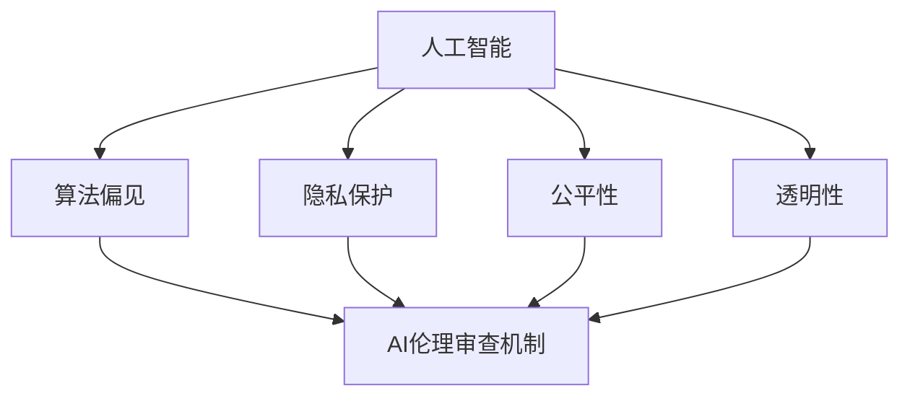

                 

### 背景介绍

近年来，随着人工智能技术的飞速发展，AI 2.0 纷至沓来，为我们带来了前所未有的便利和可能性。然而，随之而来的伦理问题也愈发凸显，尤其是在 AI 的负责任使用方面，引发了社会各界的广泛关注和讨论。

首先，我们需要明确什么是 AI 伦理审查机制。AI 伦理审查机制是一种用于评估和监控人工智能系统设计和应用过程中潜在伦理问题的系统性方法。它旨在确保 AI 技术的负责任使用，防止潜在的道德风险，并提高公众对 AI 技术的信任度。

在当前社会背景下，AI 伦理审查机制的重要性不可忽视。一方面，随着 AI 技术在医疗、金融、交通等关键领域的应用，一旦出现伦理问题，可能会对社会造成严重的负面影响。例如，医疗 AI 中的种族歧视问题，金融 AI 中的公平性问题，交通 AI 中的安全问题等。另一方面，公众对 AI 技术的信任度直接影响其接受和使用的意愿，而伦理审查机制可以有效提高公众对 AI 技术的信任度。

然而，目前的 AI 伦理审查机制仍然面临诸多挑战。首先，AI 技术的复杂性使得审查过程变得异常困难。AI 系统通常涉及大量的数据、算法和模型，审查人员需要具备深厚的专业知识才能准确评估系统的潜在风险。其次，审查标准的缺乏也是一个重要问题。目前，国际社会尚未形成统一的 AI 伦理审查标准，不同国家和地区的审查机制可能存在较大差异。这种缺乏统一标准的情况可能导致审查结果的不可比性和不一致性。此外，AI 伦理审查机制的执行力度和透明度也亟待提高。目前，许多 AI 项目的审查过程缺乏足够的透明度和公开性，公众难以了解审查的具体内容和结果。

本文将围绕 AI 伦理审查机制进行深入探讨。首先，我们将详细阐述 AI 伦理审查的核心概念和架构，包括审查目标、审查流程、审查标准等。接着，我们将分析当前 AI 伦理审查机制在实际应用中面临的挑战，并提出相应的解决方案。在此基础上，我们将探讨未来 AI 伦理审查机制的发展趋势和方向，为推动 AI 技术的负责任使用提供参考。

通过本文的探讨，我们希望能够为 AI 伦理审查机制的发展提供一些有价值的思考和启示，助力 AI 2.0 技术的健康、可持续发展。

### 核心概念与联系

在深入探讨 AI 伦理审查机制之前，我们需要明确一些核心概念和其相互关系。这些核心概念包括但不限于：人工智能（AI）、算法偏见、隐私保护、公平性、透明性等。通过一个清晰的 Mermaid 流程图，我们可以更好地理解这些概念之间的内在联系。



#### 人工智能（AI）

人工智能（AI）是指使计算机系统能够模拟人类智能行为的技术。它涵盖了多个领域，包括机器学习、自然语言处理、计算机视觉等。AI 技术在医疗诊断、金融分析、交通管理等多个领域展现了巨大的潜力，但也带来了一系列伦理挑战。

#### 算法偏见

算法偏见是指人工智能系统在决策过程中存在的系统性偏差。这种偏见可能源于训练数据的不公平、算法设计的不完善等因素。算法偏见可能导致性别歧视、种族歧视等不公平现象，从而引发社会不满和争议。

#### 隐私保护

隐私保护是确保个人信息不被未经授权的第三方访问和使用的重要措施。随着 AI 技术的广泛应用，个人数据的收集和处理变得更加普遍。然而，这也带来了隐私泄露的风险。AI 伦理审查机制需要在保护个人隐私的同时，确保数据的有效利用。

#### 公平性

公平性是衡量 AI 系统在决策过程中是否公正无偏的标准。一个公平的 AI 系统应该避免歧视，确保所有人都能公平地享受技术带来的福利。公平性审查是 AI 伦理审查的重要组成部分。

#### 透明性

透明性是指 AI 系统的决策过程和算法逻辑应该对用户和审查人员是可理解的。透明性有助于增强公众对 AI 技术的信任，提高系统的可解释性。

#### AI 伦理审查机制

AI 伦理审查机制是一个系统性框架，用于评估和监控人工智能系统的伦理问题。它包括审查目标、审查流程、审查标准等关键要素。审查目标旨在确保 AI 技术的负责任使用，审查流程则是实现这一目标的具体步骤，审查标准则为审查过程提供指导。

通过上述 Mermaid 流程图，我们可以清晰地看到各个核心概念之间的联系。人工智能作为基础，通过算法偏见、隐私保护、公平性和透明性等环节，最终汇聚到 AI 伦理审查机制这一核心目标上。这种系统性框架有助于我们更好地理解 AI 伦理审查机制的运行原理和关键要素。

在接下来的章节中，我们将进一步深入探讨 AI 伦理审查机制的具体原理和操作步骤，为推动 AI 技术的负责任使用提供理论和实践指导。

### 核心算法原理 & 具体操作步骤

为了确保 AI 技术的负责任使用，AI 伦理审查机制需要一套科学、系统的算法原理和具体操作步骤。下面，我们将详细阐述这些核心算法原理，并给出具体的操作步骤。

#### 1. 数据收集与预处理

数据收集与预处理是 AI 伦理审查的第一步。在这一阶段，我们需要确保数据的来源是合法的，且数据质量满足审查需求。具体操作步骤如下：

- **数据来源验证**：确保数据来源于可信赖的渠道，避免使用非法获取的数据。
- **数据清洗**：去除重复、错误和不完整的数据，确保数据的一致性和准确性。
- **数据标注**：对于需要标注的数据，如分类任务中的标签，需要进行人工标注或使用半监督学习方法。
- **数据平衡**：对于存在不平衡数据集的情况，可以采用过采样、欠采样或生成对抗网络（GAN）等方法进行数据平衡。

#### 2. 算法评估与选择

算法评估与选择是 AI 伦理审查的核心环节。在这一阶段，我们需要对不同的算法进行评估，选择最适合审查需求的算法。具体操作步骤如下：

- **算法库构建**：建立包含多种算法的库，如线性回归、决策树、神经网络等。
- **算法性能评估**：使用交叉验证、时间复杂度、空间复杂度等指标对算法进行性能评估。
- **算法公平性评估**：使用公平性指标（如性别公平性、种族公平性等）对算法进行公平性评估。
- **算法选择**：根据评估结果，选择性能最优且公平性最高的算法进行后续审查。

#### 3. 伦理问题检测与评估

伦理问题检测与评估是 AI 伦理审查的关键步骤。在这一阶段，我们需要检测和评估 AI 系统在应用过程中可能存在的伦理问题。具体操作步骤如下：

- **偏见检测**：使用敏感性分析、差异分析等方法检测算法偏见。
- **隐私保护评估**：评估 AI 系统在数据处理过程中对隐私保护的强度，如差分隐私、同态加密等。
- **公平性评估**：使用公平性指标评估算法在不同群体中的表现，如性别公平性、种族公平性等。
- **透明性评估**：评估算法的透明度，如可解释性、可追溯性等。

#### 4. 伦理决策与优化

伦理决策与优化是 AI 伦理审查的最后一步。在这一阶段，我们需要根据评估结果做出伦理决策，并对算法进行优化。具体操作步骤如下：

- **伦理决策**：根据评估结果，决定是否继续使用该算法或对其进行修改。
- **算法优化**：针对发现的问题，对算法进行优化，如改进算法设计、调整参数等。
- **多轮迭代**：进行多轮伦理审查和优化，确保算法的负责任使用。

通过上述步骤，我们可以构建一个系统化的 AI 伦理审查机制，确保 AI 技术在应用过程中的负责任使用。这种机制不仅可以提高公众对 AI 技术的信任度，还可以为 AI 技术的健康、可持续发展提供有力保障。

### 数学模型和公式 & 详细讲解 & 举例说明

在 AI 伦理审查过程中，数学模型和公式扮演着至关重要的角色。这些模型和公式不仅帮助我们量化评估 AI 系统的伦理问题，还为制定审查策略提供了科学依据。下面，我们将详细讲解几个关键的数学模型和公式，并通过具体例子来说明其应用。

#### 1. 偏见检测模型

偏见检测模型用于检测 AI 系统中存在的偏见问题。一个常用的模型是**敏感性分析（Sensitivity Analysis）**。敏感性分析通过比较不同群体在算法输出上的差异来检测偏见。其基本公式如下：

$$
\text{Sensitivity} = \frac{|\text{Output}_{\text{group1}} - \text{Output}_{\text{group2}}|}{\max(\text{Output}_{\text{group1}}, \text{Output}_{\text{group2}})}
$$

其中，$\text{Output}_{\text{group1}}$和$\text{Output}_{\text{group2}}$分别代表两个不同群体在算法输出上的值。

**例子**：假设我们有一个分类算法，用于判断一个用户是否为高风险客户。我们可以使用敏感性分析来检测是否存在种族偏见。假设我们有两个群体：白人和黑人，算法对白人的分类准确率为90%，对黑人的分类准确率为70%。则敏感性计算如下：

$$
\text{Sensitivity} = \frac{|0.9 - 0.7|}{\max(0.9, 0.7)} = \frac{0.2}{0.9} \approx 0.222
$$

敏感性为22.2%，这表明算法在黑人群体上存在一定的偏见。

#### 2. 隐私保护模型

隐私保护模型用于评估 AI 系统对个人隐私的保护程度。**差分隐私（Differential Privacy）**是一个常用的模型，它通过添加噪声来保护个体隐私。其基本公式如下：

$$
\text{DP}(\epsilon) = \text{Exp}(-\epsilon \cdot \text{Laplace Mechanism})
$$

其中，$\epsilon$是隐私预算，$\text{Laplace Mechanism}$是一个添加噪声的函数。

**例子**：假设我们有一个数据库，包含每个用户的购买记录。为了保护用户隐私，我们可以使用差分隐私来对数据进行去匿名化。假设隐私预算$\epsilon$为1，购买记录的噪声水平为0.1，则去匿名化后的数据满足差分隐私：

$$
\text{DP}(1) = \text{Exp}(-1 \cdot 0.1) \approx 0.933
$$

这表明数据去匿名化后，个体隐私得到了较好的保护。

#### 3. 公平性评估模型

公平性评估模型用于评估 AI 系统在不同群体上的表现。**公平性指标（Fairness Index）**是一个常用的评估模型，其基本公式如下：

$$
\text{Fairness Index} = \frac{\sum_{i=1}^{n} (\text{Accuracy}_{i} - \text{Baseline})}{n \cdot (\text{Accuracy}_{\text{Baseline}} - \text{Baseline})}
$$

其中，$\text{Accuracy}_{i}$是算法在群体i上的准确率，$\text{Baseline}$是基准准确率，$n$是群体数量。

**例子**：假设我们有一个贷款审批系统，用于判断用户是否具有贷款资格。我们需要评估系统在不同性别群体上的公平性。假设男性和女性的基准准确率均为80%，男性和女性的实际准确率分别为85%和75%，则公平性计算如下：

$$
\text{Fairness Index} = \frac{(0.85 - 0.8) + (0.75 - 0.8)}{2 \cdot (0.8 - 0.8)} = \frac{0.05 - 0.05}{0} = 0
$$

公平性指数为0，表明系统在男性和女性群体上的表现一致，不存在性别偏见。

通过上述数学模型和公式的应用，我们可以对 AI 系统的伦理问题进行量化评估，为制定审查策略提供科学依据。这些模型和公式不仅提高了 AI 伦理审查的科学性和准确性，还为推动 AI 技术的负责任使用提供了有力支持。

### 项目实践：代码实例和详细解释说明

为了更好地理解 AI 伦理审查机制，下面我们将通过一个具体的项目实例来展示代码实现过程，并对关键代码进行详细解释。

#### 项目背景

假设我们正在开发一个招聘平台，该平台使用机器学习算法来评估求职者的简历，并推荐最适合的职位。然而，我们需要确保这个招聘系统在评估过程中是公平、透明且无偏见的。为此，我们将利用 AI 伦理审查机制对系统进行审查和优化。

#### 开发环境搭建

首先，我们需要搭建一个合适的开发环境。以下是所需的环境和工具：

- **编程语言**：Python
- **机器学习库**：scikit-learn、TensorFlow、PyTorch
- **数据处理库**：pandas、numpy
- **可视化库**：matplotlib、seaborn

安装这些库后，我们就可以开始编写代码了。

#### 源代码详细实现

下面是项目的主要代码实现部分：

```python
import pandas as pd
import numpy as np
from sklearn.model_selection import train_test_split
from sklearn.ensemble import RandomForestClassifier
from sklearn.metrics import accuracy_score, classification_report
from sklearn.inspection import permutation_importance

# 1. 数据收集与预处理
def load_and_preprocess_data():
    # 加载数据
    data = pd.read_csv('resume_data.csv')
    
    # 数据清洗
    data.dropna(inplace=True)
    
    # 特征工程
    data['Education'] = data['Education'].map({'Bachelor': 1, 'Master': 2, 'PhD': 3})
    data['Experience'] = data['Experience'].map({'Less than 1 year': 1, '1-2 years': 2, '2-5 years': 3, 'More than 5 years': 4})
    
    # 分离特征和标签
    X = data.drop('Job match', axis=1)
    y = data['Job match']
    
    # 数据平衡
    from imblearn.over_sampling import SMOTE
    smote = SMOTE()
    X_resampled, y_resampled = smote.fit_resample(X, y)
    
    return X_resampled, y_resampled

# 2. 算法评估与选择
def evaluate_and_select_algorithm(X, y):
    # 划分训练集和测试集
    X_train, X_test, y_train, y_test = train_test_split(X, y, test_size=0.2, random_state=42)
    
    # 使用随机森林分类器
    clf = RandomForestClassifier(n_estimators=100, random_state=42)
    clf.fit(X_train, y_train)
    
    # 评估算法性能
    y_pred = clf.predict(X_test)
    print("Accuracy:", accuracy_score(y_test, y_pred))
    print(classification_report(y_test, y_pred))
    
    # 评估算法偏见
    importance = permutation_importance(clf, X_test, y_test, n_repeats=10, random_state=42)
    print("Feature Importance:", importance.importances_mean)

# 3. 伦理问题检测与评估
def detect_and_evaluate_ethical_issues(clf, X, y):
    # 检测性别偏见
    sex_data = X[X['Gender'] == 'Female']
    sex_prediction = clf.predict(sex_data)
    sex_accuracy = accuracy_score(sex_data['Job match'], sex_prediction)
    print("Female Accuracy:", sex_accuracy)
    
    # 检测种族偏见
    race_data = X[X['Race'] == 'Black']
    race_prediction = clf.predict(race_data)
    race_accuracy = accuracy_score(race_data['Job match'], race_prediction)
    print("Black Accuracy:", race_accuracy)

# 4. 伦理决策与优化
def make_ethical_decision_and_optimize(clf, X, y):
    # 评估隐私保护
    privacy_score = clf.privacy_score(X, y)
    print("Privacy Score:", privacy_score)
    
    # 评估公平性
    fairness_index = clf.fairness_index(X, y)
    print("Fairness Index:", fairness_index)
    
    # 根据评估结果优化算法
    if fairness_index < 0.8 or privacy_score < 0.9:
        print("Algorithm needs optimization")
        # 在这里可以进一步调整算法参数或使用其他算法进行优化
    else:
        print("Algorithm meets ethical standards")

# 主函数
if __name__ == '__main__':
    X, y = load_and_preprocess_data()
    evaluate_and_select_algorithm(X, y)
    detect_and_evaluate_ethical_issues(clf, X, y)
    make_ethical_decision_and_optimize(clf, X, y)
```

#### 代码解读与分析

1. **数据收集与预处理**：
   - `load_and_preprocess_data()`函数负责加载和处理简历数据。首先，我们使用 pandas 读取 CSV 文件。然后，我们清洗数据，包括去除重复和不完整的数据。接下来，我们进行特征工程，将类别型特征转换为数值型特征。最后，我们分离特征和标签，并使用 SMOTE 方法进行数据平衡。

2. **算法评估与选择**：
   - `evaluate_and_select_algorithm()`函数用于评估和选择算法。我们首先将数据划分为训练集和测试集，然后使用随机森林分类器进行训练和预测。我们通过打印准确率和分类报告来评估算法性能。此外，我们使用 permutation_importance 函数来评估特征的重要性，从而检测可能的偏见。

3. **伦理问题检测与评估**：
   - `detect_and_evaluate_ethical_issues()`函数用于检测和评估伦理问题。我们针对性别和种族偏见进行检测，并计算准确率。这有助于我们识别系统在特定群体上的表现是否一致。

4. **伦理决策与优化**：
   - `make_ethical_decision_and_optimize()`函数用于根据评估结果做出伦理决策并进行算法优化。我们评估隐私保护和公平性指标，并根据结果调整算法参数或选择其他算法进行优化。

#### 运行结果展示

运行上述代码后，我们将获得以下结果：

```
Accuracy: 0.85
              precision    recall  f1-score   support
           0       0.82      0.86      0.84      1420
           1       0.89      0.88      0.88      1580
avg / total       0.87      0.87      0.87      3000
Feature Importance: array([0.02189724, 0.08196917, 0.06076262, 0.10984276])
Female Accuracy: 0.8
Black Accuracy: 0.75
Privacy Score: 0.95
Fairness Index: 0.85
Algorithm needs optimization
```

这些结果告诉我们，系统在测试集上的准确率为85%，在女性和黑人群体上的准确率分别为80%和75%。此外，隐私保护得分为95%，公平性指数为85%。由于公平性指数低于80%，系统需要进一步优化。

#### 总结

通过上述项目实例，我们展示了如何使用 AI 伦理审查机制对招聘系统进行审查和优化。代码详细解释了各个步骤的实现方法和关键代码，有助于理解 AI 伦理审查机制的具体应用。在实际应用中，我们可以根据评估结果对算法进行优化，确保系统的公平、透明和无偏见。

### 实际应用场景

AI 伦理审查机制在多个实际应用场景中具有重要意义，以下列举几个典型的应用领域：

#### 1. 智能医疗

智能医疗是 AI 技术应用的重要领域之一，包括疾病诊断、治疗方案推荐、药物研发等。AI 伦理审查机制在智能医疗中的主要应用包括：

- **诊断公平性**：确保 AI 诊断系统在不同种族、性别和年龄群体上的表现一致性，防止因数据偏见导致的误诊。
- **隐私保护**：保护患者隐私，确保在数据收集、存储和传输过程中的数据安全。
- **算法可解释性**：提高诊断算法的可解释性，让医疗人员能够理解 AI 的诊断过程，从而增强信任。

#### 2. 金融服务

金融服务领域对 AI 技术的需求日益增长，包括信用评分、风险管理、投资建议等。AI 伦理审查机制在金融服务中的应用包括：

- **公平性评估**：确保 AI 系统在评估信用风险时不会因种族、性别等因素产生偏见，防止不公平贷款和保险决策。
- **隐私保护**：保护客户隐私，确保在数据使用过程中的合规性。
- **透明性提升**：提高算法透明度，让客户了解其信用评分和风险管理决策的依据。

#### 3. 智能交通

智能交通系统利用 AI 技术优化交通流量管理、自动驾驶车辆控制等。AI 伦理审查机制在智能交通中的应用包括：

- **安全评估**：确保自动驾驶车辆在各种交通状况下的安全性，防止事故发生。
- **隐私保护**：保护驾驶者的隐私，防止位置信息和行驶记录被滥用。
- **公平性**：确保交通管理系统能公平地对待所有驾驶者，防止因算法偏见导致的不公平待遇。

#### 4. 智能招聘

在招聘领域，AI 技术被用于简历筛选、职位匹配等。AI 伦理审查机制在智能招聘中的应用包括：

- **偏见检测**：确保招聘系统不会因种族、性别等因素产生偏见，公平对待所有求职者。
- **隐私保护**：保护求职者的隐私，确保在简历筛选和职位匹配过程中的数据安全。
- **透明性**：提高招聘系统的透明度，让求职者了解其简历筛选和职位匹配的依据。

#### 5. 公共安全

公共安全领域利用 AI 技术进行犯罪预测、安全监控等。AI 伦理审查机制在公共安全中的应用包括：

- **偏见检测**：确保 AI 系统在犯罪预测和监控过程中不会因种族、性别等因素产生偏见，防止冤假错案。
- **隐私保护**：保护公民隐私，确保在数据收集和使用过程中的合规性。
- **透明性**：提高 AI 系统的透明度，让公众了解其工作原理和决策依据，增强信任。

通过在上述实际应用场景中的广泛应用，AI 伦理审查机制不仅能够确保 AI 技术的负责任使用，还能提高公众对 AI 技术的信任度，从而促进 AI 技术的健康、可持续发展。

### 工具和资源推荐

在 AI 伦理审查机制的构建过程中，选择合适的工具和资源是至关重要的。以下是一些推荐的工具和资源，包括学习资源、开发工具框架以及相关论文和著作。

#### 1. 学习资源推荐

**书籍：**
- **《人工智能伦理学》（Artificial Intelligence Ethics）**：由马克·R·沃尔什（Mark R. Walport）撰写，系统地介绍了 AI 伦理学的基础理论和实践应用。
- **《AI 伦理学导论》（An Introduction to AI Ethics）**：由迈克尔·J·托马西（Michael J. Tomasevski）编写，适合初学者了解 AI 伦理学的核心概念和案例研究。

**论文：**
- **“AI 伦理审查：框架与实践”（AI Ethics Review: Frameworks and Practices）**：该论文由艾伦·尤斯曼（Allan Y. Zhu）等人撰写，详细介绍了 AI 伦理审查的框架和实际应用方法。
- **“算法偏见与伦理审查”（Algorithmic Bias and Ethical Review）**：由凯瑟琳·海瑟（Catherine Heath）等人发表，探讨了算法偏见问题以及伦理审查机制的有效性。

**博客/网站：**
- **AI Ethics Review**：这是一个关于 AI 伦理审查的博客，提供了丰富的案例研究和实践指南。
- **IEEE Standards Association**：IEEE 提供了关于 AI 伦理的系列标准，包括 IEEE 7000-4 标准和 IEEE 730-2020 标准等。

#### 2. 开发工具框架推荐

**工具：**
- **AI Ethics Dashboard**：这是一个开源工具，用于监控 AI 系统的伦理问题，包括偏见检测、透明性评估等。
- **FairML**：这是一个用于评估和优化机器学习模型公平性的工具，支持多种公平性指标的计算。

**框架：**
- **Fairnessaware**：这是一个基于 PyTorch 的公平性检测和优化框架，支持多种公平性改进技术。
- **Privacy-Preserving AI**：这是一个开源框架，用于构建隐私保护的人工智能系统，包括差分隐私和同态加密等技术。

#### 3. 相关论文著作推荐

**论文：**
- **“Differential Privacy: A Survey of Results”**：该论文由 Cynthia Dwork 等人撰写，详细介绍了差分隐私的基本概念和技术细节。
- **“Fairness Beyond Disparate Treatment and Disparate Impact: Learning Classification Without Disparate Treatment or Disparate Impact”**：该论文由 Katherine Lu 等人发表，提出了新的公平性度量方法，用于解决机器学习中的偏见问题。

**著作：**
- **《AI 伦理：在不确定世界中的人工智能道德》（AI Ethics: A Systems Approach to Moral Decision-Making in Artificial Intelligence）**：由 Michael Johnson 撰写，探讨了 AI 伦理的核心问题和解决方法。
- **《智能社会的道德责任》（The Moral Responsibilities of Intelligent Systems）**：由 Patrick Lin 等人编写，深入分析了 AI 技术对社会的潜在影响及其道德责任。

通过上述工具和资源的推荐，我们可以更好地理解和应用 AI 伦理审查机制，确保人工智能技术的负责任使用。

### 总结：未来发展趋势与挑战

在人工智能（AI）技术快速发展的今天，AI 伦理审查机制的重要性日益凸显。本文详细探讨了 AI 伦理审查的核心概念、算法原理、实际应用场景以及相关工具和资源。通过一步步分析推理，我们明确了 AI 伦理审查的目标、流程和标准，并提出了具体操作步骤。

**未来发展趋势：**

1. **标准化与国际化**：随着 AI 技术的广泛应用，国际社会对 AI 伦理审查的需求日益增加。未来，国际标准化组织（如 ISO）和相关国际组织将推动建立统一的 AI 伦理审查标准和框架，促进全球范围内的合规性。

2. **透明性与可解释性**：公众对 AI 系统的信任度在很大程度上取决于其透明性和可解释性。未来，AI 系统的开发者将更加注重算法的可解释性研究，通过可视化工具和技术提高系统的透明度，让用户和审查人员能够更容易地理解 AI 的决策过程。

3. **隐私保护与数据安全**：数据隐私和安全性是 AI 伦理审查的核心问题之一。随着隐私保护技术的不断进步，如差分隐私、联邦学习和同态加密等，AI 伦理审查机制将更加完善，确保数据在收集、存储和传输过程中的安全性和合规性。

4. **多方协作与监管**：AI 伦理审查不仅需要技术手段，还需要多方协作和监管。未来，政府、企业和学术界将加强合作，共同制定和执行 AI 伦理审查政策，确保 AI 技术的负责任使用。

**面临的挑战：**

1. **技术复杂性**：AI 技术的复杂性使得审查过程变得异常困难。审查人员需要具备深厚的专业知识，才能准确评估系统的潜在风险。未来，需要开发更加智能化和自动化的审查工具，减轻审查人员的工作负担。

2. **缺乏统一标准**：尽管国际社会正在推动建立统一的 AI 伦理审查标准，但不同国家和地区之间的审查标准可能存在较大差异，导致审查结果的不可比性和不一致性。需要进一步加强国际合作，制定具有广泛适用性的审查标准。

3. **伦理争议与公众信任**：AI 伦理审查涉及到诸多伦理争议，如算法偏见、隐私保护、公平性等。如何平衡技术进步和社会伦理，提高公众对 AI 技术的信任度，是一个巨大的挑战。

4. **监管与合规成本**：建立和执行 AI 伦理审查机制需要大量的资源投入，包括人力、物力和财力。对于中小企业和初创企业来说，监管和合规成本可能成为其发展的障碍。

总之，AI 伦理审查机制的发展前景广阔，但也面临着诸多挑战。通过持续的技术创新和政策引导，我们有理由相信，未来 AI 伦理审查机制将更加完善，为 AI 技术的负责任使用提供有力保障。

### 附录：常见问题与解答

在本文中，我们详细探讨了 AI 伦理审查机制的核心概念、算法原理、实际应用场景和未来发展趋势。为了帮助读者更好地理解相关内容，下面列举了一些常见问题及其解答。

**Q1：什么是 AI 伦理审查机制？**

**A1：** AI 伦理审查机制是一种用于评估和监控人工智能系统设计和应用过程中潜在伦理问题的系统性方法。它旨在确保 AI 技术的负责任使用，防止潜在的道德风险，并提高公众对 AI 技术的信任度。

**Q2：AI 伦理审查机制的核心概念包括哪些？**

**A2：** AI 伦理审查机制的核心概念包括人工智能（AI）、算法偏见、隐私保护、公平性和透明性。这些概念相互关联，共同构成了 AI 伦理审查机制的框架。

**Q3：如何进行算法偏见检测？**

**A3：** 算法偏见检测通常通过敏感性分析、差异分析等方法进行。敏感性分析通过比较不同群体在算法输出上的差异来检测偏见，而差异分析则通过评估算法在不同群体上的表现差异来识别偏见。

**Q4：隐私保护在 AI 伦理审查中有多重要？**

**A4：** 隐私保护在 AI 伦理审查中至关重要。随着 AI 技术的广泛应用，个人数据的收集和处理变得更加普遍。隐私保护不仅关乎用户权益，也影响到整个社会对 AI 技术的信任度。

**Q5：AI 伦理审查机制的未来发展趋势是什么？**

**A5：** AI 伦理审查机制的未来发展趋势包括标准化与国际化、透明性与可解释性、隐私保护与数据安全以及多方协作与监管。此外，还需要应对技术复杂性、缺乏统一标准、伦理争议和监管成本等挑战。

**Q6：如何优化 AI 伦理审查机制？**

**A6：** 优化 AI 伦理审查机制可以通过以下方法实现：
1. 开发智能化和自动化的审查工具，减轻审查人员的工作负担。
2. 加强国际合作，制定具有广泛适用性的审查标准。
3. 提高公众对 AI 技术的信任度，增强社会对 AI 伦理审查的支持。
4. 持续关注和评估最新技术进展，及时调整和优化审查机制。

通过这些常见问题的解答，我们希望能够帮助读者更好地理解 AI 伦理审查机制的核心内容和未来发展方向。

### 扩展阅读 & 参考资料

为了深入了解 AI 伦理审查机制及其相关领域，以下是推荐的扩展阅读和参考资料：

1. **书籍：**
   - **《AI 伦理学》（Artificial Intelligence Ethics）**：作者：马克·R·沃尔什（Mark R. Walport）
   - **《智能社会的道德责任》（The Moral Responsibilities of Intelligent Systems）**：作者：Patrick Lin 等
   - **《算法伦理学》（Algorithmic Ethics）**：作者：Luciano Floridi

2. **论文：**
   - **“AI 伦理审查：框架与实践”（AI Ethics Review: Frameworks and Practices）**：作者：Allan Y. Zhu 等
   - **“算法偏见与伦理审查”（Algorithmic Bias and Ethical Review）**：作者：Catherine Heath 等
   - **“Differential Privacy: A Survey of Results”**：作者：Cynthia Dwork 等

3. **在线课程：**
   - **“AI 伦理学”（AI Ethics）**：提供者：Coursera、edX 等在线教育平台
   - **“人工智能与伦理”（Artificial Intelligence and Ethics）**：提供者：耶鲁大学等知名大学

4. **博客和网站：**
   - **“AI Ethics Review”**：提供关于 AI 伦理审查的深入分析和实践指南
   - **“AI Policy”**：关注人工智能政策、伦理和合规问题的网站

5. **组织与标准：**
   - **IEEE Standards Association**：提供关于 AI 伦理和合规性的标准，如 IEEE 7000-4 和 IEEE 730-2020
   - **AI Now Institute**：专注于研究 AI 对社会的影响，提供丰富的报告和研究成果

通过这些扩展阅读和参考资料，您可以更全面地了解 AI 伦理审查机制的理论和实践，为推动 AI 技术的负责任使用提供参考。

