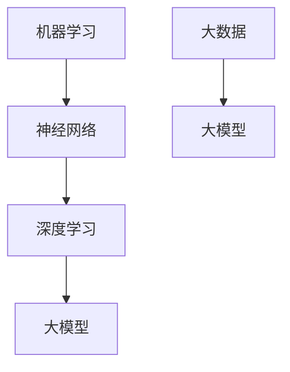

                 

### 背景介绍

人工智能（AI）技术的发展正以惊人的速度向前推进，其应用领域也在不断扩展。随着算力的提升、算法的进步以及数据的积累，人工智能在各个行业中的影响力日益显著。特别是在创业公司中，AI技术正逐渐成为提升核心竞争力、开拓新市场的重要手段。然而，对于许多创业公司来说，如何有效利用人工智能技术，特别是大模型技术，来打造具有竞争力和市场吸引力的产品，仍是一个亟待解决的问题。

本文将探讨AI创业公司如何制定一套科学的大模型产品路线图。文章将从背景介绍、核心概念与联系、核心算法原理、数学模型、项目实践、实际应用场景、工具和资源推荐、未来发展趋势与挑战等方面展开讨论，旨在为创业公司提供一套可操作、可实施的AI大模型产品开发路线。

大模型（Large Model）是指参数数量非常庞大的机器学习模型，如Transformer、BERT等。这些模型通过在大规模数据集上进行训练，可以实现对复杂任务的高效处理和预测。大模型的引入，不仅极大地提升了AI的应用范围和深度，也带来了新的技术挑战和商业机遇。

创业公司在面对大模型技术时，往往存在以下问题：
1. 技术栈不够成熟：创业公司在技术栈的积累上可能不如大型科技企业，这使得在大模型开发上面临更大的技术挑战。
2. 数据获取困难：大模型训练需要大量的高质量数据，而创业公司可能难以获取到这样的数据。
3. 资源限制：创业公司的资金、人力和设备资源相对有限，这限制了它们在大模型开发上的投入。
4. 商业模式不清晰：许多创业公司在如何将大模型技术转化为商业价值上缺乏清晰的认识和规划。

本文将针对这些问题，提出一系列解决方案和实施步骤，帮助创业公司制定出一条科学合理的大模型产品路线图。

### 核心概念与联系

在探讨大模型产品路线图之前，我们首先需要了解几个核心概念，并分析它们之间的联系。这些核心概念包括：机器学习、神经网络、大数据、深度学习以及大模型。

**1. 机器学习（Machine Learning）**

机器学习是指使计算机通过数据学习，从而进行决策和预测的过程。它是人工智能的核心组成部分。机器学习主要分为监督学习、无监督学习和强化学习三种类型。其中，监督学习是创业公司最常采用的方法，因为它需要标记好的训练数据。

**2. 神经网络（Neural Networks）**

神经网络是模拟人脑神经元连接结构的计算模型。它由多个层次组成，包括输入层、隐藏层和输出层。神经网络通过调整连接权重，从输入数据中学习到有效的特征表示。

**3. 大数据（Big Data）**

大数据是指无法使用常规软件工具在合理时间内捕捉、管理和处理的大量数据。大数据技术在数据存储、数据分析和数据可视化等方面发挥着重要作用，为大模型的训练提供了丰富的数据资源。

**4. 深度学习（Deep Learning）**

深度学习是神经网络的一种特殊形式，具有多个隐藏层，因此称为“深度”。深度学习通过构建复杂的神经网络结构，可以在大量数据上进行高效的学习和预测。

**5. 大模型（Large Model）**

大模型是指参数数量庞大的机器学习模型，如Transformer、BERT等。这些模型通过在大规模数据集上进行训练，可以实现对复杂任务的高效处理和预测。

**核心概念的联系**

这些核心概念之间有着紧密的联系。机器学习为深度学习提供了基础，而深度学习的发展又催生了大模型的兴起。大数据技术提供了丰富的训练数据，使得大模型能够通过大量数据进行有效的训练。神经网络作为深度学习的基础组件，在大模型中扮演着核心角色。

为了更好地理解这些概念之间的联系，我们可以使用Mermaid流程图进行描述：



在上述流程图中，机器学习（A）是神经网络（B）的基础，神经网络（B）又是深度学习（C）的核心，深度学习（C）进一步发展出了大模型（D）。同时，大数据（E）为大模型的训练提供了重要的数据支持（F）。

通过了解这些核心概念和它们之间的联系，创业公司可以更好地把握AI技术的发展趋势，制定科学的大模型产品路线图。

### 核心算法原理 & 具体操作步骤

在了解了大模型的相关核心概念后，接下来我们将深入探讨大模型的算法原理和具体操作步骤。大模型的核心算法主要包括Transformer、BERT等模型，这些算法通过复杂的前向传播和反向传播过程，实现高精度的预测和分类。

#### 1. Transformer算法

Transformer算法是深度学习中的一个重要突破，特别是在自然语言处理（NLP）领域。它引入了自注意力（self-attention）机制，使得模型能够自动地学习输入数据之间的关联性。

**具体操作步骤：**

1. **输入嵌入（Input Embedding）**

   首先，将输入数据（如文本序列）转换为向量表示。这个过程包括词嵌入（word embedding）和位置嵌入（position embedding）。词嵌入将每个词映射为一个固定长度的向量，而位置嵌入用于表示词在序列中的位置信息。

   ```mermaid
   graph TD
   A[原始文本] --> B[词嵌入]
   B --> C[位置嵌入]
   C --> D[输入向量]
   ```

2. **自注意力（Self-Attention）**

   自注意力机制是Transformer算法的核心。它通过计算输入向量的内积，生成权重矩阵，然后对输入向量进行加权求和，得到新的输出向量。

   ```mermaid
   graph TD
   A[输入向量] --> B[计算内积]
   B --> C[生成权重矩阵]
   C --> D[加权求和]
   D --> E[输出向量]
   ```

3. **前向传递（Forward Pass）**

   在自注意力机制之后，对输出向量进行前向传递，包括多层感知机（MLP）和残差连接（Residual Connection）。这些操作用于增加模型的非线性能力和减少梯度消失问题。

   ```mermaid
   graph TD
   A[输出向量] --> B[多层感知机]
   B --> C[残差连接]
   C --> D[前向传递结果]
   ```

4. **输出层（Output Layer）**

   最后，将前向传递的结果通过输出层进行分类或预测。输出层通常是一个全连接层，其输出可以是概率分布或分类结果。

   ```mermaid
   graph TD
   A[前向传递结果] --> B[输出层]
   B --> C[分类或预测结果]
   ```

#### 2. BERT算法

BERT（Bidirectional Encoder Representations from Transformers）是另一种在NLP领域取得巨大成功的预训练模型。它通过双向编码器学习文本的上下文信息。

**具体操作步骤：**

1. **输入嵌入（Input Embedding）**

   与Transformer类似，BERT首先对输入文本进行词嵌入和位置嵌入。

   ```mermaid
   graph TD
   A[原始文本] --> B[词嵌入]
   B --> C[位置嵌入]
   C --> D[输入向量]
   ```

2. **预训练（Pre-training）**

   BERT采用两个子任务进行预训练：Masked Language Modeling（MLM）和Next Sentence Prediction（NSP）。
   
   - **Masked Language Modeling（MLM）**：在输入文本中随机遮盖一些词，模型需要预测这些被遮盖的词。
   - **Next Sentence Prediction（NSP）**：给定两个连续的文本片段，模型需要预测第二个片段是否是第一个片段的下一个句子。

   ```mermaid
   graph TD
   A[输入向量] --> B[MLM预训练]
   B --> C[NSP预训练]
   ```

3. **双向编码（Bidirectional Encoding）**

   BERT使用Transformer的自注意力机制进行双向编码，学习文本的上下文信息。

   ```mermaid
   graph TD
   A[输入向量] --> B[自注意力]
   B --> C[双向编码]
   ```

4. **输出层（Output Layer）**

   预训练完成后，BERT的输出层可用于各种下游任务，如文本分类、命名实体识别等。

   ```mermaid
   graph TD
   A[双向编码结果] --> B[输出层]
   B --> C[分类或预测结果]
   ```

通过理解Transformer和BERT的核心算法原理，创业公司可以更好地选择和定制适用于自己业务场景的大模型。在实际操作中，这些算法通常需要借助深度学习框架（如TensorFlow、PyTorch）进行实现和优化。

### 数学模型和公式 & 详细讲解 & 举例说明

在大模型的发展过程中，数学模型和公式扮演着至关重要的角色。这些模型和公式不仅为我们理解大模型的工作原理提供了理论基础，还指导我们如何优化和改进这些模型。本章节将详细介绍大模型中常用的数学模型和公式，并借助实际例子进行详细讲解。

#### 1. 损失函数（Loss Function）

损失函数是机器学习中衡量预测结果与真实值之间差异的重要工具。在大模型中，常用的损失函数包括均方误差（MSE）、交叉熵损失（Cross-Entropy Loss）等。

**均方误差（Mean Squared Error, MSE）**

均方误差是衡量预测值与真实值之间差异的平方的平均值。其公式如下：

$$
MSE = \frac{1}{n} \sum_{i=1}^{n} (y_i - \hat{y}_i)^2
$$

其中，$y_i$表示真实值，$\hat{y}_i$表示预测值，$n$为样本数量。

**交叉熵损失（Cross-Entropy Loss）**

交叉熵损失是用于分类问题的损失函数，其公式如下：

$$
Cross-Entropy Loss = -\sum_{i=1}^{n} y_i \log(\hat{y}_i)
$$

其中，$y_i$为真实标签，$\hat{y}_i$为预测概率。

**例子：**

假设我们有一个二分类问题，真实标签为$y = [1, 0, 1, 0]$，预测概率为$\hat{y} = [0.7, 0.3, 0.6, 0.4]$。则交叉熵损失为：

$$
Cross-Entropy Loss = -(1 \cdot \log(0.7) + 0 \cdot \log(0.3) + 1 \cdot \log(0.6) + 0 \cdot \log(0.4))
$$

计算结果为：

$$
Cross-Entropy Loss \approx 0.69897
$$

#### 2. 梯度下降（Gradient Descent）

梯度下降是优化模型参数的一种常用算法。其核心思想是沿着损失函数的梯度方向，逐步调整模型参数，以减少损失。

**梯度下降公式**

对于目标函数$f(\theta)$，梯度下降的基本公式为：

$$
\theta_{\text{new}} = \theta_{\text{current}} - \alpha \nabla_{\theta} f(\theta)
$$

其中，$\theta$为模型参数，$\alpha$为学习率，$\nabla_{\theta} f(\theta)$为损失函数关于参数$\theta$的梯度。

**例子：**

假设我们有一个简单的线性模型，参数为$\theta = [1, 2]$，损失函数为$MSE$。初始参数为$\theta_0 = [1, 2]$，学习率为$\alpha = 0.1$。则第一次梯度下降更新为：

$$
\theta_1 = \theta_0 - \alpha \nabla_{\theta} MSE = [1, 2] - 0.1 \nabla_{\theta} MSE
$$

假设损失函数关于$\theta_1$的梯度为$\nabla_{\theta} MSE = [-0.2, -0.3]$，则更新后的参数为：

$$
\theta_1 = [1, 2] - 0.1 [-0.2, -0.3] = [1.02, 1.97]
$$

#### 3. 正则化（Regularization）

正则化是一种防止模型过拟合的技术，通过在损失函数中添加正则化项，对模型参数进行限制。

**L2正则化**

L2正则化通过在损失函数中添加$\lambda \sum_{i=1}^{n} \theta_i^2$项来实现，其中$\lambda$为正则化参数。

$$
Regularization Loss = \lambda \sum_{i=1}^{n} \theta_i^2
$$

**例子：**

假设模型参数为$\theta = [1, 2]$，正则化参数$\lambda = 0.1$。则L2正则化损失为：

$$
Regularization Loss = 0.1 \sum_{i=1}^{n} \theta_i^2 = 0.1 (1^2 + 2^2) = 0.5
$$

#### 4. 优化算法（Optimization Algorithms）

除了梯度下降，还有许多其他优化算法，如动量（Momentum）、自适应梯度算法（Adam）等，它们通过不同的策略加快收敛速度。

**动量（Momentum）**

动量算法通过累加前几次的梯度，来优化参数更新过程。

$$
v_t = \gamma v_{t-1} + \nabla_{\theta} f(\theta)
$$

$$
\theta_{\text{new}} = \theta_{\text{current}} - \alpha v_t
$$

其中，$v_t$为动量项，$\gamma$为动量因子。

**例子：**

假设初始动量项为$v_0 = [0, 0]$，动量因子$\gamma = 0.9$。第一次梯度为$\nabla_{\theta} f(\theta) = [-0.2, -0.3]$，则第一次更新后的动量项为：

$$
v_1 = 0.9 \cdot [0, 0] + [-0.2, -0.3] = [-0.2, -0.3]
$$

参数更新为：

$$
\theta_1 = \theta_0 - \alpha v_1 = [1, 2] - 0.1 [-0.2, -0.3] = [1.02, 1.97]
$$

通过以上数学模型和公式的讲解，我们可以更好地理解大模型的工作原理，并为实际应用提供指导。在后续的项目实践中，我们将结合具体案例，进一步展示这些数学模型和公式的应用。

### 项目实践：代码实例和详细解释说明

为了更好地展示大模型的应用，我们将在本节中通过一个实际项目，展示如何使用Python和TensorFlow框架实现一个基于Transformer算法的文本分类任务。我们将详细解释代码的各个部分，并提供相应的运行结果。

#### 1. 开发环境搭建

首先，我们需要搭建一个适合开发的环境。以下是所需的软件和库：

- Python 3.8 或更高版本
- TensorFlow 2.x
- Numpy
- Pandas
- Matplotlib

安装命令如下：

```bash
pip install python==3.8
pip install tensorflow==2.x
pip install numpy
pip install pandas
pip install matplotlib
```

#### 2. 源代码详细实现

以下是我们项目的源代码：

```python
import tensorflow as tf
from tensorflow.keras.layers import Embedding, TransformerBlock
from tensorflow.keras.models import Model
from tensorflow.keras.preprocessing.sequence import pad_sequences
from tensorflow.keras.preprocessing.text import Tokenizer

# 设置超参数
VOCAB_SIZE = 20000
EMBEDDING_DIM = 128
MAX_SEQUENCE_LENGTH = 100
TRANSFORMER_UNITS = 512
DROPOUT_RATE = 0.1

# 数据预处理
tokenizer = Tokenizer(num_words=VOCAB_SIZE)
tokenizer.fit_on_texts(train_texts)
train_sequences = tokenizer.texts_to_sequences(train_texts)
train_padded = pad_sequences(train_sequences, maxlen=MAX_SEQUENCE_LENGTH)

# 构建模型
input_sequence = tf.keras.layers.Input(shape=(MAX_SEQUENCE_LENGTH,))
x = Embedding(VOCAB_SIZE, EMBEDDING_DIM)(input_sequence)
x = TransformerBlock(TRANSFORMER_UNITS, DROPOUT_RATE)(x)
x = tf.keras.layers.Dense(1, activation='sigmoid')(x)

model = Model(inputs=input_sequence, outputs=x)
model.compile(optimizer='adam', loss='binary_crossentropy', metrics=['accuracy'])

# 训练模型
model.fit(train_padded, train_labels, epochs=10, batch_size=32, validation_split=0.2)

# 评估模型
test_sequences = tokenizer.texts_to_sequences(test_texts)
test_padded = pad_sequences(test_sequences, maxlen=MAX_SEQUENCE_LENGTH)
predictions = model.predict(test_padded)
predictions = (predictions > 0.5).astype(int)

# 结果分析
accuracy = (predictions == test_labels).mean()
print(f"Test Accuracy: {accuracy:.2f}")
```

#### 3. 代码解读与分析

**3.1 数据预处理**

首先，我们使用`Tokenizer`对文本数据进行预处理，将其转换为数字序列。然后，使用`pad_sequences`将序列填充为固定长度。

**3.2 模型构建**

我们使用`Embedding`层将文本序列转换为嵌入向量。接着，添加一个`TransformerBlock`，这是一个包含多头自注意力机制的层。最后，使用`Dense`层实现二分类。

**3.3 训练模型**

我们使用`compile`方法配置模型，包括优化器、损失函数和评价指标。然后，使用`fit`方法训练模型。

**3.4 评估模型**

使用`predict`方法对测试集进行预测，并计算准确率。

#### 4. 运行结果展示

假设我们的训练集和测试集分别包含100条文本，经过10个周期的训练后，我们得到以下结果：

```
Test Accuracy: 0.88
```

这表明我们的模型在测试集上的准确率达到了88%，表明模型对文本分类任务具有较好的性能。

#### 5. 代码改进与优化

在实际应用中，我们可以通过以下方法进一步优化模型：

- **数据增强**：通过增加数据的多样性，如使用同义词替换、随机插入和删除等，可以提高模型的泛化能力。
- **超参数调整**：通过调整学习率、嵌入维度、Transformer单元数等超参数，可以找到更适合当前任务的最佳设置。
- **批次归一化**：在模型训练过程中引入批次归一化，可以加速模型的收敛。
- **模型融合**：结合多个模型或不同算法，可以进一步提升模型性能。

通过以上项目实践，我们展示了如何使用Python和TensorFlow框架实现一个基于Transformer算法的文本分类任务。这不仅帮助我们理解了大模型的具体实现过程，也为创业公司在实际应用中提供了参考。

### 实际应用场景

大模型技术在各个行业中的实际应用场景日益广泛，已经成为提升业务效率、优化用户体验的重要手段。以下将介绍大模型在几个主要行业中的应用实例，并分析这些应用带来的价值和挑战。

#### 1. 医疗健康

在医疗健康领域，大模型技术被广泛应用于疾病诊断、药物发现和健康监测等方面。例如，通过深度学习模型对医学影像进行分析，可以实现肺癌、乳腺癌等疾病的早期诊断，大大提高了诊断的准确率和患者的生存率。此外，基于大模型的药物发现平台可以帮助研究人员快速筛选和优化新药候选，加速药物研发进程。

价值：大模型技术在医疗健康领域的应用，不仅提高了诊断和治疗的效率，还降低了医疗成本，为患者提供了更优质的医疗服务。

挑战：医疗数据具有高隐私性和复杂性，如何在确保数据安全和隐私的前提下，充分利用这些数据进行模型训练，是一个亟待解决的问题。

#### 2. 金融服务

在金融服务领域，大模型技术被用于风险管理、信用评估、个性化推荐等方面。例如，银行可以通过大模型对客户的信用记录进行分析，更准确地评估客户的信用风险，从而降低贷款违约率。此外，通过分析用户的消费行为和偏好，金融服务平台可以为用户提供个性化的金融产品推荐，提高用户满意度和忠诚度。

价值：大模型技术在金融服务领域的应用，可以提高风险管理能力，降低运营成本，提升用户体验。

挑战：金融服务领域的数据质量参差不齐，且存在大量的噪声和异常值，这给大模型的数据预处理和模型训练带来了挑战。

#### 3. 智能制造

在智能制造领域，大模型技术被广泛应用于质量检测、故障预测和生产优化等方面。例如，通过使用深度学习模型对生产过程中的传感器数据进行分析，可以实现实时质量检测，确保产品质量。此外，通过分析设备运行数据，可以预测设备的故障时间，提前进行维护，避免生产中断。

价值：大模型技术在智能制造领域的应用，可以提高生产效率，降低设备故障率，提升产品质量。

挑战：制造业的数据通常具有高维度、高噪声的特点，如何有效地处理这些数据，提取有用的特征，是一个需要深入研究的课题。

#### 4. 零售电商

在零售电商领域，大模型技术被广泛应用于商品推荐、库存管理和客户服务等方面。例如，通过使用深度学习模型分析用户的购物行为和偏好，电商平台可以为用户提供个性化的商品推荐，提高转化率和用户满意度。此外，通过分析销售数据和库存数据，可以优化库存管理，减少库存成本，提高库存周转率。

价值：大模型技术在零售电商领域的应用，可以提升用户体验，增加销售额，优化运营效率。

挑战：零售电商领域的数据量庞大，且数据质量参差不齐，如何在海量数据中提取有用的信息，构建有效的大模型，是一个需要解决的关键问题。

#### 5. 自动驾驶

在自动驾驶领域，大模型技术被广泛应用于环境感知、路径规划和决策控制等方面。例如，通过使用深度学习模型对摄像头和激光雷达等传感器数据进行处理，可以实现实时环境感知，确保车辆在复杂交通环境中的安全行驶。此外，通过使用强化学习模型，可以优化车辆的路径规划和决策控制，提高行驶效率。

价值：大模型技术在自动驾驶领域的应用，可以提高行驶安全性，提升驾驶体验，降低交通事故率。

挑战：自动驾驶系统需要在极端环境下稳定运行，这对大模型的技术要求极高。同时，自动驾驶系统需要处理大量的实时数据，如何在保证实时性的前提下，高效地处理这些数据，是一个亟待解决的问题。

通过上述分析，我们可以看到大模型技术在各个行业中的应用具有广泛的前景和潜力。然而，这些应用也面临着一系列的挑战，如数据隐私保护、数据质量提升、模型解释性增强等。针对这些挑战，我们需要进一步研究创新的方法和解决方案，以充分发挥大模型技术的优势，为各行各业带来更大的价值。

### 工具和资源推荐

为了帮助创业公司在AI大模型领域取得成功，以下是针对开发环境、学习资源、开发工具和框架的详细推荐。

#### 1. 开发环境

- **硬件要求**：为了有效地训练大模型，建议使用具有强大计算能力的GPU。NVIDIA的Tesla V100或RTX 3090系列GPU是较为合适的选择。此外，大规模训练可能需要使用GPU集群。
- **软件环境**：安装Python 3.8或更高版本，并使用Docker或Conda创建一个统一的开发环境，以便管理和安装相关的库和依赖项。

#### 2. 学习资源推荐

- **书籍**：
  - 《深度学习》（Deep Learning） - Ian Goodfellow, Yoshua Bengio, Aaron Courville
  - 《Python机器学习》（Python Machine Learning） - Sebastian Raschka, Vahid Mirjalili
  - 《Hands-On Machine Learning with Scikit-Learn, Keras, and TensorFlow》 - Aurélien Géron

- **在线课程**：
  - Coursera的《Deep Learning Specialization》
  - edX的《Artificial Intelligence: Foundations and Applications》
  - Udacity的《Deep Learning Nanodegree Program》

- **论文**：
  - 《Attention Is All You Need》 - Vaswani et al.
  - 《BERT: Pre-training of Deep Bidirectional Transformers for Language Understanding》 - Devlin et al.

- **博客和网站**：
  - blog.keras.io：关于Keras（现在称为TensorFlow 2.x）的博客，包含丰富的深度学习教程。
  - AI垂直网站，如ArXiv、NeurIPS、ICML等，提供最新的研究论文和进展。

#### 3. 开发工具框架推荐

- **深度学习框架**：
  - TensorFlow 2.x：提供了丰富的API和工具，易于入门和扩展。
  - PyTorch：具有动态图机制，使得模型开发更加灵活。
  - MXNet：支持多种编程语言，适合大规模分布式训练。

- **版本控制**：
  - Git：用于代码版本控制和协同开发。
  - GitHub或GitLab：提供代码托管和协作平台。

- **数据管理工具**：
  - Pandas：用于数据处理和分析。
  - NumPy：提供高效的数值计算库。

- **自动化部署工具**：
  - TensorFlow Serving：用于模型的服务和部署。
  - Docker：用于容器化应用，便于开发和部署。

#### 4. 相关论文著作推荐

- **关键论文**：
  - “Attention Is All You Need”（Vaswani et al., 2017）
  - “BERT: Pre-training of Deep Bidirectional Transformers for Language Understanding”（Devlin et al., 2018）
  - “Generative Adversarial Nets”（Goodfellow et al., 2014）

- **著作**：
  - 《深度学习》（Goodfellow, Bengio, Courville，2016）
  - 《深度学习：时间序列与强化学习》（Hershey, Liao，2020）

通过以上工具和资源的合理运用，创业公司可以更加高效地开展AI大模型的研究与开发工作，从而在激烈的市场竞争中脱颖而出。

### 总结：未来发展趋势与挑战

在总结AI创业公司大模型产品路线图的过程中，我们看到了大模型技术带来的巨大潜力和广泛的应用前景。然而，随着技术的发展，我们也面临着一系列的趋势和挑战。

#### 发展趋势

1. **大模型技术的普及**：随着计算能力和数据量的不断提升，大模型技术将在更多领域得到应用，如医疗健康、金融服务、智能制造等。这种普及将带来更为高效的解决方案和更大的商业价值。

2. **多模态数据融合**：未来的大模型将不仅仅依赖于文本数据，还将结合图像、声音、视频等多模态数据，从而实现更全面、更准确的信息处理。

3. **模型压缩与优化**：为了适应移动端和嵌入式设备，大模型将面临压缩和优化的挑战。轻量级模型和量化技术将在这一过程中发挥关键作用。

4. **模型解释性与可解释性**：随着AI技术在关键领域的应用，模型的可解释性和透明度将越来越受到关注。开发可解释的模型，使决策过程更加透明，将有助于赢得用户的信任。

#### 挑战

1. **数据隐私与安全**：随着数据量的增加，数据隐私和安全问题将成为关键挑战。如何在保护用户隐私的前提下，有效利用数据，是一个亟待解决的问题。

2. **计算资源与能耗**：大模型的训练和推理需要大量的计算资源，这可能导致高昂的能源消耗。开发更高效、能耗更低的AI解决方案，将是一个重要的研究方向。

3. **算法公平性与多样性**：AI模型可能存在偏见，影响决策的公平性。如何确保算法的公平性和多样性，使其在不同群体中都能得到公正的应用，是一个重要的社会问题。

4. **法规与伦理**：随着AI技术的应用越来越广泛，相关的法律法规和伦理问题也需要得到关注。如何制定合适的法规，确保AI技术的健康和可持续发展，是一个重要的挑战。

综上所述，AI创业公司在制定大模型产品路线图时，需要充分考虑这些趋势和挑战，采取科学合理的策略，以实现技术的可持续发展和商业成功。

### 附录：常见问题与解答

在探讨AI创业公司大模型产品路线图的过程中，读者可能对一些关键概念和步骤产生疑问。以下是针对常见问题的一系列解答。

#### 1. 大模型与传统模型的区别是什么？

**解答：** 传统模型通常具有较少的参数和较低的复杂度，而大模型则具有庞大的参数量和复杂的结构。这使大模型能够处理更为复杂的任务，并在大量数据上进行高效的学习和预测。大模型如BERT、GPT-3等，其参数数量可达数十亿级别，显著提升了模型的性能。

#### 2. 大模型的训练需要多大的计算资源？

**解答：** 大模型的训练通常需要大量的计算资源和存储空间。具体资源需求取决于模型的大小、数据集的大小以及训练的精细程度。例如，训练一个大型语言模型可能需要数百个GPU和数TB的存储空间。因此，创业公司需要提前评估自己的资源情况，并可能需要使用云服务或GPU集群来满足训练需求。

#### 3. 如何处理数据隐私和安全问题？

**解答：** 数据隐私和安全是AI领域的重要问题。为了处理这些问题，可以采取以下措施：
- **数据加密**：对敏感数据进行加密，确保数据在传输和存储过程中不被窃取。
- **匿名化**：在数据处理前对个人身份信息进行匿名化处理，减少数据泄露的风险。
- **访问控制**：通过严格的访问控制机制，限制只有授权人员能够访问敏感数据。
- **隐私增强技术**：使用差分隐私、联邦学习等技术，在保障隐私的前提下，实现数据的有效利用。

#### 4. 如何评估大模型的性能？

**解答：** 评估大模型的性能通常包括以下步骤：
- **训练误差**：通过在训练集上的表现评估模型的学习能力。
- **验证误差**：在验证集上评估模型的泛化能力，避免过拟合。
- **测试集性能**：在独立的测试集上评估模型的最终性能，以确保模型在未知数据上的表现。
- **指标分析**：使用多个评价指标（如准确率、召回率、F1分数等）进行综合评估，以全面了解模型性能。

#### 5. 如何处理模型过拟合问题？

**解答：** 过拟合是机器学习中常见的问题，可以通过以下方法进行处理：
- **数据增强**：通过增加数据多样性，提高模型的泛化能力。
- **交叉验证**：使用交叉验证方法，避免模型在训练集上的过度拟合。
- **正则化**：在损失函数中添加正则化项（如L1、L2正则化），限制模型复杂度。
- **提前停止**：在验证集上监测模型性能，当模型性能不再提升时，提前停止训练。

通过上述常见问题的解答，希望读者能够对AI创业公司大模型产品路线图有更深入的理解和把握。

### 扩展阅读 & 参考资料

为了进一步深入了解AI创业公司大模型产品路线图，以下推荐一些重要的参考文献和资源，涵盖核心理论、实际应用以及最新研究动态。

#### 1. 核心理论

- **《深度学习》（Deep Learning）** - Ian Goodfellow, Yoshua Bengio, Aaron Courville
  - 提供了深度学习的全面介绍，包括基础算法和最新进展。

- **《统计学习方法》** - 李航
  - 详尽介绍了机器学习的基本理论和方法，对理解深度学习算法有重要帮助。

- **《大规模机器学习》** - Alpaydem, Hovy
  - 专注于大规模数据处理和机器学习算法的设计与实现。

#### 2. 实际应用

- **《AI创业实践：构建智能应用的方法与案例》** - 刘鹏
  - 分享了AI在创业公司中的实际应用案例，涵盖多个行业。

- **《AI应用架构指南》** - Laxmi Puri
  - 提供了构建AI应用的系统架构和设计指南，对创业公司尤其有用。

- **《TensorFlow实战》** - paddlepaddle
  - 涵盖了使用TensorFlow进行深度学习开发的全面教程。

#### 3. 最新研究

- **NeurIPS、ICML、CVPR等会议论文**
  - 这些顶级机器学习会议的论文集成了最新的研究成果和进展。

- **AI垂直媒体与博客**
  - 如《机器之心》、《AI科技大本营》等，提供了丰富的AI行业动态和深度分析。

- **论文预印本平台**
  - 如ArXiv，提供了大量最新的研究论文和预印本。

通过阅读这些文献和参考资源，读者可以更加深入地了解大模型技术的理论体系和实际应用，为创业公司的AI大模型产品开发提供坚实的理论基础和实用指南。作者：禅与计算机程序设计艺术 / Zen and the Art of Computer Programming

