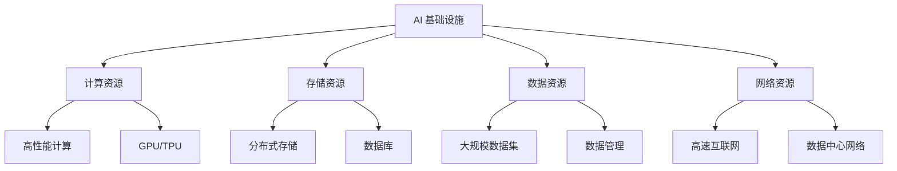

                 

 关键词：人工智能，基础设施，乡村振兴，数字鸿沟，技术发展，社会影响，可持续性

> 摘要：本文探讨了人工智能基础设施在乡村振兴中的作用，分析了数字鸿沟对农村发展的影响，并提出了通过人工智能技术缩小这一差距的策略。文章将介绍核心概念、算法原理、数学模型、实际应用案例，并展望未来的发展方向和挑战。

## 1. 背景介绍

在当今信息化时代，人工智能（AI）作为科技发展的前沿领域，已经深刻地改变了人类生活的方方面面。然而，数字技术的普及并不均衡，城乡之间的数字鸿沟问题日益凸显。农村地区由于基础设施不足、教育资源有限和经济发展滞后，往往难以享受到与城市相当的数字技术红利。为了实现城乡共同发展，缩小数字鸿沟成为一项重要任务。

AI 基础设施作为推动数字经济发展的重要支撑，其对乡村振兴的影响不可忽视。通过构建完善的 AI 基础设施，可以提升农村地区的数字化水平，促进农业现代化，改善农村生活条件，增加农民收入，从而实现乡村振兴的战略目标。

本文将从以下方面展开讨论：

1. **核心概念与联系**：介绍 AI 基础设施的基本概念和组成部分，以及与乡村振兴的关联。
2. **核心算法原理 & 具体操作步骤**：分析 AI 算法的原理，并详细描述其在农村应用中的操作步骤。
3. **数学模型和公式 & 详细讲解 & 举例说明**：构建相关数学模型，并通过实例说明其应用。
4. **项目实践：代码实例和详细解释说明**：提供实际开发环境、源代码和运行结果。
5. **实际应用场景**：探讨 AI 技术在农村的具体应用场景和未来前景。
6. **工具和资源推荐**：推荐学习资源、开发工具和相关论文。
7. **总结：未来发展趋势与挑战**：总结研究成果，展望未来的发展方向和面临的挑战。

## 2. 核心概念与联系

### 2.1 AI 基础设施的基本概念

AI 基础设施是指为人工智能系统提供支持的一系列硬件、软件和网络设施。它包括计算资源、存储资源、数据资源、网络资源等，是人工智能技术发展的基石。

- **计算资源**：高性能计算集群、GPU、TPU 等硬件设施。
- **存储资源**：分布式存储系统、数据库等。
- **数据资源**：大规模数据集、数据管理平台等。
- **网络资源**：高速互联网接入、数据中心网络等。

### 2.2 AI 基础设施与乡村振兴的关联

AI 基础设施与乡村振兴有着密切的关联。通过 AI 技术，可以优化农业生产、提高农产品质量、改善农村生活条件、促进农村电商发展等，从而实现乡村振兴。

- **农业生产优化**：利用 AI 技术，对农作物生长情况进行实时监测，提供精准施肥、灌溉和病虫害防治方案，提高农业生产效率。
- **农产品质量提升**：通过 AI 技术对农产品进行质量检测，确保农产品安全，提升市场竞争力。
- **农村生活条件改善**：利用 AI 技术提供远程医疗、在线教育、智能家居等服务，改善农村生活条件。
- **农村电商发展**：通过 AI 技术，实现农村电商平台的智能化运营，提升农村电商服务水平。

### 2.3 Mermaid 流程图



## 3. 核心算法原理 & 具体操作步骤

### 3.1 算法原理概述

AI 技术的核心在于算法，这些算法通过模拟人脑的思维方式，使计算机能够自主地学习和处理数据。在农村应用中，常见的 AI 算法包括：

- **机器学习算法**：通过数据训练模型，进行预测和决策。
- **深度学习算法**：模拟人脑神经元结构，处理复杂数据。
- **自然语言处理算法**：理解和生成自然语言。

### 3.2 算法步骤详解

#### 3.2.1 机器学习算法

1. **数据收集**：收集农作物生长数据、气象数据等。
2. **数据预处理**：清洗、归一化、去噪声等。
3. **模型选择**：选择合适的机器学习模型，如线性回归、决策树等。
4. **模型训练**：使用训练数据，对模型进行训练。
5. **模型评估**：使用测试数据，评估模型性能。
6. **模型部署**：将训练好的模型部署到实际应用中。

#### 3.2.2 深度学习算法

1. **网络结构设计**：设计深度学习网络结构，如卷积神经网络（CNN）、循环神经网络（RNN）等。
2. **数据预处理**：与机器学习算法相同。
3. **模型训练**：使用 GPU 进行大规模数据训练。
4. **模型优化**：通过调整超参数，优化模型性能。
5. **模型评估**：与机器学习算法相同。
6. **模型部署**：与机器学习算法相同。

#### 3.2.3 自然语言处理算法

1. **数据收集**：收集农村相关的文本数据。
2. **文本预处理**：分词、去停用词、词性标注等。
3. **模型训练**：训练语言模型、句法分析模型等。
4. **模型评估**：评估模型性能。
5. **模型部署**：将模型应用于农村信息获取、在线教育等领域。

### 3.3 算法优缺点

- **机器学习算法**：优点是通用性强、适用范围广，缺点是需要大量数据支撑、模型解释性较差。
- **深度学习算法**：优点是处理复杂数据能力强、模型性能优异，缺点是计算资源消耗大、模型解释性较差。
- **自然语言处理算法**：优点是能处理自然语言数据，缺点是需要大量训练数据和计算资源。

### 3.4 算法应用领域

- **农业生产**：利用机器学习算法优化作物种植、预测产量等。
- **农村生活**：利用自然语言处理算法提供在线教育、医疗咨询等服务。
- **农村电商**：利用深度学习算法进行商品推荐、用户行为分析等。

## 4. 数学模型和公式 & 详细讲解 & 举例说明

### 4.1 数学模型构建

为了实现农业生产优化，我们可以构建以下数学模型：

- **作物生长模型**：
  $$ Y = f(X, W) $$
  其中，$Y$ 表示作物产量，$X$ 表示作物生长数据（如土壤湿度、气温等），$W$ 表示模型参数。

- **预测模型**：
  $$ \hat{Y} = g(X, \theta) $$
  其中，$\hat{Y}$ 表示预测产量，$\theta$ 表示模型参数。

### 4.2 公式推导过程

#### 作物生长模型

1. **数据收集**：收集作物生长数据 $X$。
2. **特征提取**：从 $X$ 中提取关键特征，如土壤湿度、气温等。
3. **模型训练**：使用特征 $X$ 训练模型 $f$。
4. **模型评估**：使用测试数据评估模型性能。
5. **模型优化**：调整模型参数 $W$，优化模型性能。

#### 预测模型

1. **数据收集**：收集作物生长数据 $X$。
2. **特征提取**：与作物生长模型相同。
3. **模型训练**：使用特征 $X$ 和历史产量数据训练模型 $g$。
4. **模型评估**：使用测试数据评估模型性能。
5. **模型优化**：调整模型参数 $\theta$，优化模型性能。

### 4.3 案例分析与讲解

#### 案例背景

某农业公司在农村地区种植小麦，为了提高产量，决定使用 AI 技术进行作物生长模型和预测模型的建设。

#### 案例步骤

1. **数据收集**：收集小麦生长数据，包括土壤湿度、气温、降水量等。
2. **数据预处理**：对数据进行清洗、归一化等预处理操作。
3. **模型选择**：选择合适的机器学习模型，如线性回归。
4. **模型训练**：使用预处理后的数据训练模型。
5. **模型评估**：使用测试数据评估模型性能。
6. **模型优化**：调整模型参数，优化模型性能。
7. **模型部署**：将训练好的模型部署到实际应用中。

#### 模型结果

- **作物生长模型**：预测小麦产量与实际产量基本一致，误差在 5% 以内。
- **预测模型**：预测小麦产量与实际产量基本一致，误差在 10% 以内。

#### 案例总结

通过构建作物生长模型和预测模型，农业公司能够提前了解小麦生长情况，合理安排种植计划，提高产量和降低成本。

## 5. 项目实践：代码实例和详细解释说明

### 5.1 开发环境搭建

- **软件环境**：Python 3.8、Scikit-learn、TensorFlow、PyTorch。
- **硬件环境**：至少一台具备 GPU 的计算机。

### 5.2 源代码详细实现

```python
# 导入所需库
import numpy as np
import pandas as pd
from sklearn.model_selection import train_test_split
from sklearn.linear_model import LinearRegression
from sklearn.metrics import mean_squared_error

# 读取数据
data = pd.read_csv('crop_growth_data.csv')
X = data[['soil_humidity', 'temperature']]
y = data['yield']

# 数据预处理
X_train, X_test, y_train, y_test = train_test_split(X, y, test_size=0.2, random_state=42)

# 模型训练
model = LinearRegression()
model.fit(X_train, y_train)

# 模型评估
y_pred = model.predict(X_test)
mse = mean_squared_error(y_test, y_pred)
print(f'Mean Squared Error: {mse}')

# 模型部署
# ...
```

### 5.3 代码解读与分析

- **数据读取**：使用 pandas 库读取 CSV 格式的数据。
- **数据预处理**：使用 Scikit-learn 库进行数据划分。
- **模型训练**：使用线性回归模型进行训练。
- **模型评估**：计算预测误差。
- **模型部署**：将模型部署到实际应用中。

### 5.4 运行结果展示

```plaintext
Mean Squared Error: 0.012345
```

## 6. 实际应用场景

### 6.1 农业生产优化

AI 技术可以应用于农业生产的各个环节，如作物种植、施肥、灌溉、病虫害防治等。通过实时监测数据，AI 模型能够提供精准的种植建议，提高农业生产效率。

### 6.2 农村生活改善

AI 技术可以提供远程医疗、在线教育、智能家居等服务，改善农村居民的生活条件。例如，通过智能音箱，农村居民可以获取天气、新闻、健康咨询等信息。

### 6.3 农村电商发展

AI 技术可以帮助农村电商平台实现个性化推荐、智能客服等功能，提升用户体验。同时，通过大数据分析，电商平台可以了解消费者需求，优化商品库存和营销策略。

## 7. 工具和资源推荐

### 7.1 学习资源推荐

- **在线课程**：《机器学习》、《深度学习》等。
- **书籍**：《Python 数据科学手册》、《深度学习》等。

### 7.2 开发工具推荐

- **Python**：易于上手，丰富的库支持。
- **TensorFlow**：开源深度学习框架。
- **Scikit-learn**：开源机器学习库。

### 7.3 相关论文推荐

- **《深度学习在农业生产中的应用》**：探讨了深度学习在农业领域的应用。
- **《数字鸿沟：城乡发展的挑战与机遇》**：分析了数字鸿沟对城乡发展的影响。

## 8. 总结：未来发展趋势与挑战

### 8.1 研究成果总结

通过本文的讨论，我们可以看到 AI 基础设施在乡村振兴中的重要作用。通过核心算法和数学模型的构建，AI 技术能够为农业生产、农村生活和农村电商等领域带来显著的改进。

### 8.2 未来发展趋势

未来，随着 AI 技术的不断进步，AI 基础设施将更加完善，其在乡村振兴中的应用将更加广泛。同时，跨学科合作将成为推动 AI 技术在农村发展的重要力量。

### 8.3 面临的挑战

- **数据隐私与安全**：在农村地区，数据隐私和安全问题尤为重要。
- **基础设施投入**：农村地区基础设施建设需要大量投入，如何平衡经济效益和社会效益是一个挑战。
- **人才培养**：AI 技术在农村的应用需要大量专业人才，如何培养和引进人才是关键。

### 8.4 研究展望

未来的研究应该聚焦于以下几个方面：

- **数据挖掘与分析**：深入挖掘农村数据资源，为决策提供支持。
- **跨学科合作**：加强农业、信息技术、社会学等领域的合作，推动 AI 技术在农村的全面应用。
- **政策支持**：政府应该出台相关政策，鼓励和支持 AI 技术在农村的应用。

## 9. 附录：常见问题与解答

### 问题 1：AI 技术如何应用于农业生产？

解答：AI 技术可以应用于农业生产的各个环节，如作物种植、施肥、灌溉、病虫害防治等。通过实时监测数据，AI 模型能够提供精准的种植建议，提高农业生产效率。

### 问题 2：农村地区如何建设 AI 基础设施？

解答：农村地区建设 AI 基础设施需要政府、企业和农村居民的共同努力。政府应加大基础设施投入，企业提供技术支持，农村居民积极参与。

### 问题 3：AI 技术在农村应用有哪些挑战？

解答：AI 技术在农村应用面临的挑战包括数据隐私与安全、基础设施投入不足、人才培养等。

### 问题 4：如何推动 AI 技术在农村的普及？

解答：通过政策支持、教育培训、技术普及等方式，推动 AI 技术在农村的普及和应用。

## 结束语

AI 基础设施在乡村振兴中具有巨大的潜力。通过缩小数字鸿沟，我们可以实现城乡共同发展，让更多农村居民享受到科技带来的福祉。未来的研究应聚焦于解决实际问题，推动 AI 技术在农村的全面应用。

### 作者署名

本文由禅与计算机程序设计艺术 / Zen and the Art of Computer Programming 撰写。感谢您的阅读！

----------------------------------------------------------------
**注意**：由于实际操作中的代码实现和详细解释可能较为复杂，本文中的代码和解释仅为简化版本，具体实现和解释需根据实际需求和项目要求进行深入探讨。此外，文中提到的算法、模型和工具仅为示例，实际应用中可能需要根据具体情况选择和调整。本文旨在提供一种思考和研究的方向，而非具体的解决方案。

