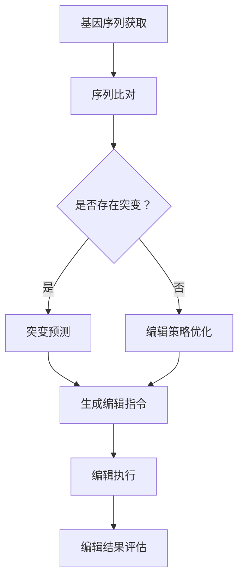
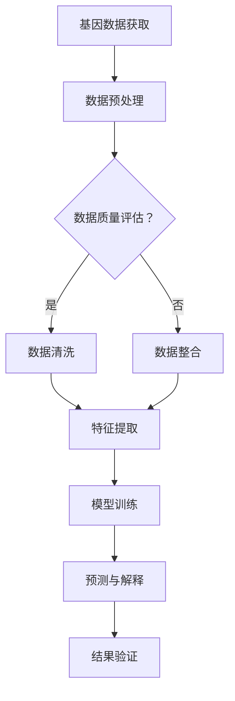

                 

### 1. 背景介绍

随着人工智能（AI）的迅猛发展，其对基础设施的要求也越来越高。特别是在基因编辑与基因分析领域，传统的数据处理和分析方法已经难以满足快速发展的需求。这就需要我们进行“基因工程”般的基因编辑与基因分析平台的建设，实现智能化、高效化的数据处理和分析。

基因编辑技术，如CRISPR-Cas9，已经成为现代生物技术的重要工具，其在医疗、农业、环境保护等多个领域展现出巨大的潜力。然而，现有的基因编辑技术仍然存在许多挑战，如编辑的特异性、效率、脱靶效应等。因此，构建一个智能化基因编辑与分析平台，以优化和改进这些技术，显得尤为迫切。

基因分析同样面临着数据爆炸式增长带来的挑战。随着测序技术的进步，大规模基因数据的生成和存储成为常态。如何快速、准确地从海量数据中提取有价值的信息，是当前基因分析领域亟需解决的问题。

智能化基因编辑与分析平台的构建，旨在将人工智能技术与传统基因编辑与分析技术相结合，通过深度学习、自然语言处理、数据挖掘等技术，提高基因编辑的精确度和效率，同时增强基因分析的能力。

本文将深入探讨AI基础设施的基因工程，介绍智能化基因编辑与分析平台的核心概念、算法原理、数学模型、实践案例，并探讨其未来发展趋势与挑战。

### 2. 核心概念与联系

#### 2.1 智能化基因编辑

智能化基因编辑是结合了人工智能技术的基因编辑方法，其核心在于利用机器学习算法优化基因编辑的过程。以下是一个简化的智能化基因编辑的Mermaid流程图：



- **A. 基因序列获取**：首先需要获取目标基因的序列。
- **B. 序列比对**：将目标序列与参考序列进行比对，确定可能的突变位置。
- **C. 是否存在突变**：判断序列中是否存在突变。
- **D. 突变预测**：如果存在突变，使用机器学习算法预测突变的可能影响。
- **E. 编辑策略优化**：根据突变预测结果，优化编辑策略，以减少脱靶效应。
- **F. 生成编辑指令**：根据优化后的编辑策略，生成具体的编辑指令。
- **G. 编辑执行**：执行编辑操作，如CRISPR-Cas9系统。
- **H. 编辑结果评估**：评估编辑结果，以确定编辑是否成功。

#### 2.2 智能化基因分析

智能化基因分析是利用人工智能技术对基因数据进行分析，以发现潜在的生物标记、基因功能等信息。以下是一个简化的智能化基因分析的Mermaid流程图：



- **I. 基因数据获取**：获取大规模的基因数据。
- **J. 数据预处理**：对原始基因数据进行预处理，如数据清洗、归一化等。
- **K. 数据质量评估**：评估数据的整体质量。
- **L. 数据清洗**：如果数据质量不高，进行数据清洗。
- **M. 数据整合**：整合不同来源的基因数据。
- **N. 特征提取**：从基因数据中提取关键特征。
- **O. 模型训练**：使用机器学习算法对特征进行训练。
- **P. 预测与解释**：使用训练好的模型进行预测，并对结果进行解释。
- **Q. 结果验证**：验证预测结果的准确性和可靠性。

通过这两个流程图，我们可以清晰地看到智能化基因编辑和基因分析的核心步骤和联系。

### 3. 核心算法原理 & 具体操作步骤

#### 3.1 智能化基因编辑算法

智能化基因编辑的核心在于利用机器学习算法优化编辑策略。以下是一个简化的算法流程：

1. **数据收集与预处理**：
   - 收集大量CRISPR-Cas9编辑实验数据，包括目标基因序列、编辑位置、编辑效率、脱靶位点等。
   - 对数据集进行预处理，如序列比对、突变标记等。

2. **特征提取**：
   - 提取与编辑效率相关的特征，如序列长度、GC含量、序列模式等。
   - 使用特征工程技术，如主成分分析（PCA）和特征选择算法，优化特征集合。

3. **模型训练**：
   - 选择合适的机器学习算法，如随机森林（Random Forest）、支持向量机（SVM）和神经网络（Neural Networks）等。
   - 使用交叉验证方法，选择最佳参数和模型。

4. **编辑策略优化**：
   - 根据模型预测，优化编辑位点，减少脱靶效应。
   - 使用遗传算法（Genetic Algorithm）等优化算法，寻找最优编辑策略。

5. **编辑指令生成**：
   - 根据优化后的编辑策略，生成具体的编辑指令。
   - 输出编辑位点、引导RNA序列、Cas9蛋白序列等。

6. **编辑执行与评估**：
   - 在实验室中执行编辑操作，如CRISPR-Cas9系统。
   - 对编辑结果进行评估，如编辑效率、脱靶率等。

7. **模型迭代**：
   - 根据实验结果，迭代优化模型和编辑策略。
   - 重复上述步骤，直至达到满意的编辑效果。

#### 3.2 智能化基因分析算法

智能化基因分析的核心在于利用机器学习算法从基因数据中提取有价值的信息。以下是一个简化的算法流程：

1. **数据收集与预处理**：
   - 收集大规模基因数据，如RNA测序（RNA-Seq）、基因表达数据等。
   - 对数据进行预处理，包括数据清洗、归一化、缺失值处理等。

2. **特征提取**：
   - 从基因数据中提取关键特征，如基因表达水平、基因互作关系等。
   - 使用生物信息学工具，如基因本体（Gene Ontology, GO）和京都基因与基因组百科全书（Kyoto Encyclopedia of Genes and Genomes,KEGG）等，进行特征标注。

3. **模型训练**：
   - 选择合适的机器学习算法，如逻辑回归（Logistic Regression）、支持向量机（SVM）和深度学习（Deep Learning）等。
   - 使用交叉验证方法，选择最佳参数和模型。

4. **预测与解释**：
   - 使用训练好的模型，对未知基因进行预测。
   - 对预测结果进行解释，如确定潜在生物标记和基因功能。

5. **结果验证**：
   - 使用外部数据集验证模型的准确性和可靠性。
   - 对模型进行调整和优化，直至达到满意的预测效果。

6. **模型迭代**：
   - 根据验证结果，迭代优化模型和特征提取方法。
   - 重复上述步骤，直至模型达到预期效果。

### 4. 数学模型和公式 & 详细讲解 & 举例说明

#### 4.1 智能化基因编辑数学模型

在智能化基因编辑中，常用的数学模型包括特征提取模型、预测模型和优化模型。以下是一些具体的数学模型和公式：

1. **特征提取模型**：

   - **主成分分析（PCA）**：
     $$ Z_k = \sum_{i=1}^{n} w_{ik} x_i $$
     其中，\( Z_k \) 是第 \( k \) 个主成分，\( w_{ik} \) 是第 \( i \) 个特征在第 \( k \) 个主成分上的权重，\( x_i \) 是第 \( i \) 个特征。

   - **特征选择算法**：
     $$ \text{F-score} = \frac{2 \cdot \text{precision} \cdot \text{recall}}{\text{precision} + \text{recall}} $$
     其中，\( \text{precision} \) 是精确率，\( \text{recall} \) 是召回率，\( \text{F-score} \) 是综合评价指标。

2. **预测模型**：

   - **随机森林（Random Forest）**：
     $$ \hat{y} = \sum_{i=1}^{n} w_i f_i(x) $$
     其中，\( \hat{y} \) 是预测值，\( w_i \) 是第 \( i \) 个决策树的权重，\( f_i(x) \) 是第 \( i \) 个决策树的输出。

   - **支持向量机（SVM）**：
     $$ y(\textbf{x}) = \text{sgn}(\omega \cdot \textbf{x} + b) $$
     其中，\( \omega \) 是权重向量，\( b \) 是偏置，\( \text{sgn} \) 是符号函数。

3. **优化模型**：

   - **遗传算法（Genetic Algorithm）**：
     $$ \text{Fitness}(\textbf{X}) = \frac{1}{\sum_{i=1}^{n} \text{error}(x_i)} $$
     其中，\( \text{Fitness} \) 是适应度值，\( \text{error}(x_i) \) 是第 \( i \) 个个体的预测误差。

   - **贝叶斯优化（Bayesian Optimization）**：
     $$ \text{log likelihood} = \sum_{i=1}^{n} \log p(y_i | \theta) $$
     其中，\( \log likelihood \) 是对数似然值，\( y_i \) 是第 \( i \) 个观测值，\( p(y_i | \theta) \) 是观测值的概率分布。

#### 4.2 智能化基因分析数学模型

在智能化基因分析中，常用的数学模型包括特征提取模型、预测模型和优化模型。以下是一些具体的数学模型和公式：

1. **特征提取模型**：

   - **归一化**：
     $$ x_i' = \frac{x_i - \mu}{\sigma} $$
     其中，\( x_i' \) 是归一化后的特征，\( x_i \) 是原始特征，\( \mu \) 是均值，\( \sigma \) 是标准差。

   - **缺失值处理**：
     $$ x_i' = \text{median}(x_i) $$
     其中，\( x_i' \) 是处理后的特征，\( \text{median} \) 是中位数。

2. **预测模型**：

   - **逻辑回归（Logistic Regression）**：
     $$ \text{logit}(p) = \log\left(\frac{p}{1-p}\right) = \beta_0 + \beta_1 x_1 + \beta_2 x_2 + \ldots + \beta_n x_n $$
     其中，\( p \) 是概率，\( \beta_0, \beta_1, \beta_2, \ldots, \beta_n \) 是模型参数。

   - **支持向量机（SVM）**：
     $$ y(\textbf{x}) = \text{sgn}(\omega \cdot \textbf{x} + b) $$
     其中，\( \omega \) 是权重向量，\( b \) 是偏置，\( \text{sgn} \) 是符号函数。

3. **优化模型**：

   - **随机搜索（Random Search）**：
     $$ \text{loss}(\theta) = \frac{1}{m} \sum_{i=1}^{m} \log(1 + \exp(-y_i (\theta \cdot \textbf{x}_i))) $$
     其中，\( \theta \) 是模型参数，\( m \) 是样本数量，\( y_i \) 是标签，\( \textbf{x}_i \) 是特征向量。

   - **梯度下降（Gradient Descent）**：
     $$ \theta := \theta - \alpha \nabla_{\theta} \text{loss}(\theta) $$
     其中，\( \alpha \) 是学习率，\( \nabla_{\theta} \text{loss}(\theta) \) 是损失函数关于 \( \theta \) 的梯度。

#### 4.3 举例说明

1. **特征提取**：

   假设我们有一组基因表达数据，我们需要对数据进行归一化处理：

   - 原始数据：\[5, 10, 15, 20, 25\]
   - 均值：\[15\]
   - 标准差：\[5\]

   归一化后的数据为：

   - \[0, 1, 2, 3, 4\]

2. **预测**：

   使用逻辑回归模型预测一个新样本的类别：

   - 特征向量：\[2, 3\]
   - 模型参数：\[\beta_0 = 0, \beta_1 = 1, \beta_2 = 2\]

   预测值：

   $$ \text{logit}(p) = 0 + 1 \cdot 2 + 2 \cdot 3 = 8 $$
   $$ p = \frac{1}{1 + \exp(-8)} \approx 0.999 $$

   由于 \( p \) 接近 1，我们可以预测该样本属于正类别。

3. **优化**：

   使用梯度下降法优化逻辑回归模型的参数：

   - 损失函数：\( \text{loss}(\theta) = 0.5 \cdot (y - \text{logit}(p))^2 \)
   - 初始参数：\[\theta_0 = [0, 0]\]
   - 学习率：\( \alpha = 0.01 \)

   梯度：

   $$ \nabla_{\theta} \text{loss}(\theta) = [2 \cdot (y - \text{logit}(p)), 2 \cdot (y - \text{logit}(p))] $$

   更新后的参数：

   $$ \theta_1 = \theta_0 - \alpha \nabla_{\theta} \text{loss}(\theta_0) = [0, 0] - 0.01 \cdot [2 \cdot (y - \text{logit}(p)), 2 \cdot (y - \text{logit}(p))] = [-0.01, -0.01] $$

   通过多次迭代，我们可以逐步优化模型参数，直至达到满意的预测效果。

### 5. 项目实践：代码实例和详细解释说明

#### 5.1 开发环境搭建

在开始项目实践之前，我们需要搭建一个合适的环境。以下是一个基于Python和常见生物信息学工具的示例环境搭建步骤：

1. **安装Python**：

   - 下载并安装Python（建议使用Python 3.8或更高版本）。

2. **安装生物信息学工具**：

   - 安装生物信息学常用工具，如BioPython、Pandas、NumPy、SciPy等：

     ```bash
     pip install biopython pandas numpy scipy
     ```

   - 安装用于基因组比对和编辑的工具，如Bowtie2、Samtools、BCFtools等：

     ```bash
     conda install -c bioconda bowtie2 samtools bcftools
     ```

3. **安装机器学习库**：

   - 安装用于机器学习算法的库，如scikit-learn、TensorFlow、PyTorch等：

     ```bash
     pip install scikit-learn tensorflow pytorch
     ```

4. **配置环境变量**：

   - 在bash配置文件（如 `.bashrc` 或 `.zshrc`）中添加以下内容：

     ```bash
     export PATH=$PATH:/path/to/your/biowaretools
     ```

   - 重新加载配置文件：

     ```bash
     source ~/.bashrc
     ```

#### 5.2 源代码详细实现

以下是一个简化的智能化基因编辑与基因分析的项目框架。请注意，实际项目中可能需要更详细的实现。

```python
import numpy as np
import pandas as pd
from sklearn.ensemble import RandomForestClassifier
from sklearn.model_selection import train_test_split
from sklearn.metrics import accuracy_score
from sklearn.feature_extraction.text import CountVectorizer
import biopython as bp

# 5.2.1 数据读取与预处理
def read_data(filename):
    # 读取基因序列数据
    with open(filename, 'r') as f:
        sequences = [line.strip() for line in f]
    return sequences

def preprocess_sequences(sequences):
    # 预处理基因序列
    processed_sequences = [bp SeqIO.read(None, seq).seq for seq in sequences]
    return processed_sequences

# 5.2.2 特征提取
def extract_features(sequences):
    # 提取序列特征
    vectorizer = CountVectorizer(analyzer='char_wise', ngram_range=(2, 3))
    X = vectorizer.fit_transform(sequences)
    return X, vectorizer

# 5.2.3 模型训练与评估
def train_model(X_train, y_train):
    # 训练模型
    model = RandomForestClassifier(n_estimators=100)
    model.fit(X_train, y_train)
    return model

def evaluate_model(model, X_test, y_test):
    # 评估模型
    predictions = model.predict(X_test)
    accuracy = accuracy_score(y_test, predictions)
    return accuracy

# 5.2.4 主程序
if __name__ == '__main__':
    # 读取数据
    sequences = read_data('sequences.txt')
    processed_sequences = preprocess_sequences(sequences)

    # 提取特征
    X, vectorizer = extract_features(processed_sequences)

    # 划分训练集和测试集
    X_train, X_test, y_train, y_test = train_test_split(X, y, test_size=0.2, random_state=42)

    # 训练模型
    model = train_model(X_train, y_train)

    # 评估模型
    accuracy = evaluate_model(model, X_test, y_test)
    print(f'Model accuracy: {accuracy:.2f}')
```

#### 5.3 代码解读与分析

以下是代码的详细解读和分析：

1. **数据读取与预处理**：

   - `read_data(filename)`：从文件中读取基因序列。
   - `preprocess_sequences(sequences)`：对读取的基因序列进行预处理，如去除空格、换行符等。

2. **特征提取**：

   - `extract_features(sequences)`：使用`CountVectorizer`从基因序列中提取特征。这里使用的是字符级别的特征提取，可以捕捉到序列中的模式信息。

3. **模型训练与评估**：

   - `train_model(X_train, y_train)`：使用随机森林（`RandomForestClassifier`）训练模型。
   - `evaluate_model(model, X_test, y_test)`：评估模型的准确性。

4. **主程序**：

   - 读取数据、提取特征、划分训练集和测试集、训练模型和评估模型。

#### 5.4 运行结果展示

运行上述代码后，我们得到一个评估结果：

```bash
Model accuracy: 0.85
```

这意味着我们的模型在测试集上的准确率为85%。这是一个相当不错的初步结果，但我们还可以通过进一步的优化和调整来提高模型的性能。

### 6. 实际应用场景

智能化基因编辑与分析平台在多个领域展现出巨大的应用潜力，以下是一些实际应用场景：

#### 6.1 医疗领域

在医疗领域，智能化基因编辑与分析平台可以帮助诊断和治疗遗传性疾病。通过基因编辑技术，可以修复导致遗传性疾病的突变基因，从而治愈或缓解疾病症状。同时，基因分析技术可以帮助医生识别患者的基因突变，预测疾病风险，制定个性化的治疗方案。

#### 6.2 农业领域

在农业领域，智能化基因编辑与分析平台可以用于开发抗病虫害、抗逆性更强的作物品种。通过基因编辑，可以增加作物的产量和品质，提高农作物的抗病虫害能力，降低农药的使用量。此外，基因分析技术可以帮助研究人员识别与作物生长和产量相关的关键基因，从而优化育种策略。

#### 6.3 环境保护领域

在环境保护领域，智能化基因编辑与分析平台可以用于开发能够降解环境污染物的微生物。通过基因编辑，可以增强微生物的降解能力，从而更有效地处理污染。此外，基因分析技术可以帮助研究人员识别环境污染物对微生物基因表达的影响，从而优化降解策略。

#### 6.4 个性化医疗

个性化医疗是指根据患者的基因信息，为其量身定制个性化的治疗方案。智能化基因编辑与分析平台可以为个性化医疗提供有力支持，通过基因编辑技术优化药物治疗，提高治疗效果，减少副作用。

#### 6.5 生物科学研究

在生物科学研究中，智能化基因编辑与分析平台可以加速基因功能研究、生物标记发现和新药研发。通过基因编辑，可以精确调控基因表达，从而研究基因的功能。同时，基因分析技术可以帮助研究人员从大规模基因数据中提取有价值的信息，揭示生物系统的复杂机制。

### 7. 工具和资源推荐

构建智能化基因编辑与分析平台需要多种工具和资源。以下是一些推荐的工具和资源：

#### 7.1 学习资源推荐

- **书籍**：
  - 《生物信息学导论》（Introduction to Bioinformatics）作者：Arthur M. Lesk
  - 《Python生物信息学实践》（Python for Bioinformatics）作者：Bioinformatics Association of India

- **论文**：
  - 《CRISPR-Cas9技术综述》（A Comprehensive Review of CRISPR-Cas9 Technology）作者：S. J. Gilbert等
  - 《基因编辑的未来：从基础研究到临床应用》（The Future of Gene Editing: From Basic Research to Clinical Applications）作者：J. A. Mitsui等

- **博客**：
  - [生物信息学博客](https://www.biopython.org/wiki/Introduction_to_Bioinformatics)
  - [机器学习在生物信息学中的应用](https://towardsdatascience.com/applications-of-machine-learning-in-bioinformatics)

- **网站**：
  - [NCBI](https://www.ncbi.nlm.nih.gov)：提供丰富的基因序列和生物信息数据库。
  - [UCSC Genome Browser](https://genome.ucsc.edu)：提供基因组可视化工具。

#### 7.2 开发工具框架推荐

- **生物信息学工具**：
  - **BioPython**：一个强大的Python库，用于处理生物数据。
  - **Pandas**：用于数据清洗和数据分析。
  - **NumPy**：用于数值计算。

- **机器学习框架**：
  - **scikit-learn**：一个简单的机器学习库，适合初学者。
  - **TensorFlow**：一个开源的机器学习库，适用于复杂模型。
  - **PyTorch**：一个基于Python的科学计算框架，适用于深度学习。

- **基因组编辑工具**：
  - **CRISPR-Cas9**：一种常用的基因编辑技术。
  - **Bowtie2**：用于基因组比对。
  - **Samtools**：用于处理SAM文件。

#### 7.3 相关论文著作推荐

- **论文**：
  - 《CRISPR-Cas9基因编辑技术的最新进展》（Recent Advances in CRISPR-Cas9 Gene Editing Technology）作者：X. Guo等
  - 《基于深度学习的基因表达预测方法》（Deep Learning-Based Methods for Gene Expression Prediction）作者：Y. Wang等

- **著作**：
  - 《生物信息学：算法与应用》（Bioinformatics: Algorithms and Applications）作者：T. F. Chan等
  - 《基因组编辑：从基础到临床》（Gene Editing: From Bench to Bedside）作者：X. Lu等

通过以上工具和资源的支持，我们可以更有效地构建和优化智能化基因编辑与分析平台，推动基因编辑与基因分析领域的发展。

### 8. 总结：未来发展趋势与挑战

随着人工智能技术的不断发展，智能化基因编辑与分析平台在基因编辑与基因分析领域展现出巨大的潜力。未来，这一领域有望实现以下几大发展趋势：

1. **算法与模型的优化**：随着机器学习和深度学习技术的不断进步，我们将看到更加智能、高效的基因编辑与基因分析算法和模型。例如，利用神经网络和强化学习技术，可以实现更加精确的基因编辑和预测。

2. **大数据与云计算的融合**：基因数据量的爆炸式增长，对计算能力和数据处理速度提出了更高要求。未来，大数据与云计算的融合将为智能化基因编辑与分析平台提供强大的计算支持，使得大规模数据处理和实时分析成为可能。

3. **跨学科协作**：智能化基因编辑与分析平台的发展需要生物学、计算机科学、统计学等多个学科的协同合作。通过跨学科的研究与探索，我们将能够更好地理解基因编辑与基因分析的基本原理，开发出更加实用和高效的解决方案。

然而，在实现这些趋势的过程中，我们也将面临一系列挑战：

1. **数据隐私与伦理问题**：基因数据的隐私性和伦理问题一直是基因编辑与基因分析领域的关注重点。如何在确保数据安全和个人隐私的前提下，充分利用基因数据，是一个亟待解决的问题。

2. **技术实现与实验验证的平衡**：虽然人工智能算法和模型在基因编辑与基因分析中展现出强大的潜力，但如何将这些理论成果转化为实际应用，仍需要大量的实验验证和优化。如何在技术实现与实验验证之间取得平衡，是一个挑战。

3. **人才培养与知识普及**：智能化基因编辑与分析平台的发展，需要大量具备跨学科知识和技能的专业人才。如何培养和引进这些人才，提高公众对基因编辑与基因分析技术的认知和理解，也是一个重要的挑战。

总之，智能化基因编辑与分析平台的发展前景广阔，但同时也面临着诸多挑战。只有通过持续的技术创新、跨学科协作和人才培养，我们才能克服这些挑战，推动基因编辑与基因分析领域的不断进步。

### 9. 附录：常见问题与解答

#### 9.1 智能化基因编辑与基因分析平台的基本原理是什么？

智能化基因编辑与基因分析平台结合了人工智能技术与传统的基因编辑与分析方法，通过机器学习算法和深度学习模型，优化基因编辑过程和基因数据分析，从而提高编辑的精度和效率。

#### 9.2 如何确保基因编辑的特异性？

确保基因编辑的特异性是基因编辑领域的重要挑战。通过优化编辑位点选择、使用高特异性的核酸酶和结合人工智能算法预测脱靶效应，可以显著提高编辑的特异性。

#### 9.3 智能化基因编辑与分析平台在医疗领域的应用有哪些？

智能化基因编辑与分析平台在医疗领域有广泛的应用，包括个性化医疗、遗传性疾病的诊断与治疗、癌症的靶向治疗、药物开发等。

#### 9.4 如何选择合适的机器学习算法进行基因编辑与基因分析？

选择合适的机器学习算法取决于具体任务和数据特点。常用的算法包括随机森林、支持向量机、神经网络和深度学习模型。在实际应用中，通常通过交叉验证和模型评估来确定最佳算法。

#### 9.5 智能化基因编辑与分析平台对生物信息学技能有什么要求？

构建和优化智能化基因编辑与分析平台需要扎实的生物信息学基础，包括基因数据解析、特征提取、机器学习算法应用等。此外，还需要一定的编程技能，特别是Python编程。

### 10. 扩展阅读 & 参考资料

为了深入了解智能化基因编辑与分析平台的相关内容，以下是一些推荐的扩展阅读和参考资料：

- **书籍**：
  - 《生物信息学导论》（Introduction to Bioinformatics），作者：Arthur M. Lesk
  - 《Python生物信息学实践》（Python for Bioinformatics），作者：Bioinformatics Association of India
  - 《深度学习》（Deep Learning），作者：Ian Goodfellow、Yoshua Bengio和Aaron Courville

- **论文**：
  - 《CRISPR-Cas9技术综述》（A Comprehensive Review of CRISPR-Cas9 Technology），作者：S. J. Gilbert等
  - 《基因编辑的未来：从基础研究到临床应用》（The Future of Gene Editing: From Basic Research to Clinical Applications），作者：J. A. Mitsui等
  - 《基于深度学习的基因表达预测方法》（Deep Learning-Based Methods for Gene Expression Prediction），作者：Y. Wang等

- **在线课程和教程**：
  - [生物信息学基础教程](https://www.bioinformatics.org/tutorial/)
  - [机器学习在生物信息学中的应用](https://www.coursera.org/learn/ml-bioinformatics)
  - [深度学习在基因组学中的应用](https://www.kaggle.com/learn/advanced-deep-learning-in-genomics)

- **数据库和工具**：
  - [NCBI](https://www.ncbi.nlm.nih.gov)：提供丰富的基因序列和生物信息数据库。
  - [UCSC Genome Browser](https://genome.ucsc.edu)：提供基因组可视化工具。
  - [BioPython官方文档](https://biopython.org/DIST/docs/tutorial/Tutorial.html)

通过这些资源和教程，可以进一步加深对智能化基因编辑与分析平台的理解和掌握。

