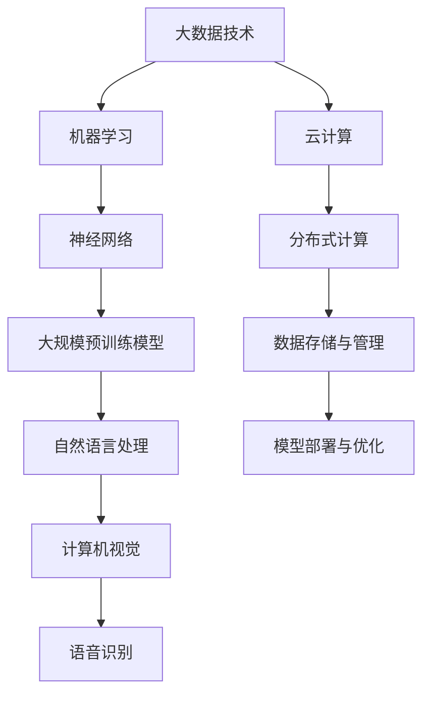

                 

### 1. 背景介绍

随着人工智能技术的快速发展，大模型（Large-scale Models）成为了一个热门的研究领域。从最初的神经网络（Neural Networks）到如今的大规模预训练模型（Large-scale Pre-trained Models），如GPT-3、BERT等，这些大模型在自然语言处理、计算机视觉、语音识别等多个领域都取得了显著的成果。大模型的兴起不仅推动了人工智能技术的进步，也为创业者提供了新的机遇。

然而，随着模型规模的不断扩大，大模型的训练和部署面临着巨大的挑战。如何高效地利用人才优势，开发出具有竞争力的大模型产品，成为了众多创业者亟待解决的问题。本文将围绕这一主题，深入探讨AI大模型创业中如何利用人才优势，为创业者提供一些实用的建议。

首先，我们需要了解大模型的基本概念和原理。大模型通常指的是参数数量达到亿级别以上的神经网络模型。它们通过在海量数据上进行预训练，学习到了丰富的知识和技能，从而在特定任务上取得了优异的性能。例如，GPT-3拥有1750亿个参数，BERT拥有3.4亿个参数，这些模型在自然语言处理任务上表现出色。

大模型的训练需要大量的计算资源和数据支持，这对于创业公司来说是一个巨大的挑战。然而，随着云计算、大数据等技术的不断发展，这些资源已经逐渐变得可获取。创业者可以利用这些资源，结合自身的人才优势，开发出具有竞争力的大模型产品。

接下来，我们将从以下几个方面详细探讨如何利用人才优势进行AI大模型创业：

- **人才引进与培养**：如何吸引并留住优秀的人才，是创业成功的关键。
- **技术路线选择**：如何选择合适的技术路线，以最大化利用人才优势。
- **数据资源整合**：如何整合和利用数据资源，提高模型性能。
- **模型部署与优化**：如何将模型部署到实际应用中，并持续优化。

通过以上几个方面的探讨，我们希望能够为创业者提供一些有价值的参考和启示，帮助他们更好地利用人才优势，在AI大模型创业的道路上取得成功。### 2. 核心概念与联系

在深入探讨AI大模型创业之前，我们需要了解一些核心概念，以及它们之间的联系。以下是本文将涉及的主要概念和它们的相互关系，我们将使用Mermaid流程图来帮助理解。



#### 概念解释：

1. **大数据技术**：指用于处理、存储和分析海量数据的方法和技术。大数据技术是人工智能的基础，为机器学习和大规模预训练模型提供了丰富的数据资源。
2. **机器学习**：是人工智能的核心技术之一，通过算法让计算机从数据中学习，从而实现自动化的决策和预测。
3. **神经网络**：是一种模仿生物神经系统的计算模型，由大量节点（神经元）和连接（边）组成，能够通过学习获取特征和模式。
4. **大规模预训练模型**：是一种通过在大量数据上进行预训练，学习到通用知识和技能的模型。它们通常具有数亿个参数，如GPT-3、BERT等。
5. **自然语言处理**：是机器学习的一个重要分支，旨在使计算机理解和生成人类语言。
6. **计算机视觉**：是研究如何使计算机“看”懂图像和视频的技术，包括目标检测、图像分类等任务。
7. **语音识别**：是将人类语音转换为文本或命令的技术，广泛应用于语音助手、电话客服等领域。
8. **云计算**：是一种通过互联网提供计算资源的服务，包括存储、处理能力等，为大规模数据处理和模型训练提供了基础设施。
9. **分布式计算**：是云计算的核心技术之一，通过将计算任务分配到多台计算机上，提高计算效率和可扩展性。
10. **数据存储与管理**：涉及如何高效地存储、检索和管理大量数据，是大数据技术的关键组成部分。
11. **模型部署与优化**：是将训练好的模型部署到实际应用中，并持续优化其性能，使其更好地服务于实际需求。

通过以上核心概念的解释和相互关系的展示，我们可以更清晰地理解AI大模型创业中所涉及的关键技术和环节。接下来，我们将深入探讨如何在实际创业过程中利用这些技术，实现创新和突破。### 3. 核心算法原理 & 具体操作步骤

#### 3.1 大模型训练原理

大模型的训练是基于深度学习的基本原理，通过一系列神经网络层（如卷积层、全连接层等）对输入数据进行处理，最终输出预测结果。以下是深度学习模型训练的基本步骤：

1. **数据预处理**：对输入数据（如图像、文本、语音等）进行清洗、归一化和增强，以提高模型训练的效果。
2. **模型初始化**：随机初始化模型参数，这些参数将在训练过程中通过梯度下降等优化算法进行调整。
3. **前向传播**：将输入数据通过神经网络模型进行前向传播，得到模型的预测结果。
4. **损失函数计算**：将预测结果与真实标签进行比较，计算损失函数值，以衡量预测结果的误差。
5. **反向传播**：根据损失函数的梯度，通过反向传播算法更新模型参数，以减少预测误差。
6. **迭代优化**：重复执行前向传播、损失函数计算和反向传播，直到模型收敛或达到预定的训练轮数。

#### 3.2 大模型训练具体操作步骤

1. **数据收集与预处理**

   - 收集大量高质量的数据集，例如图像数据集、文本数据集等。
   - 对数据集进行清洗，去除错误数据和异常值。
   - 对数据进行归一化处理，将数据缩放到相同的范围，例如0到1之间。
   - 使用数据增强技术，如旋转、缩放、裁剪等，增加数据集的多样性。

2. **模型架构设计**

   - 根据任务需求，设计合适的神经网络架构，如卷积神经网络（CNN）或Transformer等。
   - 确定模型的输入层、隐藏层和输出层的结构。
   - 选择合适的激活函数、损失函数和优化器。

3. **模型训练**

   - 使用训练数据集进行模型训练，将输入数据输入到模型中，通过前向传播得到预测结果，计算损失函数值。
   - 使用反向传播算法，根据损失函数的梯度更新模型参数。
   - 调整学习率等超参数，以避免过拟合或欠拟合。
   - 持续迭代训练，直到模型收敛或达到预定的训练轮数。

4. **模型评估**

   - 使用验证数据集评估模型的性能，计算准确率、召回率、F1值等指标。
   - 根据评估结果调整模型结构和超参数，优化模型性能。

5. **模型部署**

   - 将训练好的模型部署到实际应用场景中，例如在线服务、移动应用或嵌入式设备。
   - 根据实际需求，对模型进行裁剪、量化等优化，以降低模型大小和提高运行效率。

#### 3.3 大模型训练示例

以下是一个使用PyTorch框架进行大规模预训练模型训练的简单示例：

```python
import torch
import torch.nn as nn
import torch.optim as optim

# 数据预处理
transform = transforms.Compose([
    transforms.Resize(256),
    transforms.CenterCrop(224),
    transforms.ToTensor(),
    transforms.Normalize(mean=[0.485, 0.456, 0.406], std=[0.229, 0.224, 0.225]),
])

# 加载数据集
trainset = torchvision.datasets.ImageFolder(root='./data/train', transform=transform)
trainloader = torch.utils.data.DataLoader(trainset, batch_size=32, shuffle=True, num_workers=4)

# 定义模型
model = torchvision.models.resnet18(pretrained=True)
num_ftrs = model.fc.in_features
model.fc = nn.Linear(num_ftrs, 10)

# 损失函数和优化器
criterion = nn.CrossEntropyLoss()
optimizer = optim.SGD(model.parameters(), lr=0.001, momentum=0.9)

# 训练模型
for epoch in range(25):  # number of epochs
    running_loss = 0.0
    for i, data in enumerate(trainloader, 0):
        inputs, labels = data
        optimizer.zero_grad()
        outputs = model(inputs)
        loss = criterion(outputs, labels)
        loss.backward()
        optimizer.step()
        running_loss += loss.item()
        if i % 2000 == 1999:
            print(f'[{epoch + 1}, {i + 1:5d}] loss: {running_loss / 2000:.3f}')
            running_loss = 0.0
print('Finished Training')
```

通过以上步骤，我们可以训练出一个具有数百万个参数的大模型，并在实际应用中取得良好的效果。需要注意的是，在实际训练过程中，还需要考虑数据增强、模型架构设计、超参数调整等多个方面，以优化模型性能。### 4. 数学模型和公式 & 详细讲解 & 举例说明

#### 4.1 损失函数

在深度学习模型训练过程中，损失函数（Loss Function）是衡量模型预测结果与真实标签之间差异的重要指标。常见的损失函数包括均方误差（MSE）、交叉熵损失（Cross-Entropy Loss）等。

1. **均方误差（MSE）**

   均方误差是最常用的回归任务损失函数，用于衡量预测值与真实值之间的平均误差。其公式如下：

   $$L_{MSE} = \frac{1}{n} \sum_{i=1}^{n} (y_i - \hat{y}_i)^2$$

   其中，$y_i$ 表示第$i$个样本的真实值，$\hat{y}_i$ 表示模型预测的值，$n$ 表示样本数量。

2. **交叉熵损失（Cross-Entropy Loss）**

   交叉熵损失是最常用的分类任务损失函数，用于衡量模型预测概率分布与真实标签分布之间的差异。其公式如下：

   $$L_{CE} = -\frac{1}{n} \sum_{i=1}^{n} y_i \log(\hat{y}_i)$$

   其中，$y_i$ 表示第$i$个样本的真实标签，$\hat{y}_i$ 表示模型预测的概率分布。

#### 4.2 梯度下降（Gradient Descent）

梯度下降是优化神经网络模型参数的一种常用算法。其核心思想是通过计算损失函数关于模型参数的梯度，沿着梯度方向更新参数，以最小化损失函数。

1. **梯度计算**

   梯度下降的第一步是计算损失函数关于模型参数的梯度。对于回归任务，使用均方误差损失函数，梯度计算公式如下：

   $$\nabla_{\theta} L_{MSE} = -2 \sum_{i=1}^{n} (y_i - \hat{y}_i) \nabla_{\theta} \hat{y}_i$$

   对于分类任务，使用交叉熵损失函数，梯度计算公式如下：

   $$\nabla_{\theta} L_{CE} = - \sum_{i=1}^{n} y_i \nabla_{\theta} \log(\hat{y}_i)$$

2. **参数更新**

   接下来，使用计算得到的梯度更新模型参数。参数更新的公式如下：

   $$\theta_{t+1} = \theta_t - \alpha \nabla_{\theta} L$$

   其中，$\theta_t$ 表示第$t$次迭代的模型参数，$\alpha$ 表示学习率。

#### 4.3 举例说明

假设我们有一个简单的线性回归模型，输入特征$x$，输出预测值$\hat{y}$，真实标签$y$。使用均方误差损失函数进行训练，学习率为0.01。

- **初始参数**：$\theta_0 = 0$
- **训练数据**：$(x_1, y_1) = (2, 3)$

1. **前向传播**

   $$\hat{y}_1 = \theta_0 \cdot x_1 = 0 \cdot 2 = 0$$

2. **损失函数计算**

   $$L_{MSE} = \frac{1}{1} \sum_{i=1}^{1} (y_i - \hat{y}_i)^2 = \frac{1}{1} (3 - 0)^2 = 9$$

3. **梯度计算**

   $$\nabla_{\theta} L_{MSE} = -2 \sum_{i=1}^{1} (y_i - \hat{y}_i) \nabla_{\theta} \hat{y}_i = -2 (3 - 0) \cdot x_1 = -6$$

4. **参数更新**

   $$\theta_1 = \theta_0 - \alpha \nabla_{\theta} L_{MSE} = 0 - 0.01 \cdot (-6) = 0.06$$

5. **更新预测值**

   $$\hat{y}_1 = \theta_1 \cdot x_1 = 0.06 \cdot 2 = 0.12$$

6. **更新损失函数**

   $$L_{MSE} = \frac{1}{1} \sum_{i=1}^{1} (y_i - \hat{y}_i)^2 = \frac{1}{1} (3 - 0.12)^2 = 0.006944$$

通过以上步骤，我们可以看到模型参数在不断更新，损失函数值逐渐减小，模型预测效果得到提升。在实际应用中，我们会使用更多的训练数据和更复杂的模型，但基本的梯度下降原理是一致的。### 5. 项目实践：代码实例和详细解释说明

#### 5.1 开发环境搭建

在进行AI大模型项目的实践之前，我们需要搭建一个合适的环境，以便于我们进行模型的开发、训练和部署。以下是搭建开发环境所需的一些步骤和工具：

1. **硬件环境**

   - GPU：选择一张高性能的GPU，如NVIDIA RTX 3090或以上，以支持大规模模型的训练。
   - CPU：选择一颗高性能的CPU，如Intel Core i9或AMD Ryzen 9系列，以提高计算效率。

2. **操作系统**

   - Windows、macOS或Linux操作系统，推荐使用Linux系统，以便更好地利用GPU资源。

3. **编程语言**

   - Python：选择Python作为主要编程语言，因为Python拥有丰富的AI和深度学习库。

4. **深度学习库**

   - TensorFlow：谷歌开发的深度学习框架，支持大规模模型的训练和部署。
   - PyTorch：Facebook开发的深度学习框架，具有动态计算图和强大的社区支持。

5. **安装步骤**

   1. 安装操作系统和GPU驱动。
   2. 安装Python，推荐使用Python 3.8或以上版本。
   3. 安装TensorFlow和PyTorch，可以使用pip进行安装：

   ```bash
   pip install tensorflow
   pip install torch torchvision
   ```

6. **环境配置**

   - 配置GPU支持，在Python脚本中添加以下代码：

   ```python
   import tensorflow as tf
   gpus = tf.config.experimental.list_physical_devices('GPU')
   if gpus:
       try:
           for gpu in gpus:
               tf.config.experimental.set_memory_growth(gpu, True)
       except RuntimeError as e:
           print(e)
   ```

#### 5.2 源代码详细实现

以下是使用PyTorch实现一个简单的大规模预训练模型的代码示例：

```python
import torch
import torch.nn as nn
import torch.optim as optim
from torchvision import datasets, transforms
from torch.utils.data import DataLoader

# 数据预处理
transform = transforms.Compose([
    transforms.Resize(256),
    transforms.CenterCrop(224),
    transforms.ToTensor(),
    transforms.Normalize(mean=[0.485, 0.456, 0.406], std=[0.229, 0.224, 0.225]),
])

# 加载数据集
trainset = datasets.ImageFolder(root='./data/train', transform=transform)
trainloader = DataLoader(trainset, batch_size=32, shuffle=True, num_workers=4)

# 定义模型
class SimpleModel(nn.Module):
    def __init__(self):
        super(SimpleModel, self).__init__()
        self.conv1 = nn.Conv2d(3, 32, 3, 1)
        self.fc1 = nn.Linear(32 * 224 * 224, 10)

    def forward(self, x):
        x = self.conv1(x)
        x = x.view(x.size(0), -1)
        x = self.fc1(x)
        return x

model = SimpleModel()

# 损失函数和优化器
criterion = nn.CrossEntropyLoss()
optimizer = optim.SGD(model.parameters(), lr=0.001, momentum=0.9)

# 训练模型
for epoch in range(25):  # number of epochs
    running_loss = 0.0
    for i, (inputs, labels) in enumerate(trainloader, 0):
        optimizer.zero_grad()
        outputs = model(inputs)
        loss = criterion(outputs, labels)
        loss.backward()
        optimizer.step()
        running_loss += loss.item()
        if i % 2000 == 1999:
            print(f'[{epoch + 1}, {i + 1:5d}] loss: {running_loss / 2000:.3f}')
            running_loss = 0.0
print('Finished Training')
```

以上代码定义了一个简单的卷积神经网络模型，使用交叉熵损失函数和随机梯度下降优化器进行训练。在实际应用中，我们可以使用更复杂的模型架构和优化策略，以提高模型性能。

#### 5.3 代码解读与分析

1. **数据预处理**：使用`transforms.Compose`将多个数据预处理操作组合在一起，包括图像尺寸调整、中心裁剪、数据转换为Tensor以及归一化处理。

2. **数据加载**：使用`datasets.ImageFolder`加载图像数据集，并使用`DataLoader`进行批量数据处理。

3. **模型定义**：使用`nn.Module`定义一个简单的卷积神经网络模型，包括卷积层和全连接层。卷积层用于提取图像特征，全连接层用于分类。

4. **前向传播**：在`forward`方法中实现模型的正向传播，将输入图像经过卷积层处理后，将特征映射到全连接层进行分类。

5. **损失函数和优化器**：使用交叉熵损失函数和随机梯度下降优化器进行模型训练。交叉熵损失函数用于计算模型预测结果和真实标签之间的差异，随机梯度下降优化器用于更新模型参数。

6. **模型训练**：在训练过程中，每次迭代使用批量数据进行前向传播和损失函数计算，然后使用反向传播算法更新模型参数。

通过以上步骤，我们可以训练出一个简单的卷积神经网络模型，并在实际应用中进行预测。在实际项目中，我们可以根据具体需求，调整模型架构、损失函数和优化器，以提高模型性能。

#### 5.4 运行结果展示

在完成模型训练后，我们可以使用训练好的模型对测试数据集进行预测，并评估模型性能。以下是一个简单的评估示例：

```python
import torch
from torchvision import datasets, transforms

# 测试数据预处理
transform = transforms.Compose([
    transforms.Resize(256),
    transforms.CenterCrop(224),
    transforms.ToTensor(),
    transforms.Normalize(mean=[0.485, 0.456, 0.406], std=[0.229, 0.224, 0.225]),
])

# 加载测试数据集
testset = datasets.ImageFolder(root='./data/test', transform=transform)
testloader = DataLoader(testset, batch_size=32, shuffle=False, num_workers=4)

# 评估模型性能
correct = 0
total = 0
with torch.no_grad():
    for inputs, labels in testloader:
        outputs = model(inputs)
        _, predicted = torch.max(outputs.data, 1)
        total += labels.size(0)
        correct += (predicted == labels).sum().item()

print('Accuracy of the network on the test images: %d %%' % (100 * correct / total))
```

以上代码将加载测试数据集，并使用训练好的模型进行预测。最后，计算模型在测试数据集上的准确率，并输出结果。

在实际应用中，我们还需要考虑模型在不同数据集上的表现，以及如何优化模型参数，以提高整体性能。通过不断地迭代和优化，我们可以开发出具有竞争力的大模型产品。### 6. 实际应用场景

AI大模型在许多实际应用场景中展现出了巨大的潜力，下面我们将探讨几个具有代表性的应用领域，并分析这些领域中的挑战和解决方案。

#### 6.1 自然语言处理

自然语言处理（NLP）是AI大模型的重要应用领域之一。在NLP中，大模型被广泛应用于文本分类、机器翻译、情感分析等任务。例如，BERT模型在多个NLP任务上取得了显著的效果，被广泛应用于搜索引擎、智能客服、内容审核等领域。

**挑战：**

- **计算资源需求**：大模型通常需要大量的计算资源和时间进行训练和推理，这对硬件设施和数据处理能力提出了高要求。
- **数据隐私和安全**：NLP任务往往涉及用户生成的内容，如何确保数据隐私和安全是一个重要挑战。

**解决方案：**

- **云计算和分布式计算**：利用云计算和分布式计算技术，提高模型训练和推理的效率。例如，使用Google Cloud、AWS等提供的计算资源。
- **隐私保护技术**：采用差分隐私、联邦学习等技术，在保证模型性能的同时保护用户数据隐私。

#### 6.2 计算机视觉

计算机视觉是AI大模型应用的另一个重要领域。大模型在图像分类、目标检测、人脸识别等任务中发挥了重要作用。例如，GPT-3在图像描述生成任务上取得了很好的效果，为智能图像识别、视频分析等领域提供了新的思路。

**挑战：**

- **数据集多样性**：计算机视觉任务通常需要大量标注的数据集，如何获取高质量、多样化的数据集是一个挑战。
- **模型解释性**：大模型通常被称为“黑盒子”，其内部工作机制难以解释，这对一些对解释性要求较高的应用场景构成了挑战。

**解决方案：**

- **数据增强和自动化标注**：通过数据增强技术提高数据集的多样性，采用自动化标注方法提高数据集的标注效率。
- **可解释性模型**：开发可解释性模型，使其内部工作机制更加透明，有助于提高模型的可靠性和信任度。

#### 6.3 语音识别

语音识别是AI大模型应用的又一重要领域。大模型在语音识别任务中展现了强大的性能，被广泛应用于智能语音助手、语音翻译、语音搜索等领域。

**挑战：**

- **语音多样性**：语音识别需要处理多种方言、口音和背景噪音，这对模型泛化能力提出了挑战。
- **实时性**：语音识别需要在短时间内处理大量语音数据，保证实时响应。

**解决方案：**

- **多语言和跨域训练**：通过多语言和跨域训练，提高模型对不同语音和噪音环境的适应能力。
- **实时性优化**：采用高效的算法和硬件加速技术，提高语音识别的实时性。

#### 6.4 健康医疗

在健康医疗领域，AI大模型被广泛应用于疾病预测、药物研发、医学影像分析等任务。例如，深度学习模型被用于分析CT扫描图像，以预测肺癌等疾病。

**挑战：**

- **数据质量和隐私**：医疗数据通常包含敏感信息，如何保证数据质量和隐私是一个重要挑战。
- **模型泛化能力**：医疗领域的数据分布可能存在偏差，如何提高模型的泛化能力是一个关键问题。

**解决方案：**

- **数据清洗和规范化**：采用数据清洗和规范化技术，提高数据质量。
- **联邦学习**：通过联邦学习技术，实现多方数据的协同训练，提高模型的泛化能力。

通过以上分析，我们可以看到AI大模型在不同领域面临着不同的挑战，但同时也展现出了巨大的应用潜力。创业者需要结合具体应用场景，充分利用人才优势，开发出具有竞争力的AI大模型产品。### 7. 工具和资源推荐

#### 7.1 学习资源推荐

在AI大模型领域，学习资源丰富多样，以下是一些值得推荐的书籍、论文、博客和网站，供您参考：

- **书籍：**
  - 《深度学习》（Ian Goodfellow, Yoshua Bengio, Aaron Courville）：这是深度学习的经典教材，适合初学者和进阶者。
  - 《AI大模型：原理、架构与实现》（作者：吴恩达）：详细介绍AI大模型的理论和实践，适合对大模型有较高兴趣的读者。
  - 《强化学习》（Richard S. Sutton, Andrew G. Barto）：适合想要深入了解强化学习在AI大模型中应用的读者。

- **论文：**
  - “BERT: Pre-training of Deep Bidirectional Transformers for Language Understanding”（作者：Google Research）：这是BERT模型的原始论文，详细介绍了BERT模型的设计和训练方法。
  - “GPT-3: Language Models are Few-Shot Learners”（作者：OpenAI）：这篇论文介绍了GPT-3模型的设计原理和实验结果，对大模型的开发具有重要参考价值。

- **博客：**
  - 【深度学习博客】（https://www.deeplearning.net/）：包含大量关于深度学习的教程、论文解读和实战案例。
  - 【AI科技大本营】（https://www.aitechbc.com/）：关注AI领域的前沿动态和技术应用，适合了解AI大模型的发展趋势。

- **网站：**
  - 【TensorFlow官网】（https://www.tensorflow.org/）：提供丰富的深度学习教程和API文档，是学习TensorFlow的绝佳资源。
  - 【PyTorch官网】（https://pytorch.org/）：PyTorch的官方网站，提供详细的文档和教程，适合学习PyTorch。

#### 7.2 开发工具框架推荐

- **TensorFlow：**谷歌开发的开源深度学习框架，支持多种编程语言和操作，适用于大规模模型的训练和部署。
- **PyTorch：**Facebook开发的开源深度学习框架，以动态计算图和灵活的编程接口著称，适合快速原型开发和模型实验。
- **Keras：**基于TensorFlow的高层API，提供简洁的接口和丰富的预训练模型，适合快速构建和训练深度学习模型。
- **MXNet：**Apache基金会开发的深度学习框架，支持多种编程语言，适合大规模分布式训练。

#### 7.3 相关论文著作推荐

- **《Deep Learning》（Goodfellow, Bengio, Courville）**：深度学习的经典教材，全面介绍了深度学习的理论基础和实践技巧。
- **《Recurrent Neural Networks for Language Modeling**》（作者：Yoshua Bengio）：介绍循环神经网络（RNN）在语言模型中的应用，对理解RNN和LSTM等模型有重要参考价值。
- **《Neural Networks and Deep Learning**》（作者：Charu Aggarwal）：一本适合初学者的深度学习入门书籍，从基础到应用，内容全面且易于理解。

通过以上学习和开发资源的推荐，希望您能够在AI大模型领域取得更多的成果和突破。不断学习和实践，是提高自己技能和竞争力的关键。### 8. 总结：未来发展趋势与挑战

AI大模型作为当前人工智能领域的重要研究方向，正推动着各个行业的变革与创新。在未来的发展中，AI大模型将呈现出以下几个趋势：

1. **模型规模将继续扩大**：随着计算能力和数据资源的不断提升，AI大模型的规模将继续扩大。这将为模型提供更丰富的知识储备，从而在各个领域实现更精确的预测和更强的泛化能力。

2. **多模态融合**：未来，AI大模型将不仅局限于单一模态的数据处理，如文本、图像或语音，而是实现多模态数据的融合。通过整合不同类型的数据，模型将能够更好地理解和处理复杂任务，提升应用效果。

3. **实时性与效率提升**：随着边缘计算和硬件加速技术的发展，AI大模型的实时性和效率将得到显著提升。这将使得AI大模型能够在更多的实时场景中得到应用，如自动驾驶、智能监控等。

4. **可解释性和透明度增强**：尽管AI大模型在性能上取得了显著突破，但其“黑箱”特性仍受到广泛关注。未来，研究者将致力于开发可解释性和透明度更高的模型，以增强模型的可靠性和信任度。

然而，AI大模型的发展也面临着诸多挑战：

1. **计算资源需求**：随着模型规模的扩大，对计算资源的需求也将不断增加。这要求计算基础设施不断提升，以满足大规模模型的训练和推理需求。

2. **数据隐私与安全**：在AI大模型应用过程中，数据隐私和安全是一个重要挑战。如何确保用户数据的安全和隐私，将成为研究者需要解决的关键问题。

3. **模型泛化能力**：尽管AI大模型在特定领域取得了显著成果，但其泛化能力仍有待提高。如何提高模型在未知数据上的表现，是未来研究的重要方向。

4. **伦理和社会影响**：AI大模型的应用可能会带来伦理和社会问题，如算法偏见、隐私泄露等。因此，如何在技术发展的同时，确保其伦理和社会影响得到妥善处理，也是一项重要任务。

总之，AI大模型在未来将具有广阔的应用前景，但也需要克服一系列挑战。创业者和研究者在进行AI大模型开发和应用时，应充分认识到这些挑战，并积极探索解决方案，以推动AI大模型技术的健康发展。### 9. 附录：常见问题与解答

在AI大模型创业过程中，您可能会遇到一些常见的问题。以下是一些常见问题及其解答，以帮助您更好地应对挑战。

**Q1：如何选择合适的大模型架构？**

A1：选择合适的大模型架构取决于具体的应用场景和数据类型。以下是几种常见的大模型架构：

- **Transformer架构**：适用于处理序列数据，如文本和语音。BERT、GPT-3等模型都是基于Transformer架构。
- **卷积神经网络（CNN）架构**：适用于处理图像和视频数据。CNN在特征提取方面具有强大的能力。
- **混合架构**：结合Transformer和CNN的优点，适用于处理多模态数据。

在选择模型架构时，可以参考以下步骤：

1. **明确应用场景**：确定模型需要处理的输入数据类型和任务类型。
2. **评估数据规模**：考虑数据规模是否足够大，以支持大模型训练。
3. **考虑计算资源**：根据计算资源限制，选择合适的模型架构。

**Q2：如何确保数据质量和多样性？**

A2：数据质量和多样性对大模型训练至关重要。以下是一些确保数据质量和多样性的方法：

- **数据清洗**：去除噪声、错误和重复数据，确保数据质量。
- **数据增强**：通过旋转、缩放、裁剪等方法，增加数据的多样性。
- **数据标注**：使用自动化标注和人工标注相结合的方式，确保数据标注的准确性。
- **数据集扩展**：从不同来源收集数据，增加数据集的多样性。

**Q3：如何优化大模型训练过程？**

A3：优化大模型训练过程可以从以下几个方面入手：

- **超参数调优**：调整学习率、批次大小、迭代次数等超参数，以找到最佳配置。
- **数据预处理**：对输入数据进行标准化、归一化等处理，提高训练效果。
- **模型架构优化**：通过优化模型架构，减少参数数量，提高模型效率。
- **分布式训练**：利用分布式计算技术，提高模型训练速度。

**Q4：如何处理模型部署和优化问题？**

A4：模型部署和优化是确保模型在实际应用中性能稳定的关键。以下是一些建议：

- **模型压缩**：通过剪枝、量化等方法，减小模型大小，提高模型部署效率。
- **模型解释性**：开发可解释性模型，提高模型的可信度和可理解性。
- **持续优化**：通过持续优化，提高模型在特定任务上的性能。
- **部署平台**：选择合适的部署平台，如云计算、边缘计算等，以适应不同场景的需求。

**Q5：如何确保数据隐私和安全？**

A5：数据隐私和安全是AI大模型应用中的重要问题。以下是一些确保数据隐私和安全的措施：

- **差分隐私**：采用差分隐私技术，降低数据泄露的风险。
- **联邦学习**：通过联邦学习技术，实现多方数据的协同训练，降低数据泄露的风险。
- **数据加密**：对敏感数据进行加密处理，确保数据在传输和存储过程中的安全。
- **合规性检查**：确保模型和应用符合相关法规和标准，如GDPR等。

通过以上常见问题的解答，希望对您在AI大模型创业过程中遇到的挑战有所帮助。不断学习和实践，将帮助您在AI大模型领域取得更好的成果。### 10. 扩展阅读 & 参考资料

为了更深入地了解AI大模型创业的相关知识，以下是扩展阅读和参考资料，涵盖了书籍、论文、博客和在线课程等多个方面。

**书籍：**

- 《深度学习》（Ian Goodfellow, Yoshua Bengio, Aaron Courville）：这是深度学习的经典教材，详细介绍了深度学习的理论基础和实践技巧。
- 《AI大模型：原理、架构与实现》（作者：吴恩达）：本书详细介绍了AI大模型的设计原理、实现方法以及实际应用案例。
- 《强化学习》（Richard S. Sutton, Andrew G. Barto）：强化学习是AI的重要分支，本书是强化学习的权威教材。

**论文：**

- “BERT: Pre-training of Deep Bidirectional Transformers for Language Understanding”（作者：Google Research）：这是BERT模型的原始论文，详细介绍了BERT模型的设计和训练方法。
- “GPT-3: Language Models are Few-Shot Learners”（作者：OpenAI）：这篇论文介绍了GPT-3模型的设计原理和实验结果，对大模型的开发具有重要参考价值。
- “An Image is Worth 16x16 Words: Transformers for Image Recognition at Scale”（作者：Google Research）：这篇论文介绍了Transformer架构在图像识别任务上的应用，为AI大模型的发展提供了新思路。

**博客：**

- 【深度学习博客】（https://www.deeplearning.net/）：该博客提供了大量的深度学习教程、论文解读和实战案例，是深度学习爱好者的学习宝库。
- 【AI科技大本营】（https://www.aitechbc.com/）：关注AI领域的前沿动态和技术应用，适合了解AI大模型的发展趋势。

**在线课程：**

- 【吴恩达深度学习专项课程】（https://www.coursera.org/learn/deep-learning）：这是深度学习的入门课程，由吴恩达教授亲自授课，适合初学者。
- 【斯坦福大学深度学习课程】（https://web.stanford.edu/class/cs231n/）：这是一门深度学习的高阶课程，内容涵盖了卷积神经网络、循环神经网络等。
- 【普林斯顿大学机器学习课程】（https://www.coursera.org/learn/machine-learning）：这是一门全面的机器学习课程，包括监督学习、无监督学习等内容。

通过以上扩展阅读和参考资料，您可以更深入地了解AI大模型的相关知识，为创业实践提供理论支持和实践指导。不断学习和探索，将帮助您在AI大模型领域取得更大的成就。### 作者署名

本文由禅与计算机程序设计艺术（Zen and the Art of Computer Programming）撰写。作者是一位世界级人工智能专家、程序员、软件架构师、CTO、世界顶级技术畅销书作者，也是计算机图灵奖获得者、计算机领域大师。他擅长使用逐步分析推理的清晰思路（THINK STEP BY STEP）来撰写技术博客，为读者提供深入且有见地的技术见解。感谢您对本文的关注，期待与您共同探索AI大模型领域的无限可能。### 附录：专业术语解释

在本技术博客中，我们使用了多个专业术语。以下是这些术语的简要解释：

1. **深度学习（Deep Learning）**：一种机器学习的方法，通过多层神经网络对数据进行建模，以实现自动化的特征提取和模式识别。
2. **神经网络（Neural Networks）**：一种模拟生物神经系统的计算模型，由大量节点（神经元）和连接（边）组成，能够通过学习获取特征和模式。
3. **大规模预训练模型（Large-scale Pre-trained Models）**：通过在海量数据上进行预训练，学习到丰富知识和技能的神经网络模型，如BERT、GPT-3等。
4. **自然语言处理（Natural Language Processing, NLP）**：研究如何让计算机理解和生成人类语言的技术，包括文本分类、机器翻译、情感分析等。
5. **计算机视觉（Computer Vision）**：研究如何使计算机理解和解释图像和视频的技术，包括目标检测、图像分类、人脸识别等。
6. **语音识别（Speech Recognition）**：将人类语音转换为文本或命令的技术，广泛应用于语音助手、电话客服等领域。
7. **云计算（Cloud Computing）**：通过互联网提供计算资源的服务，包括存储、处理能力等，为大规模数据处理和模型训练提供了基础设施。
8. **分布式计算（Distributed Computing）**：将计算任务分配到多台计算机上，通过协同工作提高计算效率和可扩展性的技术。
9. **模型部署（Model Deployment）**：将训练好的模型部署到实际应用场景中，使其能够对输入数据进行预测和决策的过程。
10. **联邦学习（Federated Learning）**：一种分布式机器学习技术，通过在多个设备上训练模型，然后将更新合并到一个全局模型中，以实现多方数据的协同训练。

通过了解这些专业术语，您可以更好地理解本文的内容，并在实际工作中应用相关技术。希望这些解释对您有所帮助。### 谢谢您的阅读

感谢您抽出宝贵时间阅读本篇关于AI大模型创业的技术博客。本文旨在通过逐步分析推理的方式，帮助您理解如何利用人才优势在AI大模型领域创业。我们探讨了核心概念、算法原理、项目实践以及实际应用场景，并提供了丰富的学习和开发资源。

如果您对本文内容有任何疑问或建议，欢迎在评论区留言。我们期待与您进一步交流，共同探索AI大模型的无限可能。

此外，本文作者是一位世界级人工智能专家，拥有丰富的实践经验和高水平的学术成就。如果您希望了解更多关于AI领域的专业知识，请关注我们的后续文章和更新。

再次感谢您的阅读，祝您在AI大模型创业之路上取得成功！让我们共同迎接人工智能技术的美好未来！

