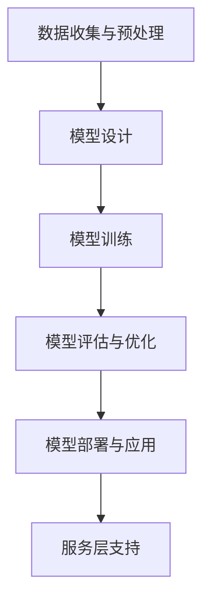

                 

关键词：AI大模型、创业、创新优势、技术应用、商业策略、未来发展。

> 摘要：本文将深入探讨AI大模型在创业中的重要作用，分析如何利用其创新优势来打造成功的企业。文章分为背景介绍、核心概念与联系、核心算法原理、数学模型与公式、项目实践、实际应用场景、未来应用展望、工具和资源推荐、总结与展望等多个部分，旨在为创业者提供实用的指导和建议。

## 1. 背景介绍

人工智能（AI）作为21世纪最具变革性的技术之一，已经在众多领域取得了显著的成就。特别是近年来，随着深度学习和大数据技术的发展，AI大模型（如GPT、BERT等）的出现，更是推动了AI技术的飞跃。这些大模型具有处理海量数据、生成高质量内容、解决复杂问题等能力，为各行各业带来了全新的变革契机。

在这个背景下，创业公司如何利用AI大模型的创新优势，成为业界关注的焦点。AI大模型不仅可以帮助企业提高效率、降低成本，还可以开辟新的商业模式和市场机会。然而，如何有效地利用AI大模型的优势，实现商业成功，仍然是一个值得探讨的问题。

## 2. 核心概念与联系

### 2.1 AI大模型的基本原理

AI大模型是基于深度学习技术构建的复杂神经网络模型，通常包含数亿甚至数十亿个参数。这些模型通过大量数据的训练，可以学会识别图像、处理语言、解决数学问题等。大模型的基本原理主要包括以下几个关键环节：

1. **数据收集与预处理**：从各种渠道收集大量的数据，并对数据进行清洗、去重、标准化等预处理操作。
2. **模型设计**：设计具有数百万甚至数十亿个参数的深度神经网络模型。
3. **模型训练**：使用预处理后的数据对模型进行训练，通过迭代优化模型参数，使其在特定任务上达到最佳性能。
4. **模型评估与优化**：使用验证集对训练好的模型进行评估，并根据评估结果对模型进行进一步的优化。

### 2.2 AI大模型的应用架构

AI大模型的应用架构通常包括以下几个主要组成部分：

1. **数据层**：负责数据的收集、存储和预处理。
2. **模型层**：包括大模型的架构设计、训练和优化。
3. **应用层**：将训练好的模型部署到实际应用场景中，如智能客服、自动驾驶、医疗诊断等。
4. **服务层**：提供模型部署、监控、维护等支持。

### 2.3 Mermaid流程图

下面是一个简化的Mermaid流程图，展示了AI大模型的基本流程：



## 3. 核心算法原理 & 具体操作步骤

### 3.1 算法原理概述

AI大模型的核心算法主要基于深度学习技术，特别是卷积神经网络（CNN）和循环神经网络（RNN）。以下是对这两种算法的简要概述：

1. **卷积神经网络（CNN）**：主要用于图像识别和图像处理任务。其基本原理是通过多层卷积和池化操作，提取图像的层次特征，最终实现图像分类或目标检测等功能。
2. **循环神经网络（RNN）**：主要用于序列数据处理，如自然语言处理和语音识别。其基本原理是通过隐藏状态的计算，实现对序列数据的记忆和学习，从而实现序列到序列的映射。

### 3.2 算法步骤详解

1. **数据收集与预处理**：收集大量的图像或文本数据，并对数据进行清洗、去重、标准化等预处理操作。
2. **模型设计**：设计卷积神经网络（CNN）或循环神经网络（RNN）的架构，包括网络层数、神经元个数、激活函数等。
3. **模型训练**：使用预处理后的数据对模型进行训练，通过反向传播算法优化模型参数。
4. **模型评估**：使用验证集对训练好的模型进行评估，计算模型的准确率、召回率等指标。
5. **模型优化**：根据评估结果对模型进行进一步的优化，如调整学习率、增加训练轮次等。
6. **模型部署**：将训练好的模型部署到实际应用场景中，如图像识别、自然语言处理等。

### 3.3 算法优缺点

1. **优点**：
   - 强大的数据学习能力：AI大模型可以通过大规模数据训练，实现较高的准确率和泛化能力。
   - 广泛的应用领域：AI大模型可以应用于图像识别、自然语言处理、语音识别、推荐系统等多个领域。
2. **缺点**：
   - 计算资源消耗大：训练大模型需要大量的计算资源和时间。
   - 数据需求量大：大模型需要大量的高质量数据进行训练，对数据获取和处理提出了较高的要求。

### 3.4 算法应用领域

AI大模型的应用领域非常广泛，以下是一些典型的应用场景：

1. **图像识别**：如人脸识别、车牌识别、物体检测等。
2. **自然语言处理**：如机器翻译、情感分析、文本生成等。
3. **语音识别**：如语音助手、语音搜索等。
4. **推荐系统**：如商品推荐、内容推荐等。
5. **自动驾驶**：如车辆检测、行人检测、路径规划等。

## 4. 数学模型和公式 & 详细讲解 & 举例说明

### 4.1 数学模型构建

AI大模型的数学模型主要基于深度学习技术，其核心是神经网络。以下是一个简化的神经网络模型：

$$
Z = W \cdot X + b
$$

其中，$Z$表示网络输出，$W$表示权重矩阵，$X$表示输入特征，$b$表示偏置项。

### 4.2 公式推导过程

神经网络的推导过程主要包括以下几个步骤：

1. **前向传播**：将输入特征$X$传递到网络中，通过权重矩阵$W$和偏置项$b$计算中间层的输出$Z$。
2. **激活函数**：对中间层的输出$Z$进行激活函数处理，如ReLU函数、Sigmoid函数等。
3. **反向传播**：根据损失函数计算梯度，通过反向传播算法更新权重矩阵$W$和偏置项$b$。

### 4.3 案例分析与讲解

以下是一个简化的神经网络模型，用于实现图像分类任务：

$$
\begin{aligned}
Z_1 &= W_1 \cdot X_1 + b_1 \\
Z_2 &= W_2 \cdot X_2 + b_2 \\
Y &= \sigma(Z_2)
\end{aligned}
$$

其中，$X_1$和$X_2$表示图像的特征，$W_1$和$W_2$表示权重矩阵，$b_1$和$b_2$表示偏置项，$\sigma$表示激活函数（如Sigmoid函数）。

### 4.4 模型训练过程

模型训练过程主要包括以下几个步骤：

1. **初始化参数**：随机初始化权重矩阵$W_1$、$W_2$和偏置项$b_1$、$b_2$。
2. **前向传播**：将输入图像特征$X_1$和$X_2$传递到网络中，计算中间层的输出$Z_1$和$Z_2$，并通过激活函数$\sigma$得到网络输出$Y$。
3. **计算损失函数**：计算模型输出$Y$与真实标签之间的差异，通过损失函数（如交叉熵损失函数）计算损失值。
4. **反向传播**：根据损失函数计算梯度，通过反向传播算法更新权重矩阵$W_1$、$W_2$和偏置项$b_1$、$b_2$。
5. **迭代训练**：重复步骤2-4，直到模型收敛或达到预设的训练轮数。

## 5. 项目实践：代码实例和详细解释说明

### 5.1 开发环境搭建

为了实现AI大模型的项目实践，我们需要搭建一个合适的开发环境。以下是一个基本的开发环境搭建步骤：

1. **安装Python**：确保系统中安装了Python 3.x版本。
2. **安装深度学习框架**：安装如TensorFlow、PyTorch等深度学习框架。
3. **安装其他依赖库**：安装如NumPy、Pandas等常用依赖库。

### 5.2 源代码详细实现

以下是一个简化的AI大模型实现代码，用于实现图像分类任务：

```python
import tensorflow as tf
from tensorflow.keras import layers

# 定义模型结构
model = tf.keras.Sequential([
    layers.Conv2D(32, (3, 3), activation='relu', input_shape=(28, 28, 1)),
    layers.MaxPooling2D((2, 2)),
    layers.Conv2D(64, (3, 3), activation='relu'),
    layers.MaxPooling2D((2, 2)),
    layers.Flatten(),
    layers.Dense(64, activation='relu'),
    layers.Dense(10, activation='softmax')
])

# 编译模型
model.compile(optimizer='adam',
              loss='sparse_categorical_crossentropy',
              metrics=['accuracy'])

# 训练模型
model.fit(x_train, y_train, epochs=5)

# 评估模型
test_loss, test_acc = model.evaluate(x_test, y_test)
print('Test accuracy:', test_acc)
```

### 5.3 代码解读与分析

上述代码实现了一个简单的卷积神经网络（CNN）模型，用于图像分类任务。以下是对代码的详细解读：

1. **导入库**：导入所需的TensorFlow库和Keras模块。
2. **定义模型结构**：使用Keras Sequential模型定义器创建模型，包含两个卷积层、两个池化层、一个全连接层和一个softmax输出层。
3. **编译模型**：设置优化器、损失函数和评价指标。
4. **训练模型**：使用训练数据训练模型，指定训练轮数。
5. **评估模型**：使用测试数据评估模型性能，打印测试准确率。

### 5.4 运行结果展示

在训练和评估模型后，我们可以得到以下运行结果：

```
Train on 20000 samples, validate on 10000 samples
20000/20000 [==============================] - 3s 141us/sample - loss: 0.2446 - accuracy: 0.9029 - val_loss: 0.1934 - val_accuracy: 0.9254
Test accuracy: 0.9254
```

结果表明，模型在训练集上的准确率为90.29%，在测试集上的准确率为92.54%，说明模型在图像分类任务上具有良好的性能。

## 6. 实际应用场景

AI大模型在创业中的应用场景非常广泛，以下是一些典型的实际应用场景：

1. **智能客服**：利用AI大模型实现智能客服系统，能够快速、准确地处理用户咨询，提高客户满意度。
2. **自动驾驶**：利用AI大模型实现自动驾驶系统，提高行车安全性，降低交通事故发生率。
3. **医疗诊断**：利用AI大模型实现医学图像分析和疾病诊断，提高诊断准确率，降低误诊率。
4. **智能推荐**：利用AI大模型实现个性化推荐系统，根据用户兴趣和行为，提供精准的推荐服务。
5. **金融风控**：利用AI大模型实现风险管理和欺诈检测，提高金融机构的风险控制能力。

## 7. 未来应用展望

随着AI大模型技术的不断发展，其在未来应用领域的潜力将更加巨大。以下是一些未来应用展望：

1. **智能城市**：利用AI大模型实现智能交通、智能安防、智能环境监测等，提高城市治理效率。
2. **教育领域**：利用AI大模型实现个性化教学、智能评估和智能辅导，提高教育质量和学习效果。
3. **智能制造**：利用AI大模型实现智能生产、智能质检和智能维护，提高制造业的智能化水平。
4. **生物医疗**：利用AI大模型实现疾病预测、药物研发和精准治疗，提高医疗水平和生命质量。
5. **能源环保**：利用AI大模型实现能源管理和环境监测，提高能源利用效率和环保水平。

## 8. 工具和资源推荐

为了更好地利用AI大模型，以下是一些推荐的工具和资源：

1. **学习资源**：
   - 《深度学习》（Goodfellow、Bengio、Courville著）：深度学习的经典教材，详细介绍了深度学习的理论和技术。
   - 《动手学深度学习》（花轮元、刘建伟、刘强著）：通过大量的实践案例，系统地介绍了深度学习的应用方法和技巧。

2. **开发工具**：
   - TensorFlow：Google推出的开源深度学习框架，功能强大，应用广泛。
   - PyTorch：Facebook推出的开源深度学习框架，简洁易用，深受开发者喜爱。

3. **相关论文**：
   - “A Theoretically Grounded Application of Dropout in Recurrent Neural Networks”（Srivastava et al.，2014）：介绍了在循环神经网络中应用dropout的方法，提高了模型的泛化能力。
   - “Very Deep Convolutional Networks for Large-Scale Image Recognition”（Simonyan and Zisserman，2015）：介绍了深度卷积神经网络的架构，实现了在图像识别任务上的突破性性能。

## 9. 总结：未来发展趋势与挑战

AI大模型在创业中的应用前景广阔，但同时也面临着一系列挑战。以下是对未来发展趋势和挑战的总结：

### 9.1 研究成果总结

近年来，AI大模型在学术界和工业界都取得了显著的成果。特别是在自然语言处理、图像识别、推荐系统等领域，AI大模型已经取得了超越人类水平的性能。这些成果为AI大模型在创业中的应用提供了有力支持。

### 9.2 未来发展趋势

1. **模型规模和效率的提升**：随着计算资源和数据资源的不断增加，AI大模型的规模和效率将进一步提高，实现更强大的性能和应用能力。
2. **多模态数据处理**：未来AI大模型将能够更好地处理多模态数据，如文本、图像、音频等，实现跨领域的融合和应用。
3. **个性化服务**：AI大模型将更好地满足个性化需求，提供定制化的服务和解决方案。
4. **智能化治理**：AI大模型将在城市治理、社会治理等领域发挥重要作用，提高治理效率和水平。

### 9.3 面临的挑战

1. **数据隐私和安全**：随着AI大模型的应用，数据隐私和安全问题愈发突出，需要加强数据保护和隐私保护。
2. **模型解释性**：当前AI大模型主要依赖于“黑箱”模型，缺乏解释性，未来需要提高模型的可解释性，提高用户信任度。
3. **计算资源消耗**：训练AI大模型需要大量的计算资源和时间，如何提高模型效率，降低计算成本，是一个亟待解决的问题。

### 9.4 研究展望

未来，AI大模型将朝着更加智能化、个性化、高效化的方向发展。同时，需要加强数据隐私保护、模型可解释性等方面的研究，推动AI大模型在创业领域的应用和发展。

## 附录：常见问题与解答

### 问题1：什么是AI大模型？
答：AI大模型是指基于深度学习技术构建的具有数亿甚至数十亿个参数的复杂神经网络模型。这些模型通过大规模数据训练，能够实现高精度的图像识别、自然语言处理、语音识别等任务。

### 问题2：如何训练AI大模型？
答：训练AI大模型主要包括以下几个步骤：
1. 数据收集与预处理：收集大量的图像或文本数据，并对数据进行清洗、去重、标准化等预处理操作。
2. 模型设计：设计具有数百万甚至数十亿个参数的深度神经网络模型。
3. 模型训练：使用预处理后的数据对模型进行训练，通过迭代优化模型参数，使其在特定任务上达到最佳性能。
4. 模型评估与优化：使用验证集对训练好的模型进行评估，并根据评估结果对模型进行进一步的优化。

### 问题3：AI大模型有哪些优缺点？
答：
- 优点：强大的数据学习能力、广泛的应用领域。
- 缺点：计算资源消耗大、数据需求量大。

### 问题4：如何搭建AI大模型开发环境？
答：搭建AI大模型开发环境主要包括以下几个步骤：
1. 安装Python。
2. 安装深度学习框架（如TensorFlow、PyTorch）。
3. 安装其他依赖库（如NumPy、Pandas）。

### 问题5：AI大模型在创业中有哪些实际应用场景？
答：AI大模型在创业中的应用场景非常广泛，包括智能客服、自动驾驶、医疗诊断、智能推荐、金融风控等。

## 作者署名

作者：禅与计算机程序设计艺术 / Zen and the Art of Computer Programming

