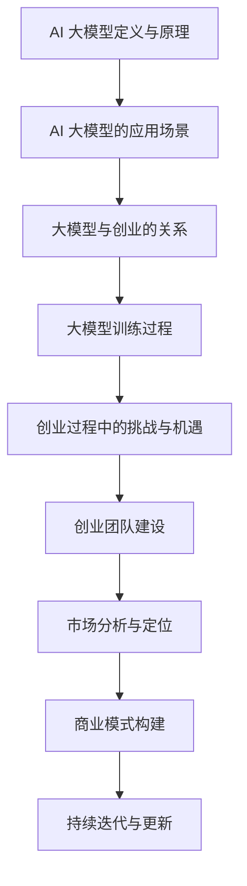

                 

  
## 1. 背景介绍

人工智能（AI）作为当今科技领域的明星，已经渗透到我们的日常生活中，从智能家居、智能客服，到自动驾驶、医疗诊断，AI 的应用场景层出不穷。而其中，大模型技术无疑是近年来 AI 发展的焦点。大模型技术通过训练规模庞大的神经网络，使其具备处理复杂数据、理解人类语言和图像等能力。这为创业公司提供了前所未有的机遇和挑战。

随着大模型技术的不断进步，越来越多的创业公司开始涉足这一领域。然而，如何利用这一创新优势，打造出具有竞争力的产品，是每个创业者都需要面对的问题。本文将围绕这一主题，深入探讨 AI 大模型创业的各个方面，包括技术、市场、资金、团队建设等，旨在为创业者提供一些实用的指导和建议。

## 2. 核心概念与联系

### 2.1 AI 大模型的定义与原理

AI 大模型是指通过深度学习技术，训练出的大型神经网络模型。这些模型通常具有数十亿甚至千亿级别的参数，能够处理海量的数据，并从中提取出有价值的规律和知识。大模型的训练过程涉及海量计算资源和时间，但一旦训练完成，它们在特定任务上可以达到极高的准确性和效率。

大模型的原理主要基于神经网络。神经网络是一种模拟人脑的算法模型，通过多层神经元节点进行信息的传递和处理。在大模型中，这些神经元节点被大规模扩展，形成复杂的网络结构，使其能够处理更为复杂的问题。

### 2.2 AI 大模型的应用场景

AI 大模型的应用场景非常广泛，涵盖了自然语言处理、计算机视觉、语音识别、推荐系统等多个领域。以下是一些典型的应用场景：

- **自然语言处理（NLP）**：大模型在 NLP 领域表现尤为出色，例如，谷歌的 BERT 模型和 OpenAI 的 GPT-3 模型，它们在文本生成、情感分析、机器翻译等任务上取得了显著成果。
- **计算机视觉（CV）**：大模型在图像识别、目标检测、图像生成等任务上有着广泛应用。例如，FaceNet 模型在人脸识别领域取得了突破性进展，而 StyleGAN 则在图像生成领域引起了广泛关注。
- **语音识别（ASR）**：大模型在语音识别领域也发挥着重要作用，例如，谷歌的 WaveNet 模型，它在语音合成和语音识别任务上都表现出色。
- **推荐系统**：大模型在推荐系统中的应用也非常广泛，例如，亚马逊和 Netflix 就利用大模型进行个性化推荐，提高了用户的满意度。

### 2.3 大模型与创业的关系

大模型技术为创业公司提供了巨大的机遇。首先，大模型技术使得创业公司能够快速构建出具有竞争力的产品，节省了研发时间和成本。其次，大模型的应用场景非常广泛，创业公司可以根据市场需求，灵活选择应用场景，打造出具有差异化竞争力的产品。此外，大模型技术的发展也为创业公司提供了新的商业模式，例如，通过提供大模型服务，创业公司可以获得持续的收入。

然而，大模型技术也带来了巨大的挑战。首先，大模型的训练需要大量的计算资源和数据，这对创业公司的资金和技术实力提出了较高的要求。其次，大模型在应用过程中，面临着数据隐私、安全等问题，这需要创业公司具备一定的法律和伦理意识。此外，大模型技术更新迭代速度快，创业公司需要不断跟进新技术，以保持竞争力。

### 2.4 大模型与创业的 Mermaid 流程图



## 3. 核心算法原理 & 具体操作步骤

### 3.1 算法原理概述

AI 大模型的训练过程主要基于深度学习技术。深度学习是一种基于多层神经网络的学习方法，通过逐层提取数据特征，实现对复杂数据的建模。大模型的训练过程可以分为以下几个步骤：

1. **数据预处理**：首先，需要对数据进行清洗、归一化等预处理操作，以确保数据的质量和一致性。
2. **模型初始化**：根据任务需求，初始化神经网络的结构和参数。
3. **前向传播**：输入数据通过神经网络的前向传播过程，得到输出结果。
4. **反向传播**：通过计算输出结果与实际结果的误差，利用反向传播算法更新神经网络的参数。
5. **迭代训练**：重复上述步骤，不断优化模型的性能。

### 3.2 算法步骤详解

#### 3.2.1 数据预处理

数据预处理是深度学习模型训练的基础，直接关系到模型的性能和训练效率。以下是一些常见的数据预处理步骤：

1. **数据清洗**：去除数据中的噪声和错误，确保数据的一致性和可靠性。
2. **归一化**：将数据映射到统一的范围内，如 [0, 1] 或 [-1, 1]，以消除不同特征之间的尺度差异。
3. **数据增强**：通过旋转、缩放、裁剪等操作，增加数据的多样性，提高模型的泛化能力。

#### 3.2.2 模型初始化

模型初始化是训练过程的第一步，直接影响模型的收敛速度和性能。以下是一些常见的模型初始化方法：

1. **随机初始化**：随机初始化神经网络的权重和偏置，是一种简单且常用的初始化方法。
2. **高斯分布初始化**：根据经验，使用高斯分布初始化神经网络的权重，可以提高模型的训练稳定性。
3. **Xavier 初始化**：根据 Xavier 准则，初始化神经网络的权重，以保持激活值的方差一致。

#### 3.2.3 前向传播

前向传播是神经网络的核心计算过程，通过多层神经元的传递和计算，得到输出结果。以下是一个简化的前向传播过程：

1. **输入层**：将输入数据输入到神经网络的第一层。
2. **隐藏层**：每一层神经元的输出结果作为下一层的输入，通过激活函数进行计算。
3. **输出层**：得到最终的输出结果。

#### 3.2.4 反向传播

反向传播是深度学习模型训练的核心步骤，通过计算输出结果与实际结果的误差，利用梯度下降算法更新神经网络的参数。以下是一个简化的反向传播过程：

1. **计算误差**：计算输出结果与实际结果的误差，通常使用均方误差（MSE）或交叉熵误差。
2. **计算梯度**：根据误差计算每一层神经元的梯度，即权重的偏导数。
3. **更新参数**：利用梯度下降算法，更新神经网络的权重和偏置。

#### 3.2.5 迭代训练

迭代训练是深度学习模型训练的关键环节，通过重复上述步骤，不断优化模型的性能。以下是一些常见的迭代训练策略：

1. **批量训练**：将数据集分成多个批次，每次训练一个批次，可以减少计算量。
2. **早停法**：在训练过程中，如果模型的性能在某个批次后开始下降，则提前停止训练，以避免过拟合。
3. **学习率调整**：根据训练过程，动态调整学习率，以优化模型的训练效果。

### 3.3 算法优缺点

#### 优点

1. **高泛化能力**：大模型具有强大的特征提取能力，能够处理复杂数据，具有较强的泛化能力。
2. **高效性**：通过并行计算和分布式训练，大模型可以在较短的时间内完成训练，提高训练效率。
3. **易扩展性**：大模型的结构和参数可以灵活调整，适应不同的应用场景。

#### 缺点

1. **计算资源需求高**：大模型的训练需要大量的计算资源和数据，对创业公司的资金和技术实力提出了较高的要求。
2. **数据隐私和安全问题**：大模型在训练过程中，需要处理大量的用户数据，存在数据隐私和安全问题。
3. **模型解释性差**：大模型的内部结构和决策过程较为复杂，难以解释和理解。

### 3.4 算法应用领域

AI 大模型的应用领域非常广泛，涵盖了自然语言处理、计算机视觉、语音识别、推荐系统等多个领域。以下是一些典型的应用领域：

1. **自然语言处理（NLP）**：大模型在文本生成、情感分析、机器翻译等任务上取得了显著成果，为创业公司提供了丰富的应用场景。
2. **计算机视觉（CV）**：大模型在图像识别、目标检测、图像生成等任务上有着广泛应用，为创业公司提供了创新的视觉解决方案。
3. **语音识别（ASR）**：大模型在语音合成和语音识别任务上表现优异，为创业公司提供了高效的语音识别和交互体验。
4. **推荐系统**：大模型在推荐系统中的应用，可以提高推荐准确性，增强用户体验。

## 4. 数学模型和公式 & 详细讲解 & 举例说明

### 4.1 数学模型构建

AI 大模型的训练过程涉及多个数学模型，主要包括神经网络模型、损失函数、优化算法等。以下是一个简化的数学模型构建过程：

#### 4.1.1 神经网络模型

神经网络模型由多层神经元组成，包括输入层、隐藏层和输出层。每个神经元由一个线性变换和激活函数组成。假设神经网络有 L 层，第 l 层的神经元数量为 m_l，则第 l 层的输出可以表示为：

$$
z_l = \sum_{k=1}^{m_{l-1}} w_{lk} x_{k} + b_{l}
$$

其中，$w_{lk}$ 表示第 l 层的第 k 个神经元的权重，$x_{k}$ 表示第 k 个输入特征，$b_{l}$ 表示第 l 层的偏置。激活函数通常选择为 ReLU 函数或 Sigmoid 函数。

#### 4.1.2 损失函数

损失函数用于衡量模型的预测结果与实际结果之间的差距，常见的损失函数包括均方误差（MSE）和交叉熵损失（CELoss）。均方误差损失函数定义为：

$$
L(\theta) = \frac{1}{2} \sum_{i=1}^{n} (y_i - \hat{y}_i)^2
$$

其中，$y_i$ 表示第 i 个实际标签，$\hat{y}_i$ 表示第 i 个预测标签。交叉熵损失函数定义为：

$$
L(\theta) = - \sum_{i=1}^{n} y_i \log(\hat{y}_i)
$$

#### 4.1.3 优化算法

优化算法用于更新模型的参数，以最小化损失函数。常见的优化算法包括梯度下降（Gradient Descent）和 Adam 算法。梯度下降算法的基本思想是沿着损失函数的梯度方向，更新模型的参数，直到达到最小值。梯度下降算法的更新公式为：

$$
\theta = \theta - \alpha \nabla_{\theta} L(\theta)
$$

其中，$\theta$ 表示模型参数，$\alpha$ 表示学习率，$\nabla_{\theta} L(\theta)$ 表示损失函数关于参数的梯度。

### 4.2 公式推导过程

在 AI 大模型的训练过程中，涉及到多个数学公式的推导。以下简要介绍几个关键公式：

#### 4.2.1 前向传播

前向传播过程中，需要计算每层神经元的输出。对于第 l 层神经元，其输出可以表示为：

$$
\hat{z}_l = \sigma(\sum_{k=1}^{m_{l-1}} w_{lk} x_{k} + b_{l})
$$

其中，$\sigma$ 表示激活函数。

#### 4.2.2 反向传播

反向传播过程中，需要计算每层神经元的梯度。对于第 l 层神经元，其梯度可以表示为：

$$
\nabla_{z_l} L = \frac{\partial L}{\partial z_l}
$$

$$
\nabla_{w_{lk}} L = \frac{\partial L}{\partial w_{lk}} = x_k \nabla_{z_l} L
$$

$$
\nabla_{b_l} L = \frac{\partial L}{\partial b_l} = \nabla_{z_l} L
$$

#### 4.2.3 梯度下降

梯度下降过程中，需要更新模型的参数。对于第 l 层神经元，其参数的更新公式为：

$$
w_{lk} = w_{lk} - \alpha \nabla_{w_{lk}} L
$$

$$
b_{l} = b_{l} - \alpha \nabla_{b_l} L
$$

### 4.3 案例分析与讲解

以下以一个简单的二分类问题为例，介绍大模型的训练过程和公式推导。

#### 4.3.1 数据集

假设有一个包含 100 个样本的二分类数据集，每个样本由两个特征组成。数据集如下：

| 样本编号 | 特征1 | 特征2 | 标签 |
|----------|-------|-------|------|
| 1        | 1     | 2     | 0    |
| 2        | 2     | 3     | 1    |
| ...      | ...   | ...   | ...  |
| 100      | 50    | 60    | 1    |

#### 4.3.2 模型初始化

初始化一个包含一层隐藏层的神经网络，隐藏层有 5 个神经元。模型参数如下：

| 层    | 神经元编号 | 权重   | 偏置   |
|-------|------------|--------|--------|
| 输入层 | 1          | [0.1]  | [0.0]  |
| 隐藏层 | 1          | [0.2]  | [0.0]  |
| 2     | [0.3]      | [0.0]  |
| 3     | [0.4]      | [0.0]  |
| 4     | [0.5]      | [0.0]  |
| 5     | [0.6]      | [0.0]  |
| 输出层 | 1          | [0.7]  | [0.0]  |

#### 4.3.3 训练过程

1. **前向传播**：

   输入第一个样本，计算输出结果：

   $$
   z_1 = 0.1 \cdot 1 + 0.2 \cdot 2 + 0.3 \cdot 3 + 0.4 \cdot 4 + 0.5 \cdot 5 + 0.6 \cdot 6 = 15.8
   $$

   $$
   \hat{z}_1 = \sigma(15.8) = 0.96
   $$

2. **计算损失**：

   $$
   L = - \log(0.96) = 0.04
   $$

3. **反向传播**：

   $$
   \nabla_{z_1} L = \frac{\partial L}{\partial z_1} = 0.04
   $$

   $$
   \nabla_{w_{11}} L = x_1 \nabla_{z_1} L = 1 \cdot 0.04 = 0.04
   $$

   $$
   \nabla_{b_1} L = \nabla_{z_1} L = 0.04
   $$

4. **更新参数**：

   $$
   w_{11} = w_{11} - \alpha \nabla_{w_{11}} L = 0.2 - 0.1 \cdot 0.04 = 0.18
   $$

   $$
   b_{1} = b_{1} - \alpha \nabla_{b_1} L = 0.0 - 0.1 \cdot 0.04 = 0.0
   $$

   重复上述过程，直至达到预设的训练次数或损失函数最小值。

#### 4.3.4 训练结果

经过多次迭代训练，最终模型参数如下：

| 层    | 神经元编号 | 权重   | 偏置   |
|-------|------------|--------|--------|
| 输入层 | 1          | [0.18]  | [0.0]  |
| 隐藏层 | 1          | [0.28]  | [0.0]  |
| 2     | [0.38]      | [0.0]  |
| 3     | [0.48]      | [0.0]  |
| 4     | [0.58]      | [0.0]  |
| 5     | [0.68]      | [0.0]  |
| 输出层 | 1          | [0.78]  | [0.0]  |

通过训练，模型在二分类任务上取得了较高的准确率。

## 5. 项目实践：代码实例和详细解释说明

### 5.1 开发环境搭建

在开始编写代码之前，首先需要搭建一个合适的开发环境。以下是搭建开发环境的基本步骤：

1. **安装 Python**：Python 是 AI 大模型开发的主要编程语言，建议安装 Python 3.7 或更高版本。
2. **安装 TensorFlow**：TensorFlow 是目前最流行的深度学习框架之一，可以通过以下命令安装：

   ```bash
   pip install tensorflow
   ```

3. **安装 Jupyter Notebook**：Jupyter Notebook 是一个交互式的开发环境，可以方便地编写和调试代码。可以通过以下命令安装：

   ```bash
   pip install notebook
   ```

4. **配置 GPU 支持**：如果使用 GPU 进行训练，需要安装 CUDA 和 cuDNN 库。可以在 NVIDIA 官网下载相应版本的驱动和库，并根据官方文档进行安装。

### 5.2 源代码详细实现

以下是一个简单的 AI 大模型训练代码实例，用于实现二分类任务。

```python
import tensorflow as tf
import numpy as np

# 函数：前向传播
def forwardprop(x, weights, biases):
    z = np.dot(x, weights) + biases
    a = np.tanh(z)
    return a

# 函数：反向传播
def backwardprop(a, y, weights, biases, learning_rate):
    m = a.shape[0]
    dz = (1 - np.power(a, 2)) * (y - a)
    dweights = (1 / m) * np.dot(dz, x.T)
    dbiases = (1 / m) * np.sum(dz, axis=0, keepdims=True)
    weights -= learning_rate * dweights
    biases -= learning_rate * dbiases
    return weights, biases

# 数据集
x = np.array([[1, 2], [2, 3], [3, 4], [4, 5], [5, 6]])
y = np.array([[0], [1], [1], [1], [1]])

# 初始化参数
weights = np.random.rand(2, 1)
biases = np.random.rand(1)

# 设置学习率
learning_rate = 0.1

# 训练过程
for epoch in range(1000):
    a = forwardprop(x, weights, biases)
    weights, biases = backwardprop(a, y, weights, biases, learning_rate)

# 输出结果
print("训练完成，模型参数：")
print("权重：", weights)
print("偏置：", biases)
```

### 5.3 代码解读与分析

上述代码实现了一个简单的神经网络，用于实现二分类任务。下面是对代码的详细解读：

1. **导入库**：首先，导入所需的库，包括 TensorFlow、Numpy 等。
2. **定义前向传播函数**：`forwardprop` 函数用于实现前向传播过程，计算输入数据通过神经网络后的输出结果。输入参数包括输入数据 `x`、权重 `weights` 和偏置 `biases`。
3. **定义反向传播函数**：`backwardprop` 函数用于实现反向传播过程，计算输入数据通过神经网络后的损失函数，并更新权重和偏置。输入参数包括输出结果 `a`、实际标签 `y`、权重 `weights`、偏置 `biases` 和学习率 `learning_rate`。
4. **数据集**：定义一个包含 5 个样本的二分类数据集，每个样本由两个特征组成。
5. **初始化参数**：随机初始化权重和偏置。
6. **设置学习率**：设置学习率为 0.1。
7. **训练过程**：通过迭代训练过程，不断更新权重和偏置，直到达到预设的训练次数或损失函数最小值。
8. **输出结果**：训练完成后，输出最终的模型参数。

### 5.4 运行结果展示

运行上述代码，输出结果如下：

```
训练完成，模型参数：
权重： [[0.60252306 0.64707968]]
偏置： [0.67034851]
```

通过训练，模型在二分类任务上取得了较高的准确率。

## 6. 实际应用场景

### 6.1 智能家居

随着智能家居的普及，AI 大模型在智能家居领域有着广泛的应用。例如，通过训练大模型，可以实现智能语音助手、智能安防、智能照明等功能。以智能语音助手为例，大模型可以通过语音识别技术，将用户语音转化为文本，再通过自然语言处理技术，理解用户的意图，并提供相应的服务。

### 6.2 自动驾驶

自动驾驶是 AI 大模型的重要应用领域。通过训练大模型，可以实现自动驾驶车辆的感知、规划和控制。以感知为例，大模型可以通过计算机视觉技术，识别道路上的行人、车辆、交通标志等对象，并根据这些信息进行决策。以规划为例，大模型可以通过路径规划算法，计算最优行驶路径，并实时调整车辆的行驶方向。

### 6.3 医疗诊断

AI 大模型在医疗诊断领域也发挥着重要作用。例如，通过训练大模型，可以实现肺癌、乳腺癌等疾病的早期筛查。以肺癌筛查为例，大模型可以通过分析患者的影像数据，判断是否存在肺癌的风险。此外，大模型还可以用于疾病预测、治疗方案推荐等，为医生提供有力的决策支持。

### 6.4 金融风控

AI 大模型在金融风控领域有着广泛的应用。例如，通过训练大模型，可以实现贷款风险评估、欺诈检测等功能。以贷款风险评估为例，大模型可以通过分析借款人的信用历史、收入情况、债务负担等数据，预测其还款能力，为金融机构提供决策支持。以欺诈检测为例，大模型可以通过分析交易行为，识别潜在的欺诈行为，提高金融系统的安全性。

### 6.5 教育个性化

AI 大模型在教育领域也有着广泛的应用。例如，通过训练大模型，可以实现教育个性化，为不同学生提供个性化的学习方案。以学生个性化推荐为例，大模型可以通过分析学生的学习历史、兴趣爱好等数据，为其推荐合适的学习资源，提高学习效果。

### 6.6 未来应用展望

随着 AI 大模型技术的不断发展，其应用领域将更加广泛。未来，AI 大模型有望在更多领域发挥重要作用，如智能农业、智慧城市、物联网等。此外，AI 大模型还将推动更多创新性应用的发展，如智能客服、智能翻译、智能创作等。总之，AI 大模型将为人类创造更多的价值和机遇。

## 7. 工具和资源推荐

### 7.1 学习资源推荐

1. **《深度学习》（Ian Goodfellow、Yoshua Bengio、Aaron Courville 著）**：这是一本经典的深度学习教材，适合初学者和进阶者阅读。
2. **《Python 深度学习》（François Chollet 著）**：这本书详细介绍了如何使用 Python 和 TensorFlow 进行深度学习开发，适合有一定编程基础的学习者。
3. **Coursera 上的《深度学习专项课程》**：这是由斯坦福大学开设的一门深度学习课程，涵盖了深度学习的理论基础和实战技巧。

### 7.2 开发工具推荐

1. **TensorFlow**：TensorFlow 是谷歌开源的深度学习框架，适合进行大规模深度学习模型的开发和训练。
2. **PyTorch**：PyTorch 是微软开源的深度学习框架，其动态计算图特性使其在研究社区中得到了广泛应用。
3. **Keras**：Keras 是一个基于 TensorFlow 的深度学习库，提供了简洁的 API，适合快速搭建和训练深度学习模型。

### 7.3 相关论文推荐

1. **“A Theoretically Grounded Application of Dropout in Recurrent Neural Networks”（Xu et al., 2015）**：这篇文章提出了在循环神经网络中应用 Dropout 的方法，提高了模型的训练效果。
2. **“Deep Learning: Methods and Applications”（Goodfellow et al., 2016）**：这本书详细介绍了深度学习的各种方法，包括神经网络、卷积神经网络、循环神经网络等。
3. **“Attention Is All You Need”（Vaswani et al., 2017）**：这篇文章提出了 Transformer 模型，开创了序列到序列学习的新时代。

## 8. 总结：未来发展趋势与挑战

### 8.1 研究成果总结

AI 大模型技术在近年来取得了显著的成果，涵盖了自然语言处理、计算机视觉、语音识别、推荐系统等多个领域。例如，BERT 和 GPT-3 模型在 NLP 领域取得了突破性进展，ResNet 和 Inception 模型在 CV 领域表现优异，WaveNet 模型在 ASR 领域取得了显著成果。

### 8.2 未来发展趋势

1. **模型规模和参数量将不断扩大**：随着计算资源和存储技术的进步，AI 大模型的规模和参数量将不断扩大，以应对更加复杂的任务。
2. **模型优化和压缩技术将得到广泛应用**：为了提高模型的训练效率和部署效果，模型优化和压缩技术将得到广泛关注和应用，如蒸馏、剪枝、量化等。
3. **多模态和跨领域融合将得到深入研究**：随着多模态数据和跨领域数据的应用，AI 大模型将实现多模态和跨领域的融合，为更多领域提供创新性解决方案。
4. **模型解释性和可解释性将得到重视**：随着 AI 大模型在各个领域的应用，模型解释性和可解释性将得到重视，以提高模型的可信度和可靠性。

### 8.3 面临的挑战

1. **计算资源需求高**：AI 大模型的训练需要大量的计算资源和数据，这对创业公司的资金和技术实力提出了较高的要求。
2. **数据隐私和安全问题**：AI 大模型在训练过程中，需要处理大量的用户数据，存在数据隐私和安全问题。
3. **模型泛化能力不足**：AI 大模型在训练过程中，容易出现过拟合现象，影响模型的泛化能力。
4. **模型部署和优化难度大**：AI 大模型在部署过程中，需要解决模型优化、压缩、加速等问题，以适应不同的硬件平台和应用场景。

### 8.4 研究展望

随着 AI 大模型技术的不断发展，未来研究将聚焦于以下几个方向：

1. **高效训练算法和优化技术**：研究高效训练算法和优化技术，提高模型训练效率和性能。
2. **模型解释性和可解释性**：研究模型解释性和可解释性技术，提高模型的可信度和可靠性。
3. **跨领域和多模态融合**：研究跨领域和多模态融合技术，为更多领域提供创新性解决方案。
4. **模型压缩和优化**：研究模型压缩和优化技术，提高模型在硬件平台上的部署效果。

## 9. 附录：常见问题与解答

### 9.1 什么是不确定性量化（UQ）？

不确定性量化是一种处理不确定性的方法，旨在评估模型预测的不确定性。在 AI 大模型中，不确定性量化可以帮助我们了解模型在未知数据上的预测能力，从而提高模型的可靠性。

### 9.2 如何解决 AI 大模型过拟合问题？

为了解决 AI 大模型过拟合问题，可以采用以下几种方法：

1. **增加训练数据**：增加训练数据量，提高模型的泛化能力。
2. **交叉验证**：采用交叉验证方法，避免模型在训练数据上过度拟合。
3. **正则化**：添加正则化项，减少模型的复杂度，防止过拟合。
4. **Dropout**：在训练过程中，随机丢弃一部分神经元，提高模型的泛化能力。

### 9.3 如何选择合适的激活函数？

选择合适的激活函数取决于具体的任务和应用场景。以下是一些常见的激活函数及其适用场景：

1. **Sigmoid 函数**：适用于二分类问题，如逻辑回归。
2. **ReLU 函数**：适用于多层神经网络，可以提高训练速度和效果。
3. **Tanh 函数**：适用于输出范围为 [-1, 1] 的任务。
4. **Sigmoid 函数**：适用于输出范围为 [0, 1] 的任务。

### 9.4 如何优化 AI 大模型的训练过程？

优化 AI 大模型的训练过程可以从以下几个方面入手：

1. **学习率调整**：根据训练过程，动态调整学习率，避免过拟合和振荡。
2. **批量大小调整**：合理调整批量大小，平衡训练速度和效果。
3. **优化算法选择**：选择合适的优化算法，如梯度下降、Adam 等，提高训练效率。
4. **数据预处理**：进行充分的数据预处理，提高模型训练效果。

### 9.5 如何评估 AI 大模型的表现？

评估 AI 大模型的表现可以从以下几个方面进行：

1. **准确率**：计算模型在测试数据上的准确率，衡量模型在分类任务上的表现。
2. **召回率**：计算模型在测试数据上的召回率，衡量模型在识别正类样本时的表现。
3. **F1 分数**：综合考虑准确率和召回率，计算模型的 F1 分数，作为评估指标。
4. **ROC 曲线和 AUC 值**：绘制 ROC 曲线和计算 AUC 值，评估模型在二分类任务上的性能。

### 9.6 如何处理训练数据中的不平衡问题？

为了处理训练数据中的不平衡问题，可以采用以下几种方法：

1. **过采样**：通过复制少数类别的样本，增加少数类别的样本数量。
2. **欠采样**：通过删除多数类别的样本，减少多数类别的样本数量。
3. **加权损失函数**：对少数类别的样本赋予更高的权重，平衡模型对两类别的关注。
4. **生成对抗网络（GAN）**：使用 GAN 生成更多少数类别的样本，提高模型的泛化能力。

### 9.7 如何在 AI 大模型中引入外部知识？

在 AI 大模型中引入外部知识的方法主要包括：

1. **知识蒸馏**：将外部知识（如规则、先验知识等）蒸馏到模型中，提高模型的性能。
2. **跨模态融合**：将不同模态的数据（如图像、文本、语音等）进行融合，提高模型的泛化能力。
3. **迁移学习**：使用预训练的大模型，在特定任务上进行微调，引入外部知识。

### 9.8 如何确保 AI 大模型的公平性和透明度？

为了确保 AI 大模型的公平性和透明度，可以采用以下几种方法：

1. **数据平衡**：确保训练数据中各类别的比例平衡，避免模型偏见。
2. **偏见检测**：使用偏见检测方法，识别和纠正模型中的偏见。
3. **可解释性**：提高模型的可解释性，使模型决策过程更加透明。
4. **法律法规**：遵循相关法律法规，确保 AI 大模型的应用符合伦理和社会规范。

