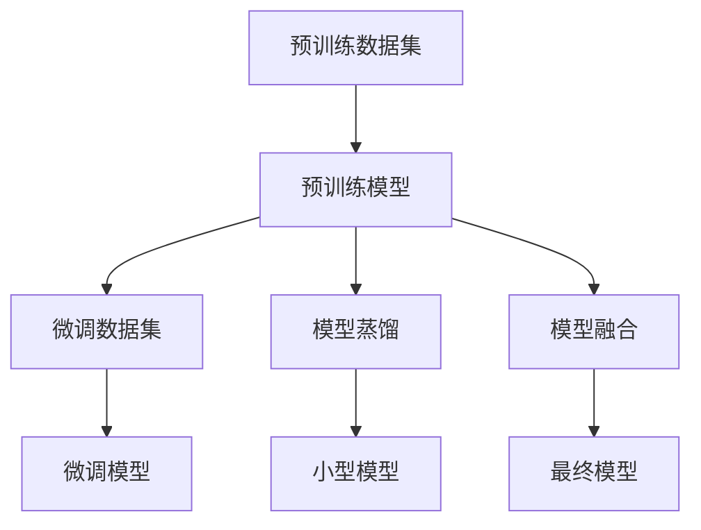

                 

### 文章标题

AI大模型创业：如何利用创新优势？

> 关键词：AI大模型、创业、创新优势、商业模式、技术落地、应用场景、行业洞察

> 摘要：本文将深入探讨AI大模型创业的路径与策略，分析如何在竞争激烈的市场中利用创新优势，实现技术到商业的成功转型。我们将从背景介绍、核心概念与联系、算法原理与操作步骤、数学模型与公式、项目实践、应用场景、工具和资源推荐等多个维度，为您呈现AI大模型创业的全面分析与实战指南。

## 1. 背景介绍

近年来，人工智能（AI）技术取得了突破性的进展，特别是大规模预训练模型（Large-scale Pre-trained Models）的兴起，使得AI大模型在各个领域展现出了强大的能力。这些模型通过对海量数据的训练，能够自动学习复杂的特征，并实现高效的问题解决。随着硬件性能的提升和计算资源的丰富，AI大模型的应用范围越来越广泛，从自然语言处理、计算机视觉到推荐系统、智能语音等，都有着显著的效果。

### 1.1 AI大模型的发展历程

AI大模型的发展可以追溯到2012年，当AlexNet在ImageNet竞赛中取得显著成绩时，深度学习开始受到广泛关注。随着技术的不断进步，模型规模逐渐扩大，计算资源的需求不断增加。2018年，GPT-3的发布标志着AI大模型在自然语言处理领域的重大突破。自此之后，Transformer架构成为主流，BERT、T5、GPT-NE等模型相继涌现，使得AI大模型在各个领域都取得了显著的进展。

### 1.2 AI大模型的应用场景

AI大模型在自然语言处理、计算机视觉、语音识别、推荐系统等领域都有着广泛的应用。例如，在自然语言处理领域，大模型可以用于机器翻译、文本生成、情感分析等任务；在计算机视觉领域，大模型可以用于图像分类、目标检测、图像生成等任务；在推荐系统领域，大模型可以用于用户画像、个性化推荐等任务。

### 1.3 创业背景与挑战

随着AI大模型技术的成熟，越来越多的创业公司开始尝试将这项技术应用于实际业务中。然而，创业并非易事，尤其是在竞争激烈的市场中。如何将AI大模型技术转化为商业价值，如何构建可持续的商业模式，如何应对技术落地和行业变革的挑战，都是创业者需要认真思考的问题。

## 2. 核心概念与联系

在AI大模型创业中，理解核心概念及其之间的联系是至关重要的。以下我们将介绍AI大模型的相关概念，并使用Mermaid流程图展示其原理与架构。

### 2.1 AI大模型概念

- **预训练（Pre-training）**：在特定领域或任务中，使用海量数据进行模型训练，使其具备一定的通用性。
- **微调（Fine-tuning）**：在预训练模型的基础上，针对特定任务进行微调，提高模型在特定任务上的表现。
- **模型蒸馏（Model Distillation）**：通过将知识从大型模型传递到小型模型，实现知识迁移和资源优化。
- **模型融合（Model Ensembling）**：将多个模型进行融合，提高模型的稳定性和准确性。

### 2.2 Mermaid流程图



## 3. 核心算法原理 & 具体操作步骤

### 3.1 预训练

预训练是AI大模型的基础，其核心步骤如下：

1. **数据收集与处理**：收集大规模的文本、图像、音频等数据，并进行预处理，如文本的分词、图像的标准化等。
2. **模型初始化**：选择合适的神经网络架构，如BERT、GPT等，并初始化模型参数。
3. **自我监督学习**：使用无监督的方法，如 masked language model（MLM）、denoising autoencoder（DAE）等，对模型进行预训练。
4. **优化模型参数**：通过梯度下降等方法，不断优化模型参数，提高模型在预训练数据集上的表现。

### 3.2 微调

微调是在预训练模型的基础上，针对特定任务进行优化，其核心步骤如下：

1. **数据准备**：收集与任务相关的数据集，并进行预处理。
2. **任务定义**：定义具体的任务，如文本分类、图像分类等。
3. **模型加载**：加载预训练模型，并对其进行结构调整，如添加特定层、调整输出层等。
4. **训练与评估**：在训练数据集上训练模型，并在验证集上评估模型性能，通过交叉验证等方法优化模型参数。

### 3.3 模型蒸馏

模型蒸馏是一种知识转移方法，其核心步骤如下：

1. **大模型训练**：使用大量数据对大型模型进行预训练。
2. **温度调整**：将大型模型的输出进行温度调整，以获得软性概率分布。
3. **小模型训练**：使用软性概率分布作为目标，对小型模型进行训练。
4. **性能评估**：评估小模型在特定任务上的性能，并与大型模型进行对比。

### 3.4 模型融合

模型融合是通过结合多个模型的输出，提高模型性能的方法，其核心步骤如下：

1. **模型选择**：选择多个具有不同结构和优化的模型。
2. **输入融合**：将多个模型的输入进行融合，如平均、拼接等。
3. **输出融合**：将多个模型的输出进行融合，如投票、加权平均等。
4. **性能评估**：评估融合模型在特定任务上的性能。

## 4. 数学模型和公式 & 详细讲解 & 举例说明

### 4.1 预训练过程中的数学模型

在预训练过程中，常用的数学模型包括：

1. **自注意力机制（Self-Attention）**
   $$ \text{Self-Attention}(Q, K, V) = \text{softmax}\left(\frac{QK^T}{\sqrt{d_k}}\right) V $$
   其中，$Q$、$K$、$V$ 分别为查询、键、值向量，$d_k$ 为键向量的维度。

2. **归一化因素（Normalization Factor）**
   $$ \text{Normalization Factor} = \frac{1}{\sqrt{d_k}} $$
   用于调整自注意力机制的权重。

3. **Masked Language Model (MLM)**
   $$ \text{Masked Language Model}(x) = \text{softmax}\left(\frac{xW}{\sqrt{d_k}}\right) $$
   其中，$x$ 为输入向量，$W$ 为模型参数。

### 4.2 微调过程中的数学模型

在微调过程中，常用的数学模型包括：

1. **交叉熵（Cross-Entropy）**
   $$ \text{Cross-Entropy}(y, \hat{y}) = -\sum_{i} y_i \log(\hat{y}_i) $$
   其中，$y$ 为真实标签，$\hat{y}$ 为模型预测概率。

2. **反向传播（Backpropagation）**
   $$ \Delta W = \frac{\partial \text{Loss}}{\partial W} $$
   通过梯度下降更新模型参数。

### 4.3 模型蒸馏过程中的数学模型

在模型蒸馏过程中，常用的数学模型包括：

1. **温度调整（Temperature Adjustment）**
   $$ \text{Softmax}_T(p) = \frac{e^{p/T}}{\sum_{i} e^{p_i/T}} $$
   其中，$T$ 为温度参数，用于调整软性概率分布。

2. **知识转移（Knowledge Transfer）**
   $$ \text{Knowledge Transfer} = \log \left( \frac{\sum_{i} p_i^{(s)} v_i}{\sum_{i} v_i} \right) $$
   其中，$p_i^{(s)}$ 为学生模型的输出概率，$v_i$ 为教师模型的输出值。

### 4.4 模型融合过程中的数学模型

在模型融合过程中，常用的数学模型包括：

1. **投票机制（Voting Mechanism）**
   $$ \text{Voting} = \arg\max_{i} \sum_{j} w_j \hat{y}_{ij} $$
   其中，$w_j$ 为权重参数，$\hat{y}_{ij}$ 为第 $i$ 个模型在第 $j$ 个数据点上的预测概率。

2. **加权平均（Weighted Average）**
   $$ \text{Weighted Average} = \frac{\sum_{i} w_i \hat{y}_i}{\sum_{i} w_i} $$
   其中，$w_i$ 为权重参数，$\hat{y}_i$ 为第 $i$ 个模型的预测概率。

### 4.5 举例说明

假设有两个模型 $A$ 和 $B$，我们要使用投票机制对它们进行融合。首先，我们收集一些数据点，对模型 $A$ 和 $B$ 分别进行预测，得到预测概率矩阵 $\hat{y}_A$ 和 $\hat{y}_B$。然后，我们使用投票机制计算融合模型的预测概率：

$$ \text{Voting} = \arg\max_{i} \sum_{j} w_j \hat{y}_{ij} $$

其中，$w_j$ 为权重参数，可以根据模型 $A$ 和 $B$ 在验证集上的性能进行设定。

## 5. 项目实践：代码实例和详细解释说明

### 5.1 开发环境搭建

在开始项目实践之前，我们需要搭建一个合适的开发环境。以下是一个基本的开发环境搭建步骤：

1. **安装 Python 环境**：安装 Python 3.7 或更高版本。
2. **安装依赖库**：安装 TensorFlow 2.4 或更高版本，以及相关依赖库，如 NumPy、Pandas 等。
3. **配置 GPU 环境**：如果需要使用 GPU，安装 CUDA 和 cuDNN。

### 5.2 源代码详细实现

以下是一个简单的 AI 大模型微调的 Python 代码实例：

```python
import tensorflow as tf
from tensorflow.keras.applications import VGG16
from tensorflow.keras.preprocessing.image import ImageDataGenerator

# 加载预训练模型
base_model = VGG16(weights='imagenet')

# 删除预训练模型的最后一个全连接层
x = base_model.output
x = tf.keras.layers.Flatten()(x)

# 添加新的全连接层进行微调
x = tf.keras.layers.Dense(1024, activation='relu')(x)
predictions = tf.keras.layers.Dense(10, activation='softmax')(x)

# 创建微调模型
model = tf.keras.Model(inputs=base_model.input, outputs=predictions)

# 编译模型
model.compile(optimizer='adam', loss='categorical_crossentropy', metrics=['accuracy'])

# 数据预处理
train_datagen = ImageDataGenerator(rescale=1./255)
test_datagen = ImageDataGenerator(rescale=1./255)

# 加载数据集
train_data = train_datagen.flow_from_directory('train', target_size=(224, 224), batch_size=32, class_mode='categorical')
test_data = test_datagen.flow_from_directory('test', target_size=(224, 224), batch_size=32, class_mode='categorical')

# 训练模型
model.fit(train_data, epochs=10, validation_data=test_data)
```

### 5.3 代码解读与分析

1. **加载预训练模型**：我们使用 VGG16 作为预训练模型，这是由牛津大学计算机视觉组开发的一种卷积神经网络架构。

2. **删除最后一个全连接层**：预训练模型通常包含一个用于分类的全连接层，我们在微调过程中需要删除这一层，以便添加新的全连接层。

3. **添加新的全连接层**：我们在删除的全连接层之后添加一个 1024 单元的全连接层，用于提取特征。然后，我们再添加一个 10 单元的全连接层，用于进行分类。

4. **创建微调模型**：我们使用 TensorFlow 的 `Model` 类创建微调模型，并将预训练模型作为输入层，新的全连接层作为输出层。

5. **编译模型**：我们使用 `compile` 方法编译模型，指定优化器、损失函数和评价指标。

6. **数据预处理**：我们使用 `ImageDataGenerator` 类对数据集进行预处理，包括缩放、随机变换等。

7. **加载数据集**：我们使用 `flow_from_directory` 方法加载数据集，将数据集分为训练集和测试集。

8. **训练模型**：我们使用 `fit` 方法训练模型，指定训练轮次、验证数据和保存模型。

### 5.4 运行结果展示

在训练过程中，我们可以使用 `fit` 方法的 `history` 参数获取训练和验证的损失值和准确率。以下是一个简单的运行结果：

```python
train_loss, train_accuracy = model.fit(train_data, epochs=10, validation_data=test_data).history
```

我们可以使用 matplotlib 库将训练和验证的损失值和准确率绘制出来：

```python
import matplotlib.pyplot as plt

plt.figure(figsize=(12, 4))

plt.subplot(1, 2, 1)
plt.plot(train_loss, label='train_loss')
plt.plot(val_loss, label='val_loss')
plt.xlabel('epochs')
plt.ylabel('loss')
plt.legend()

plt.subplot(1, 2, 2)
plt.plot(train_accuracy, label='train_accuracy')
plt.plot(val_accuracy, label='val_accuracy')
plt.xlabel('epochs')
plt.ylabel('accuracy')
plt.legend()

plt.show()
```

通过以上代码，我们可以得到训练和验证的损失值和准确率曲线，从而评估模型的性能。

## 6. 实际应用场景

### 6.1 自然语言处理

AI大模型在自然语言处理（NLP）领域有着广泛的应用。例如，在文本分类、机器翻译、情感分析等任务中，大模型可以显著提高模型的性能。例如，Google 的 BERT 模型在多个 NLP 任务上取得了显著的成绩，推动了NLP领域的发展。

### 6.2 计算机视觉

AI大模型在计算机视觉（CV）领域也有着重要的应用。例如，在图像分类、目标检测、图像生成等任务中，大模型可以自动学习复杂的特征，提高模型的准确性。例如，Google 的 GPT-3 模型在图像生成任务中取得了突破性的成绩，展示了AI大模型在CV领域的潜力。

### 6.3 推荐系统

AI大模型在推荐系统（RecSys）领域也有着广泛的应用。例如，在用户画像、个性化推荐等任务中，大模型可以自动学习用户的兴趣和行为，提高推荐系统的准确性。例如，Amazon 和 Netflix 等公司使用 AI 大模型优化其推荐系统，提高了用户体验和用户满意度。

### 6.4 金融风控

AI大模型在金融风控领域也有着重要的应用。例如，在贷款审批、欺诈检测、风险预测等任务中，大模型可以自动学习金融数据中的复杂特征，提高风控系统的准确性。例如，多家金融机构使用 AI 大模型优化其风控系统，提高了贷款审批的效率和准确性。

### 6.5 医疗健康

AI大模型在医疗健康领域也有着广泛的应用。例如，在疾病诊断、药物发现、医疗图像分析等任务中，大模型可以自动学习医疗数据中的复杂特征，提高诊断和治疗的准确性。例如，多家医疗机构使用 AI 大模型优化其医疗系统，提高了诊断和治疗的效率和质量。

## 7. 工具和资源推荐

### 7.1 学习资源推荐

- **书籍**：
  - 《深度学习》（Goodfellow, Ian, et al.）
  - 《Python深度学习》（François Chollet）
- **论文**：
  - “Attention Is All You Need”（Vaswani et al., 2017）
  - “BERT: Pre-training of Deep Bidirectional Transformers for Language Understanding”（Devlin et al., 2019）
- **博客**：
  - [TensorFlow 官方博客](https://tensorflow.googleblog.com/)
  - [Medium 上的 AI 博客](https://towardsdatascience.com/)
- **网站**：
  - [Kaggle](https://www.kaggle.com/)
  - [GitHub](https://github.com/)

### 7.2 开发工具框架推荐

- **开发工具**：
  - TensorFlow
  - PyTorch
  - Jupyter Notebook
- **框架**：
  - Keras
  - Fast.ai
  - Hugging Face Transformers

### 7.3 相关论文著作推荐

- **论文**：
  - “GPT-3: Language Models are few-shot learners”（Brown et al., 2020）
  - “Large-scale language modeling for language understanding”（Radford et al., 2018）
- **著作**：
  - 《强化学习》（Sutton, Barto）
  - 《图神经网络教程》（Hamilton, Ying, and Leskovec）

## 8. 总结：未来发展趋势与挑战

### 8.1 未来发展趋势

- **更高效的大模型架构**：随着硬件性能的提升和算法的改进，未来将出现更高效的大模型架构，降低模型的计算复杂度和存储需求。
- **多模态融合**：随着多模态数据的兴起，未来大模型将能够融合文本、图像、音频等多种数据类型，提高模型的泛化能力。
- **定制化与迁移学习**：未来大模型将更加注重定制化与迁移学习，通过预训练和微调，实现更高效的问题解决。
- **可解释性与伦理**：随着AI大模型在各个领域的应用，可解释性和伦理问题将受到更多关注，推动大模型的研究与落地。

### 8.2 未来挑战

- **计算资源需求**：大模型的训练和推理需要大量的计算资源，未来如何优化算法、提高计算效率，是亟待解决的问题。
- **数据隐私与安全**：随着数据量的增加，数据隐私和安全问题日益突出，如何保护用户隐私、确保数据安全，是未来需要重点关注的挑战。
- **伦理与法律**：AI大模型在医疗、金融等领域的应用，涉及到伦理和法律问题，如何确保模型的公正性、透明性和可解释性，是未来需要认真思考的挑战。
- **人才短缺**：随着AI大模型的发展，对相关人才的需求急剧增加，未来如何培养和吸引更多的高水平人才，是行业面临的重要挑战。

## 9. 附录：常见问题与解答

### 9.1 什么是大模型？

大模型是指那些参数数量达到数十亿甚至千亿级别的神经网络模型。这些模型通过对海量数据进行训练，能够自动学习复杂的特征，并实现高效的问题解决。

### 9.2 大模型的优势有哪些？

大模型的优势主要体现在以下几个方面：

1. **强大的特征学习能力**：大模型能够自动学习复杂的特征，从而提高模型在各个任务上的表现。
2. **广泛的适用性**：大模型可以应用于多个领域，如自然语言处理、计算机视觉、推荐系统等。
3. **高效的推理能力**：大模型在推理过程中具有很高的效率，能够快速给出结果。

### 9.3 如何训练大模型？

训练大模型通常需要以下步骤：

1. **数据收集与处理**：收集大量与任务相关的数据，并进行预处理，如数据清洗、格式化等。
2. **模型选择**：选择合适的神经网络架构，如BERT、GPT等。
3. **模型训练**：使用海量数据进行模型训练，通过优化算法（如梯度下降）不断调整模型参数。
4. **模型评估**：在验证集上评估模型性能，通过交叉验证等方法优化模型参数。

### 9.4 大模型的计算资源需求如何？

大模型的计算资源需求很高，通常需要使用GPU或TPU等高性能计算设备进行训练。同时，大模型的推理也需要较大的计算资源，特别是在实时应用场景中。

## 10. 扩展阅读 & 参考资料

为了深入了解AI大模型创业的相关知识，以下是一些扩展阅读和参考资料：

- **书籍**：
  - 《深度学习》（Goodfellow, Ian, et al.）
  - 《Python深度学习》（François Chollet）
- **论文**：
  - “Attention Is All You Need”（Vaswani et al., 2017）
  - “BERT: Pre-training of Deep Bidirectional Transformers for Language Understanding”（Devlin et al., 2019）
- **博客**：
  - [TensorFlow 官方博客](https://tensorflow.googleblog.com/)
  - [Medium 上的 AI 博客](https://towardsdatascience.com/)
- **网站**：
  - [Kaggle](https://www.kaggle.com/)
  - [GitHub](https://github.com/)
- **在线课程**：
  - [DeepLearning.AI 上的深度学习课程](https://www.deeplearning.ai/)
  - [Udacity 上的深度学习纳米学位](https://www.udacity.com/course/deep-learning-nanodegree--ND893)
- **社区**：
  - [TensorFlow 社区](https://www.tensorflow.org/community/)
  - [PyTorch 社区](https://discuss.pytorch.org/)

