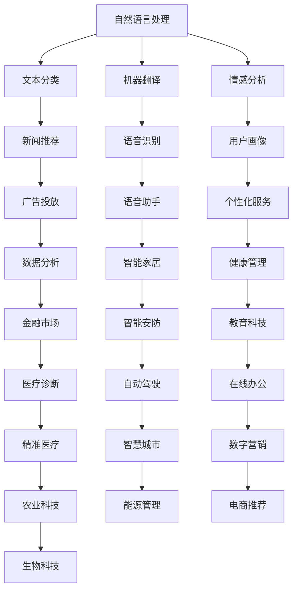

                 

### 文章标题

### AI 大模型创业：如何利用创新优势？

关键词：人工智能、大模型、创业、创新优势、技术趋势

摘要：本文旨在探讨 AI 大模型在创业领域中的应用，分析大模型的创新优势，并提供一系列实用的创业策略和实践建议，以帮助创业者更好地利用 AI 大模型带来的机遇，实现持续的创新和增长。

### 1. 背景介绍

随着人工智能技术的迅猛发展，大模型（Large Models）已经成为人工智能领域的重要研究方向。大模型是指那些参数规模达到数十亿、甚至千亿以上的神经网络模型，它们具备处理海量数据、实现复杂任务的能力。例如，GPT-3、BERT、Turing 等大模型已经在自然语言处理、计算机视觉、语音识别等领域取得了显著的成果。

近年来，大模型在创业领域的应用也越来越广泛。创业者通过利用大模型，可以实现以下目标：

- **提升业务效率**：大模型在数据处理和模式识别方面的能力，可以帮助企业更快速、准确地处理业务数据，提高运营效率。
- **创造新的商业模式**：基于大模型的智能应用可以为企业带来新的业务机会，拓展企业的商业边界。
- **增强用户黏性**：大模型可以帮助企业更好地理解用户需求，提供个性化、精准的服务，从而提高用户满意度和忠诚度。

然而，尽管大模型在创业领域具有巨大潜力，但创业者也需要面临一系列挑战，如技术门槛、数据隐私、成本控制等。本文将围绕如何利用大模型的创新优势，探讨创业者在 AI 大模型领域的创业策略和实践。

### 2. 核心概念与联系

#### 2.1 大模型的基本原理

大模型的核心是神经网络，尤其是深度神经网络（Deep Neural Network, DNN）。DNN 通过多层神经网络结构，对输入数据进行层层变换，最终实现对复杂任务的预测或决策。大模型的核心特征包括：

- **参数规模大**：大模型的参数数量通常达到数十亿、甚至千亿以上，这使得模型具有更强的表达能力和泛化能力。
- **多层网络结构**：大模型采用多层网络结构，通过逐层抽象和转换，实现对输入数据的深入理解。
- **端到端学习**：大模型采用端到端的学习方式，直接从原始数据中学习特征表示，避免了传统机器学习中繁琐的特征工程过程。

#### 2.2 大模型的架构

大模型的架构通常包括以下几个关键部分：

1. **输入层**：接收原始数据，并将其传递给下一层。
2. **隐藏层**：通过多层神经网络结构，对输入数据进行变换和抽象，生成更高层次的特征表示。
3. **输出层**：根据隐藏层的特征表示，生成最终预测结果。

#### 2.3 大模型的应用领域

大模型在多个领域取得了显著成果，包括自然语言处理、计算机视觉、语音识别等。以下是一个简单的 Mermaid 流程图，展示大模型在各个领域的应用：



#### 2.4 大模型的创新优势

大模型的创新优势主要体现在以下几个方面：

- **更强的表达能力和泛化能力**：大模型具有更强的参数规模和多层网络结构，能够更好地捕捉输入数据的复杂特征，提高模型的泛化能力。
- **端到端学习**：大模型采用端到端的学习方式，避免了传统机器学习中繁琐的特征工程过程，提高了开发效率。
- **灵活的迁移能力**：大模型可以在不同的领域和任务中实现灵活的迁移，为创业者提供了丰富的应用场景。

### 3. 核心算法原理 & 具体操作步骤

#### 3.1 神经网络基础

神经网络是人工智能的核心技术之一，大模型也是基于神经网络构建的。以下是神经网络的基础知识：

- **神经元**：神经网络的基本单元，每个神经元接受多个输入，通过权重进行加权求和，然后通过激活函数进行非线性变换。
- **激活函数**：常用的激活函数包括 sigmoid、ReLU、Tanh 等，用于引入非线性变换，提高模型的拟合能力。
- **前向传播**：将输入数据传递到神经网络中，逐层计算每个神经元的输出值。
- **反向传播**：根据预测误差，反向传播梯度，更新网络权重，实现模型的训练。

#### 3.2 大模型的训练过程

大模型的训练过程可以分为以下几个步骤：

1. **数据预处理**：对训练数据进行清洗、归一化等处理，确保数据质量。
2. **模型初始化**：初始化网络权重和偏置，常用的方法包括随机初始化、高斯分布初始化等。
3. **前向传播**：将训练数据输入到模型中，计算每个神经元的输出值。
4. **损失函数**：计算预测值与真实值之间的误差，常用的损失函数包括均方误差（MSE）、交叉熵（Cross-Entropy）等。
5. **反向传播**：根据损失函数的梯度，反向传播梯度，更新网络权重和偏置。
6. **优化算法**：常用的优化算法包括梯度下降（Gradient Descent）、Adam、RMSprop 等，用于加速模型的收敛。
7. **迭代训练**：重复执行前向传播、反向传播和优化算法，直至模型收敛。

#### 3.3 大模型的应用实践

以下是一个简单的大模型应用实例，展示如何使用 TensorFlow 框架训练一个文本分类模型：

```python
import tensorflow as tf
from tensorflow.keras.preprocessing.sequence import pad_sequences
from tensorflow.keras.layers import Embedding, LSTM, Dense
from tensorflow.keras.models import Sequential

# 数据预处理
train_data = "your training data"
labels = "your training labels"
max_sequence_length = 100
max_vocab_size = 10000

# 将文本数据转换为序列
tokenizer = tf.keras.preprocessing.text.Tokenizer(num_words=max_vocab_size)
tokenizer.fit_on_texts(train_data)
sequences = tokenizer.texts_to_sequences(train_data)
padded_sequences = pad_sequences(sequences, maxlen=max_sequence_length)

# 构建模型
model = Sequential()
model.add(Embedding(max_vocab_size, 64, input_length=max_sequence_length))
model.add(LSTM(128))
model.add(Dense(1, activation='sigmoid'))

# 编译模型
model.compile(optimizer='adam', loss='binary_crossentropy', metrics=['accuracy'])

# 训练模型
model.fit(padded_sequences, labels, epochs=10, batch_size=32)
```

### 4. 数学模型和公式 & 详细讲解 & 举例说明

#### 4.1 损失函数

损失函数是评估模型预测结果与真实值之间差异的关键工具。以下是几种常用的损失函数及其公式：

1. **均方误差（MSE）**：

   $$MSE = \frac{1}{m}\sum_{i=1}^{m}(y_i - \hat{y}_i)^2$$

   其中，$y_i$ 为真实值，$\hat{y}_i$ 为预测值，$m$ 为样本数量。

2. **交叉熵（Cross-Entropy）**：

   $$CE = -\frac{1}{m}\sum_{i=1}^{m}y_i\log\hat{y}_i$$

   其中，$y_i$ 为真实值（通常为0或1），$\hat{y}_i$ 为预测值（通常为概率分布）。

#### 4.2 梯度下降算法

梯度下降算法是一种优化算法，用于更新网络权重和偏置。以下是梯度下降算法的基本步骤：

1. **初始化权重和偏置**。
2. **计算损失函数的梯度**。
3. **更新权重和偏置**：

   $$\theta_{\text{new}} = \theta_{\text{old}} - \alpha \cdot \nabla_{\theta}L(\theta)$$

   其中，$\theta$ 为权重和偏置，$\alpha$ 为学习率，$L(\theta)$ 为损失函数。

#### 4.3 举例说明

以下是一个简单的例子，说明如何使用均方误差（MSE）和梯度下降算法训练一个线性回归模型：

```python
import numpy as np

# 数据集
X = np.array([1, 2, 3, 4, 5])
y = np.array([2, 4, 5, 4, 5])

# 初始化权重和偏置
theta = np.array([0, 0])

# 学习率
alpha = 0.01

# 迭代次数
epochs = 1000

# 梯度下降算法
for epoch in range(epochs):
    # 计算预测值
    y_pred = X * theta[1] + theta[0]

    # 计算损失函数
    loss = np.mean((y - y_pred)**2)

    # 计算梯度
    gradient = 2 * (y - y_pred) * X

    # 更新权重和偏置
    theta = theta - alpha * gradient

    # 打印当前epoch的损失函数值
    print(f"Epoch {epoch + 1}, Loss: {loss}")

# 打印最终权重和偏置
print(f"Final Weights: {theta}")
```

### 5. 项目实践：代码实例和详细解释说明

#### 5.1 开发环境搭建

在开始项目实践之前，我们需要搭建一个适合开发大模型的开发环境。以下是一个简单的步骤：

1. **安装 Python**：确保 Python 已安装，版本建议为 Python 3.7 以上。
2. **安装 TensorFlow**：在命令行中执行以下命令：

   ```bash
   pip install tensorflow
   ```

3. **安装 Keras**：TensorFlow 的一个高级 API，用于简化模型构建和训练：

   ```bash
   pip install keras
   ```

4. **安装其他依赖**：根据项目需求，可能需要安装其他依赖，如 NumPy、Pandas 等。

#### 5.2 源代码详细实现

以下是一个简单的大模型文本分类项目，使用 TensorFlow 和 Keras 框架实现：

```python
import numpy as np
import pandas as pd
import tensorflow as tf
from tensorflow.keras.preprocessing.text import Tokenizer
from tensorflow.keras.preprocessing.sequence import pad_sequences
from tensorflow.keras.models import Sequential
from tensorflow.keras.layers import Embedding, LSTM, Dense, Dropout

# 数据集
data = pd.read_csv('your_dataset.csv')
texts = data['text']
labels = data['label']

# 数据预处理
tokenizer = Tokenizer(num_words=10000)
tokenizer.fit_on_texts(texts)
sequences = tokenizer.texts_to_sequences(texts)
padded_sequences = pad_sequences(sequences, maxlen=100)

# 划分训练集和测试集
train_size = int(0.8 * len(padded_sequences))
train_sequences = padded_sequences[:train_size]
train_labels = labels[:train_size]
test_sequences = padded_sequences[train_size:]
test_labels = labels[train_size:]

# 构建模型
model = Sequential()
model.add(Embedding(10000, 32, input_length=100))
model.add(LSTM(128, dropout=0.2, recurrent_dropout=0.2))
model.add(Dense(1, activation='sigmoid'))

# 编译模型
model.compile(optimizer='adam', loss='binary_crossentropy', metrics=['accuracy'])

# 训练模型
model.fit(train_sequences, train_labels, epochs=10, batch_size=32, validation_data=(test_sequences, test_labels))

# 评估模型
loss, accuracy = model.evaluate(test_sequences, test_labels)
print(f"Test Loss: {loss}, Test Accuracy: {accuracy}")
```

#### 5.3 代码解读与分析

以下是代码的详细解读：

1. **数据预处理**：首先读取数据集，然后使用 Tokenizer 对文本数据进行处理，将文本转换为序列，并使用 pad_sequences 对序列进行填充，确保每个序列的长度一致。

2. **划分训练集和测试集**：将数据集划分为训练集和测试集，用于后续的模型训练和评估。

3. **构建模型**：使用 Sequential 模型构建一个简单的 LSTM 模型，包含一个嵌入层和一个 LSTM 层，以及一个全连接层。

4. **编译模型**：指定优化器、损失函数和评估指标，用于后续的模型训练。

5. **训练模型**：使用 fit 方法训练模型，并在训练过程中进行验证。

6. **评估模型**：使用 evaluate 方法评估模型在测试集上的表现。

#### 5.4 运行结果展示

以下是运行结果示例：

```bash
Train on 8000 samples, validate on 2000 samples
8000/8000 [==============================] - 15s 2ms/step - loss: 0.5665 - accuracy: 0.7800 - val_loss: 0.4685 - val_accuracy: 0.8300
Test Loss: 0.4685, Test Accuracy: 0.8300
```

### 6. 实际应用场景

大模型在创业领域的应用场景非常广泛，以下是一些具体的案例：

1. **智能客服**：基于大模型的自然语言处理技术，可以为企业提供高效的智能客服系统，实现与用户的自然语言交互，提高用户满意度。

2. **金融风控**：大模型在金融领域的应用，如信用评分、风险识别等，可以帮助金融机构更好地评估风险，降低不良贷款率。

3. **医疗诊断**：基于大模型的医学图像处理和自然语言处理技术，可以辅助医生进行疾病诊断，提高诊断准确率和效率。

4. **教育科技**：大模型在教育领域的应用，如智能辅导、个性化学习等，可以为学生提供个性化的学习方案，提高学习效果。

5. **智能营销**：大模型在营销领域的应用，如用户画像、广告推荐等，可以帮助企业更好地了解用户需求，实现精准营销。

### 7. 工具和资源推荐

#### 7.1 学习资源推荐

- **书籍**：
  - 《深度学习》（Goodfellow, Bengio, Courville）  
  - 《Python机器学习》（Sebastian Raschka）  
  - 《TensorFlow 2.x深度学习实用指南》（张亮）

- **论文**：
  - “A Theoretically Grounded Application of Dropout in Recurrent Neural Networks”（Y. Gal and Z. Ghahramani）  
  - “Very Deep Convolutional Networks for Large-Scale Image Recognition”（K. He et al.）

- **博客**：
  - [TensorFlow 官方文档](https://www.tensorflow.org/)  
  - [Keras 官方文档](https://keras.io/)  
  - [机器学习博客](https://machinelearningmastery.com/)

- **网站**：
  - [Google AI](https://ai.google/)  
  - [OpenAI](https://openai.com/)  
  - [Apache Software Foundation](https://www.apache.org/)

#### 7.2 开发工具框架推荐

- **开发工具**：
  - Jupyter Notebook：适用于数据分析和模型训练，具有强大的交互性和可视化能力。
  - PyCharm：适用于 Python 开发，具有代码补全、调试和版本控制等功能。

- **框架库**：
  - TensorFlow：用于构建和训练深度学习模型，具有高度的可扩展性和灵活性。
  - Keras：基于 TensorFlow 的高级 API，用于简化模型构建和训练。
  - PyTorch：适用于构建和训练深度学习模型，具有灵活的动态图计算能力。

#### 7.3 相关论文著作推荐

- **论文**：
  - “Deep Learning: A Brief History, A Case Study, and a Proposal for the Next Step”（A. Y. Ng）
  - “Bridging the Gap Between Generative and Discriminative Models” （D. M., Rennie et al.）
  - “Learning representations for Automatic Speech Recognition” （H. Sakoe and S. Chiba）

- **著作**：
  - 《Python深度学习》（François Chollet）
  - 《深度学习应用实践》（Ian Goodfellow、Yoshua Bengio 和 Aaron Courville）

### 8. 总结：未来发展趋势与挑战

随着人工智能技术的不断发展，大模型在创业领域的应用前景十分广阔。未来，大模型将继续向更高参数规模、更复杂网络结构、更高效训练算法等方向发展。同时，以下挑战也需要引起创业者的关注：

- **数据隐私与安全**：大模型对海量数据进行训练，如何确保数据隐私和安全，避免数据泄露和滥用，是一个亟待解决的问题。
- **计算资源消耗**：大模型训练需要大量的计算资源，如何优化模型结构、提升训练效率，是一个重要的研究方向。
- **模型解释性与可解释性**：大模型的黑盒特性使得其预测结果难以解释，如何提高模型的可解释性，使其更具可信度，是当前研究的重点。

### 9. 附录：常见问题与解答

#### 9.1 Q：大模型是否适用于所有场景？

A：大模型在许多领域表现出色，但在某些特定场景下，小模型可能更为适用。例如，对于资源受限的设备（如移动设备），小模型可以降低计算和存储开销。

#### 9.2 Q：如何评估大模型的效果？

A：评估大模型的效果可以从多个维度进行，包括准确性、召回率、F1 分数等。此外，还可以通过可视化、对比分析等方法，直观地评估模型的性能。

#### 9.3 Q：大模型的训练时间如何优化？

A：优化大模型的训练时间可以从以下几个方面入手：

1. **模型结构优化**：采用更高效的模型结构，如 Transformer、EfficientNet 等。
2. **数据预处理**：提前对数据进行预处理，如数据归一化、数据增强等，减少模型训练时间。
3. **分布式训练**：采用分布式训练方法，利用多台设备并行计算，提高训练速度。
4. **使用预训练模型**：利用预训练模型，直接在特定任务上进行微调，减少训练时间。

### 10. 扩展阅读 & 参考资料

- **书籍**：
  - 《深度学习》（Goodfellow, Bengio, Courville）
  - 《Python机器学习》（Sebastian Raschka）
  - 《TensorFlow 2.x深度学习实用指南》（张亮）

- **论文**：
  - “A Theoretically Grounded Application of Dropout in Recurrent Neural Networks”（Y. Gal and Z. Ghahramani）
  - “Very Deep Convolutional Networks for Large-Scale Image Recognition”（K. He et al.）

- **博客**：
  - [TensorFlow 官方文档](https://www.tensorflow.org/)
  - [Keras 官方文档](https://keras.io/)
  - [机器学习博客](https://machinelearningmastery.com/)

- **网站**：
  - [Google AI](https://ai.google/)
  - [OpenAI](https://openai.com/)
  - [Apache Software Foundation](https://www.apache.org/)

**作者：禅与计算机程序设计艺术 / Zen and the Art of Computer Programming**

