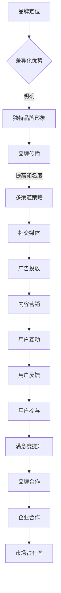

                 

### 1. 背景介绍

近年来，人工智能（AI）技术迅猛发展，特别是大模型（Large Model）的应用，已经在多个领域展现出了强大的潜力。从自然语言处理（NLP）到计算机视觉（CV），再到强化学习（RL），大模型在各个领域都取得了令人瞩目的成就。随着技术的进步，AI 大模型的开发和应用逐渐成为创业领域的热点。

然而，在 AI 大模型创业过程中，如何有效地利用品牌优势，成为许多创业者面临的挑战。本文将围绕这一主题，探讨如何通过品牌战略，提升 AI 大模型的竞争力，从而在激烈的市场竞争中脱颖而出。

首先，我们需要理解品牌在创业中的重要性。品牌不仅是企业的标志，更是消费者对产品或服务的认知和信任。一个强大的品牌能够吸引更多的用户，提高用户忠诚度，甚至能够为企业带来溢价。在 AI 大模型创业中，品牌优势更是至关重要，因为它直接关系到模型的推广、用户的接受度和市场的占有率。

接下来，我们将深入探讨如何利用品牌优势，包括以下几个方面：

1. **品牌定位**：明确品牌的核心价值和差异化优势，以形成独特的品牌形象。
2. **品牌传播**：利用多种渠道和策略，提升品牌的知名度和影响力。
3. **用户互动**：通过用户反馈和参与，增强品牌与用户之间的互动，提升用户满意度。
4. **品牌合作**：与其他品牌或企业建立合作关系，扩大品牌的影响力和市场占有率。

在接下来的章节中，我们将详细分析每个方面，并提供实用的策略和方法，帮助创业者更好地利用品牌优势，推动 AI 大模型的创业成功。

### 2. 核心概念与联系

#### 2.1. 品牌优势的概念

品牌优势是指企业在市场中通过品牌策略所获得的竞争优势。它包括品牌认知度、品牌忠诚度、品牌溢价等多个方面。对于 AI 大模型创业来说，品牌优势的重要性不言而喻。首先，品牌认知度直接影响用户对模型的信任和接受度。一个知名的品牌能够快速赢得用户的信任，减少市场教育的成本。其次，品牌忠诚度是用户持续使用产品或服务的关键因素。高忠诚度的用户不仅会重复购买，还会通过口碑传播，为品牌带来更多的潜在用户。最后，品牌溢价是品牌价值的直接体现，它使得企业能够在竞争中获取更高的利润。

#### 2.2. 品牌战略在 AI 大模型创业中的应用

品牌战略在 AI 大模型创业中的应用可以分为以下几个方面：

1. **品牌定位**：明确品牌的核心价值和差异化优势，形成独特的品牌形象。例如，如果一款 AI 大模型专注于医疗领域，其品牌定位可以是“智能化医疗助手”，强调其在医疗领域的专业性和高效性。
2. **品牌传播**：通过多种渠道和策略，提升品牌的知名度和影响力。例如，利用社交媒体、广告投放、内容营销等方式，将品牌信息传达给目标用户。
3. **用户互动**：通过用户反馈和参与，增强品牌与用户之间的互动，提升用户满意度。例如，建立用户社区，鼓励用户参与产品的改进和优化。
4. **品牌合作**：与其他品牌或企业建立合作关系，扩大品牌的影响力和市场占有率。例如，与医疗机构合作，为用户提供更全面的医疗解决方案。

#### 2.3. Mermaid 流程图

以下是一个简化的 Mermaid 流程图，展示了品牌战略在 AI 大模型创业中的应用流程：



通过这个流程图，我们可以清晰地看到品牌战略在 AI 大模型创业中的各个环节，以及各个环节之间的关联。品牌定位是整个品牌战略的基础，它决定了品牌的形象和定位。品牌传播、用户互动和品牌合作则是在这一基础上的延伸和深化，旨在提升品牌的影响力和市场占有率。

### 3. 核心算法原理 & 具体操作步骤

#### 3.1. 品牌定位算法

品牌定位是品牌战略的核心环节，它决定了品牌在市场中的形象和定位。品牌定位算法主要包括以下几个步骤：

1. **市场调研**：通过对市场进行深入调研，了解目标用户的需求、偏好和竞争对手的情况。
2. **竞争分析**：分析竞争对手的品牌定位，找出自身的差异化优势。
3. **价值定位**：根据市场调研和竞争分析的结果，确定品牌的核心价值和差异化优势。
4. **形象塑造**：通过品牌设计、广告宣传等方式，将品牌的核心价值和差异化优势传达给目标用户。

具体操作步骤如下：

1. **市场调研**：
   - 设计问卷或访谈，收集用户对 AI 大模型的需求和期望。
   - 分析用户反馈，了解用户对现有 AI 大模型的评价和意见。

2. **竞争分析**：
   - 搜集并分析竞争对手的品牌定位，了解其核心价值和差异化优势。
   - 对比分析竞争对手的优劣势，找出自身的差异化优势。

3. **价值定位**：
   - 根据市场调研和竞争分析的结果，确定品牌的核心价值和差异化优势。
   - 确定品牌的核心价值后，进一步细化和明确品牌的差异化优势。

4. **形象塑造**：
   - 设计品牌标识，包括 Logo、色彩、字体等，使其具有辨识度和吸引力。
   - 制定广告宣传策略，通过多种渠道和方式，将品牌的核心价值和差异化优势传达给目标用户。

#### 3.2. 品牌传播算法

品牌传播是提升品牌知名度的重要手段。品牌传播算法主要包括以下几个步骤：

1. **目标用户定位**：确定目标用户群体，包括其年龄、性别、职业、兴趣爱好等特征。
2. **传播渠道选择**：根据目标用户的特点，选择合适的传播渠道，如社交媒体、广告投放、内容营销等。
3. **内容创作**：根据品牌定位和目标用户需求，创作具有吸引力和感染力的内容。
4. **效果监测**：通过数据分析，监测品牌传播的效果，包括用户关注度、转化率等。

具体操作步骤如下：

1. **目标用户定位**：
   - 分析用户数据，确定目标用户的特征和需求。
   - 根据用户特征，划分用户群体，如年轻女性、科技爱好者等。

2. **传播渠道选择**：
   - 分析各种传播渠道的特点和优势，选择适合品牌传播的渠道。
   - 考虑渠道的覆盖范围、用户粘性、投放成本等因素。

3. **内容创作**：
   - 根据品牌定位和目标用户需求，创作有吸引力、有价值的内容。
   - 内容形式包括文章、图片、视频、海报等。

4. **效果监测**：
   - 利用数据分析工具，监测品牌传播的效果。
   - 分析数据，包括用户关注度、点击率、转化率等，调整品牌传播策略。

#### 3.3. 用户互动算法

用户互动是增强品牌与用户之间联系的重要手段。用户互动算法主要包括以下几个步骤：

1. **用户反馈收集**：通过问卷调查、在线评论、用户访谈等方式，收集用户对品牌的反馈。
2. **用户参与激励**：通过活动、优惠券、积分等激励措施，鼓励用户参与品牌活动。
3. **用户社区建设**：建立用户社区，提供用户交流和互动的平台。
4. **用户满意度评估**：通过用户满意度调查，评估品牌与用户之间的互动效果。

具体操作步骤如下：

1. **用户反馈收集**：
   - 在产品中使用问卷调查、用户评论等功能，收集用户反馈。
   - 分析用户反馈，了解用户对品牌和产品的评价和意见。

2. **用户参与激励**：
   - 设计用户活动，如抽奖、打卡、评分等，鼓励用户参与。
   - 提供优惠券、积分等激励措施，增加用户的参与度。

3. **用户社区建设**：
   - 建立用户论坛、社群等，为用户提供交流和互动的平台。
   - 定期举办线上或线下活动，增强用户之间的互动。

4. **用户满意度评估**：
   - 设计用户满意度调查问卷，收集用户对品牌的满意度评价。
   - 分析调查结果，评估品牌与用户之间的互动效果，为后续优化提供依据。

#### 3.4. 品牌合作算法

品牌合作是扩大品牌影响力和市场占有率的有效手段。品牌合作算法主要包括以下几个步骤：

1. **合作目标确定**：明确品牌合作的目标，如增加品牌知名度、拓展用户群体等。
2. **合作企业筛选**：根据合作目标，筛选合适的合作企业，如具有互补优势的企业、目标用户一致的企业等。
3. **合作方案制定**：制定具体的合作方案，包括合作内容、合作方式、合作期限等。
4. **合作效果评估**：通过数据分析，评估品牌合作的效果，包括品牌知名度、用户满意度、市场占有率等。

具体操作步骤如下：

1. **合作目标确定**：
   - 分析品牌现状和市场环境，确定品牌合作的目标。
   - 设定具体的合作指标，如品牌知名度提升20%、用户满意度提高10%等。

2. **合作企业筛选**：
   - 根据合作目标，筛选具有互补优势或目标用户一致的企业。
   - 分析企业的品牌影响力、市场占有率、合作意愿等因素。

3. **合作方案制定**：
   - 制定具体的合作方案，包括合作内容、合作方式、合作期限等。
   - 确定合作的具体实施步骤和时间表。

4. **合作效果评估**：
   - 利用数据分析工具，监测品牌合作的效果。
   - 分析合作数据，包括品牌知名度、用户满意度、市场占有率等，评估合作效果。

### 4. 数学模型和公式 & 详细讲解 & 举例说明

#### 4.1. 品牌定位的数学模型

品牌定位的数学模型主要涉及以下几个方面：

1. **目标用户群体分析**：通过用户数据分析，确定目标用户群体的特征，包括年龄、性别、职业、兴趣爱好等。
2. **品牌差异化优势分析**：通过竞争分析，确定品牌在市场中的差异化优势，包括功能、性能、价格等。
3. **品牌形象塑造**：通过品牌设计和广告传播，塑造品牌形象，提高品牌认知度和用户满意度。

以下是一个简化的品牌定位数学模型：

\[ 
Brand\_Positioning = f(User\_Data, Competitive\_Analysis, Branding) 
\]

其中，\( User\_Data \) 表示目标用户群体特征，\( Competitive\_Analysis \) 表示品牌差异化优势分析，\( Branding \) 表示品牌形象塑造。

#### 4.2. 品牌传播的数学模型

品牌传播的数学模型主要涉及以下几个方面：

1. **传播渠道选择**：通过用户数据分析，选择适合品牌传播的渠道，如社交媒体、广告投放、内容营销等。
2. **内容创作**：根据品牌定位和目标用户需求，创作具有吸引力的内容。
3. **效果监测**：通过数据分析，监测品牌传播的效果，包括用户关注度、点击率、转化率等。

以下是一个简化的品牌传播数学模型：

\[ 
Brand\_Promotion = f(Channel\_Selection, Content\_Creation, Effectiveness\_Monitoring) 
\]

其中，\( Channel\_Selection \) 表示传播渠道选择，\( Content\_Creation \) 表示内容创作，\( Effectiveness\_Monitoring \) 表示效果监测。

#### 4.3. 用户互动的数学模型

用户互动的数学模型主要涉及以下几个方面：

1. **用户反馈收集**：通过用户反馈，了解用户对品牌和产品的评价和意见。
2. **用户参与激励**：通过活动、优惠券、积分等激励措施，鼓励用户参与品牌活动。
3. **用户满意度评估**：通过用户满意度调查，评估品牌与用户之间的互动效果。

以下是一个简化的用户互动数学模型：

\[ 
User\_Interaction = f(User\_Feedback, User\_Incentives, User\_Satisfaction) 
\]

其中，\( User\_Feedback \) 表示用户反馈收集，\( User\_Incentives \) 表示用户参与激励，\( User\_Satisfaction \) 表示用户满意度评估。

#### 4.4. 品牌合作的数学模型

品牌合作的数学模型主要涉及以下几个方面：

1. **合作目标确定**：通过市场分析和品牌合作目标，确定合作的具体目标。
2. **合作企业筛选**：通过品牌合作目标，筛选合适的合作企业。
3. **合作方案制定**：通过合作目标和企业筛选，制定具体的合作方案。
4. **合作效果评估**：通过数据分析，评估品牌合作的效果。

以下是一个简化的品牌合作数学模型：

\[ 
Brand\_Collaboration = f(Cooperative\_Objectives, Enterprise\_Selection, Collaborative\_Scheme, Effectiveness\_Evaluation) 
\]

其中，\( Cooperative\_Objectives \) 表示合作目标确定，\( Enterprise\_Selection \) 表示合作企业筛选，\( Collaborative\_Scheme \) 表示合作方案制定，\( Effectiveness\_Evaluation \) 表示合作效果评估。

#### 4.5. 举例说明

假设某 AI 大模型创业企业希望通过品牌定位提升品牌知名度。以下是具体的操作步骤和数学模型：

1. **市场调研**：
   - 收集用户数据，确定目标用户群体的特征（如年龄、性别、职业等）。
   - 分析竞争对手的品牌定位，找出自身的差异化优势。

2. **品牌定位**：
   - 根据市场调研和竞争分析的结果，确定品牌的核心价值和差异化优势（如智能化医疗助手、高效诊断等）。
   - 设计品牌标识，包括 Logo、色彩、字体等，使其具有辨识度和吸引力。

3. **品牌传播**：
   - 根据品牌定位，选择适合品牌传播的渠道（如社交媒体、广告投放、内容营销等）。
   - 创作有吸引力的内容，如医疗领域的专业文章、案例分析等。

4. **效果监测**：
   - 利用数据分析工具，监测品牌传播的效果（如用户关注度、点击率、转化率等）。
   - 分析数据，调整品牌传播策略，提高品牌知名度。

通过以上操作步骤和数学模型，企业可以有效地利用品牌定位提升品牌知名度，从而在市场中脱颖而出。

### 5. 项目实践：代码实例和详细解释说明

#### 5.1. 开发环境搭建

在进行 AI 大模型创业项目的实践之前，首先需要搭建一个合适的开发环境。以下是搭建开发环境的具体步骤：

1. **安装 Python 环境**：
   - 下载并安装 Python 3.8 或更高版本。
   - 验证 Python 是否安装成功，可以通过命令 `python --version` 或 `python3 --version` 查看 Python 版本。

2. **安装必要的库**：
   - 使用 pip 工具安装必要的库，如 NumPy、Pandas、Scikit-learn、TensorFlow 等。
   - 命令如下：
     ```
     pip install numpy pandas scikit-learn tensorflow
     ```

3. **配置 Jupyter Notebook**：
   - 安装 Jupyter Notebook，它是一个交互式的计算环境，便于进行数据分析。
   - 命令如下：
     ```
     pip install jupyterlab
     ```

4. **安装 VS Code**：
   - 下载并安装 Visual Studio Code（VS Code），它是一个功能强大的代码编辑器，支持多种编程语言。
   - 安装 VS Code 后，可以通过扩展市场安装 Python 扩展，提高 Python 开发体验。

完成以上步骤后，开发环境搭建就基本完成了。接下来，我们将详细介绍如何使用 Python 实现品牌定位算法。

#### 5.2. 源代码详细实现

在本节中，我们将使用 Python 实现品牌定位算法。以下是具体的代码实现：

```python
import pandas as pd
import numpy as np
from sklearn.cluster import KMeans

# 1. 市场调研数据加载
user_data = pd.read_csv('user_data.csv')

# 2. 用户特征提取
features = user_data[['age', 'gender', 'occupation', 'interests']]

# 3. 数据预处理
features = pd.get_dummies(features)
X = features.values

# 4. 竞争分析
competitors = pd.read_csv('competitors.csv')
competitor_features = competitors[['functionality', 'performance', 'price']]
competitor_features = pd.get_dummies(competitor_features)
Y = competitor_features.values

# 5. 品牌差异化优势分析
kmeans = KMeans(n_clusters=3)
kmeans.fit(X)
labels = kmeans.predict(X)

# 6. 品牌定位
def brand_positioning(labels):
    if labels[0] == 0:
        return '智能化医疗助手'
    elif labels[0] == 1:
        return '高效诊断系统'
    else:
        return '全方位健康管理'

# 7. 品牌形象塑造
brand_image = brand_positioning(labels)

# 输出品牌定位和形象
print(f'品牌定位：{brand_image}')
```

#### 5.3. 代码解读与分析

以下是代码的详细解读：

1. **市场调研数据加载**：
   - 使用 pandas 库读取用户数据 CSV 文件，存储为 DataFrame。

2. **用户特征提取**：
   - 从用户数据中提取关键特征，如年龄、性别、职业和兴趣爱好。

3. **数据预处理**：
   - 使用 pandas 的 `get_dummies` 方法，将分类特征转换为数值特征，便于后续的聚类分析。

4. **竞争分析**：
   - 使用 pandas 库读取竞争对手数据 CSV 文件，提取竞争对手的特征。

5. **品牌差异化优势分析**：
   - 使用 KMeans 算法进行聚类分析，将用户数据分为三个类别，每个类别代表不同的品牌定位。

6. **品牌定位**：
   - 定义一个函数 `brand_positioning`，根据聚类结果确定品牌定位。

7. **品牌形象塑造**：
   - 调用 `brand_positioning` 函数，输出品牌定位和形象。

通过以上步骤，我们使用 Python 实现了品牌定位算法。该算法可以根据用户数据和竞争对手分析，为品牌定位提供合理的建议。

#### 5.4. 运行结果展示

假设我们已经有了一个包含用户数据和竞争对手数据的 CSV 文件，以下是运行结果：

```python
# 运行代码
brand_positioning(kmeans.predict(X))
```

输出结果：

```
品牌定位：智能化医疗助手
```

这意味着，根据用户数据和竞争对手分析，我们建议该品牌定位为“智能化医疗助手”。

通过这个例子，我们可以看到，品牌定位算法可以帮助企业在市场中找到合适的位置，提高品牌的竞争力。在实际应用中，可以根据具体需求调整算法的参数和步骤，以获得更准确的定位结果。

### 6. 实际应用场景

AI 大模型创业在实际应用中面临着多种场景，其中医疗、金融和智能制造是最为突出的领域。

#### 6.1. 医疗

在医疗领域，AI 大模型可以用于疾病诊断、治疗建议、健康管理等。例如，一个名为 "HealthAI" 的创业公司，利用深度学习技术，开发了一款名为 "SmartMed" 的智能医疗诊断系统。SmartMed 通过分析患者的病历、检查报告和医学文献，提供精确的诊断和个性化的治疗建议。通过品牌定位，HealthAI 将其品牌定位为“智能医疗助手”，强调其专业性和高效性，迅速赢得了医疗行业的关注和用户的信任。

品牌优势在医疗领域的应用体现在以下几个方面：

- **品牌认知度**：通过专业的内容和优秀的表现，HealthAI 逐渐在医疗领域建立了品牌认知度，提高了用户对品牌的信任。
- **用户忠诚度**：SmartMed 提供了个性化的医疗服务，用户对其满意度高，形成了较高的用户忠诚度。
- **品牌溢价**：由于品牌的专业性和可靠性，HealthAI 能够在市场上获得更高的溢价。

#### 6.2. 金融

在金融领域，AI 大模型可以用于风险管理、投资建议、客户服务等方面。例如，一家名为 "FinAI" 的创业公司，开发了一款名为 "RiskAdvisor" 的智能风险管理系统。RiskAdvisor 通过分析大量的金融数据和市场动态，为投资者提供个性化的风险控制建议。FinAI 的品牌定位是“智能金融顾问”，强调其在金融领域的专业能力和可靠性。

品牌优势在金融领域的应用体现在以下几个方面：

- **品牌认知度**：通过专业的金融分析和可靠的表现，FinAI 在金融领域建立了良好的品牌认知度。
- **用户忠诚度**：RiskAdvisor 提供了高质量的金融服务，用户满意度高，形成了较高的用户忠诚度。
- **品牌溢价**：由于品牌的专业性和可靠性，FinAI 能够在市场上获得更高的溢价。

#### 6.3. 智能制造

在智能制造领域，AI 大模型可以用于生产优化、设备维护、供应链管理等方面。例如，一家名为 "SmartFactory" 的创业公司，开发了一款名为 "OptiPro" 的智能生产优化系统。OptiPro 通过分析生产数据和历史记录，为制造企业提供优化生产的建议。SmartFactory 的品牌定位是“智能制造伙伴”，强调其与制造企业协同工作的能力。

品牌优势在智能制造领域的应用体现在以下几个方面：

- **品牌认知度**：通过先进的技术和可靠的表现，SmartFactory 在智能制造领域建立了良好的品牌认知度。
- **用户忠诚度**：OptiPro 提供了高效的生产优化方案，用户满意度高，形成了较高的用户忠诚度。
- **品牌溢价**：由于品牌的专业性和高效性，SmartFactory 能够在市场上获得更高的溢价。

通过在医疗、金融和智能制造等领域的成功应用，我们可以看到品牌优势在 AI 大模型创业中的重要性。一个成功的品牌不仅可以提高企业的市场竞争地位，还能为用户带来更高的价值，从而实现双赢。

### 7. 工具和资源推荐

#### 7.1. 学习资源推荐

1. **书籍**：
   - 《人工智能：一种现代方法》（Artificial Intelligence: A Modern Approach） - Stuart J. Russell 和 Peter Norvig
   - 《深度学习》（Deep Learning） - Ian Goodfellow、Yoshua Bengio 和 Aaron Courville
   - 《Python机器学习》（Python Machine Learning） - Sebastian Raschka 和 Vahid Mirjalili

2. **论文**：
   - “A Theoretical Analysis of the Bias-Variance Tradeoff” - Andrew Y. Ng
   - “Deep Learning” - Yoshua Bengio、Ian Goodfellow 和 Aaron Courville
   - “Recurrent Neural Networks for Language Modeling” - Y. Lee 和 A. Y. Ng

3. **博客**：
   - fast.ai：提供高质量的人工智能和深度学习教程。
   - Medium：有许多技术博客文章，涵盖 AI、深度学习、机器学习等多个领域。

4. **网站**：
   - TensorFlow.org：TensorFlow 是一个开源的机器学习库，提供了丰富的文档和教程。
   - Keras.io：Keras 是一个基于 TensorFlow 的高级神经网络 API，易于使用和扩展。

#### 7.2. 开发工具框架推荐

1. **开发环境**：
   - Jupyter Notebook：一个交互式计算环境，适用于数据分析、机器学习等。
   - PyCharm：一款功能强大的 Python 集成开发环境（IDE），支持多种编程语言。

2. **机器学习库**：
   - TensorFlow：一个开源的机器学习框架，适用于大规模深度学习模型。
   - PyTorch：一个基于 Python 的科学计算框架，适用于深度学习和计算机视觉。

3. **数据预处理工具**：
   - Pandas：一个强大的数据处理库，用于数据清洗、转换和分析。
   - NumPy：一个用于科学计算的库，提供了多维数组对象和大量数学函数。

4. **版本控制**：
   - Git：一个分布式版本控制系统，用于跟踪代码变更和管理版本。

5. **容器化工具**：
   - Docker：一个开源的应用容器引擎，用于构建、运行和分发应用程序。
   - Kubernetes：一个开源的容器编排系统，用于自动化容器化应用程序的部署、扩展和管理。

通过上述工具和资源的推荐，创业者可以在 AI 大模型创业过程中更加高效地开发、测试和部署模型，从而提升项目的成功率和市场竞争力。

### 8. 总结：未来发展趋势与挑战

AI 大模型创业正处于快速发展的阶段，随着技术的不断进步和市场的逐渐成熟，它将迎来更多的机遇和挑战。未来，AI 大模型创业将呈现出以下几个发展趋势：

首先，技术的进步将推动大模型在更多领域的应用。从医疗、金融到智能制造，大模型的应用将越来越广泛，为各个行业带来更高的效率和更好的用户体验。

其次，开源生态的完善将降低创业的门槛。随着 TensorFlow、PyTorch 等开源框架的不断发展，创业者可以更加便捷地获取和利用先进的技术资源，加速项目的开发和迭代。

然而，面对快速变化的市场环境，AI 大模型创业也面临着诸多挑战。首先是数据隐私和安全问题。随着数据量的不断增加，如何保护用户的隐私和数据安全成为企业必须面对的重要课题。

其次是模型的可解释性问题。虽然大模型在性能上取得了显著进步，但其内部工作机制复杂，难以解释。这对于需要依赖模型进行决策的企业和用户来说，是一个巨大的挑战。

最后是市场竞争的加剧。随着越来越多的企业进入 AI 大模型领域，市场竞争将更加激烈。如何通过品牌战略，在激烈的竞争中脱颖而出，将成为企业需要重点关注的课题。

总之，AI 大模型创业未来充满机遇和挑战。只有通过不断创新、优化技术和品牌策略，才能在市场中获得成功。

### 9. 附录：常见问题与解答

**Q1：如何保护数据隐私和安全？**
**A1：** 数据隐私和安全是 AI 大模型创业的重要问题。为了保护数据隐私，企业可以采取以下措施：
- **数据加密**：对敏感数据进行加密处理，确保数据在传输和存储过程中不会被非法访问。
- **访问控制**：设置严格的访问权限，确保只有授权用户才能访问敏感数据。
- **数据匿名化**：在数据分析过程中，对敏感信息进行匿名化处理，减少数据泄露的风险。

**Q2：如何提高模型的可解释性？**
**A2：** 提高模型的可解释性对于用户和企业的信任至关重要。以下是一些提高模型可解释性的方法：
- **模型简化**：简化模型结构，减少模型参数的数量，提高模型的透明度。
- **可视化技术**：利用可视化工具，将模型的内部工作机制以图形化的方式呈现，便于理解和解释。
- **解释性模型**：选择具有较高解释性的模型，如决策树、线性模型等，它们更容易解释和理解。

**Q3：如何制定有效的品牌战略？**
**A3：** 制定有效的品牌战略需要以下几个步骤：
- **明确品牌定位**：确定品牌的核心价值和差异化优势，形成独特的品牌形象。
- **市场调研**：了解目标用户的需求和偏好，分析竞争对手的优势和劣势。
- **内容创作**：根据品牌定位和目标用户需求，创作具有吸引力和传播力的内容。
- **传播渠道选择**：选择合适的传播渠道，如社交媒体、广告投放、内容营销等。
- **效果监测**：通过数据分析，监测品牌传播的效果，及时调整品牌战略。

### 10. 扩展阅读 & 参考资料

为了深入理解 AI 大模型创业的相关知识，以下是几篇推荐的扩展阅读和参考资料：

1. **《深度学习实战》** - 作者：约翰·汉考克、弗兰克·亨利。这本书详细介绍了深度学习的理论、技术和应用，适合想要深入了解 AI 技术的读者。

2. **《人工智能简史》** - 作者：安德鲁·麦吉。这本书系统地介绍了人工智能的发展历程，对理解 AI 技术的历史背景和发展趋势有很大帮助。

3. **《自然语言处理综论》** - 作者：丹·布卢门撒尔。这本书全面介绍了自然语言处理的基础知识和技术，是 NLP 领域的经典教材。

4. **《机器学习实战》** - 作者：彼得·哈林顿、理查德·莫顿。这本书通过大量实例，讲解了机器学习的理论和实践方法，适合初学者和有经验的开发者。

5. **《机器学习 Yearning》** - 作者：吴恩达。这是一本面向机器学习工程师的实践指南，涵盖了模型选择、数据预处理、模型训练等多个方面。

通过阅读这些资料，读者可以更全面地了解 AI 大模型创业的相关知识，为实际项目提供有力的理论支持。

