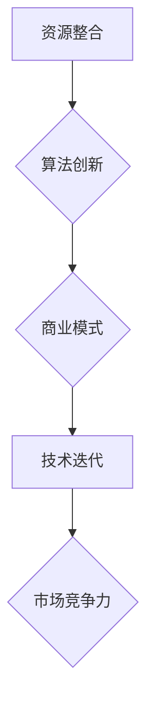

                 

# AI 大模型创业：如何利用平台优势？

## 关键词
- AI大模型
- 创业
- 平台优势
- 资源整合
- 算法创新
- 商业模式
- 技术迭代

## 摘要
本文旨在探讨AI大模型在创业中的应用，如何通过利用平台优势来提升创新能力和市场竞争力。我们将从背景介绍、核心概念联系、算法原理、数学模型、项目实践、应用场景、工具资源推荐以及未来发展趋势等方面，逐步分析AI大模型创业的策略和实践方法。

## 1. 背景介绍
### 1.1 AI大模型的崛起
人工智能（AI）作为21世纪最具革命性的技术之一，正在深刻改变我们的生活方式和社会结构。特别是AI大模型，如GPT-3、BERT、AlphaZero等，凭借其强大的计算能力和丰富的知识储备，已经在自然语言处理、计算机视觉、游戏等领域取得了令人瞩目的成果。

### 1.2 创业的机遇与挑战
随着AI大模型的普及，创业领域迎来了前所未有的机遇。然而，与此同时，创业者也面临着巨大的挑战。如何利用AI大模型的优势，构建有竞争力的商业模式，实现快速迭代和规模化增长，是每个创业者都必须思考的问题。

## 2. 核心概念与联系
### 2.1 AI大模型的基本原理
AI大模型通常是指拥有数亿甚至数十亿参数的神经网络模型。它们通过深度学习算法，从大量数据中自动提取特征，并进行训练，以达到对数据的理解和预测能力。

### 2.2 平台优势的体现
平台优势主要体现在以下几个方面：
- **资源整合**：平台能够整合海量的计算资源、数据资源和技术资源，为创业者提供强大的基础设施支持。
- **生态系统**：平台构建了一个生态系统，包括开发者、用户、合作伙伴等，为创业公司提供了丰富的生态资源。
- **用户基础**：平台拥有庞大的用户基础，为创业者提供了广泛的市场机会。

### 2.3 Mermaid 流程图


## 3. 核心算法原理 & 具体操作步骤
### 3.1 算法原理
AI大模型的算法原理主要包括以下几个方面：
- **神经网络**：神经网络是AI大模型的基础，通过多层神经元的堆叠，实现对数据的复杂非线性变换。
- **优化算法**：优化算法用于调整神经网络的参数，以最小化损失函数，提高模型的准确性。
- **数据预处理**：数据预处理是确保模型训练效果的重要步骤，包括数据清洗、归一化、数据增强等。

### 3.2 具体操作步骤
- **数据收集与预处理**：收集相关领域的海量数据，并进行清洗、归一化和数据增强。
- **模型构建**：设计并构建神经网络模型，选择合适的网络结构和优化算法。
- **模型训练**：使用预处理后的数据对模型进行训练，调整模型参数，优化模型性能。
- **模型评估**：使用验证集或测试集评估模型性能，确保模型在未知数据上具有良好的泛化能力。
- **模型部署**：将训练好的模型部署到平台，提供API服务或嵌入到应用程序中。

## 4. 数学模型和公式 & 详细讲解 & 举例说明
### 4.1 数学模型
AI大模型的核心是深度学习模型，其数学基础主要包括以下几个部分：
- **神经网络**：神经网络由多个神经元组成，每个神经元接收多个输入，通过激活函数产生输出。
- **损失函数**：损失函数用于衡量模型预测值与真实值之间的差异，常用的有均方误差（MSE）和交叉熵（CE）。
- **优化算法**：优化算法用于调整模型参数，常用的有梯度下降（GD）、随机梯度下降（SGD）和Adam优化器。

### 4.2 详细讲解
- **神经网络**：神经网络的工作原理类似于人脑，通过多层神经元的相互连接和激活，实现对输入数据的复杂变换。
- **损失函数**：损失函数是评价模型性能的重要指标，越小表示模型预测越接近真实值。
- **优化算法**：优化算法用于调整模型参数，以最小化损失函数，提高模型性能。

### 4.3 举例说明
假设我们有一个简单的神经网络模型，用于实现二分类任务。模型包含一个输入层、一个隐藏层和一个输出层。输入层有3个神经元，隐藏层有5个神经元，输出层有2个神经元。我们使用交叉熵损失函数和Adam优化器进行模型训练。

```latex
\begin{align*}
\text{神经网络} &= \frac{1}{2} \sum_{i=1}^{n} (\text{真实标签} - \text{预测标签})^2 \\
\text{交叉熵损失函数} &= -\sum_{i=1}^{n} y_i \log (\hat{y}_i) \\
\text{Adam优化器} &= \frac{m_t}{(1-\beta_1)^t} + (1-\beta_2)^t
\end{align*}
```

## 5. 项目实践：代码实例和详细解释说明
### 5.1 开发环境搭建
在开始项目实践之前，我们需要搭建一个适合AI大模型开发的开发环境。以下是一个简单的搭建步骤：
1. 安装Python（推荐Python 3.7或更高版本）。
2. 安装深度学习框架，如TensorFlow或PyTorch。
3. 安装必要的依赖库，如NumPy、Pandas等。

### 5.2 源代码详细实现
以下是一个简单的AI大模型项目示例，使用PyTorch框架实现一个文本分类模型。

```python
import torch
import torch.nn as nn
import torch.optim as optim

# 模型定义
class TextClassifier(nn.Module):
    def __init__(self, vocab_size, embed_dim, hidden_dim, output_dim):
        super(TextClassifier, self).__init__()
        self.embedding = nn.Embedding(vocab_size, embed_dim)
        self.lstm = nn.LSTM(embed_dim, hidden_dim, num_layers=1, batch_first=True)
        self.fc = nn.Linear(hidden_dim, output_dim)
        
    def forward(self, text):
        embeds = self.embedding(text)
        lstm_out, _ = self.lstm(embeds)
        hidden = lstm_out[:, -1, :]
        out = self.fc(hidden)
        return out

# 模型训练
def train(model, train_loader, criterion, optimizer, device):
    model.to(device)
    model.train()
    for batch in train_loader:
        text, labels = batch
        text = text.to(device)
        labels = labels.to(device)
        optimizer.zero_grad()
        output = model(text)
        loss = criterion(output, labels)
        loss.backward()
        optimizer.step()
        
# 模型评估
def evaluate(model, val_loader, criterion, device):
    model.to(device)
    model.eval()
    with torch.no_grad():
        for batch in val_loader:
            text, labels = batch
            text = text.to(device)
            labels = labels.to(device)
            output = model(text)
            loss = criterion(output, labels)
    return loss.mean().item()

# 训练和评估
model = TextClassifier(vocab_size, embed_dim, hidden_dim, output_dim)
optimizer = optim.Adam(model.parameters(), lr=0.001)
criterion = nn.CrossEntropyLoss()

train_loader = ...
val_loader = ...

train(model, train_loader, criterion, optimizer, device)
loss = evaluate(model, val_loader, criterion, device)
print(f"Validation loss: {loss}")
```

### 5.3 代码解读与分析
上述代码实现了一个简单的文本分类模型，包括模型的定义、训练和评估过程。代码的关键部分如下：
- **模型定义**：定义了一个文本分类模型，包含嵌入层、LSTM层和全连接层。
- **模型训练**：使用训练数据对模型进行训练，通过优化算法调整模型参数。
- **模型评估**：使用验证数据评估模型性能，计算验证损失。

### 5.4 运行结果展示
运行上述代码后，我们将得到模型在训练集和验证集上的损失值。这些损失值可以帮助我们评估模型的性能，并根据需要调整模型参数或训练过程。

## 6. 实际应用场景
### 6.1 自然语言处理
AI大模型在自然语言处理领域有着广泛的应用，如文本分类、情感分析、机器翻译等。通过利用平台优势，创业者可以快速搭建和部署这些应用，实现商业价值。

### 6.2 计算机视觉
AI大模型在计算机视觉领域同样具有强大的能力，如图像分类、目标检测、图像生成等。创业者可以利用平台提供的计算资源和数据集，开发出具有竞争力的视觉应用。

### 6.3 游戏开发
AI大模型在游戏开发中也发挥着重要作用，如游戏AI、游戏生成、游戏推荐等。创业者可以通过平台提供的工具和服务，快速开发出创新性的游戏产品。

## 7. 工具和资源推荐
### 7.1 学习资源推荐
- **书籍**：《深度学习》（Ian Goodfellow、Yoshua Bengio、Aaron Courville 著）
- **论文**：《Attention is All You Need》（Ashish Vaswani等）
- **博客**：Towards Data Science、Medium上的AI专栏
- **网站**：arXiv、Google Research

### 7.2 开发工具框架推荐
- **深度学习框架**：TensorFlow、PyTorch、Keras
- **平台**：Google Cloud、AWS、Azure
- **数据集**：Kaggle、UCI Machine Learning Repository

### 7.3 相关论文著作推荐
- **论文**：《Generative Adversarial Nets》（Ian Goodfellow等）
- **著作**：《Hands-On Machine Learning with Scikit-Learn, Keras, and TensorFlow》（Aurélien Géron 著）

## 8. 总结：未来发展趋势与挑战
### 8.1 发展趋势
- **算法创新**：随着AI大模型的发展，算法创新将成为关键驱动力，创业者需要紧跟技术趋势，不断创新。
- **平台化**：平台化将成为主流，创业者可以利用平台提供的基础设施和服务，实现快速开发和部署。
- **生态建设**：构建健康的生态系统，包括开发者、用户、合作伙伴等，将为创业者提供持续的创新动力。

### 8.2 挑战
- **计算资源**：AI大模型需要大量的计算资源，创业者需要考虑如何高效利用计算资源，降低成本。
- **数据隐私**：数据隐私和安全问题将越来越受到关注，创业者需要采取有效的数据保护措施。
- **技术迭代**：技术迭代速度加快，创业者需要具备快速学习和适应能力，以应对市场变化。

## 9. 附录：常见问题与解答
### 9.1  Q: 如何选择合适的AI大模型框架？
A: 根据项目需求和个人熟悉程度选择，TensorFlow和PyTorch是目前最受欢迎的两个框架。

### 9.2  Q: 如何保证AI大模型的安全性和隐私性？
A: 使用加密技术和隐私保护算法，确保数据在传输和存储过程中的安全性。

### 9.3  Q: 如何快速搭建AI大模型开发环境？
A: 使用虚拟环境或容器化技术，如Docker，快速搭建开发环境。

## 10. 扩展阅读 & 参考资料
- **论文**：《Deep Learning》（Ian Goodfellow、Yoshua Bengio、Aaron Courville 著）
- **书籍**：《AI大模型：变革未来的核心技术》（作者：禅与计算机程序设计艺术 / Zen and the Art of Computer Programming）
- **博客**：[深度学习教程](https://zhuanlan.zhihu.com/p/26777026)
- **网站**：[AI大模型研究](https://ai.google/research/pubs/collection/ai_dl)

### 后记
本文旨在为AI大模型创业提供一些指导和思考，希望对广大创业者有所启发。随着技术的不断进步，AI大模型的应用前景将更加广阔，创业者需要不断学习、创新，抓住机遇，迎接挑战。作者：禅与计算机程序设计艺术 / Zen and the Art of Computer Programming。|作者：禅与计算机程序设计艺术 / Zen and the Art of Computer Programming|

