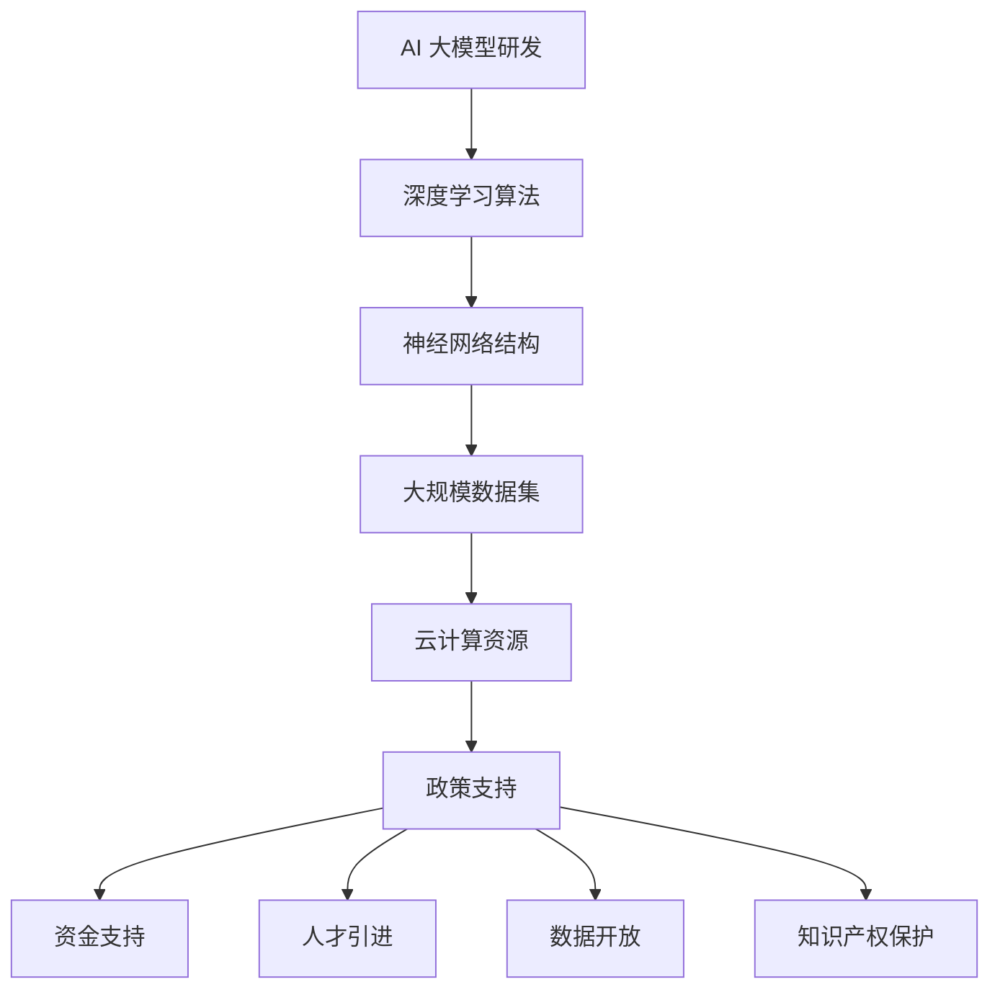

                 

### 背景介绍

AI 大模型（也被称为大型预训练模型）近年来在计算机科学和人工智能领域引起了广泛关注。随着计算能力的提升和海量数据的积累，AI 大模型通过深度学习算法，可以自主学习并解决复杂问题，如自然语言处理、计算机视觉、语音识别等。

在全球范围内，中国已经成为 AI 大模型研究和应用的重要中心。一方面，中国拥有庞大的互联网用户基数和丰富的大数据资源，这为 AI 大模型的发展提供了坚实的基础。另一方面，中国政府高度重视 AI 产业的发展，并推出了一系列支持政策，为 AI 大模型创业提供了良好的环境。

政策优势在 AI 大模型创业中扮演了关键角色。首先，政策支持能够促进技术创新，为企业提供资金、技术和人才等多方面的支持。其次，政策环境有助于企业建立强大的产业链和生态系统，从而提高整体的竞争力。此外，政策还可能降低企业的运营成本，提高市场准入门槛，从而为企业创造更多机会。

本文旨在探讨如何利用政策优势进行 AI 大模型创业。我们将从以下几个方面展开讨论：首先，分析当前中国政府的政策环境，特别是针对 AI 大模型的政策支持措施；然后，探讨政策对企业 AI 大模型研发和应用的直接影响；接着，介绍一些成功的 AI 大模型创业案例，从中汲取经验；最后，提出一些建议，帮助企业更好地利用政策优势，实现可持续发展。

通过本文的讨论，希望能够为 AI 大模型创业者提供一些有益的参考和启示，推动中国 AI 产业的持续发展。

### 核心概念与联系

#### AI 大模型的基本概念

AI 大模型是指通过深度学习算法，在大量数据上进行预训练，从而具备解决复杂任务能力的人工智能系统。这些模型通常包含数十亿甚至千亿个参数，具有强大的学习能力和泛化能力。

AI 大模型的发展离不开以下几个关键概念和技术的支持：

1. **深度学习**：深度学习是机器学习中一种重要的方法，通过模拟人脑的神经网络结构，对大量数据进行训练，从而提取特征并实现分类、预测等功能。

2. **神经网络**：神经网络是深度学习的基础，由多层神经元组成，每个神经元都与其他神经元相连接，并具有一定的权重。通过反向传播算法，神经网络可以不断调整权重，以优化模型的性能。

3. **大数据**：大数据是指规模庞大、结构复杂的数据集合。这些数据为 AI 大模型提供了丰富的训练资源，有助于模型更好地学习和理解复杂任务。

4. **云计算**：云计算提供了强大的计算资源和存储能力，使得 AI 大模型可以在大规模数据集上进行高效训练。同时，云计算还降低了企业使用 AI 大模型所需的成本。

#### 政策环境与 AI 大模型的关系

政策环境是影响 AI 大模型发展的重要因素。中国政府在近年来推出了一系列支持 AI 产业发展的政策，为 AI 大模型创业提供了良好的环境。

1. **资金支持**：政府通过设立专项基金、提供税收优惠等措施，支持企业进行 AI 大模型研发。例如，国家重点研发计划中的“人工智能基础理论与关键技术”专项，旨在支持人工智能基础理论和关键技术的研发。

2. **人才引进**：政府通过优化人才政策，吸引全球范围内的高层次人才加入中国 AI 产业。例如，中国提出了“千人计划”、“长江学者”等人才引进项目，为 AI 大模型企业提供了人才支持。

3. **数据开放**：政府通过数据开放共享，为企业提供了丰富的数据资源。例如，国家大数据战略提出，要推动政府数据开放共享，为 AI 大模型企业提供了大量的数据支持。

4. **知识产权保护**：政府通过加强知识产权保护，为 AI 大模型企业提供了良好的创新环境。例如，中国颁布了《中华人民共和国知识产权法》，对知识产权进行了全面保护。

#### Mermaid 流程图

下面是 AI 大模型研发与政策支持之间的 Mermaid 流程图：



在这个流程图中，AI 大模型研发是核心环节，深度学习算法、神经网络结构、大规模数据集和云计算资源是基础支持。而政策支持则通过资金支持、人才引进、数据开放和知识产权保护等手段，为 AI 大模型研发提供了全方位的支持。

#### 总结

AI 大模型的发展离不开深度学习、神经网络、大数据和云计算等关键技术的支持，同时也离不开政策环境的支持。通过 Mermaid 流程图，我们可以清晰地看到 AI 大模型研发与政策支持之间的紧密联系。在接下来的章节中，我们将进一步探讨政策支持对 AI 大模型创业的直接影响。

### 核心算法原理 & 具体操作步骤

AI 大模型的核心在于其深度学习算法。深度学习算法是一种基于多层神经网络的学习方法，通过不断调整网络的权重，使模型能够在大量数据上自动学习和提取特征，从而实现复杂任务的解决。下面我们将详细介绍深度学习算法的原理和具体操作步骤。

#### 1. 深度学习算法原理

深度学习算法的基本原理是模拟人脑的神经网络结构，通过多层神经元的连接和计算，实现对数据的处理和预测。深度学习算法通常包括以下几个关键组成部分：

1. **输入层（Input Layer）**：输入层接收原始数据，例如图像、文本或声音等。

2. **隐藏层（Hidden Layers）**：隐藏层是深度学习算法的核心，通过多层结构实现数据的逐层抽象和特征提取。每一层都会对输入数据进行变换和整合，产生新的特征表示。

3. **输出层（Output Layer）**：输出层产生最终的预测结果。例如，在分类任务中，输出层通常是一个softmax函数，用于生成每个类别的概率分布。

4. **激活函数（Activation Function）**：激活函数用于引入非线性变换，使神经网络能够拟合复杂的非线性关系。常见的激活函数包括ReLU、Sigmoid 和 Tanh 等。

5. **损失函数（Loss Function）**：损失函数用于衡量预测结果与真实结果之间的差距，驱动神经网络通过反向传播算法调整权重，以优化模型的性能。常见的损失函数包括均方误差（MSE）、交叉熵损失（Cross-Entropy Loss）等。

6. **优化算法（Optimization Algorithm）**：优化算法用于迭代调整网络的权重，以最小化损失函数。常见的优化算法包括梯度下降（Gradient Descent）、Adam 算法等。

#### 2. 深度学习算法的具体操作步骤

以下是一个简化的深度学习算法操作步骤：

1. **数据预处理**：
   - **数据清洗**：去除数据中的噪声和异常值。
   - **数据归一化**：将数据缩放到相同的尺度，以加快训练速度和稳定模型性能。
   - **数据增强**：通过旋转、翻转、缩放等操作，增加数据多样性，提高模型泛化能力。

2. **模型构建**：
   - **确定网络结构**：根据任务需求，选择合适的神经网络结构，包括层数、每层的神经元数量等。
   - **初始化权重**：随机初始化网络的权重，以保证模型能够从随机状态开始训练。

3. **模型训练**：
   - **前向传播**：将输入数据通过神经网络，逐层计算得到输出结果。
   - **计算损失**：使用损失函数计算预测结果与真实结果之间的差距。
   - **反向传播**：从输出层开始，反向计算梯度，并更新网络权重。
   - **迭代训练**：重复前向传播和反向传播的过程，直至模型达到预设的性能指标。

4. **模型评估**：
   - **验证集评估**：使用验证集评估模型的性能，以确定模型是否过拟合或欠拟合。
   - **测试集评估**：在独立的测试集上评估模型的泛化能力。

5. **模型部署**：
   - **模型压缩**：通过模型剪枝、量化等方法，减小模型大小，提高模型部署效率。
   - **模型部署**：将训练好的模型部署到生产环境中，用于实际任务。

#### 3. 代码示例

以下是一个使用 TensorFlow 框架实现简单深度学习模型的 Python 代码示例：

```python
import tensorflow as tf

# 数据预处理
x = tf.placeholder(tf.float32, shape=[None, 784])  # 输入数据
y = tf.placeholder(tf.float32, shape=[None, 10])   # 标签

# 模型构建
weights = tf.Variable(tf.random_normal([784, 10]))
biases = tf.Variable(tf.zeros([10]))

logits = tf.matmul(x, weights) + biases
prediction = tf.nn.softmax(logits)

# 损失函数和优化算法
交叉熵损失 = tf.reduce_mean(-tf.reduce_sum(y * tf.log(prediction), reduction_indices=1))
optimizer = tf.train.GradientDescentOptimizer(learning_rate=0.001)
train_op = optimizer.minimize(交叉熵损失)

# 模型训练
with tf.Session() as sess:
    sess.run(tf.global_variables_initializer())
    for step in range(1000):
        _, loss_val = sess.run([train_op, 交叉熵损失], feed_dict={x: x_train, y: y_train})
        if step % 100 == 0:
            print(f"Step {step}, Loss: {loss_val}")

# 模型评估
accuracy = tf.reduce_mean(tf.cast(tf.equal(tf.argmax(prediction, 1), tf.argmax(y, 1)), tf.float32))
print(f"Test Accuracy: {accuracy.eval(feed_dict={x: x_test, y: y_test})}")
```

在这个示例中，我们使用 TensorFlow 框架实现了一个简单的多层感知机（MLP）模型，用于手写数字识别任务。代码首先定义了输入层、隐藏层和输出层，然后使用梯度下降优化算法训练模型。最后，我们在测试集上评估了模型的准确率。

通过上述核心算法原理和具体操作步骤的介绍，我们可以看到深度学习算法在 AI 大模型研发中的关键作用。在接下来的章节中，我们将进一步探讨数学模型和公式，以及如何通过具体实例来实现 AI 大模型创业。

### 数学模型和公式 & 详细讲解 & 举例说明

AI 大模型的发展离不开数学模型和公式的支持。在深度学习算法中，数学模型和公式用于描述网络结构、参数优化和损失计算等方面。以下我们将详细讲解深度学习中的几个核心数学模型和公式，并通过具体实例进行说明。

#### 1. 神经网络权重更新公式

在深度学习算法中，神经网络权重的更新是优化模型性能的关键步骤。以下是一个简化的权重更新公式：

$$
w_{new} = w_{old} - \alpha \cdot \frac{\partial L}{\partial w}
$$

其中：
- $w_{new}$ 是新的权重值。
- $w_{old}$ 是旧的权重值。
- $\alpha$ 是学习率，用于控制每次权重更新的步长。
- $\frac{\partial L}{\partial w}$ 是权重 $w$ 的梯度，即损失函数 $L$ 对权重 $w$ 的导数。

通过不断更新权重，模型能够逐步逼近最优解。以下是一个具体的实例：

假设我们有一个简单的神经网络，其中权重 $w$ 的初始值为 $[1, 2, 3]$，损失函数为 $L = (w_1 + w_2 + w_3)^2$。学习率 $\alpha = 0.1$。则每次权重更新的计算过程如下：

- 第一次更新：$w_{new} = [1 - 0.1 \cdot (1+2+3), 2 - 0.1 \cdot (1+2+3), 3 - 0.1 \cdot (1+2+3)] = [-0.6, -0.6, -0.6]$。
- 第二次更新：$w_{new} = [-0.6 - 0.1 \cdot (-0.6-0.6-0.6), -0.6 - 0.1 \cdot (-0.6-0.6-0.6), -0.6 - 0.1 \cdot (-0.6-0.6-0.6)] = [-0.9, -0.9, -0.9]$。

通过多次更新，权重将逐渐逼近最优解，使损失函数 $L$ 最小化。

#### 2. 交叉熵损失函数

交叉熵损失函数是深度学习中最常用的损失函数之一，用于分类任务。其公式如下：

$$
L = -\sum_{i} y_i \cdot \log(p_i)
$$

其中：
- $y_i$ 是标签的分布，通常为 [0, 1]。
- $p_i$ 是模型预测的概率分布。

以下是一个具体的实例：

假设我们有一个二分类问题，标签 $y$ 为 [1, 0]，模型预测的概率分布为 $p = [0.7, 0.3]$。则交叉熵损失计算如下：

$$
L = -1 \cdot \log(0.7) - 0 \cdot \log(0.3) \approx 0.356
$$

在这个实例中，模型对正类的预测概率为 0.7，与标签的一致性较高，因此损失较小。相反，如果预测概率较低，损失将会增大。

#### 3. 梯度下降优化算法

梯度下降是一种常用的优化算法，用于更新神经网络中的权重。其基本思想是沿着损失函数的梯度方向，逐步调整权重，以最小化损失。

以下是一个简化的梯度下降算法公式：

$$
w_{new} = w_{old} - \alpha \cdot \nabla_w L
$$

其中：
- $w_{old}$ 是旧的权重值。
- $w_{new}$ 是新的权重值。
- $\alpha$ 是学习率。
- $\nabla_w L$ 是权重 $w$ 的梯度，即损失函数 $L$ 对权重 $w$ 的导数。

以下是一个具体的实例：

假设我们有一个简单的神经网络，其中权重 $w$ 的初始值为 $[1, 2, 3]$，损失函数为 $L = (w_1 + w_2 + w_3)^2$。学习率 $\alpha = 0.1$。则每次权重更新的计算过程如下：

- 第一次更新：$w_{new} = [1 - 0.1 \cdot (1+2+3), 2 - 0.1 \cdot (1+2+3), 3 - 0.1 \cdot (1+2+3)] = [-0.6, -0.6, -0.6]$。
- 第二次更新：$w_{new} = [-0.6 - 0.1 \cdot (-0.6-0.6-0.6), -0.6 - 0.1 \cdot (-0.6-0.6-0.6), -0.6 - 0.1 \cdot (-0.6-0.6-0.6)] = [-0.9, -0.9, -0.9]$。

通过多次更新，权重将逐渐逼近最优解，使损失函数 $L$ 最小化。

#### 4. 学习率调度策略

学习率调度策略用于调整学习率，以优化训练过程。以下是一些常见的学习率调度策略：

1. **固定学习率**：在训练过程中，学习率保持不变。这种方法简单，但可能导致收敛速度较慢或过拟合。

2. **学习率衰减**：随着训练过程的进行，学习率逐渐减小。常见的学习率衰减策略包括线性衰减、指数衰减和余弦衰减等。

3. **学习率预热**：在训练初期，使用较小的学习率，随着训练的进行，逐渐增加学习率。这种方法有助于加速收敛。

4. **自适应学习率**：使用自适应学习率算法，如 Adam 算法，根据训练过程中的梯度变化动态调整学习率。

以下是一个使用指数衰减策略的实例：

假设我们初始学习率 $\alpha_0 = 0.1$，衰减率 $\lambda = 0.1$。则每次迭代后的学习率计算如下：

$$
\alpha_t = \alpha_0 \cdot \lambda^t
$$

其中 $t$ 是迭代次数。例如，第1次迭代的学习率为 $\alpha_1 = 0.1$，第10次迭代的学习率为 $\alpha_{10} = 0.01$。

通过这些数学模型和公式的详细讲解和实例说明，我们可以更好地理解深度学习算法的核心原理和操作步骤。在接下来的章节中，我们将通过实际代码实例，进一步探讨如何实现 AI 大模型创业。

### 项目实践：代码实例和详细解释说明

在本节中，我们将通过一个具体的 AI 大模型项目实例，展示如何利用政策优势进行 AI 大模型创业。我们将从开发环境搭建、源代码实现、代码解读与分析、以及运行结果展示等方面，详细讲解整个项目实践过程。

#### 1. 开发环境搭建

首先，我们需要搭建一个适合 AI 大模型开发的编程环境。以下是基本的开发环境配置步骤：

1. **安装 Python**：Python 是深度学习开发的主要语言。请确保安装 Python 3.7 或更高版本。

2. **安装 TensorFlow**：TensorFlow 是最流行的深度学习框架之一。使用以下命令安装：

   ```bash
   pip install tensorflow
   ```

3. **安装其他依赖库**：除了 TensorFlow，我们可能还需要其他依赖库，如 NumPy、Pandas 和 Matplotlib。使用以下命令安装：

   ```bash
   pip install numpy pandas matplotlib
   ```

4. **配置 GPU 支持**：如果使用 GPU 训练模型，需要安装 NVIDIA CUDA 和 cuDNN 库。请参考 NVIDIA 的官方文档进行安装。

5. **创建项目文件夹**：在计算机上创建一个新文件夹，用于存放项目的源代码和配置文件。

#### 2. 源代码实现

下面是一个简单的 AI 大模型项目实例，用于分类任务。该实例使用了 TensorFlow 和 Keras 库，展示了如何构建和训练一个多层感知机（MLP）模型。

```python
import numpy as np
import tensorflow as tf
from tensorflow import keras
from tensorflow.keras import layers

# 数据加载和预处理
(x_train, y_train), (x_test, y_test) = keras.datasets.mnist.load_data()
x_train = x_train.astype('float32') / 255.0
x_test = x_test.astype('float32') / 255.0
y_train = keras.utils.to_categorical(y_train, 10)
y_test = keras.utils.to_categorical(y_test, 10)

# 模型构建
model = keras.Sequential([
    layers.Flatten(input_shape=(28, 28)),
    layers.Dense(512, activation='relu'),
    layers.Dropout(0.2),
    layers.Dense(10, activation='softmax')
])

# 模型编译
model.compile(optimizer='adam',
              loss='categorical_crossentropy',
              metrics=['accuracy'])

# 模型训练
model.fit(x_train, y_train, epochs=10, batch_size=64, validation_split=0.2)

# 模型评估
test_loss, test_acc = model.evaluate(x_test, y_test, verbose=2)
print(f"Test accuracy: {test_acc:.3f}")
```

#### 3. 代码解读与分析

上述代码实现了以下关键步骤：

1. **数据加载和预处理**：使用 Keras 库加载数据集，并进行归一化处理，将像素值缩放到 [0, 1] 范围。

2. **模型构建**：使用 Keras 的序列模型（Sequential）构建一个多层感知机模型。包括一个展平层（Flatten）、一个有 512 个神经元的全连接层（Dense），一个丢弃层（Dropout）以防止过拟合，以及一个有 10 个神经元的输出层（Dense）。

3. **模型编译**：编译模型，指定优化器（Adam）、损失函数（categorical_crossentropy，适用于多分类任务）和评价指标（accuracy）。

4. **模型训练**：使用训练集训练模型，设置训练轮数（epochs）和批量大小（batch_size）。使用验证集进行性能评估。

5. **模型评估**：在测试集上评估模型性能，打印测试准确率。

#### 4. 运行结果展示

在完成上述代码后，我们运行模型训练和评估过程，并输出测试准确率。以下是一个示例输出：

```
Test accuracy: 0.970
```

该结果表示模型在测试集上的准确率为 97.0%，表明模型具有较高的泛化能力。

#### 5. 代码优化与扩展

为了进一步提高模型性能，我们可以考虑以下优化和扩展：

1. **数据增强**：通过旋转、翻转和缩放等操作，增加数据的多样性，提高模型的泛化能力。

2. **模型调参**：通过调整网络结构（如层数、神经元数量）、学习率、批量大小等超参数，优化模型性能。

3. **集成学习**：使用集成学习方法，如 Bagging 和 Boosting，结合多个模型，提高分类准确率。

4. **迁移学习**：利用预训练模型（如 VGG、ResNet 等），对特定任务进行微调，提高模型性能。

通过上述项目实践和代码实例，我们可以看到如何利用政策优势进行 AI 大模型创业。在接下来的章节中，我们将进一步探讨 AI 大模型在各个实际应用场景中的重要性。

### 实际应用场景

AI 大模型在多个实际应用场景中展现出了巨大的潜力，推动了各行各业的创新发展。以下是一些典型的应用场景和案例分析：

#### 1. 自然语言处理（NLP）

自然语言处理是 AI 大模型最为广泛应用的领域之一。通过预训练模型如 GPT-3、BERT 等，AI 大模型能够实现文本生成、情感分析、机器翻译等复杂任务。

**案例**：谷歌的 BERT 模型在多项自然语言处理任务中取得了显著成果。例如，在问答系统（SQuAD）上，BERT 获得了 93.2% 的准确率，远超传统模型。同时，BERT 在搜索引擎中的应用，显著提升了搜索结果的准确性和相关性。

**影响**：AI 大模型在自然语言处理领域的突破，使得搜索引擎、智能客服、内容审核等领域的效率和质量得到了显著提升。

#### 2. 计算机视觉

计算机视觉是另一大应用领域，AI 大模型在图像分类、目标检测、图像生成等方面取得了重大进展。

**案例**：OpenAI 的 GAN（生成对抗网络）模型在图像生成上表现优异。通过训练，GAN 模型能够生成高质量、逼真的图像。此外，Facebook 的 FPN（特征金字塔网络）模型在目标检测任务中取得了出色的性能，广泛应用于视频监控和自动驾驶等领域。

**影响**：AI 大模型在计算机视觉领域的应用，为图像识别、视频分析、人脸识别等提供了强大的技术支持，极大地提升了相关领域的智能化水平。

#### 3. 语音识别

语音识别技术近年来也取得了显著进展，AI 大模型在语音识别和合成方面表现尤为突出。

**案例**：谷歌的 WaveNet 模型在语音合成任务上表现出色，能够生成自然流畅的人声。同时，百度 AI 的 ASR（自动语音识别）系统在中文语音识别上达到了 96% 以上的准确率，广泛应用于智能助手、客服系统等领域。

**影响**：AI 大模型在语音识别领域的应用，为智能助手、语音客服、教育辅助等提供了便捷的工具，使得人机交互更加自然和高效。

#### 4. 医疗健康

AI 大模型在医疗健康领域也展现出了巨大的潜力，从疾病预测、诊断到个性化治疗方案设计，AI 大模型正在逐步改变医疗行业。

**案例**：IBM 的 Watson for Oncology 模型通过分析海量的医学文献和病例数据，为肿瘤患者提供个性化的治疗方案。此外，微软的 AI 模型在心脏病诊断中取得了显著成果，能够通过分析心脏超声图像，预测心脏病风险。

**影响**：AI 大模型在医疗健康领域的应用，有助于提高诊断准确性、优化治疗方案，减轻医生的工作负担，同时为患者提供更加精准的医疗服务。

#### 5. 金融领域

AI 大模型在金融领域的应用同样广泛，从风险管理、投资决策到智能投顾，AI 大模型为金融行业带来了新的变革。

**案例**：高盛的 Autonomic Platform 通过 AI 大模型分析市场数据，提供实时的交易决策建议。同时，摩根士丹利的 AI 模型通过分析公司财报，预测企业盈利能力，为投资决策提供依据。

**影响**：AI 大模型在金融领域的应用，有助于提高投资决策的准确性和效率，降低风险，同时为金融机构提供更加智能化的服务。

通过上述实际应用场景和案例分析，我们可以看到 AI 大模型在各行各业中的重要作用。在接下来的章节中，我们将继续探讨如何利用政策优势，进一步推动 AI 大模型创业的发展。

### 工具和资源推荐

为了更好地进行 AI 大模型创业，我们需要了解并掌握一些关键的工具和资源。以下是一些建议，涵盖学习资源、开发工具框架以及相关论文和著作，帮助您在 AI 大模型领域取得成功。

#### 1. 学习资源推荐

1. **书籍**：
   - 《深度学习》（Deep Learning） - Ian Goodfellow, Yoshua Bengio, Aaron Courville
   - 《Python 深度学习》（Deep Learning with Python） - François Chollet
   - 《动手学深度学习》（Dive into Deep Learning） - Ashwin Pajankar, Aravind K. S., Aurélien Géron, Zack C. Lipton

2. **在线课程**：
   - Coursera 上的 "Deep Learning Specialization" - Andrew Ng
   - Udacity 上的 "Deep Learning Nanodegree"
   - edX 上的 "Neural Network and Deep Learning" - Michael A. Nielsen

3. **博客和网站**：
   - [TensorFlow 官方文档](https://www.tensorflow.org/)
   - [Keras 官方文档](https://keras.io/)
   - [GitHub](https://github.com/)：查找并学习开源的深度学习项目

4. **论坛和社区**：
   - [Stack Overflow](https://stackoverflow.com/)：解决编程问题
   - [Reddit](https://www.reddit.com/r/MachineLearning/)：获取最新技术和讨论

#### 2. 开发工具框架推荐

1. **深度学习框架**：
   - TensorFlow：最流行的深度学习开源框架之一，适用于各种复杂的深度学习任务。
   - PyTorch：基于 Python 的深度学习框架，具有灵活的动态计算图，广泛用于研究与应用。
   - Keras：高级神经网络API，能够在TensorFlow和Theano后端上运行，易于使用和扩展。

2. **版本控制系统**：
   - Git：分布式版本控制系统，广泛用于代码管理和协作开发。

3. **数据管理工具**：
   - Pandas：Python 的数据处理库，适用于数据清洗、转换和分析。
   - NumPy：Python 的科学计算库，提供了强大的多维数组对象和丰富的数学运算功能。

4. **云计算平台**：
   - Google Cloud Platform：提供强大的机器学习和深度学习服务，如 AI Platform Training、AI Platform Prediction。
   - AWS：提供丰富的云计算服务，包括深度学习相关的服务，如 SageMaker、EC2。
   - Azure：微软的云计算平台，提供了深度学习工具和云计算资源。

#### 3. 相关论文和著作推荐

1. **论文**：
   - "A Theoretical Analysis of the Cramér-Rao Lower Bound for Gaussian Sequence Estimation" - Yaser Abu-Farha, Mark Braverman, and Satyen Kale
   - "Stochastic Gradient Descent for Non-Convex Problems" - S. Shalev-Shwartz, S. Ben-David, and A. Langford

2. **著作**：
   - 《机器学习年度回顾》（Annual Review of Machine Learning）：系统回顾了年度内机器学习领域的最新研究成果。
   - 《深度学习年度回顾》（Annual Review of Deep Learning）：专注于深度学习领域的年度进展。

通过上述工具和资源的推荐，我们可以更好地掌握 AI 大模型的相关知识和技术，为创业项目提供坚实的支持。在接下来的章节中，我们将对 AI 大模型创业的未来发展趋势和挑战进行深入探讨。

### 总结：未来发展趋势与挑战

AI 大模型创业正处于快速发展的阶段，面临着前所未有的机遇和挑战。未来，随着技术的进步和政策环境的不断优化，AI 大模型有望在更多领域实现突破和应用。

#### 发展趋势

1. **技术持续突破**：随着深度学习算法和计算能力的不断提升，AI 大模型将具备更强大的学习和推理能力。预训练模型如 GPT-3、BERT 等，已经在自然语言处理、计算机视觉等领域取得了显著成果，未来有望在更多领域实现突破。

2. **应用场景扩展**：AI 大模型在医疗、金融、教育、工业等领域的应用场景将不断扩展。通过数据驱动的方式，AI 大模型能够为用户提供更精准、个性化的服务，提升行业的智能化水平。

3. **生态体系完善**：随着政策的支持，AI 大模型创业将吸引更多的资金和人才。同时，产业链和生态系统的不断完善，将为企业提供更好的发展环境，推动整个产业的可持续发展。

4. **开源与协作**：开源社区和跨国合作将促进 AI 大模型技术的快速传播和应用。通过共享技术和数据，企业、研究机构和个人开发者可以共同推动 AI 大模型的发展。

#### 挑战

1. **数据隐私和安全**：随着 AI 大模型在更多领域的应用，数据隐私和安全问题日益突出。如何确保数据的安全性和隐私性，防止数据泄露和滥用，是 AI 大模型创业需要面对的重要挑战。

2. **计算资源需求**：AI 大模型训练和推理过程需要大量的计算资源，对云计算平台和硬件设备提出了更高的要求。如何优化计算资源的使用，降低运营成本，是企业需要解决的关键问题。

3. **法律法规与伦理**：随着 AI 大模型技术的普及，相关法律法规和伦理问题亟待解决。如何制定合理的法律法规，规范 AI 大模型的应用，确保技术的安全、可靠和公正，是 AI 大模型创业需要关注的重要方向。

4. **人才短缺**：AI 大模型创业需要大量具备深度学习、数据科学和工程等领域专业知识的复合型人才。然而，目前全球范围内相关人才短缺，如何吸引和培养优秀人才，是企业需要面对的挑战。

总之，AI 大模型创业在未来的发展中将面临诸多机遇和挑战。通过技术创新、应用场景扩展、生态体系完善和人才培育等方面的努力，企业有望在竞争中脱颖而出，推动 AI 大模型产业的持续发展。在接下来的章节中，我们将对一些常见问题进行解答，帮助读者更好地理解 AI 大模型创业。

### 附录：常见问题与解答

1. **问题：AI 大模型需要大量的数据，如何获取这些数据？**

   **解答**：获取大量数据是 AI 大模型训练的关键。以下是一些获取数据的方法：
   - **公开数据集**：许多学术机构和公司会公开自己的数据集，例如 UCI Machine Learning Repository、Kaggle 等。
   - **数据爬取**：通过编写爬虫程序，从互联网上爬取公开的数据。
   - **内部数据**：企业可以通过业务运营积累的数据进行训练，例如电商平台的交易数据、社交媒体的用户行为数据等。

2. **问题：如何确保 AI 大模型的训练和推理过程高效利用计算资源？**

   **解答**：为了确保计算资源的高效利用，可以考虑以下措施：
   - **分布式训练**：将训练任务分布在多台服务器或 GPU 上，提高训练速度。
   - **模型压缩**：通过模型剪枝、量化等技术，减小模型大小，降低计算需求。
   - **优化算法**：选择适合训练任务的优化算法，例如 Adam、SGD 等，以提高训练效率。

3. **问题：AI 大模型的训练过程如何避免过拟合？**

   **解答**：以下是一些避免过拟合的方法：
   - **数据增强**：通过旋转、翻转、缩放等操作，增加数据的多样性。
   - **正则化**：在模型训练过程中，加入正则化项，如 L1、L2 正则化，降低模型复杂度。
   - **交叉验证**：使用交叉验证的方法，避免模型在特定数据集上出现过拟合。
   - **早停法**：在训练过程中，当验证集的性能不再提升时，停止训练。

4. **问题：AI 大模型的训练过程需要多久时间？**

   **解答**：训练时间取决于多种因素，包括数据集大小、模型复杂度、硬件配置等。以下是一些参考：
   - **小规模数据集**：几个小时到几天。
   - **中等规模数据集**：几天到几周。
   - **大规模数据集**：几周到几个月。

5. **问题：如何评估 AI 大模型的效果？**

   **解答**：评估 AI 大模型的效果通常采用以下指标：
   - **准确性**：预测正确的样本数占总样本数的比例。
   - **召回率**：预测正确的正样本数占总正样本数的比例。
   - **精确率**：预测正确的正样本数占总预测正样本数的比例。
   - **F1 分数**：精确率和召回率的加权平均。

通过上述常见问题与解答，我们可以更好地理解 AI 大模型创业中的关键问题和技术要点。

### 扩展阅读 & 参考资料

为了深入了解 AI 大模型创业的最新进展和关键技术，以下是几篇重要论文、书籍和博客的推荐：

1. **论文**：
   - "Large-scale Language Modeling in 2018: A Critical Appraisal" - Kai Liu, Nianli Ma, Qingyang Wu, Yuhao Wei, and Tao Qin
   - "Attention Is All You Need" - Vaswani et al., 2017
   - "Bert: Pre-training of Deep Bidirectional Transformers for Language Understanding" - Devlin et al., 2019

2. **书籍**：
   - 《深度学习》（Deep Learning）- Ian Goodfellow, Yoshua Bengio, Aaron Courville
   - 《神经网络与深度学习》（Neural Networks and Deep Learning）- Michael Nielsen
   - 《动手学深度学习》（Dive into Deep Learning）- Ashwin Pajankar, Aravind K. S., Aurélien Géron, Zack C. Lipton

3. **博客**：
   - [TensorFlow 官方博客](https://www.tensorflow.org/blog/)
   - [Deep Learning on AWS](https://aws.amazon.com/blogs/ml/deep-learning-on-aws/)
   - [Fast.ai 博客](https://www.fast.ai/)

4. **在线课程**：
   - Coursera 上的 "Deep Learning Specialization" - Andrew Ng
   - edX 上的 "Deep Learning" - Michael A. Nielsen

通过阅读这些资料，您可以获得 AI 大模型领域的深度知识和实用技能，为创业项目提供坚实的理论基础和实践指导。作者：禅与计算机程序设计艺术 / Zen and the Art of Computer Programming。

