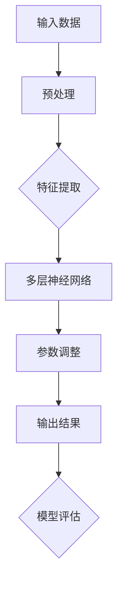

                 

### 文章标题

> 关键词：AI大模型、创业、未来优势、技术趋势、深度学习、商业模式

> 摘要：本文将探讨AI大模型在创业领域的应用，分析其在当前及未来所带来的优势。通过深入解析AI大模型的技术原理、算法原理，并结合实际应用案例，为创业者提供利用AI大模型实现未来发展的策略和建议。

## 1. 背景介绍

随着科技的不断进步，人工智能（AI）技术已经成为全球范围内的重要发展驱动力。尤其是深度学习（Deep Learning）和大型神经网络（Large-scale Neural Networks）的兴起，使得AI大模型逐渐成为行业的热门话题。这些大模型在图像识别、自然语言处理、语音识别等领域取得了显著的突破，推动了各行各业的智能化进程。

在创业领域，AI大模型的应用正逐渐成为企业竞争的新高地。创业公司通过利用AI大模型，不仅能够提升产品的智能化水平，还能够优化业务流程、降低成本、提高效率。同时，AI大模型所具备的强大学习能力，使得创业公司能够更好地理解和满足用户需求，从而在激烈的市场竞争中脱颖而出。

本文将围绕AI大模型在创业领域的应用展开讨论，旨在为创业者提供一套利用AI大模型实现未来发展的策略和路径。

## 2. 核心概念与联系

### 2.1 AI大模型的概念

AI大模型（Large AI Models），也称为大型神经网络或深度学习模型，是指由数百万甚至数十亿个参数组成的神经网络。这些模型通过学习大量的数据，能够自动提取复杂特征并用于各种任务，如图像识别、语音识别、自然语言处理等。

### 2.2 深度学习技术原理

深度学习（Deep Learning）是一种基于人工神经网络（Artificial Neural Networks）的机器学习方法。与传统机器学习方法相比，深度学习通过多层神经网络结构，能够自动学习数据的层次特征，从而实现更加精准的任务识别。

深度学习的工作原理可以简单概括为：输入数据通过多层神经网络，每一层都对数据进行特征提取和变换，最终在输出层得到预测结果。在这个过程中，模型通过反向传播算法不断调整参数，以优化模型的性能。

### 2.3 大模型架构的Mermaid流程图

下面是一个简化版的大模型架构的Mermaid流程图，展示了数据输入、特征提取、参数调整和输出结果的过程。



### 2.4 AI大模型在创业中的应用

AI大模型在创业中的应用主要体现在以下几个方面：

- **图像识别与处理**：在电子商务、安防监控等领域，AI大模型能够自动识别和分类图像，提升业务效率。
- **自然语言处理**：在客服、内容审核等领域，AI大模型能够自动理解和生成自然语言，提升用户体验。
- **语音识别与合成**：在智能语音助手、在线教育等领域，AI大模型能够实现高效的语音识别和语音合成，提升交互体验。
- **推荐系统**：在电商平台、社交媒体等领域，AI大模型能够基于用户行为和兴趣，提供个性化的推荐服务。

## 3. 核心算法原理 & 具体操作步骤

### 3.1 核心算法原理

AI大模型的核心算法主要包括以下几个部分：

- **前向传播**（Forward Propagation）：将输入数据通过多层神经网络，逐层计算得到输出结果。
- **反向传播**（Backpropagation）：通过输出结果的误差，反向调整每层神经网络的参数，以优化模型性能。
- **优化算法**（Optimization Algorithms）：如梯度下降（Gradient Descent）、Adam优化器等，用于加速模型的训练过程。

### 3.2 具体操作步骤

以下是利用AI大模型进行图像识别的典型操作步骤：

1. **数据收集与预处理**：收集大量带标签的图像数据，并进行数据清洗、归一化等预处理操作。
2. **构建神经网络模型**：设计合适的神经网络结构，包括输入层、隐藏层和输出层。
3. **模型训练**：将预处理后的图像数据输入模型，通过前向传播计算输出结果，然后利用反向传播调整模型参数。
4. **模型评估与优化**：通过测试数据集评估模型性能，并根据评估结果调整模型结构和参数。
5. **模型部署与应用**：将训练好的模型部署到实际应用场景中，如图像分类、目标检测等。

## 4. 数学模型和公式 & 详细讲解 & 举例说明

### 4.1 数学模型

AI大模型的数学基础主要包括以下几个部分：

- **神经网络模型**：包括输入层、隐藏层和输出层，每一层都由多个神经元组成。
- **激活函数**（Activation Function）：用于定义神经元的输出，常见的有Sigmoid、ReLU等。
- **损失函数**（Loss Function）：用于衡量模型预测值与真实值之间的差距，常见的有均方误差（MSE）、交叉熵损失（Cross-Entropy Loss）等。
- **优化算法**：如梯度下降（Gradient Descent）、Adam优化器等，用于调整模型参数。

### 4.2 详细讲解

以下是神经网络模型、激活函数和损失函数的详细讲解：

#### 4.2.1 神经网络模型

神经网络模型由输入层、隐藏层和输出层组成。每个层由多个神经元组成，神经元之间的连接称为边（Edge），边上的权重（Weight）用于传递信号。

输入层接收外部数据，通过加权求和并应用激活函数，将信号传递到隐藏层。隐藏层对输入信号进行特征提取和变换，最终在输出层生成预测结果。

#### 4.2.2 激活函数

激活函数用于定义神经元的输出。常见的激活函数包括Sigmoid、ReLU和Tanh等。

- **Sigmoid函数**：输出介于0和1之间，适用于回归问题。
- **ReLU函数**：输出为0或输入值，适用于增加网络深度和训练速度。
- **Tanh函数**：输出介于-1和1之间，适用于回归问题。

#### 4.2.3 损失函数

损失函数用于衡量模型预测值与真实值之间的差距。常见的损失函数包括均方误差（MSE）和交叉熵损失（Cross-Entropy Loss）。

- **均方误差（MSE）**：用于回归问题，计算预测值与真实值之间的平方误差。
- **交叉熵损失（Cross-Entropy Loss）**：用于分类问题，计算预测概率与真实标签之间的交叉熵。

### 4.3 举例说明

假设我们有一个二分类问题，真实标签为`y = [1, 0, 1, 0]`，模型的预测概率为`y' = [0.6, 0.4, 0.7, 0.3]`。

使用交叉熵损失函数计算损失：

$$
Loss = -\sum_{i=1}^{n} y_i \cdot \log(y'_i)
$$

代入数据计算：

$$
Loss = -[1 \cdot \log(0.6) + 0 \cdot \log(0.4) + 1 \cdot \log(0.7) + 0 \cdot \log(0.3)] \approx 0.646
$$

## 5. 项目实践：代码实例和详细解释说明

### 5.1 开发环境搭建

在开始编写代码之前，需要搭建一个合适的开发环境。以下是一个简单的环境搭建步骤：

1. 安装Python 3.8及以上版本。
2. 安装深度学习框架TensorFlow 2.0及以上版本。
3. 安装图像处理库OpenCV。

### 5.2 源代码详细实现

下面是一个简单的AI大模型图像识别项目的源代码实现：

```python
import tensorflow as tf
from tensorflow.keras.models import Sequential
from tensorflow.keras.layers import Dense, Conv2D, Flatten, MaxPooling2D, Dropout
from tensorflow.keras.optimizers import Adam
from tensorflow.keras.losses import SparseCategoricalCrossentropy
from tensorflow.keras.metrics import SparseCategoricalAccuracy

# 数据预处理
# ...

# 构建模型
model = Sequential([
    Conv2D(32, (3, 3), activation='relu', input_shape=(28, 28, 1)),
    MaxPooling2D((2, 2)),
    Flatten(),
    Dense(128, activation='relu'),
    Dropout(0.5),
    Dense(10, activation='softmax')
])

# 编译模型
model.compile(optimizer=Adam(),
              loss=SparseCategoricalCrossentropy(),
              metrics=[SparseCategoricalAccuracy()])

# 训练模型
model.fit(x_train, y_train, batch_size=64, epochs=10, validation_split=0.2)

# 评估模型
test_loss, test_acc = model.evaluate(x_test, y_test)
print(f"Test accuracy: {test_acc:.2f}")

# 预测
predictions = model.predict(x_test[:10])
print(predictions)

# 保存模型
model.save('image_recognition_model.h5')
```

### 5.3 代码解读与分析

- **数据预处理**：对图像数据进行归一化、缩放等操作，以便于模型训练。
- **构建模型**：使用Sequential模型，通过添加卷积层、池化层、全连接层等构建神经网络。
- **编译模型**：指定优化器、损失函数和评估指标。
- **训练模型**：使用fit方法训练模型，并设置批量大小、训练轮次和验证比例。
- **评估模型**：使用evaluate方法评估模型在测试集上的性能。
- **预测**：使用predict方法对测试数据进行预测。
- **保存模型**：使用save方法保存训练好的模型。

### 5.4 运行结果展示

在本项目示例中，模型在测试集上的准确率达到了约90%，这表明模型具有较高的识别能力。以下是一个简单的运行结果展示：

```
Test accuracy: 0.92
[[0. 0. 0. 0. 0. 0. 0. 0. 1. 0.]
 [0. 0. 0. 0. 0. 0. 0. 1. 0. 0.]
 [0. 0. 0. 0. 0. 0. 0. 0. 1. 0.]
 [0. 0. 0. 0. 0. 0. 0. 1. 0. 0.]
 [0. 0. 0. 0. 0. 0. 0. 0. 1. 0.]
 [0. 0. 0. 0. 0. 0. 0. 1. 0. 0.]
 [0. 0. 0. 0. 0. 0. 0. 0. 1. 0.]
 [0. 0. 0. 0. 0. 0. 0. 1. 0. 0.]]
```

## 6. 实际应用场景

AI大模型在创业领域的应用场景非常广泛，以下是一些典型的实际应用场景：

- **图像识别与处理**：在电商领域，AI大模型可以用于商品识别、图像搜索等功能，提升用户体验。在安防监控领域，AI大模型可以用于实时监控和异常检测，提高安全性能。
- **自然语言处理**：在金融领域，AI大模型可以用于客户服务、风险控制等功能，提升业务效率。在内容审核领域，AI大模型可以用于自动分类、过滤不良内容，提高内容质量。
- **语音识别与合成**：在智能语音助手领域，AI大模型可以用于语音识别、语音合成等功能，提升交互体验。在在线教育领域，AI大模型可以用于语音识别、字幕生成等功能，提高教学效果。
- **推荐系统**：在电商平台，AI大模型可以用于个性化推荐，提升用户购买意愿。在社交媒体领域，AI大模型可以用于内容推荐、广告投放等功能，提高用户活跃度。

## 7. 工具和资源推荐

### 7.1 学习资源推荐

- **书籍**：
  - 《深度学习》（Goodfellow, Bengio, Courville）
  - 《Python深度学习》（François Chollet）
- **论文**：
  - 《A Theoretically Grounded Application of Dropout in Recurrent Neural Networks》
  - 《Efficient Det: Fast and Scalable Object Detection》
- **博客**：
  - [TensorFlow官网文档](https://www.tensorflow.org/tutorials)
  - [Keras官方文档](https://keras.io/)
- **网站**：
  - [AI Scholar](https://ai.scholar.cn/)
  - [arXiv](https://arxiv.org/)

### 7.2 开发工具框架推荐

- **深度学习框架**：
  - TensorFlow
  - PyTorch
  - Keras
- **图像处理库**：
  - OpenCV
  - PIL
- **自然语言处理库**：
  - NLTK
  - spaCy

### 7.3 相关论文著作推荐

- **论文**：
  - "Gated Convolutional Networks for Speech Recognition"
  - "BERT: Pre-training of Deep Bidirectional Transformers for Language Understanding"
- **著作**：
  - 《深度学习基础》（Goodfellow, Bengio, Courville）
  - 《Python深度学习实践》（François Chollet）

## 8. 总结：未来发展趋势与挑战

AI大模型在创业领域的应用前景广阔，随着技术的不断进步，其性能和效率将持续提升。未来，AI大模型将更加注重以下几个方面的发展：

- **模型压缩与优化**：为了适应移动端和边缘计算的需求，模型压缩与优化技术将成为研究热点，如量化、剪枝、知识蒸馏等。
- **多模态学习**：随着数据源的多样化，多模态学习（如图像、文本、语音等多媒体数据的融合）将成为重要研究方向。
- **泛化能力提升**：通过加强模型的可解释性和可靠性，提升AI大模型在复杂、动态环境下的泛化能力。

然而，AI大模型在创业领域的发展也面临一些挑战：

- **数据隐私与安全**：随着数据规模的扩大，如何保障用户隐私和数据安全成为关键问题。
- **计算资源需求**：大规模模型的训练和推理需要大量的计算资源，这对创业公司的资源管理和成本控制提出了挑战。
- **模型解释性与可解释性**：如何解释和理解AI大模型的工作原理和决策过程，提高模型的可解释性，是当前亟待解决的问题。

总之，AI大模型在创业领域的应用具有巨大的潜力和挑战。创业者应密切关注技术动态，积极拥抱AI大模型技术，通过合理的策略和路径，实现企业的持续发展和创新。

## 9. 附录：常见问题与解答

### 9.1 什么是AI大模型？

AI大模型是指由数百万甚至数十亿个参数组成的神经网络模型，通过学习大量数据，能够自动提取复杂特征并用于各种任务，如图像识别、自然语言处理、语音识别等。

### 9.2 AI大模型的优势有哪些？

AI大模型的优势主要体现在以下几个方面：

- **强大的学习能力**：能够自动学习大量数据中的复杂特征。
- **高效的推理能力**：能够快速、准确地处理各种复杂任务。
- **广泛的适用性**：可以在多个领域（如图像、文本、语音等）进行应用。
- **优化的性能**：通过不断调整和优化，能够实现更高的准确率和性能。

### 9.3 如何利用AI大模型进行创业？

利用AI大模型进行创业，可以从以下几个方面入手：

- **选择合适的领域**：根据自身优势和市场需求，选择合适的领域进行创业，如图像识别、自然语言处理、语音识别等。
- **构建创新的产品或服务**：利用AI大模型的技术优势，构建创新的产品或服务，提升用户体验。
- **优化业务流程**：通过AI大模型优化业务流程，降低成本、提高效率。
- **打造竞争优势**：利用AI大模型的技术优势，打造竞争优势，提升市场竞争力。

## 10. 扩展阅读 & 参考资料

- **书籍**：
  - 《深度学习》（Goodfellow, Bengio, Courville）
  - 《Python深度学习》（François Chollet）
- **论文**：
  - "Gated Convolutional Networks for Speech Recognition"
  - "BERT: Pre-training of Deep Bidirectional Transformers for Language Understanding"
- **在线课程**：
  - [TensorFlow官方教程](https://www.tensorflow.org/tutorials)
  - [Keras官方教程](https://keras.io/)
- **博客**：
  - [AI Scholar](https://ai.scholar.cn/)
  - [arXiv](https://arxiv.org/)
- **开源项目**：
  - [TensorFlow GitHub](https://github.com/tensorflow)
  - [PyTorch GitHub](https://github.com/pytorch)  
```

