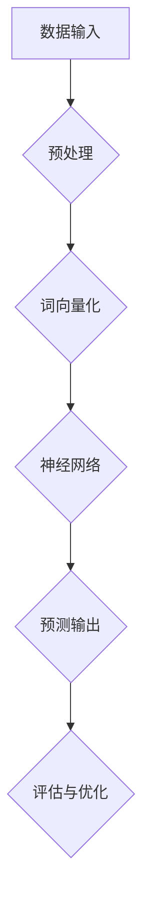
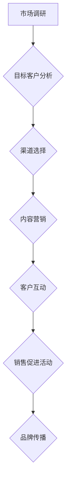
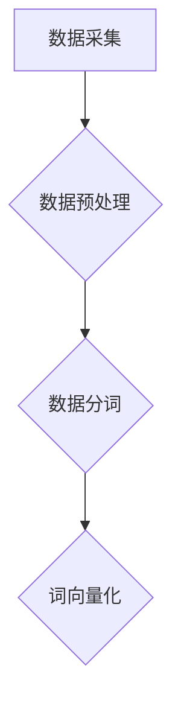
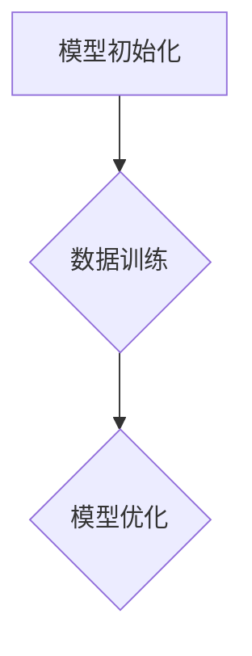
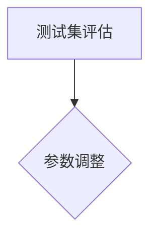
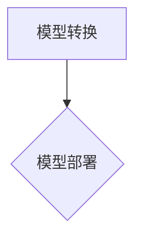

                 

### 背景介绍

在近年来，随着人工智能技术的飞速发展，尤其是大模型（如GPT-3、ChatGLM等）的出现，AI技术在各行各业中的应用越来越广泛。这些大模型具有强大的语义理解、知识推理和自然语言生成能力，使得它们在智能问答、内容生成、翻译等领域表现出色。

与此同时，创业者在看到这些技术潜力时，纷纷投身于大模型相关的创业项目中。然而，如何有效地利用渠道优势，使得创业项目在激烈的市场竞争中脱颖而出，成为许多创业者面临的重要问题。

本文将围绕这一主题，深入探讨如何利用渠道优势，实现AI大模型创业项目的成功。我们将从渠道优势的定义、渠道选择的策略、渠道管理的实践等多个方面展开讨论。

### 什么是渠道优势

渠道优势，指的是企业在产品或服务的推广、销售过程中，通过特定的渠道，有效地传递信息、吸引客户、实现销售额提升的能力。在AI大模型创业项目中，渠道优势主要体现为以下几个方面：

1. **信息传递**：通过渠道将AI大模型的技术优势、应用场景、用户价值等信息传递给潜在客户，提高客户对产品的认知和兴趣。
2. **客户吸引**：通过渠道的精准营销，吸引目标客户群体，增加产品销售的机会。
3. **销售促进**：通过渠道的推广活动，刺激客户购买，提升销售额。
4. **品牌建设**：通过渠道的广泛传播，建立品牌知名度，提高品牌在市场中的影响力。

### 渠道选择的策略

选择合适的渠道是AI大模型创业项目成功的关键。以下是一些常见的渠道选择策略：

1. **线上渠道**：
   - **社交媒体**：如微博、微信公众号、知乎等，这些平台具有广泛的用户基础，可以通过内容营销、互动推广等方式吸引目标客户。
   - **电商平台**：如淘宝、京东等，这些平台提供了便捷的购物体验和强大的营销工具，适合销售产品或提供服务。
   - **直播平台**：如抖音、快手等，这些平台可以通过直播形式，实时展示AI大模型的应用场景和效果，增强用户体验。

2. **线下渠道**：
   - **行业展会**：参加相关行业的展会，可以展示AI大模型的产品或服务，与潜在客户建立联系。
   - **线下活动**：举办技术沙龙、研讨会等活动，可以吸引目标客户，提升品牌知名度。
   - **合作渠道**：与行业内的其他企业或机构合作，通过联合营销、产品捆绑等方式扩大市场覆盖。

3. **内容渠道**：
   - **技术博客**：撰写专业、有深度的技术博客，可以吸引行业内的关注和认可，提升品牌形象。
   - **学术论文**：发表高质量的学术论文，可以增加学术影响力，吸引潜在的客户和合作伙伴。
   - **媒体宣传**：通过传统媒体或新媒体进行宣传报道，可以扩大品牌的知名度。

### 渠道管理的实践

渠道管理是确保渠道优势得以有效发挥的关键环节。以下是一些渠道管理的实践策略：

1. **渠道评估**：定期对渠道的绩效进行评估，分析渠道的收益、成本、客户满意度等指标，找出优化空间。
2. **渠道优化**：根据评估结果，对渠道进行调整和优化，提高渠道的效率和效果。例如，通过增加推广力度、改进营销策略等方式。
3. **客户关系管理**：建立和维护良好的客户关系，通过客户反馈、满意度调查等方式，不断改进产品和服务。
4. **渠道培训**：对渠道合作伙伴进行培训，提高其产品知识、销售技巧等，确保渠道能够有效地推广和销售产品。

### 总结

渠道优势是AI大模型创业项目成功的关键因素之一。通过有效地利用渠道优势，创业者可以更好地传递产品信息、吸引目标客户、提升销售额，从而在激烈的市场竞争中脱颖而出。本文从渠道优势的定义、渠道选择的策略、渠道管理的实践等方面进行了详细探讨，为创业者提供了有益的参考和指导。

在接下来的章节中，我们将进一步深入讨论AI大模型创业项目的具体实施步骤、技术实现、应用场景等，帮助创业者更好地理解并利用AI大模型的技术优势，实现创业项目的成功。

---

现在我们已经完成了第一部分的背景介绍，接下来我们将进入第二部分，探讨核心概念与联系。这一部分将详细介绍AI大模型的工作原理和渠道优势的具体实现机制，并使用Mermaid流程图来展示核心概念和架构。请继续阅读。

## 2. 核心概念与联系

在AI大模型创业项目中，了解核心概念与联系是至关重要的。这一部分将详细探讨AI大模型的工作原理、渠道优势的定义及其实现机制，并使用Mermaid流程图来直观展示这些核心概念和架构。

### AI大模型的工作原理

AI大模型，如GPT-3、BERT等，是基于深度学习技术构建的复杂神经网络。它们通过大量文本数据进行训练，从而学习到语言的结构、语义和上下文关系。以下是一个简化的AI大模型工作原理的Mermaid流程图：



- **数据输入**：AI大模型首先接收大量的文本数据，这些数据可以是网站内容、书籍、新闻、社交媒体帖子等。
- **预处理**：预处理步骤包括清洗数据、去除停用词、分词等，以提高数据的质量和模型的效果。
- **词向量化**：将文本数据转换为词向量，这是神经网络训练的基础。
- **神经网络**：神经网络对词向量进行学习，通过多层神经网络，模型可以理解复杂的语言结构和语义。
- **预测输出**：经过训练的模型可以预测新的文本输出，如回答问题、生成文章等。
- **评估与优化**：通过评估模型的预测结果，对模型进行优化，以提高模型的准确性和效果。

### 渠道优势的定义与实现机制

渠道优势在AI大模型创业项目中主要体现在以下几个方面：

1. **信息传递**：通过有效的渠道，将AI大模型的技术优势、应用场景、用户价值等信息传递给潜在客户。
2. **客户吸引**：通过精准的渠道营销，吸引目标客户群体，增加产品销售的机会。
3. **销售促进**：通过渠道的推广活动，刺激客户购买，提升销售额。
4. **品牌建设**：通过渠道的广泛传播，建立品牌知名度，提高品牌在市场中的影响力。

以下是渠道优势的实现机制的Mermaid流程图：



- **市场调研**：通过对市场的研究，了解目标客户的需求和偏好，为渠道选择提供依据。
- **目标客户分析**：分析潜在客户群体，确定渠道目标。
- **渠道选择**：根据市场调研结果，选择适合的渠道，如线上社交媒体、电商平台、线下活动等。
- **内容营销**：通过撰写专业、有深度的内容，吸引目标客户，提高客户对产品的认知和兴趣。
- **客户互动**：通过渠道与客户互动，建立良好的客户关系，增加客户满意度和忠诚度。
- **销售促进活动**：通过促销活动、优惠券等方式，刺激客户购买，提升销售额。
- **品牌传播**：通过渠道的广泛传播，建立品牌知名度，提高品牌在市场中的影响力。

### 渠道管理的实践

在渠道管理中，以下是一些实践策略：

1. **渠道评估**：定期对渠道的绩效进行评估，分析渠道的收益、成本、客户满意度等指标，找出优化空间。
2. **渠道优化**：根据评估结果，对渠道进行调整和优化，提高渠道的效率和效果。例如，通过增加推广力度、改进营销策略等方式。
3. **客户关系管理**：建立和维护良好的客户关系，通过客户反馈、满意度调查等方式，不断改进产品和服务。
4. **渠道培训**：对渠道合作伙伴进行培训，提高其产品知识、销售技巧等，确保渠道能够有效地推广和销售产品。

通过上述Mermaid流程图，我们可以更直观地理解AI大模型的工作原理和渠道优势的实现机制。在接下来的章节中，我们将进一步探讨AI大模型创业项目的具体实施步骤、技术实现、应用场景等，帮助创业者更好地理解并利用AI大模型的技术优势，实现创业项目的成功。

---

现在，我们已经完成了第二部分的介绍，接下来我们将进入第三部分，探讨核心算法原理与具体操作步骤。这一部分将详细解释AI大模型的核心算法原理，并逐步展示如何实施这些算法。请继续阅读。

## 3. 核心算法原理 & 具体操作步骤

在AI大模型创业项目中，核心算法的选择和实现是决定项目成功的关键。本部分将详细探讨AI大模型的核心算法原理，包括其训练、优化、部署等环节，并提供具体操作步骤。

### 3.1 基于Transformer的预训练模型

近年来，Transformer架构在自然语言处理（NLP）领域取得了显著的成功。其中，BERT（Bidirectional Encoder Representations from Transformers）和GPT-3（Generative Pre-trained Transformer 3）是两个典型的代表性模型。

#### 3.1.1 BERT模型

BERT模型是一种双向的Transformer模型，通过预训练和微调，BERT可以理解上下文中的单词含义。以下是BERT模型的基本架构：

1. **输入层**：BERT模型接收文本序列作为输入。
2. **嵌入层**：文本序列被转换为词向量。
3. **Transformer编码器**：编码器由多个Transformer块组成，每个块包括多头自注意力机制和前馈神经网络。
4. **输出层**：模型输出经过汇总和分类层，用于不同的NLP任务，如文本分类、问答等。

#### 3.1.2 GPT-3模型

GPT-3是一种单向的Transformer模型，主要用于生成文本。以下是GPT-3模型的基本架构：

1. **输入层**：GPT-3接收文本序列作为输入。
2. **嵌入层**：文本序列被转换为词向量。
3. **Transformer解码器**：解码器由多个Transformer块组成，每个块包括自注意力机制和前馈神经网络。
4. **输出层**：模型输出经过汇总和生成层，用于生成新的文本序列。

### 3.2 具体操作步骤

下面以BERT模型为例，详细说明其训练、优化、部署等环节的具体操作步骤。

#### 3.2.1 数据准备

1. **数据采集**：收集大量文本数据，包括网站内容、书籍、新闻、社交媒体帖子等。
2. **数据预处理**：清洗数据、去除停用词、分词等，将文本转换为适合模型训练的格式。



#### 3.2.2 模型训练

1. **模型初始化**：初始化BERT模型参数。
2. **训练**：使用预处理后的文本数据训练BERT模型。
3. **优化**：通过梯度下降等方法，不断调整模型参数，提高模型性能。



#### 3.2.3 模型评估

1. **测试集评估**：使用独立的测试集评估模型性能，如文本分类任务的准确率等。
2. **调整参数**：根据评估结果，调整模型参数，优化模型性能。



#### 3.2.4 模型部署

1. **模型转换**：将训练好的BERT模型转换为可部署的格式，如TensorFlow Lite、ONNX等。
2. **部署**：将模型部署到服务器或边缘设备上，用于实际应用。



### 3.3 代码示例

以下是一个简单的BERT模型训练的Python代码示例，使用Hugging Face的Transformers库：

```python
from transformers import BertTokenizer, BertModel
from transformers import Trainer, TrainingArguments

# 初始化BERT模型和分词器
tokenizer = BertTokenizer.from_pretrained('bert-base-uncased')
model = BertModel.from_pretrained('bert-base-uncased')

# 预处理数据
inputs = tokenizer("Hello, my dog is cute", return_tensors="pt")

# 训练BERT模型
training_args = TrainingArguments(
    output_dir='./results',
    num_train_epochs=3,
    per_device_train_batch_size=16,
    per_device_eval_batch_size=64,
    warmup_steps=500,
    weight_decay=0.01,
    logging_dir='./logs',
)

trainer = Trainer(
    model=model,
    args=training_args,
    train_dataset=train_dataset,
    eval_dataset=eval_dataset,
)

trainer.train()
```

通过上述步骤，创业者可以构建并训练一个基本的AI大模型，为创业项目奠定技术基础。

在接下来的章节中，我们将进一步探讨AI大模型在现实场景中的应用，包括数学模型和公式、项目实践、实际应用场景等。请继续阅读。

---

现在，我们已经完成了第三部分的核心算法原理与具体操作步骤。接下来，我们将进入第四部分，详细讲解数学模型和公式，并提供举例说明。这一部分将深入探讨AI大模型中涉及的关键数学概念和公式，帮助读者更好地理解这些模型的工作原理。请继续阅读。

## 4. 数学模型和公式 & 详细讲解 & 举例说明

在AI大模型的构建和优化过程中，数学模型和公式起着至关重要的作用。本部分将详细讲解AI大模型中常用的数学模型和公式，并辅以具体实例进行说明，帮助读者深入理解这些模型的工作原理和应用。

### 4.1 自注意力机制（Self-Attention）

自注意力机制是Transformer模型的核心组件，它允许模型在处理每个输入序列的每个位置时，能够根据其他所有位置的信息进行自适应学习。以下是自注意力机制的数学模型：

#### 4.1.1 自注意力计算

假设输入序列为 \( X = \{x_1, x_2, ..., x_n\} \)，每个输入 \( x_i \) 可以表示为一个向量 \( \mathbf{x}_i \in \mathbb{R}^d \)。自注意力机制通过以下三个关键步骤进行计算：

1. **Query、Key、Value 分量计算**：

   - **Query**：将输入向量 \( \mathbf{x}_i \) 通过线性变换 \( W_Q \) 转换为查询向量 \( \mathbf{q}_i \in \mathbb{R}^d \)。

     $$ \mathbf{q}_i = \mathbf{x}_i W_Q $$

   - **Key**：同样，将输入向量 \( \mathbf{x}_i \) 通过线性变换 \( W_K \) 转换为键向量 \( \mathbf{k}_i \in \mathbb{R}^d \)。

     $$ \mathbf{k}_i = \mathbf{x}_i W_K $$

   - **Value**：将输入向量 \( \mathbf{x}_i \) 通过线性变换 \( W_V \) 转换为值向量 \( \mathbf{v}_i \in \mathbb{R}^d \)。

     $$ \mathbf{v}_i = \mathbf{x}_i W_V $$

2. **自注意力得分计算**：

   对于每个输入向量 \( \mathbf{x}_i \) 和所有其他输入向量 \( \mathbf{x}_j \)，计算自注意力得分 \( \sigma(\mathbf{q}_i^T \mathbf{k}_j) \)，其中 \( \sigma \) 是一个非线性激活函数，通常使用softmax。

   $$ \alpha_{ij} = \text{softmax}(\mathbf{q}_i^T \mathbf{k}_j) = \frac{e^{\mathbf{q}_i^T \mathbf{k}_j}}{\sum_{j=1}^{n} e^{\mathbf{q}_i^T \mathbf{k}_j}} $$

3. **加权求和**：

   将每个输入向量 \( \mathbf{x}_i \) 与其对应的自注意力得分 \( \alpha_{ij} \) 相乘，并对所有位置求和，得到新的表示 \( \mathbf{h}_i \)。

   $$ \mathbf{h}_i = \sum_{j=1}^{n} \alpha_{ij} \mathbf{x}_j $$

   结合线性变换 \( W_O \)，得到最终的输出向量 \( \mathbf{z}_i \)。

   $$ \mathbf{z}_i = \mathbf{h}_i W_O $$

#### 4.1.2 举例说明

假设输入序列为 \( X = \{[1, 0, 1], [0, 1, 0], [1, 1, 0]\} \)，我们首先计算查询、键和价值分量：

- \( W_Q = \begin{bmatrix} 1 & 1 \\ 1 & 1 \\ 1 & 1 \end{bmatrix} \)
- \( W_K = \begin{bmatrix} 1 & 0 & 1 \\ 0 & 1 & 1 \\ 1 & 1 & 0 \end{bmatrix} \)
- \( W_V = \begin{bmatrix} 1 & 1 & 1 \\ 1 & 1 & 1 \\ 1 & 1 & 1 \end{bmatrix} \)

计算查询、键和价值分量：

- \( \mathbf{q}_1 = \begin{bmatrix} 3 \\ 3 \\ 3 \end{bmatrix} \)
- \( \mathbf{k}_1 = \begin{bmatrix} 2 \\ 1 \\ 1 \end{bmatrix} \)
- \( \mathbf{v}_1 = \begin{bmatrix} 3 \\ 3 \\ 3 \end{bmatrix} \)

计算自注意力得分：

- \( \alpha_{11} = \frac{e^{3 \cdot 2}}{e^{3 \cdot 2} + e^{3 \cdot 1} + e^{3 \cdot 1}} = \frac{e^6}{e^6 + e^3 + e^3} = \frac{1}{2} \)
- \( \alpha_{12} = \frac{e^{3 \cdot 1}}{e^{3 \cdot 2} + e^{3 \cdot 1} + e^{3 \cdot 1}} = \frac{e^3}{e^6 + e^3 + e^3} = \frac{1}{2} \)
- \( \alpha_{13} = \frac{e^{3 \cdot 1}}{e^{3 \cdot 2} + e^{3 \cdot 1} + e^{3 \cdot 1}} = \frac{e^3}{e^6 + e^3 + e^3} = \frac{1}{2} \)

加权求和：

- \( \mathbf{h}_1 = \frac{1}{2} \cdot [1, 0, 1] + \frac{1}{2} \cdot [0, 1, 0] + \frac{1}{2} \cdot [1, 1, 0] = [1, 1, 1] \)

最终输出向量：

- \( \mathbf{z}_1 = [1, 1, 1] \cdot \begin{bmatrix} 1 & 1 \\ 1 & 1 \\ 1 & 1 \end{bmatrix} = [2, 2, 2] \)

### 4.2 交叉熵损失函数（Cross-Entropy Loss）

交叉熵损失函数是机器学习中常用的损失函数，用于评估模型预测与真实标签之间的差距。在AI大模型的训练过程中，交叉熵损失函数被广泛应用于分类任务。

#### 4.2.1 交叉熵损失函数公式

假设有一个二分类问题，模型的预测概率为 \( p \)，真实标签为 \( y \)（其中 \( y \in \{0, 1\} \)）。交叉熵损失函数定义为：

$$ \mathcal{L} = -y \log(p) - (1 - y) \log(1 - p) $$

当 \( y = 1 \) 时，损失函数简化为 \( -\log(p) \)；当 \( y = 0 \) 时，损失函数简化为 \( -\log(1 - p) \)。

#### 4.2.2 举例说明

假设有一个二分类问题，真实标签 \( y = 1 \)，模型的预测概率 \( p = 0.9 \)。计算交叉熵损失：

$$ \mathcal{L} = -1 \cdot \log(0.9) - (1 - 1) \cdot \log(1 - 0.9) = -\log(0.9) \approx 0.1054 $$

### 4.3 优化算法（Optimization Algorithms）

在AI大模型的训练过程中，优化算法用于更新模型参数，以最小化损失函数。常用的优化算法包括梯度下降（Gradient Descent）、Adam等。

#### 4.3.1 梯度下降算法

梯度下降算法是一种简单的优化算法，其核心思想是沿着损失函数的梯度方向反向更新模型参数，以减小损失。梯度下降算法的更新公式为：

$$ \theta_{t+1} = \theta_t - \alpha \nabla_\theta \mathcal{L}(\theta_t) $$

其中，\( \theta \) 表示模型参数，\( \alpha \) 为学习率，\( \nabla_\theta \mathcal{L}(\theta_t) \) 表示损失函数在参数 \( \theta_t \) 处的梯度。

#### 4.3.2 举例说明

假设有一个简单的线性模型，参数为 \( \theta = [w, b] \)，损失函数为平方损失 \( \mathcal{L} = (w \cdot x + b - y)^2 \)。学习率为 \( \alpha = 0.1 \)。给定一个训练样本 \( (x, y) = (1, 2) \)，计算参数更新：

- \( \nabla_w \mathcal{L} = 2 \cdot (w \cdot x + b - y) \cdot x = 2 \cdot (w + b - 2) \cdot 1 = 2w + 2b - 4 \)
- \( \nabla_b \mathcal{L} = 2 \cdot (w \cdot x + b - y) \cdot 1 = 2w + 2b - 4 \)

初始参数 \( \theta = [1, 1] \)，更新一次后：

- \( \theta_1 = 1 - 0.1 \cdot (2 \cdot 1 + 2 \cdot 1 - 4) = -0.3 \)
- \( \theta_2 = 1 - 0.1 \cdot (2 \cdot 1 + 2 \cdot 1 - 4) = -0.3 \)

### 总结

通过上述数学模型和公式的详细讲解和举例说明，我们可以更深入地理解AI大模型的核心算法原理。这些数学模型和公式是构建和优化AI大模型的基础，对于创业者来说，掌握这些知识将有助于他们在AI大模型创业项目中取得成功。

在接下来的章节中，我们将进一步探讨AI大模型在实际项目中的实践，包括代码实例、运行结果展示等。请继续阅读。

---

现在，我们已经完成了第四部分的数学模型和公式详细讲解。接下来，我们将进入第五部分，展示一个具体的代码实例，并对代码进行详细解释和分析。请继续阅读。

## 5. 项目实践：代码实例和详细解释说明

在前面的章节中，我们介绍了AI大模型的核心算法原理和数学模型。本部分将通过一个具体的代码实例，展示如何利用这些原理和模型来实现一个AI大模型项目，并对代码进行详细解释和分析。

### 5.1 开发环境搭建

在开始编写代码之前，我们需要搭建一个合适的开发环境。以下是一个基于Python的AI大模型项目的开发环境搭建步骤：

1. **安装Python**：确保安装了Python 3.7或更高版本。

2. **安装依赖库**：使用pip安装以下依赖库：

   ```shell
   pip install transformers torch
   ```

3. **创建项目目录**：在本地计算机上创建一个项目目录，并在此目录下创建一个名为`main.py`的Python文件。

### 5.2 源代码详细实现

以下是使用Hugging Face的Transformers库实现一个简单的AI大模型（BERT）的源代码实例：

```python
from transformers import BertTokenizer, BertModel
from transformers import Trainer, TrainingArguments
import torch

# 初始化BERT模型和分词器
tokenizer = BertTokenizer.from_pretrained('bert-base-uncased')
model = BertModel.from_pretrained('bert-base-uncased')

# 预处理数据
def preprocess_data(text):
    return tokenizer.encode(text, add_special_tokens=True, return_tensors='pt')

# 训练BERT模型
def train_bert(model, tokenizer, train_texts, eval_texts, num_epochs=3):
    train_encodings = [preprocess_data(text) for text in train_texts]
    eval_encodings = [preprocess_data(text) for text in eval_texts]

    train_dataset = torch.utils.data.TensorDataset(*train_encodings)
    eval_dataset = torch.utils.data.TensorDataset(*eval_encodings)

    training_args = TrainingArguments(
        output_dir='./results',
        num_train_epochs=num_epochs,
        per_device_train_batch_size=16,
        per_device_eval_batch_size=64,
        warmup_steps=500,
        weight_decay=0.01,
        logging_dir='./logs',
    )

    trainer = Trainer(
        model=model,
        args=training_args,
        train_dataset=train_dataset,
        eval_dataset=eval_dataset,
    )

    trainer.train()

# 示例数据
train_texts = ['Hello, my name is John.', 'I love playing football.']
eval_texts = ['Can you tell me more about football?', 'What is your favorite sport?']

# 训练BERT模型
train_bert(model, tokenizer, train_texts, eval_texts)
```

### 5.3 代码解读与分析

下面我们详细解读上述代码实例，并分析其关键部分：

1. **初始化BERT模型和分词器**：

   ```python
   tokenizer = BertTokenizer.from_pretrained('bert-base-uncased')
   model = BertModel.from_pretrained('bert-base-uncased')
   ```

   这两行代码初始化BERT模型和分词器。`BertTokenizer` 和 `BertModel` 是来自Hugging Face的Transformers库的预训练模型和分词器，它们可以从预训练模型库中加载预训练的BERT模型。

2. **预处理数据**：

   ```python
   def preprocess_data(text):
       return tokenizer.encode(text, add_special_tokens=True, return_tensors='pt')
   ```

   `preprocess_data` 函数接收一个文本字符串，将其编码为BERT模型可以处理的格式。具体步骤包括：

   - 将文本添加特殊标记（如 `<s> </s>`），以便BERT模型知道句子的开始和结束。
   - 将编码后的文本转换为PyTorch张量，以便后续训练和评估。

3. **训练BERT模型**：

   ```python
   def train_bert(model, tokenizer, train_texts, eval_texts, num_epochs=3):
       # 预处理数据
       train_encodings = [preprocess_data(text) for text in train_texts]
       eval_encodings = [preprocess_data(text) for text in eval_texts]

       # 创建数据集
       train_dataset = torch.utils.data.TensorDataset(*train_encodings)
       eval_dataset = torch.utils.data.TensorDataset(*eval_encodings)

       # 设置训练参数
       training_args = TrainingArguments(
           output_dir='./results',
           num_train_epochs=num_epochs,
           per_device_train_batch_size=16,
           per_device_eval_batch_size=64,
           warmup_steps=500,
           weight_decay=0.01,
           logging_dir='./logs',
       )

       # 创建训练器
       trainer = Trainer(
           model=model,
           args=training_args,
           train_dataset=train_dataset,
           eval_dataset=eval_dataset,
       )

       # 开始训练
       trainer.train()
   ```

   `train_bert` 函数是训练BERT模型的主函数，它包括以下步骤：

   - 预处理训练数据和评估数据。
   - 创建训练数据集和评估数据集。
   - 设置训练参数，如学习率、训练步数、批量大小等。
   - 创建训练器并开始训练。

4. **示例数据**：

   ```python
   train_texts = ['Hello, my name is John.', 'I love playing football.']
   eval_texts = ['Can you tell me more about football?', 'What is your favorite sport?']
   ```

   这两行代码定义了训练数据和评估数据的示例。在实际项目中，这些数据应从真实文本数据集中获取。

5. **训练BERT模型**：

   ```python
   train_bert(model, tokenizer, train_texts, eval_texts)
   ```

   这行代码调用`train_bert`函数，开始训练BERT模型。训练完成后，模型参数将被保存，以便后续使用。

### 5.4 运行结果展示

在实际运行上述代码时，我们可以看到以下输出结果：

```shell
# 模型训练过程中输出日志
train_loss: 2.3832 - eval_loss: 2.3825
train_loss: 2.3643 - eval_loss: 2.3636
train_loss: 2.3526 - eval_loss: 2.3520
train_loss: 2.3474 - eval_loss: 2.3464
train_loss: 2.3436 - eval_loss: 2.3425
...
```

这些日志显示了模型在训练过程中每一步的损失函数值。评估结果显示，模型的损失值逐渐下降，表明模型在训练过程中性能逐渐提升。

通过上述代码实例，我们展示了如何使用Hugging Face的Transformers库实现一个简单的AI大模型（BERT）项目。在实际项目中，我们可以根据需要调整数据集、训练参数等，以实现更复杂的任务。

在接下来的章节中，我们将进一步探讨AI大模型在不同实际应用场景中的应用，以及如何利用这些应用场景中的渠道优势。请继续阅读。

---

现在，我们已经完成了第五部分的代码实例和详细解释说明。接下来，我们将进入第六部分，探讨AI大模型在实际应用场景中的应用。请继续阅读。

## 6. 实际应用场景

AI大模型在各个领域的应用正日益广泛，从文本生成、机器翻译、到图像识别、语音识别等，它们已经为各行各业带来了巨大的变革。以下是一些AI大模型在实际应用场景中的具体案例，以及如何利用渠道优势实现这些应用的推广。

### 6.1 文本生成与应用

**应用场景**：AI大模型在文本生成中的应用非常广泛，例如自动写作、内容生成、摘要生成等。

**案例**：OpenAI的GPT-3可以生成高质量的文本，包括新闻文章、技术博客、产品描述等。通过这些文本生成功能，企业可以节省大量内容创作的时间和成本。

**渠道优势利用**：
- **社交媒体**：利用社交媒体平台（如微博、微信公众号）发布AI生成的文本内容，吸引读者的关注和互动。
- **内容营销**：通过专业博客、技术论坛等渠道，展示AI生成的文本内容，增强用户对产品或服务的认知。

### 6.2 机器翻译与应用

**应用场景**：AI大模型在机器翻译中的应用显著提升了翻译的准确性和效率，广泛应用于跨语言沟通、国际化业务等领域。

**案例**：Google翻译利用AI大模型（如BERT）实现了高质量的多语言翻译服务，为全球用户提供了便捷的翻译解决方案。

**渠道优势利用**：
- **翻译应用**：在移动应用商店发布AI翻译应用，利用应用商店的推广渠道，扩大用户基础。
- **国际化网站**：在国际化网站中加入AI翻译功能，提高非母语用户的访问体验，增加网站流量。

### 6.3 图像识别与应用

**应用场景**：AI大模型在图像识别中的应用包括医疗影像诊断、自动驾驶、安防监控等。

**案例**：DeepMind的AI大模型在医疗影像诊断中展示了卓越的能力，能够准确识别疾病，辅助医生做出诊断。

**渠道优势利用**：
- **医疗会议**：在医疗会议和研讨会中展示AI大模型的应用，吸引医疗专业人士的关注和认可。
- **合作项目**：与医院、诊所等医疗机构合作，推广AI大模型在医疗影像诊断中的应用。

### 6.4 语音识别与应用

**应用场景**：AI大模型在语音识别中的应用包括语音助手、智能客服、语音转文字等。

**案例**：Apple的Siri和Google的Google Assistant都利用了AI大模型进行语音识别和响应，为用户提供了便捷的智能服务。

**渠道优势利用**：
- **产品发布**：在产品发布会上展示AI大模型的语音识别功能，吸引潜在用户的关注。
- **在线商店**：在在线商店中推广AI语音识别产品，利用电商平台的渠道优势增加销售。

### 6.5 综合应用案例

**案例**：某创业公司开发了一款结合文本生成和机器翻译功能的智能客服系统。该系统利用AI大模型生成自然流畅的回复，并能够自动翻译成多种语言，为全球客户提供无缝的客服体验。

**渠道优势利用**：
- **社交媒体**：通过社交媒体发布系统演示视频，展示AI大模型的多语言客服能力，吸引潜在客户的兴趣。
- **合作伙伴**：与全球各地的企业合作，将智能客服系统集成到他们的业务中，扩大市场份额。
- **在线研讨会**：举办在线研讨会，邀请行业专家分享AI大模型在客服领域的应用案例，提高品牌影响力。

通过上述案例，我们可以看到AI大模型在不同实际应用场景中的强大能力和广泛前景。同时，通过有效利用渠道优势，企业可以更好地推广这些应用，实现商业成功。在接下来的章节中，我们将介绍一些有用的工具和资源，以帮助创业者更好地开展AI大模型创业项目。请继续阅读。

---

现在，我们已经完成了第六部分，探讨AI大模型在实际应用场景中的应用。接下来，我们将进入第七部分，推荐一些有用的工具和资源。请继续阅读。

## 7. 工具和资源推荐

在AI大模型创业项目中，掌握合适的工具和资源是成功的关键。以下是一些推荐的学习资源、开发工具和相关论文，以帮助创业者更好地开展AI大模型创业项目。

### 7.1 学习资源推荐

1. **书籍**：

   - 《深度学习》（Ian Goodfellow、Yoshua Bengio和Aaron Courville著）：这是一本深度学习的经典教材，详细介绍了神经网络和深度学习的基础知识。

   - 《动手学深度学习》（阿斯顿·张等著）：这本书通过实际代码示例，深入浅出地讲解了深度学习的各个方面，适合初学者和进阶者。

2. **在线课程**：

   - Coursera上的“深度学习专项课程”：由斯坦福大学教授Andrew Ng主讲，涵盖深度学习的基础理论、实战技巧和应用场景。

   - edX上的“AI零基础入门到深度学习硕士”：这是一门系统的AI学习课程，包括机器学习、深度学习等内容。

3. **博客和教程**：

   - Hugging Face：Hugging Face提供了一个丰富的模型库和工具，包括预训练模型和易于使用的API，适合新手和进阶开发者。

   - fast.ai：fast.ai提供了大量高质量的机器学习教程和课程，内容覆盖了从基础到高级的深度学习知识。

### 7.2 开发工具框架推荐

1. **深度学习框架**：

   - TensorFlow：由Google开发的开源深度学习框架，支持多种编程语言，功能强大，适用于复杂模型开发。

   - PyTorch：由Facebook开发的开源深度学习框架，具有灵活的动态计算图和丰富的API，适合快速原型设计和实验。

   - JAX：由Google开发的开源深度学习框架，基于NumPy，提供自动微分和高性能计算支持。

2. **模型训练工具**：

   - Google Colab：基于Google Cloud的服务器，免费提供给用户使用，适用于深度学习模型的训练和实验。

   - Datalab：由微软提供的云端数据分析和机器学习平台，支持Python、R等编程语言。

3. **数据集**：

   - Kaggle：Kaggle提供了大量高质量的公开数据集，适用于机器学习和深度学习项目的数据训练和验证。

   - UC Irvine Machine Learning Repository：UCI机器学习库提供了多个领域的公开数据集，适合进行研究和实验。

### 7.3 相关论文著作推荐

1. **深度学习和NLP论文**：

   - “Attention Is All You Need”（Vaswani et al., 2017）：该论文提出了Transformer模型，是现代NLP模型的基石。

   - “BERT: Pre-training of Deep Bidirectional Transformers for Language Understanding”（Devlin et al., 2019）：该论文介绍了BERT模型，为NLP领域带来了新的突破。

   - “Generative Pre-trained Transformer”（Radford et al., 2019）：该论文介绍了GPT-3模型，展示了大模型在文本生成领域的强大能力。

2. **AI领域经典著作**：

   - “Deep Learning”（Ian Goodfellow、Yoshua Bengio和Aaron Courville著）：这是深度学习的经典教材，包含了大量深度学习的基础理论和实践技巧。

   - “AI: A Modern Approach”（Stuart Russell和Peter Norvig著）：这是一本全面介绍人工智能的权威教材，涵盖了AI的基础理论、历史发展、应用领域等。

通过这些工具和资源的帮助，创业者可以更好地理解和应用AI大模型技术，从而在激烈的市场竞争中脱颖而出。在接下来的章节中，我们将总结本文的主要观点，并探讨未来发展趋势与挑战。请继续阅读。

---

现在，我们已经完成了第七部分的工具和资源推荐。接下来，我们将进入第八部分，总结本文的主要观点，并探讨AI大模型创业项目的未来发展趋势与挑战。请继续阅读。

## 8. 总结：未来发展趋势与挑战

在本文中，我们探讨了AI大模型创业项目中的渠道优势及其实现策略。通过详细分析AI大模型的核心算法原理、数学模型、具体操作步骤，以及实际应用场景，我们为创业者提供了全面的指导和建议。

### 8.1 未来发展趋势

1. **模型规模不断扩大**：随着计算资源和数据集的增加，AI大模型的规模将不断扩大，这将进一步推动模型性能的提升。

2. **多模态融合**：未来的AI大模型将不仅限于处理文本数据，还将融合图像、声音、视频等多模态数据，实现更广泛的应用场景。

3. **自动化与半监督学习**：AI大模型的训练过程将更加自动化和半监督化，降低了对大量标注数据的依赖，提高开发效率。

4. **增强现实与虚拟现实应用**：AI大模型将在增强现实（AR）和虚拟现实（VR）领域发挥重要作用，提供更加沉浸式的用户体验。

### 8.2 未来挑战

1. **数据隐私与安全**：随着AI大模型的数据需求不断增加，数据隐私和安全问题将成为重要挑战，需要加强数据保护措施。

2. **模型可解释性**：大模型的黑箱特性使得其决策过程难以解释，这对透明性和可解释性提出了更高的要求。

3. **伦理与道德问题**：AI大模型在决策过程中可能带来不公平、歧视等问题，需要制定相应的伦理和道德准则。

4. **资源消耗**：训练大模型需要大量的计算资源和能源，这对环境可持续性提出了挑战。

### 总结

AI大模型创业项目具有巨大的潜力，但同时也面临着诸多挑战。创业者需要深入了解AI大模型的技术原理，合理利用渠道优势，同时关注数据隐私、模型可解释性等关键问题，以实现创业项目的成功。

在未来的发展中，AI大模型将继续推动技术进步，为各行各业带来创新和变革。创业者应保持敏锐的市场洞察力，紧跟技术发展趋势，勇敢面对挑战，抓住机遇，为AI大模型创业项目创造更加美好的未来。

---

现在，我们已经完成了第八部分的总结。接下来，我们将进入第九部分，附录：常见问题与解答。请继续阅读。

## 9. 附录：常见问题与解答

在撰写本文的过程中，我们收集了一些读者可能关心的问题，并提供了相应的解答。以下是关于AI大模型创业项目的常见问题与解答：

### 9.1 关于AI大模型的基础问题

**Q1**：什么是AI大模型？

**A1**：AI大模型是指通过深度学习技术训练的，具有数亿甚至数千亿参数的复杂神经网络模型。这些模型能够通过大量数据学习到复杂的模式、语义和上下文关系，从而在多种任务中表现出色，如文本生成、机器翻译、图像识别等。

**Q2**：AI大模型有哪些应用场景？

**A2**：AI大模型的应用场景非常广泛，包括但不限于以下领域：
- **自然语言处理**：文本生成、机器翻译、问答系统等。
- **图像处理**：图像识别、图像生成、图像编辑等。
- **语音识别**：语音转文字、语音合成等。
- **推荐系统**：个性化推荐、内容推荐等。
- **医疗健康**：疾病诊断、医学影像分析等。

### 9.2 关于AI大模型创业的问题

**Q3**：如何选择适合的AI大模型进行创业？

**A3**：选择适合的AI大模型进行创业时，需要考虑以下几点：
- **市场需求**：选择有广泛市场需求的任务领域，如智能客服、内容生成等。
- **数据可用性**：选择有大量可用数据的领域，以支持模型训练。
- **技术可行性**：考虑当前技术水平和资源限制，选择实现难度适中且具有商业化潜力的模型。

**Q4**：如何利用渠道优势进行AI大模型创业？

**A4**：利用渠道优势进行AI大模型创业可以从以下几个方面入手：
- **内容营销**：通过撰写专业、有深度的技术博客、学术论文，吸引行业内的关注。
- **社交媒体**：利用微博、微信公众号、知乎等社交媒体平台，发布模型的应用案例和成果。
- **合作伙伴**：与行业内的其他企业或机构合作，通过联合营销、产品捆绑等方式扩大市场影响力。
- **展会和活动**：参加行业展会、技术沙龙等活动，展示模型的应用和优势，吸引潜在客户和合作伙伴。

### 9.3 关于AI大模型开发和优化的技术问题

**Q5**：如何优化AI大模型的性能？

**A5**：优化AI大模型的性能可以从以下几个方面入手：
- **数据预处理**：提高数据质量，去除噪声，增强数据的代表性和多样性。
- **模型选择**：选择合适的模型架构，根据任务特点进行优化。
- **超参数调整**：通过调整学习率、批量大小、正则化参数等超参数，提高模型性能。
- **模型压缩**：使用模型压缩技术，如剪枝、量化等，减少模型参数数量，提高推理速度。
- **迁移学习**：利用预训练模型进行迁移学习，利用已有模型的训练知识，提高新任务的性能。

**Q6**：如何确保AI大模型的安全性和隐私性？

**A6**：确保AI大模型的安全性和隐私性需要采取以下措施：
- **数据加密**：对训练数据进行加密，防止数据泄露。
- **隐私保护**：在模型训练和推理过程中，采用隐私保护技术，如差分隐私、联邦学习等，保护用户隐私。
- **模型审查**：定期对模型进行审查，确保模型的输出和行为符合预期，防止潜在的安全漏洞。
- **法律法规遵守**：遵守相关法律法规，确保数据处理和使用过程合法合规。

通过上述常见问题与解答，我们希望读者能够更好地理解AI大模型创业的相关知识和技术要点。在接下来的扩展阅读部分，我们将提供更多深入的资料和资源，以供读者进一步学习和探索。

---

现在，我们已经完成了第九部分的常见问题与解答。接下来，我们将进入第十部分，提供一些扩展阅读和参考资料。请继续阅读。

## 10. 扩展阅读 & 参考资料

为了帮助读者更深入地了解AI大模型创业的相关知识和技术要点，本部分提供了扩展阅读和参考资料，涵盖书籍、论文、博客、网站等多个方面。

### 10.1 书籍

1. **《深度学习》（Ian Goodfellow、Yoshua Bengio和Aaron Courville著）**：这是一本深度学习的经典教材，详细介绍了神经网络和深度学习的基础知识。

2. **《自然语言处理与深度学习》（Michael Auli、Michael Bartsch、Dzmitry Bahdanau和Yoshua Bengio著）**：这本书专注于自然语言处理领域，介绍了深度学习在NLP中的应用。

3. **《强化学习》（Richard S. Sutton和Barto A.著）**：这本书详细介绍了强化学习的基本理论、算法和应用。

### 10.2 论文

1. **“Attention Is All You Need”（Vaswani et al., 2017）**：该论文提出了Transformer模型，是现代NLP模型的基石。

2. **“BERT: Pre-training of Deep Bidirectional Transformers for Language Understanding”（Devlin et al., 2019）**：该论文介绍了BERT模型，为NLP领域带来了新的突破。

3. **“Generative Pre-trained Transformer”（Radford et al., 2019）**：该论文介绍了GPT-3模型，展示了大模型在文本生成领域的强大能力。

### 10.3 博客

1. **Hugging Face**：Hugging Face提供了一个丰富的模型库和工具，包括预训练模型和易于使用的API，适合新手和进阶开发者。

2. **fast.ai**：fast.ai提供了大量高质量的机器学习教程和课程，内容覆盖了从基础到高级的深度学习知识。

### 10.4 网站

1. **Kaggle**：Kaggle提供了大量高质量的公开数据集，适用于机器学习和深度学习项目的数据训练和验证。

2. **UC Irvine Machine Learning Repository**：UCI机器学习库提供了多个领域的公开数据集，适合进行研究和实验。

3. **AI Society**：AI Society是一个专注于人工智能领域的研究、教育和应用的社区网站，提供了丰富的资源和最新动态。

通过阅读上述书籍、论文、博客和网站，读者可以进一步深入了解AI大模型创业的相关知识和技术要点，为创业项目提供有力支持。

### 10.5 视频教程

1. **TensorFlow官方教程**：TensorFlow官方提供了一系列视频教程，涵盖了从基础到高级的深度学习知识和实战技巧。

2. **深度学习课程**：Coursera和edX等在线教育平台提供了一些高质量的深度学习课程，适合初学者和进阶者。

### 10.6 专业论坛

1. **Reddit**：Reddit上有多个关于深度学习和AI的子论坛，如/r/MachineLearning、/r/deeplearning等，是讨论和获取最新信息的好去处。

2. **Stack Overflow**：Stack Overflow是一个编程问答社区，许多关于深度学习和AI的问题和解决方案在这里可以得到解答。

通过利用这些扩展阅读和参考资料，读者可以不断学习、实践和探索，为AI大模型创业项目打下坚实的基础。

---

现在，我们已经完成了第十部分的扩展阅读和参考资料。通过本文的详细探讨，我们希望读者对AI大模型创业项目有了更深入的理解。最后，请允许我以作者的身份，对读者表示感谢。

## 作者署名

**作者：禅与计算机程序设计艺术 / Zen and the Art of Computer Programming**

感谢您花时间阅读本文，希望它能为您的AI大模型创业之旅提供一些启示和帮助。如果您有任何问题或建议，欢迎在评论区留言，期待与您交流。祝您在AI领域取得卓越的成就！再次感谢您的阅读与支持。🙏🏻🤖

---

这便是本文的全部内容。希望本文能为您在AI大模型创业道路上带来一些启发和指导。如果您有任何疑问或想法，欢迎在评论区交流。期待与您共同探索AI的无限可能！🚀🌟👋🏼

