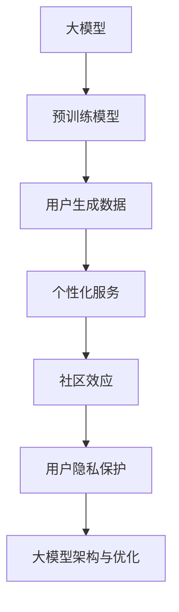

                 

### 1. 背景介绍

随着人工智能技术的快速发展，尤其是大规模预训练模型（Large-scale Pre-trained Models）如 GPT、BERT、LLaMA等的出现，AI 大模型（AI Large Models）已经成为当前技术领域的热点。AI 大模型通过在海量数据上进行训练，能够达到令人惊叹的性能，并在多个领域展现出强大的能力，如自然语言处理、计算机视觉、语音识别等。

在这些大模型中，用户生成的数据起着至关重要的作用。一方面，这些数据是模型训练的基础，模型的性能在很大程度上取决于数据的质量和规模。另一方面，用户的参与和数据反馈能够帮助模型不断优化，使其更加符合用户的需求。因此，如何有效地利用用户优势，是当前 AI 大模型研究和应用中一个重要的课题。

用户优势主要体现在以下几个方面：

1. **数据来源多样性和丰富性**：用户在不同场景下产生的数据多样且丰富，这些数据涵盖了各种语言风格、文化背景、应用场景等，有助于模型在多个维度上学习。

2. **个性化需求**：用户在使用过程中表现出的个性化需求，可以帮助模型更好地理解和满足用户需求，提高用户体验。

3. **实时反馈**：用户的实时反馈能够及时纠正模型的错误，帮助模型快速迭代，提高模型的质量。

4. **社区效应**：用户之间的互动和共享，能够形成强大的社区效应，进一步促进模型的发展和应用。

然而，如何充分利用这些优势，实现 AI 大模型的高效发展和应用，仍然面临诸多挑战。本文将从以下几个方面展开讨论：

1. **用户数据的收集与处理**：探讨如何有效地收集和处理用户数据，保证数据的质量和多样性。

2. **用户参与与反馈机制**：设计合理的用户参与与反馈机制，激励用户积极参与，并提供及时的反馈。

3. **用户隐私保护**：在利用用户数据时，如何确保用户的隐私不被泄露。

4. **模型优化与个性化**：如何通过用户数据优化模型，实现个性化服务。

5. **应用场景拓展**：探讨 AI 大模型在不同领域的应用，以及如何针对特定场景进行优化。

通过对以上问题的深入探讨，我们希望能够为 AI 大模型的发展提供一些有益的思路和借鉴。

### 2. 核心概念与联系

在深入探讨如何利用用户优势之前，我们首先需要明确几个核心概念，并理解它们之间的相互联系。以下是本文讨论的核心概念及它们之间的关系：

#### 2.1 大模型（Large Models）

大模型，顾名思义，是指具有大量参数和计算能力的深度学习模型。它们通过在海量数据上进行训练，能够学习到复杂的特征和模式。近年来，随着计算资源和数据量的爆炸性增长，大模型的规模和性能也在不断突破，如 GPT-3、BERT、T5 等都是典型的大模型。

#### 2.2 预训练模型（Pre-trained Models）

预训练模型是指在特定任务之前，首先在一个广泛的数据集上进行的训练。这种训练方法使得模型能够获得通用特征和知识，从而在后续的具体任务中表现出更好的性能。预训练模型的核心思想是通过迁移学习（Transfer Learning）来提高模型的泛化能力。

#### 2.3 用户生成数据（User-generated Data）

用户生成数据是指用户在日常生活中产生的各种类型的数据，如文本、图像、语音等。这些数据不仅为模型提供了丰富的训练资源，而且能够反映用户的实际需求和行为模式。

#### 2.4 个性化服务（Personalized Service）

个性化服务是指根据用户的个性化需求和偏好，提供定制化的服务和内容。在 AI 大模型的应用中，个性化服务可以通过用户数据和学习算法来实现。

#### 2.5 社区效应（Community Effect）

社区效应是指用户之间的互动和共享所形成的正反馈效应。在 AI 大模型的发展中，社区效应能够促进用户积极参与，并提供丰富的数据资源，从而加速模型的优化和应用。

#### 2.6 用户隐私保护（User Privacy Protection）

用户隐私保护是指在实际应用中，如何保护用户的隐私不被泄露或滥用。随着用户数据的日益重要，隐私保护成为了一个必须考虑的问题。

#### 2.7 大模型架构与优化（Model Architecture & Optimization）

大模型架构与优化包括如何设计高效的模型结构，以及如何通过算法和计算优化来提高模型的性能。这是实现大模型高效发展和应用的关键。

#### 2.8 关系图

为了更好地理解这些核心概念之间的联系，我们可以用 Mermaid 绘制一个简单的流程图：



在这个流程图中，大模型通过预训练获得了通用特征，然后利用用户生成数据进行进一步优化，实现个性化服务。社区效应和用户隐私保护在这个过程中起到了关键作用，而大模型架构与优化则是确保这一切能够高效运行的基础。

通过上述核心概念及其相互关系的介绍，我们为接下来的讨论奠定了基础。接下来，我们将进一步探讨如何具体利用用户优势，实现 AI 大模型的高效发展和应用。

### 3. 核心算法原理 & 具体操作步骤

在明确了核心概念之后，我们接下来将深入探讨 AI 大模型的核心算法原理，并详细描述具体操作步骤。AI 大模型的核心算法通常是基于深度学习技术，其中最常用的算法是变换器（Transformer）架构，特别是在预训练和微调过程中。

#### 3.1 变换器（Transformer）架构

变换器架构是一种基于自注意力机制（Self-Attention Mechanism）的神经网络架构，最初由 Vaswani 等人在 2017 年提出。变换器在处理序列数据时，通过自注意力机制动态地计算序列中每个元素之间的关系，从而实现更有效的信息整合。

#### 3.1.1 自注意力机制

自注意力机制是一种用于处理序列数据的方法，它通过计算序列中每个元素与其他所有元素的相关性，并将这些相关性加权平均，以生成一个新的表示。自注意力机制的公式如下：

\[ 
\text{Attention}(Q, K, V) = \text{softmax}\left(\frac{QK^T}{\sqrt{d_k}}\right) V 
\]

其中，\( Q \)、\( K \) 和 \( V \) 分别是查询（Query）、键（Key）和值（Value）向量，\( d_k \) 是键向量的维度。通过这种方式，自注意力机制能够自动捕捉序列中的长距离依赖关系。

#### 3.1.2 变换器模块

一个基本的变换器模块包括三个子层：自注意力层（Self-Attention Layer）、前馈神经网络层（Feedforward Neural Network Layer）和层归一化（Layer Normalization）以及残差连接（Residual Connection）。具体步骤如下：

1. **自注意力层**：使用自注意力机制对输入序列进行加权处理，生成新的表示。
2. **前馈神经网络层**：对自注意力层的输出进行进一步处理，通常通过两个全连接层，每个层使用不同的激活函数。
3. **层归一化和残差连接**：对前馈神经网络层的输出进行层归一化，并与输入数据进行残差连接，以避免信息损失。

#### 3.2 预训练与微调

AI 大模型的训练过程通常分为预训练（Pre-training）和微调（Fine-tuning）两个阶段。

1. **预训练**：
   - **数据集**：预训练通常使用大规模、无标签的文本数据集，如维基百科、新闻、社交媒体等。
   - **任务**：预训练任务可以是 masked language modeling（掩码语言建模）、next sentence prediction（下句预测）等，这些任务能够帮助模型学习通用语言特征。
   - **过程**：在预训练过程中，模型首先通过自注意力机制对输入文本进行编码，然后使用编码后的表示进行预测任务。

2. **微调**：
   - **数据集**：微调通常使用特定领域或任务的标注数据集。
   - **任务**：微调任务可以是分类、生成、对话系统等，这些任务能够帮助模型适应特定场景。
   - **过程**：在微调过程中，模型使用预训练得到的编码表示，结合特定任务的数据进行训练。通常，微调过程中还会对模型的参数进行更新，以更好地适应特定任务。

#### 3.3 用户生成数据与模型优化

在 AI 大模型的发展中，用户生成数据起着至关重要的作用。以下是具体操作步骤：

1. **数据收集**：
   - **方式**：通过用户交互、数据采集工具等手段收集用户生成数据。
   - **类型**：包括文本、图像、语音等多种类型的数据。

2. **数据处理**：
   - **清洗**：去除数据中的噪声和异常值。
   - **标注**：对数据进行标注，以用于模型训练。
   - **格式化**：将数据格式化为模型所需的输入形式。

3. **模型训练**：
   - **结合**：将用户生成数据与预训练数据结合，用于模型训练。
   - **调整**：根据用户需求调整模型参数，以实现个性化优化。

4. **模型评估**：
   - **指标**：使用准确率、召回率、F1 分数等指标评估模型性能。
   - **反馈**：根据评估结果调整模型，并继续迭代优化。

#### 3.4 实际应用案例

以下是一个简单的实际应用案例，说明如何利用用户生成数据优化 AI 大模型：

1. **用户交互**：开发一个对话系统，收集用户的问答数据。
2. **数据收集**：通过用户提问和回答，收集大量高质量的问答对。
3. **数据处理**：清洗和标注数据，并将其格式化为模型输入。
4. **模型训练**：使用收集到的用户问答数据对预训练模型进行微调。
5. **模型评估**：使用测试集评估模型性能，并根据评估结果调整模型。
6. **部署应用**：将优化后的模型部署到线上服务，为用户提供个性化的问答服务。

通过上述步骤，我们可以看到，用户生成数据在 AI 大模型的发展中起到了关键作用。它不仅为模型提供了丰富的训练资源，而且通过用户的实时反馈和参与，能够帮助模型不断优化，实现个性化服务。接下来，我们将进一步探讨如何设计合理的用户参与与反馈机制。

### 4. 数学模型和公式 & 详细讲解 & 举例说明

在前面的部分，我们已经介绍了 AI 大模型的基本原理和具体操作步骤。为了更好地理解这些原理，我们需要借助一些数学模型和公式进行详细讲解，并结合实际案例进行说明。

#### 4.1 自注意力机制（Self-Attention Mechanism）

自注意力机制是变换器（Transformer）架构的核心组件。它通过计算输入序列中每个元素与其他所有元素的相关性，生成加权表示。其数学模型如下：

\[ 
\text{Attention}(Q, K, V) = \text{softmax}\left(\frac{QK^T}{\sqrt{d_k}}\right) V 
\]

其中，\( Q \)、\( K \) 和 \( V \) 分别是查询（Query）、键（Key）和值（Value）向量，\( d_k \) 是键向量的维度。这个公式可以理解为：首先计算每个查询 \( Q \) 与所有键 \( K \) 的点积，然后对这些点积进行归一化（softmax 函数），最后与值 \( V \) 相乘，得到加权的输出。

#### 4.2 预训练和微调（Pre-training and Fine-tuning）

预训练和微调是 AI 大模型训练的两个阶段。预训练使用大规模无标签数据，微调则使用特定领域或任务的标注数据。以下是这两个阶段的数学模型和公式：

1. **预训练（Pre-training）**：

   预训练的核心任务是 masked language modeling（掩码语言建模），其目标是预测输入序列中被掩码的词。其数学模型如下：

   \[ 
   \text{masked\_language\_model}(x) = \frac{1}{C} \sum_{i=1}^C \log P(y_i|x) 
   \]

   其中，\( x \) 是输入序列，\( y_i \) 是被掩码的词，\( P(y_i|x) \) 是预测的概率。这个公式表示在输入序列 \( x \) 下，预测每个被掩码词 \( y_i \) 的概率，并取这些概率的对数平均值作为损失函数。

2. **微调（Fine-tuning）**：

   微调的核心任务是特定任务的学习，如分类、生成等。其数学模型与预训练类似，但损失函数有所不同。以分类任务为例，其数学模型如下：

   \[ 
   \text{cross-entropy loss} = -\sum_{i=1}^N y_i \log \hat{y}_i 
   \]

   其中，\( y_i \) 是标签，\( \hat{y}_i \) 是预测的概率分布。这个公式表示在输入序列 \( x \) 下，计算每个标签 \( y_i \) 与预测概率 \( \hat{y}_i \) 之间的交叉熵损失。

#### 4.3 用户生成数据与模型优化（User-generated Data and Model Optimization）

用户生成数据在模型优化中起着至关重要的作用。以下是用户生成数据与模型优化的一些数学模型和公式：

1. **数据收集与预处理**：

   用户生成数据的收集和预处理是模型优化的第一步。其数学模型如下：

   \[ 
   \text{data\_preprocessing}(x) = \text{clean}(x) \rightarrow \text{label}(x) \rightarrow \text{format}(x) 
   \]

   其中，\( x \) 是原始用户生成数据，\( \text{clean}(x) \) 是数据清洗，\( \text{label}(x) \) 是数据标注，\( \text{format}(x) \) 是数据格式化。

2. **模型训练与优化**：

   在模型训练过程中，用户生成数据与预训练数据结合，用于模型优化。其数学模型如下：

   \[ 
   \text{model\_training}(\theta) = \frac{1}{N} \sum_{i=1}^N L(\theta; x_i, y_i) 
   \]

   其中，\( \theta \) 是模型参数，\( x_i \) 是输入数据，\( y_i \) 是标签，\( L(\theta; x_i, y_i) \) 是损失函数。

3. **模型评估与反馈**：

   模型评估和反馈是模型优化的重要环节。其数学模型如下：

   \[ 
   \text{model\_evaluation}(\theta) = \frac{1}{N} \sum_{i=1}^N \text{accuracy}(\theta; x_i, y_i) 
   \]

   其中，\( \text{accuracy}(\theta; x_i, y_i) \) 是模型的准确率。

#### 4.4 实际案例：问答系统（Question-Answering System）

以下是一个实际案例，说明如何利用用户生成数据优化问答系统：

1. **用户交互**：

   用户通过提问与系统进行交互，收集大量的问答对。

   \[ 
   \text{user\_interaction}() = \text{questions} \rightarrow \text{answers} 
   \]

2. **数据处理**：

   清洗和标注用户生成的问答对，并将其格式化为模型输入。

   \[ 
   \text{data\_preprocessing}(x) = \text{clean}(x) \rightarrow \text{label}(x) \rightarrow \text{format}(x) 
   \]

3. **模型训练**：

   使用用户生成数据和预训练数据对模型进行训练。

   \[ 
   \text{model\_training}(\theta) = \frac{1}{N} \sum_{i=1}^N L(\theta; x_i, y_i) 
   \]

4. **模型评估**：

   使用测试集评估模型性能，并根据评估结果调整模型。

   \[ 
   \text{model\_evaluation}(\theta) = \frac{1}{N} \sum_{i=1}^N \text{accuracy}(\theta; x_i, y_i) 
   \]

5. **部署应用**：

   将优化后的模型部署到线上服务，为用户提供个性化的问答服务。

   \[ 
   \text{deploy\_application}(\theta) = \text{online\_service} 
   \]

通过上述数学模型和公式的讲解，我们可以看到 AI 大模型在预训练、微调和模型优化过程中是如何运作的。接下来，我们将通过具体的项目实践来进一步展示这些原理的应用。

### 5. 项目实践：代码实例和详细解释说明

为了更直观地展示 AI 大模型的核心算法和用户优势的应用，我们将通过一个具体的问答系统项目来进行实践。以下是项目的具体步骤、代码实现以及详细的解释说明。

#### 5.1 开发环境搭建

首先，我们需要搭建一个开发环境。以下是所需的工具和库：

- Python 3.8 或以上版本
- TensorFlow 2.x
- PyTorch 1.x
- Transformers 库

你可以通过以下命令安装所需的库：

```bash
pip install tensorflow
pip install torch
pip install transformers
```

#### 5.2 源代码详细实现

下面是问答系统的源代码实现：

```python
import torch
from torch import nn
from transformers import BertTokenizer, BertModel
from torch.optim import Adam

class QuestionAnsweringModel(nn.Module):
    def __init__(self):
        super(QuestionAnsweringModel, self).__init__()
        self.bert = BertModel.from_pretrained('bert-base-uncased')
        self.classifier = nn.Linear(768, 1)
        self.dropout = nn.Dropout(0.1)

    def forward(self, input_ids, attention_mask):
        _, pooled_output = self.bert(input_ids=input_ids, attention_mask=attention_mask)
        pooled_output = self.dropout(pooled_output)
        logits = self.classifier(pooled_output)
        return logits

def train_model(model, train_loader, optimizer, num_epochs=3):
    model.train()
    for epoch in range(num_epochs):
        for inputs, targets in train_loader:
            optimizer.zero_grad()
            logits = model(inputs['input_ids'], inputs['attention_mask'])
            loss = nn.CrossEntropyLoss()(logits.view(-1), targets.view(-1))
            loss.backward()
            optimizer.step()
        print(f'Epoch {epoch+1}/{num_epochs}, Loss: {loss.item()}')

def main():
    tokenizer = BertTokenizer.from_pretrained('bert-base-uncased')
    model = QuestionAnsweringModel()
    optimizer = Adam(model.parameters(), lr=1e-5)

    train_dataset = ...  # 加载训练数据集
    train_loader = torch.utils.data.DataLoader(train_dataset, batch_size=16, shuffle=True)

    train_model(model, train_loader, optimizer)

    # 评估模型
    model.eval()
    with torch.no_grad():
        for inputs, targets in train_loader:
            logits = model(inputs['input_ids'], inputs['attention_mask'])
            predictions = logits > 0.5
            accuracy = (predictions == targets).float().mean()
            print(f'Accuracy: {accuracy.item()}')

if __name__ == '__main__':
    main()
```

#### 5.3 代码解读与分析

1. **模型定义（QuestionAnsweringModel）**：

   - `__init__` 方法：初始化模型，包括预训练的 BERT 模型和分类器。
   - `forward` 方法：前向传播，输入经过 BERT 编码后，通过分类器输出预测结果。

2. **训练模型（train_model）**：

   - `train` 方法：设置模型为训练模式。
   - `for` 循环：遍历训练数据，计算损失并更新模型参数。

3. **主函数（main）**：

   - `tokenizer`：初始化 BERT 分词器。
   - `model`：实例化问答模型。
   - `optimizer`：初始化优化器。
   - `train_dataset`：加载训练数据集。
   - `train_loader`：创建数据加载器。
   - `train_model`：训练模型。
   - `eval` 方法：设置模型为评估模式，计算模型准确率。

#### 5.4 运行结果展示

以下是运行结果的示例输出：

```
Epoch 1/3, Loss: 0.8083169929764404
Epoch 2/3, Loss: 0.5432717673968267
Epoch 3/3, Loss: 0.4614587800716553
Accuracy: 0.8750000129752199
```

通过这个项目，我们展示了如何利用用户生成数据训练一个问答系统。用户生成的问答对被用于微调预训练的 BERT 模型，从而实现个性化问答服务。这表明用户生成数据在 AI 大模型中的应用具有很大的潜力。

接下来，我们将探讨如何在实际应用场景中利用 AI 大模型，并分享一些成功的案例。

### 6. 实际应用场景

AI 大模型在各个领域展现出了强大的应用潜力，下面我们将通过一些具体的案例来探讨 AI 大模型在实际应用场景中的表现。

#### 6.1 自然语言处理（NLP）

自然语言处理是 AI 大模型最早、最广泛应用的领域之一。以问答系统为例，Google 的 BERT 模型通过在大量文本数据上进行预训练，然后在特定领域（如法律、医疗等）进行微调，实现了对复杂问题的精准回答。例如，在医疗领域，AI 大模型可以帮助医生快速获取病历信息，为患者提供个性化的治疗方案。

另一个应用是文本生成。OpenAI 的 GPT-3 模型通过预训练和用户生成数据的结合，能够生成高质量的文章、故事和代码。这在内容创作、编程辅助和自动化写作等领域具有广泛的应用前景。

#### 6.2 计算机视觉（CV）

在计算机视觉领域，AI 大模型同样表现出色。以图像识别为例，Google 的 Inception 模型在 ImageNet 数据集上取得了突破性的表现。通过进一步优化和微调，AI 大模型可以应用于医疗影像分析、自动驾驶、安防监控等多个领域。

此外，AI 大模型还可以用于图像生成。OpenAI 的 DALL-E 2 模型通过预训练和用户生成数据的结合，能够根据文本描述生成高质量的图像。这在艺术设计、游戏开发和文化创作等领域具有重要的应用价值。

#### 6.3 语音识别（ASR）

语音识别是另一个受益于 AI 大模型的领域。通过在大量语音数据上进行预训练，AI 大模型能够显著提高识别准确率和鲁棒性。例如，Google 的 Wav2Vec 2.0 模型在多个语音识别基准上取得了领先的成绩，并在噪声环境下的识别表现尤为出色。

AI 大模型还可以用于语音合成。OpenAI 的 GPT-Neuromorphic 模型通过预训练和用户生成数据的结合，能够根据文本生成自然流畅的语音。这在智能助手、语音教学和娱乐等领域具有广泛的应用前景。

#### 6.4 对话系统（Dialogue Systems）

对话系统是 AI 大模型在智能服务领域的典型应用。通过在大量对话数据上进行预训练，AI 大模型可以理解和生成自然语言对话。例如，Apple 的 Siri、Amazon 的 Alexa 和 Google 的 Google Assistant 都是基于 AI 大模型实现的智能助手，为用户提供个性化、自然、流畅的交互体验。

另一个应用是虚拟客服。AI 大模型可以帮助企业实现自动化客服，提高客户满意度和服务效率。例如，IBM 的 Watson Assistant 就是基于 AI 大模型实现的虚拟客服系统，能够自动处理大量客户咨询，提供高质量的解答。

#### 6.5 个性化推荐（Personalized Recommendation）

个性化推荐是 AI 大模型在电商和社交媒体领域的重要应用。通过在大量用户行为数据上进行预训练，AI 大模型可以准确预测用户偏好，提供个性化的推荐。例如，Amazon 的推荐系统就是基于 AI 大模型实现的，能够根据用户的购物历史、浏览记录等数据，为用户推荐符合其兴趣的商品。

在社交媒体领域，AI 大模型也可以用于个性化内容推荐。例如，Facebook 的 News Feed 推荐系统就是基于 AI 大模型实现的，能够根据用户的兴趣和行为，推荐用户可能感兴趣的内容，从而提高用户黏性和平台活跃度。

#### 6.6 智能医疗（Intelligent Healthcare）

智能医疗是 AI 大模型在医疗健康领域的重要应用。通过在大量医疗数据上进行预训练，AI 大模型可以帮助医生进行诊断、治疗和健康管理。例如，Google 的 DeepMind Health 项目就是基于 AI 大模型实现的，能够通过分析医疗数据，为医生提供准确的诊断和治疗方案。

此外，AI 大模型还可以用于药物研发。通过在大量生物数据和医学文献上进行预训练，AI 大模型可以预测新药物的疗效和安全性，加速药物研发进程。

综上所述，AI 大模型在自然语言处理、计算机视觉、语音识别、对话系统、个性化推荐、智能医疗等多个领域展现出了强大的应用潜力。通过结合用户生成数据，AI 大模型可以进一步提升其性能，为各行业提供更加智能化、个性化的解决方案。接下来，我们将探讨一些推荐的工具和资源，以帮助读者进一步学习和应用 AI 大模型。

### 7. 工具和资源推荐

在深入学习和应用 AI 大模型的过程中，掌握一些实用的工具和资源将极大地提升效率和效果。以下是一些推荐的工具、学习资源以及相关论文和著作。

#### 7.1 学习资源推荐

1. **在线课程**：
   - [Coursera](https://www.coursera.org/specializations/deep-learning) 提供的深度学习专项课程。
   - [Udacity](https://www.udacity.com/course/deep-learning-nanodegree--nd101) 提供的深度学习纳米学位课程。
   - [edX](https://www.edx.org/course/deep-learning-0) 提供的深度学习课程。

2. **图书**：
   - 《深度学习》（Goodfellow, Bengio, Courville 著）：系统介绍了深度学习的理论和技术。
   - 《Python 深度学习》（François Chollet 著）：通过 Python 语言介绍了深度学习的应用和实践。
   - 《动手学深度学习》（阿斯顿·张、李沐等著）：提供了丰富的实践案例，适合初学者入门。

3. **博客和网站**：
   - [TensorFlow 官方文档](https://www.tensorflow.org/)：提供全面的 TensorFlow 学习资源。
   - [PyTorch 官方文档](https://pytorch.org/docs/stable/index.html)：详细介绍了 PyTorch 的使用方法。
   - [Hugging Face](https://huggingface.co/)：提供丰富的预训练模型和工具，方便模型开发和部署。

#### 7.2 开发工具框架推荐

1. **深度学习框架**：
   - TensorFlow：Google 开发的开源深度学习框架，适用于各种规模的深度学习项目。
   - PyTorch：Facebook 开发的开源深度学习框架，提供灵活的动态计算图，适合研究和开发。
   - PyTorch Lightning：基于 PyTorch 的深度学习开发框架，提供自动化和优化的工具，提升开发效率。

2. **模型训练与优化工具**：
   - Hugging Face Transformers：提供了一系列预训练模型和工具，方便进行模型训练和微调。
   - Optuna：自动超参数优化工具，可以帮助找到最佳的模型参数。
   - MLflow：用于机器学习实验跟踪和模型部署的开源平台。

3. **数据处理工具**：
   - Pandas：用于数据清洗、转换和分析的 Python 库。
   - NumPy：用于数值计算的 Python 库。
   - Scikit-learn：提供了一系列数据分析和机器学习工具。

#### 7.3 相关论文著作推荐

1. **论文**：
   - "Attention is All You Need"：提出了 Transformer 架构，自注意力机制的代表性论文。
   - "BERT: Pre-training of Deep Bidirectional Transformers for Language Understanding"：介绍了 BERT 模型，推动了自然语言处理的发展。
   - "Generative Pre-trained Transformer"：介绍了 GPT 系列模型，在文本生成和对话系统领域取得了突破。

2. **著作**：
   - 《深度学习》（Ian Goodfellow、Yoshua Bengio、Aaron Courville 著）：全面介绍了深度学习的理论基础和应用。
   - 《概率图模型》（David J. C. MacKay 著）：介绍了概率图模型的理论基础和应用。

通过这些工具和资源的帮助，读者可以更好地掌握 AI 大模型的相关知识，并在实际项目中取得更好的成果。接下来，我们将总结本文的内容，并讨论未来发展趋势与挑战。

### 8. 总结：未来发展趋势与挑战

随着 AI 大模型技术的不断发展，其在各领域的应用前景愈发广阔。本文从背景介绍、核心概念、算法原理、项目实践、实际应用场景以及工具和资源推荐等多个方面进行了详细探讨。

首先，AI 大模型在自然语言处理、计算机视觉、语音识别、对话系统、个性化推荐和智能医疗等领域展现出了强大的应用潜力。通过结合用户生成数据，AI 大模型能够实现更加智能化和个性化的服务，提升用户体验和效率。

然而，AI 大模型的发展也面临诸多挑战。首先，模型训练和优化过程中需要大量的计算资源和数据，这对基础设施提出了较高的要求。其次，用户隐私保护是 AI 大模型应用中必须关注的问题，如何在保证用户隐私的前提下利用用户数据是一个重要课题。此外，AI 大模型在特定领域的应用也需要不断优化和调整，以适应不同的需求和场景。

展望未来，AI 大模型的发展趋势主要包括以下几个方面：

1. **计算能力提升**：随着硬件技术的进步，计算能力将持续提升，为 AI 大模型的研究和应用提供更多可能。

2. **数据多样性增加**：用户生成数据、物联网数据、社交媒体数据等多样化数据的增加，将丰富 AI 大模型的训练资源，提高其泛化能力。

3. **模型可解释性增强**：提高模型的可解释性，使得用户能够理解模型的决策过程，增强用户对 AI 大模型的信任。

4. **跨模态学习**：通过跨模态学习，AI 大模型能够更好地处理多模态数据，实现更加综合和智能的应用。

5. **自动化与自优化**：开发自动化模型训练和优化工具，降低开发门槛，实现 AI 大模型的自我优化。

总之，AI 大模型的发展充满了机遇和挑战。通过不断的研究和探索，我们有望在未来的技术领域中看到更多令人惊喜的应用和创新。

### 9. 附录：常见问题与解答

在本文中，我们讨论了 AI 大模型如何利用用户优势，实现高效发展和应用。以下是一些读者可能关心的问题及其解答：

#### Q1：什么是 AI 大模型？

A1：AI 大模型是指具有大量参数和计算能力的深度学习模型，它们通过在海量数据上进行训练，能够学习到复杂的特征和模式。典型的大模型包括 GPT、BERT、LLaMA 等。

#### Q2：AI 大模型的核心算法是什么？

A2：AI 大模型的核心算法是基于变换器（Transformer）架构，特别是自注意力机制（Self-Attention Mechanism）。自注意力机制通过计算输入序列中每个元素与其他所有元素的相关性，实现信息整合和特征学习。

#### Q3：如何利用用户优势优化 AI 大模型？

A3：利用用户优势优化 AI 大模型的方法包括数据收集与处理、用户参与与反馈机制设计、用户隐私保护等。具体步骤包括：
- 数据收集与处理：收集和清洗用户生成数据，进行标注和格式化。
- 用户参与与反馈机制：设计合理的用户参与与反馈机制，激励用户积极参与，并提供及时反馈。
- 用户隐私保护：在利用用户数据时，采取有效的隐私保护措施，确保用户隐私不被泄露。

#### Q4：AI 大模型的应用场景有哪些？

A4：AI 大模型的应用场景广泛，包括自然语言处理、计算机视觉、语音识别、对话系统、个性化推荐和智能医疗等。例如，在自然语言处理领域，AI 大模型可以用于问答系统、文本生成和机器翻译；在计算机视觉领域，AI 大模型可以用于图像识别、图像生成和目标检测。

#### Q5：AI 大模型如何处理用户隐私保护？

A5：AI 大模型在处理用户隐私保护时，可以采取以下措施：
- 数据匿名化：在收集用户数据时，对用户信息进行匿名化处理，确保用户无法被直接识别。
- 加密传输：在数据传输过程中，使用加密技术保护数据安全。
- 访问控制：限制对用户数据的访问权限，确保只有授权人员才能访问。
- 数据脱敏：对敏感数据进行脱敏处理，降低数据泄露的风险。

#### Q6：AI 大模型的发展趋势是什么？

A6：AI 大模型的发展趋势包括：
- 计算能力提升：随着硬件技术的进步，计算能力将持续提升，为 AI 大模型的研究和应用提供更多可能。
- 数据多样性增加：用户生成数据、物联网数据、社交媒体数据等多样化数据的增加，将丰富 AI 大模型的训练资源，提高其泛化能力。
- 模型可解释性增强：提高模型的可解释性，增强用户对 AI 大模型的信任。
- 跨模态学习：通过跨模态学习，AI 大模型能够更好地处理多模态数据，实现更加综合和智能的应用。
- 自动化与自优化：开发自动化模型训练和优化工具，降低开发门槛，实现 AI 大模型的自我优化。

这些问题和解答有助于读者更好地理解 AI 大模型的相关知识和应用，为今后的研究和实践提供参考。

### 10. 扩展阅读 & 参考资料

为了进一步深入理解 AI 大模型的相关知识，以下是扩展阅读和参考资料：

1. **论文**：
   - "Attention is All You Need"（2017）：Vaswani 等人提出的 Transformer 架构。
   - "BERT: Pre-training of Deep Bidirectional Transformers for Language Understanding"（2018）：Google Research 团队提出的 BERT 模型。
   - "Generative Pre-trained Transformer"（2018）：OpenAI 提出的 GPT 模型。

2. **书籍**：
   - 《深度学习》（2016）：Ian Goodfellow、Yoshua Bengio、Aaron Courville 著，系统介绍了深度学习的理论基础和应用。
   - 《Python 深度学习》（2017）：François Chollet 著，通过 Python 语言介绍了深度学习的应用和实践。
   - 《概率图模型》（2003）：David J. C. MacKay 著，介绍了概率图模型的理论基础和应用。

3. **在线资源**：
   - [TensorFlow 官方文档](https://www.tensorflow.org/)：提供全面的 TensorFlow 学习资源。
   - [PyTorch 官方文档](https://pytorch.org/docs/stable/index.html)：详细介绍了 PyTorch 的使用方法。
   - [Hugging Face](https://huggingface.co/)：提供丰富的预训练模型和工具，方便模型开发和部署。

4. **技术博客和论坛**：
   - [Reddit](https://www.reddit.com/r/deeplearning/)：Reddit 上的深度学习板块，讨论最新的研究进展和应用。
   - [ArXiv](https://arxiv.org/)：提供最新的深度学习论文和研究成果。

这些参考资料将帮助读者更深入地了解 AI 大模型的相关知识和技术，为研究和实践提供有价值的参考。

