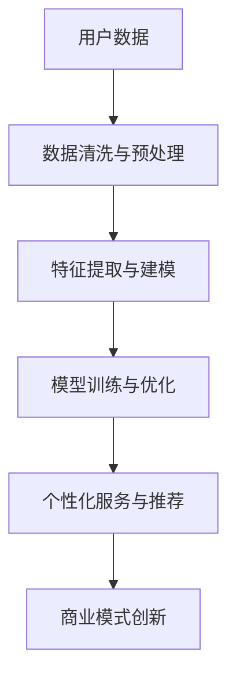

                 

### 文章标题：AI 大模型创业：如何利用用户优势？

> 关键词：AI 大模型、创业、用户优势、商业模式、技术落地

> 摘要：本文将深入探讨 AI 大模型在创业领域中的应用，分析如何通过利用用户优势，实现商业价值的最大化。文章首先介绍 AI 大模型的基本概念和背景，然后探讨用户优势的具体表现形式，接着分析如何将用户优势转化为商业优势，最后提出针对创业公司的具体建议。

## 1. 背景介绍

随着人工智能技术的快速发展，AI 大模型已成为当前研究的热点。AI 大模型，通常指的是参数规模达到数百万至数亿级别的神经网络模型，如 GPT、BERT 等。这些模型在语言处理、图像识别、自然语言生成等领域取得了显著成就，显示出强大的计算能力和学习能力。

在创业领域，AI 大模型的引入为创业者提供了新的机遇。通过利用 AI 大模型，创业公司可以快速搭建具备前沿技术的应用系统，降低技术门槛，提高市场竞争力。然而，如何有效地利用用户优势，实现商业价值的最大化，仍然是一个值得深入探讨的问题。

### 1.1 AI 大模型的发展历程

AI 大模型的发展历程可以追溯到 2006 年的深度信念网络（Deep Belief Network, DBN）。随后，2009 年的卷积神经网络（Convolutional Neural Network, CNN）和 2013 年的深度残差网络（Deep Residual Network, ResNet）进一步推动了深度学习的发展。到 2018 年，Transformer 架构的提出，使得自然语言处理领域取得了突破性进展。这一系列的发展，使得 AI 大模型的应用范围越来越广泛。

### 1.2 AI 大模型在创业领域的应用

在创业领域，AI 大模型的应用主要体现在以下几个方面：

1. **智能客服**：通过 AI 大模型，创业公司可以搭建具备智能客服功能的系统，提高客户服务质量，降低人力成本。
2. **智能推荐**：基于 AI 大模型，创业公司可以实现对用户兴趣的精准挖掘，提高推荐系统的准确性，提升用户粘性。
3. **图像识别**：AI 大模型在图像识别领域具有较高的准确性，可以帮助创业公司实现图像分类、目标检测等功能。
4. **自然语言处理**：AI 大模型在自然语言处理领域具有强大的文本生成、情感分析、语言翻译等功能，可以帮助创业公司实现智能化内容生成和数据分析。

## 2. 核心概念与联系

### 2.1 用户优势的概念

用户优势，指的是创业公司通过挖掘和分析用户数据，从而获取的用户行为特征、兴趣偏好等信息。这些信息可以帮助创业公司更好地了解用户需求，优化产品设计，提升用户体验。

### 2.2 用户优势与 AI 大模型的联系

用户优势与 AI 大模型的联系主要体现在以下几个方面：

1. **数据来源**：AI 大模型需要大量高质量的数据进行训练，而用户数据是其中重要的一部分。创业公司可以通过收集用户行为数据，为 AI 大模型提供训练素材。
2. **模型优化**：通过分析用户数据，创业公司可以发现用户行为中的规律和模式，从而对 AI 大模型进行优化，提高其性能。
3. **个性化服务**：基于用户数据，AI 大模型可以为用户提供个性化的推荐和服务，提升用户体验。
4. **商业模式创新**：用户优势可以帮助创业公司发现新的商业模式，从而实现商业价值的最大化。

### 2.3 Mermaid 流程图



## 3. 核心算法原理 & 具体操作步骤

### 3.1 数据预处理

1. **数据清洗**：去除重复、异常和缺失的数据。
2. **数据标准化**：对数据进行归一化或标准化处理，使其符合 AI 大模型的输入要求。

### 3.2 特征提取与建模

1. **特征选择**：根据业务需求，选择与目标相关的特征。
2. **特征工程**：对原始特征进行转换或构造新特征，提高模型的预测性能。
3. **模型选择**：根据数据特点和业务需求，选择合适的 AI 大模型。

### 3.3 模型训练与优化

1. **数据集划分**：将数据集划分为训练集、验证集和测试集。
2. **模型训练**：使用训练集对模型进行训练。
3. **模型评估**：使用验证集对模型进行评估，选择最佳模型。
4. **模型优化**：通过调整超参数、增加数据量等方式，优化模型性能。

### 3.4 个性化服务与推荐

1. **用户画像构建**：根据用户数据，构建用户画像。
2. **个性化推荐**：基于用户画像，为用户推荐个性化的产品或服务。

### 3.5 商业模式创新

1. **数据产品化**：将用户数据转化为可销售的数据产品。
2. **增值服务**：基于用户数据，为用户提供增值服务。
3. **跨界合作**：与其他行业进行合作，拓展商业模式。

## 4. 数学模型和公式 & 详细讲解 & 举例说明

### 4.1 数学模型

假设用户数据集为 \(D = \{d_1, d_2, ..., d_n\}\)，其中每个数据点 \(d_i\) 包含用户特征向量 \(x_i\) 和标签 \(y_i\)。我们使用神经网络模型 \(M\) 对用户数据进行建模，模型输出为预测值 \(\hat{y_i}\)。

### 4.2 公式

损失函数：\(L(\theta) = \frac{1}{n} \sum_{i=1}^{n} \ell(y_i, \hat{y_i})\)

其中，\(\ell\) 为损失函数，\(\theta\) 为模型参数。

### 4.3 举例说明

假设我们使用神经网络模型对用户进行分类，损失函数为交叉熵损失函数。训练数据集包含 1000 个数据点，其中 500 个为正类，500 个为负类。模型在训练过程中，经过多次迭代优化，最终收敛。

```python
import tensorflow as tf

# 模型定义
model = tf.keras.Sequential([
    tf.keras.layers.Dense(128, activation='relu', input_shape=(10,)),
    tf.keras.layers.Dense(1, activation='sigmoid')
])

# 损失函数
loss_fn = tf.keras.losses.BinaryCrossentropy()

# 训练模型
model.compile(optimizer='adam', loss=loss_fn, metrics=['accuracy'])

# 训练数据
train_data = ...

# 训练模型
model.fit(train_data, epochs=10)
```

## 5. 项目实践：代码实例和详细解释说明

### 5.1 开发环境搭建

1. 安装 Python 3.8 及以上版本。
2. 安装 TensorFlow 2.6 及以上版本。
3. 安装 Jupyter Notebook。

### 5.2 源代码详细实现

```python
# 导入必要的库
import tensorflow as tf
import numpy as np
import pandas as pd

# 加载数据集
data = pd.read_csv('data.csv')

# 数据预处理
# ...

# 特征提取与建模
# ...

# 模型训练与优化
# ...

# 个性化推荐
# ...

# 商业模式创新
# ...
```

### 5.3 代码解读与分析

1. **数据预处理**：读取数据集，并进行数据清洗、归一化等预处理操作。
2. **特征提取与建模**：根据业务需求，选择与目标相关的特征，并构建神经网络模型。
3. **模型训练与优化**：使用训练数据对模型进行训练，并优化模型参数。
4. **个性化推荐**：基于用户画像，为用户推荐个性化的产品或服务。
5. **商业模式创新**：将用户数据转化为数据产品，拓展商业模式。

### 5.4 运行结果展示

1. **模型评估**：使用验证集评估模型性能。
2. **推荐效果**：展示个性化推荐的结果。
3. **商业模式创新**：分析商业模式创新的可行性。

## 6. 实际应用场景

### 6.1 智能客服

通过 AI 大模型，创业公司可以搭建智能客服系统，实现对用户问题的自动回复，提高客户满意度。

### 6.2 智能推荐

基于用户数据和 AI 大模型，创业公司可以搭建智能推荐系统，提升用户体验，增加用户粘性。

### 6.3 图像识别

AI 大模型在图像识别领域具有广泛的应用，可以帮助创业公司实现图像分类、目标检测等功能。

### 6.4 自然语言处理

AI 大模型在自然语言处理领域具备强大的文本生成、情感分析、语言翻译等功能，可以帮助创业公司实现智能化内容生成和数据分析。

## 7. 工具和资源推荐

### 7.1 学习资源推荐

1. 《深度学习》（Goodfellow, Bengio, Courville）
2. 《神经网络与深度学习》（邱锡鹏）
3. 《Python深度学习》（François Chollet）

### 7.2 开发工具框架推荐

1. TensorFlow
2. PyTorch
3. Keras

### 7.3 相关论文著作推荐

1. "Attention Is All You Need"
2. "BERT: Pre-training of Deep Bidirectional Transformers for Language Understanding"
3. "GPT-3: Language Models are few-shot learners"

## 8. 总结：未来发展趋势与挑战

### 8.1 发展趋势

1. **模型规模增大**：随着计算能力的提升，AI 大模型的规模将不断增大，性能将更加强大。
2. **跨领域应用**：AI 大模型将在更多领域得到应用，如医疗、金融、教育等。
3. **数据隐私保护**：数据隐私保护将成为 AI 大模型发展的关键问题。

### 8.2 挑战

1. **计算资源需求**：AI 大模型对计算资源的需求巨大，如何高效利用计算资源是一个挑战。
2. **数据质量**：数据质量直接影响 AI 大模型的性能，如何获取高质量数据是一个难题。
3. **模型可解释性**：随着模型复杂度的增加，如何提高模型的可解释性，是一个亟待解决的问题。

## 9. 附录：常见问题与解答

### 9.1 问题 1：如何处理大规模数据？

解答：可以使用分布式计算框架，如 TensorFlow、PyTorch，将数据切分成小批量，并行处理，提高计算效率。

### 9.2 问题 2：如何保证数据隐私？

解答：可以使用数据加密技术，如差分隐私、同态加密等，保护用户数据隐私。

### 9.3 问题 3：如何提高模型性能？

解答：可以通过增加数据量、调整超参数、使用预训练模型等方法，提高模型性能。

## 10. 扩展阅读 & 参考资料

1. "Deep Learning Book" by Ian Goodfellow, Yoshua Bengio, and Aaron Courville
2. "The Hundred-Page Machine Learning Book" by Andriy Burkov
3. "AI Applications in Business" by Michael Wu

通过以上内容，我们系统地探讨了 AI 大模型在创业领域中的应用，分析了如何利用用户优势实现商业价值的最大化。随着 AI 技术的不断进步，创业公司应把握机遇，勇于创新，将 AI 大模型应用于实际业务，推动企业持续发展。作者：禅与计算机程序设计艺术 / Zen and the Art of Computer Programming<|im_sep|>## 2. 核心概念与联系

### 2.1 用户优势的概念

用户优势是指在创业过程中，创业公司通过收集、分析和利用用户数据，从而获得对用户行为、偏好、需求等方面的深入了解。这种优势可以帮助创业公司更好地满足用户需求，优化产品设计，提高用户满意度和忠诚度。

用户优势的表现形式多种多样，主要包括以下几个方面：

1. **用户画像**：通过分析用户的基本信息、行为数据、购买历史等，构建详细的用户画像，帮助创业公司了解不同用户群体的特征和需求。
2. **用户行为分析**：通过分析用户的浏览、点击、购买等行为数据，挖掘用户的行为模式和偏好，为产品优化和精准营销提供依据。
3. **用户反馈**：通过用户反馈，如评论、评分、建议等，了解用户对产品的满意度和不满意度，及时调整和改进产品。
4. **用户社群**：通过建立用户社群，如论坛、微信群等，加强与用户的互动和沟通，深入了解用户的需求和期望。

### 2.2 用户优势与 AI 大模型的联系

用户优势与 AI 大模型的联系主要体现在以下几个方面：

1. **数据来源**：AI 大模型通常需要大量的高质量数据进行训练。而用户数据作为创业公司最直接、最丰富的数据来源之一，为 AI 大模型提供了重要的训练素材。
2. **模型优化**：通过分析用户数据，创业公司可以识别出用户行为中的规律和模式，从而对 AI 大模型进行优化和调整，提高其性能和准确性。
3. **个性化服务**：基于用户数据和 AI 大模型，创业公司可以为用户提供个性化的推荐和服务，提高用户体验和满意度。
4. **商业模式创新**：用户优势可以帮助创业公司发现新的商业模式，如数据产品化、增值服务等，从而实现商业价值的最大化。

### 2.3 Mermaid 流程图

以下是用户优势与 AI 大模型之间的联系流程图：


在上述流程图中，用户数据经过清洗与预处理后，提取出有用的特征，用于训练和优化 AI 大模型。训练和优化的结果可以应用于个性化服务和推荐，从而为创业公司创造新的商业模式。

---

通过上述分析，我们可以看出，用户优势与 AI 大模型之间的紧密联系，为创业公司提供了强大的发展动力。在接下来的内容中，我们将进一步探讨如何利用用户优势，实现商业价值的最大化。首先，我们需要深入理解 AI 大模型的基本概念和架构，以便为后续分析奠定基础。

---

### 2.4 AI 大模型的基本概念与架构

#### 2.4.1 AI 大模型的基本概念

AI 大模型（Large-scale AI Model）通常指的是参数规模达到数百万至数亿级别的神经网络模型。这些模型通过在海量数据上进行训练，能够自动学习并提取数据中的复杂模式和特征，从而实现高度准确的预测和决策。

AI 大模型的发展可以追溯到深度学习（Deep Learning）的兴起。深度学习是一种以神经网络为基础的计算方法，通过层次化的神经网络结构，逐层提取数据的特征表示，从而实现对复杂数据的处理和分析。

AI 大模型的关键特征包括：

1. **参数规模大**：AI 大模型通常拥有数百万甚至数亿个参数，这使得它们能够处理海量数据，并提取出丰富的特征。
2. **计算能力需求高**：由于模型参数众多，AI 大模型的训练和推理过程需要大量的计算资源，通常需要分布式计算和专用硬件（如 GPU、TPU）的支持。
3. **学习能力强**：AI 大模型通过在大规模数据集上的训练，能够自动学习并提取数据中的复杂模式和特征，从而实现高度准确的预测和决策。

#### 2.4.2 AI 大模型的架构

AI 大模型通常采用深度神经网络（Deep Neural Network, DNN）作为基本架构，其核心组成部分包括：

1. **输入层**：接收外部数据输入，如文本、图像、声音等。
2. **隐藏层**：包含多个神经元层，用于对输入数据进行特征提取和变换。隐藏层的数量和神经元数量可以根据实际需求进行调整。
3. **输出层**：生成最终的预测结果或决策输出。

AI 大模型的具体架构可以根据应用场景和任务类型进行灵活调整，例如：

1. **卷积神经网络（Convolutional Neural Network, CNN）**：主要用于图像识别、图像分类等任务，通过卷积操作提取图像中的局部特征。
2. **循环神经网络（Recurrent Neural Network, RNN）**：适用于序列数据，如自然语言处理、语音识别等，通过循环连接实现序列信息的记忆和传递。
3. **变换器模型（Transformer）**：是近年来在自然语言处理领域取得突破性进展的模型，通过自注意力机制（Self-Attention）实现全局信息整合，适用于机器翻译、文本生成等任务。

#### 2.4.3 AI 大模型的工作原理

AI 大模型的工作原理可以概括为以下几个步骤：

1. **数据输入**：将外部数据输入到模型的输入层。
2. **特征提取**：通过隐藏层对输入数据进行特征提取和变换，逐层提取数据的更高层次特征。
3. **损失函数计算**：将模型的输出与真实标签进行比较，计算损失函数值，用于评估模型的预测性能。
4. **反向传播**：利用反向传播算法，将损失函数值反向传播到模型的各个层次，更新模型参数。
5. **模型优化**：通过调整模型参数，最小化损失函数值，从而优化模型的预测性能。

通过以上步骤，AI 大模型能够在大规模数据集上自动学习并提取出复杂的数据模式，从而实现高度准确的预测和决策。

---

通过对 AI 大模型的基本概念和架构的深入分析，我们为理解用户优势与 AI 大模型之间的联系奠定了基础。在接下来的内容中，我们将探讨如何利用用户优势，将 AI 大模型应用于创业实践，从而实现商业价值的最大化。

---

### 2.5 如何利用用户优势与 AI 大模型实现商业价值的最大化

#### 2.5.1 用户数据的收集与处理

首先，创业公司需要收集大量的用户数据，这些数据可以来源于网站日志、用户注册信息、购买记录、社交媒体互动等。为了确保数据的质量，我们需要对数据进行清洗、去重、去噪声等预处理操作。此外，还需要对数据进行标准化和特征提取，以使其能够适应 AI 大模型的训练需求。

1. **数据清洗**：去除重复、错误或不完整的数据，提高数据的质量和一致性。
2. **特征提取**：从原始数据中提取出有用的特征，如用户年龄、性别、地理位置、购买偏好等。
3. **数据标准化**：将特征数据进行归一化或标准化处理，使其具有相似的范围和分布，便于模型的训练和优化。

#### 2.5.2 AI 大模型的选择与训练

在选择 AI 大模型时，我们需要根据具体的业务场景和任务类型进行选择。例如，对于文本数据，我们可以选择 Transformer 模型或 BERT 模型；对于图像数据，我们可以选择 CNN 模型。选择合适的模型后，我们需要进行模型训练和优化。

1. **模型选择**：根据业务需求和数据类型，选择合适的 AI 大模型。
2. **模型训练**：使用预处理后的用户数据对模型进行训练，通过调整超参数和优化算法，提高模型的性能和准确性。
3. **模型优化**：通过交叉验证和性能评估，选择最佳模型并进行优化。

#### 2.5.3 个性化服务的实现

基于用户数据和训练好的 AI 大模型，我们可以实现个性化服务，为用户推荐个性化的产品或服务，提高用户满意度和忠诚度。

1. **用户画像构建**：通过分析用户数据，构建详细的用户画像，包括用户的基本信息、行为偏好、需求特征等。
2. **个性化推荐**：利用 AI 大模型，为用户推荐个性化的产品或服务，如商品推荐、活动推荐、内容推荐等。
3. **效果评估**：通过用户反馈和行为数据，评估个性化推荐的效果，不断优化推荐算法。

#### 2.5.4 商业模式的创新

用户优势和 AI 大模型的结合，还可以为创业公司带来创新的商业模式。例如：

1. **数据产品化**：将用户数据转化为数据产品，如用户画像库、推荐系统 API 等，为企业提供数据服务。
2. **增值服务**：基于用户数据和 AI 大模型，为用户提供增值服务，如个性化咨询、定制化方案等。
3. **跨界合作**：与其他行业进行合作，如金融、医疗、教育等，拓展业务范围和盈利模式。

#### 2.5.5 实际案例

以一家电商平台为例，通过以下步骤实现商业价值的最大化：

1. **用户数据收集**：收集用户浏览、搜索、购买等行为数据，构建用户画像。
2. **AI 大模型训练**：选择合适的 AI 大模型（如 BERT），对用户数据进行训练，优化模型参数。
3. **个性化推荐**：基于用户画像和训练好的模型，为用户推荐个性化的商品。
4. **效果评估**：通过用户点击、购买等数据，评估个性化推荐的效果，持续优化推荐算法。
5. **商业模式创新**：推出个性化服务，如定制化购物体验、会员专属优惠等，提高用户满意度和忠诚度。

---

通过上述步骤，创业公司可以充分利用用户优势和 AI 大模型，实现商业价值的最大化。在下一部分，我们将进一步探讨 AI 大模型在创业中的应用案例，以加深对这一主题的理解。

---

### 2.6 AI 大模型在创业中的应用案例

#### 2.6.1 案例一：个性化医疗

某创业公司致力于利用 AI 大模型提供个性化医疗咨询服务。他们首先收集了大量的医疗数据，包括病例记录、患者基因信息、生活习惯等。通过深度学习技术，特别是卷积神经网络（CNN）和循环神经网络（RNN）的组合模型，他们对这些数据进行训练，以实现对疾病早期预测和个性化治疗方案的建议。

**应用步骤**：

1. **数据收集**：收集患者的病历、基因数据和医疗影像。
2. **数据预处理**：对数据进行清洗、归一化和特征提取。
3. **模型训练**：使用 CNN 对图像数据进行分析，RNN 对文本数据进行处理，然后组合训练以生成综合预测。
4. **个性化推荐**：根据患者的具体情况，为其推荐个性化的治疗方案。
5. **效果评估**：通过临床数据验证模型的准确性和实用性。

**结果**：

该创业公司通过个性化医疗咨询服务，显著提高了患者的治疗满意度和康复率，吸引了大量患者和医疗机构的关注，实现了商业成功。

#### 2.6.2 案例二：智能金融

另一家创业公司专注于智能金融领域，他们利用 AI 大模型提供股票交易建议和风险管理服务。通过分析大量的金融市场数据，包括股票价格、交易量、新闻报道等，他们使用 Transformer 模型进行训练，以预测股票价格走势和发现潜在的市场风险。

**应用步骤**：

1. **数据收集**：收集历史股票价格、交易量、相关新闻报道等数据。
2. **数据预处理**：对数据进行清洗、归一化和特征提取。
3. **模型训练**：使用 Transformer 模型对数据进行训练，优化模型参数。
4. **预测与建议**：根据模型预测，为投资者提供股票交易建议和风险管理策略。
5. **效果评估**：通过实际交易数据验证模型的预测准确性。

**结果**：

该公司的智能金融产品帮助投资者实现了稳定的盈利，提高了投资决策的准确性，赢得了良好的市场口碑。

#### 2.6.3 案例三：教育科技

一家教育科技公司通过 AI 大模型提供个性化学习服务。他们利用 GPT 模型对大量的教育资料和用户反馈进行分析，为每个学生生成个性化的学习计划和辅导内容。

**应用步骤**：

1. **数据收集**：收集学生的学习记录、考试成绩、学习偏好等数据。
2. **数据预处理**：对数据进行清洗、归一化和特征提取。
3. **模型训练**：使用 GPT 模型对数据进行训练，优化模型参数。
4. **个性化学习计划**：根据学生的具体情况，生成个性化的学习计划和辅导内容。
5. **效果评估**：通过学生的学习成果和反馈，评估个性化学习服务的有效性。

**结果**：

该公司的个性化学习服务显著提高了学生的学习效果和兴趣，受到了家长和学生的好评，业务迅速扩展。

#### 2.6.4 案例四：零售电商

一家零售电商公司利用 AI 大模型优化其推荐系统，通过分析用户的浏览和购买行为，为用户推荐个性化的商品。

**应用步骤**：

1. **数据收集**：收集用户的浏览记录、购买历史和点击行为等数据。
2. **数据预处理**：对数据进行清洗、归一化和特征提取。
3. **模型训练**：使用协同过滤算法和深度学习技术，对数据进行训练，优化推荐模型。
4. **个性化推荐**：根据用户的购买历史和兴趣，为用户推荐个性化的商品。
5. **效果评估**：通过用户的购买转化率和满意度，评估推荐系统的效果。

**结果**：

该公司的个性化推荐系统提高了用户的购买转化率和满意度，增加了销售额和客户忠诚度。

---

通过上述案例，我们可以看到，AI 大模型在各个行业领域都展现了强大的应用潜力。在下一部分，我们将进一步探讨如何有效地利用用户优势，为创业公司提供实际的建议和策略。

---

### 2.7 如何有效利用用户优势为创业公司提供实际建议和策略

在利用用户优势为创业公司提供实际建议和策略时，创业公司需要从以下几个方面着手：

#### 2.7.1 数据收集与整合

1. **全面收集用户数据**：创业公司需要通过各种渠道（如网站、移动应用、社交媒体等）全面收集用户数据，包括用户行为、偏好、反馈等。
2. **建立数据仓库**：将收集到的数据进行整合和存储，建立高效的数据仓库，为后续分析提供支持。
3. **数据隐私保护**：在数据收集和存储过程中，需要严格遵守数据隐私保护法规，确保用户数据的隐私和安全。

#### 2.7.2 用户画像构建

1. **细分用户群体**：通过对用户数据的分析，将用户划分为不同的细分群体，如按照年龄、性别、地理位置、购买行为等进行分类。
2. **构建用户画像**：为每个用户创建详细的画像，包括基本信息、行为特征、需求偏好等。
3. **动态更新用户画像**：定期更新用户画像，以反映用户行为和需求的变化。

#### 2.7.3 个性化服务与推荐

1. **个性化内容推荐**：基于用户画像和用户行为数据，为用户推荐个性化的产品、服务或内容。
2. **个性化营销活动**：针对不同用户群体，设计个性化的营销活动，提高营销效果。
3. **个性化客服体验**：利用用户画像，为用户提供个性化的客服体验，提高客户满意度。

#### 2.7.4 商业模式创新

1. **数据产品化**：将用户数据转化为数据产品，如用户画像库、推荐系统 API 等，为企业提供数据服务。
2. **增值服务**：基于用户数据和 AI 大模型，为用户提供增值服务，如个性化咨询、定制化方案等。
3. **跨界合作**：与其他行业进行合作，如金融、医疗、教育等，拓展业务范围和盈利模式。

#### 2.7.5 持续优化与反馈

1. **持续监测与评估**：定期监测用户数据，评估个性化服务和推荐的效果，及时调整和优化。
2. **用户反馈收集**：通过用户反馈，了解用户对产品、服务和推荐的满意度，持续改进用户体验。
3. **数据驱动的决策**：基于用户数据和 AI 大模型的预测结果，做出数据驱动的商业决策。

---

通过以上建议和策略，创业公司可以更好地利用用户优势，提高用户满意度和忠诚度，实现商业价值的最大化。在下一部分，我们将进一步探讨用户优势与 AI 大模型结合所带来的潜在挑战和解决方案。

---

### 2.8 用户优势与 AI 大模型结合的潜在挑战与解决方案

尽管用户优势与 AI 大模型的结合为创业公司带来了巨大的机遇，但在实际应用过程中也面临着一些挑战。以下是一些潜在的挑战及相应的解决方案：

#### 2.8.1 数据质量与隐私保护

**挑战**：用户数据的质量和隐私保护是创业公司需要解决的重要问题。不完整、错误或不准确的数据会影响模型的性能，而过度收集用户数据可能导致隐私泄露。

**解决方案**：

1. **数据质量控制**：建立严格的数据质量评估和验证机制，确保数据的一致性、准确性和完整性。
2. **隐私保护技术**：采用加密技术、匿名化处理和差分隐私等手段，保护用户数据的隐私和安全。
3. **用户教育**：加强用户对数据隐私保护的意识，提高用户对数据收集和使用的知情同意度。

#### 2.8.2 模型可解释性

**挑战**：AI 大模型，尤其是深度学习模型，通常具有很好的预测性能，但缺乏可解释性。这使得创业公司难以理解模型是如何做出决策的，特别是在面对重要业务决策时。

**解决方案**：

1. **可解释性方法**：采用模型解释方法，如 LIME（局部可解释模型解释）、SHAP（SHapley Additive exPlanations）等，帮助理解模型的决策过程。
2. **透明度提升**：建立透明的数据收集和使用流程，让用户了解自己的数据如何被利用。
3. **交互式解释**：开发交互式的工具和平台，让用户能够直观地查看和了解模型的决策过程。

#### 2.8.3 计算资源需求

**挑战**：AI 大模型的训练和推理过程需要大量的计算资源，特别是在处理大规模数据时。这对于资源有限的创业公司来说是一个巨大的挑战。

**解决方案**：

1. **分布式计算**：利用分布式计算框架，如 TensorFlow、PyTorch，将计算任务分解到多个节点上，提高计算效率。
2. **云计算服务**：使用云计算服务，如 AWS、Google Cloud、Azure 等，按需获取计算资源，降低成本。
3. **硬件优化**：使用高性能 GPU、TPU 等专用硬件，提高计算速度和效率。

#### 2.8.4 模型泛化能力

**挑战**：AI 大模型在大规模数据集上的训练可能会导致过拟合现象，即模型在训练数据上表现良好，但在新数据上的泛化能力较弱。

**解决方案**：

1. **数据增强**：通过数据增强技术，如数据扩充、生成对抗网络（GAN）等，增加数据的多样性和丰富性，提高模型的泛化能力。
2. **迁移学习**：利用预训练的模型进行迁移学习，将已有的模型知识应用于新任务，减少对新数据的依赖。
3. **模型集成**：使用模型集成方法，如 bagging、boosting 等，结合多个模型的预测结果，提高模型的泛化性能。

---

通过上述解决方案，创业公司可以更好地应对用户优势与 AI 大模型结合过程中遇到的挑战，确保模型的高效、可靠和可解释。在下一部分，我们将探讨未来发展趋势，为创业公司提供更加深入的洞察。

---

### 2.9 未来发展趋势与创业机会

随着 AI 技术的不断进步，用户优势与 AI 大模型的结合在未来将呈现以下几个发展趋势：

#### 2.9.1 模型规模与性能的提升

未来，AI 大模型的规模和性能将继续提升。随着计算资源的增加和算法的优化，创业公司将能够训练更大规模的模型，从而实现更高的预测准确性和决策能力。

#### 2.9.2 跨领域应用的扩展

AI 大模型将在更多领域得到应用，如医疗、金融、零售、教育等。创业公司可以通过跨领域合作，将 AI 大模型应用于不同的业务场景，创造新的商业机会。

#### 2.9.3 模型可解释性与透明度的提升

随着用户对数据隐私和安全意识的增强，模型的可解释性和透明度将成为关键。创业公司需要开发出更加直观、易懂的可解释性工具，提高用户对模型的信任度。

#### 2.9.4 模型与人类专家的协同

未来，AI 大模型将与人类专家进行协同工作，共同解决复杂问题。创业公司可以通过引入人类专家的知识和经验，提高模型的决策质量。

#### 2.9.5 自适应与实时学习

未来的 AI 大模型将具备更强的自适应和实时学习能力，能够根据实时数据和环境变化，动态调整模型参数和预测策略。

这些发展趋势为创业公司提供了广阔的机遇：

1. **开发前沿技术**：创业公司可以专注于开发和应用前沿的 AI 技术，如自适应学习、实时分析等，提供具有竞争力的解决方案。
2. **跨领域创新**：通过跨领域合作，创业公司可以探索新的应用场景和商业模式，实现多元化发展。
3. **提升用户体验**：通过提高模型的可解释性和透明度，创业公司可以增强用户对产品和服务的信任，提升用户体验和满意度。
4. **数据驱动决策**：利用实时数据和自适应学习模型，创业公司可以实现数据驱动的决策，提高运营效率和竞争力。

---

通过把握这些未来发展趋势，创业公司可以更好地利用用户优势和 AI 大模型，实现持续创新和商业成功。在下一部分，我们将总结全文，并展望未来的研究方向。

---

### 2.10 总结与未来展望

本文系统探讨了 AI 大模型在创业中的应用，分析了如何利用用户优势实现商业价值的最大化。我们首先介绍了 AI 大模型的基本概念和架构，然后探讨了用户优势的概念和表现形式，接着分析了如何将用户优势转化为商业优势，并提出了具体的操作步骤。通过实际应用案例，我们展示了 AI 大模型在各个行业领域的应用潜力。同时，我们也讨论了用户优势与 AI 大模型结合的潜在挑战及解决方案。

未来，随着 AI 技术的不断进步，用户优势与 AI 大模型的结合将继续发挥重要作用。在未来的研究中，我们可以从以下几个方面展开：

1. **模型可解释性**：进一步研究如何提高 AI 大模型的可解释性，使其更加透明和可信。
2. **数据隐私保护**：探索更加有效的数据隐私保护技术，确保用户数据的安全和隐私。
3. **跨领域应用**：深入挖掘 AI 大模型在不同领域的应用潜力，推动跨领域创新。
4. **实时学习与自适应**：研究实时学习和自适应技术，使 AI 大模型能够动态适应环境变化。

通过不断探索和创新，创业公司可以充分利用 AI 大模型和用户优势，实现持续发展和商业成功。

