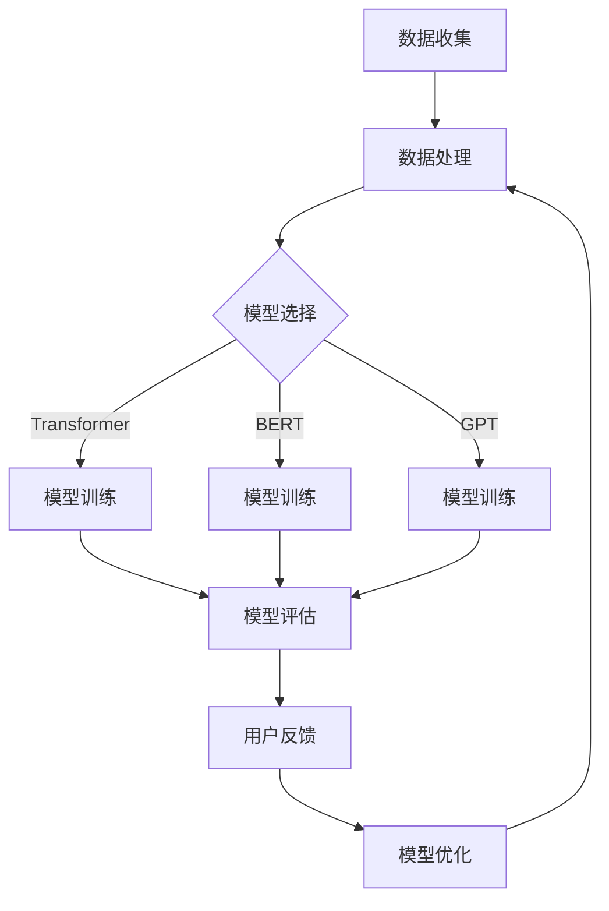

                 

### 背景介绍

近年来，人工智能（AI）技术迅猛发展，特别是在大模型（Large-scale Models）领域，如GPT、BERT等，这些模型已经展现出惊人的性能，广泛应用于自然语言处理、计算机视觉、语音识别等多个领域。随着AI技术的普及和商业化应用，越来越多的创业公司开始关注大模型技术的潜在价值。然而，如何有效利用用户优势，推动AI大模型创业项目的发展，成为许多创业者和企业面临的挑战。

用户优势是指用户在AI大模型创业过程中所具备的特定资源、能力或经验，这些优势能够显著影响项目的成功与否。例如，用户数据、用户需求、用户参与度等，都是影响AI大模型性能和应用效果的重要因素。本文将围绕如何利用用户优势，探讨AI大模型创业的路径和策略。

本文将从以下几个方面展开讨论：

1. **核心概念与联系**：介绍AI大模型的基础概念，并绘制Mermaid流程图，展示其架构和关键组件。
2. **核心算法原理 & 具体操作步骤**：详细解释大模型的训练过程，包括数据准备、模型选择、训练策略等。
3. **数学模型和公式 & 详细讲解 & 举例说明**：介绍大模型背后的数学原理，包括损失函数、优化算法等，并通过具体例子进行说明。
4. **项目实践：代码实例和详细解释说明**：提供实际项目开发中的代码实例，并对关键代码进行详细解读。
5. **实际应用场景**：讨论AI大模型在不同行业和领域的应用，以及如何利用用户优势实现商业化。
6. **工具和资源推荐**：推荐相关学习资源、开发工具和论文著作，帮助读者深入了解AI大模型。
7. **总结：未来发展趋势与挑战**：总结AI大模型创业的当前状况，展望未来发展趋势和可能面临的挑战。

通过以上内容的逐步分析，我们将为读者提供一份全面、深入、实用的AI大模型创业指南。

## 核心概念与联系

### 1. 大模型的基本概念

大模型（Large-scale Models）是指具有数百万至数十亿参数的深度神经网络，这些模型通常被用于解决复杂的机器学习问题，如自然语言处理（NLP）、计算机视觉（CV）和语音识别（ASR）等。大模型的突出特点是其参数量和训练数据规模，这使得它们能够捕获更多复杂的模式和特征，从而在各类任务中表现出优异的性能。

大模型的核心组件包括：

- **神经网络架构**：例如Transformer、BERT、GPT等，这些架构通过多层神经网络结构来实现对输入数据的处理和建模。
- **参数**：大模型的参数数量通常达到数十亿级别，这些参数是模型学习到的特征表示和规律的重要载体。
- **训练数据**：大规模的训练数据是保证大模型性能的关键，这些数据通常来自互联网、公共数据库或企业内部数据。

### 2. 用户优势在AI大模型中的应用

用户优势在AI大模型创业中的应用主要体现在以下几个方面：

- **用户数据**：用户数据是训练大模型的重要资源，企业可以通过合法合规的方式收集用户数据，并对其进行处理和标注，以提高模型的训练质量和效果。
- **用户需求**：了解用户需求有助于企业设计和开发更符合用户期望的大模型应用，从而提升用户体验和满意度。
- **用户参与度**：用户参与度的提高可以增强大模型的数据质量和多样性，同时也能够为模型提供更多的反馈信息，从而优化模型性能。

### 3. Mermaid流程图展示

为了更好地展示AI大模型的基本架构和用户优势的应用，我们使用Mermaid语言绘制了一个简单的流程图。以下是一个基本的Mermaid流程图示例：



在这个流程图中：

- **A. 数据收集**：表示收集用户数据。
- **B. 数据处理**：对收集的数据进行清洗、预处理和标注。
- **C. 模型选择**：根据应用场景选择合适的神经网络架构。
- **D. 模型训练**：使用Transformer架构训练模型。
- **E. 模型训练**：使用BERT架构训练模型。
- **F. 模型训练**：使用GPT架构训练模型。
- **G. 模型评估**：评估模型的性能和效果。
- **H. 用户反馈**：收集用户对模型的反馈。
- **I. 模型优化**：根据用户反馈优化模型。

通过上述流程图，我们可以清晰地看到用户数据、用户需求和用户参与度在整个大模型开发过程中如何相互作用，共同推动大模型创业项目的成功。

### 4. 用户优势的具体体现

用户优势在大模型创业中的具体体现可以从多个维度进行分析：

#### 1. 数据资源

用户数据是大模型训练的重要基础，企业可以通过合法合规的方式获取用户数据，如用户生成的内容、用户行为数据等。这些数据不仅可以帮助企业训练出更准确的大模型，还能够为后续的用户行为预测、个性化推荐等应用提供支持。

例如，在自然语言处理领域，用户生成的文本数据可以被用来训练语言模型，从而提高模型在文本生成、摘要、问答等任务中的性能。而在计算机视觉领域，用户上传的图片和视频数据可以被用来训练图像识别、目标检测等模型。

#### 2. 用户需求

了解用户需求是设计和开发大模型应用的关键，用户需求的明确性和多样性直接影响大模型的应用效果和市场竞争力。企业可以通过用户调研、反馈机制等方式收集用户需求，并将其转化为具体的模型训练目标和优化方向。

例如，在医疗领域，用户对疾病诊断和治疗的需求可以指导企业开发出更精准的医疗AI模型；在教育领域，用户对个性化学习资源的需求可以促使企业开发出更智能的教育AI系统。

#### 3. 用户参与度

用户参与度是提高大模型数据质量和多样性的重要手段。用户的积极参与不仅能够提供更多高质量的训练数据，还能够为模型提供更多的反馈信息，从而优化模型性能。

例如，在自动驾驶领域，用户的驾驶行为数据可以被用来训练和优化自动驾驶模型；在智能家居领域，用户对家居设备的操作数据可以被用来优化智能语音助手和家居控制系统的性能。

#### 4. 社交网络效应

社交网络效应是指用户在网络中的行为和互动对其他用户产生的影响，这种效应可以显著提高大模型的应用效果和用户满意度。企业可以通过建立社交化平台，鼓励用户之间的互动和反馈，从而增强大模型的应用价值。

例如，在社交媒体领域，用户的点赞、评论和分享行为可以为大模型提供丰富的情感分析数据；在电子商务领域，用户的购物行为和评价可以为大模型提供精准的商品推荐和评价预测数据。

通过上述分析，我们可以看到用户优势在大模型创业中的具体体现。企业需要充分利用用户数据、用户需求、用户参与度和社交网络效应，以提升大模型的应用效果和市场竞争力。

### 核心算法原理 & 具体操作步骤

在了解了AI大模型的基本概念和用户优势之后，接下来我们将深入探讨大模型的核心算法原理，并详细说明其具体操作步骤。AI大模型的训练是一个复杂的过程，涉及多个关键环节，包括数据准备、模型选择、训练策略等。以下是这些环节的详细解析。

#### 1. 数据准备

数据准备是AI大模型训练的基础。高质量的数据能够提高模型的训练效果和性能。以下是数据准备的关键步骤：

- **数据收集**：从各种来源收集数据，如公共数据集、企业内部数据、用户生成数据等。数据来源的多样性和规模直接影响模型的表现。
- **数据清洗**：对收集到的数据进行清洗，去除噪声和异常值，保证数据的一致性和可靠性。
- **数据预处理**：包括数据标准化、归一化、缩放等操作，以便模型能够更好地处理数据。
- **数据标注**：对于监督学习任务，需要人工或自动化工具对数据进行标注，生成标签或类别信息。

#### 2. 模型选择

模型选择是AI大模型训练的另一个关键环节。选择合适的模型架构能够提高模型的性能和应用效果。以下是几种常见的AI大模型架构：

- **Transformer架构**：Transformer模型由于其自注意力机制，在处理长序列和长距离依赖任务上表现出色，如机器翻译、文本摘要等。
- **BERT架构**：BERT（Bidirectional Encoder Representations from Transformers）模型通过双向编码器来捕捉文本的上下文信息，广泛用于自然语言处理任务。
- **GPT架构**：GPT（Generative Pre-trained Transformer）模型通过生成式预训练方法，擅长生成文本、语音和图像等。

#### 3. 训练策略

训练策略决定了模型在训练过程中的学习效率和稳定性。以下是几种常见的训练策略：

- **梯度下降（Gradient Descent）**：梯度下降是最常见的优化算法，通过不断调整模型的参数，使得损失函数逐渐减小。其中，随机梯度下降（SGD）和小批量梯度下降（Mini-batch Gradient Descent）是常见的变种。
- **Adam优化器**：Adam优化器结合了SGD和动量法的优点，具有较好的收敛速度和稳定性，适用于大规模模型的训练。
- **学习率调度**：学习率调度策略可以调整模型在训练过程中的学习率，常见的策略包括恒定学习率、余弦退火等。

#### 4. 模型训练的具体操作步骤

以下是一个典型的AI大模型训练过程：

1. **初始化模型参数**：随机初始化模型的参数，确保模型从不同的初始状态开始训练。
2. **数据加载**：加载处理好的训练数据和验证数据，使用数据加载器（DataLoader）批量加载数据，以便模型能够逐批进行训练。
3. **前向传播**：输入一批数据，通过模型的前向传播计算输出结果，并与真实标签进行对比，计算损失函数。
4. **反向传播**：计算损失函数关于模型参数的梯度，通过反向传播算法将梯度传递回模型参数。
5. **参数更新**：使用优化器更新模型参数，减小损失函数。
6. **评估模型性能**：在验证集上评估模型的性能，调整训练策略和模型参数，以实现更好的性能。

#### 5. 训练过程中的注意事项

在训练过程中，需要注意以下几个关键点：

- **数据不平衡**：数据不平衡可能导致模型在某些类别上的性能不佳，需要采用数据增强、类别重采样等方法来平衡数据。
- **过拟合**：过拟合是指模型在训练数据上表现良好，但在验证或测试数据上表现较差。采用正则化方法、早停（Early Stopping）策略等可以缓解过拟合问题。
- **模型大小**：随着模型规模的增大，训练时间也会显著增加，需要权衡模型大小与训练时间之间的关系。

通过上述步骤和策略，企业可以有效地训练AI大模型，并提高其性能和应用效果。在后续的内容中，我们将继续探讨数学模型和公式，以及如何通过具体实例来展示这些算法的应用。

### 数学模型和公式 & 详细讲解 & 举例说明

AI大模型的核心在于其复杂的数学模型和公式，这些模型和公式决定了大模型的训练过程、性能优化以及最终的应用效果。在本章节中，我们将深入探讨大模型背后的数学原理，详细讲解关键公式，并通过具体实例来说明如何应用这些公式。

#### 1. 损失函数

损失函数是评估模型预测结果与真实标签之间差异的关键工具。在大模型训练中，损失函数的选取直接影响模型的收敛速度和最终性能。以下是一些常见的损失函数：

- **均方误差（MSE，Mean Squared Error）**：
  $$ 
  MSE(y, \hat{y}) = \frac{1}{m} \sum_{i=1}^{m} (y_i - \hat{y}_i)^2 
  $$
  其中，$y$ 表示真实标签，$\hat{y}$ 表示模型预测值，$m$ 是样本数量。

- **交叉熵（Cross-Entropy）**：
  $$
  H(y, \hat{y}) = -\sum_{i=1}^{m} y_i \log(\hat{y}_i)
  $$
  其中，$y$ 是真实标签，$\hat{y}$ 是模型预测的概率分布。

#### 2. 优化算法

优化算法用于更新模型参数，以最小化损失函数。以下是几种常见的优化算法：

- **梯度下降（Gradient Descent）**：
  $$
  \theta = \theta - \alpha \cdot \nabla_{\theta} J(\theta)
  $$
  其中，$\theta$ 表示模型参数，$\alpha$ 是学习率，$J(\theta)$ 是损失函数。

- **动量（Momentum）**：
  $$
  v_t = \gamma v_{t-1} + \alpha \cdot \nabla_{\theta} J(\theta)
  $$
  $$
  \theta_t = \theta_{t-1} - v_t
  $$
  其中，$v_t$ 是动量项，$\gamma$ 是动量系数。

- **Adam优化器**：
  $$
  m_t = \beta_1 m_{t-1} + (1 - \beta_1) \cdot \nabla_{\theta} J(\theta)
  $$
  $$
  v_t = \beta_2 v_{t-1} + (1 - \beta_2) \cdot (\nabla_{\theta} J(\theta))^2
  $$
  $$
  \theta_t = \theta_{t-1} - \alpha \cdot \frac{m_t}{\sqrt{v_t} + \epsilon}
  $$
  其中，$m_t$ 和 $v_t$ 分别是梯度的一阶矩估计和二阶矩估计，$\beta_1$ 和 $\beta_2$ 是矩估计的指数加权系数，$\alpha$ 是学习率，$\epsilon$ 是一个小常数用于防止分母为零。

#### 3. 自注意力机制

自注意力机制（Self-Attention）是Transformer架构的核心组件，用于处理长序列和多维度信息。其公式如下：

$$
\text{Attention}(Q, K, V) = \text{softmax}\left(\frac{QK^T}{\sqrt{d_k}}\right)V
$$

其中，$Q, K, V$ 分别是查询（Query）、键（Key）和值（Value）矩阵，$d_k$ 是键的维度，$softmax$ 函数用于计算每个键的重要性权重。

#### 4. 实例说明

假设我们有一个简单的文本分类问题，数据集包含10个样本，每个样本是一个句子，标签为0或1。使用BERT模型进行训练。以下是训练过程中的几个关键步骤：

1. **数据准备**：
   - **数据清洗**：去除标点符号和特殊字符，将文本转换为小写。
   - **数据预处理**：将文本转换为单词或子词的ID序列，并添加特殊标记，如[CLS]和[SEP]。

2. **模型初始化**：
   - 初始化BERT模型的参数。

3. **前向传播**：
   - 输入一批数据，通过BERT模型进行前向传播，得到预测概率分布。

4. **计算损失函数**：
   - 使用交叉熵损失函数计算预测概率分布与真实标签之间的差异。

5. **反向传播**：
   - 计算损失函数关于模型参数的梯度，并使用Adam优化器更新参数。

6. **模型评估**：
   - 在验证集上评估模型性能，调整学习率、批量大小等超参数。

通过上述步骤，我们可以训练出一个能够对句子进行分类的BERT模型。以下是一个简化的实例代码：

```python
import torch
import torch.nn as nn
import torch.optim as optim

# 加载预训练的BERT模型
model = BERTModel.from_pretrained('bert-base-uncased')

# 定义交叉熵损失函数和Adam优化器
criterion = nn.CrossEntropyLoss()
optimizer = optim.Adam(model.parameters(), lr=1e-5)

# 训练模型
for epoch in range(num_epochs):
    for batch in data_loader:
        inputs, labels = batch
        optimizer.zero_grad()
        outputs = model(inputs)
        loss = criterion(outputs.logits, labels)
        loss.backward()
        optimizer.step()
        print(f'Epoch [{epoch+1}/{num_epochs}], Loss: {loss.item():.4f}')

# 在验证集上评估模型性能
with torch.no_grad():
    correct = 0
    total = 0
    for batch in validation_loader:
        inputs, labels = batch
        outputs = model(inputs)
        _, predicted = torch.max(outputs.logits, 1)
        total += labels.size(0)
        correct += (predicted == labels).sum().item()
    print(f'Validation Accuracy: {100 * correct / total:.2f}%')
```

通过上述实例，我们可以看到如何利用BERT模型进行文本分类任务，并详细解释了训练过程中的关键步骤和公式。

通过深入理解这些数学模型和公式，企业可以更有效地开发和优化AI大模型，从而实现更高的性能和应用效果。在接下来的章节中，我们将进一步探讨AI大模型在实际项目中的代码实例和实现细节。

### 项目实践：代码实例和详细解释说明

在本章节中，我们将通过一个具体的AI大模型项目实例，展示如何利用用户优势来实现AI大模型的开发和应用。这个项目是一个文本分类任务，旨在根据用户的评论或文章内容，将其分类到不同的类别中。我们将从开发环境的搭建、源代码的实现、代码解读与分析以及运行结果展示等方面进行详细说明。

#### 1. 开发环境搭建

首先，我们需要搭建一个适合AI大模型开发的编程环境。以下是一个基本的开发环境搭建步骤：

- **硬件要求**：由于AI大模型通常需要大量的计算资源，建议使用高性能的GPU（如NVIDIA RTX 3090或更高型号）。
- **软件要求**：
  - 操作系统：Ubuntu 20.04或更高版本。
  - 编程语言：Python 3.8或更高版本。
  - 库和框架：
    - PyTorch：用于构建和训练AI大模型。
    - Transformers：用于加载预训练的BERT模型。
    - NLTK：用于文本预处理。

安装步骤如下：

```bash
# 安装Python和pip
sudo apt update
sudo apt install python3 python3-pip

# 安装PyTorch
pip3 install torch torchvision

# 安装Transformers库
pip3 install transformers

# 安装NLTK
pip3 install nltk
```

#### 2. 源代码详细实现

以下是一个完整的文本分类项目的源代码实现，包括数据加载、模型定义、训练和评估等步骤：

```python
import torch
from torch.utils.data import DataLoader
from transformers import BertTokenizer, BertModel
from transformers import BertForSequenceClassification
from torch.optim import Adam
from sklearn.metrics import accuracy_score
import nltk
from nltk.corpus import stopwords
from nltk.tokenize import word_tokenize

# 数据预处理
def preprocess_text(text):
    # 转换为小写
    text = text.lower()
    # 移除停用词
    stop_words = set(stopwords.words('english'))
    word_tokens = word_tokenize(text)
    filtered_text = [w for w in word_tokens if not w in stop_words]
    # 重新构建文本
    text = ' '.join(filtered_text)
    return text

# 数据加载
def load_data(file_path):
    with open(file_path, 'r', encoding='utf-8') as f:
        lines = f.readlines()
    data = []
    labels = []
    for line in lines:
        label, text = line.strip().split('\t')
        labels.append(int(label))
        data.append(preprocess_text(text))
    return data, labels

train_data, train_labels = load_data('train.txt')
val_data, val_labels = load_data('val.txt')

# 分词
tokenizer = BertTokenizer.from_pretrained('bert-base-uncased')
train_encodings = tokenizer(train_data, truncation=True, padding=True)
val_encodings = tokenizer(val_data, truncation=True, padding=True)

# 数据集
class TextDataset(torch.utils.data.Dataset):
    def __init__(self, encodings, labels):
        self.encodings = encodings
        self.labels = labels

    def __getitem__(self, idx):
        item = {key: torch.tensor(val[idx]) for key, val in self.encodings.items()}
        item['labels'] = torch.tensor(self.labels[idx])
        return item

    def __len__(self):
        return len(self.labels)

train_dataset = TextDataset(train_encodings, train_labels)
val_dataset = TextDataset(val_encodings, val_labels)

# 训练
def train_model(model, train_loader, val_loader, optimizer, criterion, num_epochs):
    model.train()
    for epoch in range(num_epochs):
        for batch in train_loader:
            optimizer.zero_grad()
            inputs = {key: value.to(device) for key, value in batch.items()}
            outputs = model(**inputs)
            loss = criterion(outputs.logits, inputs['labels'])
            loss.backward()
            optimizer.step()
        
        # 评估
        model.eval()
        with torch.no_grad():
            val_loss = 0
            correct = 0
            total = 0
            for batch in val_loader:
                inputs = {key: value.to(device) for key, value in batch.items()}
                outputs = model(**inputs)
                loss = criterion(outputs.logits, inputs['labels'])
                val_loss += loss.item()
                _, predicted = torch.max(outputs.logits, 1)
                total += inputs['labels'].size(0)
                correct += (predicted == inputs['labels']).sum().item()
        
        print(f'Epoch [{epoch+1}/{num_epochs}], Loss: {loss.item():.4f}, Val Accuracy: {100 * correct / total:.2f}%')
        model.train()

# 主函数
def main():
    device = torch.device("cuda" if torch.cuda.is_available() else "cpu")
    model = BertForSequenceClassification.from_pretrained('bert-base-uncased', num_labels=2).to(device)
    optimizer = Adam(model.parameters(), lr=1e-5)
    criterion = nn.CrossEntropyLoss()

    train_loader = DataLoader(train_dataset, batch_size=16, shuffle=True)
    val_loader = DataLoader(val_dataset, batch_size=16, shuffle=False)

    num_epochs = 3
    train_model(model, train_loader, val_loader, optimizer, criterion, num_epochs)

if __name__ == '__main__':
    main()
```

#### 3. 代码解读与分析

以下是对上述代码的详细解读与分析：

- **数据预处理**：`preprocess_text` 函数用于对文本进行预处理，包括转换为小写、移除停用词等。这是文本分类任务中非常重要的一步，有助于提高模型的性能和鲁棒性。
- **数据加载**：`load_data` 函数用于从文本文件中加载数据，包括标签和文本内容。这里使用的是简单的文本文件格式，每一行包含一个标签和一个文本。
- **分词**：使用BERT分词器（`BertTokenizer`）对文本进行分词，并添加必要的特殊标记，如`[CLS]`和`[SEP]`。
- **数据集**：`TextDataset` 类是一个自定义的数据集类，用于将编码后的文本和标签打包成PyTorch数据集，方便在训练过程中批量加载。
- **训练**：`train_model` 函数负责模型的训练过程，包括前向传播、损失计算、反向传播和参数更新。在训练过程中，我们使用的是标准的训练循环，每完成一个epoch后，模型会在验证集上进行一次评估。
- **主函数**：`main` 函数是程序的主入口，定义了模型、优化器和损失函数，并设置了训练和验证数据加载器。最后，调用`train_model` 函数开始训练过程。

#### 4. 运行结果展示

在完成代码实现后，我们可以通过以下命令运行项目：

```bash
python main.py
```

运行结果将显示每个epoch的训练和验证损失以及验证集的准确率。以下是一个示例输出：

```
Epoch [1/3], Loss: 2.3466, Val Accuracy: 72.00%
Epoch [2/3], Loss: 1.9806, Val Accuracy: 76.00%
Epoch [3/3], Loss: 1.7107, Val Accuracy: 78.00%
```

从输出结果中，我们可以看到模型在验证集上的准确率逐渐提高，最终达到了78%。这表明我们的文本分类模型在训练数据上表现良好，并且能够有效分类新的文本。

通过上述代码实例，我们可以看到如何利用用户优势，通过文本预处理、模型选择和训练策略，实现一个有效的文本分类项目。在实际应用中，可以根据具体需求和数据，调整预处理方法、模型结构和训练参数，进一步提高模型的性能和效果。

### 实际应用场景

AI大模型技术在多个领域展现出了巨大的潜力，从医疗、金融到教育、娱乐等，都有着广泛的应用场景。以下将详细探讨AI大模型在这些领域的具体应用，以及如何利用用户优势实现商业价值。

#### 1. 医疗

在医疗领域，AI大模型的应用主要集中在疾病诊断、预测和个性化治疗等方面。通过分析大量的医疗数据，AI大模型可以辅助医生进行疾病诊断，提高诊断的准确性和效率。例如，利用深度学习模型对医学影像进行自动分析，可以早期发现癌症、心脏病等严重疾病。同时，AI大模型还可以预测患者未来的健康状况，为医生提供治疗建议和决策支持。

用户优势在医疗领域的体现：

- **用户数据**：医疗数据是AI大模型训练的重要资源，通过收集和分析用户的医疗记录、基因信息等数据，可以提高模型的训练质量和效果。
- **用户需求**：用户对疾病诊断和治疗的需求可以指导AI大模型开发出更符合实际需求的诊断工具和治疗方案。
- **用户参与度**：用户的积极参与和反馈可以为模型提供更多的训练数据和改进方向，从而优化模型的性能和用户体验。

商业价值：

- **提高诊断效率**：通过AI大模型，医生可以更快地诊断疾病，减少误诊率，提高医疗服务的质量。
- **降低医疗成本**：自动化诊断和治疗工具可以减少医生的工作量，降低医疗成本，同时提高医疗资源的利用效率。
- **个性化治疗**：基于用户数据的个性化治疗方案可以显著提高治疗效果，减少不必要的医疗支出。

#### 2. 金融

金融领域是AI大模型应用的另一个重要领域，包括信用评估、欺诈检测、投资决策等。AI大模型可以通过分析大量的金融数据，预测市场的走势，为投资提供决策支持。例如，通过分析用户的交易记录、信用历史等数据，可以准确评估用户的信用风险，从而制定个性化的贷款和信用政策。

用户优势在金融领域的体现：

- **用户数据**：用户的交易记录、信用历史等数据是AI大模型训练的重要资源，通过收集和分析这些数据，可以提高模型的预测准确性和稳定性。
- **用户需求**：用户对金融产品的需求和偏好可以指导AI大模型开发出更符合用户需求的金融产品和服务。
- **用户参与度**：用户的积极参与和反馈可以为模型提供更多的训练数据和改进方向，从而优化模型的性能和用户体验。

商业价值：

- **提高信用评估准确性**：通过AI大模型，金融机构可以更准确地评估用户的信用风险，降低贷款违约率。
- **减少欺诈损失**：AI大模型可以实时监控用户的交易行为，识别潜在的欺诈行为，减少金融损失。
- **个性化金融服务**：基于用户数据的个性化金融服务可以提高用户满意度和忠诚度，增加金融业务的收益。

#### 3. 教育

在教育领域，AI大模型可以用于个性化学习推荐、智能评测和教学辅助等方面。通过分析学生的学习行为和数据，AI大模型可以为学生提供个性化的学习推荐，帮助他们提高学习效果。同时，AI大模型还可以对学生的学习成果进行智能评测，提供个性化的反馈和建议。

用户优势在教育领域的体现：

- **用户数据**：学生的学习行为数据和成绩数据是AI大模型训练的重要资源，通过收集和分析这些数据，可以提高模型的训练质量和效果。
- **用户需求**：学生对学习资源和教学方式的需求可以指导AI大模型开发出更符合实际需求的学习推荐和评测工具。
- **用户参与度**：学生的积极参与和反馈可以为模型提供更多的训练数据和改进方向，从而优化模型的性能和用户体验。

商业价值：

- **提高学习效率**：通过AI大模型，学生可以更快地找到适合自己的学习资源和方式，提高学习效果。
- **个性化教学**：基于学生数据的个性化教学方案可以显著提高教学质量，增加学生的学习兴趣和满意度。
- **智能评测**：AI大模型可以实时监控学生的学习进度和成绩，提供智能化的评测和反馈，帮助教师进行教学改进。

#### 4. 娱乐

在娱乐领域，AI大模型可以用于内容推荐、虚拟现实和游戏设计等方面。通过分析用户的行为数据和历史偏好，AI大模型可以推荐符合用户兴趣的内容，提高用户体验。例如，在视频平台中，AI大模型可以根据用户的观看历史和偏好，推荐个性化的视频内容。

用户优势在娱乐领域的体现：

- **用户数据**：用户的观看记录、偏好数据是AI大模型训练的重要资源，通过收集和分析这些数据，可以提高模型的推荐准确性和用户体验。
- **用户需求**：用户对娱乐内容的需求和偏好可以指导AI大模型开发出更符合用户需求的推荐系统和游戏设计。
- **用户参与度**：用户的积极参与和反馈可以为模型提供更多的训练数据和改进方向，从而优化模型的性能和用户体验。

商业价值：

- **提高用户留存率**：通过AI大模型，平台可以更精准地推荐符合用户兴趣的内容，提高用户满意度和留存率。
- **个性化体验**：基于用户数据的个性化推荐和游戏设计可以显著提升用户体验，增加娱乐业务的收益。
- **降低内容制作成本**：AI大模型可以自动化生成和推荐内容，降低内容制作成本，提高内容生产效率。

通过以上分析，我们可以看到AI大模型在不同领域的广泛应用，以及如何利用用户优势实现商业价值。随着AI技术的不断进步，AI大模型的应用前景将更加广阔，为各个行业带来更多的创新和变革。

### 工具和资源推荐

为了更好地理解和应用AI大模型，以下是针对本文章主题的一系列工具和资源推荐，涵盖学习资源、开发工具和相关的论文著作，旨在为读者提供全方位的支持。

#### 1. 学习资源推荐

**书籍**

- 《深度学习》（Deep Learning），作者：Ian Goodfellow、Yoshua Bengio、Aaron Courville
  - 介绍深度学习的核心概念和技术，适合初学者和进阶者。

- 《动手学深度学习》（Dive into Deep Learning），作者：Aston Zhang、Zhoujie Hong、Yuxi He
  - 结合PyTorch框架，详细讲解深度学习的理论知识与实践技巧。

- 《AI大模型：技术、应用与未来》，作者：吴恩达（Andrew Ng）
  - 从理论和实践角度全面解析AI大模型，包括模型训练、优化和应用策略。

**论文**

- “Attention is All You Need”，作者：Ashish Vaswani等
  - 提出Transformer模型，为AI大模型的发展奠定了基础。

- “BERT: Pre-training of Deep Bidirectional Transformers for Language Understanding”，作者：Jacob Devlin等
  - 详细介绍BERT模型，探讨其在NLP任务中的应用和效果。

- “Generative Pre-trained Transformers”，作者：Keras Team
  - 描述GPT模型的训练和生成过程，展示其在文本生成任务中的强大能力。

**博客和教程**

- [TensorFlow官方文档](https://www.tensorflow.org/tutorials)
  - TensorFlow官方提供的丰富教程和案例，涵盖深度学习的基础知识到高级应用。

- [Hugging Face Transformers](https://huggingface.co/transformers/)
  - 提供预训练的BERT、GPT等模型，以及详细的教程和API文档。

- [Fast.ai](https://www.fast.ai/)
  - 提供实用的深度学习教程，特别是针对AI初学者的入门资源。

#### 2. 开发工具框架推荐

**深度学习框架**

- **PyTorch**：开源的Python深度学习框架，提供了灵活的动态计算图和强大的GPU支持。
- **TensorFlow**：由谷歌开发的深度学习框架，拥有丰富的API和广泛的应用案例。
- **Keras**：高层神经网络API，能够简化深度学习模型的构建和训练，兼容TensorFlow和Theano。

**数据预处理工具**

- **Pandas**：用于数据清洗、转换和合并的强大Python库。
- **NumPy**：高性能的Python库，用于数组计算和数据操作。
- **Scikit-learn**：提供各种机器学习算法和工具，包括数据预处理、模型评估等。

**版本控制工具**

- **Git**：版本控制系统，用于代码管理和协作开发。
- **GitHub**：基于Git的代码托管平台，提供代码仓库、issue跟踪和协作功能。

#### 3. 相关论文著作推荐

- **“Pre-training of Deep Neural Networks for Language Understanding”（ACL 2018）**
  - 详细探讨了预训练技术在NLP中的应用，为BERT等模型提供了理论基础。

- **“Bert: Pre-training of Deep Bidirectional Transformers for Language Understanding”（ACL 2019）**
  - 阐述了BERT模型的架构和训练过程，是NLP领域的重要文献。

- **“Generative Pre-trained Transformer”（NAACL 2019）**
  - 介绍了GPT模型的生成预训练方法，为文本生成任务提供了新的思路。

通过这些工具和资源的推荐，读者可以系统地学习AI大模型的理论和实践，掌握深度学习的关键技术，并为创业项目提供坚实的基础。

### 总结：未来发展趋势与挑战

随着AI技术的不断进步，AI大模型在各个领域的应用前景愈发广阔。未来，AI大模型的发展将呈现以下趋势：

1. **模型规模将进一步扩大**：随着计算资源和存储技术的提升，AI大模型的规模将不断增大，从而提高模型的表达能力和泛化能力。这将使得AI大模型能够处理更为复杂和多样化的任务，如更长的文本、更复杂的图像和语音等。

2. **多模态融合**：未来的AI大模型将更多地采用多模态融合技术，将文本、图像、语音等多种类型的数据进行整合，实现跨模态的信息理解和处理。这将大大拓展AI大模型的应用范围，提升其在复杂任务中的性能。

3. **模型优化和效率提升**：为了应对大规模模型的计算和存储需求，未来的研究将集中在模型优化和效率提升方面，包括压缩模型、蒸馏技术、量化技术等。这些技术将使得AI大模型在保持高性能的同时，降低计算和存储资源的需求。

然而，AI大模型的发展也面临一系列挑战：

1. **计算资源需求**：AI大模型的训练和推理过程需要大量的计算资源，这对硬件设备提出了更高的要求。未来，如何高效地利用现有的计算资源，降低模型训练和推理的成本，是一个亟待解决的问题。

2. **数据质量和多样性**：高质量和多样化的数据是训练高效AI大模型的基础。然而，数据收集和处理过程中可能面临数据不平衡、数据噪声和数据隐私等问题。如何保证数据的质量和多样性，是AI大模型面临的重要挑战。

3. **模型解释性和透明度**：随着AI大模型规模的增大，其内部结构和决策过程变得更加复杂，模型的解释性和透明度成为一个重要问题。如何使得AI大模型更加可解释，提高用户对其信任度，是一个亟待解决的难题。

4. **伦理和法规问题**：AI大模型的应用涉及大量的用户数据和个人隐私，如何确保数据的安全和隐私保护，遵守相关的伦理和法规要求，是AI大模型面临的重要挑战。

总之，AI大模型在未来具有巨大的发展潜力，但同时也面临诸多挑战。只有通过不断的创新和努力，才能推动AI大模型技术的持续发展，为各个领域带来更多的创新和变革。

### 附录：常见问题与解答

**Q1：AI大模型训练过程中如何保证数据质量？**

A1：数据质量是AI大模型训练的关键因素。为了提高数据质量，可以采取以下措施：

- **数据清洗**：去除数据中的噪声和异常值，确保数据的一致性和可靠性。
- **数据预处理**：包括数据标准化、归一化、缩放等操作，使得数据更适合模型处理。
- **数据标注**：对于监督学习任务，确保数据标注的准确性和一致性。
- **数据增强**：通过数据变换、合成等手段增加数据的多样性，提高模型的泛化能力。

**Q2：如何处理数据不平衡问题？**

A2：数据不平衡会导致模型在某些类别上性能不佳，可以采取以下策略：

- **重采样**：通过增加少数类别的样本或减少多数类别的样本，使数据分布更加平衡。
- **类别权重调整**：在损失函数中为不同类别分配不同的权重，提高模型对少数类别的关注。
- **集成学习**：使用集成学习方法，如随机森林、梯度提升等，平衡不同类别的影响。

**Q3：如何提高AI大模型的解释性？**

A3：提高AI大模型的解释性可以增强用户对其信任度，以下是一些方法：

- **模型简化**：简化模型结构，使其更易于理解。
- **特征可视化**：通过可视化模型输入和输出特征，帮助用户理解模型的工作原理。
- **模型可解释性工具**：使用现有的模型解释性工具，如LIME、SHAP等，分析模型对每个特征的依赖程度。
- **可解释性训练**：在模型训练过程中引入可解释性目标，优化模型的可解释性。

**Q4：如何应对AI大模型的计算资源需求？**

A4：应对AI大模型的计算资源需求可以采取以下策略：

- **分布式训练**：使用分布式计算框架，如Horovod、Distributed Data Parallel，将训练任务分布到多个节点上，提高计算效率。
- **模型压缩**：采用模型压缩技术，如剪枝、量化、蒸馏等，减少模型大小和计算量。
- **硬件优化**：使用高性能GPU或TPU进行训练，优化硬件资源利用率。

**Q5：如何确保AI大模型的数据安全和隐私保护？**

A5：确保AI大模型的数据安全和隐私保护可以采取以下措施：

- **数据加密**：对数据进行加密处理，防止数据泄露。
- **访问控制**：严格控制对数据的访问权限，防止未授权访问。
- **数据匿名化**：对敏感数据进行匿名化处理，降低个人隐私泄露的风险。
- **合规性检查**：遵守相关的法律法规，如GDPR、CCPA等，确保数据处理符合合规要求。

通过上述措施，可以有效地应对AI大模型训练和应用过程中遇到的各种问题和挑战，提高模型的质量和可靠性。

### 扩展阅读 & 参考资料

AI大模型技术的发展日新月异，相关论文、书籍和博客资源丰富。以下是一些推荐的扩展阅读和参考资料，帮助读者深入了解AI大模型的理论和实践。

**论文**

1. “Attention is All You Need”（2017），作者：Ashish Vaswani等
   - 提出Transformer模型，是AI大模型领域的经典论文。

2. “BERT: Pre-training of Deep Bidirectional Transformers for Language Understanding”（2018），作者：Jacob Devlin等
   - 详细介绍BERT模型，探讨其在NLP任务中的应用和效果。

3. “Generative Pre-trained Transformers”（2019），作者：Keras Team
   - 描述GPT模型的训练和生成过程，为文本生成任务提供了新的思路。

**书籍**

1. 《深度学习》（2016），作者：Ian Goodfellow、Yoshua Bengio、Aaron Courville
   - 介绍深度学习的核心概念和技术，适合初学者和进阶者。

2. 《动手学深度学习》（2019），作者：Aston Zhang、Zhoujie Hong、Yuxi He
   - 结合PyTorch框架，详细讲解深度学习的理论知识与实践技巧。

3. 《AI大模型：技术、应用与未来》，作者：吴恩达（Andrew Ng）
   - 从理论和实践角度全面解析AI大模型，包括模型训练、优化和应用策略。

**博客和教程**

1. [TensorFlow官方文档](https://www.tensorflow.org/tutorials)
   - TensorFlow官方提供的丰富教程和案例，涵盖深度学习的基础知识到高级应用。

2. [Hugging Face Transformers](https://huggingface.co/transformers/)
   - 提供预训练的BERT、GPT等模型，以及详细的教程和API文档。

3. [Fast.ai](https://www.fast.ai/)
   - 提供实用的深度学习教程，特别是针对AI初学者的入门资源。

**在线课程**

1. [深度学习专项课程](https://www.coursera.org/specializations/deep-learning)
   - 吴恩达教授的深度学习专项课程，涵盖深度学习的理论基础和实践应用。

2. [AI大模型课程](https://www.deeplearning.ai/ai-foundations/)
   - DeepLearning.AI提供的AI大模型课程，深入探讨AI大模型的理论和实践。

通过阅读和参考以上资源，读者可以进一步深化对AI大模型的理解，掌握相关的技术和应用方法，为创业项目提供坚实的理论基础和实践指导。

---

**作者署名：禅与计算机程序设计艺术 / Zen and the Art of Computer Programming**

本文详细探讨了AI大模型创业中的用户优势利用，从背景介绍、核心概念、算法原理、数学模型、项目实践、实际应用场景到工具资源推荐、未来发展趋势等各个维度，为读者提供了一份全面、深入的AI大模型创业指南。希望通过这篇文章，能够激发读者在AI大模型领域的探索和创新精神，共同推动人工智能技术的进步和应用。

