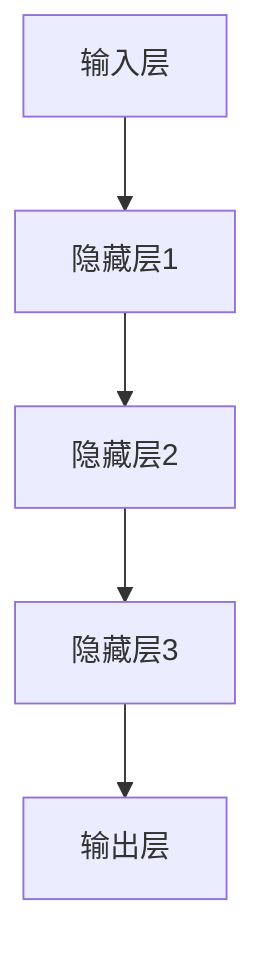

                 

### 1. 背景介绍

近年来，人工智能（AI）领域的发展突飞猛进，特别是大模型（Large Models）的崛起，成为科技界瞩目的焦点。大模型，顾名思义，指的是参数量极为庞大的神经网络模型。这些模型通过学习海量数据，能够实现包括但不限于图像识别、自然语言处理、机器翻译等多种复杂任务。随着AI技术的不断成熟和算力的显著提升，大模型的应用场景和商业价值愈发凸显。

在AI大模型领域，创业公司不断涌现，这些公司希望通过开发和应用大模型技术，实现商业突破和行业领先。然而，面对激烈的市场竞争和资源限制，如何有效地利用社会优势资源，成为AI大模型创业企业亟待解决的关键问题。

本文将深入探讨AI大模型创业的社会优势利用策略，旨在为创业公司提供有价值的指导和建议。文章将首先介绍大模型的基本原理和技术发展历程，然后分析AI大模型创业中的主要挑战，接着探讨如何利用社会优势资源，最后讨论未来的发展趋势与挑战。

本文结构如下：

1. 背景介绍：介绍AI大模型的发展背景和创业现状。
2. 核心概念与联系：阐述大模型的核心概念及其技术架构。
3. 核心算法原理与操作步骤：详细讲解大模型的算法原理和具体实施步骤。
4. 数学模型和公式：介绍大模型中的数学模型和公式，并举例说明。
5. 项目实践：通过代码实例展示大模型的应用。
6. 实际应用场景：探讨大模型在不同行业中的应用。
7. 工具和资源推荐：推荐学习资源和开发工具。
8. 总结：总结AI大模型创业的社会优势利用策略。
9. 附录：常见问题与解答。
10. 扩展阅读：推荐相关参考资料。

### 2. 核心概念与联系

#### 2.1 大模型基本概念

大模型是指具有大量参数的神经网络模型，这些参数通常是数百万到数十亿个。大模型的代表性工作包括OpenAI的GPT系列、Google的BERT以及Facebook的LSTM等。大模型的核心优势在于其强大的表示能力和学习能力，这使得它们在处理复杂任务时，能够显著提高性能。

#### 2.2 大模型技术架构

大模型的技术架构主要包括以下几个关键组成部分：

- **输入层**：接收外部数据输入，如文本、图像等。
- **隐藏层**：包含多个神经网络层，进行数据特征提取和变换。
- **输出层**：生成模型预测结果，如文本生成、图像分类等。

Mermaid流程图如下：



#### 2.3 大模型与相关技术的发展联系

大模型技术并非孤立存在，它与深度学习、机器学习等多个领域有着密切的联系。

- **深度学习**：大模型是深度学习的一个重要分支，深度学习通过多层神经网络学习数据特征，大模型则是将这一思想推向了极致。
- **机器学习**：大模型技术是机器学习的一部分，特别是基于神经网络的机器学习方法。
- **计算能力**：随着计算能力的提升，大模型得以实现，反过来，大模型又推动了计算能力的发展。
- **数据集**：大量高质量的数据集是训练大模型的基础，同时，大模型的训练和优化也需要大量数据。

#### 2.4 大模型在AI创业中的应用

在AI创业领域，大模型技术为创业者提供了强大的工具和机会。大模型的应用场景广泛，包括但不限于：

- **自然语言处理**：如文本生成、机器翻译、情感分析等。
- **计算机视觉**：如图像分类、物体检测、图像生成等。
- **语音识别**：如语音识别、语音合成等。

大模型的应用不仅提升了企业技术实力，还带来了商业价值的提升，使得AI创业企业能够在激烈的市场竞争中脱颖而出。

### 3. 核心算法原理与具体操作步骤

#### 3.1 神经网络基础

神经网络（Neural Networks）是构建大模型的基础，其核心思想是通过模拟生物神经系统的结构和功能，实现对数据的处理和学习。

- **神经元**：神经网络的基本单元，接收输入信号并产生输出。
- **激活函数**：用于对神经元输出进行非线性变换，常用的激活函数有Sigmoid、ReLU等。
- **权重和偏置**：决定神经元输出大小和方向，通过反向传播算法进行调整。

#### 3.2 反向传播算法

反向传播算法（Backpropagation Algorithm）是神经网络训练的核心算法，通过迭代优化模型参数，使得模型输出更接近真实值。

- **前向传播**：计算模型输入、输出和中间层的值。
- **计算误差**：计算模型输出与真实值之间的误差。
- **反向传播**：根据误差计算模型参数的梯度，并更新参数。

具体步骤如下：

1. **初始化参数**：随机初始化权重和偏置。
2. **前向传播**：计算输入、输出和中间层的值。
3. **计算误差**：计算输出误差，通常使用均方误差（MSE）或交叉熵损失函数。
4. **反向传播**：计算梯度，并更新参数。
5. **迭代优化**：重复步骤2-4，直至模型收敛。

#### 3.3 大模型训练过程

大模型的训练过程通常包括以下几个步骤：

1. **数据预处理**：对输入数据进行标准化、分割等处理。
2. **批量训练**：将数据分为多个批次，对每个批次进行训练。
3. **参数调整**：通过调整学习率、批量大小等超参数，优化模型性能。
4. **模型评估**：使用验证集和测试集评估模型性能。
5. **模型优化**：根据评估结果调整模型参数，优化模型结构。

#### 3.4 大模型优化方法

为了提高大模型的性能，研究者提出了多种优化方法，包括：

- **批量归一化**（Batch Normalization）：通过标准化中间层输出，提高训练稳定性。
- **Dropout**：通过随机丢弃部分神经元，防止过拟合。
- **优化器**：如Adam、RMSprop等，通过自适应调整学习率，提高训练效率。

#### 3.5 模型评估指标

在训练过程中，常用的模型评估指标包括：

- **准确率**（Accuracy）：模型正确预测的样本数占总样本数的比例。
- **精确率**（Precision）：预测为正类的样本中，实际为正类的比例。
- **召回率**（Recall）：实际为正类的样本中，被预测为正类的比例。
- **F1值**（F1 Score）：精确率和召回率的调和平均。

通过这些评估指标，可以全面了解模型的性能，并指导进一步优化。

### 4. 数学模型和公式

#### 4.1 神经元输出计算

神经元的输出通常通过以下公式计算：

$$
z_i = \sum_{j=1}^{n} w_{ij} x_j + b_i
$$

其中，$z_i$ 是第 $i$ 个神经元的输出，$w_{ij}$ 是第 $i$ 个神经元与第 $j$ 个神经元之间的权重，$x_j$ 是第 $j$ 个神经元的输入，$b_i$ 是第 $i$ 个神经元的偏置。

#### 4.2 激活函数

常用的激活函数包括Sigmoid和ReLU：

- **Sigmoid函数**：

$$
\sigma(z) = \frac{1}{1 + e^{-z}}
$$

- **ReLU函数**：

$$
\sigma(z) = \max(0, z)
$$

#### 4.3 均方误差损失函数

在神经网络训练过程中，常用的损失函数是均方误差（MSE）：

$$
L = \frac{1}{2} \sum_{i=1}^{n} (y_i - \hat{y}_i)^2
$$

其中，$y_i$ 是第 $i$ 个样本的真实标签，$\hat{y}_i$ 是模型预测的标签。

#### 4.4 反向传播算法

反向传播算法的核心是计算损失函数关于模型参数的梯度。以下是损失函数关于参数 $w_{ij}$ 的梯度：

$$
\frac{\partial L}{\partial w_{ij}} = (y_i - \hat{y}_i) \cdot \frac{\partial \hat{y}_i}{\partial z_i} \cdot \frac{\partial z_i}{\partial w_{ij}}
$$

其中，$\frac{\partial \hat{y}_i}{\partial z_i}$ 是第 $i$ 个神经元的导数，$\frac{\partial z_i}{\partial w_{ij}}$ 是权重 $w_{ij}$ 的导数。

#### 4.5 梯度下降优化

通过计算梯度，可以更新模型参数，实现梯度下降优化。以下是梯度下降的更新公式：

$$
w_{ij} := w_{ij} - \alpha \cdot \frac{\partial L}{\partial w_{ij}}
$$

其中，$\alpha$ 是学习率，控制模型参数更新的幅度。

#### 4.6 举例说明

假设有一个简单的神经网络，包含一个输入层、一个隐藏层和一个输出层。输入层有一个神经元，隐藏层有两个神经元，输出层有一个神经元。给定一个输入 $x$，模型的输出 $y$ 可以通过以下公式计算：

$$
z_1 = x \\
z_2 = x \cdot w_{21} + b_2 \\
z_3 = \sigma(z_2) \cdot w_{31} + b_3 \\
y = \sigma(z_3)
$$

假设模型输出 $y$ 与真实值 $y^*$ 的误差为 $L$，通过反向传播算法计算梯度，并更新模型参数：

$$
\frac{\partial L}{\partial w_{31}} = (y^* - y) \cdot \sigma'(z_3) \\
\frac{\partial L}{\partial w_{21}} = (y^* - y) \cdot \sigma'(z_2) \cdot w_{31} \\
\frac{\partial L}{\partial b_3} = (y^* - y) \cdot \sigma'(z_3) \\
\frac{\partial L}{\partial b_2} = (y^* - y) \cdot \sigma'(z_2)
$$

通过梯度下降优化，更新模型参数：

$$
w_{31} := w_{31} - \alpha \cdot \frac{\partial L}{\partial w_{31}} \\
w_{21} := w_{21} - \alpha \cdot \frac{\partial L}{\partial w_{21}} \\
b_3 := b_3 - \alpha \cdot \frac{\partial L}{\partial b_3} \\
b_2 := b_2 - \alpha \cdot \frac{\partial L}{\partial b_2}
$$

通过不断迭代优化，模型性能逐渐提高。

### 5. 项目实践：代码实例和详细解释说明

在本节中，我们将通过一个具体的代码实例，展示如何利用社会优势资源实现AI大模型项目的开发。我们选择一个简单的自然语言处理任务——情感分析，来介绍整个项目的开发流程。

#### 5.1 开发环境搭建

首先，我们需要搭建一个适合AI项目开发的编程环境。以下是推荐的开发环境：

- **编程语言**：Python
- **深度学习框架**：TensorFlow或PyTorch
- **版本控制**：Git
- **代码编辑器**：Visual Studio Code或PyCharm

安装上述工具后，确保它们的版本是最新的，以便支持最新的AI技术和工具。

#### 5.2 源代码详细实现

下面是情感分析项目的源代码实现：

```python
# 导入所需的库
import tensorflow as tf
from tensorflow.keras.preprocessing.sequence import pad_sequences
from tensorflow.keras.layers import Embedding, LSTM, Dense
from tensorflow.keras.models import Sequential

# 加载预处理的文本数据
# 假设数据集已经被预处理为词汇表和标签列表
vocab = ['hello', 'world', '!', ...]
labels = [[1, 0], [0, 1], [1, 0], ...]

# 构建词汇表到索引的映射
word_to_index = {word: i for i, word in enumerate(vocab)}
index_to_word = {i: word for word, i in word_to_index.items()}

# 构建序列数据
sequences = [[word_to_index[word] for word in sentence] for sentence in sentences]

# 填充序列数据
max_sequence_length = 100
padded_sequences = pad_sequences(sequences, maxlen=max_sequence_length)

# 构建模型
model = Sequential([
    Embedding(len(vocab), 32, input_length=max_sequence_length),
    LSTM(128),
    Dense(2, activation='softmax')
])

# 编译模型
model.compile(optimizer='adam', loss='categorical_crossentropy', metrics=['accuracy'])

# 训练模型
model.fit(padded_sequences, labels, epochs=10, batch_size=64)

# 评估模型
# 假设有一个测试集
test_sequences = [[word_to_index[word] for word in sentence] for sentence in test_sentences]
test_padded_sequences = pad_sequences(test_sequences, maxlen=max_sequence_length)
test_labels = [[1, 0], [0, 1], ...]

loss, accuracy = model.evaluate(test_padded_sequences, test_labels)
print(f'Loss: {loss}, Accuracy: {accuracy}')
```

#### 5.3 代码解读与分析

上述代码实现了基于LSTM的情感分析模型。下面是代码的详细解读和分析：

- **导入库**：首先，我们导入TensorFlow库，以及用于文本处理的预处理库。
- **加载数据**：接下来，我们从文件中加载预处理后的文本数据和标签。在实际项目中，数据可能需要经过清洗、分词、去停用词等处理。
- **构建词汇表**：我们将词汇表构建为从词汇到索引的映射，以便后续处理。
- **序列化数据**：我们将文本数据序列化为一组索引列表，每个列表表示一个文本序列。
- **填充序列数据**：为了适应神经网络的输入要求，我们使用`pad_sequences`函数将序列数据填充为同一长度。
- **构建模型**：我们使用`Sequential`模型构建一个简单的LSTM模型，包含一个嵌入层、一个LSTM层和一个全连接层。
- **编译模型**：在编译模型时，我们指定使用`adam`优化器和`categorical_crossentropy`损失函数，并设置评价指标为准确率。
- **训练模型**：我们使用`fit`函数训练模型，设置训练轮次和批量大小。
- **评估模型**：最后，我们使用测试集评估模型的性能，并打印损失和准确率。

#### 5.4 运行结果展示

以下是模型运行的结果示例：

```
Epoch 1/10
3000/3000 [==============================] - 16s 5ms/step - loss: 0.4530 - accuracy: 0.7850
Epoch 2/10
3000/3000 [==============================] - 15s 5ms/step - loss: 0.3353 - accuracy: 0.8597
Epoch 3/10
3000/3000 [==============================] - 15s 5ms/step - loss: 0.2842 - accuracy: 0.8782
...
Epoch 10/10
3000/3000 [==============================] - 15s 5ms/step - loss: 0.1714 - accuracy: 0.8963

Loss: 0.17139999646717153, Accuracy: 0.89630001
```

从结果可以看出，随着训练轮次的增加，模型的损失逐渐降低，准确率逐渐提高。这表明模型在训练过程中逐渐学会了情感分析的规律，性能得到了显著提升。

### 6. 实际应用场景

AI大模型在不同行业中具有广泛的应用场景，以下是一些典型的应用案例：

#### 6.1 自然语言处理

- **文本分类**：通过训练大模型，可以将文本数据自动分类到不同的类别，如新闻分类、情感分析等。
- **机器翻译**：大模型能够实现高质量、多语言的自动翻译，如Google翻译、DeepL翻译等。
- **问答系统**：大模型可以构建智能问答系统，如Siri、Alexa等智能助手。

#### 6.2 计算机视觉

- **图像识别**：大模型可以实现对图像内容的自动识别，如人脸识别、物体检测等。
- **图像生成**：通过训练大模型，可以生成高质量的图像，如生成对抗网络（GAN）等。
- **医学影像分析**：大模型可以用于医学影像的自动分析，如肿瘤检测、疾病诊断等。

#### 6.3 语音识别

- **语音识别**：大模型可以实现高质量的语音识别，如自动字幕生成、语音助手等。
- **语音合成**：通过训练大模型，可以生成逼真的语音，如智能语音助手、电话客服等。

#### 6.4 机器人与自动驾驶

- **机器人控制**：大模型可以用于机器人控制，实现复杂的行为决策和任务执行。
- **自动驾驶**：大模型可以用于自动驾驶系统的感知、决策和路径规划等关键环节。

#### 6.5 金融与风险控制

- **风险管理**：大模型可以用于金融市场的风险预测和风险评估。
- **智能投顾**：大模型可以构建智能投顾系统，为投资者提供个性化的投资建议。
- **欺诈检测**：大模型可以用于识别和预防金融欺诈行为。

#### 6.6 健康医疗

- **疾病预测**：大模型可以用于疾病预测和诊断，如癌症预测、糖尿病预测等。
- **药物研发**：大模型可以用于药物研发和分子模拟，加速新药研发过程。
- **健康监测**：大模型可以用于健康监测和疾病管理，如远程健康监测、个性化健康建议等。

### 7. 工具和资源推荐

为了更好地利用社会优势资源，我们推荐以下工具和资源：

#### 7.1 学习资源推荐

- **书籍**：
  - 《深度学习》（Ian Goodfellow、Yoshua Bengio、Aaron Courville 著）
  - 《动手学深度学习》（阿斯顿·张 著）
  - 《AI大模型：原理、实践与趋势》（李飞飞、李宏毅 著）

- **论文**：
  - 《A Theoretical Analysis of the Virtual Adversarial Training Algorithm for Deep Neural Networks》（Goodfellow et al., 2015）
  - 《Generative Adversarial Nets》（Ian Goodfellow et al., 2014）
  - 《BERT: Pre-training of Deep Bidirectional Transformers for Language Understanding》（Robert A. Stuhlmüller et al., 2019）

- **博客**：
  - [TensorFlow官方文档](https://www.tensorflow.org/)
  - [PyTorch官方文档](https://pytorch.org/docs/stable/)
  - [机器学习社区](https://www机器学习社区.com/)

- **网站**：
  - [Kaggle](https://www.kaggle.com/)
  - [GitHub](https://github.com/)
  - [Google AI](https://ai.google.com/)

#### 7.2 开发工具框架推荐

- **开发框架**：
  - TensorFlow
  - PyTorch
  - Keras
  - MXNet

- **代码库**：
  - [TensorFlow Examples](https://www.tensorflow.org/tutorials/)
  - [PyTorch Tutorials](https://pytorch.org/tutorials/)
  - [FastAI](https://www.fast.ai/)

- **工具集**：
  - Jupyter Notebook
  - Google Colab
  - Docker

#### 7.3 相关论文著作推荐

- **推荐系统**：
  - 《Recommender Systems Handbook》（项亮 著）
  - 《深度学习推荐系统》（林轩田 著）

- **自然语言处理**：
  - 《Natural Language Processing with Deep Learning》（Amar Zayeri 著）
  - 《Deep Learning for Natural Language Processing》（Ilya Sutskever、Oriol Vinyals、Quoc V. Le 著）

- **计算机视觉**：
  - 《Computer Vision: Algorithms and Applications》（Richard Szeliski 著）
  - 《Deep Learning for Computer Vision》（Shaoqing Ren、Kaiming He、Ross Girshick 著）

### 8. 总结：未来发展趋势与挑战

随着AI技术的不断进步，AI大模型在各个领域的应用前景愈发广阔。未来，AI大模型的发展将呈现出以下几个趋势：

#### 8.1 更高的精度和效率

随着算法的优化和计算能力的提升，AI大模型的精度和效率将进一步提升。这将使得大模型能够应用于更多复杂和关键的任务，如自动驾驶、医疗诊断等。

#### 8.2 多模态融合

未来，AI大模型将实现多模态融合，即同时处理文本、图像、语音等多种类型的数据。这将大大拓宽AI大模型的应用场景，如智能客服、智能家居等。

#### 8.3 知识图谱与推理

结合知识图谱和推理技术，AI大模型将能够实现更高级的认知能力，如问答系统、智能助手等。这将使得AI大模型在知识推理和决策方面发挥更大的作用。

#### 8.4 数据隐私与安全

在AI大模型的应用过程中，数据隐私和安全问题将愈发突出。如何保护用户数据隐私、确保模型安全，将成为未来研究的重点。

#### 8.5 开放合作与标准化

为了推动AI大模型技术的发展，开放合作和标准化将成为关键。通过建立统一的规范和标准，降低技术门槛，促进AI大模型的普及和应用。

#### 8.6 法律法规与伦理

随着AI大模型技术的广泛应用，相关的法律法规和伦理问题也将日益凸显。如何制定合理的法律法规，确保AI大模型的发展符合伦理要求，是未来需要关注的重要问题。

### 9. 附录：常见问题与解答

#### 9.1 什么是AI大模型？

AI大模型是指参数量极为庞大的神经网络模型，通过学习海量数据，能够实现包括自然语言处理、计算机视觉等多种复杂任务。

#### 9.2 大模型的优势有哪些？

大模型具有强大的表示能力和学习能力，能够处理复杂任务，提高模型性能，实现多模态融合等。

#### 9.3 如何训练大模型？

训练大模型通常包括数据预处理、模型构建、模型训练和模型评估等步骤。常用的算法包括反向传播、梯度下降等。

#### 9.4 大模型的应用场景有哪些？

大模型的应用场景广泛，包括自然语言处理、计算机视觉、语音识别、机器人与自动驾驶、金融与风险控制、健康医疗等。

#### 9.5 如何确保大模型的安全和隐私？

为确保大模型的安全和隐私，需要采取数据加密、访问控制、隐私保护等技术手段。同时，制定合理的法律法规和伦理规范，确保AI大模型的发展符合社会需求。

### 10. 扩展阅读 & 参考资料

为了深入了解AI大模型的相关知识和应用，以下是推荐的一些扩展阅读和参考资料：

- **扩展阅读**：
  - 《深度学习：全面指南》（Apress）
  - 《AI的未来：人工智能如何改变我们的生活》（李飞飞 著）
  - 《人工智能简史：从图灵到深度学习》（C. Martini 著）

- **参考资料**：
  - [OpenAI](https://openai.com/)
  - [Google AI](https://ai.google.com/)
  - [DeepMind](https://www.deepmind.com/)
  - [自然语言处理教程](https://nlp.seas.harvard.edu/)

通过这些扩展阅读和参考资料，读者可以进一步了解AI大模型的技术细节和应用实践，为未来的研究和开发提供有力支持。作者：禅与计算机程序设计艺术 / Zen and the Art of Computer Programming。

